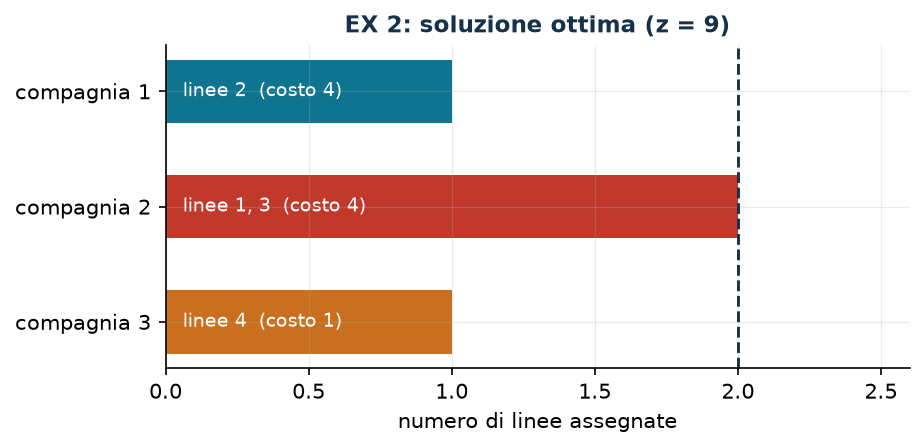

# EX 2 — Linee di autobus

**Classe:** BIP · **Legami:** nessuno (una sola famiglia di variabili) · **Script:** `python/ex02_linee.py`

[](https://colab.research.google.com/github/fabiofurini/modellazione-mip/blob/main/notebooks/ex02_linee.ipynb)

Modello numerico della famiglia [assegnamento e scheduling](scheduling.md).

!!! abstract "EX 2"
    Un comune valuta le offerte di tre compagnie di autobus per gestire quattro
    linee. Ogni compagnia ha indicato il costo con cui gestirebbe ciascuna linea:

    | Compagnia | Linea 1 | Linea 2 | Linea 3 | Linea 4 |
    |---|---:|---:|---:|---:|
    | 1 | 10 | 4 | 9 | 7 |
    | 2 | 1 | 2 | 3 | 10 |
    | 3 | 8 | 9 | 10 | 1 |

    Ogni linea va assegnata a esattamente una compagnia e ogni compagnia può
    gestire al più due linee. Si minimizza il costo totale.

## Modello

Con $x_{ij} = 1$ se la compagnia $i$ gestisce la linea $j$ ($3 \cdot 4 = 12$
variabili binarie):

$$
\begin{aligned}
\min ~~ \sum_{i=1}^{3} \sum_{j=1}^{4} c_{ij}\, x_{ij} & & \\
\text{soggetto a} \quad \sum_{i=1}^{3} x_{ij} &= 1, & \forall j \in \{1, \dots, 4\},\\
\sum_{j=1}^{4} x_{ij} &\le p, & \forall i \in \{1, 2, 3\},\\
x_{ij} &\in \{0,1\}. &
\end{aligned}
$$

Quattro vincoli di **set partitioning** (uno per linea) e tre di capacità (uno
per compagnia), con $p = 2$. È il [problema 7.1](scheduling-1.md) con la
capacità contata in *numero* di lavori invece che in tempo.

## Euristica costruttiva: il bound primale

Si scandiscono le linee nell'ordine dato e si assegna ogni linea alla compagnia più economica fra
quelle non ancora sature.

- **Linea 1**: costi $10$, $1$, $8$ → compagnia 2.
- **Linea 2**: costi $4$, $2$, $9$ → compagnia 2, che ora è satura.
- **Linea 3**: restano 1 e 3, costi $9$ e $10$ → compagnia 1.
- **Linea 4**: restano 1 e 3, costi $7$ e $1$ → compagnia 3.

Valore $1 + 2 + 9 + 1 = 13$, quindi $\mathit{UB} = 13$.

## Rilassamento LP e duale: il bound duale

Rilassando $x_{ij} \in \{0,1\}$ a $x_{ij} \ge 0$, con $\alpha_j$ libera per ogni
vincolo di linea e $\pi_i \le 0$ per ogni vincolo di capacità:

$$
\begin{aligned}
\max ~~ \sum_{j=1}^{4} \alpha_j + p \sum_{i=1}^{3} \pi_i & & \\
\text{soggetto a} \quad \alpha_j + \pi_i &\le c_{ij}, & \forall i,\ \forall j,\\
\alpha_j \gtreqless 0, \qquad \pi_i &\le 0. &
\end{aligned}
$$

Con la ricetta «azzerare e saturare», $\bar\pi = 0$ e
$\bar\alpha_j = \min_i c_{ij} = (1, 2, 3, 1)$: ammissibile per costruzione,
$\mathit{LB} = 7$. Significato: «ogni linea costa almeno l'offerta più bassa che
ha ricevuto».

| $UB$ (euristica costruttiva) | $LB$ (duale a mano) | $z(\mathit{LP})$ | $z(\mathit{MILP})$ | gap euristica |
|---:|---:|---:|---:|---:|
| 13 | 7 | 9 | 9 | $44{,}4\%$ |



!!! tip "Rilassamento esatto, ricetta duale no"
    $z(\mathit{LP}) = z(\mathit{MILP}) = 9$, ma il bound costruito a mano si
    ferma a $7$ e l'euristica sbaglia del $44\%$. Che il rilassamento sia esatto
    non dice nulla su quanto sia buona una particolare soluzione duale: sono due
    cose diverse.

## Codice

Lo script completo è
[`python/ex02_linee.py`](https://github.com/fabiofurini/modellazione-mip/blob/main/python/ex02_linee.py);
il notebook è
[`notebooks/ex02_linee.ipynb`](https://github.com/fabiofurini/modellazione-mip/blob/main/notebooks/ex02_linee.ipynb).

<!-- script-incorporato: inizio (rigenerato da python/incorpora_codice.py) -->

??? example "Mostra lo script completo — `python/ex02_linee.py` (104 righe)"

    ```python
    """EX 2 -- Linee di autobus: assegnamento con capacita' due (famiglia 7).

    Quattro linee, tre compagnie, ogni linea a una compagnia, ogni compagnia al piu'
    due linee. E' l'assegnamento generalizzato del problema 7.1 con capacita' in
    numero di lavori invece che in tempo. Modello, euristica, duale del rilassamento
    puro con soluzione costruita a mano, ottimo e tabella dei bound.
    """
    import gurobipy as gp
    import pandas as pd
    from gurobipy import GRB

    from mip import (ammissibile, due_rilassamenti, frazione, nuovo_modello, registra_bound,
                     risolvi, stampa_soluzione, valuta)
    from stile import intestazione, plt, salva_dati, salva_figura

    R = range

    # ---------- 1. MODELLO E ISTANZA ----------
    intestazione("EX 2. Linee di autobus: quattro linee, tre compagnie, al piu' due linee ciascuna")
    c = [[10, 4, 9, 7],      # costo della compagnia 1 sulle quattro linee
         [1, 2, 3, 10],
         [8, 9, 10, 1]]
    nc, nl, p = 3, 4, 2      # compagnie, linee, linee al piu' per compagnia
    salva_dati(pd.DataFrame([{"compagnia": i + 1, "linea": j + 1, "c": c[i][j]}
                             for i in R(nc) for j in R(nl)]), "ex02_costi")


    def modello(c, p):
        nc, nl = len(c), len(c[0])
        m = nuovo_modello("linee_autobus")
        x = m.addVars(nc, nl, vtype=GRB.BINARY, name="x")
        m.setObjective(gp.quicksum(c[i][j] * x[i, j] for i in R(nc) for j in R(nl)), GRB.MINIMIZE)
        m.addConstrs((x.sum("*", j) == 1 for j in R(nl)), name="linea")
        m.addConstrs((x.sum(i, "*") <= p for i in R(nc)), name="capacita")
        return m, x


    def duale(c, p):
        """max sum_j alpha_j + p sum_i beta_i;  alpha_j + beta_i <= c_ij;  alpha libera, beta <= 0."""
        nc, nl = len(c), len(c[0])
        d = nuovo_modello("duale_linee")
        alpha = d.addVars(nl, lb=-GRB.INFINITY, name="alpha")
        beta = d.addVars(nc, lb=-GRB.INFINITY, ub=0.0, name="beta")
        d.setObjective(alpha.sum() + p * beta.sum(), GRB.MAXIMIZE)
        d.addConstrs((alpha[j] + beta[i] <= c[i][j] for i in R(nc) for j in R(nl)), name="rc")
        return d


    m, x = modello(c, p)

    # ---------- 2. EURISTICA COSTRUTTIVA (UPPER BOUND) ----------
    # euristica costruttiva sulle linee: ogni linea alla compagnia piu' economica fra quelle non sature
    residuo = [p] * nc
    scelta = {}
    for j in R(nl):
        i = min((i for i in R(nc) if residuo[i] > 0), key=lambda i: (c[i][j], i))
        scelta[j] = i
        residuo[i] -= 1
        print(f"  Linea {j + 1}: compagnie con posti liberi "
              + ", ".join(f"{k + 1} (costo {c[k][j]})" for k in R(nc) if residuo[k] > 0 or k == i)
              + f"; la piu' economica e' la {i + 1}, quindi x[{i + 1}][{j + 1}] = 1")
    ub = sum(c[scelta[j]][j] for j in R(nl))
    sol_eur = {f"x[{scelta[j]},{j}]": 1 for j in R(nl)}
    assert ammissibile(m, sol_eur)
    print(f"  Soluzione euristica: " + ", ".join(f"linea {j + 1} -> compagnia {scelta[j] + 1}"
                                                 for j in R(nl))
          + f"   ub = {frazione(ub)}")

    # ---------- 3. RILASSAMENTO LP E DUALE (LOWER BOUND) ----------
    d = duale(c, p)
    mano = {f"alpha[{j}]": min(c[i][j] for i in R(nc)) for j in R(nl)}   # beta = 0
    lb, viol = valuta(d, mano)
    assert viol <= 1e-9, viol
    print("  Duale a mano (beta = 0): alpha_j = min_i c_ij = "
          + ", ".join(frazione(mano[f"alpha[{j}]"]) for j in R(nl)) + f"  ->  lb = {frazione(lb)}")
    zlp, zlpr, pi = due_rilassamenti(m, d)

    # ---------- 4. OTTIMO DEL MILP E TABELLA DEI BOUND ----------
    z = risolvi(m)
    ott = [(i, j) for i in R(nc) for j in R(nl) if x[i, j].X > 0.5]
    print("  Soluzione ottima: " + ", ".join(f"linea {j + 1} -> compagnia {i + 1}" for i, j in sorted(ott, key=lambda t: t[1])))
    riga = registra_bound("EX 2 linee di autobus", ub, lb, zlp, zlpr, z)
    salva_dati(pd.DataFrame([riga]), "ex02_bound")
    assert lb <= zlp <= z <= ub + 1e-9

    # ---------- 5. FIGURA ----------
    fig, ax = plt.subplots(figsize=(6.4, 2.8))
    for i in R(nc):
        linee = [j for (ii, j) in ott if ii == i]
        ax.barh(i, len(linee), color=["#0E7490", "#C0392B", "#CA6F1E"][i], height=0.55)
        if linee:
            ax.annotate("linee " + ", ".join(str(j + 1) for j in linee) +
                        f"  (costo {sum(c[i][j] for j in linee)})",
                        (0.06, i), va="center", fontsize=9, color="white")
    ax.axvline(p, color="#16324A", ls="--", lw=1.4)
    ax.annotate(f"al più {p}", (p, -0.55), ha="center", fontsize=9, color="#16324A")
    ax.set_yticks(R(nc))
    ax.set_yticklabels([f"compagnia {i + 1}" for i in R(nc)])
    ax.set_xlabel("numero di linee assegnate")
    ax.set_xlim(0, p + 0.6)
    ax.set_title(f"EX 2: soluzione ottima (z = {frazione(z)})")
    ax.invert_yaxis()
    salva_figura(fig, "ex02_ottimo")
    print("Fine.")
    ```

<!-- script-incorporato: fine -->
