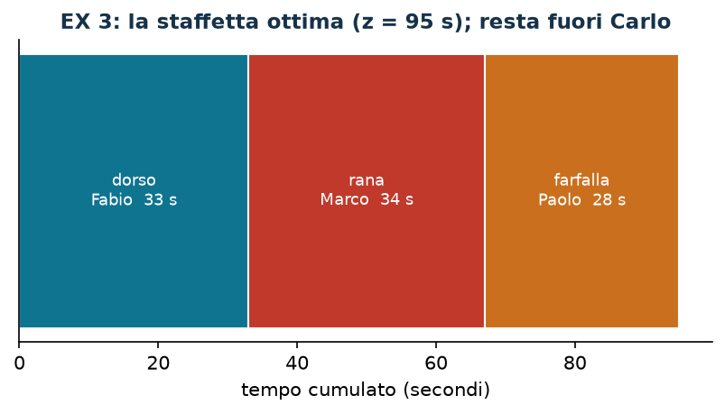

# EX 3 — Staffetta

**Classe:** BIP · **Legami:** nessuno (una sola famiglia di variabili) · **Script:** `python/ex03_staffetta.py`

[](https://colab.research.google.com/github/fabiofurini/modellazione-mip/blob/main/notebooks/ex03_staffetta.ipynb)

Modello numerico della famiglia [assegnamento e scheduling](scheduling.md).

!!! abstract "EX 3"
    Un allenatore deve formare una staffetta scegliendo tre nuotatori fra
    quattro. La gara ha tre frazioni da 50 metri: dorso, rana e farfalla. I
    tempi registrati (secondi) sono:

    | Stile | Carlo | Paolo | Fabio | Marco |
    |---|---:|---:|---:|---:|
    | Dorso | 37 | 32 | 33 | 37 |
    | Rana | 43 | 33 | 42 | 34 |
    | Farfalla | 33 | 28 | 38 | 30 |

    Si minimizza il tempo totale della staffetta.

## Modello

Con $x_{sn} = 1$ se lo stile $s$ è nuotato da $n$ ($12$ binarie):
$\sum_n x_{sn} = 1$ per ogni stile (3 vincoli), $\sum_s x_{sn} \le 1$ per ogni
nuotatore (4 vincoli), obiettivo $\min \sum_{s,n} t_{sn} x_{sn}$. Un nuotatore
resta fuori: è un assegnamento con **più risorse che compiti**.

## Euristica costruttiva: il bound primale

Euristica costruttiva sugli stili nell'ordine dato: dorso a Paolo ($32$), rana a Marco ($34$,
il più veloce fra i tre rimasti), farfalla a Carlo ($33$). Totale
$\mathit{UB} = 99$ secondi.

## Rilassamento LP e duale: il bound duale

Stessa struttura di [EX 2](ex-02.md) con $p = 1$: $\bar\pi = 0$ e
$\bar\alpha_s = \min_n t_{sn} = (32, 33, 28)$, quindi $\mathit{LB} = 93$.
Significato: «ogni stile costa almeno il tempo del suo migliore specialista».

Il bound è debole proprio quando due stili hanno lo stesso specialista migliore
— qui Paolo è il più veloce sia nel dorso sia nella farfalla, e infatti $93$ non
è raggiungibile.

| $UB$ (euristica costruttiva) | $LB$ (duale a mano) | $z(\mathit{LP})$ | $z(\mathit{MILP})$ | gap euristica |
|---:|---:|---:|---:|---:|
| 99 | 93 | 95 | 95 | $4{,}2\%$ |

L'ottimo è $95$ secondi: dorso a Fabio ($33$), rana a Marco ($34$), farfalla a
Paolo ($28$); resta fuori Carlo.



!!! note "Perché qui il rilassamento è esatto"
    La matrice del modello è quella del problema di assegnamento: **totalmente
    unimodulare**. Tutti i vertici del rilassamento sono interi, quindi
    $z(\mathit{LP}) = z(\mathit{MILP})$ e l'interezza non costa nulla — lo
    stesso fenomeno dell'[alldiff](legami-12.md). Non è così, invece, appena si
    aggiunge un vincolo di capacità con coefficienti diversi da $0$ e $1$.

## Codice

Lo script completo è
[`python/ex03_staffetta.py`](https://github.com/fabiofurini/modellazione-mip/blob/main/python/ex03_staffetta.py);
il notebook è
[`notebooks/ex03_staffetta.ipynb`](https://github.com/fabiofurini/modellazione-mip/blob/main/notebooks/ex03_staffetta.ipynb).

<!-- script-incorporato: inizio (rigenerato da python/incorpora_codice.py) -->

??? example "Mostra lo script completo — `python/ex03_staffetta.py` (110 righe)"

    ```python
    """EX 3 -- Staffetta: tre stili, quattro nuotatori, uno resta fuori (famiglia 7).

    Un assegnamento con piu' "macchine" che "lavori": ogni stile a esattamente un
    nuotatore, ogni nuotatore al piu' uno stile. Il vincolo di capacita' e' unitario,
    quindi la matrice e' quella dell'assegnamento: totalmente unimodulare, e il
    rilassamento e' esatto.
    """
    import gurobipy as gp
    import pandas as pd
    from gurobipy import GRB

    from mip import (ammissibile, due_rilassamenti, frazione, nuovo_modello, registra_bound,
                     risolvi, valuta)
    from stile import intestazione, plt, salva_dati, salva_figura

    R = range

    # ---------- 1. MODELLO E ISTANZA ----------
    intestazione("EX 3. Staffetta: tre stili da assegnare a quattro nuotatori")
    NUOTATORI = ["Carlo", "Paolo", "Fabio", "Marco"]
    STILI = ["dorso", "rana", "farfalla"]
    t = [[37, 32, 33, 37],   # dorso
         [43, 33, 42, 34],   # rana
         [33, 28, 38, 30]]   # farfalla
    ns, nn = 3, 4
    salva_dati(pd.DataFrame([{"stile": STILI[s], "nuotatore": NUOTATORI[n], "t": t[s][n]}
                             for s in R(ns) for n in R(nn)]), "ex03_tempi")


    def modello(t):
        ns, nn = len(t), len(t[0])
        m = nuovo_modello("staffetta")
        x = m.addVars(ns, nn, vtype=GRB.BINARY, name="x")
        m.setObjective(gp.quicksum(t[s][n] * x[s, n] for s in R(ns) for n in R(nn)), GRB.MINIMIZE)
        m.addConstrs((x.sum(s, "*") == 1 for s in R(ns)), name="stile")
        m.addConstrs((x.sum("*", n) <= 1 for n in R(nn)), name="nuotatore")
        return m, x


    def duale(t):
        """max sum_s alpha_s + sum_n beta_n;  alpha_s + beta_n <= t_sn;  alpha libera, beta <= 0."""
        ns, nn = len(t), len(t[0])
        d = nuovo_modello("duale_staffetta")
        alpha = d.addVars(ns, lb=-GRB.INFINITY, name="alpha")
        beta = d.addVars(nn, lb=-GRB.INFINITY, ub=0.0, name="beta")
        d.setObjective(alpha.sum() + beta.sum(), GRB.MAXIMIZE)
        d.addConstrs((alpha[s] + beta[n] <= t[s][n] for s in R(ns) for n in R(nn)), name="rc")
        return d


    m, x = modello(t)

    # ---------- 2. EURISTICA COSTRUTTIVA (UPPER BOUND) ----------
    # euristica costruttiva sugli stili nell'ordine dato: il nuotatore piu' veloce fra quelli liberi
    liberi = set(R(nn))
    scelta = {}
    for s in R(ns):
        n = min(liberi, key=lambda n: (t[s][n], n))
        scelta[s] = n
        liberi.discard(n)
        print(f"  {STILI[s].capitalize()}: nuotatori liberi "
              + ", ".join(f"{NUOTATORI[k]} ({t[s][k]} s)" for k in sorted(liberi | {n}))
              + f"; il piu' veloce e' {NUOTATORI[n]}")
    ub = sum(t[s][scelta[s]] for s in R(ns))
    sol_eur = {f"x[{s},{scelta[s]}]": 1 for s in R(ns)}
    assert ammissibile(m, sol_eur)
    print(f"  Soluzione euristica: " + ", ".join(f"{STILI[s]} -> {NUOTATORI[scelta[s]]}" for s in R(ns))
          + f"   ub = {frazione(ub)} s")

    # ---------- 3. RILASSAMENTO LP E DUALE (LOWER BOUND) ----------
    d = duale(t)
    mano = {f"alpha[{s}]": min(t[s]) for s in R(ns)}       # beta = 0
    lb, viol = valuta(d, mano)
    assert viol <= 1e-9, viol
    print("  Duale a mano (beta = 0): alpha_s = min_n t_sn = "
          + ", ".join(frazione(mano[f"alpha[{s}]"]) for s in R(ns)) + f"  ->  lb = {frazione(lb)} s")
    print("  Significato: «ogni stile costa almeno il tempo del suo miglior specialista»;")
    print("  il bound e' debole quando due stili hanno lo stesso specialista migliore.")
    zlp, zlpr, pi = due_rilassamenti(m, d)

    # ---------- 4. OTTIMO DEL MILP E TABELLA DEI BOUND ----------
    z = risolvi(m)
    ott = {s: n for s in R(ns) for n in R(nn) if x[s, n].X > 0.5}
    fuori = [NUOTATORI[n] for n in R(nn) if n not in ott.values()]
    print("  Soluzione ottima: " + ", ".join(f"{STILI[s]} -> {NUOTATORI[ott[s]]} ({t[s][ott[s]]} s)"
                                             for s in R(ns))
          + f"   totale {frazione(z)} s; resta fuori {', '.join(fuori)}")
    riga = registra_bound("EX 3 staffetta", ub, lb, zlp, zlpr, z)
    salva_dati(pd.DataFrame([riga]), "ex03_bound")
    assert lb <= zlp <= z <= ub + 1e-9
    assert abs(zlp - z) < 1e-9, "la matrice dell'assegnamento e' TU: il rilassamento e' esatto"
    print("  z(LP) = z(MILP): la matrice del modello e' quella dell'assegnamento, totalmente")
    print("  unimodulare, quindi il rilassamento ha vertici interi e l'interezza e' gratis.")

    # ---------- 5. FIGURA ----------
    fig, ax = plt.subplots(figsize=(6.6, 2.9))
    colori = ["#0E7490", "#C0392B", "#CA6F1E"]
    inizio = 0
    for s in R(ns):
        ax.barh(0, t[s][ott[s]], left=inizio, color=colori[s], edgecolor="white")
        ax.annotate(f"{STILI[s]}\n{NUOTATORI[ott[s]]}  {t[s][ott[s]]} s",
                    (inizio + t[s][ott[s]] / 2, 0), ha="center", va="center",
                    fontsize=8.5, color="white")
        inizio += t[s][ott[s]]
    ax.set_yticks([])
    ax.set_xlabel("tempo cumulato (secondi)")
    ax.set_title(f"EX 3: la staffetta ottima (z = {frazione(z)} s); resta fuori {fuori[0]}")
    ax.grid(False)
    salva_figura(fig, "ex03_ottimo")
    print("Fine.")
    ```

<!-- script-incorporato: fine -->
