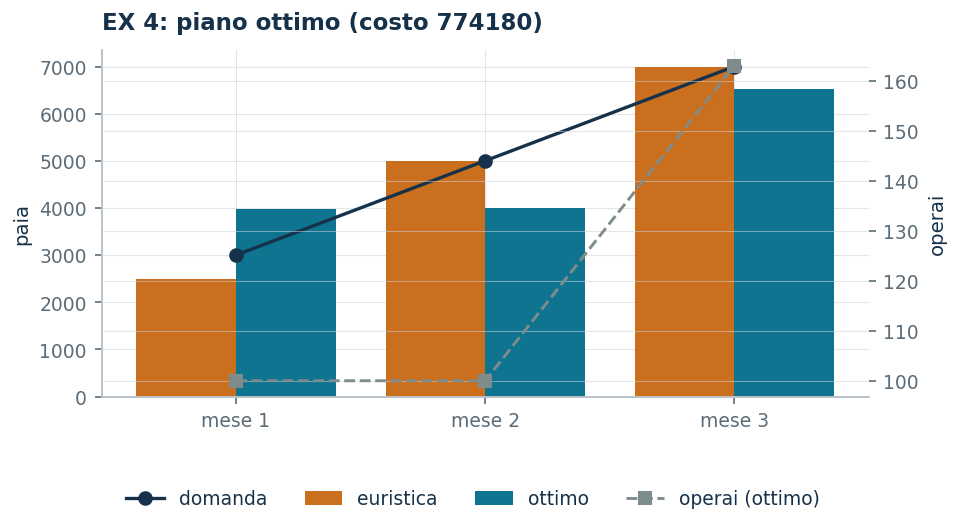

# EX 4 — Scarpe: produzione, scorte e assunzioni

**Classe:** MILP · **Legami:** bilancio delle scorte, [conteggi interi](legami-04.md) · **Script:** `python/ex04_scarpe.py`<br><br>
**Difficoltà:** ★★★★☆ · **Tempo:** 45–60 min
{ .scheda }

[](https://colab.research.google.com/github/fabiofurini/modellazione-mip/blob/main/notebooks/ex04_scarpe.ipynb)

Uno dei [quindici modelli numerici](numerici.md), della famiglia
[pianificazione della produzione](produzione.md).

!!! abstract "EX 4"
    Nei prossimi tre mesi un calzaturificio deve soddisfare domande mensili di
    $3000$, $5000$ e $7000$ paia di scarpe. All'inizio del primo mese ha $500$
    paia in magazzino e impiega $100$ operai. Ogni operaio è pagato $1500$ euro
    al mese e lavora $160$ ore; produrre un paio richiede $4$ ore di lavoro e
    $15$ euro di materie prime. All'inizio di ogni mese si possono assumere
    operai, al costo di $100$ euro ciascuno per la formazione. Tenere un paio
    invenduto in magazzino a fine mese costa $3$ euro. Si vuole il piano di
    produzione e di gestione del personale di costo totale minimo.

## Modello

I mesi sono tre. Servono quattro famiglie di variabili, una per decisione:

- $x_t$ — paia prodotte nel mese $t$, per $t \in \{1, 2, 3\}$;
- $s_t$ — paia in magazzino a fine mese $t$, per $t \in \{1, 2\}$;
- $y_t$ — operai in servizio nel mese $t$, per $t \in \{1, 2, 3\}$;
- $z_t$ — operai assunti all'inizio del mese $t$, per $t \in \{1, 2, 3\}$.

Le prime due sono quantità di prodotto, le altre due sono **conteggi di
persone**: per questo $y_t$ e $z_t$ sono dichiarate intere.

Undici colonne: tre per la produzione, due per le scorte, tre per l'organico e
tre per le assunzioni. La domanda del primo mese è $3000 - 500 = 2500$ paia
nette; in tutto vanno prodotte $14\,500$ paia.

<!-- modello-esteso: ex04_primale -->

<div class="modello-esteso largo" markdown>

$$
\begin{array}{rrrrrrrrrrrr c l}
\min & 15x_1 & +15x_2 & +15x_3 & +3s_1 & +3s_2 & +1500y_1 & +1500y_2 & +1500y_3 & +100z_1 & +100z_2 & +100z_3 &  & \\
\text{soggetto a} & x_1 &  &  & -s_1 &  &  &  &  &  &  &  & = & 2500\\
 &  & x_2 &  & +s_1 & -s_2 &  &  &  &  &  &  & = & 5000\\
 &  &  & x_3 &  & +s_2 &  &  &  &  &  &  & = & 7000\\
 & -4x_1 &  &  &  &  & +160y_1 &  &  &  &  &  & \ge & 0\\
 &  & -4x_2 &  &  &  &  & +160y_2 &  &  &  &  & \ge & 0\\
 &  &  & -4x_3 &  &  &  &  & +160y_3 &  &  &  & \ge & 0\\
 &  &  &  &  &  & y_1 &  &  & -z_1 &  &  & = & 100\\
 &  &  &  &  &  & -y_1 & +y_2 &  &  & -z_2 &  & = & 0\\
 &  &  &  &  &  &  & -y_2 & +y_3 &  &  & -z_3 & = & 0\\
 & x_1, & x_2, & x_3 &  &  &  &  &  &  &  &  & \ge & 0\\
 &  &  &  & s_1, & s_2 &  &  &  &  &  &  & \ge & 0\\
 &  &  &  &  &  & y_1, & y_2, & y_3 &  &  &  & \in & \Z_{\ge 0}\\
 &  &  &  &  &  &  &  &  & z_1, & z_2, & z_3 & \in & \Z_{\ge 0}
\end{array}
$$

</div>

<!-- modello-esteso: fine -->

I primi tre vincoli sono i **bilanci delle scorte**, uno per mese: quanto si
produce più quanto si aveva, meno quanto resta, copre la domanda. I tre
successivi sono le **ore disponibili**: $160$ ore per operaio in servizio devono
bastare alle $4$ ore per paio. Gli ultimi tre sono i **bilanci dell'organico**:
gli operai di questo mese sono quelli del mese scorso più gli assunti.

## Euristica costruttiva: il bound primale

Produzione «just in time»: ogni mese si produce la domanda netta, senza scorte,
assumendo quanti operai servono.

- **Mese 1**: $10\,000$ ore, servono $63$ operai — bastano i $100$ già in
  servizio.
- **Mese 2**: $20\,000$ ore, servono $125$ operai — se ne assumono $25$.
- **Mese 3**: $28\,000$ ore, servono $175$ operai — se ne assumono altri $50$.

Il costo di questo piano è $\mathit{UB} = 825\,000$.

## Rilassamento LP e duale: il bound duale

Il rilassamento LP sostituisce l'interezza di $y_t$ e $z_t$ con la sola non
negatività. Il duale ha una variabile **libera** $\alpha_t$ per ogni bilancio
delle scorte, una variabile **non negativa** $\beta_t$ per ogni vincolo delle ore
e una variabile **libera** $\gamma_t$ per ogni bilancio dell'organico; le undici
colonne del primale danno undici vincoli duali:

<!-- modello-esteso: ex04_duale -->

<div class="modello-esteso largo" markdown>

$$
\begin{array}{rrrrrrrrrr c l}
\max & 2500\alpha_1 & +5000\alpha_2 & +7000\alpha_3 &  &  &  & +100\gamma_1 &  &  &  & \\
\text{soggetto a} & \alpha_1 &  &  & -4\beta_1 &  &  &  &  &  & \le & 15\\
 &  & \alpha_2 &  &  & -4\beta_2 &  &  &  &  & \le & 15\\
 &  &  & \alpha_3 &  &  & -4\beta_3 &  &  &  & \le & 15\\
 & -\alpha_1 & +\alpha_2 &  &  &  &  &  &  &  & \le & 3\\
 &  & -\alpha_2 & +\alpha_3 &  &  &  &  &  &  & \le & 3\\
 &  &  &  & 160\beta_1 &  &  & +\gamma_1 & -\gamma_2 &  & \le & 1500\\
 &  &  &  &  & 160\beta_2 &  &  & +\gamma_2 & -\gamma_3 & \le & 1500\\
 &  &  &  &  &  & 160\beta_3 &  &  & +\gamma_3 & \le & 1500\\
 &  &  &  &  &  &  & -\gamma_1 &  &  & \le & 100\\
 &  &  &  &  &  &  &  & -\gamma_2 &  & \le & 100\\
 &  &  &  &  &  &  &  &  & -\gamma_3 & \le & 100\\
 & \alpha_1, & \alpha_2, & \alpha_3 &  &  &  &  &  &  & \gtreqless & 0\\
 &  &  &  & \beta_1, & \beta_2, & \beta_3 &  &  &  & \ge & 0\\
 &  &  &  &  &  &  & \gamma_1, & \gamma_2, & \gamma_3 & \gtreqless & 0
\end{array}
$$

</div>

<!-- modello-esteso: fine -->

**Una soluzione duale a mano.** Si pone $\gamma = 0$ e si fa valere un'ora di
lavoro quanto davvero costa,

$$\bar\beta_t = \frac{1500}{160} = \frac{75}{8},$$

da cui un paio vale al più

$$\bar\alpha_t = 15 + 4 \cdot \frac{75}{8} = \frac{105}{2} = 52{,}5.$$

Tutte le colonne duali sono soddisfatte, e il bound è

$$\mathit{LB} = \frac{105}{2} \cdot 14\,500 = 761\,250.$$

## Ottimo e confronto

| $\mathit{UB}$ | $\mathit{LB}$ | $z(\mathit{LP})$ | $z(\mathit{LP}^+)$ | $z(\mathit{MILP})$ |
|---:|---:|---:|---:|---:|
| 825 000 | 761 250 | 773 500 | 773 500 | 774 180 |

Il piano ottimo produce $3980$, $4000$ e $6520$ paia con $100$, $100$ e $163$
operai: si tengono $1480$ paia in magazzino a fine primo mese e $480$ a fine
secondo, e si assumono $63$ operai **una volta sola**, nel terzo mese.

!!! tip "Perché conviene fare scorta"
    Anticipare la produzione costa $3$ euro al paio e fa risparmiare stipendi:
    è il compromesso che il modello risolve da sé. Alzando il costo di magazzino
    a $20$ euro le scorte scendono a $1000$ e $0$ (ottimo $807\,500$); a $60$
    euro spariscono del tutto e si ricade sul piano «just in time»
    dell'euristica.



## Codice

Lo script completo è
[`python/ex04_scarpe.py`](https://github.com/fabiofurini/modellazione-mip/blob/main/python/ex04_scarpe.py);
il notebook è
[`notebooks/ex04_scarpe.ipynb`](https://github.com/fabiofurini/modellazione-mip/blob/main/notebooks/ex04_scarpe.ipynb).

<!-- script-incorporato: inizio (rigenerato da python/incorpora_codice.py) -->

??? example "Mostra lo script completo — `python/ex04_scarpe.py` (176 righe)"

    ```python
    """EX 4 -- Produzione di scarpe e manodopera su tre mesi (famiglia 9).

    Bilancio delle scorte, ore di lavoro proporzionali alla produzione e dinamica
    della forza lavoro con sole assunzioni. E' la versione numerica del problema 9.2,
    con la stessa struttura: un vincolo di bilancio per periodo e un vincolo di
    conservazione per la manodopera.
    """
    import gurobipy as gp
    import pandas as pd
    from gurobipy import GRB

    from mip import (ammissibile, due_rilassamenti, frazione, nuovo_modello, registra_bound,
                     risolvi, valuta)
    from stile import ARANCIO, BLU, GRIGIO, TEAL, intestazione, plt, salva_dati, salva_figura
    from esteso import salva_modello

    R = range

    # ---------- 1. MODELLO E ISTANZA ----------
    intestazione("EX 4. Scarpe: produzione, scorte e assunzioni su tre mesi")
    d3 = [3000, 5000, 7000]      # domanda mensile in paia
    s0 = 500                     # scorte iniziali
    y0 = 100                     # operai in servizio all'inizio
    w3 = 1500                    # stipendio mensile di un operaio
    ore3 = 160                   # ore lavorate al mese da un operaio
    ore_paio = 4                 # ore di lavoro per un paio
    mat3 = 15                    # materie prime per un paio
    ass3 = 100                   # costo di assunzione di un operaio
    mag3 = 3                     # costo di magazzino per un paio a fine mese
    T = len(d3)
    salva_dati(pd.DataFrame({"mese": R(1, T + 1), "domanda": d3}), "ex04_domanda")
    netta = [d3[0] - s0] + d3[1:]
    print(f"  Domanda netta del primo mese: {d3[0]} - {s0} = {netta[0]} paia; totale da produrre "
          f"{sum(netta)} paia.")


    def modello(d, s0, y0, mag=None):
        mag = mag3 if mag is None else mag
        T = len(d)
        m = nuovo_modello("scarpe")
        x = m.addVars(T, name="x")                       # paia prodotte
        s = m.addVars(T - 1, name="s")                   # scorte a fine mese
        y = m.addVars(T, vtype=GRB.INTEGER, name="y")    # operai in servizio
        z = m.addVars(T, vtype=GRB.INTEGER, name="z")    # operai assunti
        m.setObjective(mat3 * x.sum() + mag * s.sum() + w3 * y.sum() + ass3 * z.sum(),
                       GRB.MINIMIZE)
        m.addConstr(x[0] - s[0] == d[0] - s0, name="bilancio[0]")
        for t in R(1, T - 1):
            m.addConstr(x[t] + s[t - 1] - s[t] == d[t], name=f"bilancio[{t}]")
        m.addConstr(x[T - 1] + s[T - 2] == d[T - 1], name=f"bilancio[{T - 1}]")
        m.addConstrs((ore3 * y[t] - ore_paio * x[t] >= 0 for t in R(T)), name="ore")
        m.addConstr(y[0] - z[0] == y0, name="organico[0]")
        m.addConstrs((y[t] - y[t - 1] - z[t] == 0 for t in R(1, T)), name="organico")
        return m, x, s, y, z


    def duale(d, s0, y0):
        """max sum_t b_t alpha_t + y0 gamma_1  con alpha, gamma libere e beta >= 0.

        Colonne:  x_t: alpha_t - ore_paio beta_t <= mat
                  s_t: -alpha_t + alpha_{t+1} <= mag
                  y_t: ore beta_t + gamma_t - gamma_{t+1} <= w   (gamma_{T+1} = 0)
                  z_t: -gamma_t <= ass
        """
        T = len(d)
        dl = nuovo_modello("duale_scarpe")
        alpha = dl.addVars(T, lb=-GRB.INFINITY, name="alpha")
        beta = dl.addVars(T, name="beta")
        gamma = dl.addVars(T, lb=-GRB.INFINITY, name="gamma")
        b = [d[0] - s0] + list(d[1:])
        dl.setObjective(gp.quicksum(b[t] * alpha[t] for t in R(T)) + y0 * gamma[0], GRB.MAXIMIZE)
        dl.addConstrs((alpha[t] - ore_paio * beta[t] <= mat3 for t in R(T)), name="rcx")
        dl.addConstrs((-alpha[t] + alpha[t + 1] <= mag3 for t in R(T - 1)), name="rcs")
        for t in R(T):
            succ = gamma[t + 1] if t + 1 < T else 0
            dl.addConstr(ore3 * beta[t] + gamma[t] - succ <= w3, name=f"rcy[{t}]")
        dl.addConstrs((-gamma[t] <= ass3 for t in R(T)), name="rcz")
        return dl


    m3, x3, s3, y3, z3 = modello(d3, s0, y0)
    salva_modello(m3, "ex04_primale")

    # ---------- 2. EURISTICA COSTRUTTIVA (UPPER BOUND) ----------
    # produzione "just in time": ogni mese si produce esattamente la domanda netta,
    # senza scorte, assumendo il numero di operai che serve
    def euristica(d, s0, y0):
        T = len(d)
        b = [d[0] - s0] + list(d[1:])
        x = [float(v) for v in b]
        s = [0.0] * (T - 1)
        y, z, passi = [], [], []
        organico = y0
        for t in R(T):
            serve = -(-int(ore_paio * x[t]) // ore3)     # ceil
            nuovi = max(0, serve - organico)
            organico = max(organico, serve)
            y.append(organico)
            z.append(nuovi)
            passi.append(f"mese {t + 1}: si producono {int(x[t])} paia, servono "
                         f"{int(ore_paio * x[t])} ore, cioe' {serve} operai; se ne assumono "
                         f"{nuovi} e l'organico sale a {organico}")
        return x, s, y, z, passi


    x_e, s_e, y_e, z_e, passi = euristica(d3, s0, y0)
    for k, riga in enumerate(passi, 1):
        print(f"  Passo {k}. {riga}")
    ub3 = (mat3 * sum(x_e) + mag3 * sum(s_e) + w3 * sum(y_e) + ass3 * sum(z_e))
    sol_eur = ({f"x[{t}]": x_e[t] for t in R(T)} | {f"s[{t}]": s_e[t] for t in R(T - 1)}
               | {f"y[{t}]": y_e[t] for t in R(T)} | {f"z[{t}]": z_e[t] for t in R(T)})
    assert ammissibile(m3, sol_eur), sol_eur
    print(f"  Costo della soluzione euristica: ub = {frazione(ub3)}")

    # ---------- 3. RILASSAMENTO LP E DUALE (LOWER BOUND) ----------
    dl3 = duale(d3, s0, y0)
    salva_modello(dl3, "ex04_duale")
    # ricetta: l'ora di lavoro vale beta = w / ore (quanto costa davvero), quindi un
    # paio vale al piu' alpha = mat + ore_paio * beta; gamma = 0
    beta_v = w3 / ore3
    alpha_v = mat3 + ore_paio * beta_v
    mano = {f"beta[{t}]": beta_v for t in R(T)} | {f"alpha[{t}]": alpha_v for t in R(T)}
    lb3, viol = valuta(dl3, mano)
    assert viol <= 1e-9, viol
    print(f"  Duale a mano: gamma = 0, beta_t = {w3}/{ore3} = {frazione(beta_v)} euro l'ora")
    print(f"  (il costo vero di un'ora di lavoro) e alpha_t = {mat3} + {ore_paio} * "
          f"{frazione(beta_v)} = {frazione(alpha_v)} euro al paio.")
    print(f"  lb = {frazione(alpha_v)} * {sum(netta)} = {frazione(lb3)}")
    zlp3, zlp3r, _ = due_rilassamenti(m3, dl3)

    # ---------- 4. OTTIMO DEL MILP ----------
    z3v = risolvi(m3)
    print("  Soluzione ottima:")
    for t in R(T):
        scorta = s3[t].X if t < T - 1 else 0.0
        print(f"    mese {t + 1}: {frazione(x3[t].X)} paia, {int(y3[t].X)} operai "
              f"({int(z3[t].X)} assunti), scorte a fine mese {frazione(scorta)}")
    riga = registra_bound("EX 4 scarpe", ub3, lb3, zlp3, zlp3r, z3v)
    salva_dati(pd.DataFrame([riga]), "ex04_bound")
    assert lb3 <= zlp3 <= z3v <= ub3 + 1e-9

    # ---------- 5. PERCHE' CONVIENE ANTICIPARE LA PRODUZIONE ----------
    intestazione("EX 4. Magazzino contro assunzioni")
    print(f"  Tenere un paio in magazzino per un mese costa {mag3} euro; assumere un operaio")
    print(f"  costa {ass3} euro una tantum piu' {w3} euro al mese. L'ottimo anticipa la")
    print("  produzione proprio per non dover assumere all'ultimo momento.")
    prove = []
    for nome, mag in [("magazzino a 3 euro", 3), ("magazzino a 20 euro", 20),
                      ("magazzino a 60 euro", 60)]:
        m, x, s, y, z = modello(d3, s0, y0, mag=mag)
        val = risolvi(m)
        scorte = [s[t].X for t in R(T - 1)]
        print(f"  {nome:24s} z = {frazione(val):>10}   scorte "
              + ", ".join(frazione(v) for v in scorte))
        prove.append({"variante": nome, "z": val,
                      "scorte": " ".join(str(int(v)) for v in scorte)})
    salva_dati(pd.DataFrame(prove), "ex04_varianti")

    # ---------- 6. FIGURA ----------
    fig, ax = plt.subplots(figsize=(6.6, 3.0))
    idx = list(R(T))
    ax.bar([t - 0.2 for t in idx], [x_e[t] for t in idx], 0.4, color=ARANCIO, label="euristica")
    ax.bar([t + 0.2 for t in idx], [x3[t].X for t in idx], 0.4, color=TEAL, label="ottimo")
    ax.plot(idx, d3, marker="o", color=BLU, lw=1.6, label="domanda")
    ax2 = ax.twinx()
    ax2.plot(idx, [y3[t].X for t in idx], marker="s", color=GRIGIO, ls="--", lw=1.4,
             label="operai (ottimo)")
    ax2.set_ylabel("operai")
    ax.set_xticks(idx)
    ax.set_xticklabels([f"mese {t + 1}" for t in idx])
    ax.set_ylabel("paia")
    ax.set_title(f"EX 4: piano ottimo (costo {frazione(z3v)})")
    ax.legend(fontsize=8, loc="upper left")
    ax2.legend(fontsize=8, loc="lower right")
    salva_figura(fig, "ex04_piano")
    print("Fine.")
    ```

<!-- script-incorporato: fine -->
