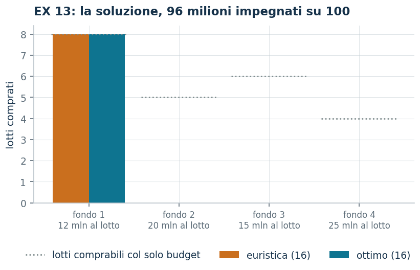

# EX 5 — Fondi acquistabili a lotti

**Classe:** ILP · **Legami:** [conteggi interi](legami-04.md), vincolo di proporzione · **Script:** `python/ex05_fondi.py`<br><br>
**Difficoltà:** ★☆☆☆☆ · **Tempo:** 30–45 min
{ .scheda }

[](https://colab.research.google.com/github/fabiofurini/modellazione-mip/blob/main/notebooks/ex05_fondi.ipynb)

Uno dei [quindici modelli numerici](numerici.md): due sole variabili, ed è il
posto giusto per vedere come si verifica un certificato duale.

!!! abstract "EX 5"
    Dopo una vincita, un investitore deve decidere come impiegare $100$ milioni
    di lire. Un amico gli suggerisce quattro tipi di fondo comune. Le quote si
    acquistano solo a **lotti indivisibili**, che costano rispettivamente $12$,
    $20$, $15$ e $25$ milioni. Il rendimento annuo stimato è $1/6$ del capitale
    investito per il primo fondo, il $15\%$ per il secondo, $2/15$ per il terzo e
    il $12\%$ per il quarto. Inoltre il numero di lotti del secondo fondo non può
    superare il $50\%$ del numero totale di lotti acquistati. Si vuole
    massimizzare il rendimento annuo atteso.

## Modello

Il rendimento di un lotto vale $12 \cdot 1/6 = 2$ milioni per il primo fondo,
$20 \cdot 0{,}15 = 3$ per il secondo, $15 \cdot 2/15 = 2$ per il terzo e
$25 \cdot 0{,}12 = 3$ per il quarto. Il vincolo di quota
$x_2 \le \tfrac12 (x_1 + x_2 + x_3 + x_4)$, moltiplicato per $2$ e portato a
sinistra, diventa $-x_1 + x_2 - x_3 - x_4 \le 0$. Con $x_j$ il numero di lotti
del fondo $j$:

<!-- modello-esteso: ex05_primale -->

<div class="modello-esteso" markdown>

$$
\begin{array}{rrrrr c l}
\max & 2x_1 & +3x_2 & +2x_3 & +3x_4 &  & \\
\text{soggetto a} & 12x_1 & +20x_2 & +15x_3 & +25x_4 & \le & 100\\
 & -x_1 & +x_2 & -x_3 & -x_4 & \le & 0\\
 & x_1, & x_2, & x_3, & x_4 & \in & \Z_{\ge 0}
\end{array}
$$

</div>

<!-- modello-esteso: fine -->

Uno **zaino intero**, non binario: le variabili contano lotti, non scelte. La
prima riga è il **budget**, la seconda la **quota** del secondo fondo, scritta
in forma lineare; l'ultima dichiara le quattro variabili intere e non negative.

## Euristica costruttiva: il bound primale

È un **massimo**. Si scandiscono i fondi in ordine di rendimento per milione
investito: $2/12 = 1/6$ per il primo e $3/20$ per il secondo. Si parte dal primo,
se ne comprano $8$ lotti ($96$ milioni) e restano $4$ milioni, che non bastano
per un altro lotto di nessuno dei due tipi.

$$\mathit{LB} = 16.$$

## Rilassamento LP e duale: il bound duale

Con $\alpha \ge 0$ sul budget e $\beta \ge 0$ sulla quota:

$$\min ~ 100 \alpha \quad\text{soggetto a}\quad 12 \alpha - \beta \ge 2, \qquad 20 \alpha + \beta \ge 3.$$

!!! danger "Un tentativo che non è ammissibile"
    Una bozza di questo esercizio proponeva $\bar\alpha = 5/32$,
    $\bar\beta = 1/8$. Verifichiamo il primo vincolo:

    $$12 \cdot \frac{5}{32} - \frac{1}{8} = \frac{60}{32} - \frac{4}{32} = \frac{56}{32} = \frac{7}{4} < 2.$$

    È violato di $1/4$: quella coppia **non** è una soluzione duale ammissibile,
    e il valore $100 \cdot 5/32$ non è un bound. Un valore duale si può leggere
    come bound solo dopo aver verificato *tutti* i vincoli, uno per uno.

**La ricetta corretta** è $\bar\beta = 0$ e

$$\bar\alpha = \max_j \frac{p_j}{c_j} = \max\Bigl(\frac{2}{12}, \frac{3}{20}\Bigr) = \frac{1}{6},$$

cioè «il milione vale quanto rende nel fondo migliore». Entrambi i vincoli
diventano $c_j\, \bar\alpha \ge p_j$ e sono soddisfatti, e

$$\mathit{UB} = 100 \cdot \frac{1}{6} = \frac{50}{3} \approx 16{,}67.$$

<!-- modello-esteso: ex05_duale -->

<div class="modello-esteso" markdown>

$$
\begin{array}{rrr c l}
\min & 100\alpha &  &  & \\
\text{soggetto a} & 12\alpha & -\beta & \ge & 2\\
 & 20\alpha & +\beta & \ge & 3\\
 & 15\alpha & -\beta & \ge & 2\\
 & 25\alpha & -\beta & \ge & 3\\
 & \alpha &  & \ge & 0\\
 &  & \beta & \ge & 0
\end{array}
$$

</div>

<!-- modello-esteso: fine -->

La variabile $\alpha$ è il prezzo di un milione di budget, $\beta$ quello della
quota. Una sola riga per fondo: comprare un lotto del fondo $j$ impegna $c_j$
milioni e sposta la quota di una unità — nel verso che l'aiuta per il fondo 2,
nel verso contrario per gli altri — e il totale deve coprire il rendimento del
lotto. L'obiettivo valuta a quel prezzo tutto il budget.


## Ottimo e confronto

| $\mathit{LB}$ | $\mathit{UB}$ | $z(\mathit{LP})$ | $z(\mathit{LP}^+)$ | $z(\mathit{MILP})$ |
|---:|---:|---:|---:|---:|
| 16 | $50/3$ | $50/3$ | $50/3$ | 16 |

L'euristica trova l'ottimo: $8$ lotti del primo fondo e nessuno del secondo, per
$16$ milioni di rendimento. La differenza $50/3 - 16 = 2/3$ è il **prezzo
dell'interezza**: il rilassamento comprerebbe $25/3$ lotti del primo fondo, che
non si possono acquistare a pezzi.

!!! tip "Un vincolo che non morde, e come farlo mordere"
    Sui dati dell'istanza il vincolo di quota non morde, perché il primo fondo
    rende di più per milione investito e all'ottimo il secondo non si compra
    affatto. La quota diventa attiva appena il secondo fondo rende il $20\%$,
    cioè $4$ milioni a lotto: allora senza quota l'ottimo sarebbe $20$ (cinque
    lotti del secondo fondo) e con la quota scende a $18$ (tre e tre). È l'unico
    modo per vedere che cosa fa davvero un vincolo: cambiare i dati finché non
    morde.



## Codice

Lo script completo è
[`python/ex05_fondi.py`](https://github.com/fabiofurini/modellazione-mip/blob/main/python/ex05_fondi.py);
il notebook è
[`notebooks/ex05_fondi.ipynb`](https://github.com/fabiofurini/modellazione-mip/blob/main/notebooks/ex05_fondi.ipynb).

<!-- script-incorporato: inizio (rigenerato da python/incorpora_codice.py) -->

??? example "Mostra lo script completo — `python/ex05_fondi.py` (176 righe)"

    ```python
    """EX 5 -- Fondi acquistabili a lotti (famiglia 10).

    Uno zaino intero (non binario) con due soli tipi di lotto e un vincolo di
    proporzione riscritto in forma lineare. Serve anche a mostrare come si verifica
    una soluzione duale: la bozza di partenza ne proponeva una non ammissibile, qui
    la si esibisce come controesempio e poi si costruisce quella giusta.
    """
    import gurobipy as gp
    import pandas as pd
    from gurobipy import GRB

    from mip import (ammissibile, due_rilassamenti, frazione, nuovo_modello, registra_bound,
                     risolvi, stampa_lp, valuta)
    from stile import ARANCIO, BLU, GRIGIO, TEAL, intestazione, plt, salva_dati, salva_figura
    from esteso import salva_modello

    R = range

    # ---------- 1. MODELLO E ISTANZA ----------
    intestazione("EX 5. Fondi a lotti: massimizzare il rendimento annuo entro il budget")
    c12 = [12, 20, 15, 25]         # costo di un lotto (milioni)
    t12 = [1 / 6, 0.15, 2 / 15, 0.12]   # rendimento annuo, frazione del capitale investito
    nf = len(c12)
    p12 = [c12[j] * t12[j] for j in R(nf)]  # rendimento di un lotto: 2, 3, 2 e 3 milioni
    B12 = 100                      # budget disponibile
    QUOTA = 0.5                    # il fondo 2 non puo' superare meta' dei lotti totali
    # nel vincolo di quota il fondo 2 ha coefficiente +1 e gli altri -1
    QC = [1 if j == 1 else -1 for j in R(nf)]
    salva_dati(pd.DataFrame({"fondo": list(R(1, nf + 1)), "costo_lotto": c12,
                             "rendimento": t12, "rendimento_lotto": p12}), "ex05_dati")
    print("  Rendimento di un lotto: "
          + ", ".join(f"fondo {j + 1} = {c12[j]} * {frazione(t12[j])} = {frazione(p12[j])}"
                      for j in R(nf)) + " milioni.")
    print(f"  Il vincolo x2 <= {QUOTA} (x1 + x2 + x3 + x4) diventa, moltiplicando per 2 e "
          "portando a sinistra, -x1 + x2 - x3 - x4 <= 0.")


    def modello(c, p, B):
        m = nuovo_modello("fondi")
        x = m.addVars(nf, vtype=GRB.INTEGER, name="x")
        m.setObjective(gp.quicksum(p[j] * x[j] for j in R(nf)), GRB.MAXIMIZE)
        m.addConstr(gp.quicksum(c[j] * x[j] for j in R(nf)) <= B, name="budget")
        m.addConstr(gp.quicksum(QC[j] * x[j] for j in R(nf)) <= 0, name="quota")
        return m, x


    def duale(c, p, B):
        """min B alpha  s.t.  c_j alpha + QC_j beta >= p_j per ogni fondo,  alpha, beta >= 0."""
        d = nuovo_modello("duale_fondi")
        alpha = d.addVar(name="alpha")     # budget
        beta = d.addVar(name="beta")       # quota
        d.setObjective(B * alpha, GRB.MINIMIZE)
        d.addConstrs((c[j] * alpha + QC[j] * beta >= p[j] for j in R(nf)), name="rc")
        return d


    m12, x12 = modello(c12, p12, B12)
    salva_modello(m12, "ex05_primale")
    print("  Il modello dell'istanza:")
    stampa_lp(m12)

    # ---------- 2. EURISTICA COSTRUTTIVA (LOWER BOUND) ----------
    # euristica costruttiva sul rendimento per milione investito, rispettando la quota a ogni acquisto
    def euristica(c, p, B):
        x = [0] * nf
        ordine = sorted(R(nf), key=lambda j: (-p[j] / c[j], j))
        passi = ["rendimento per milione investito: "
                 + ", ".join(f"fondo {j + 1} = {frazione(p[j])}/{c[j]} = {frazione(p[j] / c[j])}"
                             for j in R(nf))
                 + f"; si parte dal fondo {ordine[0] + 1}"]
        for j in ordine:
            comprati = 0
            while True:
                prova = list(x)
                prova[j] += 1
                if (sum(c[k] * prova[k] for k in R(nf)) > B
                        or sum(QC[k] * prova[k] for k in R(nf)) > 0):
                    break
                x, comprati = prova, comprati + 1
            residuo = B - sum(c[k] * x[k] for k in R(nf))
            motivo = ("il budget residuo non basta per un altro lotto"
                      if residuo < c[j] else "un altro lotto violerebbe la quota")
            passi.append(f"fondo {j + 1}: si comprano {comprati} lotti e ci si ferma perche' "
                         f"{motivo} (residuo {residuo} milioni)")
        return x, passi


    x_eur, passi = euristica(c12, p12, B12)
    for k, riga in enumerate(passi, 1):
        print(f"  Passo {k}. {riga}")
    lb12 = sum(p12[j] * x_eur[j] for j in R(nf))
    sol_eur = {f"x[{j}]": x_eur[j] for j in R(nf)}
    assert ammissibile(m12, sol_eur), sol_eur
    print("  Soluzione euristica: "
          + ", ".join(f"{x_eur[j]} lotti del fondo {j + 1}" for j in R(nf))
          + f"   lb = {frazione(lb12)}")

    # ---------- 3. RILASSAMENTO LP E DUALE (UPPER BOUND) ----------
    d12 = duale(c12, p12, B12)
    salva_modello(d12, "ex05_duale")
    # controesempio: la scelta alpha = 5/32, beta = 1/8 non e' ammissibile
    tentativo = {"alpha": 5 / 32, "beta": 1 / 8}
    val_t, viol_t = valuta(d12, tentativo)
    print(f"  Tentativo NON ammissibile: alpha = 5/32, beta = 1/8 da' "
          f"{c12[0]} * 5/32 - 1/8 = {frazione(c12[0] * 5 / 32 - 1 / 8)} < {frazione(p12[0])}: "
          f"il primo vincolo duale e' violato di {frazione(viol_t)}.")
    print("  Un valore duale si legge come bound solo dopo aver verificato TUTTI i vincoli.")
    assert viol_t > 1e-9
    # ricetta corretta: beta = 0 e alpha pari al rendimento per milione piu' alto
    alpha_min = max(p12[j] / c12[j] for j in R(nf))
    mano = {"alpha": alpha_min, "beta": 0.0}
    ub12, viol = valuta(d12, mano)
    assert viol <= 1e-9, viol
    print(f"  Duale a mano: beta = 0 e alpha = max_j p_j / c_j = {frazione(alpha_min)} "
          "(il milione vale quanto rende nel fondo migliore),")
    print(f"  quindi ogni vincolo c_j alpha >= p_j e' soddisfatto  ->  ub = {B12} * alpha = "
          f"{frazione(ub12)}")
    zlp12, zlp12r, _ = due_rilassamenti(m12, d12)

    # ---------- 4. OTTIMO DEL MILP E TABELLA DEI BOUND ----------
    z12 = risolvi(m12)
    print("  Soluzione ottima: "
          + ", ".join(f"{int(x12[j].X)} lotti del fondo {j + 1}" for j in R(nf))
          + f", spesa {int(sum(c12[j] * x12[j].X for j in R(nf)))} su {B12}, "
          f"rendimento {frazione(z12)}")
    riga = registra_bound("EX 5 fondi", ub12, lb12, zlp12, zlp12r, z12, senso="max")
    salva_dati(pd.DataFrame([riga]), "ex05_bound")
    assert lb12 <= z12 <= zlp12 <= ub12 + 1e-9

    # ---------- 5. IL PREZZO DELL'INTEREZZA ----------
    intestazione("EX 5. Il prezzo dell'interezza e il ruolo della quota")
    print(f"  z(LP) = {frazione(zlp12)} contro z(MILP) = {frazione(z12)}: il rilassamento compra")
    print(f"  {frazione(B12 / c12[0])} lotti del fondo 1, che non si possono acquistare a pezzi.")
    print(f"  La differenza {frazione(zlp12 - z12)} e' il costo dell'indivisibilita' dei lotti.")
    print()
    print("  Sui dati dell'istanza la quota non morde: il fondo 1 rende di piu' per milione investito e")
    print("  la soluzione ottima non compra affatto il fondo 2. La quota diventa attiva appena il")
    print("  fondo 2 rende il 20 per cento, cioe' 4 milioni a lotto:")
    p_ricco = [4.0 if j == 1 else p12[j] for j in R(nf)]   # il fondo 2 rende il 20 per cento
    prove = []
    for nome, p_alt, quota in [("dati originali, con quota", p12, True),
                               ("dati originali, senza quota", p12, False),
                               ("fondo 2 al 20 per cento, con quota", p_ricco, True),
                               ("fondo 2 al 20 per cento, senza quota", p_ricco, False)]:
        m, x = modello(c12, p_alt, B12)
        if not quota:
            m.update()
            m.remove([c for c in m.getConstrs() if c.ConstrName == "quota"][0])
            m.update()
        z = risolvi(m)
        print(f"  {nome:38s} z = {frazione(z):>4}   "
              f"x = ({', '.join(str(int(x[j].X)) for j in R(nf))})")
        prove.append({"variante": nome, "z": z, "x1": int(x[0].X), "x2": int(x[1].X)})
    salva_dati(pd.DataFrame(prove), "ex05_quota")
    assert prove[2]["z"] < prove[3]["z"], "col fondo 2 piu' redditizio la quota deve mordere"

    # ---------- 6. FIGURA: LA SOLUZIONE ----------
    # stessa veste delle altre figure del capitolo: un gruppo di barre per fondo,
    # euristica contro ottimo, e la spesa che ciascuna soluzione impegna
    fig, ax = plt.subplots(figsize=(6.4, 3.0))
    idx = list(R(nf))
    ax.bar([j - 0.2 for j in idx], [x_eur[j] for j in idx], 0.4, color=ARANCIO,
           label=f"euristica ({frazione(lb12)})")
    ax.bar([j + 0.2 for j in idx], [x12[j].X for j in idx], 0.4, color=TEAL,
           label=f"ottimo ({frazione(z12)})")
    for j in idx:
        massimo = B12 // c12[j]
        ax.plot([j - 0.42, j + 0.42], [massimo, massimo], color=GRIGIO, lw=1.3, ls=":")
    ax.plot([], [], color=GRIGIO, lw=1.3, ls=":", label="lotti comprabili col solo budget")
    ax.set_xticks(idx)
    ax.set_xticklabels([f"fondo {j + 1}\n{c12[j]} mln al lotto" for j in idx], fontsize=8)
    ax.set_ylabel("lotti comprati")
    ax.set_title(f"EX 5: la soluzione, {int(sum(c12[j] * x12[j].X for j in R(nf)))} milioni "
                 f"impegnati su {B12}")
    salva_figura(fig, "ex05_regione")
    print("Fine.")
    ```

<!-- script-incorporato: fine -->
