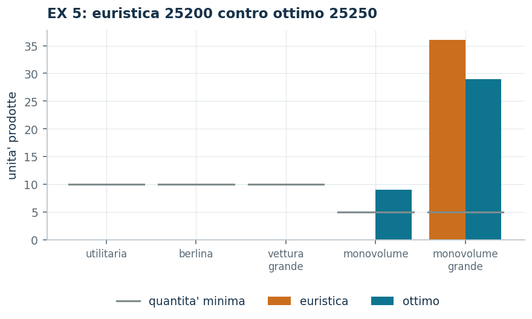

# EX 5 — Veicoli con quantità minima

**Classe:** MILP · **Legami:** [lotto minimo](legami-03.md), [attivazione](legami-01.md) · **Script:** `python/ex05_veicoli.py`

[](https://colab.research.google.com/github/fabiofurini/modellazione-mip/blob/main/notebooks/ex05_veicoli.ipynb)

Uno dei [quindici modelli numerici](numerici.md), della famiglia
[pianificazione della produzione](produzione.md).

!!! abstract "EX 5"
    Un'azienda valuta la produzione di cinque tipi di veicolo. Dispone di $1000$
    tonnellate di acciaio e $2000$ ore di lavoro. Per ciascun tipo la tabella dà
    l'acciaio per unità, le ore per unità, il profitto unitario e la quantità
    minima da produrre **se** il tipo viene scelto:

    | Tipo | acciaio | ore | profitto | minimo |
    |---|---:|---:|---:|---:|
    | utilitaria | 2 | 30 | 200 | 10 |
    | berlina | 3 | 25 | 250 | 10 |
    | vettura grande | 5 | 40 | 300 | 10 |
    | monovolume | 6 | 45 | 550 | 5 |
    | monovolume grande | 8 | 55 | 700 | 5 |

    Si vuole il piano di profitto massimo.

## Modello

Servono due famiglie di variabili: una quantità per tipo e un indicatore per
tipo. Con $s$ tipi di veicolo, $k$ risorse, profitto $p_j$, consumo $a_{ij}$,
disponibilità $b_i$, quantità minima $q_j$ e massimo producibile $M_j$:

$$
\begin{aligned}
\max ~~ \sum_{j=1}^{s} p_j\, x_j & & \\
\text{soggetto a} \quad \sum_{j=1}^{s} a_{ij}\, x_j &\le b_i, & \forall i \in \{1, 2, \dots, k\},\\
x_j - q_j\, y_j &\ge 0, & \forall j \in \{1, 2, \dots, s\},\\
x_j - M_j\, y_j &\le 0, & \forall j \in \{1, 2, \dots, s\},\\
x_j &\in \mathbb{Z}_{\ge 0}, & \forall j \in \{1, 2, \dots, s\},\\
y_j &\in \{0, 1\}, & \forall j \in \{1, 2, \dots, s\}.
\end{aligned}
$$

I due vincoli di legame insieme rendono $x_j$ una variabile **semicontinua**:

| $y_j$ | che cosa impongono i due vincoli | $x_j$ ammesse |
|---|---|---|
| $0$ | $x_j \ge 0$ e $x_j \le 0$ | solo $x_j = 0$ |
| $1$ | $x_j \ge q_j$ e $x_j \le M_j$ | $q_j \le x_j \le M_j$ |

Nessuno dei due basta da solo: senza il secondo un tipo potrebbe essere prodotto
con $y_j = 0$; senza il primo la quantità minima sarebbe vuota.

Sui dati dell'istanza $s = 5$, $k = 2$ e i big-M valgono
$M = (66, 80, 50, 44, 36)$, tutti limitati dalle ore di lavoro:

<!-- modello-esteso: ex05_primale -->

<div class="modello-esteso largo" markdown>

$$
\begin{array}{r@{}r@{}r@{}r@{}r@{}r@{}r@{}r@{}r@{}r@{}r c l}
\max & 200x_1 & +250x_2 & +300x_3 & +550x_4 & +700x_5 &  &  &  &  &  &  & \\
\text{soggetto a} & 2x_1 & +3x_2 & +5x_3 & +6x_4 & +8x_5 &  &  &  &  &  & \le & 1000\\
 & 30x_1 & +25x_2 & +40x_3 & +45x_4 & +55x_5 &  &  &  &  &  & \le & 2000\\
 & x_1 &  &  &  &  & -10y_1 &  &  &  &  & \ge & 0\\
 &  & x_2 &  &  &  &  & -10y_2 &  &  &  & \ge & 0\\
 &  &  & x_3 &  &  &  &  & -10y_3 &  &  & \ge & 0\\
 &  &  &  & x_4 &  &  &  &  & -5y_4 &  & \ge & 0\\
 &  &  &  &  & x_5 &  &  &  &  & -5y_5 & \ge & 0\\
 & x_1 &  &  &  &  & -66y_1 &  &  &  &  & \le & 0\\
 &  & x_2 &  &  &  &  & -80y_2 &  &  &  & \le & 0\\
 &  &  & x_3 &  &  &  &  & -50y_3 &  &  & \le & 0\\
 &  &  &  & x_4 &  &  &  &  & -44y_4 &  & \le & 0\\
 &  &  &  &  & x_5 &  &  &  &  & -36y_5 & \le & 0\\
 & x_1, & x_2, & x_3, & x_4, & x_5 &  &  &  &  &  & \in & \Z_{\ge 0}\\
 &  &  &  &  &  & y_1, & y_2, & y_3, & y_4, & y_5 & \in & \{0, 1\}
\end{array}
$$

</div>

<!-- modello-esteso: fine -->

## Euristica costruttiva: il bound primale

È un **massimo**. Si scandiscono i tipi in ordine di profitto per ora di lavoro:
$20/3$, $10$, $15/2$, $110/9$ e $140/11$. Si parte dal monovolume grande
($140/11$), se ne producono $36$ — il massimo consentito dalle ore — e restano
$712$ tonnellate di acciaio ma solo $20$ ore: nessun altro tipo raggiunge la
propria quantità minima e l'euristica si ferma.

$$\mathit{LB} = 25\,200.$$

## Rilassamento LP e duale: il bound duale

<!-- modello-esteso: ex05_duale -->

<div class="modello-esteso largo" markdown>

$$
\begin{array}{r@{}r@{}r@{}r@{}r@{}r@{}r@{}r@{}r@{}r@{}r@{}r@{}r c l}
\min & 1000\pi_1 & +2000\pi_2 &  &  &  &  &  &  &  &  &  &  &  & \\
\text{soggetto a} & 2\pi_1 & +30\pi_2 & +\lambda_1 &  &  &  &  & +\mu_1 &  &  &  &  & \ge & 200\\
 & 3\pi_1 & +25\pi_2 &  & +\lambda_2 &  &  &  &  & +\mu_2 &  &  &  & \ge & 250\\
 & 5\pi_1 & +40\pi_2 &  &  & +\lambda_3 &  &  &  &  & +\mu_3 &  &  & \ge & 300\\
 & 6\pi_1 & +45\pi_2 &  &  &  & +\lambda_4 &  &  &  &  & +\mu_4 &  & \ge & 550\\
 & 8\pi_1 & +55\pi_2 &  &  &  &  & +\lambda_5 &  &  &  &  & +\mu_5 & \ge & 700\\
 &  &  & -10\lambda_1 &  &  &  &  & -66\mu_1 &  &  &  &  & \ge & 0\\
 &  &  &  & -10\lambda_2 &  &  &  &  & -80\mu_2 &  &  &  & \ge & 0\\
 &  &  &  &  & -10\lambda_3 &  &  &  &  & -50\mu_3 &  &  & \ge & 0\\
 &  &  &  &  &  & -5\lambda_4 &  &  &  &  & -44\mu_4 &  & \ge & 0\\
 &  &  &  &  &  &  & -5\lambda_5 &  &  &  &  & -36\mu_5 & \ge & 0\\
 & \pi_1, & \pi_2 &  &  &  &  &  &  &  &  &  &  & \ge & 0\\
 &  &  & \lambda_1, & \lambda_2, & \lambda_3, & \lambda_4, & \lambda_5 &  &  &  &  &  & \gtreqless & 0\\
 &  &  &  &  &  &  &  & \mu_1, & \mu_2, & \mu_3, & \mu_4, & \mu_5 & \ge & 0
\end{array}
$$

</div>

<!-- modello-esteso: fine -->

**Una soluzione duale a mano.** Si pone $\ell_j = \mu_j = 0$ (il lotto minimo non
si valuta) e si valuta una sola risorsa, al prezzo unitario più alto fra i tipi:

$$\bar\pi_{\text{acciaio}} = \max_j \frac{p_j}{a_{1j}} = 100 \;\Rightarrow\; 1000 \cdot 100 = 100\,000,$$

$$\bar\pi_{\text{ore}} = \max_j \frac{p_j}{a_{2j}} = \frac{140}{11} \;\Rightarrow\; 2000 \cdot \frac{140}{11} = \frac{280\,000}{11} \approx 25\,454{,}5.$$

Il bound migliore viene dalle ore: $\mathit{UB} = 280\,000/11$.

## Ottimo e confronto

| $\mathit{LB}$ | $\mathit{UB}$ | $z(\mathit{LP})$ | $z(\mathit{LP}^+)$ | $z(\mathit{MILP})$ |
|---:|---:|---:|---:|---:|
| 25 200 | $280000/11$ | $280000/11$ | $229000/9$ | 25 250 |

L'ottimo produce $9$ monovolume e $29$ monovolume grandi, usando tutte le $2000$
ore e $286$ tonnellate di acciaio su $1000$. Il bound duale è **ottimo** per il
rilassamento senza i bound, e l'euristica sbaglia di appena lo $0{,}2\%$.

!!! tip "Quanto costa il lotto minimo"
    Senza quantità minime l'ottimo sarebbe $25\,300$: il lotto minimo costa $50$
    euro di profitto. Raddoppiando le quantità minime si scende a $25\,200$;
    raddoppiando le ore di lavoro si arriva a $50\,750$, con le ore ancora
    sature.



## Codice

Lo script completo è
[`python/ex05_veicoli.py`](https://github.com/fabiofurini/modellazione-mip/blob/main/python/ex05_veicoli.py);
il notebook è
[`notebooks/ex05_veicoli.ipynb`](https://github.com/fabiofurini/modellazione-mip/blob/main/notebooks/ex05_veicoli.ipynb).

<!-- script-incorporato: inizio (rigenerato da python/incorpora_codice.py) -->

??? example "Mostra lo script completo — `python/ex05_veicoli.py` (178 righe)"

    ```python
    """EX 5 -- Produzione di veicoli con lotto minimo (famiglia 9).

    Due risorse (acciaio e ore di lavoro) e cinque tipi di veicolo, ciascuno con una
    quantita' minima se lo si produce. E' la stessa struttura del problema 9.3 senza
    il premio per la varieta': lotto minimo (3.3) piu' attivazione (3.1), cioe' le
    variabili semicontinue.
    """
    import gurobipy as gp
    import pandas as pd
    from gurobipy import GRB

    from mip import (ammissibile, due_rilassamenti, frazione, nuovo_modello, registra_bound,
                     risolvi, valuta)
    from stile import ARANCIO, GRIGIO, TEAL, intestazione, plt, salva_dati, salva_figura
    from esteso import salva_modello

    R = range

    # ---------- 1. MODELLO E ISTANZA ----------
    intestazione("EX 5. Veicoli: due risorse e una quantita' minima per tipo")
    NOMI = ["utilitaria", "berlina", "vettura grande", "monovolume", "monovolume grande"]
    a4 = [[2, 3, 5, 6, 8],            # acciaio per unita'
          [30, 25, 40, 45, 55]]       # ore di lavoro per unita'
    b4 = [1000, 2000]                 # risorse disponibili
    RISORSE = ["acciaio (tonnellate)", "ore di lavoro"]
    p4 = [200, 250, 300, 550, 700]    # profitto per unita'
    q4 = [10, 10, 10, 5, 5]           # quantita' minima se il tipo si produce
    ns, nr = len(p4), len(b4)
    M4 = [min(b4[i] // a4[i][j] for i in R(nr)) for j in R(ns)]
    salva_dati(pd.DataFrame({"tipo": NOMI, "acciaio": a4[0], "ore": a4[1], "profitto": p4,
                             "minimo": q4, "massimo": M4}), "ex05_dati")
    print("  Quantita' massima producibile di un solo tipo (il big-M naturale):")
    for j in R(ns):
        print(f"    {NOMI[j]:20s} min({b4[0]}/{a4[0][j]}, {b4[1]}/{a4[1][j]}) = {M4[j]}")


    def modello(a, b, p, q, M):
        ns, nr = len(p), len(b)
        m = nuovo_modello("veicoli")
        x = m.addVars(ns, vtype=GRB.INTEGER, name="x")
        y = m.addVars(ns, vtype=GRB.BINARY, name="y")
        m.setObjective(gp.quicksum(p[j] * x[j] for j in R(ns)), GRB.MAXIMIZE)
        m.addConstrs((gp.quicksum(a[i][j] * x[j] for j in R(ns)) <= b[i] for i in R(nr)),
                     name="risorsa")
        m.addConstrs((x[j] - q[j] * y[j] >= 0 for j in R(ns)), name="lotto_minimo")
        m.addConstrs((x[j] - M[j] * y[j] <= 0 for j in R(ns)), name="attiva")
        return m, x, y


    def duale(a, b, p, q, M):
        """min sum_i b_i pi_i  con pi >= 0, lam <= 0 (lotto minimo, scritto >=) e mu >= 0.

        Colonne:  x_j: sum_i a_ij pi_i + lam_j + mu_j >= p_j
                  y_j: -q_j lam_j - M_j mu_j >= 0
        """
        ns, nr = len(p), len(b)
        d = nuovo_modello("duale_veicoli")
        pi = d.addVars(nr, name="pi")
        lam = d.addVars(ns, lb=-GRB.INFINITY, ub=0.0, name="lam")
        mu = d.addVars(ns, name="mu")
        d.setObjective(gp.quicksum(b[i] * pi[i] for i in R(nr)), GRB.MINIMIZE)
        d.addConstrs((gp.quicksum(a[i][j] * pi[i] for i in R(nr)) + lam[j] + mu[j] >= p[j]
                      for j in R(ns)), name="rcx")
        d.addConstrs((-q[j] * lam[j] - M[j] * mu[j] >= 0 for j in R(ns)), name="rcy")
        return d


    m4, x4, y4 = modello(a4, b4, p4, q4, M4)
    salva_modello(m4, "ex05_primale")

    # ---------- 2. EURISTICA COSTRUTTIVA (LOWER BOUND) ----------
    # euristica costruttiva sul profitto per ora di lavoro (la risorsa piu' stretta): si accende un
    # tipo solo se si riesce a raggiungere la quantita' minima, poi si spinge al massimo
    def euristica(a, b, p, q):
        ns, nr = len(p), len(b)
        res = list(map(float, b))
        x = [0] * ns
        passi = [f"profitto per ora di lavoro: "
                 + ", ".join(f"{NOMI[j]} {frazione(p[j] / a[1][j])}" for j in R(ns))]
        for j in sorted(R(ns), key=lambda j: (-p[j] / a[1][j], j)):
            if any(a[i][j] * q[j] > res[i] + 1e-9 for i in R(nr)):
                passi.append(f"{NOMI[j]}: non si arriva alla quantita' minima {q[j]}, si scarta")
                continue
            n = min(int(res[i] // a[i][j]) for i in R(nr))
            x[j] = n
            for i in R(nr):
                res[i] -= a[i][j] * n
            passi.append(f"{NOMI[j]}: si producono {n} unita' (minimo {q[j]}); risorse residue "
                         + ", ".join(f"{RISORSE[i]} {frazione(res[i])}" for i in R(nr)))
        return x, passi


    x_e, passi = euristica(a4, b4, p4, q4)
    for k, riga in enumerate(passi, 1):
        print(f"  Passo {k}. {riga}")
    lb4 = sum(p4[j] * x_e[j] for j in R(ns))
    sol_eur = ({f"x[{j}]": x_e[j] for j in R(ns)}
               | {f"y[{j}]": 1 if x_e[j] else 0 for j in R(ns)})
    assert ammissibile(m4, sol_eur), sol_eur
    print(f"  Soluzione euristica: " + ", ".join(f"{x_e[j]} {NOMI[j]}" for j in R(ns) if x_e[j])
          + f"   lb = {frazione(lb4)}")

    # ---------- 3. RILASSAMENTO LP E DUALE (UPPER BOUND) ----------
    d4 = duale(a4, b4, p4, q4, M4)
    salva_modello(d4, "ex05_duale")
    # ricetta: lam = mu = 0 (il lotto minimo non si valuta) e una sola risorsa
    # valutata al prezzo che nessun veicolo riesce a battere
    migliore, mano, scelta = float("inf"), None, None
    for i in R(nr):
        prezzo = max(p4[j] / a4[i][j] for j in R(ns))
        prova = {f"pi[{i}]": prezzo}
        val, viol = valuta(d4, prova)
        if viol <= 1e-9 and val < migliore:
            migliore, mano, scelta = val, prova, i
    ub4, viol = valuta(d4, mano)
    assert viol <= 1e-9, viol
    print("  Duale a mano: lam = mu = 0 e una sola risorsa valutata, al prezzo unitario piu' alto")
    print("  fra i veicoli (cosi' ogni vincolo a_ij pi_i >= p_j e' soddisfatto):")
    for i in R(nr):
        prezzo = max(p4[j] / a4[i][j] for j in R(ns))
        print(f"    {RISORSE[i]:22s} prezzo {frazione(prezzo):>8}  ->  bound "
              f"{frazione(b4[i] * prezzo)}")
    print(f"  Il bound migliore viene da: {RISORSE[scelta]}.  ub = {frazione(ub4)}")
    zlp4, zlp4r, _ = due_rilassamenti(m4, d4)

    # ---------- 4. OTTIMO DEL MILP ----------
    z4 = risolvi(m4)
    print("  Soluzione ottima: " + ", ".join(f"{int(x4[j].X)} {NOMI[j]}" for j in R(ns)
                                             if x4[j].X > 0.5))
    for i in R(nr):
        usato = sum(a4[i][j] * x4[j].X for j in R(ns))
        print(f"    {RISORSE[i]}: {frazione(usato)} su {b4[i]}")
    riga = registra_bound("EX 5 veicoli", ub4, lb4, zlp4, zlp4r, z4, senso="max")
    salva_dati(pd.DataFrame([riga]), "ex05_bound")
    assert lb4 <= z4 <= zlp4 <= ub4 + 1e-9

    # ---------- 5. IL LOTTO MINIMO E' UN VINCOLO, NON UN AIUTO ----------
    intestazione("EX 5. Che cosa costa il lotto minimo")
    m, x, y = modello(a4, b4, p4, [0] * ns, M4)
    z_senza = risolvi(m)
    print(f"  Senza quantita' minime l'ottimo sale a {frazione(z_senza)} "
          f"(contro {frazione(z4)}): il")
    print(f"  lotto minimo costa {frazione(z_senza - z4)} di profitto perche' impedisce di")
    print("  produrre poche unita' dei tipi piu' redditizi.")
    varianti = {"senza quantita' minime": z_senza}
    # 4a: quantita' minime raddoppiate
    m, x, y = modello(a4, b4, p4, [2 * v for v in q4], M4)
    z_a = risolvi(m)
    varianti["4a. quantita' minime raddoppiate"] = z_a
    print(f"  4a. Con quantita' minime raddoppiate: z = {frazione(z_a)}")
    # 4b: ore di lavoro raddoppiate
    b_b = [b4[0], 2 * b4[1]]
    m, x, y = modello(a4, b_b, p4, q4,
                      [min(b_b[i] // a4[i][j] for i in R(nr)) for j in R(ns)])
    z_b = risolvi(m)
    varianti["4b. ore di lavoro raddoppiate"] = z_b
    uso_b = [sum(a4[i][j] * x[j].X for j in R(ns)) for i in R(nr)]
    print(f"  4b. Con le ore di lavoro raddoppiate: z = {frazione(z_b)}; risorse usate "
          + ", ".join(f"{RISORSE[i]} {frazione(uso_b[i])} su {b_b[i]}" for i in R(nr)))
    print("      Le ore restano la risorsa stretta e il profitto raddoppia quasi esattamente.")
    salva_dati(pd.DataFrame({"variante": list(varianti), "z": list(varianti.values())}),
               "ex05_varianti")

    # ---------- 6. FIGURA ----------
    fig, ax = plt.subplots(figsize=(6.8, 3.0))
    idx = list(R(ns))
    ax.bar([j - 0.2 for j in idx], [x_e[j] for j in idx], 0.4, color=ARANCIO, label="euristica")
    ax.bar([j + 0.2 for j in idx], [x4[j].X for j in idx], 0.4, color=TEAL, label="ottimo")
    for j in idx:
        ax.plot([j - 0.42, j + 0.42], [q4[j], q4[j]], color=GRIGIO, lw=1.5)
    ax.plot([], [], color=GRIGIO, lw=1.5, label="quantita' minima")
    ax.set_xticks(idx)
    ax.set_xticklabels([n.replace(" ", "\n") for n in NOMI], fontsize=8)
    ax.set_ylabel("unita' prodotte")
    ax.set_title(f"EX 5: euristica {frazione(lb4)} contro ottimo {frazione(z4)}")
    ax.legend(fontsize=8)
    salva_figura(fig, "ex05_produzione")
    print("Fine.")
    ```

<!-- script-incorporato: fine -->
