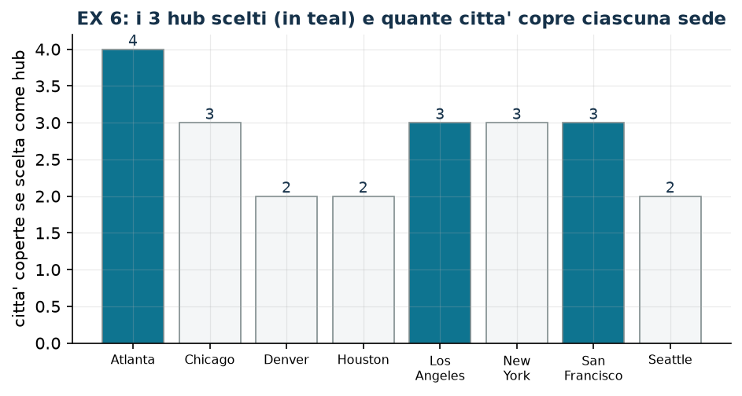

# EX 6 — Hub-and-spoke

**Classe:** BIP · **Legami:** copertura · **Script:** `python/ex06_hub.py`

[](https://colab.research.google.com/github/fabiofurini/modellazione-mip/blob/main/notebooks/ex06_hub.ipynb)

Modello numerico della famiglia [localizzazione e copertura](localizzazione.md).

!!! abstract "EX 6"
    Una compagnia aerea organizza la rete con un sistema *hub-and-spoke*: un hub
    serve direttamente tutte le città entro $1000$ miglia. La compagnia opera su
    otto città; per ciascuna, le città entro $1000$ miglia sono:

    | Città | Città entro 1000 miglia |
    |---|---|
    | Atlanta | Atlanta, Chicago, Houston, New York |
    | Chicago | Atlanta, Chicago, New York |
    | Denver | Denver, Los Angeles |
    | Houston | Atlanta, Houston |
    | Los Angeles | Denver, Los Angeles, San Francisco |
    | New York | Atlanta, Chicago, New York |
    | San Francisco | Los Angeles, San Francisco, Seattle |
    | Seattle | San Francisco, Seattle |

    Si vuole il numero minimo di hub tale che ogni città sia entro $1000$ miglia
    da almeno un hub.

## Modello

Con $y_j = 1$ se la città $j$ diventa un hub ($8$ binarie) e $S_i$ l'insieme
delle città che coprono la città $i$:

$$
\begin{aligned}
\min ~~ \sum_{j=1}^{8} y_j & & \\
\text{soggetto a} \quad \sum_{j \in S_i} y_j &\ge 1, & \forall i \in \{1, \dots, 8\},\\
y_j &\in \{0,1\}. &
\end{aligned}
$$

Un **set covering** puro: otto vincoli di copertura, tutti i costi pari a $1$.
La relazione «entro $1000$ miglia» è simmetrica, quindi
$j \in S_i \iff i \in S_j$: la matrice del modello è simmetrica.

## Euristica costruttiva: il bound primale

[Euristica costruttiva di copertura](modellazione-5.md), con il criterio «costo per città nuova
coperta».

- **Passo 1.** Rapporti $1/4$ per Atlanta, $1/3$ per Chicago, New York e San
  Francisco, $1/2$ per le altre: si sceglie **Atlanta**, che copre Atlanta,
  Chicago, Houston e New York.
- **Passo 2.** Restano Denver, Los Angeles, San Francisco e Seattle; rapporti
  $1/2$, $1/3$, $1/3$, $1/2$: si sceglie **Los Angeles**, che copre Denver, Los
  Angeles e San Francisco.
- **Passo 3.** Resta Seattle; rapporto $1/1$ per San Francisco e per Seattle: si
  sceglie **San Francisco**.

Tre hub, quindi $\mathit{UB} = 3$.

## Rilassamento LP e duale: il bound duale

Rilassando a $y_j \ge 0$, con $u_i \ge 0$ per ogni vincolo di copertura:

$$
\begin{aligned}
\max ~~ \sum_{i=1}^{8} u_i & & \\
\text{soggetto a} \quad \sum_{i \,:\, j \in S_i} u_i &\le 1, & \forall j \in \{1, \dots, 8\},\\
u_i &\ge 0. &
\end{aligned}
$$

Euristica costruttiva duale sulle città, nell'ordine: si alza $u_i$ fino a saturare il primo
vincolo duale che si oppone, e si aggiornano i residui.

- **Atlanta** è coperta da quattro hub, tutti con residuo $1$: $\bar u_1 = 1$, e
  i residui di Atlanta, Chicago, Houston e New York vanno a zero.
- **Chicago**, **Houston** e **New York** hanno tutti i loro hub a residuo zero:
  $\bar u = 0$.
- **Denver** è coperta da Denver e Los Angeles, entrambi con residuo $1$:
  $\bar u_3 = 1$.
- **Los Angeles** e **San Francisco** hanno un hub a residuo zero: $\bar u = 0$.
- **Seattle** è coperta da San Francisco e Seattle, entrambi con residuo $1$:
  $\bar u_8 = 1$.

$\mathit{LB} = 3$.

!!! tip "Che cosa dimostra questo bound, in parole"
    Le tre città che hanno ricevuto $u_i = 1$ — Atlanta, Denver, Seattle — sono
    a due a due «lontane»: nessuna città può fare da hub per due di esse. Quindi
    servono almeno tre hub. Il duale ha formalizzato un argomento che si può
    raccontare senza scriverlo: è il senso della ricetta euristica costruttiva.

| $UB$ (euristica costruttiva) | $LB$ (duale a mano) | $z(\mathit{LP})$ | $z(\mathit{MILP})$ | gap euristica |
|---:|---:|---:|---:|---:|
| 3 | 3 | 3 | 3 | $0{,}0\%$ |

L'ottimo è $3$ hub ad Atlanta, Los Angeles e San Francisco — la stessa soluzione
della euristica costruttiva. I due bound a mano coincidono: l'ottimalità è dimostrata senza il
solver.



## Codice

Lo script completo è
[`python/ex06_hub.py`](https://github.com/fabiofurini/modellazione-mip/blob/main/python/ex06_hub.py);
il notebook è
[`notebooks/ex06_hub.ipynb`](https://github.com/fabiofurini/modellazione-mip/blob/main/notebooks/ex06_hub.ipynb).

<!-- script-incorporato: inizio (rigenerato da python/incorpora_codice.py) -->

??? example "Mostra lo script completo — `python/ex06_hub.py` (114 righe)"

    ```python
    """EX 6 -- Hub-and-spoke: il minimo numero di hub che copre otto citta' (famiglia 8).

    Un set covering puro, con tutti i costi pari a 1: si minimizza il numero di hub.
    Il duale e' il "packing frazionario" dei clienti, e la euristica costruttiva duale sulle citta'
    qui trova un bound che coincide con l'ottimo.
    """
    import gurobipy as gp
    import pandas as pd
    from gurobipy import GRB

    from euristiche import euristica_copertura
    from mip import (ammissibile, due_rilassamenti, frazione, nuovo_modello, registra_bound,
                     risolvi, valuta)
    from stile import intestazione, plt, salva_dati, salva_figura

    R = range

    # ---------- 1. MODELLO E ISTANZA ----------
    intestazione("EX 6. Hub-and-spoke: il minimo numero di hub entro 1000 miglia da ogni citta'")
    CITTA = ["Atlanta", "Chicago", "Denver", "Houston", "Los Angeles", "New York",
             "San Francisco", "Seattle"]
    # copre[i] = citta' che, se scelte come hub, coprono la citta' i (entro 1000 miglia)
    copre = [[0, 1, 3, 5],      # Atlanta: Atlanta, Chicago, Houston, New York
             [0, 1, 5],         # Chicago
             [2, 4],            # Denver
             [0, 3],            # Houston
             [2, 4, 6],         # Los Angeles
             [0, 1, 5],         # New York
             [4, 6, 7],         # San Francisco
             [6, 7]]            # Seattle
    n = len(CITTA)
    salva_dati(pd.DataFrame([{"citta": CITTA[i], "coperta_da": ", ".join(CITTA[j] for j in copre[i])}
                             for i in R(n)]), "ex06_copertura")


    def modello(copre):
        n = len(copre)
        m = nuovo_modello("hub_spoke")
        y = m.addVars(n, vtype=GRB.BINARY, name="y")
        m.setObjective(y.sum(), GRB.MINIMIZE)
        m.addConstrs((gp.quicksum(y[j] for j in copre[i]) >= 1 for i in R(n)), name="copri")
        return m, y


    def duale(copre):
        """max sum_i u_i;  sum_{i : j copre i} u_i <= 1 per ogni j;  u >= 0."""
        n = len(copre)
        d = nuovo_modello("duale_hub_spoke")
        u = d.addVars(n, name="u")
        d.setObjective(u.sum(), GRB.MAXIMIZE)
        d.addConstrs((gp.quicksum(u[i] for i in R(n) if j in copre[i]) <= 1 for j in R(n)),
                     name="rc")
        return d


    m, y = modello(copre)

    # ---------- 2. EURISTICA COSTRUTTIVA (UPPER BOUND) ----------
    e = euristica_copertura([1] * n, copre)
    e.traccia.stampa()
    ub = e.valore
    scelti = [j for j in R(n) if e.y[j]]
    assert ammissibile(m, {f"y[{j}]": e.y[j] for j in R(n)})
    print(f"  Soluzione euristica: hub in " + ", ".join(CITTA[j] for j in scelti)
          + f"   ub = {frazione(ub)}")

    # ---------- 3. RILASSAMENTO LP E DUALE (LOWER BOUND) ----------
    d = duale(copre)
    # euristica costruttiva duale sulle citta': si alza u_i fino a saturare il primo vincolo duale che si oppone
    residuo = [1.0] * n
    mano = {}
    for i in R(n):
        incremento = min(residuo[j] for j in copre[i])
        mano[f"u[{i}]"] = incremento
        for j in copre[i]:
            residuo[j] -= incremento
        print(f"  Citta' {i + 1} ({CITTA[i]}): residui degli hub che la coprono "
              + ", ".join(f"{CITTA[j]} = {frazione(residuo[j] + incremento)}" for j in copre[i])
              + f"; il minimo e' {frazione(incremento)}, quindi u_{i + 1} = {frazione(incremento)}")
    lb, viol = valuta(d, mano)
    assert viol <= 1e-9, viol
    print(f"  Duale a mano (euristica costruttiva sulle citta'): lb = {frazione(lb)}")
    zlp, zlpr, pi = due_rilassamenti(m, d)

    # ---------- 4. OTTIMO DEL MILP E TABELLA DEI BOUND ----------
    z = risolvi(m)
    ott = [j for j in R(n) if y[j].X > 0.5]
    print(f"  Soluzione ottima: {len(ott)} hub in " + ", ".join(CITTA[j] for j in ott))
    for i in R(n):
        quali = [CITTA[j] for j in copre[i] if j in ott]
        assert quali, CITTA[i]
    print("  Ogni citta' e' coperta da almeno un hub scelto: verificato per tutte e otto.")
    riga = registra_bound("EX 6 hub-and-spoke", ub, lb, zlp, zlpr, z)
    salva_dati(pd.DataFrame([riga]), "ex06_bound")
    assert lb <= zlp <= z <= ub + 1e-9
    if abs(lb - z) < 1e-9:
        print("  Qui il duale a mano coincide con l'ottimo intero: il bound chiude il problema")
        print("  senza bisogno del solver (tre citta' a due a due 'lontane' bastano a")
        print("  dimostrare che due hub non possono bastare).")

    # ---------- 5. FIGURA ----------
    fig, ax = plt.subplots(figsize=(7.2, 3.4))
    altezza = [len([i for i in R(n) if j in copre[i]]) for j in R(n)]
    colori = ["#0E7490" if j in ott else "#F4F6F7" for j in R(n)]
    ax.bar(R(n), altezza, color=colori, edgecolor="#7F8C8D", lw=0.8)
    for j in R(n):
        ax.annotate(str(altezza[j]), (j, altezza[j]), ha="center", va="bottom", fontsize=9,
                    color="#16324A")
    ax.set_xticks(R(n))
    ax.set_xticklabels([c.replace(" ", "\n") for c in CITTA], fontsize=7.5)
    ax.set_ylabel("citta' coperte se scelta come hub")
    ax.set_title(f"EX 6: i {len(ott)} hub scelti (in teal) e quante citta' copre ciascuna sede")
    salva_figura(fig, "ex06_ottimo")
    print("Fine.")
    ```

<!-- script-incorporato: fine -->
