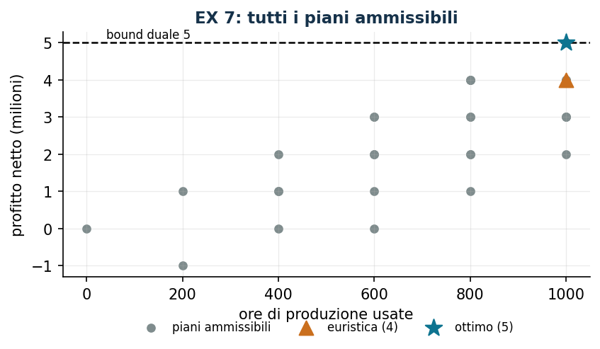

# EX 7 — Aerei su commessa con costo fisso

**Classe:** MILP · **Legami:** [costo fisso](legami-02.md), [attivazione](legami-01.md) · **Script:** `python/ex07_aerei.py`

[](https://colab.research.google.com/github/fabiofurini/modellazione-mip/blob/main/notebooks/ex07_aerei.ipynb)

Uno dei [quindici modelli numerici](numerici.md), della famiglia
[pianificazione della produzione](produzione.md).

!!! abstract "EX 7"
    Un'azienda costruisce aerei su misura; prima di produrre per un cliente
    occorre sostenere un costo fisso di attrezzaggio. Tre clienti hanno
    ordinato, rispettivamente, $3$, $2$ e $5$ aerei. La capacità produttiva è di
    $1000$ ore. L'azienda decide quali ordini accettare e quante unità produrne
    (anche meno di quante richieste).

    | | cliente 1 | cliente 2 | cliente 3 |
    |---|---:|---:|---:|
    | attrezzaggio (milioni) | 3 | 2 | 0 |
    | profitto unitario (milioni) | 2 | 3 | 1 |
    | ore per aereo | 200 | 400 | 200 |

    Si vuole massimizzare il profitto totale al netto dei costi di attrezzaggio.

## Modello

I dati sono $n = 3$ clienti, di profitto unitario $p_j$, costo di attrezzaggio
$f_j$, ore per aereo $h_j$ e ordine massimo $M_j$, più la capacità produttiva
$H = 1000$ ore. Con $x_j$ aerei prodotti per il cliente $j$ (intere) e $y_j$
indicatore di commessa accettata:

$$
\begin{aligned}
\max ~~ \sum_{j=1}^{n} \big(p_j\, x_j - f_j\, y_j\big) & &\\
\text{soggetto a} \quad \sum_{j=1}^{n} h_j\, x_j &\le H, &\\
x_j - M_j\, y_j &\le 0, & \forall j \in \{1, 2, \dots, n\},\\
x_j &\in \mathbb{Z}_{\ge 0}, & \forall j \in \{1, 2, \dots, n\},\\
y_j &\in \{0, 1\}, & \forall j \in \{1, 2, \dots, n\}.
\end{aligned}
$$

Un solo vincolo per cliente fa **due cose insieme**: limita la quantità al numero
di aerei ordinati e fa pagare l'attrezzaggio. Il cliente 3 ha attrezzaggio nullo,
quindi $y_3$ non compare nell'obiettivo e vale $1$ in ogni soluzione ottima con
$x_3 > 0$.

Il modello dell'istanza, per esteso:

<!-- modello-esteso: ex07_primale -->

<div class="modello-esteso" markdown>

$$
\begin{array}{r@{\,}r@{\,}r@{\,}r@{\,}r@{\,}r@{\,}r c l}
\max & 2x_1 & +3x_2 & +x_3 & -3y_1 & -2y_2 &  &  & \\
\text{soggetto a} & 200x_1 & +400x_2 & +200x_3 &  &  &  & \le & 1000\\
 & x_1 &  &  & -3y_1 &  &  & \le & 0\\
 &  & x_2 &  &  & -2y_2 &  & \le & 0\\
 &  &  & x_3 &  &  & -5y_3 & \le & 0\\
 & x_1, & x_2, & x_3 &  &  &  & \in & \Z_{\ge 0}\\
 &  &  &  & y_1, & y_2, & y_3 & \in & \{0, 1\}
\end{array}
$$

</div>

<!-- modello-esteso: fine -->

## Euristica costruttiva: il bound primale

È un **massimo**. Si scandiscono i clienti in ordine di profitto netto per ora,
calcolato sulla commessa intera: $3/600$, $4/800$ e $5/1000$, cioè $1/200$ per
tutti e tre. A parità di rapporto si scorre nell'ordine naturale: si accetta il
cliente 1 con $3$ aerei ($600$ ore, profitto netto $3$), poi il cliente 2 con un
solo aereo ($400$ ore, profitto netto $3 - 2 = 1$), e le ore finiscono.

$$\mathit{LB} = 4.$$

## Rilassamento LP e duale: il bound duale

Con $\alpha \ge 0$ sulla capacità e $\beta_j \ge 0$ sui legami, il duale è

$$\min ~ H\, \alpha \quad\text{soggetto a}\quad h_j\, \alpha + \beta_j \ge p_j, \qquad M_j\, \beta_j \le f_j.$$

**La ricetta:** $\bar\beta_j = f_j / M_j$, cioè l'attrezzaggio spalmato sugli
aerei ordinati ($1$, $1$ e $0$), da cui $\alpha \ge (p_j - \bar\beta_j)/h_j$ per
ogni $j$, cioè $\alpha \ge 1/200$ in tutti e tre i casi. Con
$\bar\alpha = 1/200$,

$$\mathit{UB} = 1000 \cdot \frac{1}{200} = 5.$$

<!-- modello-esteso: ex07_duale -->

<div class="modello-esteso" markdown>

$$
\begin{array}{r@{\,}r@{\,}r@{\,}r@{\,}r c l}
\min & 1000\alpha &  &  &  &  & \\
\text{soggetto a} & 200\alpha & +\beta_1 &  &  & \ge & 2\\
 & 400\alpha &  & +\beta_2 &  & \ge & 3\\
 & 200\alpha &  &  & +\beta_3 & \ge & 1\\
 &  & -3\beta_1 &  &  & \ge & -3\\
 &  &  & -2\beta_2 &  & \ge & -2\\
 &  &  &  & -5\beta_3 & \ge & 0\\
 & \alpha &  &  &  & \ge & 0\\
 &  & \beta_1, & \beta_2, & \beta_3 & \ge & 0
\end{array}
$$

</div>

<!-- modello-esteso: fine -->

## Ottimo e confronto

| $\mathit{LB}$ | $\mathit{UB}$ | $z(\mathit{LP})$ | $z(\mathit{LP}^+)$ | $z(\mathit{MILP})$ |
|---:|---:|---:|---:|---:|
| 4 | 5 | 5 | 5 | 5 |

L'ottimo vale $5$ ed è raggiunto da **tre** piani diversi: cinque aerei al
cliente 3; due al cliente 2 e uno al terzo; tre al cliente 1 e due al terzo.
Tutti e tre usano esattamente le $1000$ ore.

!!! tip "Quando il certificato chiude il problema da solo"
    Qui il bound duale è esatto: $\mathit{UB} = z(\mathit{MILP}) = 5$. Il
    certificato costruito a mano dimostra l'ottimalità senza che il solver debba
    fare nulla. Senza costi di attrezzaggio l'ottimo salirebbe a $9$; con $1400$
    ore disponibili a $7$.



## Codice

Lo script completo è
[`python/ex07_aerei.py`](https://github.com/fabiofurini/modellazione-mip/blob/main/python/ex07_aerei.py);
il notebook è
[`notebooks/ex07_aerei.ipynb`](https://github.com/fabiofurini/modellazione-mip/blob/main/notebooks/ex07_aerei.ipynb).

<!-- script-incorporato: inizio (rigenerato da python/incorpora_codice.py) -->

??? example "Mostra lo script completo — `python/ex07_aerei.py` (180 righe)"

    ```python
    """EX 7 -- Aerei su commessa con costo fisso di setup (famiglia 9).

    Tre commesse, ciascuna con un costo fisso di attrezzaggio e un tetto di unita'.
    E' il costo fisso della tecnica 3.2 in forma pura: il legame x <= M y serve sia a
    limitare la quantita' sia a far pagare il setup. Il duale del rilassamento si
    costruisce a mano in due righe e coincide con l'ottimo del MILP.
    """
    import gurobipy as gp
    import pandas as pd
    from gurobipy import GRB

    from mip import (ammissibile, due_rilassamenti, frazione, nuovo_modello, registra_bound,
                     risolvi, stampa_lp, valuta)
    from stile import ARANCIO, GRIGIO, TEAL, intestazione, plt, salva_dati, salva_figura
    from esteso import salva_modello

    R = range


    def aerei(n):
        return f"{int(n)} aereo" if int(n) == 1 else f"{int(n)} aerei"

    # ---------- 1. MODELLO E ISTANZA ----------
    intestazione("EX 7. Aerei su commessa: quali ordini accettare")
    p6 = [2, 3, 1]        # profitto unitario (milioni)
    f6 = [3, 2, 0]        # costo fisso di attrezzaggio (milioni)
    h6 = [200, 400, 200]  # ore di produzione per aereo
    M6 = [3, 2, 5]        # aerei ordinati dal cliente
    H6 = 1000             # ore disponibili
    nc = len(p6)
    salva_dati(pd.DataFrame({"cliente": R(1, nc + 1), "profitto": p6, "setup": f6,
                             "ore": h6, "ordinati": M6}), "ex07_dati")
    print("  Profitto netto se si accetta un cliente e si producono tutti i suoi aerei:")
    for j in R(nc):
        print(f"    cliente {j + 1}: {p6[j]} * {M6[j]} - {f6[j]} = {p6[j] * M6[j] - f6[j]} "
              f"milioni, con {h6[j] * M6[j]} ore")


    def modello(p, f, h, M, H):
        nc = len(p)
        m = nuovo_modello("aerei")
        x = m.addVars(nc, vtype=GRB.INTEGER, name="x")
        y = m.addVars(nc, vtype=GRB.BINARY, name="y")
        m.setObjective(gp.quicksum(p[j] * x[j] - f[j] * y[j] for j in R(nc)), GRB.MAXIMIZE)
        m.addConstr(gp.quicksum(h[j] * x[j] for j in R(nc)) <= H, name="ore")
        m.addConstrs((x[j] - M[j] * y[j] <= 0 for j in R(nc)), name="attiva")
        return m, x, y


    def duale(p, f, h, M, H):
        """min H alpha  con alpha >= 0 e beta >= 0 (legami x_j <= M_j y_j).

        Colonne:  x_j: h_j alpha + beta_j >= p_j
                  y_j: -M_j beta_j >= -f_j, cioe' beta_j <= f_j / M_j
        """
        nc = len(p)
        d = nuovo_modello("duale_aerei")
        alpha = d.addVar(name="alpha")
        beta = d.addVars(nc, name="beta")
        d.setObjective(H * alpha, GRB.MINIMIZE)
        d.addConstrs((h[j] * alpha + beta[j] >= p[j] for j in R(nc)), name="rcx")
        d.addConstrs((-M[j] * beta[j] >= -f[j] for j in R(nc)), name="rcy")
        return d


    m6, x6, y6 = modello(p6, f6, h6, M6, H6)
    salva_modello(m6, "ex07_primale")
    print("  Il modello dell'istanza:")
    stampa_lp(m6)

    # ---------- 2. EURISTICA COSTRUTTIVA (LOWER BOUND) ----------
    # euristica costruttiva sul profitto netto per ora se si accetta la commessa intera
    def euristica(p, f, h, M, H):
        nc = len(p)
        res = H
        x = [0] * nc
        valore = [(p[j] * M[j] - f[j]) / (h[j] * M[j]) for j in R(nc)]
        passi = ["profitto netto per ora, a commessa intera: "
                 + ", ".join(f"cliente {j + 1} {frazione(valore[j])}" for j in R(nc))]
        for j in sorted(R(nc), key=lambda j: (-valore[j], j)):
            n = min(M[j], res // h[j])
            if n == 0 or p[j] * n - f[j] <= 0:
                passi.append(f"cliente {j + 1}: con {res} ore residue si farebbero "
                             f"{aerei(n)}, profitto {p[j] * n - f[j]} <= 0, si scarta")
                continue
            x[j] = n
            res -= h[j] * n
            passi.append(f"cliente {j + 1}: {aerei(n)}, profitto netto {p[j] * n - f[j]}; "
                         f"ore residue {res}")
        return x, passi


    x_e, passi = euristica(p6, f6, h6, M6, H6)
    for k, riga in enumerate(passi, 1):
        print(f"  Passo {k}. {riga}")
    lb6 = sum(p6[j] * x_e[j] - f6[j] * (1 if x_e[j] else 0) for j in R(nc))
    sol_eur = ({f"x[{j}]": x_e[j] for j in R(nc)}
               | {f"y[{j}]": 1 if x_e[j] else 0 for j in R(nc)})
    assert ammissibile(m6, sol_eur), sol_eur
    print(f"  Soluzione euristica: " + ", ".join(f"{aerei(x_e[j])} al cliente {j + 1}"
                                                 for j in R(nc) if x_e[j])
          + f"   lb = {frazione(lb6)}")

    # ---------- 3. RILASSAMENTO LP E DUALE (UPPER BOUND) ----------
    d6 = duale(p6, f6, h6, M6, H6)
    salva_modello(d6, "ex07_duale")
    # ricetta: beta_j = f_j / M_j (il massimo consentito dalla colonna di y_j, cioe' il
    # setup spalmato sugli aerei ordinati) e alpha il piu' piccolo valore che rende
    # ammissibili tutte le colonne di x
    beta_v = [f6[j] / M6[j] for j in R(nc)]
    alpha_v = max((p6[j] - beta_v[j]) / h6[j] for j in R(nc))
    mano = {"alpha": alpha_v} | {f"beta[{j}]": beta_v[j] for j in R(nc)}
    ub6, viol = valuta(d6, mano)
    assert viol <= 1e-9, viol
    print("  Duale a mano: beta_j = f_j / M_j (il setup spalmato sugli aerei ordinati):")
    for j in R(nc):
        print(f"    cliente {j + 1}: {f6[j]} / {M6[j]} = {frazione(beta_v[j])}, quindi "
              f"alpha >= ({p6[j]} - {frazione(beta_v[j])}) / {h6[j]} = "
              f"{frazione((p6[j] - beta_v[j]) / h6[j])}")
    print(f"  alpha = {frazione(alpha_v)} (un'ora di produzione vale {frazione(alpha_v)} milioni)")
    print(f"  ub = {H6} * alpha = {frazione(ub6)}")
    zlp6, zlp6r, _ = due_rilassamenti(m6, d6)

    # ---------- 4. OTTIMO DEL MILP ----------
    z6 = risolvi(m6)
    print("  Soluzione ottima: " + ", ".join(
        f"{aerei(x6[j].X)} al cliente {j + 1}" for j in R(nc) if x6[j].X > 0.5)
        + f"; ore usate {int(sum(h6[j] * x6[j].X for j in R(nc)))} su {H6}")
    riga = registra_bound("EX 7 aerei", ub6, lb6, zlp6, zlp6r, z6, senso="max")
    salva_dati(pd.DataFrame([riga]), "ex07_bound")
    assert lb6 <= z6 <= zlp6 <= ub6 + 1e-9

    # ---------- 5. TUTTI I PIANI POSSIBILI ----------
    intestazione("EX 7. I piani ammissibili, uno per uno")
    righe = []
    for a in R(M6[0] + 1):
        for b in R(M6[1] + 1):
            for c in R(M6[2] + 1):
                ore = h6[0] * a + h6[1] * b + h6[2] * c
                if ore > H6:
                    continue
                val = (p6[0] * a + p6[1] * b + p6[2] * c
                       - sum(f6[j] for j, n in enumerate((a, b, c)) if n))
                righe.append({"cliente_1": a, "cliente_2": b, "cliente_3": c, "ore": ore,
                              "profitto": val})
    df = pd.DataFrame(righe).sort_values("profitto", ascending=False)
    print(df.head(6).to_string(index=False))
    print(f"  Piani ammissibili in tutto: {len(df)}; il migliore vale {df.profitto.max()}, e")
    print(f"  coincide con l'ottimo del solver ({frazione(z6)}).")
    salva_dati(df, "ex07_piani")
    assert abs(df.profitto.max() - z6) <= 1e-9

    # ---------- 6. VARIANTI ----------
    varianti = {}
    m, x, y = modello(p6, [0] * nc, h6, M6, H6)
    varianti["6a. senza costi di setup"] = risolvi(m)
    print(f"  6a. Senza costi di attrezzaggio: z = "
          f"{frazione(varianti['6a. senza costi di setup'])}")
    m, x, y = modello(p6, f6, h6, M6, 1400)
    varianti["6b. 1400 ore disponibili"] = risolvi(m)
    print(f"  6b. Con 1400 ore disponibili: z = "
          f"{frazione(varianti['6b. 1400 ore disponibili'])}")
    salva_dati(pd.DataFrame({"variante": list(varianti), "z": list(varianti.values())}),
               "ex07_varianti")

    # ---------- 7. FIGURA ----------
    fig, ax = plt.subplots(figsize=(6.4, 3.0))
    ax.scatter(df.ore, df.profitto, s=26, color=GRIGIO, label="piani ammissibili")
    ax.scatter([sum(h6[j] * x_e[j] for j in R(nc))], [lb6], s=90, marker="^", color=ARANCIO,
               label=f"euristica ({frazione(lb6)})", zorder=3)
    ax.scatter([sum(h6[j] * x6[j].X for j in R(nc))], [z6], s=140, marker="*", color=TEAL,
               label=f"ottimo ({frazione(z6)})", zorder=3)
    ax.axhline(ub6, color="black", ls="--", lw=1.2)
    ax.annotate(f"bound duale {frazione(ub6)}", (40, ub6 + 0.12), fontsize=8)
    ax.set_xlabel("ore di produzione usate")
    ax.set_ylabel("profitto netto (milioni)")
    ax.set_title("EX 7: tutti i piani ammissibili")
    ax.legend(fontsize=8, loc="lower left")
    salva_figura(fig, "ex07_piani")
    print("Fine.")
    ```

<!-- script-incorporato: fine -->
