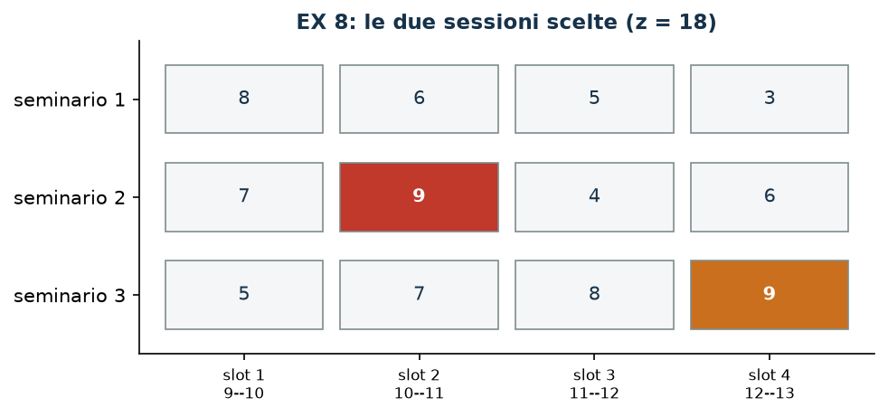

# EX 8 — Seminari

**Classe:** BIP · **Legami:** cardinalità esatta, non-adiacenza · **Script:** `python/ex08_seminari.py`

[](https://colab.research.google.com/github/fabiofurini/modellazione-mip/blob/main/notebooks/ex08_seminari.ipynb)

Modello numerico della famiglia [assegnamento e scheduling](scheduling.md).

!!! abstract "EX 8"
    Uno studente deve seguire *esattamente due* sessioni di una scuola estiva.
    Ci sono tre seminari, ciascuno offerto in quattro fasce orarie; ogni
    seminario si segue al più una volta e due sessioni non possono occupare la
    stessa fascia. Il gradimento di ciascuna sessione è:

    | | 9–10 | 10–11 | 11–12 | 12–13 |
    |---|---:|---:|---:|---:|
    | Seminario 1 | 8 | 6 | 5 | 3 |
    | Seminario 2 | 7 | 9 | 4 | 6 |
    | Seminario 3 | 5 | 7 | 8 | 9 |

    Lo studente non vuole **mai due ore consecutive** di lezione. Si massimizza
    il gradimento totale.

## Modello

Con $x_{sk} = 1$ se si segue il seminario $s$ nella fascia $k$ ($12$ binarie):

$$
\begin{aligned}
\max ~~ \sum_{s=1}^{3} \sum_{k=1}^{4} p_{sk}\, x_{sk} & & \\
\text{soggetto a} \quad \sum_{s=1}^{3} x_{sk} &\le 1, & \forall k \in \{1, \dots, 4\},\\
\sum_{k=1}^{4} x_{sk} &\le 1, & \forall s \in \{1, 2, 3\},\\
\sum_{s=1}^{3} \sum_{k=1}^{4} x_{sk} &= q, & \\
\sum_{s=1}^{3} \big(x_{sk} + x_{s,k+1}\big) &\le 1, & \forall k \in \{1, 2, 3\},\\
x_{sk} &\in \{0,1\}, &
\end{aligned}
$$

con $q = 2$: quattro vincoli di fascia, tre di seminario, uno di cardinalità
**esatta** e tre di non-adiacenza fra fasce consecutive.

## Euristica costruttiva: il bound primale

È un **massimo**, quindi il valore di una soluzione ammissibile è un *lower*
bound. Euristica costruttiva: si prende la sessione ammissibile di gradimento più alto, poi la
migliore compatibile.

- **Passo 1**: seminario 3 nella fascia 4 (gradimento $9$).
- **Passo 2**: fra le sessioni che non usano il seminario 3, non occupano la
  fascia 4 e non le sono adiacenti, la migliore è il seminario 2 nella fascia 2
  (gradimento $9$).

$\mathit{LB} = 18$.

## Rilassamento LP e duale: il bound duale

Con $\alpha_k \ge 0$ per le fasce, $\beta_s \ge 0$ per i seminari, $\gamma$
**libera** per la cardinalità esatta e $\delta_k \ge 0$ per la non-adiacenza:

$$
\begin{aligned}
\min ~~ \sum_{k=1}^{4}\alpha_k + \sum_{s=1}^{3}\beta_s + q\,\gamma + \sum_{k=1}^{3}\delta_k & &\\
\text{soggetto a} \quad \alpha_k + \beta_s + \gamma + \!\!\sum_{k' \,:\, k \in \{k',\,k'+1\}}\!\! \delta_{k'} &\ge p_{sk}, & \forall s,\ \forall k,\\
\alpha, \beta, \delta \ge 0, \qquad \gamma &\gtreqless 0. &
\end{aligned}
$$

La ricetta più corta: tutto a zero tranne $\bar\gamma = \max_{s,k} p_{sk} = 9$.
Ogni vincolo duale diventa $9 \ge p_{sk}$, vero per costruzione, e il valore è
$q\,\bar\gamma = 18$. Si legge: «si seguono due sessioni, e nessuna vale più
della migliore».

| Ricetta duale | $UB$ |
|---|---:|
| tutto a zero tranne $\gamma = \max_{s,k} p_{sk}$ | $18$ |
| $\gamma = 0$, $\alpha_k = \max_s p_{sk}$ | $34$ |

La prima è ottima per il rilassamento; la seconda, apparentemente più naturale,
è quasi il doppio. **La ricetta conta.**

| $LB$ (euristica costruttiva) | $z(\mathit{MILP})$ | $z(\mathit{LP})$ | $UB$ (duale a mano) | gap euristica |
|---:|---:|---:|---:|---:|
| 18 | 18 | 18 | 18 | $0{,}0\%$ |

Qui i due bound costruiti a mano **chiudono** il problema: $z(\mathit{MILP}) = 18$
è dimostrato senza il solver.



## Codice

Lo script completo è
[`python/ex08_seminari.py`](https://github.com/fabiofurini/modellazione-mip/blob/main/python/ex08_seminari.py);
il notebook è
[`notebooks/ex08_seminari.ipynb`](https://github.com/fabiofurini/modellazione-mip/blob/main/notebooks/ex08_seminari.ipynb).

<!-- script-incorporato: inizio (rigenerato da python/incorpora_codice.py) -->

??? example "Mostra lo script completo — `python/ex08_seminari.py` (140 righe)"

    ```python
    """EX 8 -- Seminari: esattamente due sessioni, senza ore consecutive (famiglia 7).

    Un set packing su due dimensioni (slot e seminario) con un vincolo di
    cardinalita' esatta e vincoli di non-adiacenza fra slot consecutivi. Il duale ha
    una variabile libera per il vincolo di uguaglianza, e la sua ricetta piu'
    semplice --- «due sessioni valgono al piu' due volte il punteggio migliore» ---
    e' addirittura ottima per il rilassamento.
    """
    import gurobipy as gp
    import pandas as pd
    from gurobipy import GRB

    from mip import (ammissibile, due_rilassamenti, frazione, nuovo_modello, registra_bound,
                     risolvi, valuta)
    from stile import intestazione, plt, salva_dati, salva_figura

    R = range

    # ---------- 1. MODELLO E ISTANZA ----------
    intestazione("EX 8. Seminari: esattamente due sessioni, mai due ore consecutive")
    p = [[8, 6, 5, 3],       # preferenza del seminario 1 nei quattro slot
         [7, 9, 4, 6],
         [5, 7, 8, 9]]
    ns, nk, q = 3, 4, 2      # seminari, slot, sessioni da seguire
    SLOT = ["9--10", "10--11", "11--12", "12--13"]
    salva_dati(pd.DataFrame([{"seminario": s + 1, "slot": k + 1, "orario": SLOT[k], "p": p[s][k]}
                             for s in R(ns) for k in R(nk)]), "ex08_preferenze")


    def modello(p, q):
        ns, nk = len(p), len(p[0])
        m = nuovo_modello("seminari")
        x = m.addVars(ns, nk, vtype=GRB.BINARY, name="x")
        m.setObjective(gp.quicksum(p[s][k] * x[s, k] for s in R(ns) for k in R(nk)), GRB.MAXIMIZE)
        m.addConstrs((x.sum("*", k) <= 1 for k in R(nk)), name="slot")
        m.addConstrs((x.sum(s, "*") <= 1 for s in R(ns)), name="seminario")
        m.addConstr(gp.quicksum(x[s, k] for s in R(ns) for k in R(nk)) == q, name="quante")
        m.addConstrs((gp.quicksum(x[s, k] + x[s, k + 1] for s in R(ns)) <= 1 for k in R(nk - 1)),
                     name="consecutivi")
        return m, x


    def duale(p, q):
        """min sum_k alpha_k + sum_s beta_s + q gamma + sum_k delta_k
           s.t.  alpha_k + beta_s + gamma + sum_{k' : k in {k', k'+1}} delta_k' >= p_sk
           alpha, beta, delta >= 0;  gamma libera."""
        ns, nk = len(p), len(p[0])
        d = nuovo_modello("duale_seminari")
        alpha = d.addVars(nk, name="alpha")
        beta = d.addVars(ns, name="beta")
        gamma = d.addVar(lb=-GRB.INFINITY, name="gamma")
        delta = d.addVars(nk - 1, name="delta")
        d.setObjective(alpha.sum() + beta.sum() + q * gamma + delta.sum(), GRB.MINIMIZE)
        for s in R(ns):
            for k in R(nk):
                vicini = [kk for kk in R(nk - 1) if k in (kk, kk + 1)]
                d.addConstr(alpha[k] + beta[s] + gamma + gp.quicksum(delta[kk] for kk in vicini)
                            >= p[s][k], name=f"rc{s}{k}")
        return d


    m, x = modello(p, q)

    # ---------- 2. EURISTICA COSTRUTTIVA (LOWER BOUND: E' UN MASSIMO) ----------
    # euristica costruttiva: la sessione col punteggio piu' alto, poi la migliore compatibile
    def ammesse(scelte):
        for s in R(ns):
            for k in R(nk):
                if any(ss == s or kk == k or abs(kk - k) <= 1 for ss, kk in scelte):
                    continue
                yield p[s][k], s, k


    scelte = []
    for passo in R(q):
        candidate = sorted(ammesse(scelte), reverse=True)
        if not candidate:
            break
        val, s, k = candidate[0]
        scelte.append((s, k))
        print(f"  Passo {passo + 1}: la sessione ammissibile col punteggio piu' alto e' il "
              f"seminario {s + 1} nello slot {k + 1} ({SLOT[k]}), punteggio {val}")
    lb = sum(p[s][k] for s, k in scelte)
    sol_eur = {f"x[{s},{k}]": 1 for s, k in scelte}
    assert ammissibile(m, sol_eur), "la euristica costruttiva deve produrre una soluzione ammissibile"
    print(f"  Soluzione euristica: " + ", ".join(f"seminario {s + 1} nello slot {k + 1}"
                                                 for s, k in scelte)
          + f"   lb = {frazione(lb)}")

    # ---------- 3. RILASSAMENTO LP E DUALE (UPPER BOUND) ----------
    d = duale(p, q)
    # ricetta: tutto a zero tranne gamma, che copre il punteggio piu' alto
    pmax = max(p[s][k] for s in R(ns) for k in R(nk))
    mano = {"gamma": pmax}
    ub, viol = valuta(d, mano)
    assert viol <= 1e-9, viol
    print(f"  Duale a mano: alpha = beta = delta = 0 e gamma = max_sk p_sk = {pmax}")
    print(f"  ->  ub = q gamma = {q} * {pmax} = {frazione(ub)}")
    print("  Significato: «si seguono due sessioni, e nessuna vale piu' della migliore».")
    # ricetta alternativa, piu' naturale ma piu' debole: alpha_k = max_s p_sk
    mano2 = {f"alpha[{k}]": max(p[s][k] for s in R(ns)) for k in R(nk)}
    ub2, viol2 = valuta(d, mano2)
    assert viol2 <= 1e-9
    print(f"  Ricetta alternativa (gamma = 0, alpha_k = max_s p_sk): ub = {frazione(ub2)}, piu' debole")
    zlp, zlpr, pi = due_rilassamenti(m, d)

    # ---------- 4. OTTIMO DEL MILP E TABELLA DEI BOUND ----------
    z = risolvi(m)
    ott = [(s, k) for s in R(ns) for k in R(nk) if x[s, k].X > 0.5]
    print("  Soluzione ottima: " + ", ".join(f"seminario {s + 1} nello slot {k + 1} ({SLOT[k]}, "
                                             f"punteggio {p[s][k]})" for s, k in sorted(ott, key=lambda t: t[1])))
    riga = registra_bound("EX 8 seminari", ub, lb, zlp, zlpr, z, senso="max")
    salva_dati(pd.DataFrame([riga]), "ex08_bound")
    assert lb <= z <= zlp + 1e-9 <= ub + 1e-9
    print("  Il duale a mano coincide con z(LP): la ricetta e' ottima per il rilassamento,")
    print("  e il gap che resta e' tutto dell'interezza." if abs(ub - zlp) < 1e-9 else "")

    # ---------- 5. FIGURA ----------
    fig, ax = plt.subplots(figsize=(7.0, 3.0))
    colori = ["#0E7490", "#C0392B", "#CA6F1E"]
    for s in R(ns):
        for k in R(nk):
            scelto = (s, k) in ott
            ax.add_patch(plt.Rectangle((k - 0.45, s - 0.35), 0.9, 0.7,
                                       facecolor=colori[s] if scelto else "#F4F6F7",
                                       edgecolor="#7F8C8D", lw=0.8))
            ax.annotate(str(p[s][k]), (k, s), ha="center", va="center", fontsize=10,
                        color="white" if scelto else "#16324A",
                        fontweight="bold" if scelto else "normal")
    ax.set_xlim(-0.6, nk - 0.4)
    ax.set_ylim(-0.6, ns - 0.4)
    ax.set_xticks(R(nk))
    ax.set_xticklabels([f"slot {k + 1}\n{SLOT[k]}" for k in R(nk)], fontsize=8)
    ax.set_yticks(R(ns))
    ax.set_yticklabels([f"seminario {s + 1}" for s in R(ns)])
    ax.set_title(f"EX 8: le due sessioni scelte (z = {frazione(z)})")
    ax.invert_yaxis()
    ax.grid(False)
    salva_figura(fig, "ex08_ottimo")
    print("Fine.")
    ```

<!-- script-incorporato: fine -->
