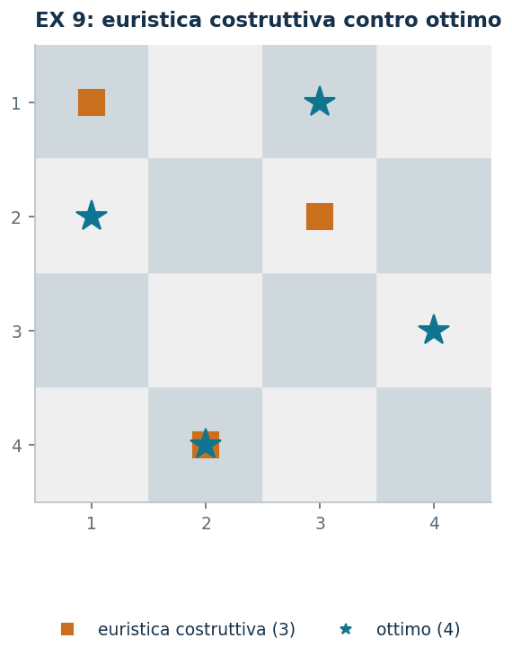

# EX 9 — Le otto regine

**Classe:** BIP · **Legami:** set packing, [alldiff](legami-12.md) · **Script:** `python/ex09_regine.py`<br><br>
**Difficoltà:** ★★☆ · **Tempo:** 30–45 min

[](https://colab.research.google.com/github/fabiofurini/modellazione-mip/blob/main/notebooks/ex09_regine.ipynb)

Uno dei [quindici modelli numerici](numerici.md): il più grande del capitolo, e
quello in cui il bound duale si scrive in una riga sola.

!!! abstract "EX 9"
    Su una scacchiera $8 \times 8$ si vuole collocare il **massimo numero di
    regine** in modo che nessuna possa catturarne un'altra in una sola mossa.
    Negli scacchi la regina si muove di un numero qualsiasi di caselle lungo la
    stessa riga, la stessa colonna o una delle due diagonali.

## Modello

La scacchiera è $n \times n$, con $n = 8$. Con $x_{ij} = 1$ se sulla casella
$(i,j)$ c'è una regina ($n^2 = 64$ binarie):

$$
\begin{aligned}
\max ~~ \sum_{i=1}^{n} \sum_{j=1}^{n} x_{ij} & &\\
\text{soggetto a} \quad \sum_{j=1}^{n} x_{ij} &\le 1, & \forall i \in \{1, 2, \dots, n\},\\
\sum_{i=1}^{n} x_{ij} &\le 1, & \forall j \in \{1, 2, \dots, n\},\\
\sum_{i-j=k} x_{ij} &\le 1, & \forall k \in \{-(n-1), -(n-2), \dots, n-1\},\\
\sum_{i+j=k} x_{ij} &\le 1, & \forall k \in \{2, 3, \dots, 2n\},\\
x_{ij} &\in \{0, 1\}, & \forall i \in \{1, 2, \dots, n\},\ \forall j \in \{1, 2, \dots, n\}.
\end{aligned}
$$

Un **set packing** su quattro famiglie di rette: $8$ righe, $8$ colonne e
$15 + 15$ diagonali, in tutto $46$ vincoli. Il trucco di indicizzazione è tutto
qui: le diagonali «discendenti» sono gli insiemi a $i - j$ costante, quelle
«ascendenti» gli insiemi a $i + j$ costante.

!!! note "Perché qui non si scrive il modello per esteso"
    Con $n = 8$ le variabili sono $64$ e i vincoli $46$: scritto a colonne il
    modello occuperebbe una pagina intera senza dire niente di più. È il solo
    caso del capitolo, insieme a [EX 15](ex-15.md), in cui la forma simbolica
    resta anche per l'istanza.

## Euristica costruttiva: il bound primale

È un **massimo**. Euristica riga per riga: nella riga $i$ si sceglie la prima
colonna libera che non sia attaccata dalle regine già piazzate; se non ce n'è, la
riga resta vuota. Non si torna mai indietro.

Sull'istanza l'euristica piazza le regine in $(1,1)$, $(2,3)$, $(3,5)$, $(4,2)$,
$(5,4)$ e poi si blocca: le righe $6$, $7$ e $8$ non hanno più caselle libere.

$$\mathit{LB} = 5.$$

## Rilassamento LP e duale: il bound duale

Il duale è un **set covering**: una variabile per ogni retta, e ogni casella va
coperta da almeno una delle quattro rette che la attraversano.

$$
\begin{aligned}
\min ~~ \sum_{i=1}^{n} \alpha_i + \sum_{j=1}^{n} \beta_j + \sum_{k=-(n-1)}^{n-1} \gamma_k + \sum_{k=2}^{2n} \delta_k &\\
\text{soggetto a}\quad \alpha_i + \beta_j + \gamma_{i-j} + \delta_{i+j} &\ge 1,
  \qquad \forall i \in \{1, 2, \dots, n\},\ \forall j \in \{1, 2, \dots, n\}.
\end{aligned}
$$

**La ricetta:** si usa una famiglia sola. Con $\bar\alpha_i = 1$ per ogni riga e
tutto il resto a zero, ogni casella $(i,j)$ ha $\alpha_i = 1 \ge 1$: la soluzione
è ammissibile e vale $n$. È la traduzione duale della frase «in ogni riga sta al
più una regina».

$$\mathit{UB} = 8.$$

## Ottimo e confronto

| $\mathit{LB}$ | $\mathit{UB}$ | $z(\mathit{LP})$ | $z(\mathit{LP}^+)$ | $z(\mathit{MILP})$ |
|---:|---:|---:|---:|---:|
| 5 | 8 | 8 | 8 | 8 |

Il bound duale è raggiunto: la soluzione trovata è ottima, e lo si sa **senza
fidarsi del solver**. L'euristica invece si ferma a $5$: è l'euristica, non il
bound, a lasciare il divario del $37{,}5\%$.

!!! tip "Due varianti"
    Su scacchiere $n \times n$ con $n = 4, 5, 6$ l'ottimo vale sempre $n$, e il
    certificato $\bar\alpha_i = 1$ lo dimostra. Per $n = 2$ e $n = 3$ invece
    l'ottimo vale $1$ e $2$: il bound $n$ resta valido ma non è raggiungibile, ed
    è il primo caso in cui questa ricetta duale non chiude il problema.

    Togliendo i vincoli sulle diagonali si ottengono le **torri** invece delle
    regine: il modello diventa un assegnamento, la matrice è totalmente
    unimodulare e il rilassamento LP dà già un valore intero.



## Codice

Lo script completo è
[`python/ex09_regine.py`](https://github.com/fabiofurini/modellazione-mip/blob/main/python/ex09_regine.py);
il notebook è
[`notebooks/ex09_regine.ipynb`](https://github.com/fabiofurini/modellazione-mip/blob/main/notebooks/ex09_regine.ipynb).

<!-- script-incorporato: inizio (rigenerato da python/incorpora_codice.py) -->

??? example "Mostra lo script completo — `python/ex09_regine.py` (162 righe)"

    ```python
    """EX 9 -- Otto regine sulla scacchiera (famiglia 11).

    Set packing su quattro famiglie di rette: righe, colonne e le due diagonali. Il
    duale del rilassamento si costruisce a mano in una riga sola (si paga 1 ogni
    riga) e vale esattamente quanto l'ottimo: e' un caso in cui il certificato chiude
    il problema. L'euristica euristica costruttiva invece si blocca a meno di otto regine.
    """
    import gurobipy as gp
    import pandas as pd
    from gurobipy import GRB

    from mip import (ammissibile, due_rilassamenti, frazione, nuovo_modello, registra_bound,
                     risolvi, valuta)
    from stile import ARANCIO, BLU, GRIGIO, TEAL, intestazione, plt, salva_dati, salva_figura
    from esteso import salva_modello

    R = range

    # ---------- 1. MODELLO E ISTANZA ----------
    intestazione("EX 9. Otto regine: il massimo numero di regine che non si attaccano")
    N = 8
    DIAG1 = R(-(N - 1), N)          # i - j costante
    DIAG2 = R(2, 2 * N + 1)         # i + j costante (indici da 1)


    def modello(n):
        m = nuovo_modello("regine")
        x = m.addVars(n, n, vtype=GRB.BINARY, name="x")
        m.setObjective(x.sum(), GRB.MAXIMIZE)
        m.addConstrs((x.sum(i, "*") <= 1 for i in R(n)), name="riga")
        m.addConstrs((x.sum("*", j) <= 1 for j in R(n)), name="colonna")
        m.addConstrs((gp.quicksum(x[i, j] for i in R(n) for j in R(n) if i - j == k) <= 1
                      for k in R(-(n - 1), n)), name="diag1")
        m.addConstrs((gp.quicksum(x[i, j] for i in R(n) for j in R(n) if i + j == k) <= 1
                      for k in R(0, 2 * n - 1)), name="diag2")
        return m, x


    def duale(n):
        """min sum_i alpha_i + sum_j beta_j + sum_k gamma_k + sum_k delta_k
           s.t. alpha_i + beta_j + gamma_{i-j} + delta_{i+j} >= 1 per ogni casella."""
        d = nuovo_modello("duale_regine")
        alpha = d.addVars(n, name="alpha")
        beta = d.addVars(n, name="beta")
        gamma = d.addVars(R(-(n - 1), n), name="gamma")
        delta = d.addVars(R(0, 2 * n - 1), name="delta")
        d.setObjective(alpha.sum() + beta.sum() + gamma.sum() + delta.sum(), GRB.MINIMIZE)
        d.addConstrs((alpha[i] + beta[j] + gamma[i - j] + delta[i + j] >= 1
                      for i in R(n) for j in R(n)), name="rc")
        return d


    m8, x8 = modello(N)
    salva_modello(m8, "ex09_primale")
    print(f"  Scacchiera {N}x{N}: {N * N} variabili binarie e {2 * N + (2 * N - 1) * 2} vincoli")
    print("  (una riga, una colonna e due diagonali per ogni retta della scacchiera).")

    # ---------- 2. EURISTICA COSTRUTTIVA (LOWER BOUND) ----------
    # euristica costruttiva riga per riga: la prima colonna libera che non e' attaccata dalle regine
    # gia' piazzate. Non torna mai indietro: se una riga non ha caselle libere, la salta.
    def euristica(n):
        pos = []
        passi = []
        for i in R(n):
            scelta = None
            for j in R(n):
                if all(j != jj and abs(i - ii) != abs(j - jj) for ii, jj in pos):
                    scelta = j
                    break
            if scelta is None:
                passi.append(f"riga {i + 1}: nessuna casella libera, la riga resta vuota")
            else:
                pos.append((i, scelta))
                passi.append(f"riga {i + 1}: prima casella libera in colonna {scelta + 1}")
        return pos, passi


    pos, passi = euristica(N)
    for k, riga in enumerate(passi, 1):
        print(f"  Passo {k}. {riga}")
    lb8 = len(pos)
    sol_eur = {f"x[{i},{j}]": 1 for i, j in pos}
    assert ammissibile(m8, sol_eur), sol_eur
    print(f"  Regine piazzate dall'euristica costruttiva: {lb8}  ->  lb = {frazione(lb8)}")

    # ---------- 3. RILASSAMENTO LP E DUALE (UPPER BOUND) ----------
    d8 = duale(N)
    salva_modello(d8, "ex09_duale")
    mano = {f"alpha[{i}]": 1.0 for i in R(N)}       # beta = gamma = delta = 0
    ub8, viol = valuta(d8, mano)
    assert viol <= 1e-9, viol
    print(f"  Duale a mano: alpha_i = 1 su ogni riga, tutto il resto zero. Ogni casella (i, j) ha")
    print(f"  alpha_i = 1 >= 1: la soluzione e' ammissibile e vale {frazione(ub8)}.")
    print("  E' la traduzione duale della frase «in ogni riga sta al piu' una regina».")
    zlp8, zlp8r, _ = due_rilassamenti(m8, d8)

    # ---------- 4. OTTIMO DEL MILP ----------
    z8 = risolvi(m8)
    ott = [(i, j) for i in R(N) for j in R(N) if x8[i, j].X > 0.5]
    print("  Soluzione ottima (una regina per riga): "
          + ", ".join(f"riga {i + 1} colonna {j + 1}" for i, j in sorted(ott)))
    riga = registra_bound("EX 9 regine", ub8, lb8, zlp8, zlp8r, z8, senso="max")
    salva_dati(pd.DataFrame([riga]), "ex09_bound")
    salva_dati(pd.DataFrame([{"riga": i + 1, "colonna": j + 1} for i, j in sorted(ott)]),
               "ex09_ottimo")
    assert lb8 <= z8 <= zlp8 <= ub8 + 1e-9
    print(f"  Il bound duale {frazione(ub8)} e' raggiunto: la soluzione trovata e' ottima, e lo")
    print("  sappiamo senza fidarci del solver. L'euristica costruttiva invece si ferma prima: e' l'euristica,")
    print("  non il bound, a lasciare il divario.")

    # ---------- 5. DUE VARIANTI ----------
    intestazione("EX 9. Varianti")
    varianti = {}
    # 8a: scacchiere piu' piccole; per n = 2 e n = 3 non si arriva a n regine
    for n in (4, 5, 6):
        m, x = modello(n)
        z = risolvi(m)
        varianti[f"n = {n}"] = z
        print(f"  Scacchiera {n}x{n}: z = {frazione(z)} (= n)")
        assert abs(z - n) <= 1e-9
    for n in (2, 3):
        m, x = modello(n)
        z = risolvi(m)
        varianti[f"n = {n}"] = z
        print(f"  Scacchiera {n}x{n}: z = {frazione(z)} < {n}: il bound duale n non e' raggiungibile")
        assert z < n - 0.5
    salva_dati(pd.DataFrame({"scacchiera": list(varianti), "z": list(varianti.values())}),
               "ex09_varianti")
    # 8b: le diagonali non contano (torri invece di regine)
    m, x = modello(N)
    m.update()
    for c in [c for c in m.getConstrs() if c.ConstrName.startswith("diag")]:
        m.remove(c)
    m.update()
    z_torri = risolvi(m)
    print(f"  Senza i vincoli sulle diagonali (torri invece di regine): z = {frazione(z_torri)},")
    print("  e il modello diventa un assegnamento: la matrice e' totalmente unimodulare e il")
    print("  rilassamento lineare da' gia' un valore intero.")

    # ---------- 6. FIGURA ----------
    fig, ax = plt.subplots(figsize=(4.4, 4.4))
    for i in R(N):
        for j in R(N):
            ax.add_patch(plt.Rectangle((j, N - 1 - i), 1, 1,
                                       color="#EFEFEF" if (i + j) % 2 else "#CFD8DC"))
    for i, j in pos:
        ax.plot(j + 0.5, N - 1 - i + 0.5, marker="s", color=ARANCIO, ms=13)
    for i, j in ott:
        ax.plot(j + 0.5, N - 1 - i + 0.5, marker="*", color=TEAL, ms=17)
    ax.plot([], [], marker="s", ls="", color=ARANCIO, label=f"euristica costruttiva ({lb8})")
    ax.plot([], [], marker="*", ls="", color=TEAL, label=f"ottimo ({int(z8)})")
    ax.set_xlim(0, N)
    ax.set_ylim(0, N)
    ax.set_xticks([j + 0.5 for j in R(N)])
    ax.set_xticklabels([str(j + 1) for j in R(N)])
    ax.set_yticks([i + 0.5 for i in R(N)])
    ax.set_yticklabels([str(N - i) for i in R(N)])
    ax.set_aspect("equal")
    ax.set_title("EX 9: euristica costruttiva contro ottimo")
    ax.legend(fontsize=8, loc="upper center", bbox_to_anchor=(0.5, -0.06), ncol=2)
    salva_figura(fig, "ex09_scacchiera")
    print("Fine.")
    ```

<!-- script-incorporato: fine -->
