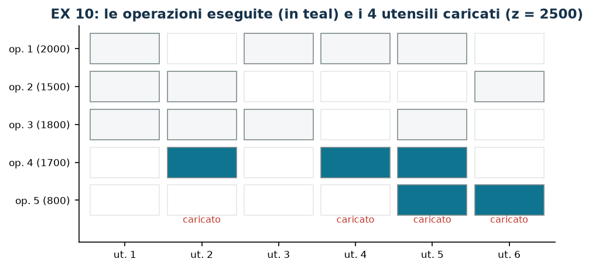

# EX 10 — Utensili di una macchina CNC

**Classe:** BIP · **Legami:** [attivazione disaggregata](legami-01.md) · **Script:** `python/ex10_utensili.py`

[](https://colab.research.google.com/github/fabiofurini/modellazione-mip/blob/main/notebooks/ex10_utensili.ipynb)

Uno dei [quindici modelli numerici](numerici.md), della famiglia [localizzazione e copertura](localizzazione.md),
con rimando alla famiglia della selezione.

!!! abstract "EX 10"
    Una macchina CNC può eseguire cinque operazioni; ciascuna richiede un
    sottoinsieme di sei utensili e, se eseguita, rende un profitto:

    | Operazione | Utensili richiesti | Profitto (€) |
    |---|---|---:|
    | 1 | 1, 3, 4, 5 | 2000 |
    | 2 | 1, 2, 6 | 1500 |
    | 3 | 1, 2, 3, 5 | 1800 |
    | 4 | 2, 4, 5 | 1700 |
    | 5 | 5, 6 | 800 |

    Il magazzino tiene al più $k = 4$ utensili alla volta. Si vuole la
    configurazione di profitto massimo.

## Modello

Con $x_i = 1$ se l'operazione $i$ è eseguita ($5$ binarie), $y_j = 1$ se
l'utensile $j$ è caricato ($6$ binarie), e $T_i$ l'insieme degli utensili
richiesti dall'operazione $i$:

$$
\begin{aligned}
\max ~~ \sum_{i=1}^{5} p_i\, x_i & & \\
\text{soggetto a} \quad \sum_{j=1}^{6} y_j &\le k, & \\
x_i - y_j &\le 0, & \forall i,\ \forall j \in T_i,\\
x_i,\ y_j &\in \{0,1\}. &
\end{aligned}
$$

Un vincolo di magazzino e $\sum_i |T_i| = 16$ vincoli di link. È
l'[attivazione disaggregata](legami-01.md) letta al rovescio: qui l'operazione è
l'oggetto, gli utensili sono le risorse, e l'operazione richiede **tutti** i
suoi utensili — una congiunzione nel conseguente, che per la
[tabella del capitolo 2](modellazione-2.md) costa un vincolo per utensile.

## Euristica costruttiva: il bound primale

È un **massimo**. Euristica costruttiva per profitto decrescente: si carica il corredo di
ciascuna operazione, se il magazzino lo permette.

- **Operazione 1** ($2000$, utensili $1, 3, 4, 5$): servono $4$ utensili nuovi,
  il magazzino arriva esattamente a $4$: si esegue.
- **Operazioni 3, 4, 2, 5**: ciascuna richiederebbe almeno un utensile in più, e
  il magazzino è pieno: si scartano.

$\mathit{LB} = 2000$.

## Rilassamento LP e duale: il bound duale

Rilassando a $x_i, y_j \ge 0$, con $\alpha \ge 0$ per il vincolo di magazzino e
$\beta_{ij} \ge 0$ per ciascun vincolo di link:

$$
\begin{aligned}
\min ~~ k\,\alpha & & \\
\text{soggetto a} \quad \sum_{j \in T_i} \beta_{ij} &\ge p_i, & \forall i \in \{1, \dots, 5\},\\
\sum_{i \,:\, j \in T_i} \beta_{ij} &\le \alpha, & \forall j \in \{1, \dots, 6\},\\
\alpha,\ \beta_{ij} &\ge 0. &
\end{aligned}
$$

Si legge: $\beta_{ij}$ è la parte del profitto dell'operazione $i$ attribuita
all'utensile $j$; il primo gruppo chiede che le parti coprano tutto il profitto,
il secondo che nessun utensile riceva più di $\alpha$; l'obiettivo paga $\alpha$
per ciascuno dei $k$ posti in magazzino.

**La ricetta.** Si spalma il profitto di ogni operazione in parti uguali sugli
utensili che le servono, $\bar\beta_{ij} = p_i / |T_i|$; poi
$\bar\alpha = \max_j \sum_{i : j \in T_i} \bar\beta_{ij}$.

| $\bar\beta_{ij} = p_i/\|T_i\|$ | ut. 1 | ut. 2 | ut. 3 | ut. 4 | ut. 5 | ut. 6 |
|---|---:|---:|---:|---:|---:|---:|
| op. 1: $2000/4 = 500$ | 500 | | 500 | 500 | 500 | |
| op. 2: $1500/3 = 500$ | 500 | 500 | | | | 500 |
| op. 3: $1800/4 = 450$ | 450 | 450 | 450 | | 450 | |
| op. 4: $1700/3$ | | $1700/3$ | | $1700/3$ | $1700/3$ | |
| op. 5: $800/2 = 400$ | | | | | 400 | 400 |
| **totale** | 1450 | $4550/3$ | 950 | $3200/3$ | **$5750/3$** | 900 |

L'utensile critico è il $5$, richiesto da quattro operazioni su cinque: quindi
$\bar\alpha = 5750/3$ e
$\mathit{UB} = k\bar\alpha = 23000/3 \approx 7666{,}7$.

!!! danger "Una soluzione duale va verificata, non proposta"
    Una scelta che viene naturale è $\bar\alpha = 2000$ con tutti i
    $\bar\beta_{ij} = 900$: i vincoli sulle operazioni sono soddisfatti
    ($2 \cdot 900 = 1800 \ge 800$ è il caso più stretto) e il valore sarebbe
    $4 \cdot 2000 = 8000$. **Ma quella soluzione non è ammissibile.** Il secondo
    gruppo chiede $\sum_{i : j \in T_i} \beta_{ij} \le \alpha$, e l'utensile $5$
    serve a *quattro* operazioni: riceverebbe $4 \cdot 900 = 3600 > 2000$. La
    violazione è di $1600$, e $8000$ non è un bound.

    È la ragione per cui il protocollo del corso non chiede di *proporre* una
    soluzione duale ma di *verificarla*: lo script controlla ogni vincolo, e un
    `assert` fallisce se la violazione supera la tolleranza. Con la ricetta
    corretta il bound è $23000/3 \approx 7666{,}7$, cioè **migliore** di quello
    che si sperava di ottenere sbagliando.

| $LB$ (euristica costruttiva) | $z(\mathit{MILP})$ | $z(\mathit{LP})$ | $z(\mathit{LP}^+)$ | $UB$ (duale a mano) | gap euristica |
|---:|---:|---:|---:|---:|---:|
| 2000 | 2500 | 5200 | 5200 | $23000/3$ | $20{,}0\%$ |

L'ottimo carica gli utensili $2, 4, 5, 6$ ed esegue le operazioni $4$ ($1700$) e
$5$ ($800$). Nessuna configurazione da quattro utensili rende di più: con
$\{1,3,4,5\}$ si esegue solo l'operazione 1 ($2000$), con $\{1,2,3,5\}$ solo la
3 ($1800$).



!!! tip "Perché qui il rilassamento è così debole"
    $z(\mathit{LP}) = 5200$ contro $z(\mathit{MILP}) = 2500$: più del doppio.
    Nel continuo si può caricare «un po'» di ogni utensile — per esempio
    $y_j = 2/3$ per sei utensili, che rispetta $\sum_j y_j \le 4$ — ed eseguire
    una frazione di *ogni* operazione. L'interezza del magazzino è tutto: è il
    caso in cui i bound a mano, per quanto ben costruiti, non bastano e serve il
    branch-and-bound. Un modo per rafforzare è aggiungere le disuguaglianze
    valide $\sum_{j \in T_i} y_j \ge |T_i| x_i$ (la forma aggregata dei link).

## Codice

Lo script completo — che verifica anche l'inammissibilità della ricetta duale
della bozza — è
[`python/ex10_utensili.py`](https://github.com/fabiofurini/modellazione-mip/blob/main/python/ex10_utensili.py);
il notebook è
[`notebooks/ex10_utensili.ipynb`](https://github.com/fabiofurini/modellazione-mip/blob/main/notebooks/ex10_utensili.ipynb).

<!-- script-incorporato: inizio (rigenerato da python/incorpora_codice.py) -->

??? example "Mostra lo script completo — `python/ex10_utensili.py` (149 righe)"

    ```python
    """EX 10 -- Utensili CNC: selezione delle operazioni con magazzino limitato (famiglia 8).

    Attivazione disaggregata al rovescio: un'operazione si esegue solo se *tutti* i
    suoi utensili sono caricati, e il magazzino ne tiene al piu' quattro. E' un
    massimo, quindi l'euristica da' il lower bound e il duale l'upper.

    La bozza dell'archivio proponeva alpha = 2000 con tutti i moltiplicatori a 900:
    quella soluzione duale *non e' ammissibile*, perche' alcuni utensili servono a
    piu' di due operazioni. Qui la ricetta duale e' diversa e viene verificata.
    """
    import gurobipy as gp
    import pandas as pd
    from gurobipy import GRB

    from mip import (ammissibile, due_rilassamenti, frazione, nuovo_modello, registra_bound,
                     risolvi, valuta)
    from stile import intestazione, plt, salva_dati, salva_figura

    R = range

    # ---------- 1. MODELLO E ISTANZA ----------
    intestazione("EX 10. Utensili CNC: quali operazioni eseguire con al piu' quattro utensili")
    pr = [2000, 1500, 1800, 1700, 800]            # profitto delle cinque operazioni
    T = [[0, 2, 3, 4], [0, 1, 5], [0, 1, 2, 4], [1, 3, 4], [4, 5]]   # utensili richiesti (0-based)
    no, nu, K = 5, 6, 4
    salva_dati(pd.DataFrame([{"operazione": i + 1,
                              "utensili": ", ".join(str(j + 1) for j in T[i]),
                              "profitto": pr[i]} for i in R(no)]), "ex10_operazioni")


    def modello(pr, T, K):
        no, nu = len(pr), max(max(t) for t in T) + 1
        m = nuovo_modello("utensili_cnc")
        x = m.addVars(no, vtype=GRB.BINARY, name="x")
        y = m.addVars(nu, vtype=GRB.BINARY, name="y")
        m.setObjective(gp.quicksum(pr[i] * x[i] for i in R(no)), GRB.MAXIMIZE)
        m.addConstr(y.sum() <= K, name="magazzino")
        for i in R(no):
            for j in T[i]:
                m.addConstr(x[i] - y[j] <= 0, name=f"link[{i},{j}]")
        return m, x, y


    def duale(pr, T, K):
        """min K alpha;  sum_{j in T_i} beta_ij >= p_i;  sum_{i : j in T_i} beta_ij <= alpha;
        alpha, beta >= 0."""
        no, nu = len(pr), max(max(t) for t in T) + 1
        d = nuovo_modello("duale_utensili")
        alpha = d.addVar(name="alpha")
        beta = d.addVars([(i, j) for i in R(no) for j in T[i]], name="beta")
        d.setObjective(K * alpha, GRB.MINIMIZE)
        d.addConstrs((gp.quicksum(beta[i, j] for j in T[i]) >= pr[i] for i in R(no)), name="rc_x")
        d.addConstrs((gp.quicksum(beta[i, j] for i in R(no) if j in T[i]) <= alpha for j in R(nu)),
                     name="rc_y")
        return d


    m, x, y = modello(pr, T, K)

    # ---------- 2. EURISTICA COSTRUTTIVA (LOWER BOUND: E' UN MASSIMO) ----------
    # euristica costruttiva: si scandiscono le operazioni per profitto decrescente e si carica il
    # corredo di utensili di ciascuna, finche' il magazzino lo permette
    carichi, eseguite = set(), []
    for i in sorted(R(no), key=lambda i: -pr[i]):
        nuovi = set(T[i]) - carichi
        if len(carichi) + len(nuovi) <= K:
            carichi |= nuovi
            eseguite.append(i)
            print(f"  Operazione {i + 1} (profitto {pr[i]}, utensili "
                  + ", ".join(str(j + 1) for j in T[i])
                  + f"): ne servono {len(nuovi)} nuovi, il magazzino arriva a {len(carichi)} <= {K}: si esegue")
        else:
            print(f"  Operazione {i + 1} (profitto {pr[i]}): servirebbero {len(nuovi)} utensili nuovi, "
                  f"il magazzino arriverebbe a {len(carichi) + len(nuovi)} > {K}: si scarta")
    lb = sum(pr[i] for i in eseguite)
    sol_eur = {f"x[{i}]": 1 for i in eseguite} | {f"y[{j}]": 1 for j in carichi}
    assert ammissibile(m, sol_eur)
    print(f"  Soluzione euristica: operazioni " + ", ".join(str(i + 1) for i in sorted(eseguite))
          + " con utensili " + ", ".join(str(j + 1) for j in sorted(carichi))
          + f"   lb = {frazione(lb)}")

    # ---------- 3. RILASSAMENTO LP E DUALE (UPPER BOUND) ----------
    d = duale(pr, T, K)
    # ricetta: si spalma il profitto di ogni operazione in parti uguali sui suoi utensili,
    # e alpha e' il carico massimo che un utensile riceve
    mano = {f"beta[{i},{j}]": pr[i] / len(T[i]) for i in R(no) for j in T[i]}
    carico = {j: sum(mano[f"beta[{i},{j}]"] for i in R(no) if j in T[i]) for j in R(nu)}
    mano["alpha"] = max(carico.values())
    ub, viol = valuta(d, mano)
    assert viol <= 1e-9, viol
    print("  Duale a mano: beta_ij = p_i / |T_i| (il profitto spalmato sugli utensili che servono)")
    for i in R(no):
        print(f"    operazione {i + 1}: {pr[i]} / {len(T[i])} = "
              f"{frazione(pr[i] / len(T[i]))} su ciascuno dei suoi utensili")
    print("  Carico di ciascun utensile: "
          + ", ".join(f"{j + 1}: {frazione(carico[j])}" for j in R(nu)))
    utensile_critico = max(carico, key=carico.get)
    print(f"  Il massimo e' l'utensile {utensile_critico + 1}, quindi alpha = "
          f"{frazione(mano['alpha'])} e ub = {K} alpha = {frazione(ub)}")
    # la ricetta della bozza dell'archivio NON e' ammissibile: si verifica
    bozza = {f"beta[{i},{j}]": 900 for i in R(no) for j in T[i]} | {"alpha": 2000}
    _, viol_bozza = valuta(d, bozza)
    assert viol_bozza > 1e-6
    peggiore = max(R(nu), key=lambda j: sum(900 for i in R(no) if j in T[i]))
    print(f"  Controllo della ricetta della bozza (alpha = 2000, tutti i beta = 900): NON")
    print(f"  ammissibile, violazione massima {frazione(viol_bozza)}. L'utensile "
          f"{peggiore + 1} serve a "
          f"{sum(1 for i in R(no) if peggiore in T[i])} operazioni, quindi riceve "
          f"{sum(900 for i in R(no) if peggiore in T[i])} > 2000.")
    zlp, zlpr, pi = due_rilassamenti(m, d)

    # ---------- 4. OTTIMO DEL MILP E TABELLA DEI BOUND ----------
    z = risolvi(m)
    op_ott = [i for i in R(no) if x[i].X > 0.5]
    ut_ott = [j for j in R(nu) if y[j].X > 0.5]
    print(f"  Soluzione ottima: operazioni " + ", ".join(str(i + 1) for i in op_ott)
          + " con utensili " + ", ".join(str(j + 1) for j in ut_ott)
          + f"   z(MILP) = {frazione(z)}")
    riga = registra_bound("EX 10 utensili CNC", ub, lb, zlp, zlpr, z, senso="max")
    salva_dati(pd.DataFrame([riga]), "ex10_bound")
    assert lb <= z <= zlp + 1e-9 <= ub + 1e-9
    print(f"  Il sandwich: {frazione(lb)} <= z(MILP) = {frazione(z)} <= z(LP) = {frazione(zlp)} "
          f"<= ub = {frazione(ub)}")
    print("  Qui il rilassamento e' molto debole: nel continuo si puo' caricare 'un po'' di")
    print("  ogni utensile ed eseguire frazioni di tutte le operazioni.")

    # ---------- 5. FIGURA ----------
    fig, ax = plt.subplots(figsize=(7.0, 3.2))
    for i in R(no):
        for j in R(nu):
            serve = j in T[i]
            colore = ("#0E7490" if i in op_ott else "#F4F6F7") if serve else "white"
            ax.add_patch(plt.Rectangle((j - 0.45, i - 0.4), 0.9, 0.8, facecolor=colore,
                                       edgecolor="#7F8C8D" if serve else "#E5E8E8", lw=0.8))
    for j in ut_ott:
        ax.annotate("caricato", (j, no - 0.35), ha="center", va="bottom", fontsize=7.5,
                    color="#C0392B", rotation=0)
    ax.set_xlim(-0.6, nu - 0.4)
    ax.set_ylim(-0.6, no + 0.1)
    ax.set_xticks(R(nu))
    ax.set_xticklabels([f"ut. {j + 1}" for j in R(nu)], fontsize=8)
    ax.set_yticks(R(no))
    ax.set_yticklabels([f"op. {i + 1} ({pr[i]})" for i in R(no)], fontsize=8)
    ax.set_title(f"EX 10: le operazioni eseguite (in teal) e i {K} utensili caricati "
                 f"(z = {frazione(z)})")
    ax.invert_yaxis()
    ax.grid(False)
    salva_figura(fig, "ex10_ottimo")
    print("Fine.")
    ```

<!-- script-incorporato: fine -->
