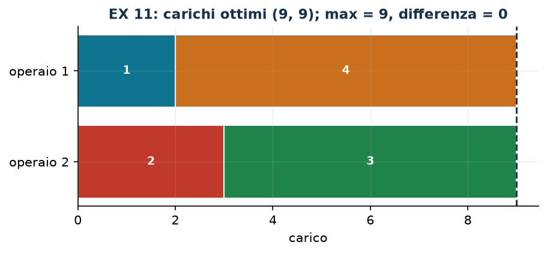

# EX 11 — Bilanciamento fra due operai

**Classe:** MILP · **Legami:** [min-max](legami-06.md), [valore assoluto](legami-07.md) · **Script:** `python/ex11_bilanciamento.py`

[](https://colab.research.google.com/github/fabiofurini/modellazione-mip/blob/main/notebooks/ex11_bilanciamento.ipynb)

Modello numerico della famiglia [assegnamento e scheduling](scheduling.md), con
rimando alla famiglia della partizione e del bilanciamento.

!!! abstract "EX 11"
    Quattro lavori indivisibili di durata $2$, $3$, $6$ e $7$ vanno assegnati a
    due operai in modo che i loro carichi siano il più possibile bilanciati.

!!! danger "«Bilanciato» va tradotto, e la traduzione si dichiara"
    «Carichi bilanciati» non è un obiettivo: è una parola. Le due traduzioni
    lineari sono quelle della [tecnica 3.6](legami-06.md): minimizzare il
    **massimo** dei carichi, oppure minimizzare la loro **differenza**. Poiché
    il totale $D = 18$ è costante, vale l'identità

    $$\max(W_1, W_2) = \frac{D}{2} + \frac{|W_1 - W_2|}{2},$$

    quindi i due modelli hanno le *stesse* soluzioni ottime — ma valori ottimi
    diversi: $9$ il primo, $0$ il secondo. Riportare «$9$» come «differenza fra
    i carichi» è un errore, e riportare «$0$» come «carico massimo» pure.

## Modello (min-max)

Con $x_j = 1$ se il lavoro $j$ va all'operaio 1 e $z \ge 0$ il carico massimo:

$$
\begin{aligned}
\min ~~ z & & \\
\text{soggetto a} \quad \sum_{j=1}^{4} d_j x_j - z &\le 0, & \text{(carico dell'operaio 1)}\\
-\sum_{j=1}^{4} d_j x_j - z &\le -D, & \text{(carico dell'operaio 2)}\\
x_j \in \{0,1\}, \qquad z &\ge 0. &
\end{aligned}
$$

## Euristica costruttiva: il bound primale

[LPT](modellazione-5.md): i lavori in ordine di durata decrescente, ciascuno
all'operaio meno carico. Lavoro 4 ($7$) all'operaio 1; lavoro 3 ($6$)
all'operaio 2; lavoro 2 ($3$) all'operaio 2, che arriva a $9$; lavoro 1 ($2$)
all'operaio 1, che arriva a $9$. Carichi $(9, 9)$, quindi $\mathit{UB} = 9$.

## Rilassamento LP e duale: il bound duale

Rilassando a $x_j \ge 0$ e usando la tabella di conversione — primale di
**minimo** con vincoli $\le$, quindi variabili duali $\pi_1, \pi_2 \le 0$:

$$
\begin{aligned}
\max ~~ -D\,\pi_2 & & \\
\text{soggetto a} \quad d_j\,(\pi_1 - \pi_2) &\le 0, & \forall j \in \{1, \dots, 4\},\\
-\pi_1 - \pi_2 &\le 1, & \text{(dalla colonna di } z)\\
\pi_1,\ \pi_2 &\le 0. &
\end{aligned}
$$

Poiché $d_j > 0$, i primi vincoli dicono $\pi_1 \le \pi_2$. Ponendo
$\pi_1 = \pi_2 = t$, il vincolo su $z$ dà $-2t \le 1$, cioè $t \ge -1/2$;
l'obiettivo $-D t$ è massimo per $t = -1/2$ e vale $\mathit{LB} = D/2 = 9$.
Significato: «i due carichi sommano a $D$, quindi il maggiore vale almeno
$D/2$».

!!! note "La stessa cosa con variabili duali non negative"
    Molte trattazioni preferiscono variabili duali $\ge 0$. Basta porre
    $\alpha = -\pi_1$ e $\beta = -\pi_2$: il duale diventa $\max D\beta$ con
    $\alpha \le \beta$ e $\alpha + \beta \le 1$, e $\alpha = \beta = 1/2$ dà di
    nuovo $9$. È la *stessa* soluzione scritta con l'altro segno; quello che non
    si può fare è dichiarare variabili $\ge 0$ e poi usarne una negativa.

| $UB$ (LPT) | $LB$ (duale a mano) | $z(\mathit{LP})$ | $z(\mathit{MILP})$ | gap euristica |
|---:|---:|---:|---:|---:|
| 9 | 9 | 9 | 9 | $0{,}0\%$ |

Tutti i numeri coincidono: i due bound a mano si toccano e l'ottimalità è
dimostrata senza risolvere il MILP. Succede perché $D$ è pari e i lavori si
possono spezzare esattamente a metà; con $D$ dispari il bound diventerebbe
$\lceil D/2 \rceil$ e servirebbe un argomento in più.



## Codice

Lo script completo — che risolve anche la versione «minima differenza» e
verifica l'identità fra i due obiettivi — è
[`python/ex11_bilanciamento.py`](https://github.com/fabiofurini/modellazione-mip/blob/main/python/ex11_bilanciamento.py);
il notebook è
[`notebooks/ex11_bilanciamento.ipynb`](https://github.com/fabiofurini/modellazione-mip/blob/main/notebooks/ex11_bilanciamento.ipynb).

<!-- script-incorporato: inizio (rigenerato da python/incorpora_codice.py) -->

??? example "Mostra lo script completo — `python/ex11_bilanciamento.py` (152 righe)"

    ```python
    """EX 11 -- Bilanciamento fra due operai (famiglia 7, rimando alla 11).

    Quattro lavori indivisibili di durata 2, 3, 6, 7 e due operai: si vogliono
    carichi il piu' possibile bilanciati.

    Due avvertenze che la bozza dell'archivio confondeva:
    1. «carichi bilanciati» si puo' scrivere come min-max oppure come min della
       differenza: le soluzioni ottime sono le stesse (il totale e' costante) ma i
       *valori* dell'obiettivo non coincidono. Qui si riportano entrambi.
    2. il duale va scritto con i segni della tabella di conversione: in un minimo
       con vincoli <= le variabili duali sono <= 0. La presentazione con variabili
       >= 0 e' la stessa, a segni cambiati, e si mostra anche quella.
    """
    import gurobipy as gp
    import pandas as pd
    from gurobipy import GRB

    from mip import (ammissibile, due_rilassamenti, frazione, nuovo_modello, registra_bound,
                     risolvi, valuta)
    from stile import intestazione, plt, salva_dati, salva_figura

    R = range

    # ---------- 1. MODELLO E ISTANZA ----------
    intestazione("EX 11. Bilanciamento: quattro lavori indivisibili su due operai")
    d = [2, 3, 6, 7]
    n, D = len(d), sum(d)
    print(f"  Durate {d}; totale {D}; a carichi perfettamente pari ciascuno farebbe {frazione(D / 2)}")
    salva_dati(pd.DataFrame({"lavoro": R(1, n + 1), "durata": d}), "ex11_lavori")


    def modello_minmax(d):
        """min z  con  sum_j d_j x_j <= z  e  D - sum_j d_j x_j <= z."""
        n, D = len(d), sum(d)
        m = nuovo_modello("bilanciamento_minmax")
        x = m.addVars(n, vtype=GRB.BINARY, name="x")
        z = m.addVar(name="z")
        m.setObjective(z, GRB.MINIMIZE)
        m.addConstr(gp.quicksum(d[j] * x[j] for j in R(n)) - z <= 0, name="carico1")
        m.addConstr(-gp.quicksum(d[j] * x[j] for j in R(n)) - z <= -D, name="carico2")
        return m, x, z


    def modello_differenza(d):
        """min s  con  s >= W1 - W2  e  s >= W2 - W1: la stessa scelta, un altro numero."""
        n, D = len(d), sum(d)
        m = nuovo_modello("bilanciamento_differenza")
        x = m.addVars(n, vtype=GRB.BINARY, name="x")
        s = m.addVar(name="s")
        m.setObjective(s, GRB.MINIMIZE)
        carico1 = gp.quicksum(d[j] * x[j] for j in R(n))
        m.addConstr(s >= 2 * carico1 - D, name="abs_piu")
        m.addConstr(s >= D - 2 * carico1, name="abs_meno")
        return m, x, s


    def duale_minmax(d):
        """Duale del rilassamento senza i bound, con la convenzione del corso (pi <= 0):
           max 0*pi1 - D*pi2   s.t.  d_j (pi1 - pi2) <= 0 per ogni j;  -pi1 - pi2 <= 1;  pi <= 0."""
        n, D = len(d), sum(d)
        dl = nuovo_modello("duale_bilanciamento")
        pi1 = dl.addVar(lb=-GRB.INFINITY, ub=0.0, name="pi1")
        pi2 = dl.addVar(lb=-GRB.INFINITY, ub=0.0, name="pi2")
        dl.setObjective(-D * pi2, GRB.MAXIMIZE)
        dl.addConstrs((d[j] * (pi1 - pi2) <= 0 for j in R(n)), name="rc_x")
        dl.addConstr(-pi1 - pi2 <= 1, name="rc_z")
        return dl, pi1, pi2


    m, x, z = modello_minmax(d)

    # ---------- 2. EURISTICA COSTRUTTIVA (UPPER BOUND) ----------
    # LPT su due operai: i lavori in ordine di durata decrescente, ciascuno al meno carico
    carico = [0, 0]
    assegn = {}
    for j in sorted(R(n), key=lambda j: -d[j]):
        k = 0 if carico[0] <= carico[1] else 1
        assegn[j] = k
        print(f"  Lavoro {j + 1} (durata {d[j]}): carichi {carico}; il minore e' l'operaio "
              f"{k + 1}, che passa a {carico[k] + d[j]}")
        carico[k] += d[j]
    ub = max(carico)
    sol_eur = {f"x[{j}]": 1 for j in R(n) if assegn[j] == 0} | {"z": ub}
    assert ammissibile(m, sol_eur)
    print(f"  Soluzione euristica: operaio 1 = {[j + 1 for j in R(n) if assegn[j] == 0]}, "
          f"operaio 2 = {[j + 1 for j in R(n) if assegn[j] == 1]}, carichi {carico}")
    print(f"  ub = max dei carichi = {frazione(ub)}")

    # ---------- 3. RILASSAMENTO LP E DUALE (LOWER BOUND) ----------
    dl, pi1, pi2 = duale_minmax(d)
    # ricetta: i vincoli d_j (pi1 - pi2) <= 0 impongono pi1 <= pi2; con pi1 = pi2 = t il
    # vincolo -pi1 - pi2 <= 1 da' t >= -1/2, e l'obiettivo -D t cresce al calare di t
    mano = {"pi1": -0.5, "pi2": -0.5}
    lb, viol = valuta(dl, mano)
    assert viol <= 1e-9, viol
    print("  Duale a mano: i vincoli d_j (pi1 - pi2) <= 0 impongono pi1 <= pi2; ponendo")
    print("  pi1 = pi2 = t, il vincolo -pi1 - pi2 <= 1 da' t >= -1/2, e l'obiettivo -D t")
    print(f"  e' massimo per t = -1/2:  lb = -{D} * (-1/2) = {frazione(lb)}")
    print("  Presentazione equivalente a segni cambiati (alpha = -pi1, beta = -pi2, >= 0):")
    print("  max D beta con alpha <= beta e alpha + beta <= 1; alpha = beta = 1/2 da' lo stesso 9.")
    print("  Significato: «i due carichi sommano a D, quindi il maggiore vale almeno D/2».")
    zlp, zlpr, pi = due_rilassamenti(m, dl)

    # ---------- 4. OTTIMO DEL MILP E TABELLA DEI BOUND ----------
    zv = risolvi(m)
    op1 = [j + 1 for j in R(n) if x[j].X > 0.5]
    op2 = [j + 1 for j in R(n) if x[j].X <= 0.5]
    c1 = sum(d[j - 1] for j in op1)
    print(f"  Soluzione ottima (min-max): operaio 1 = {op1} (carico {c1}), operaio 2 = {op2} "
          f"(carico {D - c1});  z(MILP) = {frazione(zv)}")
    riga = registra_bound("EX 11 bilanciamento", ub, lb, zlp, zlpr, zv)
    salva_dati(pd.DataFrame([riga]), "ex11_bound")
    assert lb <= zlp <= zv <= ub + 1e-9

    # ---------- 5. LO STESSO PROBLEMA CON L'OBIETTIVO «DIFFERENZA» ----------
    intestazione("EX 11 (seguito). Lo stesso problema scritto come minima differenza")
    md, xd, sd = modello_differenza(d)
    zd = risolvi(md)
    op1d = [j + 1 for j in R(n) if xd[j].X > 0.5]
    c1d = sum(d[j - 1] for j in op1d)
    print(f"  Soluzione ottima (differenza): operaio 1 = {op1d} (carico {c1d}), carichi "
          f"({c1d}, {D - c1d});  z = {frazione(zd)}")
    print(f"  La ripartizione e' la stessa; i due obiettivi valgono {frazione(zv)} e "
          f"{frazione(zd)}.")
    print(f"  Il legame e' esatto: max = D/2 + differenza/2, cioe' {frazione(D / 2)} + "
          f"{frazione(zd / 2)} = {frazione(zv)}.")
    assert abs(zv - (D / 2 + zd / 2)) < 1e-9
    print("  Percio' i due modelli hanno le stesse soluzioni ottime, ma i loro valori non si")
    print("  confrontano: chiamare 'differenza' il valore del min-max e' un errore.")
    salva_dati(pd.DataFrame([{"obiettivo": "min-max", "z": zv},
                             {"obiettivo": "minima differenza", "z": zd}]), "ex11_obiettivi")

    # ---------- 6. FIGURA ----------
    fig, ax = plt.subplots(figsize=(6.6, 2.6))
    colori = ["#0E7490", "#C0392B", "#1E8449", "#CA6F1E"]
    for k, lavori in enumerate([op1, op2]):
        inizio = 0
        for j in lavori:
            ax.barh(k, d[j - 1], left=inizio, color=colori[(j - 1) % 4], edgecolor="white")
            ax.annotate(f"{j}", (inizio + d[j - 1] / 2, k), ha="center", va="center",
                        color="white", fontsize=9, fontweight="bold")
            inizio += d[j - 1]
    ax.axvline(D / 2, color="#16324A", ls="--", lw=1.4)
    ax.annotate(f"D/2 = {frazione(D / 2)}", (D / 2, -0.62), ha="center", fontsize=9, color="#16324A")
    ax.set_yticks([0, 1])
    ax.set_yticklabels(["operaio 1", "operaio 2"])
    ax.set_xlabel("carico")
    ax.set_title(f"EX 11: carichi ottimi ({c1}, {D - c1}); max = {frazione(zv)}, "
                 f"differenza = {frazione(zd)}")
    ax.invert_yaxis()
    salva_figura(fig, "ex11_ottimo")
    print("Fine.")
    ```

<!-- script-incorporato: fine -->
