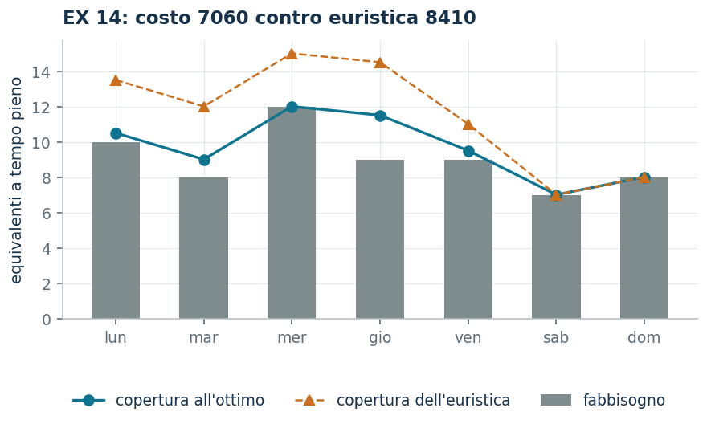

# EX 14 — I turni del pronto soccorso

**Classe:** ILP · **Legami:** set covering, [conteggi interi](legami-04.md) · **Script:** `python/ex14_turni.py`<br><br>
**Difficoltà:** ★★★☆☆ · **Tempo:** 30–45 min
{ .scheda }

[](https://colab.research.google.com/github/fabiofurini/modellazione-mip/blob/main/notebooks/ex14_turni.ipynb)

Uno dei [quindici modelli numerici](numerici.md), della famiglia
[localizzazione e copertura](localizzazione.md).

!!! abstract "EX 14"
    In un pronto soccorso è dato, per ogni giorno della settimana, il numero di
    addetti a tempo pieno necessari:

    | Giorno | lun | mar | mer | gio | ven | sab | dom |
    |---|---:|---:|---:|---:|---:|---:|---:|
    | addetti | 10 | 8 | 12 | 9 | 9 | 7 | 8 |

    Un addetto a tempo pieno può essere sostituito da due addetti a mezzo
    servizio. Lo schema di turno è fisso: **quattro giorni consecutivi a tempo
    pieno, poi un giorno a mezzo servizio, poi due giorni di riposo**. Il costo
    settimanale di un addetto dipende dai giorni lavorati: $100$ euro per ogni
    giorno feriale, $110$ per il sabato e $130$ per la domenica; questi costi
    sono dimezzati nei giorni a mezzo servizio. Si vuole il piano settimanale di
    costo minimo.

## Modello

Ci sono $n = 7$ schemi di turno, uno per giorno di inizio, e $m = 7$ giorni da
coprire, con fabbisogno $b_i$. Con $x_j$ il numero di addetti che seguono lo
schema $j$ (variabili intere), $c_j$ il costo settimanale dello schema $j$ e
$a_{ij}$ la quota del giorno $i$ coperta dallo schema $j$ ($1$ nei quattro giorni
pieni, $1/2$ nel giorno di mezzo servizio, $0$ nei due di riposo):

<!-- modello-esteso: ex14_primale -->

<div class="modello-esteso largo" markdown>

$$
\begin{array}{rrrrrrrr c l}
\min & 450x_1 & +455x_2 & +475x_3 & +490x_4 & +490x_5 & +490x_6 & +480x_7 &  & \\
\text{soggetto a} & x_1 &  &  & +\frac{1}{2}x_4 & +x_5 & +x_6 & +x_7 & \ge & 10\\
 & x_1 & +x_2 &  &  & +\frac{1}{2}x_5 & +x_6 & +x_7 & \ge & 8\\
 & x_1 & +x_2 & +x_3 &  &  & +\frac{1}{2}x_6 & +x_7 & \ge & 12\\
 & x_1 & +x_2 & +x_3 & +x_4 &  &  & +\frac{1}{2}x_7 & \ge & 9\\
 & \frac{1}{2}x_1 & +x_2 & +x_3 & +x_4 & +x_5 &  &  & \ge & 9\\
 &  & \frac{1}{2}x_2 & +x_3 & +x_4 & +x_5 & +x_6 &  & \ge & 7\\
 &  &  & \frac{1}{2}x_3 & +x_4 & +x_5 & +x_6 & +x_7 & \ge & 8\\
 & x_1, & x_2, & x_3, & x_4, & x_5, & x_6, & x_7 & \in & \Z_{\ge 0}
\end{array}
$$

</div>

<!-- modello-esteso: fine -->

Un **set covering** con coefficienti $1$ e $1/2$ e variabili intere non binarie.
I costi si calcolano dai dati:

| Schema | giorni pieni | mezzo servizio | costo |
|---|---|---|---:|
| 1 (inizia lun) | lun, mar, mer, gio | ven | 450 |
| 2 (inizia mar) | mar, mer, gio, ven | sab | 455 |
| 3 (inizia mer) | mer, gio, ven, sab | dom | 475 |
| 4 (inizia gio) | gio, ven, sab, dom | lun | 490 |
| 5 (inizia ven) | ven, sab, dom, lun | mar | 490 |
| 6 (inizia sab) | sab, dom, lun, mar | mer | 490 |
| 7 (inizia dom) | dom, lun, mar, mer | gio | 480 |

Per esempio lo schema 3 costa $100 + 100 + 100 + 110$ per i quattro giorni pieni
(mer, gio, ven, sab) più $130/2 = 65$ per la domenica a mezzo servizio, in tutto
$475$.

## Euristica costruttiva: il bound primale

È un **minimo**, quindi una soluzione ammissibile dà un *upper* bound. Euristica
di copertura: finché resta fabbisogno scoperto si aggiunge una copia dello schema
con il rapporto

$$\frac{\text{costo}}{\text{fabbisogno effettivamente coperto}}$$

più basso. Il rapporto si **ricalcola a ogni passo**, perché il fabbisogno
residuo cambia. Sull'istanza l'euristica aggiunge $18$ turni: otto dello schema 1
(a $100$ euro per unità di fabbisogno coperta), poi quattro del 3, due del 5, uno
del 4 e tre del 7, con rapporti via via peggiori, fino a $480$ per l'ultima
unità.

$$\mathit{UB} = 8410.$$

## Rilassamento LP e duale: il bound duale

$$\max ~ \sum_{i=1}^{m} b_i\, \pi_i \quad\text{soggetto a}\quad \sum_{i=1}^{m} a_{ij}\, \pi_i \le c_j, \quad \forall j \in \{1, 2, \dots, n\}, \qquad \pi \ge 0.$$

**La ricetta del rapporto migliore:** si mette lo stesso prezzo $t$ su tutti i
giorni. Ogni schema copre $4 + 1/2 = 9/2$ giornate-uomo, quindi il vincolo duale
diventa $\tfrac{9}{2}\, t \le c_j$ per ogni schema, e il valore più grande
ammissibile è

$$t = \min_j \frac{c_j}{9/2} = \min\Bigl(100,\ \tfrac{910}{9},\ \tfrac{950}{9},\ \tfrac{980}{9},\ \tfrac{980}{9},\ \tfrac{980}{9},\ \tfrac{320}{3}\Bigr) = 100,$$

raggiunto dallo schema 1. Il fabbisogno totale è $10+8+12+9+9+7+8 = 63$, quindi

$$\mathit{LB} = 100 \cdot 63 = 6300.$$

<!-- modello-esteso: ex14_duale -->

<div class="modello-esteso largo" markdown>

$$
\begin{array}{rrrrrrrr c l}
\max & 10\pi_1 & +8\pi_2 & +12\pi_3 & +9\pi_4 & +9\pi_5 & +7\pi_6 & +8\pi_7 &  & \\
\text{soggetto a} & \pi_1 & +\pi_2 & +\pi_3 & +\pi_4 & +\frac{1}{2}\pi_5 &  &  & \le & 450\\
 &  & \pi_2 & +\pi_3 & +\pi_4 & +\pi_5 & +\frac{1}{2}\pi_6 &  & \le & 455\\
 &  &  & \pi_3 & +\pi_4 & +\pi_5 & +\pi_6 & +\frac{1}{2}\pi_7 & \le & 475\\
 & \frac{1}{2}\pi_1 &  &  & +\pi_4 & +\pi_5 & +\pi_6 & +\pi_7 & \le & 490\\
 & \pi_1 & +\frac{1}{2}\pi_2 &  &  & +\pi_5 & +\pi_6 & +\pi_7 & \le & 490\\
 & \pi_1 & +\pi_2 & +\frac{1}{2}\pi_3 &  &  & +\pi_6 & +\pi_7 & \le & 490\\
 & \pi_1 & +\pi_2 & +\pi_3 & +\frac{1}{2}\pi_4 &  &  & +\pi_7 & \le & 480\\
 & \pi_1, & \pi_2, & \pi_3, & \pi_4, & \pi_5, & \pi_6, & \pi_7 & \ge & 0
\end{array}
$$

</div>

<!-- modello-esteso: fine -->

La variabile $\pi_i$ è il prezzo che si attribuisce alla copertura del giorno
$i$. L'obiettivo somma i fabbisogni dei sette giorni a quei prezzi. C'è un
vincolo per schema di turno: i giorni che lo schema copre, contati per intero
quando il servizio è pieno e per metà nel giorno di mezzo servizio, non possono
valere più di quanto lo schema costa. I coefficienti $\frac{1}{2}$ sono la
stessa mezza giornata che compare nel primale.


## Ottimo e confronto

| $\mathit{UB}$ | $\mathit{LB}$ | $z(\mathit{LP})$ | $z(\mathit{LP}^+)$ | $z(\mathit{MILP})$ |
|---:|---:|---:|---:|---:|
| 8 410 | 6 300 | $115970/17$ | $115970/17$ | 7 060 |

Il piano ottimo assume $5$ addetti sullo schema 1, $4$ sul 3, $1$ sul 4, $2$ sul
5 e $3$ sul 7, per un costo di $7060$. La copertura è satura mercoledì, sabato e
domenica, e sovrabbondante negli altri giorni. Il gap dell'euristica è del
$19{,}1\%$; la differenza $z(\mathit{MILP}) - z(\mathit{LP}) \approx 238$ è il
prezzo dell'interezza, cioè del fatto che le persone si assumono una a una.

!!! tip "Il giorno a mezzo servizio conviene?"
    Confrontiamo il contratto dell'enunciato con uno alternativo: quattro giorni
    pieni e **tre** di riposo, senza mezzo servizio. Il prezzo minimo per
    giornata coperta è lo stesso nei due casi, $100$ euro. Eppure l'ottimo del
    secondo contratto è $6710$, contro i $7060$ del primo: il mezzo servizio
    conviene **di meno**.

    La ragione è che la mezza giornata cade in un giorno prestabilito e spesso
    finisce dove la copertura c'è già; la flessibilità persa costa più di quanto
    valga la copertura in più. È un esempio in cui la conclusione «più copertura
    allo stesso prezzo unitario è sempre meglio» è falsa, e solo il modello lo
    mostra.



## Codice

Lo script completo è
[`python/ex14_turni.py`](https://github.com/fabiofurini/modellazione-mip/blob/main/python/ex14_turni.py);
il notebook è
[`notebooks/ex14_turni.ipynb`](https://github.com/fabiofurini/modellazione-mip/blob/main/notebooks/ex14_turni.ipynb).

<!-- script-incorporato: inizio (rigenerato da python/incorpora_codice.py) -->

??? example "Mostra lo script completo — `python/ex14_turni.py` (178 righe)"

    ```python
    """EX 14 -- Turni del pronto soccorso (famiglia 12).

    Copertura ciclica: sette schemi di turno, uno per giorno di inizio, ciascuno con
    quattro giorni pieni, un giorno a mezzo servizio e due di riposo. E' un set
    covering con coefficienti 1 e 1/2 e variabili intere non binarie.

    Il duale si scrive una volta sola e si risolve a mano con la ricetta del rapporto
    migliore: tutti i giorni allo stesso prezzo, il piu' alto che nessuno schema
    riesce a battere.
    """
    import gurobipy as gp
    import pandas as pd
    from gurobipy import GRB

    from mip import (ammissibile, due_rilassamenti, frazione, nuovo_modello, registra_bound,
                     risolvi, stampa_lp, valuta)
    from stile import ARANCIO, BLU, GRIGIO, TEAL, intestazione, plt, salva_dati, salva_figura
    from esteso import salva_modello

    R = range

    # ---------- 1. DATI, COSTI E MATRICE DI COPERTURA ----------
    intestazione("EX 14. Turni del pronto soccorso: coprire il fabbisogno al costo minimo")
    GIORNI = ["lun", "mar", "mer", "gio", "ven", "sab", "dom"]
    b13 = [10, 8, 12, 9, 9, 7, 8]          # equivalenti a tempo pieno richiesti
    costo_giorno = [100, 100, 100, 100, 100, 110, 130]
    ng = 7

    # schema che inizia il giorno j: pieno nei giorni j..j+3, mezzo servizio in j+4
    a13 = [[0.0] * ng for _ in R(ng)]      # a13[i][j] = quota del giorno i coperta dallo schema j
    for j in R(ng):
        for k in R(4):
            a13[(j + k) % ng][j] = 1.0
        a13[(j + 4) % ng][j] = 0.5
    c13 = [sum(costo_giorno[(j + k) % ng] for k in R(4)) + costo_giorno[(j + 4) % ng] / 2
           for j in R(ng)]
    print("  Costo settimanale di ciascuno schema di turno:")
    for j in R(ng):
        pieni = ", ".join(GIORNI[(j + k) % ng] for k in R(4))
        print(f"    schema {j + 1} (inizia {GIORNI[j]}): pieno {pieni}; mezzo servizio "
              f"{GIORNI[(j + 4) % ng]}  ->  {frazione(c13[j])} euro")
    salva_dati(pd.DataFrame({"schema": R(1, ng + 1), "inizio": GIORNI, "costo": c13}),
               "ex14_schemi")
    salva_dati(pd.DataFrame({"giorno": GIORNI, "fabbisogno": b13}), "ex14_fabbisogno")


    def modello(a, b, c):
        n = len(c)
        m = nuovo_modello("turni")
        x = m.addVars(n, vtype=GRB.INTEGER, name="x")
        m.setObjective(gp.quicksum(c[j] * x[j] for j in R(n)), GRB.MINIMIZE)
        m.addConstrs((gp.quicksum(a[i][j] * x[j] for j in R(n)) >= b[i] for i in R(len(b))),
                     name="giorno")
        return m, x


    def duale(a, b, c):
        """max sum_i b_i pi_i  s.t.  sum_i a_ij pi_i <= c_j,  pi >= 0."""
        n = len(c)
        d = nuovo_modello("duale_turni")
        pi = d.addVars(len(b), name="pi")
        d.setObjective(gp.quicksum(b[i] * pi[i] for i in R(len(b))), GRB.MAXIMIZE)
        d.addConstrs((gp.quicksum(a[i][j] * pi[i] for i in R(len(b))) <= c[j] for j in R(n)),
                     name="rc")
        return d


    m13, x13 = modello(a13, b13, c13)
    salva_modello(m13, "ex14_primale")
    print("  Il modello dell'istanza:")
    stampa_lp(m13)

    # ---------- 2. EURISTICA DI COPERTURA (UPPER BOUND) ----------
    # euristica costruttiva: finche' resta fabbisogno scoperto si aggiunge una copia dello schema col
    # rapporto costo / fabbisogno effettivamente coperto piu' basso
    def euristica(a, b, c):
        n, ng = len(c), len(b)
        x = [0] * n
        residuo = list(map(float, b))
        passi = []
        while max(residuo) > 1e-9:
            def utile(j):
                return sum(min(a[i][j], residuo[i]) for i in R(ng))
            cand = [j for j in R(n) if utile(j) > 1e-9]
            j = min(cand, key=lambda j: (c[j] / utile(j), j))
            x[j] += 1
            coperto = utile(j)
            for i in R(ng):
                residuo[i] = max(0.0, residuo[i] - a[i][j])
            passi.append(f"schema {j + 1}: copre {frazione(coperto)} di fabbisogno a "
                         f"{frazione(c[j])} euro ({frazione(c[j] / coperto)} per unita'); "
                         f"residuo " + " ".join(frazione(r) for r in residuo))
        return x, passi


    x_eur, passi = euristica(a13, b13, c13)
    print(f"  L'euristica costruttiva aggiunge {len(passi)} turni; ecco i primi tre, uno intermedio e l'ultimo:")
    for k in (1, 2, 3, len(passi) // 2, len(passi)):
        print(f"    Passo {k}. {passi[k - 1]}")
    ub13 = sum(c13[j] * x_eur[j] for j in R(ng))
    sol_eur = {f"x[{j}]": x_eur[j] for j in R(ng)}
    assert ammissibile(m13, sol_eur), sol_eur
    print("  Soluzione euristica: " + ", ".join(f"{x_eur[j]} dello schema {j + 1}" for j in R(ng)
                                                if x_eur[j])
          + f"   ub = {frazione(ub13)}")

    # ---------- 3. RILASSAMENTO LP E DUALE (LOWER BOUND) ----------
    d13 = duale(a13, b13, c13)
    salva_modello(d13, "ex14_duale")
    # ricetta del rapporto migliore: stesso prezzo t su tutti i giorni. Ogni schema
    # copre 4 + 1/2 = 9/2 giornate, quindi il vincolo duale e' (9/2) t <= c_j:
    # il t piu' grande ammissibile e' min_j c_j / (9/2).
    copertura = sum(a13[i][0] for i in R(ng))
    t = min(c13[j] / copertura for j in R(ng))
    mano = {f"pi[{i}]": t for i in R(ng)}
    lb13, viol = valuta(d13, mano)
    assert viol <= 1e-9, viol
    print(f"  Duale a mano: ogni schema copre {frazione(copertura)} giornate-uomo, quindi il")
    print(f"  vincolo duale e' {frazione(copertura)} * t <= c_j per ogni schema. Il valore piu'")
    print(f"  grande ammissibile e' t = min_j c_j / ({frazione(copertura)}):")
    for j in R(ng):
        print(f"    schema {j + 1}: {frazione(c13[j])} / ({frazione(copertura)}) = "
              f"{frazione(c13[j] / copertura)}")
    print(f"  cioe' t = {frazione(t)}, e lb = t * sum_i b_i = {frazione(t)} * {sum(b13)} = "
          f"{frazione(lb13)}")
    zlp13, zlp13r, _ = due_rilassamenti(m13, d13)

    # ---------- 4. OTTIMO DEL MILP ----------
    z13 = risolvi(m13)
    print("  Soluzione ottima: " + ", ".join(f"{int(x13[j].X)} dello schema {j + 1}"
                                             for j in R(ng) if x13[j].X > 0.5))
    copertura_ott = [sum(a13[i][j] * x13[j].X for j in R(ng)) for i in R(ng)]
    print("  Copertura per giorno: " + ", ".join(
        f"{GIORNI[i]} {frazione(copertura_ott[i])} su {b13[i]}" for i in R(ng)))
    riga = registra_bound("EX 14 turni", ub13, lb13, zlp13, zlp13r, z13)
    salva_dati(pd.DataFrame([riga]), "ex14_bound")
    assert lb13 <= zlp13 <= z13 <= ub13 + 1e-9

    # ---------- 5. IL PREZZO DELL'INTEREZZA E IL RUOLO DEL MEZZO SERVIZIO ----------
    intestazione("EX 14. Due letture del risultato")
    print(f"  z(LP) = {frazione(zlp13)} e z(MILP) = {frazione(z13)}: la differenza "
          f"{frazione(z13 - zlp13)} e' il prezzo dell'interezza, cioe' del fatto che le persone")
    print("  si assumono a una a una.")
    # senza il giorno di mezzo servizio: quattro giorni pieni e tre di riposo
    a_senza = [[0.0] * ng for _ in R(ng)]
    for j in R(ng):
        for k in R(4):
            a_senza[(j + k) % ng][j] = 1.0
    c_senza = [sum(costo_giorno[(j + k) % ng] for k in R(4)) for j in R(ng)]
    m_s, x_s = modello(a_senza, b13, c_senza)
    z_senza = risolvi(m_s)
    rapporto_con = min(c13[j] / copertura for j in R(ng))
    rapporto_senza = min(c_senza[j] / 4 for j in R(ng))
    print("  Senza il giorno di mezzo servizio (quattro giorni pieni e tre di riposo) il costo")
    print(f"  ottimo diventa {frazione(z_senza)}, contro {frazione(z13)}. Il prezzo minimo per")
    print(f"  giornata coperta e' lo stesso nei due contratti ({frazione(rapporto_con)} con il")
    print(f"  mezzo servizio, {frazione(rapporto_senza)} senza), ma la mezza giornata cade in un")
    print("  giorno prestabilito e spesso finisce dove la copertura c'e' gia': la flessibilita'")
    print("  persa costa piu' di quanto valga la copertura in piu'.")
    assert z_senza < z13
    salva_dati(pd.DataFrame([{"variante": "schema con mezzo servizio", "z": z13},
                             {"variante": "schema senza mezzo servizio", "z": z_senza}]),
               "ex14_varianti")

    # ---------- 6. FIGURA ----------
    fig, ax = plt.subplots(figsize=(6.8, 3.0))
    idx = list(R(ng))
    ax.bar(idx, b13, 0.55, color=GRIGIO, label="fabbisogno")
    ax.plot(idx, copertura_ott, marker="o", color=TEAL, lw=1.6, label="copertura all'ottimo")
    ax.plot(idx, [sum(a13[i][j] * x_eur[j] for j in R(ng)) for i in idx], marker="^",
            color=ARANCIO, lw=1.2, ls="--", label="copertura dell'euristica")
    ax.set_xticks(idx)
    ax.set_xticklabels(GIORNI)
    ax.set_ylabel("equivalenti a tempo pieno")
    ax.set_title(f"EX 14: costo {frazione(z13)} contro euristica {frazione(ub13)}")
    ax.legend(fontsize=8)
    salva_figura(fig, "ex14_copertura")
    print("Fine.")
    ```

<!-- script-incorporato: fine -->
