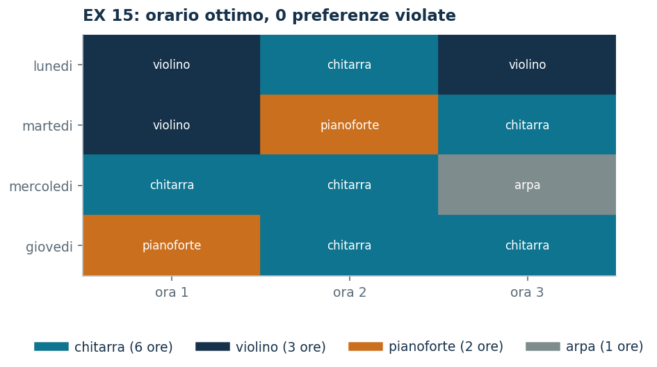

# EX 15 — L'orario della scuola di musica

**Classe:** BIP · **Legami:** [se e solo se](legami-10.md), conteggi · **Script:** `python/ex15_orario.py`<br><br>
**Difficoltà:** ★★★★☆ · **Tempo:** 45–60 min
{ .scheda }

[](https://colab.research.google.com/github/fabiofurini/modellazione-mip/blob/main/notebooks/ex15_orario.ipynb)

Uno dei [quindici modelli numerici](numerici.md), della famiglia
[assegnamento e scheduling](scheduling.md). È il modello in cui si vede meglio
che cosa succede quando un legame si scrive **a senso unico**.

!!! abstract "EX 15"
    Una scuola di musica deve costruire l'orario della settimana. Ci sono due
    pomeriggi (lunedì e martedì), ciascuno di due ore. Vanno collocate $2$ ore di
    chitarra e $2$ di violino. Ogni giorno deve prevedere lezioni di **almeno due
    strumenti diversi**.

    I due docenti hanno una preferenza, da rispettare se possibile: quello di
    chitarra preferirebbe non venire di martedì, quello di violino non venire di
    lunedì. Si vuole minimizzare il numero di ore che violano una preferenza.

## Modello

Servono due famiglie di variabili binarie:

- $x_{dti} = 1$ se all'ora $t$ del giorno $d$ si insegna lo strumento $i$;
- $y_{di} = 1$ se lo strumento $i$ compare nel giorno $d$.

Sono otto colonne per le lezioni — una per ogni terna giorno, ora, strumento — e
quattro per gli indicatori.

<!-- modello-esteso: ex15_primale -->

<div class="modello-esteso largo" markdown>

$$
\begin{array}{rrrrrrrrrrrrr c l}
\min &  & x_{112} &  & +x_{122} & +x_{211} &  & +x_{221} &  &  &  &  &  &  & \\
\text{soggetto a} & x_{111} &  & +x_{121} &  & +x_{211} &  & +x_{221} &  &  &  &  &  & = & 2\\
 &  & x_{112} &  & +x_{122} &  & +x_{212} &  & +x_{222} &  &  &  &  & = & 2\\
 & x_{111} & +x_{112} &  &  &  &  &  &  &  &  &  &  & \le & 1\\
 &  &  & x_{121} & +x_{122} &  &  &  &  &  &  &  &  & \le & 1\\
 &  &  &  &  & x_{211} & +x_{212} &  &  &  &  &  &  & \le & 1\\
 &  &  &  &  &  &  & x_{221} & +x_{222} &  &  &  &  & \le & 1\\
 &  &  &  &  &  &  &  &  & y_{11} & +y_{12} &  &  & \ge & 2\\
 &  &  &  &  &  &  &  &  &  &  & y_{21} & +y_{22} & \ge & 2\\
 & x_{111} &  &  &  &  &  &  &  & -y_{11} &  &  &  & \le & 0\\
 &  & x_{112} &  &  &  &  &  &  &  & -y_{12} &  &  & \le & 0\\
 &  &  & x_{121} &  &  &  &  &  & -y_{11} &  &  &  & \le & 0\\
 &  &  &  & x_{122} &  &  &  &  &  & -y_{12} &  &  & \le & 0\\
 &  &  &  &  & x_{211} &  &  &  &  &  & -y_{21} &  & \le & 0\\
 &  &  &  &  &  & x_{212} &  &  &  &  &  & -y_{22} & \le & 0\\
 &  &  &  &  &  &  & x_{221} &  &  &  & -y_{21} &  & \le & 0\\
 &  &  &  &  &  &  &  & x_{222} &  &  &  & -y_{22} & \le & 0\\
 & -x_{111} &  & -x_{121} &  &  &  &  &  & +y_{11} &  &  &  & \le & 0\\
 &  & -x_{112} &  & -x_{122} &  &  &  &  &  & +y_{12} &  &  & \le & 0\\
 &  &  &  &  & -x_{211} &  & -x_{221} &  &  &  & +y_{21} &  & \le & 0\\
 &  &  &  &  &  & -x_{212} &  & -x_{222} &  &  &  & +y_{22} & \le & 0\\
 & x_{111}, & x_{112}, & x_{121}, & x_{122}, & x_{211}, & x_{212}, & x_{221}, & x_{222} &  &  &  &  & \in & \{0, 1\}\\
 &  &  &  &  &  &  &  &  & y_{11}, & y_{12}, & y_{21}, & y_{22} & \in & \{0, 1\}
\end{array}
$$

</div>

<!-- modello-esteso: fine -->

Le prime due righe contano le ore di ciascuno strumento. Le quattro successive
dicono che in ogni casella dell'orario si fa al più una lezione. Le due dopo sono
la **varietà**: ogni giorno almeno due strumenti. Seguono i due versi del legame
fra lezione e indicatore — otto righe per «se c'è lezione l'indicatore è acceso»
e quattro per il viceversa — e in fondo le due righe di dominio.

Le ore da collocare sono $2+2 = 4$ e le caselle sono $2 \cdot 2 = 4$: le due
cifre coincidono, quindi ogni casella ospita esattamente una lezione.

!!! danger "Il vincolo di varietà scritto a senso unico è vuoto"
    Viene spontaneo scrivere soltanto il legame
    $x_{dti} \le y_{di}$, e non il suo inverso. Con quel solo verso il vincolo
    $\sum_i y_{di} \ge 2$ è **sempre** soddisfatto: basta porre $y_{di} = 1$
    senza fare lezione. Risolvendo il modello così scritto il solver mette tutta
    la chitarra di lunedì e tutto il violino di martedì — **due** giorni con un
    solo strumento ciascuno — e dichiara $0$ preferenze violate, mentre l'ottimo
    vero ne viola $2$. Il modello sbagliato non si limita a permettere un orario
    cattivo: ne annuncia anche un costo che non esiste.

    Il legame $x_{dti} \le y_{di}$ dice «se c'è lezione allora l'indicatore è
    acceso», non il viceversa. Serve anche

    $$y_{di} \;\le\; \sum_{t \in T} x_{dti},$$

    cioè la tecnica [se e solo se](legami-10.md). È lo stesso errore, e la stessa
    correzione, del [problema 10.3](misti-3.md): quando un vincolo *conta* degli
    indicatori, il legame deve valere nei due versi.

## Una soluzione ammissibile: il bound primale

Con il modello corretto si costruisce a mano questo orario (l'asterisco segnala
una preferenza violata):

| | ora 1 | ora 2 |
|---|---|---|
| lunedì | chitarra | violino\* |
| martedì | chitarra\* | violino |

Si verifica: $2$ ore di chitarra e $2$ di violino, due strumenti in ciascun
giorno. La varietà costringe ogni giorno a ospitare entrambi gli strumenti, e
ogni giorno ne scontenta uno: due preferenze violate, e non si può fare meglio.

$$\mathit{UB} = 2.$$

## Il bound inferiore

Tutti i costi $c_{dti}$ valgono $0$ oppure $1$, quindi l'obiettivo è una somma di
termini non negativi e $z(\mathit{MILP}) \ge 0$ **senza bisogno di alcun duale**.
Il duale del rilassamento conferma che non si può fare di meglio: una variabile
per famiglia di vincoli del primale — $\alpha_i$ libera sulle ore di ciascuno
strumento, $\beta_{dt} \le 0$ sulle caselle, $\gamma_d \ge 0$ sulla varietà,
$\delta_{dti} \le 0$ ed $\varepsilon_{di} \le 0$ sui due versi del legame — e il
suo ottimo vale $0$.

<!-- modello-esteso: ex15_duale -->

<div class="modello-esteso largo" markdown>

$$
\begin{array}{rrrrrrrrrrrrrrrrrrrrr c l}
\max & 2\alpha_1 & +2\alpha_2 & +\beta_{11} & +\beta_{12} & +\beta_{21} & +\beta_{22} & +2\gamma_1 & +2\gamma_2 &  &  &  &  &  &  &  &  &  &  &  &  &  & \\
\text{soggetto a} & \alpha_1 &  & +\beta_{11} &  &  &  &  &  & +\delta_{111} &  &  &  &  &  &  &  & -\epsilon_{11} &  &  &  & \le & 0\\
 &  & \alpha_2 & +\beta_{11} &  &  &  &  &  &  & +\delta_{112} &  &  &  &  &  &  &  & -\epsilon_{12} &  &  & \le & 1\\
 & \alpha_1 &  &  & +\beta_{12} &  &  &  &  &  &  & +\delta_{121} &  &  &  &  &  & -\epsilon_{11} &  &  &  & \le & 0\\
 &  & \alpha_2 &  & +\beta_{12} &  &  &  &  &  &  &  & +\delta_{122} &  &  &  &  &  & -\epsilon_{12} &  &  & \le & 1\\
 & \alpha_1 &  &  &  & +\beta_{21} &  &  &  &  &  &  &  & +\delta_{211} &  &  &  &  &  & -\epsilon_{21} &  & \le & 1\\
 &  & \alpha_2 &  &  & +\beta_{21} &  &  &  &  &  &  &  &  & +\delta_{212} &  &  &  &  &  & -\epsilon_{22} & \le & 0\\
 & \alpha_1 &  &  &  &  & +\beta_{22} &  &  &  &  &  &  &  &  & +\delta_{221} &  &  &  & -\epsilon_{21} &  & \le & 1\\
 &  & \alpha_2 &  &  &  & +\beta_{22} &  &  &  &  &  &  &  &  &  & +\delta_{222} &  &  &  & -\epsilon_{22} & \le & 0\\
 &  &  &  &  &  &  & \gamma_1 &  & -\delta_{111} &  & -\delta_{121} &  &  &  &  &  & +\epsilon_{11} &  &  &  & \le & 0\\
 &  &  &  &  &  &  & \gamma_1 &  &  & -\delta_{112} &  & -\delta_{122} &  &  &  &  &  & +\epsilon_{12} &  &  & \le & 0\\
 &  &  &  &  &  &  &  & \gamma_2 &  &  &  &  & -\delta_{211} &  & -\delta_{221} &  &  &  & +\epsilon_{21} &  & \le & 0\\
 &  &  &  &  &  &  &  & \gamma_2 &  &  &  &  &  & -\delta_{212} &  & -\delta_{222} &  &  &  & +\epsilon_{22} & \le & 0\\
 & \alpha_1, & \alpha_2 &  &  &  &  &  &  &  &  &  &  &  &  &  &  &  &  &  &  & \gtreqless & 0\\
 &  &  & \beta_{11}, & \beta_{12}, & \beta_{21}, & \beta_{22} &  &  &  &  &  &  &  &  &  &  &  &  &  &  & \le & 0\\
 &  &  &  &  &  &  & \gamma_1, & \gamma_2 &  &  &  &  &  &  &  &  &  &  &  &  & \ge & 0\\
 &  &  &  &  &  &  &  &  & \delta_{111}, & \delta_{112}, & \delta_{121}, & \delta_{122}, & \delta_{211}, & \delta_{212}, & \delta_{221}, & \delta_{222} &  &  &  &  & \le & 0\\
 &  &  &  &  &  &  &  &  &  &  &  &  &  &  &  &  & \epsilon_{11}, & \epsilon_{12}, & \epsilon_{21}, & \epsilon_{22} & \le & 0
\end{array}
$$

</div>

<!-- modello-esteso: fine -->

Ogni riga è una colonna del primale: le prime otto sono le $x_{dti}$, dove il
prezzo dell'ora dello strumento più quello della casella, corretti dai due versi
del legame, non possono superare il costo della casella; le ultime quattro sono
le $y_{di}$, dove accendere l'indicatore costa la varietà e viene rimborsato dal
legame.

$$\mathit{LB} = 0, \qquad z(\mathit{LP}) = 0, \qquad z(\mathit{LP}^+) = 2,
\qquad z(\mathit{MILP}) = 2.$$

L'orario costruito a mano era già ottimo, ma il bound duale non lo dimostra: fra
$0$ e $2$ resta un divario che solo il branch and bound chiude. Il rilassamento
rafforzato, che aggiunge $x \le 1$ e $y \le 1$, arriva invece a $2$ e chiude.

!!! warning "Un conteggio che non è un bound sul rilassamento"
    Contando si dice di più: ogni giorno ospita entrambi gli strumenti, e in
    ciascun giorno uno dei due docenti non vorrebbe esserci; le violazioni sono
    quindi almeno due, e $z(\mathit{MILP}) \ge 2$. Quel conteggio però usa
    l'interezza delle variabili: sul rilassamento non vale, e infatti
    $z(\mathit{LP}) = 0$. Non si può metterlo al posto di $\mathit{LB}$ nella
    catena dei bound, dove ogni termine deve valere anche per l'LP.

!!! tip "Due varianti"
    Se il docente di chitarra preferisce non insegnare neppure all'ora 2 di
    lunedì, l'unica casella che gli resta senza penalità è l'ora 1 di lunedì, ma
    le ore da collocare sono $2$: almeno una violazione in più.

    Se si pretendono almeno **tre** strumenti diversi al giorno, servirebbero tre
    strumenti in due sole ore: il modello è inammissibile, e lo si dimostra
    contando.



## Codice

Lo script completo è
[`python/ex15_orario.py`](https://github.com/fabiofurini/modellazione-mip/blob/main/python/ex15_orario.py);
il notebook è
[`notebooks/ex15_orario.ipynb`](https://github.com/fabiofurini/modellazione-mip/blob/main/notebooks/ex15_orario.ipynb).

<!-- script-incorporato: inizio (rigenerato da python/incorpora_codice.py) -->

??? example "Mostra lo script completo — `python/ex15_orario.py` (248 righe)"

    ```python
    """EX 15 -- Orario della scuola di musica (famiglia 11).

    Due pomeriggi da due ore, quattro ore di lezione da collocare: l'orario e' una
    partizione delle quattro caselle. Due soli strumenti, due ore ciascuno. Il modello usa il conteggio degli strumenti
    per giorno (tecnica 3.11), le precedenze fra ore consecutive (3.9) e i vincoli
    violabili con penalita' (3.13).

    Il modello di partenza contiene un errore istruttivo: il legame fra la lezione e
    l'indicatore di strumento e' scritto a senso unico, e il vincolo di varieta'
    diventa vuoto. Lo si mette in evidenza risolvendo il modello sbagliato, poi lo si
    corregge.

    Sui dati dell'esercizio, con il modello corretto, esiste un orario che non viola
    nessuna preferenza: l'ottimo vale zero e il certificato e' immediato, perche' i
    costi sono tutti non negativi. Le due varianti mostrano che cosa succede appena
    le preferenze si stringono: nella prima il conteggio delle caselle disponibili
    da' un bound inferiore positivo, nella seconda il modello diventa inammissibile.
    """
    import gurobipy as gp
    import pandas as pd
    from gurobipy import GRB

    from mip import (ammissibile, due_rilassamenti, frazione, nuovo_modello, risolvi,
                     valuta)
    from stile import ARANCIO, BLU, GRIGIO, TEAL, intestazione, plt, salva_dati, salva_figura
    from esteso import salva_modello

    R = range

    # ---------- 1. MODELLO E ISTANZA ----------
    intestazione("EX 15. Orario della scuola di musica: minimizzare le preferenze violate")
    GIORNI = ["lunedi", "martedi"]
    ORE = [1, 2]
    STRUM = ["chitarra", "violino"]
    h14 = [2, 2]                    # ore da collocare per strumento
    nd, nt, ni = len(GIORNI), len(ORE), len(STRUM)
    print(f"  Ore da collocare: {sum(h14)}; caselle disponibili: {nd} * {nt} = {nd * nt}.")
    print("  Le due cifre coincidono: ogni casella dell'orario ospita esattamente una lezione.")


    def costi(extra_chitarra=()):
        """c[d][t][i] = 1 se la casella viola una preferenza del docente di i."""
        c = [[[0] * ni for _ in R(nt)] for _ in R(nd)]
        for d in R(nd):
            for t in R(nt):
                if d == 1:
                    c[d][t][0] = 1                      # chitarra: il docente non viene di martedi
                if t in extra_chitarra:
                    c[d][t][0] = 1                      # preferenze aggiuntive della chitarra
                if d == 0:
                    c[d][t][1] = 1                      # violino: il docente non viene di lunedi
        return c


    c14 = costi()
    salva_dati(pd.DataFrame([{"giorno": GIORNI[d], "ora": ORE[t], "strumento": STRUM[i],
                              "costo": c14[d][t][i]}
                             for d in R(nd) for t in R(nt) for i in R(ni)]), "ex15_costi")


    def modello(h, c, minimo_strumenti=2, legame_doppio=True):
        """Con `legame_doppio=False` si ottiene il modello scritto a senso unico."""
        mod = nuovo_modello("orario")
        x = mod.addVars(nd, nt, ni, vtype=GRB.BINARY, name="x")
        y = mod.addVars(nd, ni, vtype=GRB.BINARY, name="y")
        mod.setObjective(gp.quicksum(c[d][t][i] * x[d, t, i]
                                     for d in R(nd) for t in R(nt) for i in R(ni)), GRB.MINIMIZE)
        mod.addConstrs((x.sum("*", "*", i) == h[i] for i in R(ni)), name="ore")
        mod.addConstrs((x.sum(d, t, "*") <= 1 for d in R(nd) for t in R(nt)), name="casella")
        mod.addConstrs((y.sum(d, "*") >= minimo_strumenti for d in R(nd)), name="varieta")
        mod.addConstrs((x[d, t, i] - y[d, i] <= 0 for d in R(nd) for t in R(nt) for i in R(ni)),
                       name="attiva")
        if legame_doppio:
            # senza questo verso y_di puo' valere 1 anche se lo strumento i non compare
            mod.addConstrs((y[d, i] - x.sum(d, "*", i) <= 0 for d in R(nd) for i in R(ni)),
                           name="attiva_inversa")
        return mod, x, y


    m14, x14, y14 = modello(h14, c14)
    salva_modello(m14, "ex15_primale")


    def duale(h, c, minimo_strumenti=2):
        """Duale del rilassamento LP (con x, y >= 0 soltanto).

        Una variabile per famiglia di vincoli del primale: alpha_i libera sulle ore
        di ciascuno strumento (vincolo di uguaglianza), beta_dt <= 0 sulle caselle,
        gamma_d >= 0 sulla varieta', delta_dti <= 0 e epsilon_di <= 0 sui due versi
        del legame fra lezione e indicatore.
        """
        d = nuovo_modello("duale_orario")
        alpha = d.addVars(ni, lb=-GRB.INFINITY, name="alpha")
        beta = d.addVars(nd, nt, lb=-GRB.INFINITY, ub=0.0, name="beta")
        gamma = d.addVars(nd, name="gamma")
        delta = d.addVars(nd, nt, ni, lb=-GRB.INFINITY, ub=0.0, name="delta")
        epsilon = d.addVars(nd, ni, lb=-GRB.INFINITY, ub=0.0, name="epsilon")
        d.setObjective(gp.quicksum(h[i] * alpha[i] for i in R(ni))
                       + gp.quicksum(beta[dd, tt] for dd in R(nd) for tt in R(nt))
                       + minimo_strumenti * gamma.sum(), GRB.MAXIMIZE)
        # colonna di x_dti
        d.addConstrs((alpha[i] + beta[dd, tt] + delta[dd, tt, i] - epsilon[dd, i] <= c[dd][tt][i]
                      for dd in R(nd) for tt in R(nt) for i in R(ni)), name="rc_x")
        # colonna di y_di
        d.addConstrs((gamma[dd] - gp.quicksum(delta[dd, tt, i] for tt in R(nt)) + epsilon[dd, i] <= 0
                      for dd in R(nd) for i in R(ni)), name="rc_y")
        return d


    d14 = duale(h14, c14)
    salva_modello(d14, "ex15_duale")


    def stampa_orario(valore):
        for d in R(nd):
            riga = []
            for t in R(nt):
                chi = [STRUM[i] for i in R(ni) if valore(d, t, i) > 0.5]
                pen = [i for i in R(ni) if valore(d, t, i) > 0.5 and c14[d][t][i]]
                riga.append((chi[0] if chi else "-") + ("*" if pen else ""))
            print(f"    {GIORNI[d]:11s} " + " | ".join(f"{s:12s}" for s in riga))


    # ---------- 2. IL VINCOLO DI VARIETA' SCRITTO A SENSO UNICO E' VUOTO ----------
    intestazione("EX 15. Perche' il vincolo di varieta' va scritto nei due versi")
    m_err, x_err, y_err = modello(h14, c14, legame_doppio=False)
    z_err = risolvi(m_err)
    print("  Con il solo legame x_dti <= y_di il solver restituisce questo orario:")
    stampa_orario(lambda d, t, i: x_err[d, t, i].X)
    strumenti_giorno = [sum(1 for i in R(ni) if any(x_err[d, t, i].X > 0.5 for t in R(nt)))
                        for d in R(nd)]
    print("  Strumenti effettivamente presenti: "
          + ", ".join(f"{GIORNI[d]} {strumenti_giorno[d]}" for d in R(nd)))
    poveri = [GIORNI[d] for d in R(nd) if strumenti_giorno[d] < 2]
    print(f"  Ci sono giorni con un solo strumento ({', '.join(poveri)}), eppure il vincolo")
    print("  sum_i y_di >= 2 e' soddisfatto: basta porre y_di = 1 senza fare lezione. Il legame")
    print("  x_dti <= y_di dice «se c'e' lezione allora l'indicatore e' acceso», non il viceversa.")
    print("  Serve anche y_di <= sum_t x_dti, cioe' la tecnica 3.10 (se e solo se).")
    assert poveri, "il modello senza il secondo verso deve ammettere giorni a uno strumento"
    salva_dati(pd.DataFrame({"giorno": GIORNI, "strumenti_modello_errato": strumenti_giorno}),
               "ex15_varieta")

    # ---------- 3. UNA SOLUZIONE AMMISSIBILE COSTRUITA A MANO ----------
    # Regola: ogni giorno deve avere tutti e due gli strumenti, quindi ciascun giorno
    # ospita un'ora di chitarra e un'ora di violino; le ore si mettono nell'ordine
    # dato. Due caselle violano una preferenza, e non si puo' fare di meglio.
    piano_orario = {
        (0, 0): 0, (0, 1): 1,
        (1, 0): 0, (1, 1): 1,
    }
    sol_eur = {f"x[{d},{t},{i}]": 1 for (d, t), i in piano_orario.items()}
    for (d, t), i in piano_orario.items():
        sol_eur[f"y[{d},{i}]"] = 1
    assert ammissibile(m14, sol_eur), sol_eur
    ub14 = sum(c14[d][t][i] for (d, t), i in piano_orario.items())
    print("  Orario costruito a mano (l'asterisco segnala una preferenza violata):")
    stampa_orario(lambda d, t, i: 1 if piano_orario.get((d, t)) == i else 0)
    for i in R(ni):
        assert sum(1 for v in piano_orario.values() if v == i) == h14[i]
    print(f"  Preferenze violate: {ub14}  ->  ub = {frazione(ub14)}")

    # ---------- 4. IL BOUND INFERIORE ----------
    # Il bound che si legge dai dati: la chitarra ha tre ore e il suo docente non viene
    # di martedi; lunedi pero' ne puo' ospitare al piu' due, perche' il giorno vuole
    # almeno due strumenti diversi. Almeno un'ora di chitarra cade quindi di martedi,
    # e vale una violazione.
    lb14 = 0.0
    conteggio = h14[0] - (nt - 1)
    print("  Tutti i costi c_dti sono 0 oppure 1, quindi l'obiettivo e' una somma di termini non")
    print("  negativi: lb = 0 senza bisogno di alcun duale.")
    print(f"  Contando si dice di piu': la chitarra ha {h14[0]} ore e lunedi ne ospita al piu'")
    print(f"  {nt - 1}, perche' il giorno vuole almeno due strumenti; almeno {conteggio} ora di")
    print("  chitarra cade quindi di martedi, dove il docente non vorrebbe venire. Attenzione:")
    print("  quel conteggio vale sul problema intero, non sul rilassamento --- infatti z(LP) = 0")
    print("  --- quindi non si puo' mettere al posto di lb nella catena dei bound.")
    zlp14, zlp14r, _ = due_rilassamenti(m14, d14)
    print(f"    lb = {frazione(lb14)}   z(LP) = {frazione(zlp14)}   z(LP+) = {frazione(zlp14r)}")
    assert lb14 <= zlp14 + 1e-9 <= zlp14r + 1e-9

    # ---------- 5. OTTIMO DEL MILP ----------
    z14 = risolvi(m14)
    print("  Orario ottimo trovato dal solver:")
    stampa_orario(lambda d, t, i: x14[d, t, i].X)
    print(f"  ub = {frazione(ub14)}   lb = {frazione(lb14)}   z(LP) = {frazione(zlp14)}   "
          f"z(LP+) = {frazione(zlp14r)}   z(MILP) = {frazione(z14)}")
    salva_dati(pd.DataFrame([{"problema": "EX 15 orario", "ub": ub14, "lb": lb14,
                              "z_lp": zlp14, "z_lp_rafforzato": zlp14r, "z_milp": z14}]),
               "ex15_bound")
    salva_dati(pd.DataFrame([{"giorno": GIORNI[d], "ora": ORE[t], "strumento": STRUM[i]}
                             for d in R(nd) for t in R(nt) for i in R(ni)
                             if x14[d, t, i].X > 0.5]), "ex15_ottimo")
    assert lb14 <= z14 and abs(z14 - ub14) <= 1e-9, (lb14, z14, ub14)
    print("  L'orario costruito a mano era gia' ottimo, ma nessuno dei due bound lo dimostra:")
    print(f"  fra {frazione(lb14)} e {frazione(ub14)} resta un divario che solo il branch and bound chiude.")
    assert conteggio <= z14

    # ---------- 6. VARIANTI ----------
    intestazione("EX 15. Che cosa succede se le preferenze si stringono")
    # 14a: la chitarra preferisce non insegnare alle ore 1 e 2 di nessun giorno
    c_a = costi(extra_chitarra=(1,))
    libere = sum(1 for d in R(nd) for t in R(nt) if c_a[d][t][0] == 0)
    print(f"  14a. Il docente di chitarra preferisce non insegnare all'ora 2 di nessun giorno.")
    print(f"       Restano {libere} caselle senza penalita' per la chitarra, ma le ore da")
    print(f"       collocare sono {h14[0]}: almeno {h14[0] - libere} lezioni violeranno la")
    print("       preferenza. E' un bound inferiore che si legge dai soli dati.")
    m, x, y = modello(h14, c_a)
    z_a = risolvi(m)
    minimo = h14[0] - libere
    print(f"       z = {frazione(z_a)}: il conteggio da' {minimo}, e il modello non riesce a")
    print("       fermarsi li' perche' le caselle libere della chitarra sono tutte nello stesso")
    print("       giorno, e il vincolo di varieta' ne vieta l'uso completo.")
    assert z_a >= h14[0] - libere - 1e-9
    # 14b: ogni giorno deve avere almeno tre strumenti diversi
    print("  14b. Ogni giorno deve avere almeno tre strumenti diversi.")
    print(f"       Con tre ore al giorno e tre strumenti diversi la chitarra puo' occupare al piu'")
    print(f"       una casella al giorno, cioe' {nd} in tutto, ma le ore di chitarra sono {h14[0]}.")
    print("       Il modello e' inammissibile, e lo si dimostra contando.")
    m, x, y = modello(h14, c14, minimo_strumenti=3)
    m.optimize()
    stato = {GRB.INFEASIBLE: "INFEASIBLE", GRB.OPTIMAL: "OPTIMAL"}.get(m.Status, str(m.Status))
    print(f"       Gurobi restituisce lo stato {stato}, come previsto.")
    assert m.Status == GRB.INFEASIBLE
    salva_dati(pd.DataFrame([{"variante": "14a. chitarra libera solo all'ora 3", "z": z_a},
                             {"variante": "14b. tre strumenti al giorno", "z": float("nan")}]),
               "ex15_varianti")

    # ---------- 7. FIGURA ----------
    fig, ax = plt.subplots(figsize=(6.6, 3.0))
    colori = {0: TEAL, 1: BLU, 2: ARANCIO, 3: GRIGIO}
    for d in R(nd):
        for t in R(nt):
            for i in R(ni):
                if x14[d, t, i].X > 0.5:
                    ax.add_patch(plt.Rectangle((t, nd - 1 - d), 1, 1, color=colori[i]))
                    ax.annotate(STRUM[i], (t + 0.5, nd - 1 - d + 0.5), ha="center", va="center",
                                fontsize=8, color="white")
    for i in R(ni):
        ax.plot([], [], color=colori[i], lw=6, label=f"{STRUM[i]} ({h14[i]} ore)")
    ax.set_xlim(0, nt)
    ax.set_ylim(0, nd)
    ax.set_xticks([t + 0.5 for t in R(nt)])
    ax.set_xticklabels([f"ora {o}" for o in ORE])
    ax.set_yticks([nd - 1 - d + 0.5 for d in R(nd)])
    ax.set_yticklabels(GIORNI)
    ax.set_title(f"EX 15: orario ottimo, {frazione(z14)} preferenze violate")
    ax.legend(fontsize=7, loc="upper center", bbox_to_anchor=(0.5, -0.12), ncol=4)
    salva_figura(fig, "ex15_orario")
    print("Fine.")
    ```

<!-- script-incorporato: fine -->
