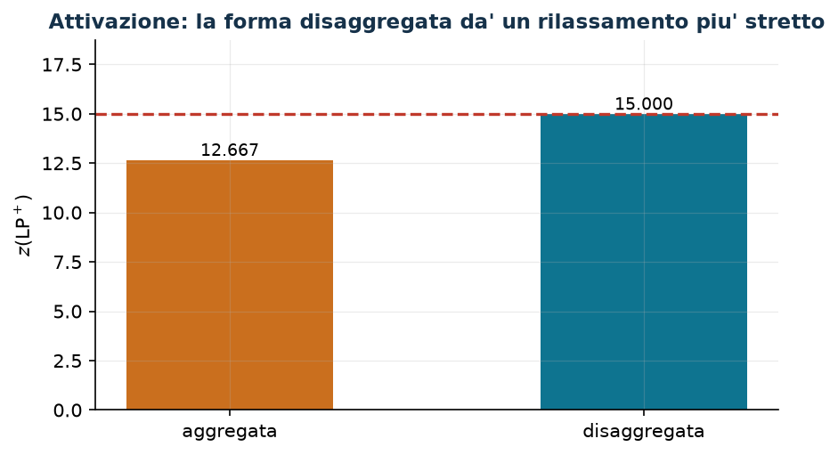

# 3.1 Attivazione: forma aggregata e forma disaggregata

**Tecnica:** binarie con binarie · **Script:** `python/cap03_legami.py` · [Tutte le tecniche](legami.md)

## Il legame in parole

Una risorsa (una macchina, una sede, un impianto) va **attivata** prima di
essere usata. Le binarie $x_{ij}$ dicono «l'oggetto $i$ usa la risorsa $j$», le
binarie $y_j$ dicono «la risorsa $j$ è attivata». Si vuole: se qualcuno usa $j$,
allora $j$ è attivata.

## I vincoli

$$
\begin{aligned}
\text{disaggregato:}\quad x_{ij} &\le y_j, & \forall i,\ \forall j &\qquad (n\,m \text{ vincoli}),\\
\text{aggregato:}\quad \sum_{i=1}^{n} x_{ij} &\le n\, y_j, & \forall j &\qquad (m \text{ vincoli}).
\end{aligned}
$$

Quando la risorsa ha una capacità $k_j$ (al più $k_j$ oggetti), la forma
aggregata si scrive con quel coefficiente, $\sum_i x_{ij} \le k_j y_j$, e allora
impone **anche** la capacità: due condizioni in un vincolo solo.

## La dimostrazione

Su punti binari le due forme sono **equivalenti**.

- *Disaggregato $\Rightarrow$ aggregato*: sommando $x_{ij} \le y_j$ su $i$ si
  ottiene $\sum_i x_{ij} \le n y_j$.
- *Aggregato $\Rightarrow$ disaggregato, su punti binari*: se $y_j = 0$, il
  vincolo aggregato dà $\sum_i x_{ij} \le 0$ e quindi $x_{ij} = 0 \le y_j$ per
  ogni $i$; se $y_j = 1$, allora $x_{ij} \le 1 = y_j$ perché le $x$ sono binarie.

Il secondo verso usa la binarietà: **fuori** dai punti binari non vale, ed è
esattamente questo che rende le due forme diverse nel rilassamento.

!!! warning "Il verso opposto non è imposto"
    «Se $j$ è attivata allora qualcuno la usa», cioè
    $y_j = 1 \Rightarrow \sum_i x_{ij} \ge 1$, **non** segue dai vincoli:
    $y_j = 1$ con tutte le $x_{ij} = 0$ è ammissibile in entrambe le forme.
    Segue dall'ottimalità quando attivare costa: se il costo di attivazione
    $f_j$ è **strettamente** positivo, data una soluzione ottima con $y_j = 1$ e
    nessun $x_{ij} = 1$, porre $y_j = 0$ lascia tutti i vincoli soddisfatti e
    riduce il costo di $f_j > 0$ — contraddizione. Quindi «in ogni ottimo». Se
    invece $f_j = 0$ è ammesso, la conclusione corretta è la più debole «esiste
    un ottimo in cui $y_j = 0$».

## La forza del rilassamento

Istanza: $n = 3$ clienti, $m = 2$ sedi, costi di attivazione $f = (8, 6)$, costi
di servizio

$$c = \begin{pmatrix} 2 & 5 \\ 4 & 1 \\ 3 & 3\end{pmatrix}.$$

| Formulazione | vincoli di link | $z(\mathit{LP}^+)$ |
|---|---:|---:|
| aggregata | $m = 2$ | $38/3 \approx 12{,}67$ |
| disaggregata | $n\,m = 6$ | $15$ |

L'ottimo intero è $z(\mathit{MILP}) = 15$: la forma disaggregata lo raggiunge
già nel rilassamento, quella aggregata si ferma a $38/3$. Più righe,
rilassamento più stretto: è il compromesso tipico di questa tecnica.



## In gurobipy, e dove si rivede

```python
m.addConstrs((x[i, j] <= y[j] for i in range(n) for j in range(mm)), name="link")   # disaggregato
m.addConstrs((x.sum("*", j) <= n * y[j] for j in range(mm)), name="link")           # aggregato
```

Si rivede nei problemi [7.2](scheduling-2.md), [7.3](scheduling-3.md),
[7.5](scheduling-5.md) e [8.4](localizzazione-4.md), dove il confronto fra le
due forme è una domanda di modellazione.
