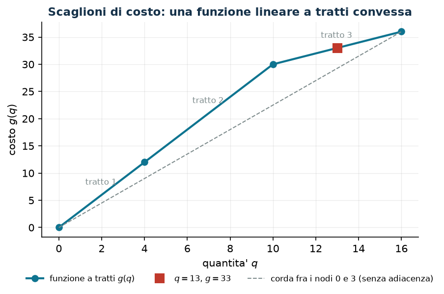

# 3.14 Funzioni lineari a tratti

**Tecnica:** continue con binarie di tratto · **Script:** `python/cap03_legami.py` · [Tutte le tecniche](legami.md)

## Il legame in parole

Il costo non è proporzionale alla quantità: cambia a scaglioni — sconti sopra
una soglia, sovrapprezzi oltre una capacità, tariffe a fasce. La funzione $g(q)$
è continua e lineare a tratti, con nodi $q_0 < q_1 < \dots < q_K$ e valori
$g_0, \dots, g_K$.

## I vincoli

Con $\lambda_k \ge 0$ i pesi della combinazione convessa e $w_t \in \{0,1\}$
l'indicatore del tratto $t$ (fra $q_{t-1}$ e $q_t$):

$$
\begin{aligned}
\sum_{k=0}^{K} \lambda_k &= 1 &&\qquad (1 \text{ vincolo}),\\
q = \sum_{k=0}^{K} q_k \lambda_k, \qquad g(q) &= \sum_{k=0}^{K} g_k \lambda_k &&\qquad (2 \text{ vincoli}),\\
\sum_{t=1}^{K} w_t &= 1 &&\qquad (1 \text{ vincolo}),\\
\lambda_k &\le \!\!\sum_{t \,:\, k \in \{t-1,\,t\}}\!\! w_t, \quad \forall k &&\qquad (K + 1 \text{ vincoli}).
\end{aligned}
$$

## La dimostrazione

L'ultimo gruppo è l'**adiacenza**: $\lambda_k$ può essere positiva solo se il
tratto scelto ha $q_k$ come estremo. Insieme a $\sum_t w_t = 1$ il tratto è uno
solo, quindi al più due $\lambda$ consecutive sono positive, e allora
$(q, g(q))$ è un punto del segmento fra $(q_{t-1}, g_{t-1})$ e $(q_t, g_t)$:
cioè un punto **del grafico**. Senza l'adiacenza si potrebbero mescolare nodi
non consecutivi, e $(q, g)$ finirebbe nell'**inviluppo convesso inferiore** del
grafico — sotto la funzione.

!!! danger "Se la funzione è convessa l'adiacenza è superflua, altrimenti no"
    Quando $g$ è convessa e si *minimizza*, l'inviluppo convesso inferiore
    coincide con la funzione e le $\lambda$ ottime risultano automaticamente
    adiacenti: il modello senza binarie è già corretto. Quando $g$ non è
    convessa — il caso degli sconti di quantità, in cui il costo marginale
    *scende* — la differenza si vede subito. Con nodi $(0, 4, 10, 16)$, valori
    $(0, 12, 30, 36)$ e domanda $q \ge 13$:

    | Formulazione | valore ottimo |
    |---|---:|
    | senza adiacenza (combinazione convessa libera) | $117/4 = 29{,}25$ |
    | con adiacenza | $33$ |

    La prima mescola i nodi $0$ e $3$ (le uniche $\lambda$ non nulle) e
    restituisce un costo che la funzione **non assume in nessun punto**: è il
    valore dell'inviluppo, non del grafico. La seconda mescola i nodi $2$ e $3$,
    adiacenti, e dà il valore esatto
    $g(13) = 30 + 6 \cdot \tfrac{3}{6} = 33$.



## La forza del rilassamento

Attenzione a non confondere due cose: l'adiacenza cambia l'**insieme intero** (i
due modelli hanno ottimi diversi, $29{,}25$ e $33$), ma **non** la forza del
rilassamento — con $w_t$ frazionarie il vincolo di adiacenza non morde e i due
modelli hanno lo stesso $z(\mathrm{LP}^+) = 117/4$.

## In gurobipy, e dove si rivede

```python
m.addConstr(lam.sum() == 1, name="convessa")
m.addConstr(q == gp.quicksum(nodi[k] * lam[k] for k in range(K + 1)), name="ascissa")
m.addConstr(w.sum() == 1, name="un_tratto")
for k in range(K + 1):                       # adiacenza: lambda_k solo sui tratti che toccano k
    m.addConstr(lam[k] <= gp.quicksum(w[t] for t in (k - 1, k) if 0 <= t < K),
                name=f"adiacenza{k}")
```

Gurobi offre anche `addGenConstrPWL` e i tipi SOS2, che fanno lo stesso lavoro
internamente; qui la formulazione manuale resta il materiale principale, perché
è quella di cui si deve saper dimostrare la correttezza. Si rivede
nell'esercizio 10.1 (premi con due modalità).
