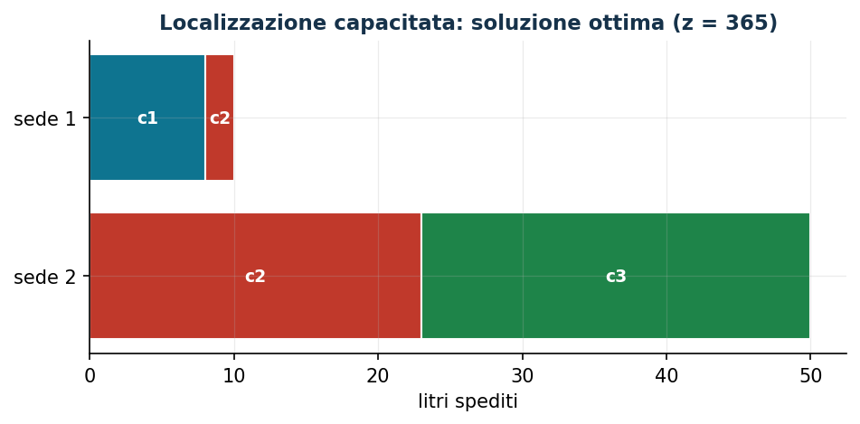

# Localizzazione capacitata

**Classe:** MILP · **Legami:** attivazione aggregata (anche vincolo di capacità) · **Script:** `python/fam08_1_capacitata.py`

[](https://colab.research.google.com/github/fabiofurini/modellazione-mip/blob/main/notebooks/fam08_1_capacitata.ipynb)

!!! abstract "Problema 8.1"
    Un'azienda deve servire $n \in \mathbb{Z}_{\ge 1}$ clienti e ha
    individuato $m \in \mathbb{Z}_{\ge 1}$ sedi candidate. Per ogni cliente
    $c$, $d_c \in \mathbb{Q}_{>0}$ è la domanda in litri. Per ogni sede $l$ e
    cliente $c$, $t_{lc} \in \mathbb{Q}_{>0}$ è il costo di trasporto per
    litro. Per ogni sede $l$, $u_l \in \mathbb{Q}_{>0}$ è la capacità e
    $i_l \in \mathbb{Q}_{>0}$ il costo di installazione. Si vuole decidere
    dove installare e come servire i clienti, a costo minimo.

**Il problema a parole.** *Decidiamo* dove installare le strutture e quanto
spedire da ciascuna sede a ciascun cliente. *L'obiettivo*: costo totale
(installazione più trasporto) minimo. *I vincoli*: da una sede non
installata non parte nulla, e una installata non supera la capacità; la
domanda va soddisfatta esattamente. È la **localizzazione capacitata**.

## Modello

**Dati.**

| Simbolo | Tipo | Significato |
|---|---|---|
| $m$ | $\in \mathbb{Z}_{\ge 1}$ | numero di sedi, $l \in \{1, 2, \dots, m\}$ |
| $n$ | $\in \mathbb{Z}_{\ge 1}$ | numero di clienti, $c \in \{1, 2, \dots, n\}$ |
| $t_{lc}$ | $\in \mathbb{Q}_{>0}$ | costo di trasporto dalla sede $l$ al cliente $c$ |
| $u_l$ | $\in \mathbb{Q}_{>0}$ | capacità della sede $l$ |
| $i_l$ | $\in \mathbb{Q}_{>0}$ | costo di installazione della sede $l$ |
| $d_c$ | $\in \mathbb{Q}_{>0}$ | domanda del cliente $c$ |

**Variabili decisionali.** $m$ binarie $x_l$ (sede $l$ installata) e $m\,n$
continue non negative $y_{lc}$ (litri spediti da $l$ a $c$):

$$
x_l = \begin{cases} 1 & \text{se si installa la sede } l,\\ 0 & \text{altrimenti,}\end{cases}
\qquad y_{lc} = \text{litri spediti da } l \text{ a } c.
$$

Modello MILP:

$$
\begin{aligned}
\min ~~ \sum_{l=1}^{m} i_l\, x_l + \sum_{l=1}^{m}\sum_{c=1}^{n} t_{lc}\, y_{lc} & & \\
\text{soggetto a} \quad u_l\, x_l - \sum_{c=1}^{n} y_{lc} &\ge 0, & \forall l \in \{1, 2, \dots, m\}, \\
\sum_{l=1}^{m} y_{lc} &= d_c, & \forall c \in \{1, 2, \dots, n\}, \\
x_l &\in \{0, 1\}, & \forall l \in \{1, 2, \dots, m\}, \\
y_{lc} &\ge 0, & \forall l, c.
\end{aligned}
$$

- l'obiettivo minimizza il costo totale (installazione più trasporto);
- il primo vincolo lega trasporto e installazione **e** impone la capacità
  ($m$ vincoli lineari);
- il secondo soddisfa la domanda di ogni cliente ($n$ vincoli lineari);
- i vincoli restanti definiscono le variabili.

**Il legame.** Se una quantità positiva parte dalla sede $l$, la sede deve
essere installata; dalla contronominale, una sede chiusa non spedisce nulla.
Entrambi i versi sono imposti direttamente dal primo vincolo. Il verso
opposto — una sede installata spedisce qualcosa — non è imposto ma segue
dall'obiettivo: poiché $i_l > 0$, un ottimo non lascia mai una sede aperta
inutilizzata. Una sola famiglia di vincoli fa dunque sia da legame di
attivazione sia da vincolo di capacità.

## Il modello in gurobipy

```python
mod = gp.Model("localizzazione_capacitata")
x = mod.addVars(m, vtype=GRB.BINARY, name="x")
y = mod.addVars(m, n, name="y")
mod.setObjective(gp.quicksum(i[l] * x[l] for l in range(m))
                 + gp.quicksum(t[l][c] * y[l, c] for l in range(m) for c in range(n)), GRB.MINIMIZE)
mod.addConstrs((u[l] * x[l] - gp.quicksum(y[l, c] for c in range(n)) >= 0
                for l in range(m)), name="capacita")
mod.addConstrs((gp.quicksum(y[l, c] for l in range(m)) == d[c] for c in range(n)), name="domanda")
```

## L'istanza

$m = 2$ sedi, $n = 3$ clienti:

| $t_{lc}$ | $c=1$ | $c=2$ | $c=3$ |
|---|---:|---:|---:|
| $l=1$ | 4 | 5 | 6 |
| $l=2$ | 6 | 4 | 3 |

| | $l=1$ | $l=2$ |
|---|---:|---:|
| $u_l$ | 50 | 50 |
| $i_l$ | 60 | 90 |

| | $c=1$ | $c=2$ | $c=3$ |
|---|---:|---:|---:|
| $d_c$ | 8 | 25 | 27 |

## Euristica costruttiva: il bound primale

Si scandiscono le sedi in ordine; per ciascuna, i clienti, spedendo il
minimo fra capacità residua e domanda residua.

Esecuzione: la sede 1 spedisce $8$ al cliente 1, $25$ al cliente 2, $17$ al
cliente 3 (capacità esaurita); la sede 2 spedisce i restanti $10$ al
cliente 3. Valore: $60+90 + (4{\cdot}8+5{\cdot}25+6{\cdot}17+3{\cdot}10) =
150+289 = 439$. Quindi $z(\mathit{MILP}) \le \mathit{UB} = 439$.

## Rilassamento LP e duale: il bound duale

Con $\bar\mu_l = i_l/u_l$ (spalma il costo fisso sulla capacità) e
$\bar\pi_c = \min_l(t_{lc}+\bar\mu_l)$:

$$
\bar\mu_1 = 6/5,\quad \bar\mu_2 = 9/5,\qquad
\bar\pi_1 = 26/5,\quad \bar\pi_2 = 29/5,\quad \bar\pi_3 = 24/5,
$$

di valore $8{\cdot}26/5 + 25{\cdot}29/5 + 27{\cdot}24/5 = 1581/5$. Per la
dualità debole, $\mathit{LB} = 1581/5 \le z(\mathit{LP}) \le z(\mathit{MILP})
\le \mathit{UB} = 439$.

**Quello che dice il solver.** $z(\mathit{LP}) = 1581/5$ esattamente: la
soluzione duale a mano è già ottima. Rafforzando con $x_l \le 1$,
$z(\mathit{LP}^+) = 317$. $z(\mathit{MILP}) = 365$, con entrambe le sedi
aperte: la sede 1 serve il cliente 1 e parte del cliente 2, la sede 2 il
resto del cliente 2 e tutto il cliente 3. Gap euristica $20{,}3\%$.

| $UB$ | $LB$ (duale) | $z(\mathit{LP})$ | $z(\mathit{LP}^+)$ | $z(\mathit{MILP})$ | gap |
|---:|---:|---:|---:|---:|---:|
| 439 | $1581/5$ | $1581/5$ | 317 | 365 | $20{,}3\%$ |



## Considerazioni aggiuntive

- Se $u_l < d_c$ nessuna sede da sola può soddisfare il cliente $c$: non il
  caso qui, ma va verificato.
- $y_{lc} \le d_c\, x_l$ è valida ma implicata dai due vincoli insieme.

## Domande di modellazione aggiuntive

??? question "8.1.1 — Lotto minimo per ogni sede aperta"
    Ogni sede aperta deve spedire almeno $5$ litri. Come cambia il modello?
    Qual è il nuovo ottimo?

    !!! tip "Soluzione"
        La soluzione è nel documento delle soluzioni, riservato ai docenti.
??? question "8.1.2 — Apertura condizionata"
    La sede 2 può essere installata solo se lo è anche la sede 1. Come si
    modella? Qual è il nuovo ottimo?

    !!! tip "Soluzione"
        La soluzione è nel documento delle soluzioni, riservato ai docenti.
## Codice

Script completo —
[`python/fam08_1_capacitata.py`](https://github.com/fabiofurini/modellazione-mip/blob/main/python/fam08_1_capacitata.py)
(riproducibile con `python3 python/fam08_1_capacitata.py` dalla cartella
`python/`). Notebook —
[`notebooks/fam08_1_capacitata.ipynb`](https://github.com/fabiofurini/modellazione-mip/blob/main/notebooks/fam08_1_capacitata.ipynb)
— che si apre in Colab dal badge in cima alla pagina.

<!-- script-incorporato: inizio (rigenerato da python/incorpora_codice.py) -->

??? example "Mostra lo script completo — `python/fam08_1_capacitata.py` (160 righe)"

    ```python
    """Problema 8.1 -- Localizzazione capacitata (costo minimo).

    Attivazione aggregata fra la variabile binaria x_l (apri la sede l) e le
    variabili continue di flusso y_lc: il legame si dimostra nei due versi
    esattamente come nel problema 7.2, ma qui il vincolo di link è anche un
    vincolo di capacità (una sola famiglia di vincoli fa entrambe le cose).
    """
    import gurobipy as gp
    import pandas as pd
    from gurobipy import GRB

    from mip import (ammissibile, due_rilassamenti, frazione, nuovo_modello,
                     registra_bound, risolvi, stampa_soluzione, valuta)
    from stile import CICLO, intestazione, plt, salva_dati, salva_figura

    R = range

    # ---------- 1. MODELLO E ISTANZA ----------

    intestazione("1. Localizzazione capacitata: dove aprire, quanto spedire")
    t1 = [[4, 5, 6], [6, 4, 3]]      # costo di trasporto sede l -> cliente c
    u1 = [50, 50]                    # capacita' delle sedi
    i1 = [60, 90]                    # costo di apertura
    d1 = [8, 25, 27]                 # domanda dei clienti
    m, n = 2, 3
    salva_dati(pd.DataFrame([{"sede": l + 1, "cliente": c + 1, "t": t1[l][c]}
                             for l in R(m) for c in R(n)]), "loc1_costi")
    salva_dati(pd.DataFrame({"sede": R(1, m + 1), "u": u1, "i": i1}), "loc1_sedi")
    salva_dati(pd.DataFrame({"cliente": R(1, n + 1), "d": d1}), "loc1_clienti")


    def modello_1(t, u, i, d):
        m, n = len(u), len(d)
        mod = nuovo_modello("localizzazione_capacitata")
        x = mod.addVars(m, vtype=GRB.BINARY, name="x")
        y = mod.addVars(m, n, name="y")
        mod.setObjective(gp.quicksum(i[l] * x[l] for l in R(m))
                          + gp.quicksum(t[l][c] * y[l, c] for l in R(m) for c in R(n)), GRB.MINIMIZE)
        mod.addConstrs((u[l] * x[l] - gp.quicksum(y[l, c] for c in R(n)) >= 0 for l in R(m)),
                       name="capacita")
        mod.addConstrs((gp.quicksum(y[l, c] for l in R(m)) == d[c] for c in R(n)), name="domanda")
        return mod, x, y


    def duale_1(t, u, i, d):
        """min sum d_c pi_c;  u_l mu_l <= i_l;  -mu_l + pi_c <= t_lc;  mu >= 0, pi libere."""
        m, n = len(u), len(d)
        dl = nuovo_modello("duale_localizzazione")
        mu = dl.addVars(m, name="mu")
        pi = dl.addVars(n, lb=-GRB.INFINITY, name="pi")
        dl.setObjective(gp.quicksum(d[c] * pi[c] for c in R(n)), GRB.MAXIMIZE)
        dl.addConstrs((u[l] * mu[l] <= i[l] for l in R(m)), name="rc_x")
        dl.addConstrs((-mu[l] + pi[c] <= t[l][c] for l in R(m) for c in R(n)), name="rc_y")
        return dl


    m1, x1, y1 = modello_1(t1, u1, i1, d1)

    # ---------- 2. EURISTICA COSTRUTTIVA (UPPER BOUND) ----------

    print("Euristica: si scandiscono le sedi in ordine, riempendo la domanda residua dei clienti")
    print("con la capacita' residua di ciascuna sede, senza superare né l'una né l'altra.")


    def euristica_1(t, u, i, d):
        m, n = len(u), len(d)
        y, x, rc, rd, passi = {}, [0] * m, list(u), list(d), []
        for l in R(m):
            for c in R(n):
                if rd[c] > 0 and rc[l] > 0:
                    q = min(rd[c], rc[l])
                    y[(l, c)] = q
                    rd[c] -= q
                    rc[l] -= q
                    passi.append(f"Sede {l + 1}, cliente {c + 1}: si spedisce min(rd={rd[c] + q}, rc={rc[l] + q}) = {q}; "
                                 f"rd[{c + 1}] = {rd[c]}, rc[{l + 1}] = {rc[l]}.")
            if rc[l] < u[l]:
                x[l] = 1
                passi.append(f"La sede {l + 1} ha spedito qualcosa (rc = {rc[l]} < u = {u[l]}): si apre, x[{l + 1}] = 1.")
        ok = all(v == 0 for v in rd)
        return x, y, passi, ok


    xe, ye, passi, ok = euristica_1(t1, u1, i1, d1)
    for i, s in enumerate(passi, 1):
        print(f"  Passo {i}. {s}")
    assert ok, "euristica non ammissibile: domanda non soddisfatta"
    ub1 = sum(i1[l] * xe[l] for l in R(m)) + sum(t1[l][c] * ye.get((l, c), 0) for l in R(m) for c in R(n))
    sol_eur = {f"x[{l}]": xe[l] for l in R(m)}
    sol_eur.update({f"y[{l},{c}]": v for (l, c), v in ye.items()})
    assert ammissibile(m1, sol_eur)
    print(f"  ub = {ub1}")

    # ---------- 3. RILASSAMENTO LP E DUALE (LOWER BOUND) ----------

    d1_ = duale_1(t1, u1, i1, d1)
    mano = {f"mu[{l}]": i1[l] / u1[l] for l in R(m)}
    mano.update({f"pi[{c}]": min(t1[l][c] + mano[f"mu[{l}]"] for l in R(m)) for c in R(n)})
    lb1, viol = valuta(d1_, mano)
    assert viol <= 1e-9, viol
    print("Soluzione duale a mano: mu_l = i_l/u_l = " + ", ".join(frazione(i1[l] / u1[l]) for l in R(m))
          + ";  pi_c = min_l (t_lc + mu_l) = " + ", ".join(frazione(mano[f"pi[{c}]"]) for c in R(n))
          + f"  ->  lb = {frazione(lb1)}")
    zlp1, zlp1r, _ = due_rilassamenti(m1, d1_)

    # ---------- 4. SOLUZIONE OTTIMA DEL MILP ----------

    z1 = risolvi(m1)
    print("Soluzione ottima del MILP:")
    stampa_soluzione(m1, solo_non_nulle=True)
    riga = registra_bound("1 localizzazione capacitata", ub1, lb1, zlp1, zlp1r, z1)
    salva_dati(pd.DataFrame([riga]), "loc1_bound")

    # ---------- 5. DOMANDE DI MODELLAZIONE AGGIUNTIVE ----------

    varianti = {}


    def variante(nome, mod):
        z = risolvi(mod)
        print(f"  {nome:70s} z = {frazione(z)}")
        return z


    # 1a: ogni sede aperta deve spedire almeno 5 litri (lotto minimo / semicontinua)
    mod, x, y = modello_1(t1, u1, i1, d1)
    mod.addConstrs((gp.quicksum(y[l, c] for c in R(n)) >= 5 * x[l] for l in R(m)), name="lotto_minimo")
    varianti["1a"] = variante("1a. Ogni sede aperta spedisce almeno 5 litri (sum_c y_lc >= 5 x_l)", mod)
    # 1b: la sede 2 si apre solo se si apre la sede 1
    mod, x, y = modello_1(t1, u1, i1, d1)
    mod.addConstr(x[1] <= x[0], name="2_solo_se_1")
    varianti["1b"] = variante("1b. La sede 2 si apre solo se si apre la sede 1 (x_2 <= x_1)", mod)
    salva_dati(pd.DataFrame({"variante": list(varianti), "z": list(varianti.values())}), "loc1_varianti")

    # ---------- 6. FIGURE ----------


    def barre_flusso(y, m, n, titolo, nome):
        """Per ogni sede, barra impilata dei litri spediti a ciascun cliente."""
        fig, ax = plt.subplots(figsize=(7.2, 3.0))
        for l in R(m):
            inizio = 0
            for c in R(n):
                q = y.get((l, c), 0)
                if q > 0:
                    ax.barh(l, q, left=inizio, color=CICLO[c % len(CICLO)], edgecolor="white")
                    ax.text(inizio + q / 2, l, f"c{c + 1}", ha="center", va="center", color="white",
                            fontsize=9, fontweight="bold")
                    inizio += q
        ax.set_yticks(R(m))
        ax.set_yticklabels([f"sede {l + 1}" for l in R(m)])
        ax.set_xlabel("litri spediti")
        ax.set_title(titolo)
        ax.invert_yaxis()
        salva_figura(fig, nome)


    ott_y = {(l, c): y1[l, c].X for l in R(m) for c in R(n) if y1[l, c].X > 1e-6}
    barre_flusso(ott_y, m, n, f"Localizzazione capacitata: soluzione ottima (z = {frazione(z1)})", "cap08_capacitata_ottimo")
    print("Fine.")
    ```

<!-- script-incorporato: fine -->
