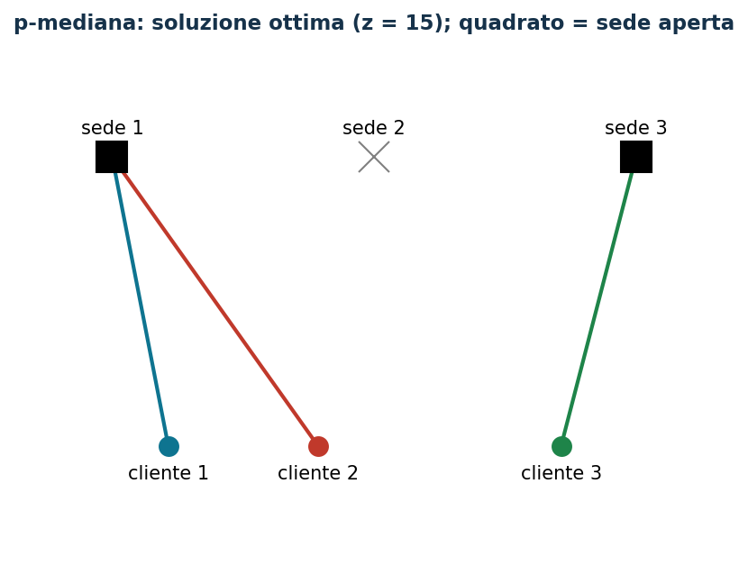

# p-mediana: al più $k$ sedi

**Classe:** BIP · **Legami:** attivazione disaggregata · **Script:** `python/fam08_2_pmediana.py`

[](https://colab.research.google.com/github/fabiofurini/modellazione-mip/blob/main/notebooks/fam08_2_pmediana.ipynb)

!!! abstract "Problema 8.2"
    Un'azienda deve scegliere al più $k \in \mathbb{Z}_{\ge 1}$ sedi, fra
    $m \in \mathbb{Z}_{\ge 1}$ candidate, e assegnare ciascuno degli
    $n \in \mathbb{Z}_{\ge 1}$ clienti alla sede aperta più conveniente. Per
    ogni sede $l$ e cliente $c$, $d_{lc} \in \mathbb{Q}_{>0}$ è la distanza.
    Si vuole minimizzare la somma delle distanze cliente-sede.

**Il problema a parole.** *Decidiamo* quali sedi aprire (al più $k$) e a
quale sede assegnare ciascun cliente. *L'obiettivo*: somma delle distanze
minima. *I vincoli*: ogni cliente a esattamente una sede aperta; al più $k$
sedi aperte. Il classico problema della **p-mediana**.

## Modello

**Dati.**

| Simbolo | Tipo | Significato |
|---|---|---|
| $m$ | $\in \mathbb{Z}_{\ge 1}$ | numero di sedi, $l \in \{1, 2, \dots, m\}$ |
| $n$ | $\in \mathbb{Z}_{\ge 1}$ | numero di clienti, $c \in \{1, 2, \dots, n\}$ |
| $d_{lc}$ | $\in \mathbb{Q}_{>0}$ | distanza fra la sede $l$ e il cliente $c$ |
| $k$ | $\in \mathbb{Z}_{\ge 1}$ | numero massimo di sedi aperte |

**Variabili decisionali.** $m$ binarie $x_l$ (sede aperta) e $m\,n$ binarie
$y_{lc}$ (cliente $c$ servito da $l$).

$$
\begin{aligned}
\min ~~ \sum_{l=1}^{m}\sum_{c=1}^{n} d_{lc}\, y_{lc} & & \\
\text{soggetto a} \quad \sum_{l=1}^{m} y_{lc} &= 1, & \forall c, \\
\sum_{l=1}^{m} x_l &\le k, & \\
x_l - y_{lc} &\ge 0, & \forall l, c, \\
x_l, y_{lc} &\in \{0, 1\}. & &
\end{aligned}
$$

- l'obiettivo minimizza la somma delle distanze cliente-sede;
- il primo vincolo assegna ogni cliente a una sede ($n$ vincoli);
- il secondo limita a $k$ le sedi aperte (un vincolo);
- il terzo lega assegnamento e apertura, in forma **disaggregata**
  ($m\,n$ vincoli).

**Il legame.** Se $y_{lc}=1$ allora $x_l=1$: dalla CNF di
$y_{lc} \Rightarrow x_l$, cioè $\neg y_{lc} \lor x_l$, si ottiene
$x_l \ge y_{lc}$, imposto direttamente. A differenza del problema 8.1, qui
non c'è un costo di apertura che scoraggi sedi aperte inutilizzate: il
verso opposto non è né imposto né garantito dall'ottimo.

## Il modello in gurobipy

```python
mod = gp.Model("p_mediana")
x = mod.addVars(m, vtype=GRB.BINARY, name="x")
y = mod.addVars(m, n, vtype=GRB.BINARY, name="y")
mod.setObjective(gp.quicksum(dist[l][c] * y[l, c] for l in range(m) for c in range(n)), GRB.MINIMIZE)
mod.addConstrs((y.sum("*", c) == 1 for c in range(n)), name="assegna")
mod.addConstr(x.sum() <= k, name="numero_sedi")
mod.addConstrs((x[l] - y[l, c] >= 0 for l in range(m) for c in range(n)), name="link")
```

## L'istanza

$m = 3$ sedi, $n = 3$ clienti, $k = 2$:

| $d_{lc}$ | $c=1$ | $c=2$ | $c=3$ |
|---|---:|---:|---:|
| $l=1$ | 5 | 6 | 10 |
| $l=2$ | 3 | 12 | 9 |
| $l=3$ | 10 | 9 | 4 |

## Euristica costruttiva: upper bound

Si aprono le prime $k$ sedi; ogni cliente va alla sede aperta più vicina.
Aperte le sedi 1 e 2: cliente 1 → sede 2 (dist. 3), cliente 2 → sede 1
(dist. 6), cliente 3 → sede 2 (dist. 9). Valore $3+6+9=18$: $z(\mathrm{MILP})
\le \mathrm{ub} = 18$.

## Rilassamento LP e duale: lower bound

Con $\bar\varrho=0$, $\bar\pi_{lc}=0$ e $\bar\mu_c = \min_l d_{lc}$ (la
distanza dalla sede più vicina in assoluto):

$$
\bar\mu_1 = 3,\quad \bar\mu_2 = 6,\quad \bar\mu_3 = 4,
$$

di valore $13$. Per la dualità debole, $\mathrm{lb}=13 \le z(\mathrm{LP})
\le z(\mathrm{MILP}) \le \mathrm{ub}=18$.

**Quello che dice il solver.** $z(\mathrm{LP}) = z(\mathrm{LP}^+) = 15$: il
rilassamento è già intero su questa istanza. $z(\mathrm{MILP}) = 15$, con le
sedi 1 e 3 aperte (non 1 e 2 come nell'euristica): gap euristica $20{,}0\%$.

| $\mathrm{ub}$ | $\mathrm{lb}$ (duale) | $z(\mathrm{LP})$ | $z(\mathrm{LP}^+)$ | $z(\mathrm{MILP})$ | gap |
|---:|---:|---:|---:|---:|---:|
| 18 | 13 | 15 | 15 | 15 | $20{,}0\%$ |



## Considerazioni aggiuntive

- Il vincolo è «al più $k$», non «esattamente $k$»: si verifica con la
  domanda 8.2.1 che l'ottimo non cambia imponendo l'uguaglianza.
- $\sum_c y_{lc} \le n\, x_l$ è una disuguaglianza valida aggregata, più
  debole di quella disaggregata usata nel modello.

## Domande di modellazione aggiuntive

??? question "8.2.1 — Esattamente $k$ sedi aperte"
    Si devono aprire esattamente $k$ sedi. Come cambia il modello? Qual è il
    nuovo ottimo?

    ??? success "Soluzione"
        $\sum_l x_l \ge k$, che insieme al vincolo già presente impone
        l'uguaglianza. L'ottimo apre già $2=k$ sedi: resta $15$.

??? question "8.2.2 — Copertura di prossimità per un cliente"
    Il cliente 1 deve essere servito entro distanza $4$. Come si modella?
    Qual è il nuovo ottimo?

    ??? success "Soluzione"
        $y_{l1} = 0$ per ogni sede con $d_{l1} > 4$ (qui solo la sede 3).
        Nuovo ottimo $16$: conviene aprire la sede 2 (dist. 3) al posto
        della 1, con la sede 3 che assorbe anche il cliente 2:
        $\tilde x_2 = \tilde x_3 = 1$, valore $3+9+4=16$.

## Codice

Script completo —
[`python/fam08_2_pmediana.py`](https://github.com/fabiofurini/modellazione-mip/blob/main/python/fam08_2_pmediana.py)
(riproducibile con `python3 python/fam08_2_pmediana.py` dalla cartella
`python/`). Notebook —
[`notebooks/fam08_2_pmediana.ipynb`](https://github.com/fabiofurini/modellazione-mip/blob/main/notebooks/fam08_2_pmediana.ipynb)
— che si apre in Colab dal badge in cima alla pagina.
