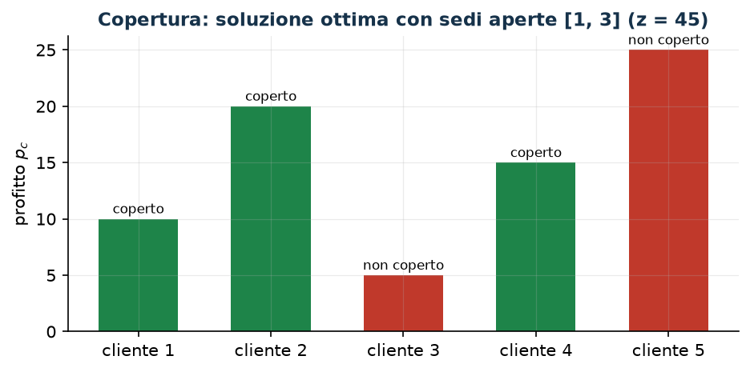

# Copertura del segnale con interferenza

**Classe:** BIP · **Legami:** se e solo se (soglia + interferenza) · **Script:** `python/fam08_3_copertura.py`

[](https://colab.research.google.com/github/fabiofurini/modellazione-mip/blob/main/notebooks/fam08_3_copertura.ipynb)

!!! abstract "Problema 8.3"
    Un operatore sceglie al più $k \in \mathbb{Z}_{\ge 1}$ sedi, fra
    $m \in \mathbb{Z}_{\ge 1}$ candidate, per servire $n \in \mathbb{Z}_{\ge
    1}$ clienti. $s_{lc} \in \mathbb{Q}_{\ge 0}$ è il segnale ricevuto dal
    cliente $c$ se $l$ è installata. Un cliente è **coperto** se e solo se
    il segnale totale è almeno $t \in \mathbb{Q}_{>0}$ *e* al più una sede
    genera per lui un segnale $\ge b \in \mathbb{Q}_{>0}$. $p_c \in
    \mathbb{Q}_{>0}$ è il profitto se coperto. Si vuole massimizzare il
    profitto totale.

**Il problema a parole.** *Decidiamo* quali sedi installare (al più $k$).
*L'obiettivo*: profitto totale massimo. *I vincoli*: un cliente è coperto se
e solo se riceve segnale sufficiente e non troppa interferenza; al più $k$
sedi installate.

## Modello

**Dati.** $m$, $n$, $s_{lc} \in \mathbb{Q}_{\ge 0}$, $p_c \in
\mathbb{Q}_{>0}$, soglia $t$, limite di interferenza $b$, budget $k$. Per
ogni cliente $c$: $\mathscr{L}_c = \{l : s_{lc} \ge b\}$.

**Variabili decisionali.** $m$ binarie $x_l$ (sede installata), $n$ binarie
$y_c$ (cliente coperto).

$$
\begin{aligned}
\max ~~ \sum_{c=1}^{n} p_c\, y_c & & \\
\text{soggetto a} \quad -\sum_{l=1}^{m} s_{lc}\, x_l + t\, y_c &\le 0, & \forall c, \\
\sum_{l \in \mathscr{L}_c} x_l + (m-1)\, y_c &\le m, & \forall c, \\
\sum_{l=1}^{m} x_l &\le k, & \\
x_l, y_c &\in \{0, 1\}. & &
\end{aligned}
$$

- l'obiettivo massimizza il profitto totale;
- il primo vincolo lega copertura e segnale ricevuto ($n$ vincoli);
- il secondo lega copertura e interferenza ($n$ vincoli);
- il terzo limita a $k$ le sedi installate (un vincolo).

**Il legame: un se e solo se.** Un verso — $y_c=1 \Rightarrow$ segnale
$\ge t$ **e** al più una sede forte — è imposto direttamente dai due
vincoli. L'altro verso — se entrambe le condizioni valgono, il cliente è
coperto — non è imposto dai vincoli (che ammettono anche $y_c=0$), ma segue
dall'ottimalità: poiché $p_c>0$ e $y_c$ compare solo in questi due vincoli,
alzarla a $1$ resta ammissibile e aumenta l'obiettivo. Lo stesso schema del
problema 7.6.

## Il modello in gurobipy

```python
mod = gp.Model("copertura_interferenza")
x = mod.addVars(m, vtype=GRB.BINARY, name="x")
y = mod.addVars(n, vtype=GRB.BINARY, name="y")
mod.setObjective(gp.quicksum(p[c] * y[c] for c in range(n)), GRB.MAXIMIZE)
mod.addConstrs((-gp.quicksum(s[l][c] * x[l] for l in range(m)) + t * y[c] <= 0
                for c in range(n)), name="soglia")
mod.addConstrs((gp.quicksum(x[l] for l in L[c]) + (m - 1) * y[c] <= m
                for c in range(n)), name="interferenza")
mod.addConstr(x.sum() <= k, name="budget")
```

## L'istanza

$m=3$, $n=5$, $t=5$, $b=4$, $k=2$:

| $s_{lc}$ | $c=1$ | $c=2$ | $c=3$ | $c=4$ | $c=5$ |
|---|---:|---:|---:|---:|---:|
| $l=1$ | 6 | 0 | 5 | 3 | 1 |
| $l=2$ | 4 | 5 | 2 | 0 | 0 |
| $l=3$ | 0 | 7 | 5 | 4 | 2 |

| | $c=1$ | $c=2$ | $c=3$ | $c=4$ | $c=5$ |
|---|---:|---:|---:|---:|---:|
| $p_c$ | 10 | 20 | 5 | 15 | 25 |

Con $b=4$: $\mathscr{L}_1=\{1,2\}$, $\mathscr{L}_2=\{3\}$,
$\mathscr{L}_3=\{1,3\}$, $\mathscr{L}_4=\{3\}$, $\mathscr{L}_5=\emptyset$.

## Euristica costruttiva: il bound primale

Si aprono le prime $k$ sedi. Cliente 1: segnale $10\ge5$ ma 2 sedi forti
($>1$): **non coperto**. Cliente 2: segnale $5\ge5$, 0 sedi forti:
**coperto**. Cliente 3: segnale $7\ge5$, 1 sede forte: **coperto**. Clienti
4 e 5: segnale insufficiente: **non coperti**. Valore $20+5=25$:
$z(\mathrm{MILP}) \ge \mathit{LB} = 25$.

## Rilassamento LP e duale: il bound duale

Con $\bar\pi_c=0$, $\bar\mu=0$ e $\bar\lambda_c = p_c/(m-1) = p_c/2$:

$$
\bar\lambda_1=5,\ \bar\lambda_2=10,\ \bar\lambda_3=5/2,\ \bar\lambda_4=15/2,\ \bar\lambda_5=25/2,
$$

di valore $m\sum_c\bar\lambda_c = 3\cdot75/2=225/2$. Per la dualità debole
(problema di massimo: l'euristica dà il lower bound, il duale l'upper
bound), $\mathit{LB}=25 \le z(\mathrm{MILP}) \le z(\mathrm{LP}) \le
\mathit{UB}=225/2$.

**Quello che dice il solver.** $z(\mathrm{LP}) = 41925/646 \approx 64{,}9$,
$z(\mathrm{LP}^+) = 125/2 = 62{,}5$. $z(\mathrm{MILP}) = 45$, con le sedi 1
e 3 installate e i clienti 1, 2, 4 coperti (non 3 né 5): diverso da quanto
trovato dall'euristica. Gap euristica $44{,}4\%$.

| $LB$ | $UB$ (duale) | $z(\mathrm{LP})$ | $z(\mathrm{LP}^+)$ | $z(\mathrm{MILP})$ | gap |
|---:|---:|---:|---:|---:|---:|
| 25 | $225/2$ | $41925/646$ | $125/2$ | 45 | $44{,}4\%$ |



## Considerazioni aggiuntive

- Il cliente 5 non può mai essere coperto: segnale massimo $1+0+2=3<5$
  anche aprendo tutte le sedi.
- Per i clienti con $|\mathscr{L}_c|\le1$ (2, 4, 5) il vincolo di
  interferenza è ridondante.

## Domande di modellazione aggiuntive

??? question "8.3.1 — Copertura minima garantita"
    Almeno 3 clienti devono essere coperti. Come cambia il modello? Qual è
    il nuovo ottimo?

    !!! tip "Soluzione"
        La soluzione è nel documento delle soluzioni, riservato ai docenti.
??? question "8.3.2 — Installazione condizionata"
    La sede 1 può essere installata solo se lo è anche la sede 3. Come si
    modella? Qual è il nuovo ottimo?

    !!! tip "Soluzione"
        La soluzione è nel documento delle soluzioni, riservato ai docenti.
## Codice

Script completo —
[`python/fam08_3_copertura.py`](https://github.com/fabiofurini/modellazione-mip/blob/main/python/fam08_3_copertura.py)
(riproducibile con `python3 python/fam08_3_copertura.py` dalla cartella
`python/`). Notebook —
[`notebooks/fam08_3_copertura.ipynb`](https://github.com/fabiofurini/modellazione-mip/blob/main/notebooks/fam08_3_copertura.ipynb)
— che si apre in Colab dal badge in cima alla pagina.

<!-- script-incorporato: inizio (rigenerato da python/incorpora_codice.py) -->

??? example "Mostra lo script completo — `python/fam08_3_copertura.py` (145 righe)"

    ```python
    """Problema 8.3 -- Copertura del segnale con interferenza (massimo profitto).

    Un «se e solo se» come nel problema 7.6: un verso (soglia+interferenza
    => coperto) è imposto da due famiglie di vincoli di link; l'altro verso
    (coperto => condizioni soddisfatte) segue dall'obiettivo.
    """
    import gurobipy as gp
    import pandas as pd
    from gurobipy import GRB

    from mip import (due_rilassamenti, frazione, nuovo_modello, registra_bound,
                     risolvi, stampa_soluzione, valuta)
    from stile import intestazione, plt, salva_dati, salva_figura

    R = range

    # ---------- 1. MODELLO E ISTANZA ----------

    intestazione("3. Copertura con interferenza: soglia di segnale e al più una sede forte")
    s3 = [[6, 0, 5, 3, 1], [4, 5, 2, 0, 0], [0, 7, 5, 4, 2]]   # segnale sede l -> cliente c
    p3 = [10, 20, 5, 15, 25]     # profitto se il cliente c è coperto
    t3, b3, k3 = 5, 4, 2         # soglia di segnale, limite di interferenza, budget sedi
    m, n = 3, 5
    L3 = [[l for l in R(m) if s3[l][c] >= b3] for c in R(n)]   # L_c: sedi "forti" per il cliente c
    salva_dati(pd.DataFrame([{"sede": l + 1, "cliente": c + 1, "s": s3[l][c]}
                             for l in R(m) for c in R(n)]), "loc3_segnale")
    salva_dati(pd.DataFrame({"cliente": R(1, n + 1), "p": p3}), "loc3_clienti")


    def modello_3(s, p, t, b, k):
        m, n = len(s), len(p)
        L = [[l for l in R(m) if s[l][c] >= b] for c in R(n)]
        mod = nuovo_modello("copertura_interferenza")
        x = mod.addVars(m, vtype=GRB.BINARY, name="x")
        y = mod.addVars(n, vtype=GRB.BINARY, name="y")
        mod.setObjective(gp.quicksum(p[c] * y[c] for c in R(n)), GRB.MAXIMIZE)
        mod.addConstrs((-gp.quicksum(s[l][c] * x[l] for l in R(m)) + t * y[c] <= 0 for c in R(n)),
                       name="soglia")
        mod.addConstrs((gp.quicksum(x[l] for l in L[c]) + (m - 1) * y[c] <= m for c in R(n)),
                       name="interferenza")
        mod.addConstr(x.sum() <= k, name="budget")
        return mod, x, y, L


    def duale_3(s, p, t, b, k):
        """min sum m lam_c + k mu;  -sum_c s_lc pi_c + sum_{c in C_l} lam_c + mu >= 0;
        t pi_c + (m-1) lam_c >= p_c;  pi,lam,mu >= 0."""
        m, n = len(s), len(p)
        L = [[l for l in R(m) if s[l][c] >= b] for c in R(n)]
        C = [[c for c in R(n) if l in L[c]] for l in R(m)]
        dl = nuovo_modello("duale_copertura")
        pi = dl.addVars(n, name="pi")
        lam = dl.addVars(n, name="lam")
        mu = dl.addVar(name="mu")
        dl.setObjective(m * lam.sum() + k * mu, GRB.MINIMIZE)
        dl.addConstrs((-gp.quicksum(s[l][c] * pi[c] for c in R(n)) + gp.quicksum(lam[c] for c in C[l]) + mu >= 0
                      for l in R(m)), name="rc_x")
        dl.addConstrs((t * pi[c] + (m - 1) * lam[c] >= p[c] for c in R(n)), name="rc_y")
        return dl


    m3, x3, y3, L3m = modello_3(s3, p3, t3, b3, k3)

    # ---------- 2. EURISTICA COSTRUTTIVA (LOWER BOUND) ----------

    print("Euristica: si aprono le prime k sedi; un cliente è coperto se il segnale totale")
    print("raggiunge la soglia e al più una sede forte lo raggiunge.")


    def euristica_3(s, p, t, b, k):
        m, n = len(s), len(p)
        x = [1 if l < k else 0 for l in R(m)]
        y, passi = [0] * n, []
        for c in R(n):
            ts = sum(s[l][c] for l in R(k))
            ni = sum(1 for l in R(k) if s[l][c] >= b)
            y[c] = 1 if (ts >= t and ni <= 1) else 0
            passi.append(f"Cliente {c + 1}: segnale totale = {ts}, sedi forti = {ni}; "
                         f"{'coperto' if y[c] else 'non coperto'}.")
        return x, y, passi


    xe, ye, passi = euristica_3(s3, p3, t3, b3, k3)
    print(f"  Si aprono le prime k = {k3} sedi: x = {xe}.")
    for i, s in enumerate(passi, 1):
        print(f"  Passo {i}. {s}")
    lb3 = sum(p3[c] * ye[c] for c in R(n))
    print(f"  lb = {lb3}")

    # ---------- 3. RILASSAMENTO LP E DUALE (UPPER BOUND) ----------

    d3 = duale_3(s3, p3, t3, b3, k3)
    mano = {"mu": 0.0}
    mano.update({f"pi[{c}]": 0.0 for c in R(n)})
    mano.update({f"lam[{c}]": p3[c] / 2 for c in R(n)})
    ub3, viol = valuta(d3, mano)
    assert viol <= 1e-9, viol
    print("Soluzione duale a mano: pi = 0, mu = 0, lam_c = p_c/2 = "
          + ", ".join(frazione(p3[c] / 2) for c in R(n)) + f"  ->  ub = {frazione(ub3)}")
    zlp3, zlp3r, _ = due_rilassamenti(m3, d3)

    # ---------- 4. SOLUZIONE OTTIMA DEL MILP ----------

    z3 = risolvi(m3)
    print("Soluzione ottima del MILP:")
    stampa_soluzione(m3, solo_non_nulle=True)
    riga = registra_bound("3 copertura", ub3, lb3, zlp3, zlp3r, z3, senso="max")
    salva_dati(pd.DataFrame([riga]), "loc3_bound")

    # ---------- 5. DOMANDE DI MODELLAZIONE AGGIUNTIVE ----------

    varianti = {}


    def variante(nome, mod):
        z = risolvi(mod)
        print(f"  {nome:70s} z = {frazione(z)}")
        return z


    # 3a: almeno 3 clienti devono essere coperti
    mod, x, y, L = modello_3(s3, p3, t3, b3, k3)
    mod.addConstr(y.sum() >= 3, name="copertura_minima")
    varianti["3a"] = variante("3a. Almeno 3 clienti coperti (sum y_c >= 3)", mod)
    # 3b: se si apre la sede 1 si apre anche la sede 3
    mod, x, y, L = modello_3(s3, p3, t3, b3, k3)
    mod.addConstr(x[0] <= x[2], name="1_implica_3")
    varianti["3b"] = variante("3b. Se si apre la sede 1 si apre anche la 3 (x_1 <= x_3)", mod)
    salva_dati(pd.DataFrame({"variante": list(varianti), "z": list(varianti.values())}), "loc3_varianti")

    # ---------- 6. FIGURE ----------

    fig, ax = plt.subplots(figsize=(7.2, 3.2))
    ott_x = [l for l in R(m) if x3[l].X > 0.5]
    larghezza = 0.6
    for c in R(n):
        colore = "#1E8449" if y3[c].X > 0.5 else "#C0392B"
        ax.bar(c, p3[c], color=colore, width=larghezza)
        ax.text(c, p3[c] + 0.5, "coperto" if y3[c].X > 0.5 else "non coperto", ha="center", fontsize=8)
    ax.set_xticks(R(n))
    ax.set_xticklabels([f"cliente {c + 1}" for c in R(n)])
    ax.set_ylabel("profitto $p_c$")
    ax.set_title(f"Copertura: soluzione ottima con sedi aperte {[l + 1 for l in ott_x]} (z = {frazione(z3)})")
    salva_figura(fig, "cap08_copertura_ottimo")
    print("Fine.")
    ```

<!-- script-incorporato: fine -->
