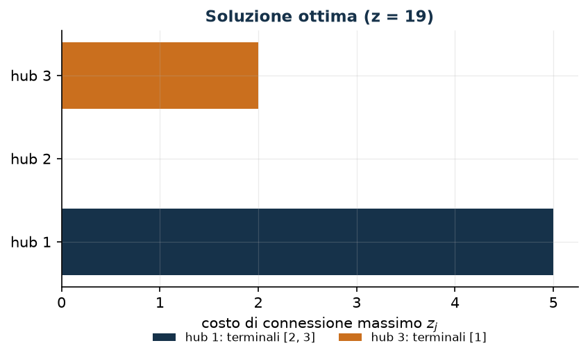

# Localizzazione di hub con costo massimo

**Classe:** MILP · **Legami:** attivazione aggregata, variabile di massimo · **Script:** `python/fam08_4_hub.py`

[](https://colab.research.google.com/github/fabiofurini/modellazione-mip/blob/main/notebooks/fam08_4_hub.ipynb)

!!! abstract "Problema 8.4"
    $n \in \mathbb{Z}_{\ge 1}$ terminali, ciascuno da connettere a
    esattamente un hub; $m \in \mathbb{Z}_{\ge 1}$ hub, ciascuno con
    capacità $k \in \mathbb{Z}_{\ge 1}$ terminali e costo di attivazione
    $f_j \in \mathbb{Q}_{\ge 0}$. $c_{ij} \in \mathbb{Q}_{\ge 0}$ è il costo
    di connettere il terminale $i$ all'hub $j$. Si minimizza la somma dei
    costi di attivazione e del costo di connessione massimo di ciascun hub.

**Il problema a parole.** *Decidiamo* quali hub attivare e a quale hub
connettere ciascun terminale. *L'obiettivo*: attivazione più, per ciascun
hub, il costo di connessione più alto (non la somma). *I vincoli*: ogni
terminale a esattamente un hub; un hub non attivato non serve nessuno, uno
attivato serve al più $k$.

## Modello

**Variabili decisionali.** $n\,m$ binarie $x_{ij}$, $m$ binarie $y_j$
(hub attivato), $m$ continue non negative $z_j$ (costo massimo dell'hub $j$).

$$
\begin{aligned}
\min ~~ \sum_{j=1}^{m} f_j\, y_j + \sum_{j=1}^{m} z_j & & \\
\text{soggetto a} \quad \sum_{j=1}^{m} x_{ij} &= 1, & \forall i, \\
-\sum_{i=1}^{n} x_{ij} + k\, y_j &\ge 0, & \forall j, \\
-c_{ij}\, x_{ij} + z_j &\ge 0, & \forall i, j, \\
x_{ij}, y_j &\in \{0, 1\},\ z_j \ge 0. & &
\end{aligned}
$$

- l'obiettivo minimizza costi di attivazione più costo massimo per hub;
- il primo vincolo assegna ogni terminale a un hub ($n$ vincoli);
- il secondo lega assegnamento e attivazione, in forma **aggregata**, e
  impone la capacità ($m$ vincoli);
- il terzo lega assegnamento e variabile di massimo ($n\,m$ vincoli).

**Primo legame: attivazione aggregata.** Se un terminale è connesso
all'hub $j$, $j$ deve essere attivato; dalla contronominale, un hub non
attivato non serve nessuno. Entrambi imposti direttamente dal secondo
vincolo. Il verso opposto — un hub attivato serve almeno un terminale — **non**
è imposto dai vincoli: $y_j = 1$ con tutte le $x_{ij} = 0$ è ammissibile. Segue
dall'ottimalità, con una forza che dipende dal segno di $f_j$: se $f_j > 0$,
spegnere un hub vuoto riduce strettamente il costo, quindi **in ogni ottimo**
nessun hub attivato resta vuoto; se $f_j = 0$ — che l'enunciato ammette, avendo
dichiarato $f_j \in \mathbb{Q}_{\ge 0}$ — lo scambio non migliora e la
conclusione corretta è la più debole «**esiste un ottimo** in cui gli hub vuoti
sono spenti». Sull'istanza $f = (5,6,7)$ vale la versione forte. Come nel
[problema 7.2](scheduling-2.md).

**Secondo legame: variabile di massimo.** Se il terminale $i$ è connesso
a $j$, $z_j \ge c_{ij}$: imposto direttamente. All'ottimo,
$z_j = \max_{i:x_{ij}=1} c_{ij}$ esattamente, perché l'obiettivo minimizza
$z_j$ e nessun altro vincolo la coinvolge. Come nel problema 7.7.

## Il modello in gurobipy

```python
mod = gp.Model("hub_max")
x = mod.addVars(n, m, vtype=GRB.BINARY, name="x")
y = mod.addVars(m, vtype=GRB.BINARY, name="y")
z = mod.addVars(m, name="z")
mod.setObjective(gp.quicksum(f[j] * y[j] for j in range(m)) + z.sum(), GRB.MINIMIZE)
mod.addConstrs((gp.quicksum(x[i, j] for j in range(m)) == 1 for i in range(n)), name="assegnamento")
mod.addConstrs((-gp.quicksum(x[i, j] for i in range(n)) + k * y[j] >= 0 for j in range(m)), name="attivazione")
mod.addConstrs((-c[i][j] * x[i, j] + z[j] >= 0 for i in range(n) for j in range(m)), name="massimo")
```

## L'istanza

$n=3$ terminali, $m=3$ hub, $k=2$:

| $c_{ij}$ | $j=1$ | $j=2$ | $j=3$ |
|---|---:|---:|---:|
| $i=1$ | 5 | 10 | 2 |
| $i=2$ | 5 | 4 | 6 |
| $i=3$ | 5 | 4 | 6 |

| | $j=1$ | $j=2$ | $j=3$ |
|---|---:|---:|---:|
| $f_j$ | 5 | 6 | 7 |

## Euristica costruttiva: il bound primale

Un **next-fit** (bin packing): un hub alla volta, fino a $k$ terminali —
la stessa euristica generica dello scheduling, riusata da
`euristiche.py`. Terminale 1 e 2 sull'hub 1 (pieno), terminale 3 sull'hub
2. Costi massimi: $z_1=\max(5,5)=5$, $z_2=4$. Valore $5+6+5+4=20$:
$z(\mathrm{MILP}) \le \mathit{UB} = 20$.

## Rilassamento LP e duale: il bound duale

Con $\bar\gamma_{ij}=0$ e $\bar\beta_j = f_j/k$ (il massimo ammesso), il
vincolo su $\alpha_i$ vale per **ogni** hub $j$, non solo il più
conveniente: $\bar\alpha_i = \min_j \bar\beta_j$.

$$
\bar\beta = (5/2,\ 3,\ 7/2),\qquad \bar\alpha_i = 5/2\ \ \forall i,
$$

di valore $3\cdot5/2=15/2$. Per la dualità debole, $\mathit{LB}=15/2 \le
z(\mathrm{LP}) \le z(\mathrm{MILP}) \le \mathit{UB}=20$.

!!! warning "Un tranello frequente"
    Il vincolo su $\alpha_i$ vale per ogni hub $j$: fissare
    $\bar\gamma_{ij}=0$ solo per gli hub «non convenienti» non basta a
    liberare $\alpha_i$ da quel vincolo. $\alpha_i$ resta limitato dal
    minimo su tutti gli hub, non da uno solo.

**Quello che dice il solver.** $z(\mathrm{LP})=25/2$,
$z(\mathrm{LP}^+)=1015/78\approx13{,}0$. $z(\mathrm{MILP})=19$, con gli hub
1 e 3 attivati (non 1 e 2): il terminale 1 da solo sull'hub 3 (il più
economico per lui), i terminali 2 e 3 sull'hub 1. Gap euristica $5{,}3\%$.

| $UB$ | $LB$ (duale) | $z(\mathrm{LP})$ | $z(\mathrm{LP}^+)$ | $z(\mathrm{MILP})$ | gap |
|---:|---:|---:|---:|---:|---:|
| 20 | $15/2$ | $25/2$ | $1015/78$ | 19 | $5{,}3\%$ |



## Considerazioni aggiuntive

- $x_{ij} \le y_j$ (disaggregato) è implicato dal vincolo aggregato di
  attivazione **sui punti interi**, non nel rilassamento: aggiungerlo non cambia
  $z(\mathrm{MILP})$ e alza $z(\mathrm{LP}^+)$ da $1015/78$ a $79/6$
  (domanda 8.4.1).
- Con $M_j=\max_i c_{ij}$, $z_j \le M_j y_j$ non è una disuguaglianza
  valida (il modello ammette $z_j>0$ con $y_j=0$), ma è un **vincolo che
  preserva l'ottimalità**: minimizzando $z_j$, l'ottimo la annulla comunque
  quando $y_j=0$.

## Domande di modellazione aggiuntive

??? question "8.4.1 — Link di attivazione disaggregato"
    Si *aggiungano* al modello i link disaggregati $x_{ij} \le y_j$. Cambia
    l'ottimo? Cambia il rilassamento? E che cosa succede se, invece di
    aggiungerli, si *sostituisce* con essi il vincolo aggregato?

    !!! tip "Soluzione"
        La soluzione è nel documento delle soluzioni, riservato ai docenti.
??? question "8.4.2 — Connessione vietata"
    Il terminale 1 non può connettersi all'hub 2. Come si modella? Qual è
    il nuovo ottimo?

    !!! tip "Soluzione"
        La soluzione è nel documento delle soluzioni, riservato ai docenti.
## Codice

Script completo —
[`python/fam08_4_hub.py`](https://github.com/fabiofurini/modellazione-mip/blob/main/python/fam08_4_hub.py)
(riproducibile con `python3 python/fam08_4_hub.py` dalla cartella
`python/`, richiama `next_fit` da `euristiche.py`). Notebook —
[`notebooks/fam08_4_hub.ipynb`](https://github.com/fabiofurini/modellazione-mip/blob/main/notebooks/fam08_4_hub.ipynb)
— che si apre in Colab dal badge in cima alla pagina.

<!-- script-incorporato: inizio (rigenerato da python/incorpora_codice.py) -->

??? example "Mostra lo script completo — `python/fam08_4_hub.py` (161 righe)"

    ```python
    """Problema 8.4 -- Localizzazione di hub con costo di connessione massimo.

    Due link: attivazione (aggregata, come nello scheduling 7.2) e variabile di
    massimo z_j = max_i {c_ij : x_ij = 1} (stesso schema del ritardo 7.7). L'euristica
    next-fit è quella generica di euristiche.py: gli hub sono le "macchine" (capacità
    k) e i terminali i "lavori" (tempo unitario, indipendente dalla macchina).
    """
    import gurobipy as gp
    import pandas as pd
    from gurobipy import GRB

    from euristiche import matrice, next_fit
    from mip import (due_rilassamenti, frazione, nuovo_modello, registra_bound,
                     rilassamento, risolvi, stampa_soluzione, valuta)
    from stile import intestazione, plt, salva_dati, salva_figura

    R = range

    # ---------- 1. MODELLO E ISTANZA ----------

    intestazione("4. Localizzazione di hub: attivazione e costo di connessione massimo")
    c4 = [[5, 10, 2], [5, 4, 6], [5, 4, 6]]   # costo di connessione terminale i -> hub j
    f4 = [5, 6, 7]                             # costo di attivazione hub j
    k4 = 2                                     # capacità di ciascun hub
    n, m = 3, 3
    salva_dati(pd.DataFrame([{"terminale": i + 1, "hub": j + 1, "c": c4[i][j]}
                             for i in R(n) for j in R(m)]), "hub4_costi")
    salva_dati(pd.DataFrame({"hub": R(1, m + 1), "f": f4}), "hub4_attivazione")


    def modello_4(c, f, k):
        n, m = len(c), len(f)
        mod = nuovo_modello("hub_max")
        x = mod.addVars(n, m, vtype=GRB.BINARY, name="x")
        y = mod.addVars(m, vtype=GRB.BINARY, name="y")
        z = mod.addVars(m, name="z")
        mod.setObjective(gp.quicksum(f[j] * y[j] for j in R(m)) + z.sum(), GRB.MINIMIZE)
        mod.addConstrs((gp.quicksum(x[i, j] for j in R(m)) == 1 for i in R(n)), name="assegnamento")
        mod.addConstrs((-gp.quicksum(x[i, j] for i in R(n)) + k * y[j] >= 0 for j in R(m)), name="attivazione")
        mod.addConstrs((-c[i][j] * x[i, j] + z[j] >= 0 for i in R(n) for j in R(m)), name="massimo")
        return mod, x, y, z


    def duale_4(c, f, k):
        """max sum_i alpha_i;  alpha_i - beta_j - c_ij gamma_ij <= 0;  k beta_j <= f_j;
        sum_i gamma_ij <= 1;  alpha libero, beta,gamma >= 0."""
        n, m = len(c), len(f)
        dl = nuovo_modello("duale_hub")
        alpha = dl.addVars(n, lb=-GRB.INFINITY, name="alpha")
        beta = dl.addVars(m, name="beta")
        gamma = dl.addVars(n, m, name="gamma")
        dl.setObjective(alpha.sum(), GRB.MAXIMIZE)
        dl.addConstrs((alpha[i] - beta[j] - c[i][j] * gamma[i, j] <= 0 for i in R(n) for j in R(m)), name="rc_x")
        dl.addConstrs((k * beta[j] <= f[j] for j in R(m)), name="rc_y")
        dl.addConstrs((gp.quicksum(gamma[i, j] for i in R(n)) <= 1 for j in R(m)), name="rc_z")
        return dl


    m4, x4, y4, z4 = modello_4(c4, f4, k4)

    # ---------- 2. EURISTICA COSTRUTTIVA (UPPER BOUND) ----------

    print("Euristica next-fit: si riempiono gli hub uno alla volta fino a k terminali,")
    print("poi si passa al successivo (stessa euristica generica dei problemi di scheduling).")
    t4 = matrice([1] * n, m)   # tempo unitario per ogni terminale, indipendente dall'hub
    a4 = [k4] * m                    # capacità residua di ciascun hub
    esito4 = next_fit(t4, a4)
    esito4.traccia.stampa()
    assert esito4.ok
    ye = esito4.y
    ze = [0.0] * m
    for j in R(m):
        if ye[j]:
            ze[j] = max(c4[i][j] for i in R(n) if esito4.x.get((i, j)) == 1)
    ub4 = sum(f4[j] * ye[j] for j in R(m)) + sum(ze)
    print(f"  y = {ye}, z = {ze}  ->  ub = {frazione(ub4)}")

    # ---------- 3. RILASSAMENTO LP E DUALE (LOWER BOUND) ----------

    d4 = duale_4(c4, f4, k4)
    beta_mano = [f4[j] / k4 for j in R(m)]     # il massimo ammesso da k*beta_j <= f_j
    alpha_mano = min(beta_mano)                # deve reggere per OGNI hub j, non solo il più conveniente
    mano = {f"gamma[{i},{j}]": 0.0 for i in R(n) for j in R(m)}
    mano.update({f"beta[{j}]": beta_mano[j] for j in R(m)})
    mano.update({f"alpha[{i}]": alpha_mano for i in R(n)})
    lb4, viol = valuta(d4, mano)
    assert viol <= 1e-9, viol
    print(f"Soluzione duale a mano: gamma = 0, beta_j = f_j/k = {[frazione(b) for b in beta_mano]}, "
          f"alpha_i = min_j beta_j = {frazione(alpha_mano)}  ->  lb = {frazione(lb4)}")
    zlp4, zlp4r, _ = due_rilassamenti(m4, d4)

    # ---------- 4. SOLUZIONE OTTIMA DEL MILP ----------

    z4v = risolvi(m4)
    print("Soluzione ottima del MILP:")
    stampa_soluzione(m4, solo_non_nulle=True)
    riga = registra_bound("4 hub", ub4, lb4, zlp4, zlp4r, z4v, senso="min")
    salva_dati(pd.DataFrame([riga]), "hub4_bound")

    # ---------- 5. DOMANDE DI MODELLAZIONE AGGIUNTIVE ----------

    varianti = {}


    def variante(nome, mod):
        z = risolvi(mod)
        print(f"  {nome:70s} z = {frazione(z)}")
        return z


    # 4a: si AGGIUNGONO i link disaggregati x_ij <= y_j al vincolo aggregato
    mod, x, y, z = modello_4(c4, f4, k4)
    mod.addConstrs((x[i, j] <= y[j] for i in R(n) for j in R(m)), name="attivazione_disaggregata")
    varianti["4a"] = variante("4a. Link disaggregati AGGIUNTI a quello aggregato (x_ij <= y_j)", mod)
    zlp_4a, _, _ = rilassamento(mod, rafforzato=True)
    zlp_base, _, _ = rilassamento(modello_4(c4, f4, k4)[0], rafforzato=True)
    print(f"      rilassamento: z(LP+) passa da {frazione(zlp_base)} a {frazione(zlp_4a)}: i link")
    print("      disaggregati sono disuguaglianze valide implicate dal vincolo aggregato sui")
    print("      punti interi, ma non dal rilassamento, e lo rafforzano.")

    # 4a-bis: il tranello. Se si SOSTITUISCE il vincolo aggregato con i soli link
    # disaggregati, si perde anche la capacita' k: il modello non e' piu' quello del
    # problema. Va tenuta esplicitamente, oppure si parla di aggiunta e non di sostituzione.
    mod, x, y, z = modello_4(c4, f4, k4)
    mod.update()
    mod.remove([cc for cc in mod.getConstrs() if cc.ConstrName.startswith("attivazione")])
    mod.update()
    mod.addConstrs((x[i, j] <= y[j] for i in R(n) for j in R(m)), name="solo_disaggregato")
    varianti["4a_senza_capacita"] = variante(
        "4a'. SOSTITUENDO l'aggregato con i soli link disaggregati (capacita' persa)", mod)
    mod, x, y, z = modello_4(c4, f4, k4)
    mod.update()
    mod.remove([cc for cc in mod.getConstrs() if cc.ConstrName.startswith("attivazione")])
    mod.update()
    mod.addConstrs((x[i, j] <= y[j] for i in R(n) for j in R(m)), name="solo_disaggregato")
    mod.addConstrs((gp.quicksum(x[i, j] for i in R(n)) <= k4 for j in R(m)), name="capacita")
    varianti["4a_con_capacita"] = variante(
        "4a''. Sostituzione corretta: link disaggregati + capacita' separata", mod)
    assert varianti["4a_senza_capacita"] < varianti["4a"], "senza capacita' l'ottimo scende"
    assert varianti["4a_con_capacita"] == varianti["4a"], "con la capacita' l'ottimo non cambia"
    # 4b: il terminale 1 non può essere connesso all'hub 2
    mod, x, y, z = modello_4(c4, f4, k4)
    mod.addConstr(x[0, 1] == 0, name="terminale1_non_hub2")
    varianti["4b"] = variante("4b. Il terminale 1 non può connettersi all'hub 2 (x_12 = 0)", mod)
    salva_dati(pd.DataFrame({"variante": list(varianti), "z": list(varianti.values())}), "hub4_varianti")

    # ---------- 6. FIGURE ----------

    fig, ax = plt.subplots(figsize=(6.4, 3.2))
    colori = ["#16324A", "#0E7490", "#CA6F1E"]
    for j in R(m):
        if y4[j].X > 0.5:
            assegnati = [i + 1 for i in R(n) if x4[i, j].X > 0.5]
            ax.barh(j, z4[j].X, color=colori[j % 3], label=f"hub {j + 1}: terminali {assegnati}")
    ax.set_yticks(R(m))
    ax.set_yticklabels([f"hub {j + 1}" for j in R(m)])
    ax.set_xlabel("costo di connessione massimo $z_j$")
    ax.set_title(f"Soluzione ottima (z = {frazione(z4v)})")
    ax.legend(fontsize=7, loc="lower right")
    salva_figura(fig, "cap08_hub_ottimo")
    print("Fine.")
    ```

<!-- script-incorporato: fine -->
