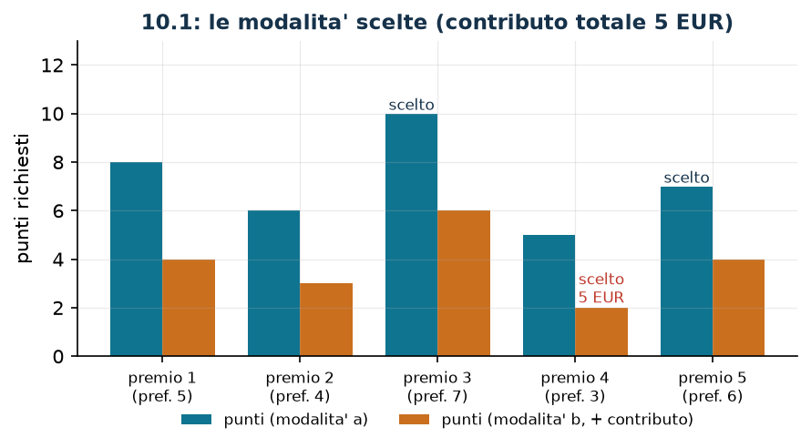

# Premi acquistabili con due modalità

**Classe:** BIP · **Legami:** mutua esclusione (set packing), somma come indicatore · **Script:** `python/fam10_1_premi.py`

[](https://colab.research.google.com/github/fabiofurini/modellazione-mip/blob/main/notebooks/fam10_1_premi.ipynb)

!!! abstract "Problema 10.1"
    Un programma fedeltà mette a disposizione $s \in \mathbb{Z}_{\ge 1}$ premi e
    un cliente dispone di $p \in \mathbb{Q}_{>0}$ punti. Ogni premio
    $i \in \{1, \dots, s\}$ si può ottenere in due modi alternativi: con i soli
    punti, spendendone $a_i \in \mathbb{Q}_{>0}$; oppure spendendone soltanto
    $b_i \in \mathbb{Q}_{>0}$ (con $b_i < a_i$) e aggiungendo un contributo in
    denaro di $c_i \in \mathbb{Q}_{\ge 0}$ euro. Ogni premio si può ottenere al
    più una volta, e in una sola delle due modalità. A ogni premio è associato un
    valore di preferenza $d_i \in \mathbb{Q}_{>0}$, e il cliente vuole
    raggiungere una preferenza complessiva di almeno $\ell \in \mathbb{Q}_{>0}$.
    Il cliente vuole minimizzare il denaro speso.

**Il problema a parole.** *Decidiamo* quali premi prendere e, per ciascuno, con
quale delle due modalità. *L'obiettivo*: contributo in denaro minimo. *I
vincoli*: i punti non bastano per tutto; la preferenza complessiva deve arrivare
alla soglia; e uno stesso premio non si prende due volte.

## Modello

**Variabili.** Servono *due* famiglie di binarie, una per modalità:
$x_i \in \{0,1\}$ vale $1$ se il premio $i$ si prende con i soli punti;
$y_i \in \{0,1\}$ vale $1$ se lo si prende con punti e contributo. In tutto $2s$
variabili binarie.

$$
\begin{aligned}
\min ~~ & \sum_{i=1}^{s} c_i\, y_i\\
\text{s.a.} \quad & x_i + y_i \le 1, && \forall i \in \{1, \dots, s\},\\
& \sum_{i=1}^{s} \bigl(a_i\, x_i + b_i\, y_i\bigr) \le p,\\
& \sum_{i=1}^{s} d_i\,(x_i + y_i) \ge \ell,\\
& x_i \in \{0, 1\}, \quad y_i \in \{0, 1\}, && \forall i \in \{1, \dots, s\}.
\end{aligned}
$$

**Descrizione.** L'obiettivo conta solo il denaro: la modalità a soli punti non
compare, perché non costa euro. I vincoli di **mutua esclusione**, uno per
premio ($s$ vincoli lineari), vietano di prendere lo stesso premio due volte. Il
vincolo del **budget in punti**, uno solo, dice che i punti spesi non superano
quelli disponibili. Il vincolo di **preferenza**, uno solo, impone la soglia.

!!! note "Che cosa dice e che cosa non dice la mutua esclusione"
    Il vincolo $x_i + y_i \le 1$ ammette **tre** configurazioni: $(0,0)$,
    $(1,0)$ e $(0,1)$. Vieta soltanto $(1,1)$. In particolare:

    - non dice «il premio $i$ va preso»: la configurazione $(0,0)$ è legittima e
      significa che quel premio si lascia perdere;
    - non dice «se non lo prendo a punti allora lo prendo con contributo»: la
      conversa $x_i = 0 \Rightarrow y_i = 1$ è falsa, e il controesempio è
      proprio $(0,0)$;
    - se si volesse imporre che ogni premio venga preso, il vincolo andrebbe
      scritto con l'uguaglianza, $x_i + y_i = 1$: è un set *partitioning*
      invece di un set *packing*, e il problema cambia.

    | $x_i$ | $y_i$ | ammesso? | significato |
    |---:|---:|---|---|
    | 0 | 0 | sì | il premio $i$ si lascia perdere |
    | 1 | 0 | sì | preso con i soli punti |
    | 0 | 1 | sì | preso con punti e contributo |
    | 1 | 1 | no | preso due volte |

    La quantità $x_i + y_i$ è dunque l'indicatore «il premio $i$ è stato preso,
    in un modo o nell'altro», ed è esattamente questa somma che compare nel
    vincolo di preferenza.

## Il modello in gurobipy

```python
m = gp.Model("premi")
x = m.addVars(s, vtype=GRB.BINARY, name="x")
y = m.addVars(s, vtype=GRB.BINARY, name="y")
m.setObjective(gp.quicksum(c[i] * y[i] for i in range(s)), GRB.MINIMIZE)
m.addConstrs((x[i] + y[i] <= 1 for i in range(s)), name="una_modalita")
m.addConstr(gp.quicksum(a[i] * x[i] + b[i] * y[i] for i in range(s)) <= p, name="punti")
m.addConstr(gp.quicksum(d[i] * (x[i] + y[i]) for i in range(s)) >= ell, name="preferenza")
```

## L'istanza

$s = 5$ premi, $p = 20$ punti, $\ell = 16$.

| | $i=1$ | $i=2$ | $i=3$ | $i=4$ | $i=5$ |
|---|---:|---:|---:|---:|---:|
| $a_i$ | 8 | 6 | 10 | 5 | 7 |
| $b_i$ | 4 | 3 | 6 | 2 | 4 |
| $c_i$ | 10 | 8 | 15 | 5 | 9 |
| $d_i$ | 5 | 4 | 7 | 3 | 6 |

## Euristica costruttiva: il bound primale

Si scorrono i premi per preferenza decrescente. Ciascuno si prende con i soli
punti se bastano, altrimenti con il contributo se bastano i punti ridotti,
altrimenti si salta; ci si ferma appena la preferenza richiesta è raggiunta.

Sull'istanza l'ordine per preferenza è $3, 5, 1, 2, 4$.

- premio 3 (preferenza 7): bastano i soli punti ($10 \le 20$), si prende;
  restano $10$ punti, preferenza $7$;
- premio 5 (preferenza 6): bastano i soli punti ($7 \le 10$), si prende;
  restano $3$ punti, preferenza $13$;
- premio 1 (preferenza 5): i punti non bastano né per la modalità a ($8 > 3$) né
  per la b ($4 > 3$): si salta;
- premio 2 (preferenza 4): i punti non bastano per la a ($6 > 3$) ma bastano per
  la b ($3 \le 3$): si prende con il contributo di $8$ euro; la preferenza
  arriva a $17 \ge 16$ e ci si ferma.

Il contributo totale è $z(\mathit{MILP}) \le \mathit{UB} = 8$.

## Rilassamento LP e duale: il bound duale

Si associano $\sigma_i \ge 0$ ai vincoli di mutua esclusione, $\pi \ge 0$ al
budget in punti e $\rho \ge 0$ alla soglia di preferenza. Il primale è di
minimo, quindi i vincoli $\le$ danno duali di segno negativo.

$$
\begin{aligned}
\max ~~ & -\sum_{i=1}^{s} \sigma_i - p\, \pi + \ell\, \rho\\
\text{s.a.} \quad & -\sigma_i - a_i\, \pi + d_i\, \rho \le 0, && \forall i \in \{1, \dots, s\},\\
& -\sigma_i - b_i\, \pi + d_i\, \rho \le c_i, && \forall i \in \{1, \dots, s\},\\
& \sigma_i \ge 0, \quad \pi \ge 0, \quad \rho \ge 0.
\end{aligned}
$$

**Descrizione.** $\pi$ è il prezzo di un punto, $\rho$ il valore di una unità di
preferenza e $\sigma_i$ il prezzo della mutua esclusione del premio $i$.
L'obiettivo incassa la soglia $\ell$ valutata a $\rho$ e paga il budget di punti
$p$ valutato a $\pi$ e i moltiplicatori $\sigma_i$. Il primo gruppo di vincoli
sono le colonne delle $x_i$: prendere il premio $i$ a soli punti frutta
$d_i\, \rho$ di preferenza, consuma $a_i\, \pi$ di punti e $\sigma_i$ di mutua
esclusione, e il saldo non può superare il costo in denaro di quella modalità,
che è zero. Il secondo gruppo dice la stessa cosa per la seconda modalità, che
consuma solo $b_i$ punti: lì il saldo può arrivare fino a $c_i$.

**Ricetta.** Qui i parametri liberi sono *due*, non uno: il prezzo $\pi$ di un
punto e il prezzo $\rho$ di una unità di preferenza. Fissati questi, i
moltiplicatori della mutua esclusione si ricavano prendendo il più piccolo
valore ammissibile,

$$\bar\sigma_i = \max\bigl(0,\ d_i\, \rho - a_i\, \pi\bigr) ,$$

e restano da verificare soltanto i vincoli sulla seconda modalità. La funzione

$$V(\pi, \rho) = -\sum_{i=1}^{s} \bar\sigma_i(\pi, \rho) - p\, \pi + \ell\, \rho$$

è concava e lineare a tratti: si può esplorare su una griglia. Sull'istanza il
massimo si trova in $\bar\pi = 2$, $\bar\rho = 3$,
$\bar\sigma = (0,\ 0,\ 1,\ 0,\ 4)$, con valore

$$\mathit{LB} = -(0+0+1+0+4) - 20 \cdot 2 + 16 \cdot 3 = 3 .$$

Questa soluzione è **ottima** per il rilassamento senza i bound: infatti
$z(\mathit{LP}) = z(\mathit{LP}^+) = 3$.

!!! warning "Un bound onesto può essere molto lontano"
    Qui $\mathit{LB} = 3$ e $z(\mathit{MILP}) = 5$: il gap fra il bound duale e
    l'ottimo intero è del $40\%$, e il gap certificato fra euristica e duale è
    del $100\%$. Non c'è nulla di sbagliato: il rilassamento LP può
    prendere «mezzo premio» a metà preferenza, e questa libertà vale molto. È il
    caso più estremo del corso, e serve a ricordare che un bound valido non è
    automaticamente un bound utile.

## Soluzione ottima

| | $i=1$ | $i=2$ | $i=3$ | $i=4$ | $i=5$ |
|---|---:|---:|---:|---:|---:|
| soli punti $x_i$ | 0 | 0 | 1 | 0 | 1 |
| con contributo $y_i$ | 0 | 0 | 0 | 1 | 0 |

Si prendono i premi $3$ e $5$ con i soli punti ($10 + 7 = 17$) e il premio $4$
con il contributo ($2$ punti e $5$ euro): i punti usati sono $19$ su $20$, la
preferenza è $7 + 6 + 3 = 16$, esattamente la soglia.

| $UB$ | $LB$ (duale) | $z(\mathit{LP})$ | $z(\mathit{LP}^+)$ | $z(\mathit{MILP})$ | gap |
|---:|---:|---:|---:|---:|---:|
| 8 | 3 | 3 | 3 | 5 | $60{,}0\%$ |



L'euristica sbaglia perché guarda solo la preferenza: prende il premio $5$ a
soli punti (giusto) ma poi si ritrova con $3$ punti e deve comprare il premio
$2$ a $8$ euro, mentre l'ottimo tiene da parte i punti per il premio $4$, che
costa solo $5$ euro di contributo.

## Considerazioni aggiuntive

- Le disuguaglianze valide $x_i \le 1$ e $y_i \le 1$ sono implicate dai vincoli
  di mutua esclusione: infatti $z(\mathit{LP}) = z(\mathit{LP}^+)$.
- Se per qualche premio fosse $c_i = 0$, la seconda modalità dominerebbe la
  prima (meno punti, stesso costo) e la variabile $x_i$ potrebbe essere
  eliminata. È un controllo sui dati che vale la pena fare.
- Il modello si estende a $k$ modalità senza fatica: bastano $k$ famiglie di
  binarie e il vincolo $\sum_{m=1}^{k} x_i^{(m)} \le 1$. La struttura resta un
  set packing per righe.

## Domande di modellazione aggiuntive

??? question "10.1.1 — Premi alternativi"
    I premi $3$ e $5$ provengono dallo stesso fornitore e sono alternativi: se
    ne può prendere al più uno, in qualunque modalità. Come cambia il modello?
    Qual è il nuovo ottimo?

    !!! tip "Soluzione"
        La soluzione è nel documento delle soluzioni, riservato ai docenti.

??? question "10.1.2 — Almeno quattro premi"
    Oltre alla soglia di preferenza, il cliente vuole almeno quattro premi
    diversi. Come cambia il modello? Qual è il nuovo ottimo?

    !!! tip "Soluzione"
        La soluzione è nel documento delle soluzioni, riservato ai docenti.

## Codice

Script completo —
[`python/fam10_1_premi.py`](https://github.com/fabiofurini/modellazione-mip/blob/main/python/fam10_1_premi.py)
(riproducibile con `python3 python/fam10_1_premi.py` dalla cartella `python/`).
Notebook —
[`notebooks/fam10_1_premi.ipynb`](https://github.com/fabiofurini/modellazione-mip/blob/main/notebooks/fam10_1_premi.ipynb)
— che si apre in Colab dal badge in cima alla pagina.

<!-- script-incorporato: inizio (rigenerato da python/incorpora_codice.py) -->

??? example "Mostra lo script completo — `python/fam10_1_premi.py` (174 righe)"

    ```python
    """Problema 10.1 -- Premi acquistabili con due modalita'.

    Ogni premio si ottiene o con soli punti oppure con meno punti piu' un contributo
    in euro: due variabili binarie per premio e un vincolo di mutua esclusione. Il
    legame e' quello del capitolo 2: x_i + y_i <= 1 e' un set packing, e le converse
    vanno confutate esplicitamente con x_i = y_i = 0.
    """
    import gurobipy as gp
    import pandas as pd
    from gurobipy import GRB

    from mip import (ammissibile, due_rilassamenti, frazione, nuovo_modello, registra_bound,
                     risolvi, valuta)
    from stile import ARANCIO, BLU, ROSSO, TEAL, intestazione, plt, salva_dati, salva_figura

    R = range

    # ---------- 1. MODELLO E ISTANZA ----------
    intestazione("10.1 Premi: soli punti oppure meno punti piu' un contributo in euro")
    a1 = [8, 6, 10, 5, 7]        # punti se si usa la sola modalita' a punti
    b1 = [4, 3, 6, 2, 4]         # punti se si aggiunge il contributo
    c1 = [10, 8, 15, 5, 9]       # contributo in euro
    d1 = [5, 4, 7, 3, 6]         # valore di preferenza
    p1, ell1 = 20, 16            # punti disponibili e preferenza minima richiesta
    s1 = len(a1)
    salva_dati(pd.DataFrame({"premio": R(1, s1 + 1), "a": a1, "b": b1, "c": c1, "d": d1}),
               "premi1_dati")
    print(f"  {s1} premi, {p1} punti disponibili, preferenza minima richiesta {ell1}")


    def modello_1(a, b, c, d, p, ell):
        s = len(a)
        m = nuovo_modello("premi")
        x = m.addVars(s, vtype=GRB.BINARY, name="x")     # premio con soli punti
        y = m.addVars(s, vtype=GRB.BINARY, name="y")     # premio con punti + contributo
        m.setObjective(gp.quicksum(c[i] * y[i] for i in R(s)), GRB.MINIMIZE)
        m.addConstrs((x[i] + y[i] <= 1 for i in R(s)), name="una_modalita")
        m.addConstr(gp.quicksum(a[i] * x[i] + b[i] * y[i] for i in R(s)) <= p, name="punti")
        m.addConstr(gp.quicksum(d[i] * (x[i] + y[i]) for i in R(s)) >= ell, name="preferenza")
        return m, x, y


    def duale_1(a, b, c, d, p, ell):
        """max -sum_i sigma_i - p pi + ell rho;  -sigma_i - a_i pi + d_i rho <= 0;
        -sigma_i - b_i pi + d_i rho <= c_i;  sigma, pi >= 0, rho >= 0.
        (sigma sono i duali di x_i + y_i <= 1, pi quello dei punti, rho quello della preferenza;
        in un minimo i vincoli <= danno duali <= 0: qui si scrive -sigma con sigma >= 0.)"""
        s = len(a)
        dl = nuovo_modello("duale_premi")
        sigma = dl.addVars(s, name="sigma")
        pi = dl.addVar(name="pi")
        rho = dl.addVar(name="rho")
        dl.setObjective(-gp.quicksum(sigma[i] for i in R(s)) - p * pi + ell * rho, GRB.MAXIMIZE)
        dl.addConstrs((-sigma[i] - a[i] * pi + d[i] * rho <= 0 for i in R(s)), name="rc_x")
        dl.addConstrs((-sigma[i] - b[i] * pi + d[i] * rho <= c[i] for i in R(s)), name="rc_y")
        return dl


    m1, x1, y1 = modello_1(a1, b1, c1, d1, p1, ell1)

    # ---------- 2. EURISTICA COSTRUTTIVA (UPPER BOUND) ----------
    # euristica costruttiva: si scorrono i premi per preferenza decrescente; ciascuno si prende con i soli
    # punti se bastano, altrimenti con il contributo se bastano i punti ridotti, e ci si ferma
    # appena la preferenza richiesta e' raggiunta
    punti, pref = p1, 0
    scelta = {}
    for i in sorted(R(s1), key=lambda i: (-d1[i], i)):
        if pref >= ell1:
            break
        if punti >= a1[i]:
            scelta[i], punti, pref = "punti", punti - a1[i], pref + d1[i]
            print(f"  Premio {i + 1} (preferenza {d1[i]}): bastano i soli punti ({a1[i]} <= "
                  f"{punti + a1[i]}): si prende; preferenza {pref}, punti residui {punti}")
        elif punti >= b1[i]:
            scelta[i], punti, pref = "contributo", punti - b1[i], pref + d1[i]
            print(f"  Premio {i + 1} (preferenza {d1[i]}): i punti non bastano per la modalita' a "
                  f"({a1[i]} > {punti + b1[i]}), si usa la b: {b1[i]} punti e {c1[i]} euro; "
                  f"preferenza {pref}, punti residui {punti}")
        else:
            print(f"  Premio {i + 1} (preferenza {d1[i]}): i punti residui {punti} non bastano "
                  f"per nessuna delle due modalita': si salta")
    assert pref >= ell1, "la euristica costruttiva non raggiunge la preferenza richiesta"
    ub1 = sum(c1[i] for i, mod in scelta.items() if mod == "contributo")
    sol_eur = {f"x[{i}]": 1 for i, mod in scelta.items() if mod == "punti"} \
        | {f"y[{i}]": 1 for i, mod in scelta.items() if mod == "contributo"}
    assert ammissibile(m1, sol_eur)
    print(f"  Soluzione euristica: preferenza {pref} >= {ell1}, contributo totale ub = {frazione(ub1)}")

    # ---------- 3. RILASSAMENTO LP E DUALE (LOWER BOUND) ----------
    dl1 = duale_1(a1, b1, c1, d1, p1, ell1)
    # ricetta: si scelgono il prezzo pi di un punto e il prezzo rho di una unita' di
    # preferenza; i duali della mutua esclusione si ricavano da questi ponendo
    # sigma_i = max(0, d_i rho - a_i pi), cioe' il minimo che rende ammissibile il vincolo
    # sulla modalita' a. Restano da controllare i vincoli sulla modalita' b. La coppia
    # (pi, rho) si sceglie su una griglia: l'obiettivo e' concavo e lineare a tratti.
    def duale_da(pi_v, rho_v):
        sig = [max(0.0, d1[i] * rho_v - a1[i] * pi_v) for i in R(s1)]
        ok = all(-sig[i] - b1[i] * pi_v + d1[i] * rho_v <= c1[i] + 1e-9 for i in R(s1))
        val = -sum(sig) - p1 * pi_v + ell1 * rho_v
        return (val if ok else float("-inf")), sig


    griglia = [k / 100 for k in R(0, 301)]
    coppie = [(pi_v, rho_v) for pi_v in griglia for rho_v in griglia]
    pi_star, rho_star = max(coppie, key=lambda c: duale_da(*c)[0])
    _, sigma_star = duale_da(pi_star, rho_star)
    mano = {"pi": pi_star, "rho": rho_star} | {f"sigma[{i}]": sigma_star[i] for i in R(s1)}
    lb1, viol = valuta(dl1, mano)
    assert viol <= 1e-9, (viol, mano)
    print("  Duale a mano: si scelgono il prezzo pi di un punto e il prezzo rho di una unita'")
    print("  di preferenza; i duali della mutua esclusione si ricavano da questi ponendo")
    print("  sigma_i = max(0, d_i rho - a_i pi), il minimo che rende ammissibile il vincolo")
    print("  sulla modalita' a. Restano da controllare i vincoli sulla modalita' b.")
    print(f"    pi = {frazione(pi_star)} euro per punto, rho = {frazione(rho_star)} euro per unita'")
    print(f"    di preferenza, sigma = " + ", ".join(frazione(v) for v in sigma_star))
    print(f"  ->  lb = -sum(sigma) - p pi + l rho = {frazione(lb1)}")
    zlp1, zlp1r, _ = due_rilassamenti(m1, dl1)

    # ---------- 4. OTTIMO DEL MILP ----------
    z1 = risolvi(m1)
    soli_punti = [i + 1 for i in R(s1) if x1[i].X > 0.5]
    con_contributo = [i + 1 for i in R(s1) if y1[i].X > 0.5]
    print(f"  Soluzione ottima: con i soli punti {soli_punti}, con contributo {con_contributo}; "
          f"contributo totale {frazione(z1)}")
    print(f"  Punti usati: {sum(a1[i - 1] for i in soli_punti) + sum(b1[i - 1] for i in con_contributo)}"
          f" su {p1}; preferenza "
          f"{sum(d1[i - 1] for i in soli_punti + con_contributo)} >= {ell1}")
    riga = registra_bound("1 premi", ub1, lb1, zlp1, zlp1r, z1)
    salva_dati(pd.DataFrame([riga]), "premi1_bound")
    assert lb1 <= zlp1 <= z1 <= ub1 + 1e-9

    # ---------- 5. DOMANDE DI MODELLAZIONE AGGIUNTIVE ----------
    varianti = {}


    def variante(nome, m):
        z = risolvi(m)
        print(f"  {nome:70s} z = {frazione(z)}")
        return z


    # 1a: i premi 3 e 5 sono alternativi (al piu' uno dei due, in qualunque modalita')
    m, x, y = modello_1(a1, b1, c1, d1, p1, ell1)
    m.addConstr(x[2] + y[2] + x[4] + y[4] <= 1, name="alternativi")
    varianti["1a"] = variante("1a. I premi 3 e 5 sono alternativi (x3+y3+x5+y5 <= 1)", m)
    # 1b: si vogliono almeno quattro premi, oltre alla soglia di preferenza
    m, x, y = modello_1(a1, b1, c1, d1, p1, ell1)
    m.addConstr(gp.quicksum(x[i] + y[i] for i in R(s1)) >= 4, name="almeno_quattro")
    varianti["1b"] = variante("1b. Si vogliono almeno quattro premi (sum_i (x_i+y_i) >= 4)", m)
    salva_dati(pd.DataFrame({"variante": list(varianti), "z": list(varianti.values())}),
               "premi1_varianti")

    # ---------- 6. FIGURA ----------
    fig, ax = plt.subplots(figsize=(6.8, 3.0))
    premi = list(R(1, s1 + 1))
    larghezza = 0.38
    ax.bar([i - larghezza / 2 for i in premi], a1, larghezza, color=TEAL, label="punti (modalita' a)")
    ax.bar([i + larghezza / 2 for i in premi], b1, larghezza, color=ARANCIO,
           label="punti (modalita' b, + contributo)")
    for i in R(s1):
        if x1[i].X > 0.5:
            ax.annotate("scelto", (i + 1 - larghezza / 2, a1[i]), ha="center", va="bottom",
                        fontsize=8, color=BLU)
        if y1[i].X > 0.5:
            ax.annotate(f"scelto\n{c1[i]} EUR", (i + 1 + larghezza / 2, b1[i]), ha="center",
                        va="bottom", fontsize=8, color=ROSSO)
    ax.set_xticks(premi)
    ax.set_xticklabels([f"premio {i}\n(pref. {d1[i - 1]})" for i in premi], fontsize=8)
    ax.set_ylabel("punti richiesti")
    ax.set_ylim(0, max(a1) + 3)
    ax.set_title(f"10.1: le modalita' scelte (contributo totale {frazione(z1)} EUR)")
    ax.legend(fontsize=8)
    salva_figura(fig, "cap10_premi_ottimo")
    print("Fine.")
    ```

<!-- script-incorporato: fine -->
