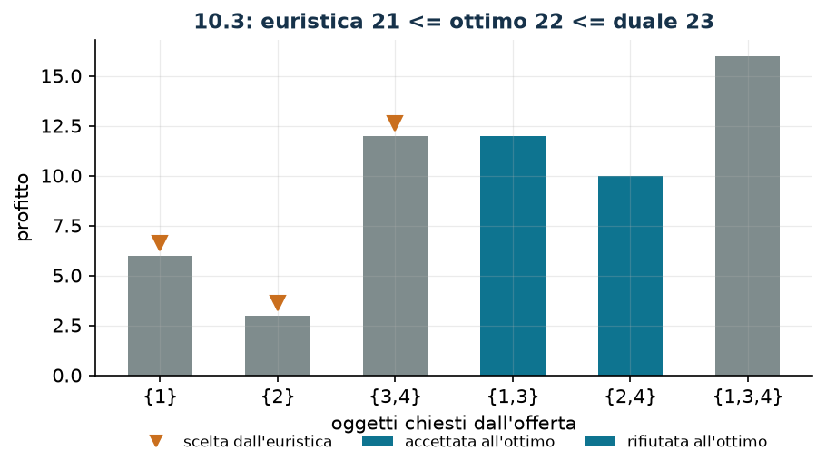

# Asta combinatoria

**Classe:** BIP · **Legami:** set packing per righe · **Script:** `python/fam10_2_asta.py`

[](https://colab.research.google.com/github/fabiofurini/modellazione-mip/blob/main/notebooks/fam10_2_asta.ipynb)

!!! abstract "Problema 10.2"
    Un banditore ha un insieme $S = \{1, 2, \dots, n\}$ di
    $n \in \mathbb{Z}_{\ge 1}$ oggetti da vendere e ha ricevuto
    $r \in \mathbb{Z}_{\ge 1}$ offerte. Per ogni offerta $j \in \{1, \dots, r\}$,
    l'insieme $B_j \subseteq S$ è il sottoinsieme di oggetti richiesti e
    $p_j \in \mathbb{Q}_{>0}$ il profitto in euro se l'offerta viene accettata.
    Ogni oggetto può essere venduto al più una volta, e un'offerta può essere
    accettata solo se tutti i suoi oggetti sono disponibili. Il banditore vuole
    scegliere un insieme di offerte di profitto totale massimo.

**Il problema a parole.** *Decidiamo* quali offerte accettare. *L'obiettivo*:
profitto massimo. *Il vincolo*: due offerte accettate non possono chiedere lo
stesso oggetto. Un'offerta è «tutto o niente»: non se ne accetta una parte.

## Modello

**Variabili.** Una sola famiglia di $r$ binarie: $x_j \in \{0,1\}$ vale $1$ se
l'offerta $j$ viene accettata.

$$
\begin{aligned}
\max ~~ & \sum_{j=1}^{r} p_j\, x_j\\
\text{s.a.} \quad & \sum_{j :\, i \in B_j} x_j \le 1, && \forall i \in S,\\
& x_j \in \{0,1\}, && \forall j \in \{1, \dots, r\}.
\end{aligned}
$$

**Descrizione.** L'obiettivo somma i profitti delle offerte accettate. È un
**set packing** puro: un vincolo per oggetto ($n$ vincoli lineari) e una
variabile per offerta. Il vincolo dell'oggetto $i$ dice che quell'oggetto viene
venduto al più una volta, e quindi che due offerte che se lo contendono non
possono essere accettate entrambe.

!!! tip "Per righe, non per coppie"
    Un modo alternativo, e peggiore, di scrivere lo stesso vincolo è elencare
    tutte le *coppie* di offerte in conflitto: $x_j + x_{j'} \le 1$ per ogni
    $j \ne j'$ con $B_j \cap B_{j'} \ne \emptyset$. Sull'istanza sarebbero nove
    vincoli invece di quattro, e su istanze reali il numero di coppie cresce
    come $r^2$ mentre i vincoli per oggetto restano $n$. La forma per righe è
    anche più stretta: se tre offerte chiedono tutte l'oggetto $i$, il vincolo
    di riga dice $x_1 + x_2 + x_3 \le 1$, mentre le tre disuguaglianze a coppie
    ammettono $x_1 = x_2 = x_3 = 1/2$.

## Il modello in gurobipy

```python
m = gp.Model("asta")
x = m.addVars(r, vtype=GRB.BINARY, name="x")
m.setObjective(gp.quicksum(p[j] * x[j] for j in range(r)), GRB.MAXIMIZE)
m.addConstrs((gp.quicksum(x[j] for j in range(r) if i in B[j]) <= 1
              for i in range(n)), name="oggetto")
```

## L'istanza

$n = 4$ oggetti, $r = 6$ offerte.

| | $j=1$ | $j=2$ | $j=3$ | $j=4$ | $j=5$ | $j=6$ |
|---|---:|---:|---:|---:|---:|---:|
| $B_j$ | $\{1\}$ | $\{2\}$ | $\{3,4\}$ | $\{1,3\}$ | $\{2,4\}$ | $\{1,3,4\}$ |
| $p_j$ | 6 | 3 | 12 | 12 | 10 | 16 |

Scritto per esteso, il modello dell'istanza è

$$\max ~ 6 x_1 + 3 x_2 + 12 x_3 + 12 x_4 + 10 x_5 + 16 x_6$$

soggetto a

$$
\begin{aligned}
x_1 + x_4 + x_6 &\le 1 && \text{(oggetto 1)},\\
x_2 + x_5 &\le 1 && \text{(oggetto 2)},\\
x_3 + x_4 + x_6 &\le 1 && \text{(oggetto 3)},\\
x_3 + x_5 + x_6 &\le 1 && \text{(oggetto 4)},
\end{aligned}
$$

con $x_j \in \{0,1\}$.

## Euristica costruttiva: il bound primale

Il problema è di massimo, quindi l'euristica dà il bound **primale**, che sta
sotto l'ottimo. Si ordinano le offerte per profitto *per oggetto* decrescente e
si accettano quelle i cui oggetti sono ancora liberi. Il tempo di esecuzione è
$O(r \log r + r\, n)$.

Sull'istanza i rapporti sono $6$, $3$, $6$, $6$, $5$ e $16/3 \approx 5{,}33$,
quindi l'ordine è $1, 3, 4, 6, 5, 2$:

- offerta 1 $\{1\}$: accettata (profitto 6);
- offerta 3 $\{3,4\}$: accettata (profitto 12);
- offerta 4 $\{1,3\}$: scartata, gli oggetti $1$ e $3$ sono già venduti;
- offerta 6 $\{1,3,4\}$: scartata;
- offerta 5 $\{2,4\}$: scartata, l'oggetto $4$ è già venduto;
- offerta 2 $\{2\}$: accettata (profitto 3).

Si accettano le offerte $1, 2, 3$: $z(\mathrm{MILP}) \ge \mathit{LB} = 21$.

## Rilassamento LP e duale: il bound duale

Si associa una variabile duale non negativa $\lambda_i$ a ciascun vincolo di
oggetto.

$$
\begin{aligned}
\min ~~ & \sum_{i \in S} \lambda_i\\
\text{s.a.} \quad & \sum_{i \in B_j} \lambda_i \ge p_j, && \forall j \in \{1, \dots, r\},\\
& \lambda_i \ge 0, && \forall i \in S.
\end{aligned}
$$

**Descrizione.** $\lambda_i$ è il prezzo che il banditore attribuisce
all'oggetto $i$. L'obiettivo è il valore complessivo dei lotti a quei prezzi. I
vincoli sono le colonne delle $x_j$, uno per offerta: gli oggetti che l'offerta
$j$ richiede, valutati a quei prezzi, devono valere almeno quanto l'offerta
paga. Nessuna offerta, insomma, deve risultare un affare.

**Ricetta.** Si spalma il profitto di ogni offerta sui suoi oggetti e si prende,
per ogni oggetto, il massimo fra le offerte che lo chiedono,

$$\bar\lambda_i = \max_{j :\, i \in B_j} \frac{p_j}{|B_j|} .$$

L'ammissibilità è immediata: per ogni offerta $j$,

$$\sum_{i \in B_j} \bar\lambda_i \;\ge\; |B_j| \cdot \frac{p_j}{|B_j|} = p_j .$$

Sull'istanza $\bar\lambda = (6, 5, 6, 6)$ e
$z(\mathrm{MILP}) \le \mathit{UB} = 23$.

!!! warning "Una ricetta grossolana costa molto"
    La ricetta «ovvia» $\bar\lambda_i = \max_{j :\, i \in B_j} p_j$ (senza
    dividere per $|B_j|$) è anch'essa ammissibile, ma dà
    $16 + 10 + 16 + 16 = 58$: più del doppio. Dividere per la cardinalità
    dell'insieme richiesto è ciò che rende il bound utile. Vale la pena provare
    più ricette e tenere la migliore: sono tutte valide, non tutte informative.

## Soluzione ottima

All'ottimo si accettano le offerte $4$ ($\{1,3\}$, profitto $12$) e $5$
($\{2,4\}$, profitto $10$): tutti e quattro gli oggetti vengono venduti.

| $LB$ (euristica) | $z(\mathrm{MILP})$ | $z(\mathrm{LP})$ | $z(\mathrm{LP}^+)$ | $UB$ (duale) | gap |
|---:|---:|---:|---:|---:|---:|
| 21 | 22 | 22 | 22 | 23 | $4{,}5\%$ |



Il banditore vende tutto, ma non perché un vincolo lo imponga: i vincoli sono
$\le$, non $=$. Con altre offerte la soluzione ottima potrebbe lasciare oggetti
sullo scaffale.

## Considerazioni aggiuntive

- Le disuguaglianze valide $x_j \le 1$ sono implicate dai vincoli di oggetto
  ogni volta che $B_j \ne \emptyset$: infatti
  $z(\mathrm{LP}) = z(\mathrm{LP}^+) = 22$.
- Su questa istanza si ha anche $z(\mathrm{LP}) = z(\mathrm{MILP})$: il
  rilassamento cade in un vertice intero. È un caso fortunato, non una proprietà
  del set packing. Il controesempio minimo è il **triangolo**: tre oggetti e tre
  offerte che ne chiedono due ciascuna, tutte di profitto $1$. Lì
  $z(\mathrm{LP}) = 3/2$ (con $x = 1/2$ su tutte e tre) contro
  $z(\mathrm{MILP}) = 1$.
- Il set packing è NP-difficile in generale, ma diventa facile quando la matrice
  di incidenza è *perfetta* o *bilanciata*. Il triangolo è il più piccolo grafo
  non perfetto in questo senso, ed è il motivo per cui le *clique inequalities*
  sono i tagli classici per questa famiglia.

## Domande di modellazione aggiuntive

??? question "10.2.1 — Offerte dello stesso partecipante"
    Le offerte $4$ e $5$ provengono dallo stesso partecipante, che può vincerne
    al più una. Come cambia il modello? Qual è il nuovo ottimo?

    !!! tip "Soluzione"
        La soluzione è nel documento delle soluzioni, riservato ai docenti.

??? question "10.2.2 — Consegne limitate"
    In questa tornata il banditore può consegnare al più due oggetti in totale.
    Come cambia il modello? Qual è il nuovo ottimo?

    !!! tip "Soluzione"
        La soluzione è nel documento delle soluzioni, riservato ai docenti.

## Codice

Script completo —
[`python/fam10_2_asta.py`](https://github.com/fabiofurini/modellazione-mip/blob/main/python/fam10_2_asta.py)
(riproducibile con `python3 python/fam10_2_asta.py` dalla cartella `python/`).
Notebook —
[`notebooks/fam10_2_asta.ipynb`](https://github.com/fabiofurini/modellazione-mip/blob/main/notebooks/fam10_2_asta.ipynb)
— che si apre in Colab dal badge in cima alla pagina.

<!-- script-incorporato: inizio (rigenerato da python/incorpora_codice.py) -->

??? example "Mostra lo script completo — `python/fam10_2_asta.py` (187 righe)"

    ```python
    """Problema 10.3 -- Asta combinatoria (set packing).

    Un banditore ha n oggetti e riceve r offerte: l'offerta j chiede il sottoinsieme
    B_j e paga p_j, e vale tutto o niente. E' il set packing puro: un vincolo per
    oggetto, una variabile per offerta. Essendo un massimo, l'euristica da' il lower
    bound e il duale a mano il bound superiore: i ruoli si scambiano rispetto a 10.1
    e 10.2.
    """
    import gurobipy as gp
    import pandas as pd
    from gurobipy import GRB

    from mip import (ammissibile, due_rilassamenti, frazione, nuovo_modello, registra_bound,
                     risolvi, stampa_lp, valuta)
    from stile import ARANCIO, GRIGIO, TEAL, intestazione, plt, salva_dati, salva_figura

    R = range

    # ---------- 1. MODELLO E ISTANZA ----------
    intestazione("10.3 Asta combinatoria: scegliere le offerte di profitto massimo")
    n3 = 4                                                     # oggetti in vendita
    B3 = [[0], [1], [2, 3], [0, 2], [1, 3], [0, 2, 3]]         # oggetti chiesti da ogni offerta
    p3 = [6, 3, 12, 12, 10, 16]                                # profitto dell'offerta
    r3 = len(p3)
    salva_dati(pd.DataFrame({"offerta": [j + 1 for j in R(r3)],
                             "oggetti": ["{" + ",".join(str(i + 1) for i in B3[j]) + "}"
                                         for j in R(r3)],
                             "profitto": p3}), "asta3_dati")


    def modello_3(n, B, p, extra=None):
        r = len(p)
        m = nuovo_modello("asta")
        x = m.addVars(r, vtype=GRB.BINARY, name="x")           # 1 se l'offerta e' accettata
        m.setObjective(gp.quicksum(p[j] * x[j] for j in R(r)), GRB.MAXIMIZE)
        m.addConstrs((gp.quicksum(x[j] for j in R(r) if i in B[j]) <= 1 for i in R(n)),
                     name="oggetto")
        return m, x


    def duale_3(n, B, p):
        """min sum_i lam_i  s.t.  sum_{i in B_j} lam_i >= p_j per ogni offerta j, lam >= 0.

        Il duale ha una variabile per oggetto: lam_i e' il prezzo che il banditore
        attribuisce all'oggetto i, e ogni offerta deve costare almeno quanto paga.
        """
        r = len(p)
        dl = nuovo_modello("duale_asta")
        lam = dl.addVars(n, name="lam")
        dl.setObjective(gp.quicksum(lam[i] for i in R(n)), GRB.MINIMIZE)
        dl.addConstrs((gp.quicksum(lam[i] for i in B[j]) >= p[j] for j in R(r)), name="offerta")
        return dl, lam


    m3, x3 = modello_3(n3, B3, p3)
    print("  Il modello dell'istanza:")
    stampa_lp(m3)

    # ---------- 2. EURISTICA COSTRUTTIVA (LOWER BOUND) ----------
    # euristica costruttiva sul profitto per oggetto: si accettano le offerte piu' redditizie fra
    # quelle i cui oggetti sono ancora liberi. Costo O(r log r + r n).
    def euristica(n, B, p):
        r = len(p)
        x = [0] * r
        libero = [True] * n
        passi = []
        for j in sorted(R(r), key=lambda j: (-p[j] / len(B[j]), j)):
            oggetti = "{" + ",".join(str(i + 1) for i in B[j]) + "}"
            occupati = [i + 1 for i in B[j] if not libero[i]]
            if occupati:
                passi.append(f"offerta {j + 1} {oggetti}, {p[j] / len(B[j]):.4g} per oggetto: "
                             f"scartata, gli oggetti {occupati} sono gia' venduti")
                continue
            x[j] = 1
            for i in B[j]:
                libero[i] = False
            passi.append(f"offerta {j + 1} {oggetti}, {p[j] / len(B[j]):.4g} per oggetto: "
                         f"accettata (profitto {p[j]})")
        return x, passi


    x_eur, passi = euristica(n3, B3, p3)
    for k, riga in enumerate(passi, 1):
        print(f"  Passo {k}. {riga}")
    lb3 = sum(p3[j] * x_eur[j] for j in R(r3))
    sol_eur = {f"x[{j}]": x_eur[j] for j in R(r3)}
    assert ammissibile(m3, sol_eur), sol_eur
    accettate = [j + 1 for j in R(r3) if x_eur[j]]
    print(f"  Soluzione euristica: offerte {accettate}   lb = {frazione(lb3)}")

    # ---------- 3. RILASSAMENTO LP E DUALE (UPPER BOUND) ----------
    dl3, lam3 = duale_3(n3, B3, p3)
    # Ricetta a mano: si spalma ogni offerta sui suoi oggetti e si prende il massimo,
    # lam_i = max_{j : i in B_j} p_j / |B_j|. E' sempre ammissibile perche' per ogni
    # offerta j vale sum_{i in B_j} lam_i >= |B_j| * p_j / |B_j| = p_j.
    mano = {f"lam[{i}]": max(p3[j] / len(B3[j]) for j in R(r3) if i in B3[j]) for i in R(n3)}
    ub3, viol = valuta(dl3, mano)
    assert viol <= 1e-9, viol
    print("  Duale a mano: lam_i = max_{j : i in B_j} p_j / |B_j| (il profitto di ogni offerta")
    print("  spalmato sui suoi oggetti; la somma su B_j vale allora almeno p_j):")
    for i in R(n3):
        quote = ", ".join(f"{p3[j]}/{len(B3[j])}" for j in R(r3) if i in B3[j])
        print(f"    oggetto {i + 1}: max({quote}) = {frazione(mano[f'lam[{i}]'])}")
    print(f"  ub = somma dei prezzi = {frazione(ub3)}")
    # per confronto: la ricetta della dispensa di partenza, lam_i = max p_j sulle offerte
    grezza = {f"lam[{i}]": max(p3[j] for j in R(r3) if i in B3[j]) for i in R(n3)}
    ub_grezzo, viol_g = valuta(dl3, grezza)
    assert viol_g <= 1e-9
    print(f"  (con la ricetta piu' grossolana lam_i = max_j p_j si otterrebbe soltanto "
          f"{frazione(ub_grezzo)})")
    zlp3, zlp3r, _ = due_rilassamenti(m3, dl3)

    # ---------- 4. OTTIMO DEL MILP ----------
    z3 = risolvi(m3)
    ottime = [j + 1 for j in R(r3) if x3[j].X > 0.5]
    venduti = sorted({i + 1 for j in R(r3) if x3[j].X > 0.5 for i in B3[j]})
    print(f"  Soluzione ottima: offerte {ottime}, oggetti venduti {venduti}, profitto "
          f"{frazione(z3)}")
    invenduti = [i + 1 for i in R(n3) if i + 1 not in venduti]
    print(f"  Oggetti invenduti: {invenduti if invenduti else 'nessuno'}. Il banditore vende tutto,")
    print("  ma non perche' un vincolo lo imponga: i vincoli sono <=, non =. Con altre offerte la")
    print("  soluzione ottima potrebbe lasciare oggetti sullo scaffale.")
    riga = registra_bound("3 asta", ub3, lb3, zlp3, zlp3r, z3, senso="max")
    salva_dati(pd.DataFrame([riga]), "asta3_bound")
    assert lb3 <= z3 <= zlp3r <= zlp3 <= ub3 + 1e-9

    # ---------- 5. I DUE RILASSAMENTI E L'INTEREZZA ----------
    intestazione("10.3 I due rilassamenti e l'interezza del rilassamento")
    print(f"  z(LP) = {frazione(zlp3)} e z(LP+) = {frazione(zlp3r)} coincidono: i vincoli")
    print("  sum_{j : i in B_j} x_j <= 1 implicano gia' x_j <= 1 per ogni offerta con B_j non")
    print("  vuoto. Le disuguaglianze valide x_j <= 1 sono dunque ridondanti e non rafforzano.")
    assert abs(zlp3 - zlp3r) <= 1e-9
    print(f"  Su questa istanza si ha anche z(LP) = z(MILP) = {frazione(z3)}: il rilassamento")
    print("  cade in un vertice intero. E' un caso fortunato dell'istanza, non una proprieta'")
    print("  del set packing. Il controesempio minimo e' il triangolo: tre oggetti e tre offerte")
    print("  che ne chiedono due ciascuna, tutte di profitto 1.")
    m_tri, _ = modello_3(3, [[0, 1], [1, 2], [0, 2]], [1, 1, 1])
    dl_tri, _ = duale_3(3, [[0, 1], [1, 2], [0, 2]], [1, 1, 1])
    z_tri = risolvi(m_tri)
    zlp_tri, zlp_tri_r, _ = due_rilassamenti(m_tri, dl_tri)
    print(f"  Triangolo: z(LP) = {frazione(zlp_tri)} (x = 1/2 su tutte e tre) contro "
          f"z(MILP) = {frazione(z_tri)}.")
    assert zlp_tri > z_tri + 1e-9
    salva_dati(pd.DataFrame([{"istanza": "asta 10.3", "z_lp": zlp3, "z_milp": z3},
                             {"istanza": "triangolo", "z_lp": zlp_tri, "z_milp": z_tri}]),
               "asta3_triangolo")

    # ---------- 6. DOMANDE DI MODELLAZIONE AGGIUNTIVE ----------
    varianti = {}


    def variante(nome, m):
        z = risolvi(m)
        print(f"  {nome:70s} z = {frazione(z)}")
        return z


    # 3a: le offerte 4 e 5 vengono dallo stesso partecipante, che ne puo' vincere al piu' una
    m, x = modello_3(n3, B3, p3)
    m.addConstr(x[3] + x[4] <= 1, name="stesso_partecipante")
    varianti["3a"] = variante("3a. Le offerte 4 e 5 sono dello stesso partecipante (x4+x5 <= 1)", m)
    # 3b: il banditore consegna al piu' due oggetti in questa tornata
    m, x = modello_3(n3, B3, p3)
    m.addConstr(gp.quicksum(len(B3[j]) * x[j] for j in R(r3)) <= 2, name="consegne")
    varianti["3b"] = variante("3b. Si consegnano al piu' due oggetti (sum_j |B_j| x_j <= 2)", m)
    salva_dati(pd.DataFrame({"variante": list(varianti), "z": list(varianti.values())}),
               "asta3_varianti")

    # ---------- 7. FIGURA ----------
    fig, ax = plt.subplots(figsize=(6.8, 3.2))
    idx = list(R(r3))
    colori = [TEAL if x3[j].X > 0.5 else GRIGIO for j in idx]
    ax.bar(idx, p3, 0.55, color=colori)
    for j in idx:
        if x_eur[j]:
            ax.plot(j, p3[j] + 0.6, marker="v", color=ARANCIO, ms=8)
    ax.plot([], [], marker="v", ls="", color=ARANCIO, label="scelta dall'euristica")
    ax.bar([], [], color=TEAL, label="accettata all'ottimo")
    ax.bar([], [], color=GRIGIO, label="rifiutata all'ottimo")
    ax.set_xticks(idx)
    ax.set_xticklabels(["{" + ",".join(str(i + 1) for i in B3[j]) + "}" for j in idx])
    ax.set_xlabel("oggetti chiesti dall'offerta")
    ax.set_ylabel("profitto")
    ax.set_title(f"10.3: euristica {frazione(lb3)} <= ottimo {frazione(z3)} <= duale {frazione(ub3)}")
    ax.legend(fontsize=8, loc="upper left")
    salva_figura(fig, "cap10_asta_offerte")
    print("Fine.")
    ```

<!-- script-incorporato: fine -->
