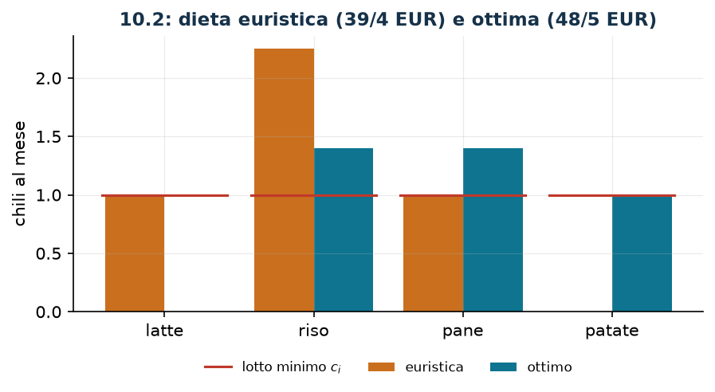

# Dieta con conteggio dei cibi e lotto minimo

**Classe:** MILP · **Legami:** lotto minimo (semicontinua), contare i tipi · **Script:** `python/fam10_3_dieta.py`

[](https://colab.research.google.com/github/fabiofurini/modellazione-mip/blob/main/notebooks/fam10_3_dieta.ipynb)

!!! abstract "Problema 10.3"
    Un nutrizionista deve comporre una dieta mensile scegliendo fra
    $s \in \mathbb{Z}_{\ge 1}$ cibi e controllando $r \in \mathbb{Z}_{\ge 1}$
    nutrienti. Per ogni cibo $i \in \{1, \dots, s\}$, il valore
    $w_i \in \mathbb{Q}_{>0}$ è il costo di un chilo; per ogni cibo $i$ e ogni
    nutriente $j \in \{1, \dots, r\}$, il valore $g_{ij} \in \mathbb{Q}_{\ge 0}$
    è la quantità di nutriente $j$ contenuta in un chilo di cibo $i$. Per ogni
    nutriente $j$, l'assunzione mensile deve stare fra $a_j \in \mathbb{Q}_{>0}$
    e $b_j \in \mathbb{Q}_{>0}$. Se un cibo entra nella dieta se ne devono
    consumare almeno $c_i \in \mathbb{Q}_{>0}$ chili e al più
    $d_i \in \mathbb{Q}_{>0}$. La dieta deve comprendere almeno
    $t \in \mathbb{Z}_{\ge 1}$ cibi diversi. Si vuole la dieta di costo minimo.

**Il problema a parole.** *Decidiamo* quali cibi usare e in che quantità.
*L'obiettivo*: costo minimo. *I vincoli*: ogni nutriente entro la sua finestra;
ogni cibo scelto in quantità fra il lotto minimo e il tetto; almeno $t$ cibi
diversi.

## Modello

**Variabili.** $x_i \ge 0$ chili di cibo $i$ consumati nel mese;
$y_i \in \{0,1\}$ vale $1$ se il cibo $i$ entra nella dieta.

$$
\begin{aligned}
\min ~~ & \sum_{i=1}^{s} w_i\, x_i\\
\text{s.a.} \quad & \sum_{i=1}^{s} g_{ij}\, x_i \ge a_j, && \forall j \in \{1, \dots, r\},\\
& \sum_{i=1}^{s} g_{ij}\, x_i \le b_j, && \forall j \in \{1, \dots, r\},\\
& x_i - c_i\, y_i \ge 0, && \forall i \in \{1, \dots, s\},\\
& x_i - d_i\, y_i \le 0, && \forall i \in \{1, \dots, s\},\\
& \sum_{i=1}^{s} y_i \ge t,\\
& x_i \ge 0, \quad y_i \in \{0,1\}, && \forall i \in \{1, \dots, s\}.
\end{aligned}
$$

**Descrizione.** L'obiettivo è la spesa complessiva. I vincoli di **fabbisogno
minimo**, uno per nutriente, impongono la soglia inferiore; quelli di **tetto**,
sempre uno per nutriente, la soglia superiore. I vincoli di **lotto minimo** e
di **attivazione**, uno per cibo ciascuno, rendono $x_i$ semicontinua: o vale
zero, o sta fra $c_i$ e $d_i$. Il vincolo di **varietà**, uno solo, chiede che i
cibi effettivamente comprati siano almeno $t$.

!!! note "Perché il lotto minimo serve al conteggio"
    Il vincolo di varietà conta gli indicatori $y_i$, non le quantità. Se ci
    fosse soltanto il vincolo di attivazione, l'indicatore potrebbe valere $1$
    con $x_i = 0$: si «accenderebbero» cibi senza consumarne un grammo, e il
    vincolo di varietà sarebbe soddisfatto da indicatori vuoti. È il legame a
    senso unico della tecnica [se e solo se](legami-10.md), e qui produce un
    modello che non descrive il problema.

    Il lotto minimo chiude il cerchio: con $y_i = 1$ si ha $x_i \ge c_i > 0$,
    quindi ogni indicatore acceso corrisponde a un cibo davvero consumato.
    Sull'istanza, ponendo $c_i = 0$ l'ottimo scende da $48/5$ a $46/5$ e la
    soluzione «accende» quattro cibi di cui due con quantità nulla: il conteggio
    non dice più niente.

## Il modello in gurobipy

```python
m = gp.Model("dieta")
x = m.addVars(s, name="x")
y = m.addVars(s, vtype=GRB.BINARY, name="y")
m.setObjective(gp.quicksum(w[i] * x[i] for i in range(s)), GRB.MINIMIZE)
m.addConstrs((gp.quicksum(g[i][j] * x[i] for i in range(s)) >= a[j] for j in range(r)),
             name="minimo")
m.addConstrs((gp.quicksum(g[i][j] * x[i] for i in range(s)) <= b[j] for j in range(r)),
             name="massimo")
m.addConstrs((x[i] - c[i] * y[i] >= 0 for i in range(s)), name="lotto_minimo")
m.addConstrs((x[i] - d[i] * y[i] <= 0 for i in range(s)), name="attiva")
m.addConstr(gp.quicksum(y[i] for i in range(s)) >= t, name="varieta")
```

## L'istanza

$s = 4$ cibi, $r = 2$ nutrienti, $c_i = 1$, $d_i = 8$, $t = 3$.

| | latte | riso | pane | patate |
|---|---:|---:|---:|---:|
| $w_i$ (euro/kg) | 2 | 3 | 1 | 4 |
| ferro (g/kg) | 10 | 20 | 5 | 25 |
| calcio (g/kg) | 5 | 10 | 15 | 5 |

| | ferro | calcio |
|---|---:|---:|
| $a_j$ | 60 | 40 |
| $b_j$ | 200 | 150 |

## Euristica costruttiva: il bound primale

Si accendono al lotto minimo i $t$ cibi più economici, poi si copre il
fabbisogno residuo di ciascun nutriente aggiungendo il cibo già acceso con il
costo per grammo più basso.

Sull'istanza i tre cibi più economici sono pane ($1$), latte ($2$) e riso ($3$):
si accendono al lotto minimo, cioè $1$ kg ciascuno. Con queste quantità si hanno
$35$ grammi di ferro (ne servono $60$) e $30$ di calcio (ne servono $40$).

- **Ferro:** mancano $25$ grammi. Fra i cibi accesi il costo per grammo di ferro
  più basso è quello del riso, $3/20 = 0{,}15$; ne servono $1{,}25$ kg in più, e
  il riso arriva a $2{,}25$ kg.
- **Calcio:** dopo l'aggiunta si hanno $42{,}5$ grammi, già oltre il minimo di
  $40$: non serve altro.

La dieta finale è latte $1$ kg, riso $2{,}25$ kg, pane $1$ kg, per un costo di
$z(\mathrm{MILP}) \le \mathit{UB} = 39/4 = 9{,}75$.

## Rilassamento LP e duale: il bound duale

Si associano $\alpha_j \ge 0$ ai minimi, $\beta_j \ge 0$ ai massimi,
$\lambda_i \ge 0$ ai lotti minimi, $\mu_i \ge 0$ ai tetti e $\tau \ge 0$ alla
varietà.

$$
\begin{aligned}
\max ~~ & \sum_{j=1}^{r} a_j\, \alpha_j - \sum_{j=1}^{r} b_j\, \beta_j + t\, \tau\\
\text{s.a.} \quad & \sum_{j=1}^{r} g_{ij}\,(\alpha_j - \beta_j) + \lambda_i - \mu_i \le w_i, && \forall i \in \{1, \dots, s\},\\
& -c_i\, \lambda_i + d_i\, \mu_i + \tau \le 0, && \forall i \in \{1, \dots, s\},\\
& \alpha_j \ge 0, \quad \beta_j \ge 0, \quad \lambda_i \ge 0, \quad \mu_i \ge 0, \quad \tau \ge 0.
\end{aligned}
$$

**Descrizione.** $\alpha_j$ è il prezzo di una unità del nutriente $j$ quando
serve a raggiungere il fabbisogno minimo, $\beta_j$ quello che si paga per non
sforare il tetto, $\lambda_i$ e $\mu_i$ i prezzi dei due vincoli di
semicontinuità del cibo $i$ e $\tau$ il prezzo della varietà. L'obiettivo
incassa i fabbisogni valutati ad $\alpha$, paga i tetti valutati a $\beta$ e
incassa la soglia $t$ valutata a $\tau$. Il primo gruppo di vincoli sono le
colonne delle $x_i$: il contenuto nutrizionale di un chilo del cibo $i$,
valutato ai prezzi $\alpha_j - \beta_j$ e corretto dai due vincoli di
semicontinuità, non può superare il prezzo $w_i$ di quel cibo. Il secondo sono
le colonne delle $y_i$: accendere il cibo $i$ concede $c_i$ unità di lotto
minimo al prezzo $\lambda_i$, ne obbliga al più $d_i$ al prezzo $\mu_i$, e deve
coprire il prezzo $\tau$ della varietà.

**Ricetta.** Si pongono $\beta = \mu = \tau = 0$: i tetti e la varietà non si
valutano, e i vincoli sulle $y_i$ diventano $-c_i\, \lambda_i \le 0$,
soddisfatti con $\lambda = 0$. Resta $\sum_j g_{ij}\, \alpha_j \le w_i$ per ogni
cibo: si valuta *un solo* nutriente, al prezzo per grammo più basso fra i cibi,

$$\bar\alpha_j = \min_{i :\, g_{ij} > 0} \frac{w_i}{g_{ij}},
\qquad \text{bound} = a_j\, \bar\alpha_j ,$$

e si tiene il nutriente che dà il bound più alto. Sull'istanza il ferro dà
$60 \cdot 3/20 = 9$ e il calcio $40 \cdot 1/15 = 8/3$: il migliore è il ferro,
$z(\mathrm{MILP}) \ge \mathit{LB} = 9$.

## Soluzione ottima

La dieta ottima è riso $1{,}4$ kg, pane $1{,}4$ kg, patate $1$ kg: tre cibi
diversi, come richiesto, con $60$ grammi di ferro (il minimo esatto) e $40$ di
calcio (di nuovo il minimo esatto).

| $LB$ (duale) | $z(\mathrm{LP})$ | $z(\mathrm{LP}^+)$ | $z(\mathrm{MILP})$ | $UB$ (euristica) | gap |
|---:|---:|---:|---:|---:|---:|
| 9 | $46/5$ | $48/5$ | $48/5$ | $39/4$ | $1{,}6\%$ |



È il sandwich più stretto del capitolo. Qui il rilassamento con i bound coincide
con l'ottimo intero, mentre quello senza i bound sta sotto: aggiungere
$y_i \le 1$ serve, perché i tetti $d_i = 8$ sono molto più larghi delle quantità
in gioco e senza quel limite il rilassamento userebbe indicatori frazionari
maggiori di uno.

## Considerazioni aggiuntive

- I vincoli di massimo non sono attivi all'ottimo ($60 \le 200$ e
  $40 \le 150$): in questa istanza si potrebbero togliere senza cambiare nulla.
  Restano nel modello perché il problema li richiede, e perché su altre istanze
  morderebbero.
- La forma classica del problema della dieta (Stigler, 1945) non ha né lotti
  minimi né conteggi: è un LP puro. Sono proprio le due aggiunte intere a
  renderlo un MILP, ed è per questo che il problema sta in questo capitolo.
- Il vincolo di varietà si potrebbe scrivere anche in forma di **copertura**:
  almeno un cibo da ciascun gruppo alimentare, cioè
  $\sum_{i \in G_k} y_i \ge 1$ per ogni gruppo $k$. È una formulazione più
  informativa dal punto di vista nutrizionale, e non più difficile.

## Domande di modellazione aggiuntive

??? question "10.3.1 — Lotto minimo più alto"
    Il lotto minimo sale da $1$ a $2$ chili per ogni cibo scelto. Come cambia il
    modello? Qual è il nuovo ottimo?

    !!! tip "Soluzione"
        La soluzione è nel documento delle soluzioni, riservato ai docenti.

??? question "10.3.2 — Più varietà"
    Si vogliono almeno quattro cibi diversi invece di tre. Come cambia il
    modello? Qual è il nuovo ottimo?

    !!! tip "Soluzione"
        La soluzione è nel documento delle soluzioni, riservato ai docenti.

## Codice

Script completo —
[`python/fam10_3_dieta.py`](https://github.com/fabiofurini/modellazione-mip/blob/main/python/fam10_3_dieta.py)
(riproducibile con `python3 python/fam10_3_dieta.py` dalla cartella `python/`).
Notebook —
[`notebooks/fam10_3_dieta.ipynb`](https://github.com/fabiofurini/modellazione-mip/blob/main/notebooks/fam10_3_dieta.ipynb)
— che si apre in Colab dal badge in cima alla pagina.

<!-- script-incorporato: inizio (rigenerato da python/incorpora_codice.py) -->

??? example "Mostra lo script completo — `python/fam10_3_dieta.py` (188 righe)"

    ```python
    """Problema 10.2 -- Dieta con conteggio dei cibi e lotto minimo.

    Una dieta classica (quantita' continue, vincoli nutrizionali a due versi) con
    sopra tre tecniche intere: attivazione (3.2), lotto minimo (3.3) e conteggio dei
    tipi (3.11). Senza il lotto minimo il conteggio «almeno t cibi diversi» sarebbe
    vuoto: si accenderebbero indicatori con quantita' nulla.
    """
    import gurobipy as gp
    import pandas as pd
    from gurobipy import GRB

    from mip import (ammissibile, due_rilassamenti, frazione, nuovo_modello, registra_bound,
                     rilassamento, risolvi, valuta)
    from stile import ARANCIO, BLU, ROSSO, TEAL, VERDE, intestazione, plt, salva_dati, salva_figura

    R = range

    # ---------- 1. MODELLO E ISTANZA ----------
    intestazione("10.2 Dieta: costo minimo con almeno t cibi diversi e lotto minimo per cibo")
    CIBI = ["latte", "riso", "pane", "patate"]
    NUTRIENTI = ["ferro", "calcio"]
    w2 = [2, 3, 1, 4]                      # costo al chilo
    g2 = [[10, 5], [20, 10], [5, 15], [25, 5]]   # grammi di nutriente j per chilo di cibo i
    a2 = [60, 40]                          # minimo mensile di ciascun nutriente
    b2 = [200, 150]                        # massimo mensile
    c2 = [1, 1, 1, 1]                      # quantita' minima se il cibo e' scelto
    d2 = [8, 8, 8, 8]                      # quantita' massima
    t2 = 3                                 # almeno tre cibi diversi
    s2, r2 = len(w2), len(a2)
    salva_dati(pd.DataFrame({"cibo": CIBI, "costo": w2,
                             "ferro": [g[0] for g in g2], "calcio": [g[1] for g in g2],
                             "min": c2, "max": d2}), "dieta2_dati")


    def modello_2(w, g, a, b, c, d, t):
        s, r = len(w), len(a)
        m = nuovo_modello("dieta")
        x = m.addVars(s, name="x")                        # chili di ciascun cibo
        y = m.addVars(s, vtype=GRB.BINARY, name="y")      # cibo presente nella dieta
        m.setObjective(gp.quicksum(w[i] * x[i] for i in R(s)), GRB.MINIMIZE)
        m.addConstrs((gp.quicksum(g[i][j] * x[i] for i in R(s)) >= a[j] for j in R(r)), name="minimo")
        m.addConstrs((gp.quicksum(g[i][j] * x[i] for i in R(s)) <= b[j] for j in R(r)), name="massimo")
        m.addConstrs((x[i] - c[i] * y[i] >= 0 for i in R(s)), name="lotto_minimo")
        m.addConstrs((x[i] - d[i] * y[i] <= 0 for i in R(s)), name="attiva")
        m.addConstr(gp.quicksum(y[i] for i in R(s)) >= t, name="varieta")
        return m, x, y


    def duale_2(w, g, a, b, c, d, t):
        """max sum_j a_j alpha_j - sum_j b_j beta_j + t tau
           s.t.  sum_j g_ij (alpha_j - beta_j) + lam_i - mu_i <= w_i        (colonna x_i)
                 -c_i lam_i + d_i mu_i + tau <= 0                            (colonna y_i)
                 alpha, beta, lam, mu, tau >= 0."""
        s, r = len(w), len(a)
        dl = nuovo_modello("duale_dieta")
        alpha = dl.addVars(r, name="alpha")
        beta = dl.addVars(r, name="beta")
        lam = dl.addVars(s, name="lam")
        mu = dl.addVars(s, name="mu")
        tau = dl.addVar(name="tau")
        dl.setObjective(gp.quicksum(a[j] * alpha[j] for j in R(r))
                        - gp.quicksum(b[j] * beta[j] for j in R(r)) + t * tau, GRB.MAXIMIZE)
        dl.addConstrs((gp.quicksum(g[i][j] * (alpha[j] - beta[j]) for j in R(r))
                       + lam[i] - mu[i] <= w[i] for i in R(s)), name="rc_x")
        dl.addConstrs((-c[i] * lam[i] + d[i] * mu[i] + tau <= 0 for i in R(s)), name="rc_y")
        return dl


    m2, x2, y2 = modello_2(w2, g2, a2, b2, c2, d2, t2)

    # ---------- 2. EURISTICA COSTRUTTIVA (UPPER BOUND) ----------
    # euristica costruttiva: si parte dal lotto minimo di tutti i cibi piu' economici fino a raggiungere t,
    # poi si copre il fabbisogno residuo col cibo di costo per grammo piu' basso
    def euristica(w, g, a, b, c, d, t):
        s, r = len(w), len(a)
        x = [0.0] * s
        scelti = sorted(R(s), key=lambda i: (w[i], i))[:t]
        for i in scelti:
            x[i] = c[i]
        passi = [f"si accendono i {t} cibi piu' economici al lotto minimo: "
                 + ", ".join(f"{CIBI[i]} ({c[i]} kg)" for i in scelti)]
        for j in R(r):
            while sum(g[i][j] * x[i] for i in R(s)) < a[j] - 1e-9:
                # il cibo, gia' acceso, col costo per grammo di nutriente j piu' basso
                cand = [i for i in scelti if g[i][j] > 0 and x[i] < d[i] - 1e-9]
                if not cand:
                    return None, passi + [f"nessun cibo acceso puo' coprire il {NUTRIENTI[j]}"]
                i = min(cand, key=lambda i: w[i] / g[i][j])
                manca = a[j] - sum(g[k][j] * x[k] for k in R(s))
                aggiunta = min(manca / g[i][j], d[i] - x[i])
                x[i] += aggiunta
                passi.append(f"{NUTRIENTI[j]}: mancano {manca:.4g} g; si aggiungono "
                             f"{aggiunta:.4g} kg di {CIBI[i]} (costo per grammo "
                             f"{w[i] / g[i][j]:.4g})")
        return x, passi


    x_eur, passi = euristica(w2, g2, a2, b2, c2, d2, t2)
    for k, riga in enumerate(passi, 1):
        print(f"  Passo {k}. {riga}")
    ub2 = sum(w2[i] * x_eur[i] for i in R(s2))
    sol_eur = {f"x[{i}]": x_eur[i] for i in R(s2)} | {f"y[{i}]": 1 if x_eur[i] > 1e-9 else 0
                                                     for i in R(s2)}
    assert ammissibile(m2, sol_eur), sol_eur
    print("  Soluzione euristica: " + ", ".join(f"{CIBI[i]} {x_eur[i]:.4g} kg" for i in R(s2)
                                                if x_eur[i] > 1e-9)
          + f"   ub = {frazione(ub2)}")

    # ---------- 3. RILASSAMENTO LP E DUALE (LOWER BOUND) ----------
    dl2 = duale_2(w2, g2, a2, b2, c2, d2, t2)
    # ricetta: beta = mu = tau = 0 (i massimi, i tetti e la varieta' non si valutano);
    # alpha_j = il piu' grande prezzo del nutriente j che nessun cibo riesce a battere
    # si tiene un solo nutriente per volta e si sceglie quello che da' il bound migliore
    mano, migliore, scelto = {}, -1.0, None
    for j in R(r2):
        prova = {f"alpha[{jj}]": (min(w2[i] / g2[i][jj] for i in R(s2) if g2[i][jj] > 0)
                                  if jj == j else 0.0) for jj in R(r2)}
        val, viol = valuta(dl2, prova)
        if viol <= 1e-9 and val > migliore:
            migliore, scelto, mano = val, j, prova
    lb2, viol = valuta(dl2, mano)
    assert viol <= 1e-9, viol
    print("  Duale a mano: beta = mu = tau = 0 (massimi, tetti e varieta' non si valutano) e")
    print("  un solo alpha_j positivo, pari al costo per grammo piu' basso fra i cibi:")
    for j in R(r2):
        prezzo = min(w2[i] / g2[i][j] for i in R(s2) if g2[i][j] > 0)
        print(f"    {NUTRIENTI[j]}: prezzo {frazione(prezzo)} EUR/g  ->  a_j * prezzo = "
              f"{frazione(a2[j] * prezzo)}")
    print(f"  Il migliore e' il {NUTRIENTI[scelto]}:  lb = {frazione(lb2)}")
    zlp2, zlp2r, _ = due_rilassamenti(m2, dl2)

    # ---------- 4. OTTIMO DEL MILP ----------
    z2 = risolvi(m2)
    print("  Soluzione ottima: " + ", ".join(f"{CIBI[i]} {x2[i].X:.4g} kg" for i in R(s2)
                                             if x2[i].X > 1e-9)
          + f"   ({int(sum(y2[i].X for i in R(s2)))} cibi diversi, richiesti {t2})")
    for j in R(r2):
        print(f"    {NUTRIENTI[j]}: {sum(g2[i][j] * x2[i].X for i in R(s2)):.4g} g "
              f"(fra {a2[j]} e {b2[j]})")
    riga = registra_bound("2 dieta", ub2, lb2, zlp2, zlp2r, z2)
    salva_dati(pd.DataFrame([riga]), "dieta2_bound")
    assert lb2 <= zlp2 <= z2 <= ub2 + 1e-9

    # ---------- 5. SENZA IL LOTTO MINIMO IL CONTEGGIO E' VUOTO ----------
    intestazione("10.2 Perche' il lotto minimo serve al conteggio")
    m, x, y = modello_2(w2, g2, a2, b2, [0] * s2, d2, t2)   # c_i = 0: nessun lotto minimo
    z_senza = risolvi(m)
    accesi = [CIBI[i] for i in R(s2) if y[i].X > 0.5]
    vuoti = [CIBI[i] for i in R(s2) if y[i].X > 0.5 and x[i].X < 1e-9]
    print(f"  Con c_i = 0 l'ottimo scende a {frazione(z_senza)} e i cibi 'accesi' sono {accesi},")
    print(f"  ma di questi hanno quantita' nulla: {vuoti}. Il vincolo di varieta' e' soddisfatto")
    print("  da indicatori vuoti: senza lotto minimo il conteggio non dice niente.")
    assert vuoti, "con c = 0 devono comparire indicatori vuoti"

    # ---------- 6. DOMANDE DI MODELLAZIONE AGGIUNTIVE ----------
    varianti = {}


    def variante(nome, m):
        z = risolvi(m)
        print(f"  {nome:70s} z = {frazione(z)}")
        return z


    # 2a: il lotto minimo sale a 2 kg per ogni cibo scelto
    m, x, y = modello_2(w2, g2, a2, b2, [2] * s2, d2, t2)
    varianti["2a"] = variante("2a. Il lotto minimo sale a 2 kg per cibo (c_i = 2)", m)
    # 2b: si vogliono almeno quattro cibi diversi
    m, x, y = modello_2(w2, g2, a2, b2, c2, d2, 4)
    varianti["2b"] = variante("2b. Si vogliono almeno quattro cibi diversi (t = 4)", m)
    salva_dati(pd.DataFrame({"variante": list(varianti), "z": list(varianti.values())}),
               "dieta2_varianti")

    # ---------- 7. FIGURA ----------
    fig, ax = plt.subplots(figsize=(6.8, 3.0))
    idx = list(R(s2))
    ax.bar([i - 0.2 for i in idx], [x_eur[i] for i in idx], 0.4, color=ARANCIO, label="euristica")
    ax.bar([i + 0.2 for i in idx], [x2[i].X for i in idx], 0.4, color=TEAL, label="ottimo")
    for i in idx:
        ax.plot([i - 0.42, i + 0.42], [c2[i], c2[i]], color=ROSSO, lw=1.5)
    ax.plot([], [], color=ROSSO, lw=1.5, label="lotto minimo $c_i$")
    ax.set_xticks(idx)
    ax.set_xticklabels(CIBI)
    ax.set_ylabel("chili al mese")
    ax.set_title(f"10.2: dieta euristica ({frazione(ub2)} EUR) e ottima ({frazione(z2)} EUR)")
    ax.legend(fontsize=8)
    salva_figura(fig, "cap10_dieta_ottimo")
    print("Fine.")
    ```

<!-- script-incorporato: fine -->
