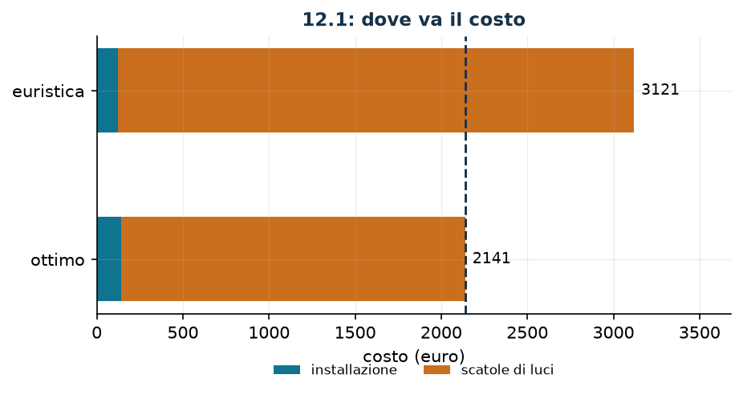

# Alberi di Natale e scatole di luci

**Classe:** MILP · **Legami:** disponibilità fra due piani, conteggio con indicatore · **Script:** `python/fam10_4_luci.py`

[](https://colab.research.google.com/github/fabiofurini/modellazione-mip/blob/main/notebooks/fam10_4_luci.ipynb)

!!! abstract "Problema 10.4"
    L'amministrazione comunale vuole decorare $q \in \mathbb{Z}_{\ge 1}$ alberi
    per le festività. Ogni albero può essere decorato secondo una delle
    $n \in \mathbb{Z}_{\ge 1}$ configurazioni possibili, ciascuna caratterizzata
    da luci di $m \in \mathbb{Z}_{\ge 1}$ colori diversi. Per ogni configurazione
    $c \in \{1, \dots, n\}$ e ogni colore $l \in \{1, \dots, m\}$, il valore
    $u_{cl} \in \mathbb{Z}_{\ge 0}$ è il numero di luci di colore $l$ richieste
    dalla configurazione $c$, e $i_c \in \mathbb{Q}_{>0}$ è il costo di
    installazione di un albero decorato secondo quella configurazione. Tutte le
    luci vanno acquistate sul mercato, dove si vendono in scatole di
    $k \in \mathbb{Z}_{\ge 1}$ tipi: per ogni tipo $b \in \{1, \dots, k\}$ e ogni
    colore $l$, il valore $v_{bl} \in \mathbb{Z}_{\ge 0}$ è il numero di luci di
    colore $l$ contenute in una scatola di tipo $b$, e
    $p_b \in \mathbb{Q}_{\ge 0}$ è il suo costo. Per garantire una varietà visiva
    gradevole si devono usare almeno $f \in \mathbb{Z}_{\ge 1}$ configurazioni
    diverse. Si vuole decorare gli alberi al costo totale minimo.

**Il problema a parole.** *Decidiamo* quanti alberi decorare con ciascuna
configurazione e quante scatole comprare di ciascun tipo. *L'obiettivo*: costo
totale (installazione più scatole) minimo. *I vincoli*: tutti gli alberi vanno
decorati; le luci comprate devono bastare a quelle richieste, colore per colore;
almeno $f$ configurazioni diverse.

## Modello

**Variabili.** $x_c \in \mathbb{Z}_{\ge 0}$ alberi decorati con la
configurazione $c$; $y_b \in \mathbb{Z}_{\ge 0}$ scatole comprate di tipo $b$;
$z_c \in \{0,1\}$ vale $1$ se la configurazione $c$ viene usata.

$$
\begin{aligned}
\min ~~ & \sum_{c=1}^{n} i_c\, x_c + \sum_{b=1}^{k} p_b\, y_b\\
\text{s.a.} \quad & \sum_{c=1}^{n} x_c = q,\\
& \sum_{b=1}^{k} v_{bl}\, y_b - \sum_{c=1}^{n} u_{cl}\, x_c \ge 0, && \forall l \in \{1, \dots, m\},\\
& \sum_{c=1}^{n} z_c \ge f,\\
& x_c - z_c \ge 0, && \forall c \in \{1, \dots, n\},\\
& x_c \in \mathbb{Z}_{\ge 0}, \quad y_b \in \mathbb{Z}_{\ge 0}, \quad z_c \in \{0,1\}.
\end{aligned}
$$

**Descrizione.** L'obiettivo somma il costo delle installazioni e quello delle
scatole. Il vincolo degli **alberi**, uno solo, dice che gli alberi decorati
sono esattamente $q$. I vincoli delle **luci**, uno per colore, dicono che le
luci comprate bastano a coprire quelle usate. Il vincolo di **varietà**, uno
solo, impone almeno $f$ configurazioni diverse. I vincoli di **configurazione
usata**, uno per configurazione, legano l'indicatore $z_c$ all'uso effettivo
della configurazione.

!!! note "Il legame fra i due piani"
    Il vincolo delle luci è una **disponibilità**: per ogni colore, le luci
    comprate devono essere almeno quelle richieste. Non c'è alcun big-M, perché
    entrambi i membri sono somme di quantità reali. Il conteggio delle scatole
    nasce da qui: se le luci di colore $l$ richieste sono $u_l$ e una scatola ne
    contiene $v_{bl}$, comprando solo scatole di tipo $b$ servirebbero
    $\lceil u_l / v_{bl} \rceil$ scatole. Il modello non scrive il tetto: lo
    ottiene imponendo $y_b$ intera.

!!! note "Il legame «configurazione usata»"
    Il vincolo si legge $z_c \le x_c$. Se $z_c = 1$ allora $x_c \ge 1$: la
    configurazione è davvero usata su almeno un albero. Il verso opposto non è
    imposto, ma non serve: l'obiettivo di minimo non ha alcun interesse ad
    alzare $z_c$, e il vincolo di varietà lo costringe a farlo esattamente $f$
    volte. Qui non serve un big-M perché $x_c$ e $z_c$ sono confrontabili
    direttamente: $x_c$ è un conteggio, non una quantità continua.

    Un errore frequente è scrivere $x_c \le M\, z_c$ pensando all'attivazione:
    sarebbe il legame nell'*altro* verso, e imporrebbe che una configurazione
    non usata abbia $x_c = 0$ — vero ma inutile, perché è già garantito da
    $\sum_c x_c = q$ e da $x_c \ge 0$.

## Il modello in gurobipy

```python
m = gp.Model("luci")
x = m.addVars(nc, vtype=GRB.INTEGER, name="x")
y = m.addVars(nb, vtype=GRB.INTEGER, name="y")
z = m.addVars(nc, vtype=GRB.BINARY, name="z")
m.setObjective(gp.quicksum(i[c] * x[c] for c in range(nc))
               + gp.quicksum(p[b] * y[b] for b in range(nb)), GRB.MINIMIZE)
m.addConstr(x.sum() == q, name="alberi")
m.addConstrs((gp.quicksum(v[b][l] * y[b] for b in range(nb))
              - gp.quicksum(u[c][l] * x[c] for c in range(nc)) >= 0
              for l in range(nl)), name="luci")
m.addConstr(z.sum() >= f, name="varieta")
m.addConstrs((x[c] - z[c] >= 0 for c in range(nc)), name="usata")
```

## L'istanza

$q = 20$ alberi, $n = 3$ configurazioni, $m = 2$ colori, $k = 2$ tipi di
scatola, $f = 2$.

| $u_{cl}$ | colore 1 | colore 2 | $i_c$ |
|---|---:|---:|---:|
| $c=1$ | 4 | 2 | 7 |
| $c=2$ | 2 | 3 | 6 |
| $c=3$ | 2 | 2 | 8 |

| $v_{bl}$ | colore 1 | colore 2 | $p_b$ |
|---|---:|---:|---:|
| $b=1$ | 10 | 2 | 100 |
| $b=2$ | 15 | 4 | 200 |

Il prezzo di una luce dipende dal colore e dal tipo di scatola: colore 1 a $10$
nella scatola 1 e a $40/3$ nella 2; colore 2 a $50$ in entrambe. Il colore 2 è
molto più caro, ed è questo a comandare la soluzione.

## Euristica costruttiva: il bound primale

Due fasi. Prima le configurazioni: $q - f + 1$ alberi con quella di
installazione più economica e un albero per ciascuna delle altre $f - 1$, così
la varietà è soddisfatta al minimo costo di installazione. Poi le scatole:
finché manca qualche luce si compra la scatola con il prezzo per luce mancante
più basso.

Sull'istanza la configurazione più economica da installare è la $2$ (costo $6$),
la seconda la $1$ (costo $7$): si decorano $19$ alberi con la $2$ e uno con la
$1$. Servono allora $42$ luci del colore 1 e $59$ del colore 2, e l'euristica
compra $30$ scatole di tipo 1. Il costo totale è
$z(\mathit{MILP}) \le \mathit{UB} = 3121$.

L'euristica sceglie la configurazione più economica da installare, la $2$, che
però è la più avida di luci del colore costoso: il conto lo pagano le scatole. È
il tipico errore di un'euristica costruttiva che guarda una sola voce di costo.

## Rilassamento LP e duale: il bound duale

Si associano $\alpha$ libera al vincolo degli alberi (è un'uguaglianza),
$\beta_l \ge 0$ ai colori, $\gamma \ge 0$ alla varietà e $\delta_c \ge 0$ al
legame.

$$
\begin{aligned}
\max ~~ & q\, \alpha + f\, \gamma\\
\text{s.a.} \quad & \alpha - \sum_{l=1}^{m} u_{cl}\, \beta_l + \delta_c \le i_c, && \forall c \in \{1, \dots, n\},\\
& \sum_{l=1}^{m} v_{bl}\, \beta_l \le p_b, && \forall b \in \{1, \dots, k\},\\
& \gamma - \delta_c \le 0, && \forall c \in \{1, \dots, n\},\\
& \alpha \gtreqless 0, \quad \beta_l \ge 0, \quad \gamma \ge 0, \quad \delta_c \ge 0.
\end{aligned}
$$

**Descrizione.** $\alpha$ è il valore di un albero decorato, $\beta_l$ il prezzo
di una luce di colore $l$, $\gamma$ il prezzo della varietà e $\delta_c$ quello
del legame fra la configurazione $c$ e il suo indicatore. L'obiettivo valuta i
$q$ alberi al prezzo $\alpha$ e la soglia $f$ al prezzo $\gamma$. Il primo
gruppo di vincoli sono le colonne delle $x_c$: usare la configurazione $c$ su un
albero vale $\alpha$, consuma $u_{cl}$ luci di ciascun colore e libera
$\delta_c$, e il saldo non può superare il costo $i_c$. Il secondo sono le
colonne delle $y_b$: una scatola di tipo $b$ mette a disposizione $v_{bl}$ luci
di ciascun colore, e il loro valore non può superare il prezzo $p_b$. Il terzo
sono le colonne delle $z_c$: il prezzo della varietà non può superare quello del
legame che la rende esigibile.

**Ricetta.** Si pongono $\gamma = 0$ e $\delta_c = 0$: la varietà non si valuta.
Restano i vincoli sulle scatole, che limitano $\beta$, e quelli sulle
configurazioni, che limitano $\alpha$. Si valuta *un solo* colore, al prezzo per
luce che nessuna scatola riesce a battere,

$$\bar\beta_l = \min_{b :\, v_{bl} > 0} \frac{p_b}{v_{bl}} ,
\qquad
\bar\alpha = \min_c \bigl( i_c + u_{cl}\, \bar\beta_l \bigr) :$$

ogni albero costa almeno l'installazione della configurazione più conveniente,
luci comprese. Sull'istanza il colore migliore è il $2$, dove entrambi i tipi di
scatola danno lo stesso prezzo per luce, $\bar\beta_2 = 50$:

$$i_1 + 2 \cdot 50 = 107, \qquad i_2 + 3 \cdot 50 = 156, \qquad i_3 + 2 \cdot 50 = 108 ,$$

dunque $\bar\alpha = 107$ e $z(\mathit{MILP}) \ge \mathit{LB} = 20 \cdot 107 = 2140$.

## Soluzione ottima

Si decorano $19$ alberi con la configurazione 1 e uno con la 3, e si comprano
$20$ scatole di tipo 1. Le luci servono $78$ del colore 1 (se ne comprano $200$:
ne avanzano molte) e $40$ del colore 2 (se ne comprano esattamente $40$).

| $LB$ (duale) | $z(\mathit{LP})$ | $z(\mathit{LP}^+)$ | $z(\mathit{MILP})$ | $UB$ (euristica) | gap |
|---:|---:|---:|---:|---:|---:|
| 2140 | 2140 | 2141 | 2141 | 3121 | $45{,}8\%$ |



Il bound duale sbaglia di **una** unità su $2141$, e il rilassamento con i bound
è esatto.

## Considerazioni aggiuntive

- Il colore 1 avanza in abbondanza: le scatole si comprano per il colore 2, e il
  colore 1 viene «in omaggio». È il motivo per cui il bound duale che valuta il
  solo colore 2 è quasi esatto.
- Il vincolo sugli alberi è un'uguaglianza: tutti gli alberi vanno decorati. Se
  fosse $\le q$ il problema diventerebbe banale ($x = 0$ e costo zero); se fosse
  $\ge q$ non cambierebbe nulla, perché decorare più alberi costa di più.
- La struttura «due piani legati da una disponibilità» si ritrova identica nei
  problemi di *cutting stock*: sotto i pezzi da tagliare, sopra le barre da
  comprare.

## Domande di modellazione aggiuntive

??? question "10.4.1 — Tutte le configurazioni"
    Si vuole che compaiano tutte e tre le configurazioni. Come cambia il
    modello? Qual è il nuovo ottimo?

    !!! tip "Soluzione"
        La soluzione è nel documento delle soluzioni, riservato ai docenti.

??? question "10.4.2 — Lotto minimo per configurazione"
    Ogni configurazione usata deve decorare almeno tre alberi (sotto quella
    soglia non vale la pena attrezzare la squadra). Come cambia il modello? Qual
    è il nuovo ottimo?

    !!! tip "Soluzione"
        La soluzione è nel documento delle soluzioni, riservato ai docenti.

## Codice

Script completo —
[`python/fam10_4_luci.py`](https://github.com/fabiofurini/modellazione-mip/blob/main/python/fam10_4_luci.py)
(riproducibile con `python3 python/fam10_4_luci.py` dalla cartella `python/`).
Notebook —
[`notebooks/fam10_4_luci.ipynb`](https://github.com/fabiofurini/modellazione-mip/blob/main/notebooks/fam10_4_luci.ipynb)
— che si apre in Colab dal badge in cima alla pagina.

<!-- script-incorporato: inizio (rigenerato da python/incorpora_codice.py) -->

??? example "Mostra lo script completo — `python/fam10_4_luci.py` (211 righe)"

    ```python
    """Problema 12.1 -- Alberi di Natale: configurazioni e scatole di luci.

    Due decisioni intere legate da un vincolo di disponibilita': quante luci servono
    (dalle configurazioni scelte) e quante se ne comprano (dalle scatole). Sopra, il
    vincolo di varieta' «almeno f configurazioni diverse», che richiede un indicatore
    per configurazione e il legame con il conteggio (tecnica 3.11).
    """
    import gurobipy as gp
    import pandas as pd
    from gurobipy import GRB

    from mip import (ammissibile, due_rilassamenti, frazione, nuovo_modello, registra_bound,
                     risolvi, valuta)
    from stile import ARANCIO, BLU, GRIGIO, TEAL, intestazione, plt, salva_dati, salva_figura

    R = range

    # ---------- 1. MODELLO E ISTANZA ----------
    intestazione("12.1 Alberi di Natale: configurazioni, luci e scatole")
    q1 = 20                          # alberi da decorare
    i1 = [7, 6, 8]                   # costo di installazione di una configurazione
    u1 = [[4, 2], [2, 3], [2, 2]]    # luci di colore l richieste dalla configurazione c
    p1 = [100, 200]                  # costo di una scatola
    v1 = [[10, 2], [15, 4]]          # luci di colore l contenute in una scatola di tipo b
    f1 = 2                           # configurazioni diverse richieste
    nc, nl, nb = len(i1), len(u1[0]), len(p1)
    salva_dati(pd.DataFrame({"configurazione": R(1, nc + 1), "costo": i1,
                             "colore_1": [u[0] for u in u1], "colore_2": [u[1] for u in u1]}),
               "luci1_configurazioni")
    salva_dati(pd.DataFrame({"scatola": R(1, nb + 1), "costo": p1,
                             "colore_1": [v[0] for v in v1], "colore_2": [v[1] for v in v1]}),
               "luci1_scatole")


    def modello_1(q, i, u, p, v, f):
        nc, nl, nb = len(i), len(u[0]), len(p)
        m = nuovo_modello("luci")
        x = m.addVars(nc, vtype=GRB.INTEGER, name="x")        # alberi con la configurazione c
        y = m.addVars(nb, vtype=GRB.INTEGER, name="y")        # scatole comprate del tipo b
        z = m.addVars(nc, vtype=GRB.BINARY, name="z")         # configurazione c usata
        m.setObjective(gp.quicksum(i[c] * x[c] for c in R(nc))
                       + gp.quicksum(p[b] * y[b] for b in R(nb)), GRB.MINIMIZE)
        m.addConstr(x.sum() == q, name="alberi")
        m.addConstrs((gp.quicksum(v[b][l] * y[b] for b in R(nb))
                      - gp.quicksum(u[c][l] * x[c] for c in R(nc)) >= 0 for l in R(nl)),
                     name="luci")
        m.addConstr(z.sum() >= f, name="varieta")
        m.addConstrs((x[c] - z[c] >= 0 for c in R(nc)), name="usata")
        return m, x, y, z


    def duale_1(q, i, u, p, v, f):
        """max q alpha + f gamma

        alpha libera (vincolo di uguaglianza sugli alberi), beta_l >= 0 (disponibilita'
        delle luci), gamma >= 0 (varieta'), delta_c >= 0 (legame x_c >= z_c). Colonne:
          x_c:  alpha - sum_l u_cl beta_l + delta_c <= i_c
          y_b:  sum_l v_bl beta_l <= p_b
          z_c:  gamma - delta_c <= 0
        """
        nc, nl, nb = len(i), len(u[0]), len(p)
        dl = nuovo_modello("duale_luci")
        alpha = dl.addVar(lb=-GRB.INFINITY, name="alpha")
        beta = dl.addVars(nl, name="beta")
        gamma = dl.addVar(name="gamma")
        delta = dl.addVars(nc, name="delta")
        dl.setObjective(q * alpha + f * gamma, GRB.MAXIMIZE)
        dl.addConstrs((alpha - gp.quicksum(u[c][l] * beta[l] for l in R(nl)) + delta[c] <= i[c]
                       for c in R(nc)), name="rcx")
        dl.addConstrs((gp.quicksum(v[b][l] * beta[l] for l in R(nl)) <= p[b] for b in R(nb)),
                      name="rcy")
        dl.addConstrs((gamma - delta[c] <= 0 for c in R(nc)), name="rcz")
        return dl


    m1, x1, y1, z1 = modello_1(q1, i1, u1, p1, v1, f1)
    print("  Prezzo di una luce, colore per colore, in ciascun tipo di scatola:")
    for b in R(nb):
        print(f"    scatola {b + 1}: " + ", ".join(
            f"colore {l + 1} a {frazione(p1[b] / v1[b][l])}" for l in R(nl) if v1[b][l] > 0))

    # ---------- 2. EURISTICA COSTRUTTIVA (UPPER BOUND) ----------
    # Due fasi. Prima le configurazioni: q - f + 1 alberi con quella di installazione
    # piu' economica e un albero per ciascuna delle altre f - 1, cosi' la varieta' e'
    # soddisfatta al minimo costo di installazione. Poi le scatole: finche' manca
    # qualche luce si compra la scatola col prezzo per luce mancante piu' basso.
    def euristica(q, i, u, p, v, f):
        nc, nl, nb = len(i), len(u[0]), len(p)
        ordine = sorted(R(nc), key=lambda c: (i[c], c))
        x = [0] * nc
        for c in ordine[1:f]:
            x[c] = 1
        x[ordine[0]] = q - (f - 1)
        altre = ", ".join(str(c + 1) for c in ordine[1:f])
        passi = [f"configurazioni: {x[ordine[0]]} alberi con la {ordine[0] + 1} "
                 f"(installazione {i[ordine[0]]} a testa) e un albero con la configurazione "
                 f"{altre}, la seconda piu' economica da installare"]
        serve = [sum(u[c][l] * x[c] for c in R(nc)) for l in R(nl)]
        passi.append("luci necessarie: " + ", ".join(f"colore {l + 1} -> {serve[l]}" for l in R(nl)))
        y = [0] * nb
        while True:
            manca = [max(0, serve[l] - sum(v[b][l] * y[b] for b in R(nb))) for l in R(nl)]
            if max(manca) == 0:
                break
            # prezzo per luce ancora mancante: si contano solo le luci utili
            b = min(R(nb), key=lambda b: (p[b] / max(1e-9, sum(min(v[b][l], manca[l])
                                                               for l in R(nl))), b))
            y[b] += 1
            passi.append(f"mancano {manca}: si compra una scatola {b + 1} (costo {p[b]}); "
                         f"scatole {y}")
        return x, y, passi


    x_eur, y_eur, passi = euristica(q1, i1, u1, p1, v1, f1)
    for k, riga in enumerate(passi[:4], 1):
        print(f"  Passo {k}. {riga}")
    print(f"  ... ({len(passi) - 4} acquisti successivi dello stesso tipo)")
    print(f"  Passo {len(passi)}. {passi[-1]}")
    ub1 = sum(i1[c] * x_eur[c] for c in R(nc)) + sum(p1[b] * y_eur[b] for b in R(nb))
    sol_eur = ({f"x[{c}]": x_eur[c] for c in R(nc)} | {f"y[{b}]": y_eur[b] for b in R(nb)}
               | {f"z[{c}]": 1 if x_eur[c] > 0 else 0 for c in R(nc)})
    assert ammissibile(m1, sol_eur), sol_eur
    print(f"  Soluzione euristica: alberi {x_eur}, scatole {y_eur}   ub = {frazione(ub1)}")
    print("  L'euristica sceglie la configurazione con l'installazione piu' economica, la 2, che")
    print("  pero' e' la piu' avida di luci del colore costoso: il conto lo pagano le scatole.")
    print("  E' il tipico errore di un'euristica costruttiva che guarda una sola voce di costo.")

    # ---------- 3. RILASSAMENTO LP E DUALE (LOWER BOUND) ----------
    dl1 = duale_1(q1, i1, u1, p1, v1, f1)
    # ricetta: gamma = delta = 0; si valuta un solo colore, al prezzo per luce piu'
    # basso che nessuna scatola riesce a battere; poi ogni albero costa almeno
    # alpha = min_c (i_c + prezzo delle sue luci)
    migliore, mano, scelto = float("-inf"), None, None
    for l in R(nl):
        prezzo = min(p1[b] / v1[b][l] for b in R(nb) if v1[b][l] > 0)
        prova = {f"beta[{l}]": prezzo}
        prova["alpha"] = min(i1[c] + u1[c][l] * prezzo for c in R(nc))
        val, viol = valuta(dl1, prova)
        if viol <= 1e-9 and val > migliore:
            migliore, mano, scelto = val, prova, l
    lb1, viol = valuta(dl1, mano)
    assert viol <= 1e-9, viol
    prezzo = mano[f"beta[{scelto}]"]
    print(f"  Duale a mano: gamma = delta = 0 e un solo colore valutato. Sul colore {scelto + 1}")
    print(f"  entrambi i tipi di scatola danno lo stesso prezzo per luce, {frazione(prezzo)}:")
    print(f"  e' il piu' alto valore di beta compatibile con sum_l v_bl beta_l <= p_b.")
    print("  Allora ogni albero costa almeno alpha = min_c (i_c + u_c" + str(scelto + 1)
          + " * beta) = " + ", ".join(f"{i1[c]} + {u1[c][scelto]} * {frazione(prezzo)} = "
                                      f"{frazione(i1[c] + u1[c][scelto] * prezzo)}"
                                      for c in R(nc)))
    print(f"  alpha = {frazione(mano['alpha'])}  ->  lb = {q1} * alpha = {frazione(lb1)}")
    zlp1, zlp1r, _ = due_rilassamenti(m1, dl1)

    # ---------- 4. OTTIMO DEL MILP ----------
    z1v = risolvi(m1)
    print("  Soluzione ottima: "
          + ", ".join(f"{int(x1[c].X)} alberi con la configurazione {c + 1}" for c in R(nc)
                      if x1[c].X > 0.5)
          + "; scatole "
          + ", ".join(f"{int(y1[b].X)} di tipo {b + 1}" for b in R(nb) if y1[b].X > 0.5))
    for l in R(nl):
        serve = sum(u1[c][l] * x1[c].X for c in R(nc))
        compra = sum(v1[b][l] * y1[b].X for b in R(nb))
        print(f"    colore {l + 1}: servono {int(serve)} luci, se ne comprano {int(compra)}")
    riga = registra_bound("1 luci", ub1, lb1, zlp1, zlp1r, z1v)
    salva_dati(pd.DataFrame([riga]), "luci1_bound")
    assert lb1 <= zlp1 <= z1v <= ub1 + 1e-9

    # ---------- 5. DOMANDE DI MODELLAZIONE AGGIUNTIVE ----------
    varianti = {}


    def variante(nome, m):
        z = risolvi(m)
        print(f"  {nome:70s} z = {frazione(z)}")
        return z


    # 1a: si vogliono tutte e tre le configurazioni
    m, x, y, z = modello_1(q1, i1, u1, p1, v1, 3)
    varianti["1a"] = variante("1a. Devono comparire tutte e tre le configurazioni (f = 3)", m)
    # 1b: ogni configurazione usata deve decorare almeno tre alberi (lotto minimo)
    m, x, y, z = modello_1(q1, i1, u1, p1, v1, f1)
    m.addConstrs((x[c] - 3 * z[c] >= 0 for c in R(nc)), name="lotto_minimo")
    varianti["1b"] = variante("1b. Ogni configurazione usata decora almeno tre alberi", m)
    salva_dati(pd.DataFrame({"variante": list(varianti), "z": list(varianti.values())}),
               "luci1_varianti")

    # ---------- 6. FIGURA ----------
    fig, ax = plt.subplots(figsize=(6.8, 3.0))
    etichette = ["euristica", "ottimo"]
    inst = [sum(i1[c] * x_eur[c] for c in R(nc)),
            sum(i1[c] * x1[c].X for c in R(nc))]
    scat = [sum(p1[b] * y_eur[b] for b in R(nb)),
            sum(p1[b] * y1[b].X for b in R(nb))]
    ax.barh(R(2), inst, 0.5, color=TEAL, label="installazione")
    ax.barh(R(2), scat, 0.5, left=inst, color=ARANCIO, label="scatole di luci")
    for k in R(2):
        ax.annotate(f"{frazione(inst[k] + scat[k])}", (inst[k] + scat[k] + 40, k), va="center",
                    fontsize=9)
    ax.axvline(lb1, color=BLU, ls="--", lw=1.4)
    ax.annotate(f"bound duale {frazione(lb1)}", (lb1, 1.55), ha="center", fontsize=8, color=BLU)
    ax.set_yticks(R(2))
    ax.set_yticklabels(etichette)
    ax.set_xlim(0, max(inst[k] + scat[k] for k in R(2)) * 1.18)
    ax.set_xlabel("costo (euro)")
    ax.set_title("12.1: dove va il costo")
    ax.legend(fontsize=8, loc="lower right")
    ax.invert_yaxis()
    salva_figura(fig, "cap10_luci_ottimo")
    print("Fine.")
    ```

<!-- script-incorporato: fine -->
