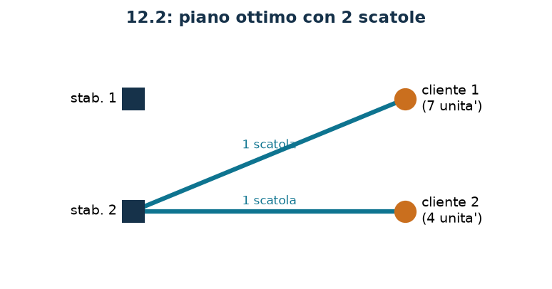

# Spedizioni in scatole

**Classe:** MILP · **Legami:** capacità con arrotondamento per eccesso · **Script:** `python/fam10_5_spedizioni.py`

[](https://colab.research.google.com/github/fabiofurini/modellazione-mip/blob/main/notebooks/fam10_5_spedizioni.ipynb)

!!! abstract "Problema 10.5"
    Un'azienda deve organizzare le spedizioni dai suoi $n \in \mathbb{Z}_{\ge 1}$
    stabilimenti ai suoi $m \in \mathbb{Z}_{\ge 1}$ clienti. L'azienda produce
    $k \in \mathbb{Z}_{\ge 1}$ tipi di prodotto. I prodotti si spediscono in
    scatole: ogni scatola viaggia direttamente da uno stabilimento a un cliente e
    ha capacità massima $w \in \mathbb{Z}_{\ge 1}$, espressa come numero massimo
    di unità di prodotto trasportabili. Per ogni prodotto $p$ e ogni cliente $c$,
    il valore $d_{pc} \in \mathbb{Z}_{\ge 0}$ è il numero di unità ordinate. Per
    ogni prodotto $p$ e ogni stabilimento $s$, il valore
    $a_{ps} \in \mathbb{Z}_{\ge 0}$ è il numero di unità disponibili. L'azienda
    vuole un piano di spedizione che minimizzi il numero totale di scatole usate.

**Il problema a parole.** *Decidiamo* quante unità di ciascun prodotto spedire
da ciascuno stabilimento a ciascun cliente, e quante scatole servono su ciascuna
tratta. *L'obiettivo*: numero minimo di scatole. *I vincoli*: ogni ordine
soddisfatto esattamente, nessuno stabilimento oltre le proprie scorte, e su ogni
tratta abbastanza scatole per le unità spedite.

## Modello

Per brevità $P = \{1, \dots, k\}$ è l'insieme dei prodotti, $S = \{1, \dots, n\}$
quello degli stabilimenti e $C = \{1, \dots, m\}$ quello dei clienti.

**Variabili.** $x_{psc} \in \mathbb{Z}_{\ge 0}$ unità del prodotto $p$ spedite
da $s$ a $c$; $y_{sc} \in \mathbb{Z}_{\ge 0}$ scatole spedite da $s$ a $c$.

$$
\begin{aligned}
\min ~~ & \sum_{s=1}^{n} \sum_{c=1}^{m} y_{sc}\\
\text{s.a.} \quad & \sum_{s=1}^{n} x_{psc} = d_{pc}, && \forall p \in P,\ \forall c \in C,\\
& \sum_{c=1}^{m} x_{psc} \le a_{ps}, && \forall p \in P,\ \forall s \in S,\\
& -\sum_{p=1}^{k} x_{psc} + w\, y_{sc} \ge 0, && \forall s \in S,\ \forall c \in C,\\
& x_{psc} \in \mathbb{Z}_{\ge 0}, \quad y_{sc} \in \mathbb{Z}_{\ge 0}.
\end{aligned}
$$

**Descrizione.** L'obiettivo conta le scatole usate su tutte le tratte. I
vincoli di **domanda**, uno per coppia prodotto–cliente, dicono che ogni ordine
è soddisfatto esattamente. I vincoli di **disponibilità**, uno per coppia
prodotto–stabilimento, non lasciano spedire più di quanto lo stabilimento abbia.
I vincoli di **capacità**, uno per tratta, dicono che le scatole spedite da $s$
a $c$ bastano a contenere le unità caricate.

!!! note "Il legame è un arrotondamento per eccesso"
    Il vincolo di capacità si legge

    $$\sum_{p=1}^{k} x_{psc} \;\le\; w\, y_{sc}
    \qquad\Longleftrightarrow\qquad
    y_{sc} \;\ge\; \frac{\sum_{p} x_{psc}}{w} ,$$

    e poiché $y_{sc}$ è intera e non negativa questo equivale a

    $$y_{sc} \;\ge\; \Bigl\lceil \frac{\sum_{p} x_{psc}}{w} \Bigr\rceil .$$

    Il tetto non compare mai nel modello: lo produce l'interezza. Lo stesso
    vincolo impone anche l'implicazione

    $$\sum_{p=1}^{k} x_{psc} > 0 \;\Longrightarrow\; y_{sc} \ge 1 ,$$

    cioè: se da uno stabilimento parte anche una sola unità verso un cliente,
    allora almeno una scatola deve viaggiare su quella tratta. La contronominale
    è più leggibile: se $y_{sc} = 0$ allora $\sum_p x_{psc} = 0$. Il verso
    opposto — se non si spedisce niente allora nessuna scatola — non è imposto
    dal vincolo ma segue dall'ottimalità, perché ogni scatola costa $1$.

## Il modello in gurobipy

```python
m = gp.Model("spedizioni")
x = m.addVars(nk, nn, nm, vtype=GRB.INTEGER, name="x")
y = m.addVars(nn, nm, vtype=GRB.INTEGER, name="y")
m.setObjective(y.sum(), GRB.MINIMIZE)
m.addConstrs((x.sum(p, "*", c) == d[p][c] for p in range(nk) for c in range(nm)),
             name="domanda")
m.addConstrs((x.sum(p, s, "*") <= a[p][s] for p in range(nk) for s in range(nn)),
             name="disponibilita")
m.addConstrs((w * y[s, c] - x.sum("*", s, c) >= 0 for s in range(nn) for c in range(nm)),
             name="capacita")
```

## L'istanza

$n = 2$ stabilimenti, $m = 2$ clienti, $k = 2$ prodotti, $w = 10$.

| $d_{pc}$ | $c=1$ | $c=2$ |
|---|---:|---:|
| $p=1$ | 5 | 0 |
| $p=2$ | 2 | 4 |

| $a_{ps}$ | $s=1$ | $s=2$ |
|---|---:|---:|
| $p=1$ | 8 | 6 |
| $p=2$ | 5 | 7 |

Le unità da spedire sono $5 + 0 + 2 + 4 = 11$ in tutto.

## Euristica costruttiva: il bound primale

Cliente per cliente: si cerca di servirlo da un solo stabilimento, quello che ha
tutto quello che serve; se nessuno basta si spezza l'ordine fra più
stabilimenti. Alla fine si conta $\lceil \cdot / w \rceil$ scatole per tratta.

Sull'istanza il cliente 1 chiede $5$ unità del prodotto 1 e $2$ del 2: lo
stabilimento 1 ha $8$ e $5$, quindi basta da solo. Il cliente 2 chiede $4$ unità
del prodotto 2: dopo la prima spedizione allo stabilimento 1 ne restano $3$,
allo stabilimento 2 ce ne sono $7$, quindi si spedisce da lì. Le tratte sono
due, con $7$ e $4$ unità: una scatola ciascuna.

$$z(\mathit{MILP}) \le \mathit{UB} = 2 .$$

## Rilassamento LP e duale: il bound duale

Si associano $\alpha_{pc}$ libera alla domanda, $\beta_{ps} \le 0$ alla
disponibilità e $\gamma_{sc} \ge 0$ alla capacità.

$$
\begin{aligned}
\max ~~ & \sum_{p=1}^{k}\sum_{c=1}^{m} d_{pc}\, \alpha_{pc} + \sum_{p=1}^{k}\sum_{s=1}^{n} a_{ps}\, \beta_{ps}\\
\text{s.a.} \quad & \alpha_{pc} + \beta_{ps} - \gamma_{sc} \le 0, && \forall p \in P,\ \forall s \in S,\ \forall c \in C,\\
& w\, \gamma_{sc} \le 1, && \forall s \in S,\ \forall c \in C,\\
& \alpha_{pc} \gtreqless 0, \quad \beta_{ps} \le 0, \quad \gamma_{sc} \ge 0.
\end{aligned}
$$

**Descrizione.** $\alpha_{pc}$ è il valore di una unità del prodotto $p$
consegnata al cliente $c$, $\beta_{ps}$ il prezzo (non positivo) della
disponibilità e $\gamma_{sc}$ il prezzo di una unità di spazio sulla tratta da
$s$ a $c$. L'obiettivo valuta a quei prezzi gli ordini e le disponibilità. Il
primo gruppo di vincoli sono le colonne delle $x_{psc}$: spedire una unità vale
$\alpha_{pc} + \beta_{ps}$ e occupa una unità di spazio al prezzo $\gamma_{sc}$;
il saldo non può essere positivo, perché quelle variabili non compaiono
nell'obiettivo. Il secondo sono le colonne delle $y_{sc}$: una scatola offre $w$
unità di spazio, e il loro valore non può superare $1$.

**Ricetta.** Il vincolo sulle scatole limita $\gamma_{sc} \le 1/w$: si prende il
massimo, $\bar\gamma_{sc} = 1/w$. Con $\bar\beta = 0$ resta
$\alpha_{pc} \le 1/w$: si prende $\bar\alpha_{pc} = 1/w$. Il valore è

$$\mathit{LB} = \frac{1}{w} \sum_{p}\sum_{c} d_{pc} = \frac{11}{10} .$$

Ogni unità ordinata occupa $1/w$ di scatola: è il bound «volumetrico», e
coincide con $z(\mathit{LP})$.

## Un bound intero più forte

Il bound volumetrico ignora che una scatola non si divide fra due clienti. Ogni
cliente $c$ con almeno un'unità ordinata riceve almeno
$\lceil \sum_p d_{pc} / w \rceil$ scatole, e queste scatole sono diverse da
quelle degli altri clienti.

| Cliente | unità ordinate | scatole minime |
|---|---:|---:|
| 1 | 7 | 1 |
| 2 | 4 | 1 |
| **totale** | **11** | **2** |

$$z(\mathit{MILP}) \ge \mathit{LB} = 2 ,$$

quasi il doppio del bound volumetrico $11/10$.

## Soluzione ottima

Lo stabilimento 2 serve entrambi i clienti: al cliente 1 con una scatola
contenente $5$ unità del prodotto 1 e $2$ del 2, al cliente 2 con una scatola
contenente $4$ unità del prodotto 2.

| $LB$ (combinatorio) | $z(\mathit{LP})$ | $z(\mathit{LP}^+)$ | $z(\mathit{MILP})$ | $UB$ (euristica) | gap |
|---:|---:|---:|---:|---:|---:|
| 2 | $11/10$ | $11/10$ | 2 | 2 | $0\%$ |



Il gap dell'euristica è nullo, e il bound intero certifica l'ottimalità. La
differenza $2 - 11/10 = 9/10$ è tutta dovuta all'interezza: il $45\%$ del valore
ottimo.

## Considerazioni aggiuntive

- Il modello è un flusso multiprodotto con costi solo sui contenitori. Se i
  costi fossero sul flusso (per unità trasportata) e non ci fossero scatole, il
  problema sarebbe un trasporto puro, risolvibile in tempo polinomiale e con
  rilassamento intero.
- Le variabili $x_{psc}$ potrebbero essere continue senza cambiare l'ottimo,
  perché i dati sono interi e la matrice del trasporto è totalmente unimodulare
  *a $y$ fissato*. Restano intere perché il problema parla di unità di prodotto.
- Il vincolo di capacità usa la stessa capacità $w$ su ogni tratta. Con scatole
  di dimensione diversa servirebbero più famiglie $y^{(t)}_{sc}$, una per tipo,
  come nel [problema 10.4](misti-4.md).

## Domande di modellazione aggiuntive

??? question "10.5.1 — Scatole più piccole"
    Le scatole contengono $4$ unità invece di $10$. Qual è il nuovo ottimo?

    !!! tip "Soluzione"
        La soluzione è nel documento delle soluzioni, riservato ai docenti.

??? question "10.5.2 — Prodotti separati"
    Prodotti diversi non possono viaggiare nella stessa scatola. Come cambia il
    modello? Qual è il nuovo ottimo?

    !!! tip "Soluzione"
        La soluzione è nel documento delle soluzioni, riservato ai docenti.

## Codice

Script completo —
[`python/fam10_5_spedizioni.py`](https://github.com/fabiofurini/modellazione-mip/blob/main/python/fam10_5_spedizioni.py)
(riproducibile con `python3 python/fam10_5_spedizioni.py` dalla cartella
`python/`). Notebook —
[`notebooks/fam10_5_spedizioni.ipynb`](https://github.com/fabiofurini/modellazione-mip/blob/main/notebooks/fam10_5_spedizioni.ipynb)
— che si apre in Colab dal badge in cima alla pagina.

<!-- script-incorporato: inizio (rigenerato da python/incorpora_codice.py) -->

??? example "Mostra lo script completo — `python/fam10_5_spedizioni.py` (217 righe)"

    ```python
    """Problema 12.2 -- Spedizioni in scatole: flusso multiprodotto e conteggio dei
    contenitori.

    Le quantita' spedite sono un flusso a piu' prodotti fra stabilimenti e clienti;
    sopra ci sono le scatole, che sono un conteggio intero legato al flusso dalla
    capacita' (tecnica 3.4: y >= ceil(somma / w)). Il rilassamento lineare vede solo
    il rapporto fra unita' e capacita' e perde completamente il fatto che una scatola
    non si divide fra due clienti.
    """
    import gurobipy as gp
    import pandas as pd
    from gurobipy import GRB

    from mip import (ammissibile, due_rilassamenti, frazione, nuovo_modello, registra_bound,
                     risolvi, valuta)
    from stile import ARANCIO, BLU, GRIGIO, TEAL, intestazione, plt, salva_dati, salva_figura

    R = range


    def scatole(n):
        """"1 scatola" oppure "3 scatole"."""
        return f"{int(n)} scatola" if int(n) == 1 else f"{int(n)} scatole"

    # ---------- 1. MODELLO E ISTANZA ----------
    intestazione("12.2 Spedizioni in scatole: minimizzare il numero di scatole")
    d2 = [[5, 0],       # unita' del prodotto p ordinate dal cliente c
          [2, 4]]
    a2 = [[8, 6],       # unita' del prodotto p disponibili nello stabilimento s
          [5, 7]]
    w2 = 10             # capacita' di una scatola, in unita' di prodotto
    nk, nm, nn = len(d2), len(d2[0]), len(a2[0])   # prodotti, clienti, stabilimenti
    D2 = sum(d2[p][c] for p in R(nk) for c in R(nm))
    salva_dati(pd.DataFrame([{"prodotto": p + 1, "cliente": c + 1, "domanda": d2[p][c]}
                             for p in R(nk) for c in R(nm)]), "spedizioni2_domanda")
    salva_dati(pd.DataFrame([{"prodotto": p + 1, "stabilimento": s + 1, "disponibilita": a2[p][s]}
                             for p in R(nk) for s in R(nn)]), "spedizioni2_disponibilita")
    print(f"  Unita' da spedire in tutto: {D2}; capacita' di una scatola: {w2}.")


    def modello_2(d, a, w):
        nk, nm, nn = len(d), len(d[0]), len(a[0])
        m = nuovo_modello("spedizioni")
        x = m.addVars(nk, nn, nm, vtype=GRB.INTEGER, name="x")   # unita' p da s a c
        y = m.addVars(nn, nm, vtype=GRB.INTEGER, name="y")       # scatole da s a c
        m.setObjective(y.sum(), GRB.MINIMIZE)
        m.addConstrs((x.sum(p, "*", c) == d[p][c] for p in R(nk) for c in R(nm)), name="domanda")
        m.addConstrs((x.sum(p, s, "*") <= a[p][s] for p in R(nk) for s in R(nn)),
                     name="disponibilita")
        m.addConstrs((w * y[s, c] - x.sum("*", s, c) >= 0 for s in R(nn) for c in R(nm)),
                     name="capacita")
        return m, x, y


    def duale_2(d, a, w):
        """max sum_pc d_pc alpha_pc + sum_ps a_ps beta_ps

        alpha libera (domanda con =), beta <= 0 (disponibilita' con <=), gamma >= 0
        (legame con le scatole). Colonne:
          x_psc:  alpha_pc + beta_ps - gamma_sc <= 0
          y_sc:   w gamma_sc <= 1
        """
        nk, nm, nn = len(d), len(d[0]), len(a[0])
        dl = nuovo_modello("duale_spedizioni")
        alpha = dl.addVars(nk, nm, lb=-GRB.INFINITY, name="alpha")
        beta = dl.addVars(nk, nn, lb=-GRB.INFINITY, ub=0.0, name="beta")
        gamma = dl.addVars(nn, nm, name="gamma")
        dl.setObjective(gp.quicksum(d[p][c] * alpha[p, c] for p in R(nk) for c in R(nm))
                        + gp.quicksum(a[p][s] * beta[p, s] for p in R(nk) for s in R(nn)),
                        GRB.MAXIMIZE)
        dl.addConstrs((alpha[p, c] + beta[p, s] - gamma[s, c] <= 0
                       for p in R(nk) for s in R(nn) for c in R(nm)), name="rcx")
        dl.addConstrs((w * gamma[s, c] <= 1 for s in R(nn) for c in R(nm)), name="rcy")
        return dl


    m2, x2, y2 = modello_2(d2, a2, w2)

    # ---------- 2. EURISTICA COSTRUTTIVA (UPPER BOUND) ----------
    # cliente per cliente: si cerca di servirlo da un solo stabilimento, quello che
    # ha tutto quello che serve; se nessuno basta si spezza l'ordine.
    def euristica(d, a, w):
        nk, nm, nn = len(d), len(d[0]), len(a[0])
        res = [[a[p][s] for s in R(nn)] for p in R(nk)]
        x = {(p, s, c): 0 for p in R(nk) for s in R(nn) for c in R(nm)}
        passi = []
        for c in R(nm):
            completi = [s for s in R(nn) if all(res[p][s] >= d[p][c] for p in R(nk))]
            if completi:
                s = completi[0]
                for p in R(nk):
                    x[p, s, c] = d[p][c]
                    res[p][s] -= d[p][c]
                passi.append(f"cliente {c + 1}: lo stabilimento {s + 1} ha tutto l'ordine, si "
                             f"spedisce da li'")
            else:
                for p in R(nk):
                    manca = d[p][c]
                    for s in R(nn):
                        preso = min(manca, res[p][s])
                        x[p, s, c] += preso
                        res[p][s] -= preso
                        manca -= preso
                    assert manca == 0, "ordine non soddisfacibile"
                passi.append(f"cliente {c + 1}: nessuno stabilimento basta da solo, l'ordine si "
                             f"spezza")
        y = {(s, c): -(-sum(x[p, s, c] for p in R(nk)) // w) for s in R(nn) for c in R(nm)}
        for s in R(nn):
            for c in R(nm):
                if y[s, c]:
                    passi.append(f"stabilimento {s + 1} -> cliente {c + 1}: "
                                 f"{sum(x[p, s, c] for p in R(nk))} unita' -> "
                                 f"{scatole(y[s, c])}")
        return x, y, passi


    x_eur, y_eur, passi = euristica(d2, a2, w2)
    for k, riga in enumerate(passi, 1):
        print(f"  Passo {k}. {riga}")
    ub2 = sum(y_eur.values())
    sol_eur = ({f"x[{p},{s},{c}]": x_eur[p, s, c] for p in R(nk) for s in R(nn) for c in R(nm)}
               | {f"y[{s},{c}]": y_eur[s, c] for s in R(nn) for c in R(nm)})
    assert ammissibile(m2, sol_eur), sol_eur
    print(f"  Scatole usate dall'euristica: {ub2}  ->  ub = {frazione(ub2)}")

    # ---------- 3. RILASSAMENTO LP E DUALE (LOWER BOUND) ----------
    dl2 = duale_2(d2, a2, w2)
    # ricetta: beta = 0, gamma_sc = 1/w (il massimo consentito da w gamma <= 1) e
    # alpha_pc = 1/w: ogni unita' ordinata occupa 1/w di scatola
    mano = ({f"gamma[{s},{c}]": 1 / w2 for s in R(nn) for c in R(nm)}
            | {f"alpha[{p},{c}]": 1 / w2 for p in R(nk) for c in R(nm)})
    lb_lp, viol = valuta(dl2, mano)
    assert viol <= 1e-9, viol
    print(f"  Duale a mano: beta = 0, gamma_sc = alpha_pc = 1/{w2}. I vincoli duali diventano")
    print(f"  1/{w2} + 0 - 1/{w2} = 0 <= 0 e {w2} * 1/{w2} = 1 <= 1: tutto verificato.")
    print(f"  lb = (unita' ordinate) / {w2} = {D2} / {w2} = {frazione(lb_lp)}")
    zlp2, zlp2r, _ = due_rilassamenti(m2, dl2)

    # ---------- 4. UN BOUND INTERO PIU' FORTE ----------
    intestazione("12.2 Il conteggio delle scatole per cliente")
    clienti_attivi = [c for c in R(nm) if any(d2[p][c] > 0 for p in R(nk))]
    lb2 = float(len(clienti_attivi))
    print(f"  Ogni cliente con almeno un'unita' ordinata riceve almeno una scatola, e le scatole")
    print(f"  non si dividono fra clienti diversi. I clienti con ordini sono {len(clienti_attivi)}:")
    print(f"  lb = {frazione(lb2)}, contro {frazione(lb_lp)} del rilassamento lineare.")
    print(f"  Piu' precisamente ogni cliente c riceve almeno ceil(sum_p d_pc / {w2}) scatole:")
    per_cliente = [-(-sum(d2[p][c] for p in R(nk)) // w2) for c in R(nm)]
    for c in R(nm):
        print(f"    cliente {c + 1}: {sum(d2[p][c] for p in R(nk))} unita' -> almeno "
              f"{scatole(per_cliente[c])}")
    lb2 = float(sum(per_cliente))
    print(f"  Sommando: lb = {frazione(lb2)}.")
    salva_dati(pd.DataFrame([{"argomento": "duale del rilassamento LP", "bound": lb_lp},
                             {"argomento": "scatole per cliente", "bound": lb2}]),
               "spedizioni2_argomento")

    # ---------- 5. OTTIMO DEL MILP ----------
    z2 = risolvi(m2)
    for s in R(nn):
        for c in R(nm):
            if y2[s, c].X > 0.5:
                carico = ", ".join(f"{int(x2[p, s, c].X)} del prodotto {p + 1}" for p in R(nk)
                                   if x2[p, s, c].X > 0.5)
                print(f"  Stabilimento {s + 1} -> cliente {c + 1}: "
                      f"{scatole(y2[s, c].X)} con {carico}")
    riga = registra_bound("2 spedizioni", ub2, lb2, zlp2, zlp2r, z2)
    salva_dati(pd.DataFrame([riga]), "spedizioni2_bound")
    assert lb2 <= z2 <= ub2 + 1e-9

    # ---------- 6. DOMANDE DI MODELLAZIONE AGGIUNTIVE ----------
    varianti = {}


    def variante(nome, m):
        z = risolvi(m)
        print(f"  {nome:70s} z = {frazione(z)}")
        return z


    # 2a: scatole piu' piccole
    m, x, y = modello_2(d2, a2, 4)
    varianti["2a"] = variante("2a. Le scatole contengono 4 unita' invece di 10", m)
    # 2b: prodotti diversi non possono viaggiare nella stessa scatola
    m = nuovo_modello("spedizioni_separate")
    x = m.addVars(nk, nn, nm, vtype=GRB.INTEGER, name="x")
    y = m.addVars(nk, nn, nm, vtype=GRB.INTEGER, name="y")
    m.setObjective(y.sum(), GRB.MINIMIZE)
    m.addConstrs((x.sum(p, "*", c) == d2[p][c] for p in R(nk) for c in R(nm)), name="domanda")
    m.addConstrs((x.sum(p, s, "*") <= a2[p][s] for p in R(nk) for s in R(nn)), name="disponibilita")
    m.addConstrs((w2 * y[p, s, c] - x[p, s, c] >= 0 for p in R(nk) for s in R(nn) for c in R(nm)),
                 name="capacita")
    varianti["2b"] = variante("2b. Prodotti diversi non possono viaggiare nella stessa scatola", m)
    salva_dati(pd.DataFrame({"variante": list(varianti), "z": list(varianti.values())}),
               "spedizioni2_varianti")

    # ---------- 7. FIGURA ----------
    fig, ax = plt.subplots(figsize=(6.4, 3.0))
    for s in R(nn):
        for c in R(nm):
            n = int(y2[s, c].X)
            if n:
                ax.plot([0, 1], [nn - 1 - s, nm - 1 - c], color=TEAL, lw=1 + 2 * n)
                ax.annotate(scatole(n), (0.5, (nn - 1 - s + nm - 1 - c) / 2 + 0.06),
                            ha="center", fontsize=8, color=TEAL)
    for s in R(nn):
        ax.plot(0, nn - 1 - s, marker="s", color=BLU, ms=14)
        ax.annotate(f"stab. {s + 1}", (-0.06, nn - 1 - s), ha="right", va="center", fontsize=9)
    for c in R(nm):
        ax.plot(1, nm - 1 - c, marker="o", color=ARANCIO, ms=14)
        ax.annotate(f"cliente {c + 1}\n({sum(d2[p][c] for p in R(nk))} unita')",
                    (1.06, nm - 1 - c), ha="left", va="center", fontsize=9)
    ax.set_xlim(-0.45, 1.5)
    ax.set_ylim(-0.6, max(nn, nm) - 0.4)
    ax.axis("off")
    ax.set_title(f"12.2: piano ottimo con {frazione(z2)} scatole")
    salva_figura(fig, "cap10_spedizioni_ottimo")
    print("Fine.")
    ```

<!-- script-incorporato: fine -->
