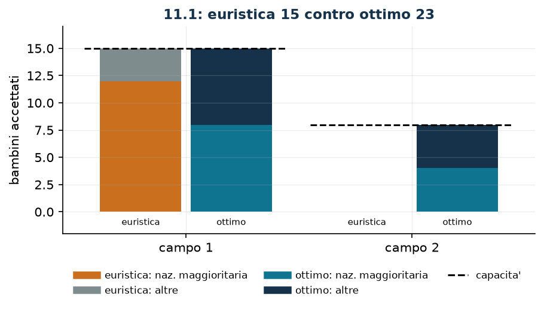

# Bambini fra campi estivi

**Classe:** ILP · **Legami:** conteggi interi, vincoli di composizione · **Script:** `python/fam10_6_campi.py`

[](https://colab.research.google.com/github/fabiofurini/modellazione-mip/blob/main/notebooks/fam10_6_campi.ipynb)

!!! abstract "Problema 10.6"
    Un'azienda gestisce $r \in \mathbb{Z}_{\ge 1}$ campi estivi per ospitare
    bambini durante le vacanze. Per ogni campo $j \in \{1, \dots, r\}$, il valore
    $d_j \in \mathbb{Z}_{\ge 1}$ è il numero massimo di bambini ospitabili.
    L'azienda ha ricevuto richieste da bambini di $s \in \mathbb{Z}_{\ge 1}$
    nazionalità diverse: per ogni nazionalità $i \in \{1, \dots, s\}$ ci sono
    $f_i \in \mathbb{Z}_{\ge 0}$ bambine e $g_i \in \mathbb{Z}_{\ge 0}$ bambini.
    In ogni campo il numero di bambine deve essere maggiore o uguale a quello dei
    bambini, e il numero di bambini della nazionalità $c \in \{1, \dots, s\}$
    deve essere maggiore o uguale a quello di ogni altra nazionalità. L'azienda
    vuole massimizzare il numero totale di bambini accettati.

**Il problema a parole.** *Decidiamo* quanti bambini di ciascuna nazionalità e
di ciascun sesso mandare in ciascun campo. *L'obiettivo*: massimo numero di
bambini accettati. *I vincoli*: non si superano né le disponibilità né le
capacità; e in ogni campo valgono le due regole di composizione.

## Modello

**Variabili.** Non sono binarie ma **conteggi**: $2\,r\,s$ variabili intere non
negative. $x_{ij}$ sono le bambine della nazionalità $i$ nel campo $j$, $y_{ij}$
i bambini.

$$
\begin{aligned}
\max ~~ & \sum_{i=1}^{s} \sum_{j=1}^{r} \bigl(x_{ij} + y_{ij}\bigr)\\
\text{s.a.} \quad & \sum_{j=1}^{r} x_{ij} \le f_i, && \forall i \in \{1, \dots, s\},\\
& \sum_{j=1}^{r} y_{ij} \le g_i, && \forall i \in \{1, \dots, s\},\\
& \sum_{i=1}^{s} \bigl(x_{ij} + y_{ij}\bigr) \le d_j, && \forall j \in \{1, \dots, r\},\\
& \sum_{i=1}^{s} \bigl(x_{ij} - y_{ij}\bigr) \ge 0, && \forall j \in \{1, \dots, r\},\\
& x_{cj} + y_{cj} - \sum_{i \ne c} \bigl(x_{ij} + y_{ij}\bigr) \ge 0, && \forall j \in \{1, \dots, r\},\\
& x_{ij} \in \mathbb{Z}_{\ge 0}, \quad y_{ij} \in \mathbb{Z}_{\ge 0}.
\end{aligned}
$$

**Descrizione.** L'obiettivo conta i bambini accettati. I due gruppi di vincoli
di **disponibilità**, uno per nazionalità ciascuno, non lasciano accettare più
bambine o bambini di quanti ne abbiano fatto richiesta ($2s$ vincoli). I vincoli
di **capacità**, uno per campo, sono i posti disponibili. I vincoli di
**parità**, uno per campo, impongono «bambine $\ge$ bambini». I vincoli di
**maggioranza**, sempre uno per campo, impongono che la nazionalità $c$ non sia
in minoranza.

!!! note "Il vincolo di maggioranza con più di due nazionalità"
    Con $s = 2$ nazionalità il vincolo «la nazionalità $c$ non è meno di ogni
    altra» si scrive una volta sola: c'è una sola «altra» nazionalità. Con
    $s > 2$ il testo del problema chiede

    $$x_{cj} + y_{cj} \;\ge\; x_{ij} + y_{ij}
    \qquad \forall i \in \{1, \dots, s\},\ i \ne c,\ \forall j \in \{1, \dots, r\} ,$$

    cioè $(s-1)\,r$ disuguaglianze. La forma aggregata scritta qui sopra è
    *più forte*: impone che la nazionalità $c$ non sia meno di *tutte le altre
    messe insieme*, cioè che occupi almeno metà dei posti di ogni campo. Le due
    letture coincidono per $s = 2$ e divergono per $s > 2$; la scelta va fatta
    esplicitamente, leggendo l'enunciato, non per comodità di scrittura.

## Il modello in gurobipy

```python
m = gp.Model("campi")
x = m.addVars(s, r, vtype=GRB.INTEGER, name="x")
y = m.addVars(s, r, vtype=GRB.INTEGER, name="y")
m.setObjective(gp.quicksum(x[i, j] + y[i, j] for i in range(s) for j in range(r)),
               GRB.MAXIMIZE)
m.addConstrs((x.sum(i, "*") <= f[i] for i in range(s)), name="bambine")
m.addConstrs((y.sum(i, "*") <= g[i] for i in range(s)), name="bambini")
m.addConstrs((gp.quicksum(x[i, j] + y[i, j] for i in range(s)) <= d[j]
              for j in range(r)), name="capacita")
m.addConstrs((gp.quicksum(x[i, j] - y[i, j] for i in range(s)) >= 0
              for j in range(r)), name="parita")
m.addConstrs((x[c, j] + y[c, j] - gp.quicksum(x[i, j] + y[i, j]
              for i in range(s) if i != c) >= 0 for j in range(r)), name="maggioranza")
```

## L'istanza

$s = 2$ nazionalità, $r = 2$ campi, $c = 1$.

| | $i=1$ | $i=2$ |
|---|---:|---:|
| $f_i$ (bambine) | 8 | 10 |
| $g_i$ (bambini) | 4 | 12 |

| | $j=1$ | $j=2$ |
|---|---:|---:|
| $d_j$ | 15 | 8 |

In tutto ci sono $34$ bambini disponibili e $23$ posti.

## Euristica costruttiva: il bound primale

Il problema è di massimo. Si riempie un campo per volta, prendendo prima la
nazionalità maggioritaria (bambine e poi bambini) e poi le altre, e fermandosi
appena uno dei tre vincoli si romperebbe.

- **Campo 1** (capacità 15): si prendono tutte e $8$ le bambine e tutti e $4$ i
  bambini della nazionalità 1, poi $3$ bambine della nazionalità 2. Il campo è
  pieno: $12$ della nazionalità 1 contro $3$ della 2 (maggioranza rispettata),
  $11$ bambine contro $4$ bambini (parità rispettata).
- **Campo 2** (capacità 8): la nazionalità 1 è esaurita, quindi qualunque
  bambino della nazionalità 2 violerebbe la maggioranza. Il campo resta vuoto.

$$z(\mathit{MILP}) \ge \mathit{LB} = 15 .$$

## Rilassamento LP e duale: il bound duale

Si associano $\alpha_i, \beta_i, \gamma_j \ge 0$ ai tre gruppi di vincoli $\le$
e $\delta_j, \varepsilon_j \ge 0$ ai due gruppi di composizione, con
$\sigma_i = -1$ per $i = c$ e $\sigma_i = +1$ altrimenti.

$$
\begin{aligned}
\min ~~ & \sum_{i=1}^{s} f_i\, \alpha_i + \sum_{i=1}^{s} g_i\, \beta_i
      + \sum_{j=1}^{r} d_j\, \gamma_j\\
\text{s.a.} \quad & \alpha_i + \gamma_j - \delta_j + \sigma_i\, \varepsilon_j \ge 1, && \forall i \in \{1, \dots, s\},\ \forall j \in \{1, \dots, r\},\\
& \beta_i + \gamma_j + \delta_j + \sigma_i\, \varepsilon_j \ge 1, && \forall i \in \{1, \dots, s\},\ \forall j \in \{1, \dots, r\},\\
& \alpha_i \ge 0, \quad \beta_i \ge 0, \quad \gamma_j \ge 0, \quad \delta_j \ge 0, \quad \varepsilon_j \ge 0.
\end{aligned}
$$

**Descrizione.** $\alpha_i$ e $\beta_i$ sono i prezzi di un posto per le bambine
e per i bambini della nazionalità $i$; $\gamma_j$ è il prezzo di un posto nel
campo $j$, $\delta_j$ quello del vincolo di parità e $\varepsilon_j$ quello del
vincolo di maggioranza. L'obiettivo valuta a quei prezzi le disponibilità e le
capacità. Il primo gruppo di vincoli sono le colonne delle $x_{ij}$: accettare
una bambina della nazionalità $i$ nel campo $j$ consuma un posto della sua
nazionalità e uno del campo, alza di una unità la parità e sposta di $\sigma_i$
la maggioranza; il valore complessivo deve coprire l'unità che quella bambina
porta all'obiettivo primale. Il secondo dice la stessa cosa per i bambini, con
il segno della parità rovesciato.

**Ricetta.** La più semplice valuta la sola capacità:
$\alpha = \beta = \delta = \varepsilon = 0$ e $\gamma_j = 1$ per ogni campo.
Tutti i vincoli duali diventano $\gamma_j \ge 1$ e sono soddisfatti, e

$$\mathit{UB} = \sum_{j=1}^{r} d_j = 15 + 8 = 23 .$$

Ogni bambino accettato occupa un posto, quindi non se ne possono accettare più
di quanti sono i posti. Ed è anche **ottima**: sul rilassamento senza i bound
$z(\mathit{LP}) = 23$.

## Altri due argomenti combinatori

Il bound $23$ non è l'unico che si può leggere dai dati. Il vincolo di
maggioranza dice che in ogni campo la nazionalità $c$ occupa almeno metà dei
posti; poiché di quella nazionalità ci sono in tutto $f_c + g_c = 12$ bambini,
gli accettati sono al più $2 \cdot 12 = 24$. Analogamente il vincolo di parità
dice che in ogni campo le bambine sono almeno la metà, e di bambine ce ne sono
$18$: gli accettati sono al più $2 \cdot 18 = 36$.

| Argomento | bound superiore |
|---|---:|
| capacità dei campi | 23 |
| nazionalità maggioritaria | 24 |
| bambine disponibili | 36 |

Su questa istanza vince la capacità, ma non è una regola: la domanda 10.6.1
allarga il campo 1 e fa passare il comando alla nazionalità maggioritaria.

## Soluzione ottima

| | campo 1 · bambine | campo 1 · bambini | campo 2 · bambine | campo 2 · bambini |
|---|---:|---:|---:|---:|
| nazionalità 1 | 8 | 0 | 0 | 4 |
| nazionalità 2 | 1 | 6 | 4 | 0 |
| **totale** | **15 su 15** | | **8 su 8** | |

Entrambi i campi sono pieni.

| $LB$ (euristica) | $z(\mathit{MILP})$ | $z(\mathit{LP})$ | $UB$ (duale) | gap |
|---:|---:|---:|---:|---:|
| 15 | 23 | 23 | 23 | $34{,}8\%$ |



Il bound duale chiude il problema: tutto il divario stava dal lato della
soluzione, non del certificato. L'errore dell'euristica è chiaro: esaurisce la
nazionalità maggioritaria nel primo campo, e nel secondo non resta nessuno che
possa fare da maggioranza.

## Considerazioni aggiuntive

- Le variabili sono intere ma non binarie: è la prima famiglia del corso in cui
  i conteggi hanno valori grandi, e il rilassamento resta comunque stretto
  perché i vincoli sono tutti di somma.
- Il vincolo di parità e quello di maggioranza sono *indipendenti*: si possono
  avere campi con molte bambine e poca nazionalità $c$, e viceversa.
  Sull'istanza è proprio il secondo a mordere.
- Se una nazionalità avesse zero bambini disponibili, il vincolo di maggioranza
  la escluderebbe automaticamente da ogni campo in cui compare qualcun altro: un
  caso limite che vale la pena controllare sui dati.

## Domande di modellazione aggiuntive

??? question "10.6.1 — Un campo più grande"
    Il campo 1 viene ampliato e arriva a $20$ posti. Qual è il nuovo ottimo?

    !!! tip "Soluzione"
        La soluzione è nel documento delle soluzioni, riservato ai docenti.

??? question "10.6.2 — Una nazionalità non divisibile"
    Per motivi organizzativi i bambini della nazionalità 1 devono stare tutti
    nello stesso campo. Come cambia il modello? Qual è il nuovo ottimo?

    !!! tip "Soluzione"
        La soluzione è nel documento delle soluzioni, riservato ai docenti.

## Codice

Script completo —
[`python/fam10_6_campi.py`](https://github.com/fabiofurini/modellazione-mip/blob/main/python/fam10_6_campi.py)
(riproducibile con `python3 python/fam10_6_campi.py` dalla cartella `python/`).
Notebook —
[`notebooks/fam10_6_campi.ipynb`](https://github.com/fabiofurini/modellazione-mip/blob/main/notebooks/fam10_6_campi.ipynb)
— che si apre in Colab dal badge in cima alla pagina.

<!-- script-incorporato: inizio (rigenerato da python/incorpora_codice.py) -->

??? example "Mostra lo script completo — `python/fam10_6_campi.py` (217 righe)"

    ```python
    """Problema 11.1 -- Campi estivi: bambini di piu' nazionalita' in piu' campi.

    Variabili di conteggio (non binarie), capacita' per campo e due vincoli di
    composizione: in ogni campo le bambine non devono essere meno dei bambini, e la
    nazionalita' c non deve essere meno di ogni altra. Il secondo si scrive una volta
    sola perche' le nazionalita' sono due; con s > 2 servono s - 1 disuguaglianze.
    """
    import gurobipy as gp
    import pandas as pd
    from gurobipy import GRB

    from mip import (ammissibile, due_rilassamenti, frazione, nuovo_modello, registra_bound,
                     risolvi, valuta)
    from stile import ARANCIO, BLU, GRIGIO, TEAL, intestazione, plt, salva_dati, salva_figura

    R = range

    # ---------- 1. MODELLO E ISTANZA ----------
    intestazione("11.1 Campi estivi: accettare il maggior numero di bambini")
    f1 = [8, 10]        # bambine disponibili per nazionalita'
    g1 = [4, 12]        # bambini disponibili per nazionalita'
    d1 = [15, 8]        # capacita' dei campi
    c1 = 0              # nazionalita' che deve essere maggioritaria (indice 0 = nazionalita' 1)
    s1, r1 = len(f1), len(d1)
    salva_dati(pd.DataFrame({"nazionalita": R(1, s1 + 1), "bambine": f1, "bambini": g1}),
               "campi1_dati")
    salva_dati(pd.DataFrame({"campo": R(1, r1 + 1), "capacita": d1}), "campi1_capacita")


    def modello_1(f, g, d, c):
        s, r = len(f), len(d)
        m = nuovo_modello("campi")
        x = m.addVars(s, r, vtype=GRB.INTEGER, name="x")    # bambine di nazionalita' i nel campo j
        y = m.addVars(s, r, vtype=GRB.INTEGER, name="y")    # bambini di nazionalita' i nel campo j
        m.setObjective(gp.quicksum(x[i, j] + y[i, j] for i in R(s) for j in R(r)), GRB.MAXIMIZE)
        m.addConstrs((x.sum(i, "*") <= f[i] for i in R(s)), name="bambine")
        m.addConstrs((y.sum(i, "*") <= g[i] for i in R(s)), name="bambini")
        m.addConstrs((gp.quicksum(x[i, j] + y[i, j] for i in R(s)) <= d[j] for j in R(r)),
                     name="capacita")
        m.addConstrs((gp.quicksum(x[i, j] - y[i, j] for i in R(s)) >= 0 for j in R(r)),
                     name="parita")
        m.addConstrs((x[c, j] + y[c, j]
                      - gp.quicksum(x[i, j] + y[i, j] for i in R(s) if i != c) >= 0 for j in R(r)),
                     name="maggioranza")
        return m, x, y


    def duale_1(f, g, d, c):
        """min sum_i f_i alpha_i + sum_i g_i beta_i + sum_j d_j gamma_j

        con alpha, beta, gamma >= 0 per i tre vincoli di <=, e delta_j, eps_j >= 0 per
        i due vincoli di composizione (scritti come >= 0, quindi entrano con segno
        meno nei vincoli duali). Il segno che moltiplica eps_j dipende da i: e' -1
        per la nazionalita' maggioritaria c e +1 per tutte le altre.
        """
        s, r = len(f), len(d)
        dl = nuovo_modello("duale_campi")
        alpha = dl.addVars(s, name="alpha")
        beta = dl.addVars(s, name="beta")
        gamma = dl.addVars(r, name="gamma")
        delta = dl.addVars(r, name="delta")
        eps = dl.addVars(r, name="eps")
        dl.setObjective(gp.quicksum(f[i] * alpha[i] for i in R(s))
                        + gp.quicksum(g[i] * beta[i] for i in R(s))
                        + gp.quicksum(d[j] * gamma[j] for j in R(r)), GRB.MINIMIZE)
        for i in R(s):
            segno = -1 if i == c else 1
            for j in R(r):
                dl.addConstr(alpha[i] + gamma[j] - delta[j] + segno * eps[j] >= 1, name=f"rcx[{i},{j}]")
                dl.addConstr(beta[i] + gamma[j] + delta[j] + segno * eps[j] >= 1, name=f"rcy[{i},{j}]")
        return dl


    m1, x1, y1 = modello_1(f1, g1, d1, c1)

    # ---------- 2. EURISTICA COSTRUTTIVA (LOWER BOUND) ----------
    # euristica costruttiva campo per campo: si riempie il campo corrente prendendo prima la
    # nazionalita' maggioritaria (bambine e bambini) e poi le altre, senza mai
    # violare capacita', parita' e maggioranza.
    def euristica(f, g, d, c):
        s, r = len(f), len(d)
        x = {(i, j): 0 for i in R(s) for j in R(r)}
        y = {(i, j): 0 for i in R(s) for j in R(r)}
        rf, rg = list(f), list(g)
        passi = []
        ordine = [c] + [i for i in R(s) if i != c]
        for j in R(r):
            for i in ordine:
                for quale, res, var in (("bambine", rf, x), ("bambini", rg, y)):
                    while res[i] > 0:
                        var[i, j] += 1
                        tot = sum(x[k, j] + y[k, j] for k in R(s))
                        par = sum(x[k, j] - y[k, j] for k in R(s))
                        magg = (x[c, j] + y[c, j]
                                - sum(x[k, j] + y[k, j] for k in R(s) if k != c))
                        if tot > d[j] or par < 0 or magg < 0:
                            var[i, j] -= 1
                            break
                        res[i] -= 1
            occupati = sum(x[k, j] + y[k, j] for k in R(s))
            passi.append(f"campo {j + 1} (capacita' {d[j]}): "
                         + ", ".join(f"naz. {i + 1} -> {x[i, j]} bambine e {y[i, j]} bambini"
                                     for i in R(s))
                         + f"; occupati {occupati} posti")
        return x, y, passi


    x_eur, y_eur, passi = euristica(f1, g1, d1, c1)
    for k, riga in enumerate(passi, 1):
        print(f"  Passo {k}. {riga}")
    lb1 = sum(x_eur[i, j] + y_eur[i, j] for i in R(s1) for j in R(r1))
    sol_eur = ({f"x[{i},{j}]": x_eur[i, j] for i in R(s1) for j in R(r1)}
               | {f"y[{i},{j}]": y_eur[i, j] for i in R(s1) for j in R(r1)})
    assert ammissibile(m1, sol_eur), sol_eur
    print(f"  Bambine e bambini accettati dall'euristica: lb = {frazione(lb1)}")
    print("  L'euristica esaurisce la nazionalita' maggioritaria nel primo campo: nel secondo non")
    print("  resta nessuno che possa fare da maggioranza e il campo resta vuoto.")

    # ---------- 3. RILASSAMENTO LP E DUALE (UPPER BOUND) ----------
    dl1 = duale_1(f1, g1, d1, c1)
    # ricetta: alpha = beta = delta = eps = 0 e gamma_j = 1, cioe' si valuta solo la
    # capacita': ogni bambino accettato occupa un posto, quindi non se ne possono
    # accettare piu' di sum_j d_j
    mano = {f"gamma[{j}]": 1.0 for j in R(r1)}
    ub1, viol = valuta(dl1, mano)
    assert viol <= 1e-9, viol
    print("  Duale a mano: alpha = beta = delta = eps = 0 e gamma_j = 1 (ogni bambino occupa un")
    print("  posto). Tutti i vincoli duali diventano gamma_j >= 1 e sono soddisfatti:")
    print(f"  ub = sum_j d_j = {' + '.join(map(str, d1))} = {frazione(ub1)}")
    zlp1, zlp1r, _ = due_rilassamenti(m1, dl1)

    # ---------- 4. OTTIMO DEL MILP ----------
    z1 = risolvi(m1)
    print("  Soluzione ottima:")
    for j in R(r1):
        tot = sum(x1[i, j].X + y1[i, j].X for i in R(s1))
        print(f"    campo {j + 1}: " + ", ".join(
            f"naz. {i + 1} -> {int(x1[i, j].X)} bambine e {int(y1[i, j].X)} bambini" for i in R(s1))
            + f"; {int(tot)} posti su {d1[j]}")
    riga = registra_bound("1 campi", ub1, lb1, zlp1, zlp1r, z1, senso="max")
    salva_dati(pd.DataFrame([riga]), "campi1_bound")
    assert lb1 <= z1 <= zlp1 <= ub1 + 1e-9
    print(f"  Il bound duale {frazione(ub1)} coincide con l'ottimo: la capacita' e' satura e il")
    print("  certificato chiude il gap. Il divario da colmare era tutto dal lato dell'euristica.")

    # ---------- 5. IL LIMITE VERO E' LA NAZIONALITA' MAGGIORITARIA ----------
    intestazione("11.1 Due argomenti combinatori sui bound")
    tot_c = f1[c1] + g1[c1]
    print(f"  In ogni campo la nazionalita' {c1 + 1} non e' meno di tutte le altre messe insieme,")
    print(f"  quindi in ogni campo occupa almeno meta' dei posti. Ne ha {tot_c} in tutto:")
    print(f"  gli accettati sono al piu' 2 * {tot_c} = {2 * tot_c}. E' un secondo bound superiore,")
    print(f"  peggiore di quello di capacita' ({frazione(ub1)}) su questa istanza ma non in generale.")
    print(f"  Analogamente le bambine sono {sum(f1)}: con bambine >= bambini in ogni campo, gli")
    print(f"  accettati sono al piu' 2 * {sum(f1)} = {2 * sum(f1)}.")
    salva_dati(pd.DataFrame([{"argomento": "capacita' dei campi", "bound": ub1},
                             {"argomento": "nazionalita' maggioritaria", "bound": 2 * tot_c},
                             {"argomento": "bambine disponibili", "bound": 2 * sum(f1)}]),
               "campi1_argomenti")

    # ---------- 6. DOMANDE DI MODELLAZIONE AGGIUNTIVE ----------
    varianti = {}


    def variante(nome, m):
        z = risolvi(m)
        print(f"  {nome:70s} z = {frazione(z)}")
        return z


    # 1a: il campo 1 si ingrandisce; il limite passa dalla capacita' alla nazionalita' 1
    m, x, y = modello_1(f1, g1, [20, d1[1]], c1)
    varianti["1a"] = variante("1a. Il campo 1 arriva a 20 posti (d1 = 20)", m)
    print(f"       ora la capacita' totale e' 28 ma l'ottimo si ferma a 2 * {f1[c1] + g1[c1]} = "
          f"{2 * (f1[c1] + g1[c1])}: comanda la nazionalita' maggioritaria.")
    # 1b: la nazionalita' maggioritaria non puo' essere divisa fra piu' campi
    m, x, y = modello_1(f1, g1, d1, c1)
    M1 = f1[c1] + g1[c1]
    w = m.addVars(r1, vtype=GRB.BINARY, name="w")
    m.addConstrs((x[c1, j] + y[c1, j] - M1 * w[j] <= 0 for j in R(r1)), name="unico_campo")
    m.addConstr(w.sum() <= 1, name="al_piu_un_campo")
    varianti["1b"] = variante("1b. La nazionalita' 1 non puo' essere divisa fra piu' campi", m)
    print("       e' esattamente cio' che fa l'euristica: il secondo campo resta vuoto e si torna")
    print(f"       al valore {frazione(lb1)}.")
    salva_dati(pd.DataFrame({"variante": list(varianti), "z": list(varianti.values())}),
               "campi1_varianti")

    # ---------- 7. FIGURA ----------
    fig, ax = plt.subplots(figsize=(6.8, 3.0))
    etichette, base = [], []
    for j in R(r1):
        etichette.append(f"campo {j + 1}")
    for k, (nome, sol) in enumerate([("euristica", (x_eur, y_eur)),
                                     ("ottimo", ({(i, j): x1[i, j].X for i in R(s1) for j in R(r1)},
                                                 {(i, j): y1[i, j].X for i in R(s1) for j in R(r1)}))]):
        xs, ys = sol
        off = -0.2 + 0.4 * k
        for j in R(r1):
            naz1 = xs[c1, j] + ys[c1, j]
            altre = sum(xs[i, j] + ys[i, j] for i in R(s1) if i != c1)
            ax.bar(j + off, naz1, 0.36, color=TEAL if k else ARANCIO)
            ax.bar(j + off, altre, 0.36, bottom=naz1, color=BLU if k else GRIGIO)
            ax.annotate(nome, (j + off, -1.2), ha="center", fontsize=7)
    for j in R(r1):
        ax.plot([j - 0.45, j + 0.45], [d1[j], d1[j]], color="black", lw=1.4, ls="--")
    ax.plot([], [], color=ARANCIO, lw=6, label="euristica: naz. maggioritaria")
    ax.plot([], [], color=GRIGIO, lw=6, label="euristica: altre")
    ax.plot([], [], color=TEAL, lw=6, label="ottimo: naz. maggioritaria")
    ax.plot([], [], color=BLU, lw=6, label="ottimo: altre")
    ax.plot([], [], color="black", ls="--", label="capacita'")
    ax.set_xticks(R(r1))
    ax.set_xticklabels(etichette)
    ax.set_ylim(-2, max(d1) + 2)
    ax.set_ylabel("bambini accettati")
    ax.set_title(f"11.1: euristica {frazione(lb1)} contro ottimo {frazione(z1)}")
    ax.legend(fontsize=7, ncol=2)
    salva_figura(fig, "cap10_campi_ottimo")
    print("Fine.")
    ```

<!-- script-incorporato: fine -->
