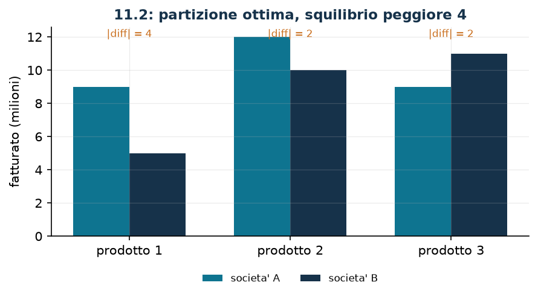

# Filiali fra due società

**Classe:** BIP · **Legami:** valore assoluto, min-max · **Script:** `python/fam10_7_antitrust.py`

[](https://colab.research.google.com/github/fabiofurini/modellazione-mip/blob/main/notebooks/fam10_7_antitrust.ipynb)

!!! abstract "Problema 10.7"
    Un'azienda ha $s \in \mathbb{Z}_{\ge 1}$ filiali e vende
    $r \in \mathbb{Z}_{\ge 1}$ prodotti. Per ogni filiale $i \in \{1, \dots, s\}$
    e ogni prodotto $j \in \{1, \dots, r\}$, il valore
    $v_{ij} \in \mathbb{Q}_{\ge 0}$ è il fatturato in milioni di euro generato da
    quella filiale con quel prodotto. Per effetto di una nuova norma antitrust
    l'azienda deve dividersi in due società più piccole; ogni filiale è
    indivisibile e va assegnata a esattamente una delle due. L'azienda vuole
    partizionare le filiali minimizzando la massima differenza, fra tutti i
    prodotti, dei fatturati delle due nuove società.

**Il problema a parole.** *Decidiamo* a quale delle due società va ciascuna
filiale. *L'obiettivo*: rendere le due società il più simili possibile,
misurando la somiglianza sul prodotto in cui vanno peggio. *Il vincolo*: ogni
filiale a una sola società.

## Modello

**Variabili.** Basta *una* famiglia di $s$ binarie: $x_i \in \{0,1\}$ vale $1$
se la filiale $i$ va alla società $A$ e $0$ se va alla $B$; più una variabile
libera $z$ per il min-max.

Con $T_j = \sum_{i=1}^{s} v_{ij}$ il fatturato totale sul prodotto $j$, il
fatturato di $A$ è $\sum_i v_{ij}\, x_i$ e quello di $B$ è
$T_j - \sum_i v_{ij}\, x_i$: la loro differenza è
$2 \sum_i v_{ij}\, x_i - T_j$.

$$
\begin{aligned}
\min ~~ & z\\
\text{s.a.} \quad & z - 2 \sum_{i=1}^{s} v_{ij}\, x_i + T_j \ge 0, && \forall j \in \{1, \dots, r\},\\
& z + 2 \sum_{i=1}^{s} v_{ij}\, x_i - T_j \ge 0, && \forall j \in \{1, \dots, r\},\\
& x_i \in \{0,1\}, && \forall i \in \{1, \dots, s\},\\
& z \gtreqless 0.
\end{aligned}
$$

**Descrizione.** L'obiettivo è lo squilibrio peggiore. I due gruppi di vincoli,
uno per prodotto ciascuno, dicono che $z$ non è più piccolo dello squilibrio del
prodotto $j$ né del suo opposto: insieme impongono
$z \ge \bigl|2\sum_i v_{ij}\, x_i - T_j\bigr|$, e il minimo li rende
un'uguaglianza sul prodotto peggiore.

!!! tip "Una famiglia o due?"
    L'enunciato classico introduce *due* famiglie, $x_i$ e $y_i$, con il vincolo
    $x_i + y_i = 1$. Le due scritture sono equivalenti, perché $y_i = 1 - x_i$:
    sostituendo si ottiene esattamente il modello qui sopra, con $s$ variabili e
    $s$ vincoli in meno. Conviene tenere la forma aggregata finché le società
    sono *due*; con tre o più società la forma disaggregata
    $\sum_{k} x_{ik} = 1$ è l'unica possibile, ed è quella che si estende.

## Il modello in gurobipy

```python
m = gp.Model("antitrust")
x = m.addVars(s, vtype=GRB.BINARY, name="x")
z = m.addVar(lb=-GRB.INFINITY, name="z")
m.setObjective(z, GRB.MINIMIZE)
for j in range(r):
    tot = sum(v[i][j] for i in range(s))
    m.addConstr(z - 2 * gp.quicksum(v[i][j] * x[i] for i in range(s)) + tot >= 0)
    m.addConstr(z + 2 * gp.quicksum(v[i][j] * x[i] for i in range(s)) - tot >= 0)
```

## L'istanza

$s = 4$ filiali, $r = 3$ prodotti.

| $v_{ij}$ | $j=1$ | $j=2$ | $j=3$ | totale filiale |
|---|---:|---:|---:|---:|
| $i=1$ | 3 | 3 | 2 | 8 |
| $i=2$ | 6 | 8 | 5 | 19 |
| $i=3$ | 3 | 4 | 4 | 11 |
| $i=4$ | 2 | 7 | 9 | 18 |
| $T_j$ | 14 | 22 | 20 | |

## Euristica costruttiva: il bound primale

Si assegnano le filiali in ordine di fatturato complessivo decrescente, ciascuna
alla società che al momento fattura meno in totale. È l'analogo della LPT per lo
scheduling.

Sull'istanza i totali sono $8, 19, 11, 18$, quindi l'ordine è $2, 4, 3, 1$: la
filiale 2 ad $A$ ($A = 19$), la 4 a $B$ ($B = 18$), la 3 a $B$ ($B = 29$), la 1
ad $A$ ($A = 27$). Si ottiene $A = \{1, 2\}$, $B = \{3, 4\}$, con differenze
$4$, $0$ e $6$ sui tre prodotti:

$$z(\mathrm{MILP}) \le \mathit{UB} = 6 .$$

## Rilassamento LP e duale: il bound vale zero

Si associano $\lambda_j \ge 0$ ai vincoli «da sopra» e $\mu_j \ge 0$ a quelli
«da sotto». La colonna di $z$, variabile libera, dà un vincolo di uguaglianza.

$$
\begin{aligned}
\max ~~ & \sum_{j=1}^{r} T_j\,(\mu_j - \lambda_j)\\
\text{s.a.} \quad & \sum_{j=1}^{r} (\lambda_j + \mu_j) = 1,\\
& 2 \sum_{j=1}^{r} v_{ij}\,(\mu_j - \lambda_j) \le 0, && \forall i \in \{1, \dots, s\},\\
& \lambda_j \ge 0, \quad \mu_j \ge 0.
\end{aligned}
$$

**Descrizione.** $\lambda_j$ e $\mu_j$ sono i prezzi dei due vincoli che
stringono lo squilibrio del prodotto $j$, uno da sopra e uno da sotto.
L'obiettivo valuta a quei prezzi il totale $T_j$ di ciascun prodotto. Il primo
vincolo è la colonna di $z$: la variabile compare in tutti i vincoli con
coefficiente $1$ e nell'obiettivo primale con costo $1$, quindi i prezzi dei
$2r$ vincoli devono sommare esattamente a uno — il duale distribuisce un'unica
unità di peso fra i prodotti. Il secondo gruppo sono le colonne delle $x_i$:
spostare la filiale $i$ da una società all'altra cambia di $2 v_{ij}$ lo
squilibrio del prodotto $j$, e la somma pesata di questi spostamenti non può
essere positiva.

**Ricetta.** $\bar\lambda_1 = \bar\mu_1 = 1/2$ e tutto il resto zero: il primo
vincolo è soddisfatto, $\mu_j - \lambda_j = 0$ per ogni $j$ e quindi anche gli
altri. Il valore è $\mathit{LB} = 0$.

!!! warning "Qui il duale non può fare di meglio"
    Nessuna soluzione duale ammissibile vale più di zero. Infatti, posto
    $\theta_j = \mu_j - \lambda_j$, l'obiettivo è $\sum_j T_j\, \theta_j$ e i
    vincoli sulle $x_i$ impongono $\sum_j v_{ij}\, \theta_j \le 0$ per ogni
    filiale; sommando su tutte le filiali si ottiene
    $\sum_j T_j\, \theta_j \le 0$. Il duale vale dunque al più $0$, e per
    dualità forte $z(\mathrm{LP}) = 0$.

    Il certificato primale è ancora più semplice: la soluzione frazionaria
    $x_i = 1/2$ per ogni filiale con $z = 0$ è ammissibile per il rilassamento e
    pareggia esattamente ogni prodotto. Mezza filiale a ciascuna società:
    legittimo per l'LP, privo di senso per il problema.

## Un bound combinatorio, prodotto per prodotto

Se il rilassamento non dice niente, bisogna cercare altrove. Per ogni prodotto
$j$ si può calcolare, guardando *quel solo prodotto*, il minimo squilibrio
ottenibile:

$$g_j = \min_{S \subseteq \{1,\dots,s\}}
      \Bigl| 2 \sum_{i \in S} v_{ij} - T_j \Bigr| .$$

È il classico problema della partizione su una sola colonna, e con $s$ piccolo
si risolve per enumerazione ($2^s$ sottoinsiemi). Ogni partizione ammissibile
del problema completo è in particolare una partizione per il prodotto $j$,
quindi $z(\mathrm{MILP}) \ge \max_j g_j$.

| Prodotto | totale $T_j$ | $g_j$ |
|---|---:|---:|
| 1 | 14 | 2 |
| 2 | 22 | 0 |
| 3 | 20 | 2 |

Sul prodotto 1 i valori sono $3, 6, 3, 2$: la somma $7$ non è raggiungibile da
alcun sottoinsieme, e il meglio è $6$ contro $8$, cioè $g_1 = 2$. Quindi
$z(\mathrm{MILP}) \ge \mathit{LB} = 2$, un bound che il rilassamento lineare non
vede, perché nasce dall'interezza e non dai vincoli.

## Soluzione ottima

La partizione ottima è $A = \{2, 3\}$ e $B = \{1, 4\}$, con differenze $4$, $2$
e $2$ sui tre prodotti.

| $LB$ (combinatorio) | $z(\mathrm{LP})$ | $z(\mathrm{LP}^+)$ | $z(\mathrm{MILP})$ | $UB$ (euristica) | gap |
|---:|---:|---:|---:|---:|---:|
| 2 | 0 | 0 | 4 | 6 | $50{,}0\%$ |



$\mathit{LB}$ non è il valore del duale ($0$) ma il bound combinatorio: nella
tabella la colonna si chiama «bound certificato» proprio per questo.

## Considerazioni aggiuntive

- Il problema con un solo prodotto è il *number partitioning*, uno dei ventuno
  problemi NP-completi di Karp. Con più prodotti è la sua versione vettoriale, e
  resta NP-difficile.
- Il bound combinatorio si può rafforzare: invece del massimo dei $g_j$ si può
  cercare, per ogni coppia di prodotti, il minimo del massimo dei due
  squilibri. Il costo cresce ma il bound migliora, ed è la stessa idea del
  *surrogate relaxation*.
- L'obiettivo min-max non è l'unico possibile: minimizzare la somma delle
  differenze è un'altra scelta legittima e dà un modello con $r$ variabili
  ausiliarie invece di una.

## Domande di modellazione aggiuntive

??? question "10.7.1 — Due filiali inseparabili"
    Le filiali $1$ e $2$ condividono la sede e devono restare nella stessa
    società. Come cambia il modello? Qual è il nuovo ottimo?

    !!! tip "Soluzione"
        La soluzione è nel documento delle soluzioni, riservato ai docenti.

??? question "10.7.2 — Min-sum invece di min-max"
    Si vuole minimizzare la *somma* delle differenze su tutti i prodotti invece
    della differenza peggiore. Come cambia il modello? La partizione ottima è la
    stessa?

    !!! tip "Soluzione"
        La soluzione è nel documento delle soluzioni, riservato ai docenti.

## Codice

Script completo —
[`python/fam10_7_antitrust.py`](https://github.com/fabiofurini/modellazione-mip/blob/main/python/fam10_7_antitrust.py)
(riproducibile con `python3 python/fam10_7_antitrust.py` dalla cartella
`python/`). Notebook —
[`notebooks/fam10_7_antitrust.ipynb`](https://github.com/fabiofurini/modellazione-mip/blob/main/notebooks/fam10_7_antitrust.ipynb)
— che si apre in Colab dal badge in cima alla pagina.

<!-- script-incorporato: inizio (rigenerato da python/incorpora_codice.py) -->

??? example "Mostra lo script completo — `python/fam10_7_antitrust.py` (217 righe)"

    ```python
    """Problema 11.2 -- Suddivisione antitrust: due societa' il piu' simili possibile.

    Le filiali vanno divise in due gruppi minimizzando, sul prodotto peggiore, la
    differenza di fatturato fra i due gruppi. E' la tecnica 3.6 (min-max) applicata
    a un valore assoluto (3.7): due disuguaglianze per prodotto attorno alla stessa
    variabile z.

    Il punto del problema e' che il rilassamento lineare vale zero: meta' filiale a
    ciascuna societa' pareggia tutti i prodotti. Il bound inferiore utile non viene
    dal duale ma da un argomento combinatorio, prodotto per prodotto.
    """
    import itertools

    import gurobipy as gp
    import pandas as pd
    from gurobipy import GRB

    from mip import (ammissibile, due_rilassamenti, frazione, nuovo_modello, registra_bound,
                     risolvi, valuta)
    from stile import ARANCIO, BLU, TEAL, intestazione, plt, salva_dati, salva_figura

    R = range

    # ---------- 1. MODELLO E ISTANZA ----------
    intestazione("11.2 Antitrust: dividere le filiali minimizzando lo squilibrio peggiore")
    v2 = [[3, 3, 2],      # fatturato della filiale i sul prodotto j (milioni)
          [6, 8, 5],
          [3, 4, 4],
          [2, 7, 9]]
    s2, r2 = len(v2), len(v2[0])
    salva_dati(pd.DataFrame(v2, columns=[f"prodotto_{j + 1}" for j in R(r2)],
                            index=[f"filiale_{i + 1}" for i in R(s2)]).reset_index(),
               "antitrust2_dati")


    def modello_2(v):
        """Una sola famiglia di binarie: x_i = 1 se la filiale i va alla societa' A.

        La sorgente usa due famiglie x_i e y_i con x_i + y_i = 1. Sono equivalenti:
        y_i = 1 - x_i. Qui si tiene la forma aggregata, piu' compatta; la forma
        disaggregata si ottiene sostituendo, ed e' quella che serve quando le societa'
        diventano piu' di due.
        """
        s, r = len(v), len(v[0])
        m = nuovo_modello("antitrust")
        x = m.addVars(s, vtype=GRB.BINARY, name="x")
        z = m.addVar(lb=-GRB.INFINITY, name="z")
        m.setObjective(z, GRB.MINIMIZE)
        for j in R(r):
            tot = sum(v[i][j] for i in R(s))
            # differenza fra A e B sul prodotto j: 2 * sum_i v_ij x_i - tot
            m.addConstr(z - 2 * gp.quicksum(v[i][j] * x[i] for i in R(s)) + tot >= 0,
                        name=f"sopra[{j}]")
            m.addConstr(z + 2 * gp.quicksum(v[i][j] * x[i] for i in R(s)) - tot >= 0,
                        name=f"sotto[{j}]")
        return m, x, z


    def duale_2(v):
        """max sum_j T_j (mu_j - lam_j)  con  sum_j (lam_j + mu_j) = 1  (colonna di z, libera)
           e  2 sum_j v_ij (mu_j - lam_j) <= 0 per ogni filiale i (colonna di x_i >= 0)."""
        s, r = len(v), len(v[0])
        dl = nuovo_modello("duale_antitrust")
        lam = dl.addVars(r, name="lam")     # vincoli "sopra"
        mu = dl.addVars(r, name="mu")       # vincoli "sotto"
        tot = [sum(v[i][j] for i in R(s)) for j in R(r)]
        dl.setObjective(gp.quicksum(tot[j] * (mu[j] - lam[j]) for j in R(r)), GRB.MAXIMIZE)
        dl.addConstr(gp.quicksum(lam[j] + mu[j] for j in R(r)) == 1, name="rcz")
        dl.addConstrs((2 * gp.quicksum(v[i][j] * (mu[j] - lam[j]) for j in R(r)) <= 0
                       for i in R(s)), name="rcx")
        return dl


    m2, x2, z2v = modello_2(v2)
    tot2 = [sum(v2[i][j] for i in R(s2)) for j in R(r2)]
    print("  Fatturato totale per prodotto: "
          + ", ".join(f"prodotto {j + 1} = {tot2[j]}" for j in R(r2)))

    # ---------- 2. EURISTICA COSTRUTTIVA (UPPER BOUND) ----------
    # euristica costruttiva: le filiali in ordine di fatturato complessivo decrescente, ciascuna
    # alla societa' che al momento fattura meno in totale
    def euristica(v):
        s, r = len(v), len(v[0])
        tot_i = [sum(v[i]) for i in R(s)]
        gruppo = {}
        somme = [0, 0]
        passi = [f"fatturato complessivo delle filiali: "
                 + ", ".join(f"{i + 1} -> {tot_i[i]}" for i in R(s))]
        for i in sorted(R(s), key=lambda i: (-tot_i[i], i)):
            k = 0 if somme[0] <= somme[1] else 1
            gruppo[i] = k
            somme[k] += tot_i[i]
            passi.append(f"filiale {i + 1} ({tot_i[i]}) alla societa' "
                         f"{'AB'[k]}; ora A = {somme[0]}, B = {somme[1]}")
        diff = [abs(sum(v[i][j] for i in R(s) if gruppo[i] == 0)
                    - sum(v[i][j] for i in R(s) if gruppo[i] == 1)) for j in R(r)]
        passi.append("differenze per prodotto: "
                     + ", ".join(f"prodotto {j + 1} -> {diff[j]}" for j in R(r)))
        return gruppo, max(diff), passi


    gruppo, ub2, passi = euristica(v2)
    for k, riga in enumerate(passi, 1):
        print(f"  Passo {k}. {riga}")
    sol_eur = {f"x[{i}]": 1 - gruppo[i] for i in R(s2)} | {"z": ub2}
    assert ammissibile(m2, sol_eur), sol_eur
    print("  Societa' A = " + str([i + 1 for i in R(s2) if gruppo[i] == 0])
          + ", societa' B = " + str([i + 1 for i in R(s2) if gruppo[i] == 1])
          + f"   ub = {frazione(ub2)}")

    # ---------- 3. IL RILASSAMENTO LP NON DICE NIENTE ----------
    dl2 = duale_2(v2)
    mano = {"lam[0]": 0.5, "mu[0]": 0.5}      # lam_1 = mu_1 = 1/2, tutto il resto zero
    lb_lp, viol = valuta(dl2, mano)
    assert viol <= 1e-9, viol
    print(f"  Duale a mano: lam_1 = mu_1 = 1/2 e tutto il resto zero -> valore {frazione(lb_lp)}.")
    print("  Qualunque soluzione duale ammissibile qui vale al piu' zero: nell'obiettivo compare")
    print("  la differenza mu_j - lam_j, e i vincoli sulle colonne x_i la costringono a essere")
    print("  non positiva su ogni filiale.")
    zlp2, zlp2r, _ = due_rilassamenti(m2, dl2)
    meta = {f"x[{i}]": 0.5 for i in R(s2)} | {"z": 0.0}
    val_meta, viol_meta = valuta(m2, meta)
    assert viol_meta <= 1e-9 and abs(val_meta) <= 1e-9
    print(f"  Infatti z(LP) = {frazione(zlp2)}: basta mettere meta' di ogni filiale in ciascuna")
    print("  societa' (x_i = 1/2, z = 0) e ogni prodotto e' pareggiato esattamente. E' ammissibile")
    print("  per il rilassamento e inutile per il problema vero: le filiali sono indivisibili.")
    assert abs(zlp2) <= 1e-9

    # ---------- 4. UN BOUND COMBINATORIO PRODOTTO PER PRODOTTO ----------
    intestazione("11.2 Il bound inferiore viene da un argomento combinatorio")
    # per ogni prodotto, il minimo squilibrio ottenibile guardando quel solo prodotto
    def minimo_squilibrio(colonna, tot):
        s = len(colonna)
        return min(abs(2 * sum(colonna[i] for i in sotto) - tot)
                   for k in R(s + 1) for sotto in itertools.combinations(R(s), k))


    gj = [minimo_squilibrio([v2[i][j] for i in R(s2)], tot2[j]) for j in R(r2)]
    for j in R(r2):
        print(f"  Prodotto {j + 1}: totale {tot2[j]}, migliore squilibrio possibile guardando solo")
        print(f"    questo prodotto = {gj[j]}")
    lb2 = max(gj)
    print(f"  Ogni partizione deve rispettare tutti i prodotti insieme, quindi z >= max_j g_j = "
          f"{frazione(lb2)}.")
    print("  E' un bound valido che il rilassamento lineare non vede: nasce dall'interezza, non")
    print("  dai vincoli.")
    salva_dati(pd.DataFrame({"prodotto": R(1, r2 + 1), "totale": tot2, "g_j": gj}),
               "antitrust2_argomento")

    # ---------- 5. OTTIMO DEL MILP ----------
    z2 = risolvi(m2)
    A = [i + 1 for i in R(s2) if x2[i].X > 0.5]
    B = [i + 1 for i in R(s2) if x2[i].X <= 0.5]
    diff_ott = [abs(sum(v2[i - 1][j] for i in A) - sum(v2[i - 1][j] for i in B)) for j in R(r2)]
    print(f"  Soluzione ottima: societa' A = {A}, societa' B = {B}")
    print("  differenze per prodotto: "
          + ", ".join(f"prodotto {j + 1} -> {diff_ott[j]}" for j in R(r2))
          + f"   z = {frazione(z2)}")
    riga = registra_bound("2 antitrust", ub2, lb2, zlp2, zlp2r, z2)
    salva_dati(pd.DataFrame([riga]), "antitrust2_bound")
    assert lb2 <= z2 <= ub2 + 1e-9
    print(f"  Sandwich: {frazione(lb2)} <= z(MILP) = {frazione(z2)} <= {frazione(ub2)}. Attenzione:")
    print(f"  qui lb non e' il valore del duale ({frazione(lb_lp)}) ma il bound combinatorio.")

    # ---------- 6. DOMANDE DI MODELLAZIONE AGGIUNTIVE ----------
    varianti = {}


    def variante(nome, m):
        z = risolvi(m)
        print(f"  {nome:70s} z = {frazione(z)}")
        return z


    # 2a: le filiali 1 e 2 devono restare nella stessa societa'
    m, x, zz = modello_2(v2)
    m.addConstr(x[0] - x[1] == 0, name="insieme")
    varianti["2a"] = variante("2a. Le filiali 1 e 2 devono restare insieme (x1 = x2)", m)
    # 2b: si minimizza la somma delle differenze invece della peggiore
    m = nuovo_modello("antitrust_somma")
    x = m.addVars(s2, vtype=GRB.BINARY, name="x")
    zj = m.addVars(r2, name="z")
    m.setObjective(zj.sum(), GRB.MINIMIZE)
    for j in R(r2):
        m.addConstr(zj[j] - 2 * gp.quicksum(v2[i][j] * x[i] for i in R(s2)) + tot2[j] >= 0,
                    name=f"sopra[{j}]")
        m.addConstr(zj[j] + 2 * gp.quicksum(v2[i][j] * x[i] for i in R(s2)) - tot2[j] >= 0,
                    name=f"sotto[{j}]")
    varianti["2b"] = variante("2b. Si minimizza la somma delle differenze (min-sum invece di min-max)", m)
    A_somma = sorted(min(([i + 1 for i in R(s2) if x[i].X > 0.5],
                          [i + 1 for i in R(s2) if x[i].X <= 0.5])))
    A_max = sorted(min((A, B)))
    print(f"       partizione min-sum: {A_somma} contro il resto; partizione min-max: {A_max}.")
    print("       I due obiettivi non sono confrontabili in valore: cambia la funzione, non")
    print("       l'insieme ammissibile.")
    assert A_somma == A_max, (A_somma, A_max)
    salva_dati(pd.DataFrame({"variante": list(varianti), "z": list(varianti.values())}),
               "antitrust2_varianti")

    # ---------- 7. FIGURA ----------
    fig, ax = plt.subplots(figsize=(6.8, 3.0))
    larg = 0.35
    idx = list(R(r2))
    ax.bar([j - larg / 2 for j in idx], [sum(v2[i - 1][j] for i in A) for j in idx], larg,
           color=TEAL, label="societa' A")
    ax.bar([j + larg / 2 for j in idx], [sum(v2[i - 1][j] for i in B) for j in idx], larg,
           color=BLU, label="societa' B")
    for j in idx:
        ax.annotate(f"|diff| = {diff_ott[j]}", (j, max(tot2) / 2 + 1), ha="center", fontsize=8,
                    color=ARANCIO)
    ax.set_xticks(idx)
    ax.set_xticklabels([f"prodotto {j + 1}" for j in idx])
    ax.set_ylabel("fatturato (milioni)")
    ax.set_title(f"11.2: partizione ottima, squilibrio peggiore {frazione(z2)}")
    ax.legend(fontsize=8)
    salva_figura(fig, "cap10_antitrust_ottimo")
    print("Fine.")
    ```

<!-- script-incorporato: fine -->
