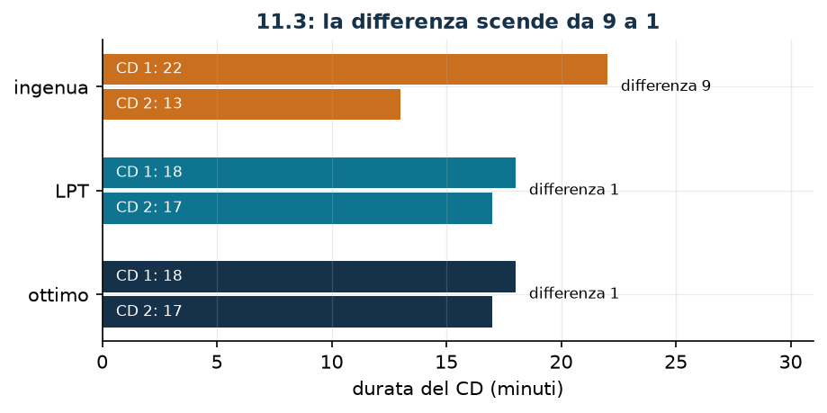

# Brani fra CD

**Classe:** MILP · **Legami:** variabile di massimo e di minimo · **Script:** `python/fam10_8_cd.py`

[](https://colab.research.google.com/github/fabiofurini/modellazione-mip/blob/main/notebooks/fam10_8_cd.ipynb)

!!! abstract "Problema 10.8"
    Una casa discografica pubblica una raccolta di $n \in \mathbb{Z}_{\ge 1}$
    brani. Per ogni brano $i \in \{1, \dots, n\}$, il valore
    $d_i \in \mathbb{Q}_{\ge 1}$ è la durata in minuti. La raccolta va
    distribuita su $m \in \mathbb{Z}_{\ge 1}$ compact disc; ogni brano va
    assegnato a esattamente un CD, e ogni CD $j \in \{1, \dots, m\}$ deve
    contenere almeno $w_j \in \mathbb{Z}_{\ge 1}$ brani. La casa discografica
    vuole minimizzare la differenza fra la durata complessiva del CD più lungo e
    quella del più corto.

**Il problema a parole.** *Decidiamo* su quale CD finisce ogni brano.
*L'obiettivo*: CD il più possibile omogenei per durata. *I vincoli*: ogni brano
su un CD solo, e nessun CD troppo scarno.

## Modello

**Variabili.** $x_{ij} \in \{0,1\}$ vale $1$ se il brano $i$ va sul CD $j$;
$y \ge 0$ è la durata del CD più lungo e $z \ge 0$ quella del più corto.

$$
\begin{aligned}
\min ~~ & y - z\\
\text{s.a.} \quad & \sum_{j=1}^{m} x_{ij} = 1, && \forall i \in \{1, \dots, n\},\\
& \sum_{i=1}^{n} x_{ij} \ge w_j, && \forall j \in \{1, \dots, m\},\\
& -\sum_{i=1}^{n} d_i\, x_{ij} + y \ge 0, && \forall j \in \{1, \dots, m\},\\
& \sum_{i=1}^{n} d_i\, x_{ij} - z \ge 0, && \forall j \in \{1, \dots, m\},\\
& x_{ij} \in \{0,1\}, \quad y \ge 0, \quad z \ge 0.
\end{aligned}
$$

**Descrizione.** L'obiettivo è la differenza fra la durata più lunga e la più
corta. I vincoli di **assegnamento**, uno per brano, dicono che ogni brano
finisce su esattamente un CD. I vincoli di **numero minimo**, uno per CD,
impongono almeno $w_j$ brani. I vincoli di **massimo**, uno per CD, spingono $y$
sopra ogni durata; quelli di **minimo**, sempre uno per CD, spingono $z$ sotto
ogni durata: nel minimo la prima diventa il massimo delle durate e la seconda il
minimo.

!!! note "Due variabili ausiliarie, due versi diversi"
    I vincoli di massimo dicono $y \ge \sum_i d_i x_{ij}$ per ogni CD: $y$ è
    *almeno* il massimo. Quelli di minimo dicono $z \le \sum_i d_i x_{ij}$: $z$
    è *al più* il minimo. Nessuno dei due impone l'uguaglianza; la impone
    l'obiettivo, che spinge $y$ verso il basso e $z$ verso l'alto. È la tecnica
    della [variabile di massimo](legami-05.md) applicata due volte, con i due
    versi opposti.

## Il modello in gurobipy

```python
m = gp.Model("cd")
x = m.addVars(n, mm, vtype=GRB.BINARY, name="x")
y = m.addVar(name="y")
z = m.addVar(name="z")
m.setObjective(y - z, GRB.MINIMIZE)
m.addConstrs((x.sum(i, "*") == 1 for i in range(n)), name="brano")
m.addConstrs((x.sum("*", j) >= w[j] for j in range(mm)), name="minimo_brani")
m.addConstrs((-gp.quicksum(d[i] * x[i, j] for i in range(n)) + y >= 0
              for j in range(mm)), name="massimo")
m.addConstrs((gp.quicksum(d[i] * x[i, j] for i in range(n)) - z >= 0
              for j in range(mm)), name="minimo")
```

## L'istanza

$n = 6$ brani, $m = 2$ CD, $w_j = 1$.

| brano | 1 | 2 | 3 | 4 | 5 | 6 |
|---|---:|---:|---:|---:|---:|---:|
| $d_i$ (minuti) | 5 | 6 | 7 | 3 | 4 | 10 |

La durata totale è $35$ minuti.

## Euristica costruttiva: il bound primale

Si scorrono i brani e si mette ciascuno sul CD al momento più corto. La stessa
regola, con due ordini diversi, dà due risultati.

- **(a) Ordine naturale.** $5 \to$ CD1, $6 \to$ CD2, $7 \to$ CD1, $3 \to$ CD2,
  $4 \to$ CD2, $10 \to$ CD1. Durate finali $22$ e $13$: differenza $9$.
- **(b) Ordine per durata decrescente (LPT).** $10 \to$ CD1, $7 \to$ CD2,
  $6 \to$ CD2, $5 \to$ CD1, $4 \to$ CD2, $3 \to$ CD1. Durate finali $18$ e
  $17$: differenza $1$.

Si tiene la migliore: $z(\mathit{MILP}) \le \mathit{UB} = 1$.

## Rilassamento LP e duale: di nuovo zero

Si associano $\alpha_i$ libera all'assegnamento, $\beta_j \ge 0$ al numero
minimo, $\gamma_j \ge 0$ al massimo e $\delta_j \ge 0$ al minimo.

$$
\begin{aligned}
\max ~~ & \sum_{i=1}^{n} \alpha_i + \sum_{j=1}^{m} w_j\, \beta_j\\
\text{s.a.} \quad & \sum_{j=1}^{m} \gamma_j = 1,\\
& \sum_{j=1}^{m} \delta_j = 1,\\
& \alpha_i + \beta_j - d_i\, \gamma_j + d_i\, \delta_j \le 0, && \forall i \in \{1, \dots, n\},\ \forall j \in \{1, \dots, m\},\\
& \alpha_i \gtreqless 0, \quad \beta_j \ge 0, \quad \gamma_j \ge 0, \quad \delta_j \ge 0.
\end{aligned}
$$

**Descrizione.** $\alpha_i$ è il valore del brano $i$, $\beta_j$ il prezzo del
numero minimo di brani sul CD $j$, mentre $\gamma_j$ e $\delta_j$ sono i pesi
con cui il CD $j$ entra nella durata massima e in quella minima. L'obiettivo
valuta i brani e le soglie $w_j$. I due vincoli di uguaglianza sono le colonne
di $y$ e di $z$: ciascuna delle due variabili compare in un vincolo per CD e
nell'obiettivo primale con coefficiente $\pm 1$, quindi i rispettivi pesi
sommano a uno. L'ultimo gruppo sono le colonne delle $x_{ij}$: mettere il brano
$i$ sul CD $j$ soddisfa il suo vincolo di assegnamento, contribuisce al minimo
di brani e sposta di $d_i$ le due durate; il saldo non può essere positivo.

**Ricetta.** Con $\bar\gamma_j = \bar\delta_j = 1/m$ e $\alpha = \beta = 0$ i
due vincoli di uguaglianza sono soddisfatti e gli altri diventano
$-d_i/m + d_i/m = 0 \le 0$. Il valore è $\mathit{LB} = 0$.

!!! warning "Anche qui il rilassamento è muto"
    Che il rilassamento valga zero si vede meglio dal lato primale: mettendo
    $x_{ij} = 1/m$ per ogni brano e ogni CD, ogni CD «dura» $35/2 = 17{,}5$
    minuti e la differenza è nulla. È ammissibile per il rilassamento e privo di
    senso per il problema, perché un brano non si spezza. Il rilassamento
    lineare dei modelli di bilanciamento è quasi sempre così: pareggia tutto e
    vale zero.

## Un argomento di parità che chiude il problema

Le durate sono numeri interi e i CD sono due: le loro durate $q_1$ e $q_2$ sono
interi che sommano a $q = 35$, che è **dispari**. Due interi che sommano a un
numero dispari non possono essere uguali, e la loro differenza $|q_1 - q_2|$ ha
la stessa parità di $q$, cioè è dispari. Una differenza dispari e non negativa
vale almeno $1$:

$$z(\mathit{MILP}) \ge \mathit{LB} = 1 .$$

L'euristica LPT raggiunge esattamente $1$: i due bound coincidono, e la
soluzione euristica è ottima. Lo si sa *prima* di chiamare il solver, ed è il
caso più netto del corso in cui un argomento combinatorio di due righe fa il
lavoro che il rilassamento LP non riesce a fare.

## Soluzione ottima

| | brani | durata |
|---|---|---:|
| CD 1 | 1, 2, 3 | 18 |
| CD 2 | 4, 5, 6 | 17 |

| $LB$ (parità) | $z(\mathit{LP})$ | $z(\mathit{LP}^+)$ | $z(\mathit{MILP})$ | $UB$ (euristica) | gap |
|---:|---:|---:|---:|---:|---:|
| 1 | 0 | 0 | 1 | 1 | $0\%$ |



La soluzione trovata dal solver non è quella dell'euristica LPT (che metteva i
brani $6, 1, 4$ su un CD e $3, 2, 5$ sull'altro), ma ha lo stesso valore: il
problema ha più ottimi.

## Considerazioni aggiuntive

- L'argomento di parità vale così com'è per $m = 2$. Con $m = 3$ va rifatto:
  $35$ non è divisibile per $3$, quindi le tre durate non possono essere tutte
  uguali, ma il minimo scarto non è più immediato. Sull'istanza con tre CD
  l'ottimo vale $2$ (durate $13, 11, 11$).
- Il vincolo $\sum_i x_{ij} \ge w_j$ con $w_j = 1$ non morde mai all'ottimo: una
  soluzione che lasciasse un CD vuoto avrebbe $z = 0$ e quindi differenza pari
  alla durata totale. Serve però nel modello, perché senza di esso il
  rilassamento avrebbe soluzioni degeneri.
- Minimizzare $y - z$ non è equivalente a minimizzare $y$ (il makespan): la
  seconda è la formulazione classica dello scheduling su macchine parallele, e
  ha ottimi diversi. È la stessa differenza fra «bilanciare» e «finire presto».

## Domande di modellazione aggiuntive

??? question "10.8.1 — Un supporto più piccolo"
    Il CD 1 è un supporto ridotto e non può superare i $15$ minuti. Come cambia
    il modello? Qual è il nuovo ottimo?

    !!! tip "Soluzione"
        La soluzione è nel documento delle soluzioni, riservato ai docenti.

??? question "10.8.2 — Tre CD"
    La raccolta si distribuisce su tre CD invece che su due. Come cambia il
    modello? Qual è il nuovo ottimo?

    !!! tip "Soluzione"
        La soluzione è nel documento delle soluzioni, riservato ai docenti.

## Codice

Script completo —
[`python/fam10_8_cd.py`](https://github.com/fabiofurini/modellazione-mip/blob/main/python/fam10_8_cd.py)
(riproducibile con `python3 python/fam10_8_cd.py` dalla cartella `python/`).
Notebook —
[`notebooks/fam10_8_cd.ipynb`](https://github.com/fabiofurini/modellazione-mip/blob/main/notebooks/fam10_8_cd.ipynb)
— che si apre in Colab dal badge in cima alla pagina.

<!-- script-incorporato: inizio (rigenerato da python/incorpora_codice.py) -->

??? example "Mostra lo script completo — `python/fam10_8_cd.py` (182 righe)"

    ```python
    """Problema 11.3 -- Brani su piu' CD: minimizzare la differenza fra il piu' lungo
    e il piu' corto.

    Due variabili ausiliarie: y di massimo (tecnica 3.5) e z di minimo, con obiettivo
    y - z. Come in 11.2 il rilassamento lineare vale zero, e il bound inferiore utile
    si ottiene da un argomento di parita' che decide da solo l'ottimalita'.
    """
    import gurobipy as gp
    import pandas as pd
    from gurobipy import GRB

    from mip import (ammissibile, due_rilassamenti, frazione, nuovo_modello, registra_bound,
                     risolvi, valuta)
    from stile import ARANCIO, BLU, TEAL, intestazione, plt, salva_dati, salva_figura

    R = range

    # ---------- 1. MODELLO E ISTANZA ----------
    intestazione("11.3 Brani sui CD: pareggiare la durata del CD piu' lungo e del piu' corto")
    d3 = [5, 6, 7, 3, 4, 10]     # durata dei brani, in minuti
    w3 = [1, 1]                  # brani minimi per CD
    n3, m3 = len(d3), len(w3)
    D3 = sum(d3)
    salva_dati(pd.DataFrame({"brano": R(1, n3 + 1), "durata": d3}), "cd3_dati")
    print(f"  Durata totale della raccolta: {D3} minuti su {m3} CD.")


    def modello_3(d, w):
        n, m = len(d), len(w)
        mod = nuovo_modello("cd")
        x = mod.addVars(n, m, vtype=GRB.BINARY, name="x")
        y = mod.addVar(name="y")     # durata del CD piu' lungo
        z = mod.addVar(name="z")     # durata del CD piu' corto
        mod.setObjective(y - z, GRB.MINIMIZE)
        mod.addConstrs((x.sum(i, "*") == 1 for i in R(n)), name="brano")
        mod.addConstrs((x.sum("*", j) >= w[j] for j in R(m)), name="minimo")
        mod.addConstrs((y - gp.quicksum(d[i] * x[i, j] for i in R(n)) >= 0 for j in R(m)),
                       name="massimo")
        mod.addConstrs((gp.quicksum(d[i] * x[i, j] for i in R(n)) - z >= 0 for j in R(m)),
                       name="minimo_durata")
        return mod, x, y, z


    def duale_3(d, w):
        """max sum_i alpha_i + sum_j w_j beta_j

        alpha_i libera (vincolo di uguaglianza), beta_j >= 0 (>= w_j), gamma_j >= 0
        (colonna di y: sum_j gamma_j = 1) e delta_j >= 0 (colonna di z:
        sum_j delta_j = 1). Colonna di x_ij: alpha_i + beta_j - d_i gamma_j + d_i delta_j <= 0.
        """
        n, m = len(d), len(w)
        dl = nuovo_modello("duale_cd")
        alpha = dl.addVars(n, lb=-GRB.INFINITY, name="alpha")
        beta = dl.addVars(m, name="beta")
        gamma = dl.addVars(m, name="gamma")
        delta = dl.addVars(m, name="delta")
        dl.setObjective(alpha.sum() + gp.quicksum(w[j] * beta[j] for j in R(m)), GRB.MAXIMIZE)
        dl.addConstr(gamma.sum() == 1, name="rcy")
        dl.addConstr(delta.sum() == 1, name="rcz")
        dl.addConstrs((alpha[i] + beta[j] - d[i] * gamma[j] + d[i] * delta[j] <= 0
                       for i in R(n) for j in R(m)), name="rcx")
        return dl


    m3mod, x3, y3, z3v = modello_3(d3, w3)

    # ---------- 2. DUE EURISTICHE A CONFRONTO (UPPER BOUND) ----------
    def riempi(d, m, ordine, etichetta):
        """Si scorrono i brani nell'ordine dato e si mette ognuno sul CD piu' corto."""
        carichi = [0] * m
        dove = {}
        passi = []
        for i in ordine:
            j = min(R(m), key=lambda j: (carichi[j], j))
            dove[i] = j
            carichi[j] += d[i]
            passi.append(f"brano {i + 1} ({d[i]} min) sul CD {j + 1}; durate {carichi}")
        diff = max(carichi) - min(carichi)
        print(f"  {etichetta}")
        for k, riga in enumerate(passi, 1):
            print(f"    Passo {k}. {riga}")
        print(f"    durate finali {carichi}, differenza {diff}")
        return dove, carichi, diff


    ordine_lpt = sorted(R(n3), key=lambda i: (-d3[i], i))
    dove, carichi, ub3 = riempi(d3, m3, ordine_lpt,
                                "Euristica LPT: brani in ordine di durata decrescente.")
    dove_nat, carichi_nat, diff_nat = riempi(d3, m3, list(R(n3)),
                                             "Euristica ingenua: brani nell'ordine dato.")
    sol_eur = ({f"x[{i},{dove[i]}]": 1 for i in R(n3)}
               | {"y": max(carichi), "z": min(carichi)})
    assert ammissibile(m3mod, sol_eur), sol_eur
    print(f"  L'ordine decrescente da' {frazione(ub3)}, l'ordine naturale {frazione(diff_nat)}: la")
    print("  stessa regola di inserimento cambia di molto a seconda dell'ordine dei brani.")
    print(f"  Si tiene il migliore dei due:  ub = {frazione(ub3)}")
    assert diff_nat >= ub3

    # ---------- 3. IL RILASSAMENTO LP NON DICE NIENTE ----------
    dl3 = duale_3(d3, w3)
    mano = {f"gamma[{j}]": 1 / m3 for j in R(m3)} | {f"delta[{j}]": 1 / m3 for j in R(m3)}
    lb_lp, viol = valuta(dl3, mano)
    assert viol <= 1e-9, viol
    print(f"  Duale a mano: gamma_j = delta_j = 1/{m3}, alpha = beta = 0 -> valore "
          f"{frazione(lb_lp)}.")
    zlp3, zlp3r, _ = due_rilassamenti(m3mod, dl3)
    meta = ({f"x[{i},{j}]": 1 / m3 for i in R(n3) for j in R(m3)}
            | {"y": D3 / m3, "z": D3 / m3})
    val_meta, viol_meta = valuta(m3mod, meta)
    assert viol_meta <= 1e-9 and abs(val_meta) <= 1e-9
    print(f"  E infatti z(LP) = {frazione(zlp3)}: mettendo 1/{m3} di ogni brano su ogni CD tutti i")
    print(f"  CD durano {frazione(D3 / m3)} minuti e la differenza e' nulla. Un brano pero' non si")
    print("  spezza.")
    assert abs(zlp3) <= 1e-9

    # ---------- 4. IL BOUND DI PARITA' ----------
    intestazione("11.3 Un argomento di parita' che chiude il problema")
    print(f"  Le durate sono numeri interi e i CD sono {m3}: le due durate sommano a {D3}, che e'")
    print(f"  {'dispari' if D3 % 2 else 'pari'}. Due interi che sommano a un numero dispari non")
    print("  possono essere uguali, e la loro differenza e' essa stessa dispari: quindi vale")
    print("  almeno 1.")
    lb3 = 1 if D3 % 2 else 0
    assert m3 == 2, "l'argomento di parita' vale cosi' com'e' per due soli CD"
    print(f"  lb = {frazione(lb3)}, e l'euristica LPT raggiunge {frazione(ub3)}: i due bound")
    print("  coincidono e la soluzione euristica e' gia' ottima, senza bisogno del solver.")
    salva_dati(pd.DataFrame([{"argomento": "parita' della durata totale", "bound": lb3},
                             {"argomento": "duale del rilassamento LP", "bound": lb_lp}]),
               "cd3_argomento")

    # ---------- 5. OTTIMO DEL MILP ----------
    z3 = risolvi(m3mod)
    carichi_ott = [sum(d3[i] * x3[i, j].X for i in R(n3)) for j in R(m3)]
    for j in R(m3):
        brani = [i + 1 for i in R(n3) if x3[i, j].X > 0.5]
        print(f"  CD {j + 1}: brani {brani}, durata {frazione(carichi_ott[j])} minuti")
    riga = registra_bound("3 cd", ub3, lb3, zlp3, zlp3r, z3)
    salva_dati(pd.DataFrame([riga]), "cd3_bound")
    assert lb3 <= z3 <= ub3 + 1e-9 and abs(z3 - lb3) <= 1e-9

    # ---------- 6. DOMANDE DI MODELLAZIONE AGGIUNTIVE ----------
    varianti = {}


    def variante(nome, m):
        z = risolvi(m)
        print(f"  {nome:70s} z = {frazione(z)}")
        return z


    # 3a: il CD 1 e' un supporto piu' piccolo e non supera i 15 minuti
    m, x, y, z = modello_3(d3, w3)
    m.addConstr(gp.quicksum(d3[i] * x[i, 0] for i in R(n3)) <= 15, name="capacita_cd1")
    varianti["3a"] = variante("3a. Il CD 1 non puo' superare i 15 minuti", m)
    print(f"       il CD 2 deve allora contenere almeno {D3} - 15 = {D3 - 15} minuti e la")
    print(f"       differenza non puo' scendere sotto {D3 - 2 * 15}: il bound si legge dai dati.")
    # 3b: tre CD invece di due
    m, x, y, z = modello_3(d3, [1, 1, 1])
    varianti["3b"] = variante("3b. La raccolta si distribuisce su tre CD", m)
    print(f"       con tre CD la durata totale {D3} non e' piu' divisibile in parti uguali:")
    print("       l'argomento di parita' va rifatto e non basta piu' a dimostrare l'ottimalita'.")
    salva_dati(pd.DataFrame({"variante": list(varianti), "z": list(varianti.values())}),
               "cd3_varianti")

    # ---------- 7. FIGURA ----------
    fig, ax = plt.subplots(figsize=(6.8, 2.9))
    for k, (nome, car, colore) in enumerate([("euristica ingenua", carichi_nat, ARANCIO),
                                             ("euristica LPT", carichi, TEAL),
                                             ("ottimo", carichi_ott, BLU)]):
        for j in R(m3):
            ax.barh(k + (j - 0.5) * 0.34, car[j], 0.3, color=colore)
            ax.annotate(f"CD {j + 1}: {frazione(car[j])}", (0.6, k + (j - 0.5) * 0.34),
                        va="center", fontsize=8, color="white")
        ax.annotate(f"differenza {frazione(max(car) - min(car))}", (max(car) + 0.6, k),
                    va="center", fontsize=8)
    ax.set_yticks(R(3))
    ax.set_yticklabels(["ingenua", "LPT", "ottimo"])
    ax.set_xlim(0, max(carichi_nat) + 9)
    ax.set_xlabel("durata del CD (minuti)")
    ax.set_title(f"11.3: la differenza scende da {frazione(diff_nat)} a {frazione(z3)}")
    ax.invert_yaxis()
    salva_figura(fig, "cap10_cd_ottimo")
    print("Fine.")
    ```

<!-- script-incorporato: fine -->
