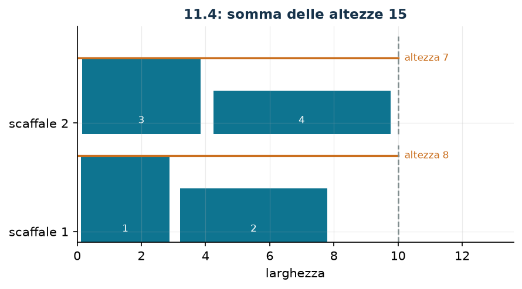

# Libri fra scaffali

**Classe:** MILP · **Legami:** variabile di massimo (forma disaggregata) · **Script:** `python/fam10_9_scaffali.py`

[](https://colab.research.google.com/github/fabiofurini/modellazione-mip/blob/main/notebooks/fam10_9_scaffali.ipynb)

!!! abstract "Problema 10.9"
    Una biblioteca deve sistemare $n \in \mathbb{Z}_{\ge 1}$ libri su degli
    scaffali. Ogni libro $b \in \{1, \dots, n\}$ ha larghezza
    $w_b \in \mathbb{Z}_{\ge 1}$ e altezza $h_b \in \mathbb{Z}_{\ge 1}$. Sono
    disponibili $m \in \mathbb{Z}_{\ge 1}$ scaffali, ciascuno di larghezza
    massima $c \in \mathbb{Q}_{>0}$. Ogni libro va assegnato a esattamente uno
    scaffale, e la larghezza complessiva dei libri su uno scaffale non può
    superare $c$. L'altezza di uno scaffale è quella del libro più alto che vi si
    trova. La biblioteca vuole minimizzare la somma delle altezze degli scaffali.

**Il problema a parole.** *Decidiamo* su quale scaffale va ogni libro.
*L'obiettivo*: somma delle altezze minima (è il legno che si risparmia). *I
vincoli*: ogni libro su uno scaffale solo, e nessuno scaffale più largo di $c$.

## Modello

**Variabili.** $x_{bs} \in \{0,1\}$ vale $1$ se il libro $b$ va sullo scaffale
$s$; $y_s \ge 0$ è l'altezza dello scaffale $s$.

$$
\begin{aligned}
\min ~~ & \sum_{s=1}^{m} y_s\\
\text{s.a.} \quad & \sum_{s=1}^{m} x_{bs} = 1, && \forall b \in \{1, \dots, n\},\\
& \sum_{b=1}^{n} w_b\, x_{bs} \le c, && \forall s \in \{1, \dots, m\},\\
& -h_b\, x_{bs} + y_s \ge 0, && \forall b \in \{1, \dots, n\},\ \forall s \in \{1, \dots, m\},\\
& x_{bs} \in \{0,1\}, \quad y_s \ge 0.
\end{aligned}
$$

**Descrizione.** L'obiettivo è l'altezza complessiva degli scaffali. I vincoli
di **assegnamento**, uno per libro, dicono che ogni libro sta su esattamente uno
scaffale. I vincoli di **larghezza**, uno per scaffale, sono la capacità. I
vincoli di **altezza**, uno per coppia libro–scaffale, spingono $y_s$ sopra
quella di ogni libro sistemato su quello scaffale.

!!! note "Il legame fra le variabili"
    I vincoli di altezza dicono $y_s \ge h_b\, x_{bs}$: se il libro $b$ sta
    sullo scaffale $s$ allora $y_s \ge h_b$, altrimenti non dicono nulla ($y_s
    \ge 0$). Nessuno impone l'uguaglianza; la impone l'obiettivo di minimo, che
    spinge ogni $y_s$ al più piccolo valore ammesso, cioè l'altezza del libro
    più alto presente. È la tecnica della [variabile di
    massimo](legami-05.md) in forma disaggregata.

## Il modello in gurobipy

```python
m = gp.Model("scaffali")
x = m.addVars(n, ms, vtype=GRB.BINARY, name="x")
y = m.addVars(ms, name="y")
m.setObjective(y.sum(), GRB.MINIMIZE)
m.addConstrs((x.sum(b, "*") == 1 for b in range(n)), name="libro")
m.addConstrs((gp.quicksum(w[b] * x[b, s] for b in range(n)) <= c
              for s in range(ms)), name="larghezza")
m.addConstrs((-h[b] * x[b, s] + y[s] >= 0 for b in range(n) for s in range(ms)),
             name="altezza")
```

## L'istanza

$n = 4$ libri, $m = 2$ scaffali, $c = 10$.

| | $b=1$ | $b=2$ | $b=3$ | $b=4$ |
|---|---:|---:|---:|---:|
| $w_b$ | 3 | 5 | 4 | 6 |
| $h_b$ | 8 | 5 | 7 | 4 |

La larghezza totale dei libri è $18$, la capacità complessiva $2 \cdot 10 = 20$.

## Euristica costruttiva: due ordini, due esiti

La regola è first-fit: ogni libro sul primo scaffale in cui entra. Come nel
[problema 10.8](misti-8.md) l'ordine cambia tutto — ma qui, in un ordine,
l'euristica *fallisce*.

- **(a) Ordine per altezza decrescente ($1, 3, 2, 4$).** Libro 1 (largo 3) sullo
  scaffale 1; libro 3 (largo 4) sullo scaffale 1, che arriva a $7$; libro 2
  (largo 5) sullo scaffale 2. Resta il libro 4, largo $6$: sullo scaffale 1 ci
  sono $3$ di residuo, sul 2 ce ne sono $5$. **L'euristica fallisce.**
- **(b) Ordine per larghezza decrescente ($4, 2, 3, 1$).** Libro 4 sullo
  scaffale 1; libro 2 sullo scaffale 2; libro 3 sullo scaffale 1, che arriva a
  $10$; libro 1 sullo scaffale 2, che arriva a $8$. Altezze
  $\max(4, 7) = 7$ e $\max(5, 8) = 8$, somma $15$.

$$z(\mathit{MILP}) \le \mathit{UB} = 15 .$$

!!! warning "L'ordine giusto dipende dal vincolo, non dall'obiettivo"
    L'ordine per altezza decrescente è quello suggerito dall'*obiettivo*, ma il
    vincolo che può rendere infattibile un inserimento è la *larghezza*: è su
    quella che va ordinato. È la stessa logica del first-fit decreasing per il
    bin packing, dove si ordina per dimensione e non per valore. Un'euristica
    costruttiva che può fallire non è di per sé sbagliata — basta prevedere il
    caso e cambiare ordine — ma va detto esplicitamente, perché un'euristica
    «che a volte non restituisce niente» non fornisce alcun bound.

## Rilassamento LP e duale: il bound duale

Si associano $\alpha_b$ libera all'assegnamento, $\beta_s \le 0$ alla larghezza
(verso $\le$ in un minimo) e $\gamma_{bs} \ge 0$ all'altezza.

$$
\begin{aligned}
\max ~~ & \sum_{b=1}^{n} \alpha_b + c \sum_{s=1}^{m} \beta_s\\
\text{s.a.} \quad & \sum_{b=1}^{n} \gamma_{bs} \le 1, && \forall s \in \{1, \dots, m\},\\
& \alpha_b + w_b\, \beta_s - h_b\, \gamma_{bs} \le 0, && \forall b \in \{1, \dots, n\},\ \forall s \in \{1, \dots, m\},\\
& \alpha_b \gtreqless 0, \quad \beta_s \le 0, \quad \gamma_{bs} \ge 0.
\end{aligned}
$$

**Descrizione.** $\alpha_b$ è il valore del libro $b$, $\beta_s$ il prezzo (non
positivo) della larghezza dello scaffale $s$ e $\gamma_{bs}$ il prezzo del
legame «l'altezza dello scaffale $s$ copre il libro $b$». L'obiettivo valuta i
libri e la larghezza disponibile. Il primo gruppo di vincoli sono le colonne
delle $y_s$: l'altezza dello scaffale $s$ costa $1$ nell'obiettivo primale, e i
prezzi dei legami che la spingono verso l'alto non possono valere di più. Il
secondo sono le colonne delle $x_{bs}$: mettere il libro $b$ sullo scaffale $s$
soddisfa il suo vincolo di assegnamento, occupa $w_b$ di larghezza e costringe
l'altezza a salire fino a $h_b$; il saldo non può essere positivo.

**Ricetta.** Si pone $\beta = 0$ (la larghezza non si valuta) e si concentra
tutto il peso $\gamma$ sul libro più alto, il $1$ con $h_1 = 8$:
$\bar\gamma_{1s} = 1$ per ogni $s$ e $\bar\gamma_{bs} = 0$ altrove. Il primo
gruppo diventa $1 \le 1$; il secondo dà $\alpha_1 \le 8$ e $\alpha_b \le 0$ per
$b \ne 1$. Con $\bar\alpha_1 = 8$ il valore è $\mathit{LB} = 8$: lo scaffale che
ospita il libro più alto è alto almeno quanto lui.

## Un bound combinatorio più forte

La larghezza totale dei libri è $18$ e ogni scaffale ne regge $10$: servono
almeno $\lceil 18/10 \rceil = 2$ scaffali non vuoti. Uno di essi ospita il libro
più alto e misura almeno $8$; l'altro contiene almeno un libro, quindi misura
almeno $\min_{b \ne 1} h_b = 4$. Sommando,

$$z(\mathit{MILP}) \ge \mathit{LB} = 8 + 4 = 12 ,$$

meglio del bound duale $8$. Anche qui il salto viene dall'interezza: il
rilassamento può mettere metà libro su ciascuno scaffale e pagare metà altezza
due volte, cioè in totale ancora $8$.

## Soluzione ottima

| | libri | larghezza | altezza |
|---|---|---:|---:|
| scaffale 1 | 1, 2 | 8 su 10 | 8 |
| scaffale 2 | 3, 4 | 10 su 10 | 7 |

| $LB$ (combinatorio) | $z(\mathit{LP})$ | $z(\mathit{LP}^+)$ | $z(\mathit{MILP})$ | $UB$ (euristica) | gap |
|---:|---:|---:|---:|---:|---:|
| 12 | 8 | 8 | 15 | 15 | $0\%$ |



Il gap dell'euristica è nullo: la first-fit per larghezza decrescente trova
l'ottimo. Il gap certificato, prima di risolvere il MILP, è $(15-12)/15 = 20\%$.

## Considerazioni aggiuntive

- Il problema è una variante del bin packing in cui il costo di un contenitore
  non è fisso ma dipende dal contenuto. È noto come *bin packing with item
  fragmentation* oppure, nella letteratura sui magazzini, come *shelf space
  allocation*.
- Il modello ha una simmetria fastidiosa: scambiando i due scaffali si ottiene
  la stessa soluzione con valore uguale. Su istanze più grandi conviene
  romperla, per esempio imponendo $y_1 \ge y_2 \ge \dots \ge y_m$.
- La forma disaggregata usa $n\,m$ vincoli. La forma aggregata con big-M,
  $y_s \ge h_b - M(1 - x_{bs})$, ne userebbe altrettanti ed è più debole: qui la
  disaggregata non costa nulla ed è preferibile.

## Domande di modellazione aggiuntive

??? question "10.9.1 — Un terzo scaffale"
    La biblioteca compra un terzo scaffale, largo come gli altri. Qual è il
    nuovo ottimo?

    !!! tip "Soluzione"
        La soluzione è nel documento delle soluzioni, riservato ai docenti.

??? question "10.9.2 — Scaffali più larghi"
    Gli scaffali sono larghi $12$ invece di $10$. Qual è il nuovo ottimo?

    !!! tip "Soluzione"
        La soluzione è nel documento delle soluzioni, riservato ai docenti.

## Codice

Script completo —
[`python/fam10_9_scaffali.py`](https://github.com/fabiofurini/modellazione-mip/blob/main/python/fam10_9_scaffali.py)
(riproducibile con `python3 python/fam10_9_scaffali.py` dalla cartella
`python/`). Notebook —
[`notebooks/fam10_9_scaffali.ipynb`](https://github.com/fabiofurini/modellazione-mip/blob/main/notebooks/fam10_9_scaffali.ipynb)
— che si apre in Colab dal badge in cima alla pagina.

<!-- script-incorporato: inizio (rigenerato da python/incorpora_codice.py) -->

??? example "Mostra lo script completo — `python/fam10_9_scaffali.py` (185 righe)"

    ```python
    """Problema 11.4 -- Libri sugli scaffali: minimizzare la somma delle altezze.

    Assegnamento con capacita' (la larghezza dello scaffale) e una variabile di
    massimo per scaffale (tecnica 3.5): l'altezza di uno scaffale e' quella del libro
    piu' alto che vi si trova. Serve anche a mostrare che l'ordine con cui l'euristica
    guarda gli oggetti puo' portarla in un vicolo cieco.
    """
    import gurobipy as gp
    import pandas as pd
    from gurobipy import GRB

    from mip import (ammissibile, due_rilassamenti, frazione, nuovo_modello, registra_bound,
                     risolvi, valuta)
    from stile import ARANCIO, BLU, GRIGIO, TEAL, intestazione, plt, salva_dati, salva_figura

    R = range

    # ---------- 1. MODELLO E ISTANZA ----------
    intestazione("11.4 Libri sugli scaffali: minimizzare la somma delle altezze")
    w4 = [3, 5, 4, 6]      # larghezza dei libri
    h4 = [8, 5, 7, 4]      # altezza dei libri
    c4 = 10                # larghezza di ogni scaffale
    n4, m4 = len(w4), 2    # libri e scaffali
    salva_dati(pd.DataFrame({"libro": R(1, n4 + 1), "larghezza": w4, "altezza": h4}),
               "scaffali4_dati")
    print(f"  Larghezza totale dei libri: {sum(w4)}; capacita' complessiva: {m4} * {c4} = "
          f"{m4 * c4}.")


    def modello_4(w, h, c, m):
        n = len(w)
        mod = nuovo_modello("scaffali")
        x = mod.addVars(n, m, vtype=GRB.BINARY, name="x")
        y = mod.addVars(m, name="y")            # altezza dello scaffale
        mod.setObjective(y.sum(), GRB.MINIMIZE)
        mod.addConstrs((x.sum(b, "*") == 1 for b in R(n)), name="libro")
        mod.addConstrs((gp.quicksum(w[b] * x[b, s] for b in R(n)) <= c for s in R(m)),
                       name="larghezza")
        mod.addConstrs((y[s] - h[b] * x[b, s] >= 0 for b in R(n) for s in R(m)), name="altezza")
        return mod, x, y


    def duale_4(w, h, c, m):
        """max sum_b alpha_b + c sum_s beta_s   con  beta_s <= 0  e  gamma >= 0,
           colonna di x_bs: alpha_b + w_b beta_s - h_b gamma_bs <= 0,
           colonna di y_s:  sum_b gamma_bs <= 1."""
        n = len(w)
        dl = nuovo_modello("duale_scaffali")
        alpha = dl.addVars(n, lb=-GRB.INFINITY, name="alpha")
        beta = dl.addVars(m, lb=-GRB.INFINITY, ub=0.0, name="beta")
        gamma = dl.addVars(n, m, name="gamma")
        dl.setObjective(alpha.sum() + c * beta.sum(), GRB.MAXIMIZE)
        dl.addConstrs((gamma.sum("*", s) <= 1 for s in R(m)), name="rcy")
        dl.addConstrs((alpha[b] + w[b] * beta[s] - h[b] * gamma[b, s] <= 0
                       for b in R(n) for s in R(m)), name="rcx")
        return dl


    m4mod, x4, y4 = modello_4(w4, h4, c4, m4)

    # ---------- 2. DUE ORDINI PER LA STESSA EURISTICA ----------
    def first_fit(w, h, c, m, ordine, etichetta):
        """Ogni libro sul primo scaffale in cui entra; se non entra da nessuna parte
        l'euristica fallisce, e restituisce None."""
        n = len(w)
        dove, residuo, passi = {}, [c] * m, []
        for b in ordine:
            posti = [s for s in R(m) if residuo[s] >= w[b]]
            if not posti:
                passi.append(f"libro {b + 1} (largo {w[b]}): non entra in nessuno scaffale "
                             f"(residui {residuo}) -> l'euristica fallisce")
                print(f"  {etichetta}")
                for k, riga in enumerate(passi, 1):
                    print(f"    Passo {k}. {riga}")
                return None, None, passi
            s = posti[0]
            dove[b] = s
            residuo[s] -= w[b]
            passi.append(f"libro {b + 1} (largo {w[b]}, alto {h[b]}) sullo scaffale {s + 1}; "
                         f"residui {residuo}")
        altezze = [max((h[b] for b in R(n) if dove[b] == s), default=0) for s in R(m)]
        print(f"  {etichetta}")
        for k, riga in enumerate(passi, 1):
            print(f"    Passo {k}. {riga}")
        print(f"    altezze degli scaffali {altezze}, somma {sum(altezze)}")
        return dove, altezze, passi


    ordine_h = sorted(R(n4), key=lambda b: (-h4[b], b))
    dove_h, alt_h, _ = first_fit(w4, h4, c4, m4, ordine_h,
                                 "Ordine per altezza decrescente (libri 1, 3, 2, 4):")
    assert dove_h is None, "su questa istanza l'ordine per altezza deve incastrarsi"
    print("  L'ordine per altezza non tiene conto delle larghezze e si blocca. Il criterio giusto")
    print("  per un vincolo di capacita' e' la larghezza.")
    ordine_w = sorted(R(n4), key=lambda b: (-w4[b], b))
    dove_w, alt_w, _ = first_fit(w4, h4, c4, m4, ordine_w,
                                 "Ordine per larghezza decrescente (libri 4, 2, 3, 1):")
    ub4 = sum(alt_w)
    sol_eur = {f"x[{b},{dove_w[b]}]": 1 for b in R(n4)} | {f"y[{s}]": alt_w[s] for s in R(m4)}
    assert ammissibile(m4mod, sol_eur), sol_eur
    print(f"  ub = {frazione(ub4)}")

    # ---------- 3. RILASSAMENTO LP E DUALE (LOWER BOUND) ----------
    dl4 = duale_4(w4, h4, c4, m4)
    # ricetta: beta = 0, e si concentra tutto il "peso" gamma sul libro piu' alto
    alto = max(R(n4), key=lambda b: h4[b])
    mano = ({f"gamma[{alto},{s}]": 1.0 for s in R(m4)}
            | {f"alpha[{alto}]": float(h4[alto])})
    lb_lp, viol = valuta(dl4, mano)
    assert viol <= 1e-9, viol
    print(f"  Duale a mano: beta = 0, gamma_bs = 1 solo per il libro piu' alto (il {alto + 1}, alto")
    print(f"  {h4[alto]}) e alpha uguale a {h4[alto]} su quel libro, zero sugli altri. I vincoli")
    print(f"  duali diventano {h4[alto]} <= {h4[alto]} e 0 <= 0  ->  lb = {frazione(lb_lp)}.")
    print("  E' l'osservazione ovvia: lo scaffale che ospita il libro piu' alto e' alto almeno")
    print(f"  quanto lui, quindi la somma delle altezze e' almeno {h4[alto]}.")
    zlp4, zlp4r, _ = due_rilassamenti(m4mod, dl4)

    # ---------- 4. UN BOUND COMBINATORIO PIU' FORTE ----------
    intestazione("11.4 Il bound combinatorio: gli scaffali usati sono almeno due")
    usati = -(-sum(w4) // c4)     # divisione intera per eccesso
    print(f"  La larghezza totale e' {sum(w4)} e ogni scaffale ne regge {c4}: servono almeno")
    print(f"  ceil({sum(w4)} / {c4}) = {usati} scaffali non vuoti.")
    altre = sorted(h4[b] for b in R(n4) if b != alto)
    lb4 = h4[alto] + min(altre)
    print(f"  Uno di essi ospita il libro piu' alto e misura almeno {h4[alto]}; l'altro contiene")
    print(f"  almeno un libro, quindi misura almeno {min(altre)}, la minima altezza restante.")
    print(f"  lb = {h4[alto]} + {min(altre)} = {frazione(lb4)}, meglio del bound duale "
          f"{frazione(lb_lp)}.")
    salva_dati(pd.DataFrame([{"argomento": "duale del rilassamento LP", "bound": lb_lp},
                             {"argomento": "scaffali usati e altezze minime", "bound": lb4}]),
               "scaffali4_argomento")

    # ---------- 5. OTTIMO DEL MILP ----------
    z4 = risolvi(m4mod)
    for s in R(m4):
        libri = [b + 1 for b in R(n4) if x4[b, s].X > 0.5]
        largh = sum(w4[b] for b in R(n4) if x4[b, s].X > 0.5)
        print(f"  Scaffale {s + 1}: libri {libri}, larghezza {largh}/{c4}, altezza "
              f"{frazione(y4[s].X)}")
    riga = registra_bound("4 scaffali", ub4, lb4, zlp4, zlp4r, z4)
    salva_dati(pd.DataFrame([riga]), "scaffali4_bound")
    assert lb4 <= z4 <= ub4 + 1e-9

    # ---------- 6. DOMANDE DI MODELLAZIONE AGGIUNTIVE ----------
    varianti = {}


    def variante(nome, m):
        z = risolvi(m)
        print(f"  {nome:70s} z = {frazione(z)}")
        return z


    # 4a: uno scaffale in piu'
    m, x, y = modello_4(w4, h4, c4, 3)
    varianti["4a"] = variante("4a. La biblioteca compra un terzo scaffale (m = 3)", m)
    print("       l'ottimo non cambia: uno scaffale vuoto ha altezza zero e non costa nulla, ma")
    print("       spezzare i libri su tre scaffali fa pagare tre altezze invece di due.")
    # 4b: scaffali piu' larghi
    m, x, y = modello_4(w4, h4, 12, m4)
    varianti["4b"] = variante("4b. Gli scaffali sono larghi 12 invece di 10", m)
    salva_dati(pd.DataFrame({"variante": list(varianti), "z": list(varianti.values())}),
               "scaffali4_varianti")

    # ---------- 7. FIGURA ----------
    fig, ax = plt.subplots(figsize=(6.4, 3.2))
    for s in R(m4):
        sx = 0.0
        for b in R(n4):
            if x4[b, s].X > 0.5:
                ax.bar(sx + w4[b] / 2, h4[b], w4[b] * 0.92, bottom=s * 10, color=TEAL)
                ax.annotate(str(b + 1), (sx + w4[b] / 2, s * 10 + 1), ha="center", fontsize=8,
                            color="white")
                sx += w4[b]
        ax.plot([0, c4], [s * 10 + y4[s].X, s * 10 + y4[s].X], color=ARANCIO, lw=1.6)
        ax.annotate(f"altezza {frazione(y4[s].X)}", (c4 + 0.2, s * 10 + y4[s].X), fontsize=8,
                    va="center", color=ARANCIO)
        ax.plot([c4, c4], [s * 10, s * 10 + 9], color=GRIGIO, ls="--", lw=1.2)
    ax.set_xlim(0, c4 + 3.6)
    ax.set_yticks([1, 11])
    ax.set_yticklabels(["scaffale 1", "scaffale 2"])
    ax.set_xlabel("larghezza")
    ax.set_title(f"11.4: somma delle altezze {frazione(z4)}")
    salva_figura(fig, "cap10_scaffali_ottimo")
    print("Fine.")
    ```

<!-- script-incorporato: fine -->
