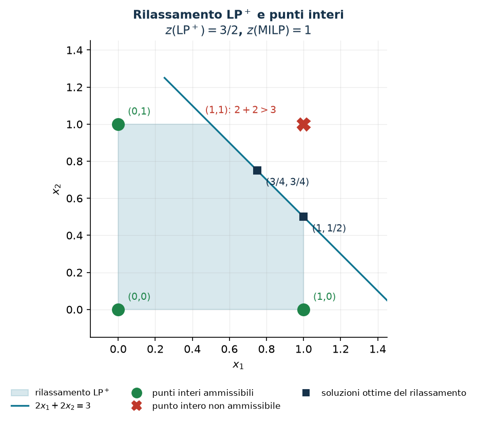

# Che cos'è un modello MIP

**Classe:** LP · ILP · BIP · MILP · **Script:** `python/cap01_modelli.py`

[](https://colab.research.google.com/github/fabiofurini/modellazione-mip/blob/main/notebooks/cap01_modelli.ipynb)

## Dati, variabili, obiettivo, vincoli

Un modello di *programmazione matematica* traduce una decisione in quattro
ingredienti, sempre nello stesso ordine: i **dati** (i numeri noti prima di
decidere), le **variabili** (quello che il decisore controlla), l'**obiettivo**
(una funzione delle variabili da minimizzare o massimizzare) e i **vincoli** (le
equazioni e disequazioni che rendono realizzabile una soluzione).

!!! note "Notazione dei valori ottimi"
    $X$ è l'**insieme ammissibile** (i punti che soddisfano tutti i vincoli,
    domini compresi); $z(\mathit{MILP})$, $z(\mathit{LP})$, $z(\mathit{D})$ sono
    i valori ottimi del MILP, del suo rilassamento e del duale del rilassamento.
    Le soluzioni **ammissibili** si segnano con la barra ($\bar x$), quelle
    **ottime** con la tilde ($\tilde x$). I bound si chiamano $\mathit{LB}$ e
    $\mathit{UB}$, qualunque sia il verso dell'obiettivo; quando serve dire da
    quale soluzione arrivano si scrive $\mathit{LB}(\bar x)$, $\mathit{UB}(\bar x)$
    per una soluzione ammissibile del modello e $\mathit{LB}(\bar\pi)$,
    $\mathit{UB}(\bar\pi)$ per una soluzione ammissibile del duale. Si usa sempre
    $z(\mathit{MILP})$ e mai $z^\star$: quale modello si ottimizza deve essere
    esplicito.

**Classi di modelli.** LP dritto è la *classe* di problemi, $\mathit{LP}$ in
corsivo è *un* problema di quella classe; lo stesso per ILP, BIP e MILP. Un
modello ha $n$ variabili, con $j \in \{1, 2, \dots, n\}$, e $m$ vincoli, con
$i \in \{1, 2, \dots, m\}$; i dati sono i costi $c_j$, i coefficienti $a_{ij}$ e
i termini noti $b_i$.

**Che cosa può contenere un modello:**

- una **funzione obiettivo lineare** nelle variabili, da minimizzare o da
  massimizzare;
- **vincoli lineari** di tre tipi: di verso $\ge$, per una richiesta da
  soddisfare; di verso $\le$, per una capacità da rispettare; di uguaglianza,
  per un bilancio o un'assegnazione esatta;
- **variabili**, in una o più famiglie, ciascuna con il proprio dominio,
  dichiarato in fondo al modello.

Nessuna delle tre cose ha una forma obbligata: quanti vincoli, di quale tipo e
con quante famiglie di variabili lo decide il problema.

**Che cosa distingue le quattro classi: i domini.**

- **LP**: tutte le variabili continue. In questo corso un modello di LP non si
  scrive mai da zero: arriva come *rilassamento* di un modello MIP, quando si
  lasciano cadere i vincoli di interezza.
- **ILP**: tutte le variabili intere.
- **BIP**: tutte le variabili binarie.
- **MILP**: alcune intere o binarie e altre continue.

È lì che vive la differenza di difficoltà: un LP si risolve in tempo
polinomiale, un ILP e un MILP in generale no.

!!! example "Un modello di ILP"
    Quante unità comprare da due fornitori, $x_1$ e $x_2$, a lotti interi.

    $$
    \begin{array}{r r c r c l}
    \min & 4x_1 & + & 7x_2 &  & \\
    \text{soggetto a} & 2x_1 & + & 3x_2 & \ge & 12,\\
     & x_1 & + & x_2 & \le & 5,\\
     & x_1 & , & x_2 & \in & \mathbb{Z}_{\ge 0}.
    \end{array}
    $$

    L'obiettivo minimizza la spesa; il vincolo $\ge$ copre la domanda di $12$
    unità, quello $\le$ limita a cinque i lotti totali. Tutte le variabili sono
    intere: è un ILP.

!!! example "Un modello di BIP"
    Quali progetti finanziare: $y_k = 1$ se il progetto $k$ si finanzia, $0$
    altrimenti.

    $$
    \begin{array}{r r c r c r c l}
    \max & 5y_1 & + & 4y_2 & + & 6y_3 &  & \\
    \text{soggetto a} & y_1 & + & y_2 & + & y_3 & \le & 2,\\
     & y_1 &  &  & + & y_3 & \ge & 1,\\
     & y_1 & , & y_2 & , & y_3 & \in & \{0, 1\}.
    \end{array}
    $$

    L'obiettivo massimizza il valore dei progetti scelti; il vincolo $\le$ ne
    ammette al più due, quello $\ge$ impone almeno uno fra il primo e il terzo.
    Tutte le variabili sono binarie: è un BIP.

!!! example "Un modello di MILP"
    Due prodotti da fabbricare, con $x_1$ e $x_2$ le quantità prodotte, e un
    impianto da attivare o no, con $y = 1$ se lo si attiva e $y = 0$ altrimenti.

    $$
    \begin{array}{r r c r c r c l}
    \max & 3x_1 & + & 8x_2 & - & 10y &  & \\
    \text{soggetto a} & x_1 & + & x_2 &  &  & = & 6,\\
     &  &  & x_2 & - & 4y & \le & 0,\\
     & x_1 &  &  &  &  & \ge & 1,\\
     & x_1 & , & x_2 &  &  & \ge & 0,\\
     &  &  &  &  & y & \in & \{0, 1\}.
    \end{array}
    $$

    L'obiettivo massimizza il ricavo meno il costo dell'impianto; l'uguaglianza
    impone di produrre esattamente sei unità, il vincolo $\le$ consente al più
    quattro unità del secondo prodotto e solo a impianto attivo (con $y = 0$
    resta $x_2 \le 0$), il vincolo $\ge$ chiede almeno un'unità del primo. Due
    variabili continue e una binaria: è un MILP.

Ogni dato e ogni simbolo è definito prima di essere usato: in ogni modello le
variabili sono introdotte prima della formulazione, i vincoli di dominio
chiudono il modello e un elenco spiega obiettivo e vincoli famiglia per
famiglia. Questo corso lavora quasi solo con MILP.

## Perché l'interezza conta

$$
\begin{aligned}
\max ~~ x_1 + x_2 & & \\
\text{soggetto a} \quad 2x_1 + 2x_2 &\le 3, & \\
x_1,\ x_2 &\in \{0,1\}. &
\end{aligned}
$$

Il rilassamento LP sostituisce $x_1, x_2 \in \{0,1\}$ con $0 \le x_1, x_2 \le 1$
e vale $z(\mathit{LP}^+) = 3/2$. Quel valore è raggiunto da **infinite**
soluzioni ottime — tutti i punti del segmento $x_1 + x_2 = 3/2$ dentro il
quadrato — fra cui $(3/4, 3/4)$, $(1, 1/2)$ e $(1/2, 1)$. Quale il solver
restituisca dipende dall'algoritmo: sulla nostra installazione Gurobi dà
$(1/2, 1)$.

L'esito dell'arrotondamento dipende dal punto di partenza **e** dal verso. Da
$(3/4, 3/4)$: per eccesso si ottiene $(1,1)$, che viola il vincolo
($2+2 = 4 > 3$); per difetto si ottiene $(0,0)$, ammissibile ma di valore $0$.
Da questo punto **nessuno** dei due versi trova l'ottimo. Da $(1, 1/2)$: per
eccesso si ottiene ancora $(1,1)$, non ammissibile; per difetto si ottiene
$(1, 0)$, ammissibile di valore $1$ — che è proprio l'ottimo intero,
$z(\mathit{MILP}) = 1$. Non c'è un verso «giusto».



Due lezioni distinte: l'arrotondamento può produrre punti **non ammissibili**, e
quando ne produce di ammissibili non c'è garanzia sul loro valore; e il divario
$3/2 - 1 = 1/2$ non è colpa dell'arrotondamento — nessun punto intero
ammissibile vale più di $1$.

## I due rilassamenti, e da che parte stanno

!!! note "Due versioni da non confondere"
    - **rilassamento senza i bound** $z(\mathit{LP})$: $x \in \{0,1\}$ diventa il solo
      $x \ge 0$. È quello di cui negli esercizi si scrive il duale a mano.
    - **rilassamento con i bound** $z(\mathit{LP}^+)$:
      $x \in \{0,1\}$ diventa $0 \le x \le 1$. È `relax()` di Gurobi, il primo
      rilassamento che il solver risolve.

    In un massimo $z(\mathit{LP}) \ge z(\mathit{LP}^+) \ge z(\mathit{MILP})$; in
    un minimo i versi si rovesciano. I due coincidono quando gli altri vincoli
    implicano già $x \le 1$ — per esempio con un vincolo di assegnamento
    $\sum_m x_{jm} = 1$.

Il rilassamento **toglie** vincoli, quindi

$$X_{\mathit{MILP}} \subseteq X_{\mathit{LP}^+} \subseteq X_{\mathit{LP}},$$

e ottimizzare su un insieme più grande non può dare un valore peggiore. In un
massimo il rilassamento è un *upper* bound, in un minimo un *lower* bound: in
entrambi i casi è un bound **ottimistico**.

!!! warning "Da quale lato arriva ciascun bound"
    Il duale del rilassamento **non** dà un bound «dall'altro lato». Per dualità
    debole, in un minimo ogni soluzione duale ammissibile vale al più
    $z(\mathit{LP})$, quindi al più $z(\mathit{MILP})$: sta dalla *stessa* parte
    del rilassamento. Il bound dall'altro lato — quello *pessimistico* — viene
    solo da una soluzione ammissibile del MILP, cioè da un'euristica o dal
    solver. Sia $(\bar x_1, \bar x_2, \dots, \bar x_n)$ una soluzione ammissibile
    del MILP, di valore $\sum_{j=1}^{n} c_j\, \bar x_j$, e
    $(\bar\pi_1, \bar\pi_2, \dots, \bar\pi_m)$ una soluzione ammissibile del
    duale del rilassamento, di valore $\sum_{i=1}^{m} b_i\, \bar\pi_i$. In un
    problema di **minimo** la prima dà $\mathit{UB}(\bar x)$ e la seconda
    $\mathit{LB}(\bar\pi)$:

    $$\mathit{LB}(\bar\pi) \le z(\mathit{D}(\mathit{LP})) = z(\mathit{LP}) \le z(\mathit{LP}^+) \le z(\mathit{MILP}) \le \mathit{UB}(\bar x)$$

    in un problema di **massimo** i ruoli si scambiano, la prima dà
    $\mathit{LB}(\bar x)$ e la seconda $\mathit{UB}(\bar\pi)$:

    $$\mathit{LB}(\bar x) \le z(\mathit{MILP}) \le z(\mathit{LP}^+) \le z(\mathit{LP}) = z(\mathit{D}(\mathit{LP})) \le \mathit{UB}(\bar\pi)$$

## Tre «gap» da non confondere

1. **Gap dell'euristica.** Se $\bar x$ è la soluzione costruita dall'euristica,
   il suo valore $\sum_{j=1}^{n} c_j\, \bar x_j$ è il bound $\mathit{UB}(\bar x)$
   in un minimo (e $\mathit{LB}(\bar x)$ in un massimo), e il gap è
   $\bigl|\mathit{UB}(\bar x) - z(\mathit{MILP})\bigr| / |z(\mathit{MILP})|$
   quando l'ottimo è noto — è quello riportato nelle tabelle degli esercizi.
   Quando l'ottimo non è noto lo si calcola rispetto a un bound duale, che ne
   prende il posto.
2. **Divario certificato** fra due bound noti, senza conoscere l'ottimo:
   $(\mathit{UB} - \mathit{LB})/|\mathit{UB}|$ per un minimo con
   $\mathit{UB} > 0$. Garantisce che l'ottimo stia nell'intervallo, non che sia
   vicino a un estremo.
3. **`MIPGap` del solver**: la stessa idea, calcolata da Gurobi con i suoi
   `ObjVal` e `ObjBound` e le sue tolleranze.

Il numeratore è sempre in valore assoluto; se il denominatore è nullo il gap
relativo non si scrive e si riporta la differenza assoluta.

## Tre pattern che tornano ovunque

| Nome | Vincolo | Significato |
|---|---|---|
| **set partitioning** | $\sum_{i \in I} x_i = 1$ | esattamente un elemento di $I$ |
| **set packing** | $\sum_{i \in I} x_i \le 1$ | al più un elemento di $I$ |
| **set covering** | $\sum_{i \in I} x_i \ge 1$ | almeno un elemento di $I$ |

Il problema [7.1](scheduling-1.md) usa un *partitioning* per ogni lavoro, il
[7.3](scheduling-3.md) un *packing*, e il [capitolo 2](modellazione-2.md) mostra
il *covering* come traduzione diretta di una clausola OR.

## Che cosa fa il solver con i due bound

Un MILP con insieme ammissibile limitato si risolve con algoritmi dedicati. Come
funzionano — come si esplora lo spazio delle soluzioni, come si separano i
tagli, come si sceglie su che cosa ramificare — non è argomento di questo corso:
le tecniche risolutive sono materia di un corso a parte. Qui interessa una cosa
sola: i due bound che questo corso insegna a costruire a mano sono esattamente
quelli su cui il solver lavora.

- Il **bound primale** è una soluzione ammissibile, e dà un valore da battere:
  ogni parte dello spazio che non può fare meglio viene scartata senza
  esplorarla.
- Il **bound duale** viene dal rilassamento, e dice quanto si può sperare al
  massimo: più è vicino all'ottimo intero — cioè più la formulazione è stretta,
  si veda il [capitolo 3](legami.md) — meno lavoro resta da fare.

Il divario fra i due è quello che il solver riporta come `MIPGap`, ed è anche
l'unica cosa che si può affermare con sicurezza quando l'ottimo non si
raggiunge.

## Quello che questo capitolo lascia aperto

| Domanda | Dove si risponde |
|---|---|
| Come si traducono le condizioni logiche in vincoli lineari? | [Capitolo 2](modellazione-2.md) |
| Come si legano fra loro famiglie di variabili diverse? | [Capitolo 3](legami.md) |
| Come si costruisce a mano un bound ottimistico? | [Capitolo 4](modellazione-4.md) |
| Come si costruisce in fretta una soluzione ammissibile? | [Capitolo 5](modellazione-5.md) |
| Come si scrive tutto in Python/Gurobi e come si leggono i risultati? | [Capitolo 6](modellazione-6.md) |

## Codice

Lo script completo — i due rilassamenti, l'arrotondamento e la figura — è
[`python/cap01_modelli.py`](https://github.com/fabiofurini/modellazione-mip/blob/main/python/cap01_modelli.py)
(riproducibile con `python3 python/cap01_modelli.py` dalla cartella `python/`).
Lo stesso codice è disponibile come notebook —
[`notebooks/cap01_modelli.ipynb`](https://github.com/fabiofurini/modellazione-mip/blob/main/notebooks/cap01_modelli.ipynb)
— che si apre in Colab dal badge in cima alla pagina.

<!-- script-incorporato: inizio (rigenerato da python/incorpora_codice.py) -->

??? example "Mostra lo script completo — `python/cap01_modelli.py` (119 righe)"

    ```python
    """Capitolo 1 -- Che cos'e' un modello MIP: rilassamento, arrotondamento, bound.

    Verifica numerica degli esempi del capitolo: il controesempio
    dell'arrotondamento, i due rilassamenti (puro e con i bound conservati),
    l'ottimo intero e i due bound del sandwich.
    Tutti i numeri citati nella dispensa e sul sito escono da qui.
    """
    import gurobipy as gp
    import numpy as np
    import pandas as pd
    from gurobipy import GRB

    from mip import (ammissibile, frazione, nuovo_modello, rilassamento, risolvi,
                     stampa_soluzione, valuta, viola_interezza)
    from stile import BLU, CICLO, GRIGIO, ROSSO, TEAL, VERDE, intestazione, plt, salva_dati, salva_figura

    R = range

    # ---------- 1. IL MODELLO DELL'ESEMPIO ----------
    intestazione("1. max x1 + x2  s.t.  2x1 + 2x2 <= 3,  x1, x2 binarie")


    def modello_esempio(binarie=True, superiore=True):
        """Il modello (1.1) del capitolo.

        binarie=True   -> MILP;  binarie=False -> rilassamento continuo
        superiore=True -> si conserva x <= 1 (rilassamento LP+); False -> solo x >= 0
        """
        m = nuovo_modello("arrotondamento")
        tipo = GRB.BINARY if binarie else GRB.CONTINUOUS
        ub = 1.0 if superiore else GRB.INFINITY
        x = m.addVars(2, vtype=tipo, lb=0.0, ub=ub, name="x")
        m.setObjective(x[0] + x[1], GRB.MAXIMIZE)
        m.addConstr(2 * x[0] + 2 * x[1] <= 3, name="risorsa")
        return m, x


    # ---------- 2. I DUE RILASSAMENTI ----------
    intestazione("2. I due rilassamenti: puro (x >= 0) e con i bound conservati (x <= 1)")
    m_lp, x_lp = modello_esempio(binarie=False, superiore=False)
    zlp = risolvi(m_lp)
    print(f"Rilassamento senza i bound   z(LP)  = {frazione(zlp)}   soluzione restituita dal solver:")
    stampa_soluzione(m_lp)
    m_lpp, x_lpp = modello_esempio(binarie=False, superiore=True)
    zlpp = risolvi(m_lpp)
    vertice = (x_lpp[0].X, x_lpp[1].X)
    print(f"Rilassamento LP+    z(LP+) = {frazione(zlpp)}   soluzione restituita dal solver: "
          f"({frazione(vertice[0])}, {frazione(vertice[1])})")
    print("Entrambi valgono 3/2: il vincolo di risorsa da' gia' x1 + x2 <= 3/2, e il")
    print("limite x <= 1 non taglia nessun punto di quel segmento.")

    # tutte le soluzioni ottime del rilassamento LP+ sono il segmento x1 + x2 = 3/2 in [0,1]^2
    for punto in [(0.75, 0.75), (1.0, 0.5), (0.5, 1.0)]:
        z, viol = valuta(m_lpp, {"x[0]": punto[0], "x[1]": punto[1]})
        assert viol <= 1e-9 and abs(z - 1.5) <= 1e-9
        print(f"  ({frazione(punto[0])}, {frazione(punto[1])}) e' ammissibile per LP+ e vale "
              f"{frazione(z)}: e' una delle infinite soluzioni ottime.")

    # ---------- 3. PERCHE' L'ARROTONDAMENTO FALLISCE ----------
    intestazione("3. Arrotondamento delle soluzioni frazionarie")
    m_mip, x_mip = modello_esempio(binarie=True)
    for base in [(0.75, 0.75), (1.0, 0.5)]:
        for verso, arr in [("piu' vicino", lambda v: round(v)), ("verso il basso", int)]:
            cand = {"x[0]": float(arr(base[0])), "x[1]": float(arr(base[1]))}
            z, viol = valuta(m_mip, cand)
            ok = ammissibile(m_mip, cand)
            print(f"  da ({frazione(base[0])}, {frazione(base[1])}) arrotondando {verso:14s} -> "
                  f"({frazione(cand['x[0]'])}, {frazione(cand['x[1]'])})  "
                  f"{'ammissibile, valore ' + frazione(z) if ok else f'NON ammissibile (violazione {viol:g})'}")
    assert not ammissibile(m_mip, {"x[0]": 1.0, "x[1]": 1.0})
    assert ammissibile(m_mip, {"x[0]": 1.0, "x[1]": 0.0})
    # il controllo di interezza serve davvero: (1, 1/2) soddisfa i vincoli lineari ma non e' intera
    assert valuta(m_mip, {"x[0]": 1.0, "x[1]": 0.5})[1] <= 1e-9
    assert viola_interezza(m_mip, {"x[0]": 1.0, "x[1]": 0.5}) == 0.5
    assert not ammissibile(m_mip, {"x[0]": 1.0, "x[1]": 0.5})
    print("  (1, 1/2) soddisfa i vincoli lineari ma viola l'interezza di 1/2:")
    print("  la sola ammissibilita' continua non certifica un bound primale intero.")

    # ---------- 4. L'OTTIMO INTERO ----------
    intestazione("4. L'ottimo intero")
    zmilp = risolvi(m_mip)
    print(f"z(MILP) = {frazione(zmilp)}   soluzione ottima:")
    stampa_soluzione(m_mip)
    print(f"Divario fra rilassamento e ottimo intero: {frazione(zlpp)} - {frazione(zmilp)} = "
          f"{frazione(zlpp - zmilp)}")
    salva_dati(pd.DataFrame([{"modello": "esempio 1.1", "z_lp": zlp, "z_lp_rafforzato": zlpp,
                              "z_milp": zmilp}]), "cap01_bound")


    # ---------- 6. FIGURA: LA REGIONE AMMISSIBILE E I PUNTI INTERI ----------
    fig, ax = plt.subplots(figsize=(5.4, 5.0))
    # poligono ammissibile del rilassamento LP+: {0<=x<=1, 2x1+2x2<=3}
    poligono = [(0, 0), (1, 0), (1, 0.5), (0.5, 1), (0, 1)]
    ax.fill(*zip(*poligono), color=TEAL, alpha=0.16, zorder=1,
            label="rilassamento LP$^+$")
    ax.plot([0.25, 1.5], [1.25, 0.0], color=TEAL, lw=1.6, zorder=2,
            label="$2x_1 + 2x_2 = 3$")
    for (p, q) in [(0, 0), (1, 0), (0, 1)]:
        ax.plot(p, q, "o", color=VERDE, ms=11, zorder=4)
        ax.annotate(f"({p},{q})", (p, q), textcoords="offset points", xytext=(9, 9),
                    fontsize=9, color=VERDE)
    ax.plot(1, 1, "X", color=ROSSO, ms=12, zorder=4)
    ax.annotate("(1,1): $2+2 > 3$", (1, 1), textcoords="offset points", xytext=(-92, 10),
                fontsize=9, color=ROSSO)
    for (p, q), testo in [((0.75, 0.75), "$(3/4,3/4)$"), ((1.0, 0.5), "$(1,1/2)$")]:
        ax.plot(p, q, "s", color=BLU, ms=7, zorder=4)
        ax.annotate(testo, (p, q), textcoords="offset points", xytext=(8, -14), fontsize=9, color=BLU)
    ax.plot([], [], "o", color=VERDE, ms=9, label="punti interi ammissibili")
    ax.plot([], [], "X", color=ROSSO, ms=9, label="punto intero non ammissibile")
    ax.plot([], [], "s", color=BLU, ms=6, label="soluzioni ottime del rilassamento")
    ax.set_xlim(-0.15, 1.45)
    ax.set_ylim(-0.15, 1.45)
    ax.set_xlabel("$x_1$")
    ax.set_ylabel("$x_2$")
    ax.set_title("Rilassamento LP$^+$ e punti interi\n$z(\\mathrm{LP}^+) = 3/2$, $z(\\mathrm{MILP}) = 1$")
    ax.legend(loc="upper right", fontsize=8)
    ax.set_aspect("equal")
    salva_figura(fig, "cap01_rilassamento")
    print("Fine.")
    ```

<!-- script-incorporato: fine -->
