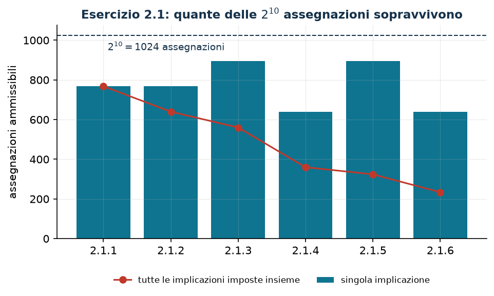

# Logica e variabili binarie

**Classe:** BIP · **Legami:** clausole e implicazioni · **Script:** `python/cap02_logica.py`

[](https://colab.research.google.com/github/fabiofurini/modellazione-mip/blob/main/notebooks/cap02_logica.ipynb)

Una variabile binaria è una risposta «sì/no». Questo capitolo traduce in
**vincoli lineari** le condizioni logiche fra quelle risposte, e — soprattutto —
mostra come *dimostrare* che la traduzione è esatta.

## Proposizioni, espressioni, soddisfacibilità

Una funzione booleana restituisce `TRUE` o `FALSE` e si rappresenta con
$x \in \{0,1\}$: $x = 1$ se e solo se la proposizione è vera. Un'**espressione
booleana** si costruisce con variabili binarie, i tre operatori `AND` ($\land$),
`OR` ($\lor$), `NOT` ($\lnot$) e le parentesi. Il **problema di
soddisfacibilità** chiede se esiste un'assegnazione che rende vera l'espressione.

!!! example "Soddisfacibili e no"
    - `NOT` $x_a$ `OR` $\big((x_b$ `OR` $x_c)$ `AND` $(x_d$ `OR` $x_e)\big)$ è
      soddisfatta da $x_a = 0$.
    - $(x_a$ `OR` $x_b)$ `AND` $(x_c$ `OR` $x_d)$ `AND` `NOT` $x_e$ è
      soddisfatta da $x_a = x_c = 1$, $x_b = x_d = x_e = 0$.
    - $(x_a \lor x_b) \land (\lnot x_a \lor x_b) \land (x_a \lor \lnot x_b) \land (\lnot x_a \lor \lnot x_b)$
      è **insoddisfacibile**: ciascuna delle quattro assegnazioni di
      $(x_a, x_b)$ falsifica una clausola.

## Letterali, clausole, forma normale congiuntiva

Un **letterale** è una variabile o la sua negazione; una **clausola** è una
disgiunzione di letterali; un'espressione è in **forma normale congiuntiva**
(CNF) se è una congiunzione di clausole.

Le equivalenze che servono, per ogni $x_a, x_b, x_c \in \{0,1\}$:

$$
\begin{aligned}
x_a \land (x_b \lor x_c) &\iff (x_a \land x_b) \lor (x_a \land x_c) &&\text{(distributiva C)}\\
x_a \lor (x_b \land x_c) &\iff (x_a \lor x_b) \land (x_a \lor x_c) &&\text{(distributiva D)}\\
\lnot(x_a \lor x_b) &\iff \lnot x_a \land \lnot x_b &&\text{(De Morgan A)}\\
\lnot(x_a \land x_b) &\iff \lnot x_a \lor \lnot x_b &&\text{(De Morgan B)}\\
x_a \lor (x_a \land x_b) &\iff x_a &&\text{(assorbimento E)}\\
x_a \land (x_a \lor x_b) &\iff x_a &&\text{(assorbimento F)}\\
\lnot(\lnot x_a) &\iff x_a &&\text{(doppia negazione)}
\end{aligned}
$$

Ognuna si dimostra per casi: con due variabili ci sono $4$ assegnazioni, con tre
ce ne sono $8$. Lo script esegue il controllo su tutte e sette.

!!! tip "Raccogliere: la distributiva (C) letta al contrario"
    $(x_a \land x_b) \lor (x_a \land x_c) \iff x_a \land (x_b \lor x_c)$. Serve
    quando si porta in CNF una disgiunzione di più congiunzioni con letterali in
    comune. Per esempio «almeno due fra $a, b, c$», cioè
    $(x_a \land x_b) \lor (x_a \land x_c) \lor (x_b \land x_c)$, diventa

    $$(x_a \lor x_b) \land (x_a \lor x_c) \land (x_b \lor x_c).$$

## Da CNF a vincoli lineari

!!! note "La traduzione, in tre regole"
    1. ogni **clausola** diventa un vincolo di disuguaglianza $\ge 1$;
    2. ogni `OR` dentro la clausola diventa un $+$;
    3. ogni letterale negativo `NOT` $x$ diventa $1 - x$.

Una clausola con letterali positivi $P$ e negativi $N$ diventa

$$\sum_{i \in P} x_i + \sum_{i \in N} (1 - x_i) \ge 1
\iff \sum_{i \in P} x_i - \sum_{i \in N} x_i \ge 1 - |N|.$$

Il membro sinistro conta **quanti letterali della clausola sono veri**:
chiedere che sia $\ge 1$ è chiedere che la clausola sia vera.

!!! warning "La forma in cui si scrive il vincolo"
    Con due o più letterali negativi si preferisce la forma equivalente ottenuta
    moltiplicando per $-1$: $1 - x_1 + 1 - x_6 + x_7 \ge 1$ si scrive
    $x_1 + x_6 - x_7 \le 1$. È lo stesso vincolo. Quello che non cambia è il
    numero di vincoli: **uno per clausola**, contate dopo aver tolto le
    tautologie e le clausole assorbite.

## Implicazioni logiche

$x_a \Rightarrow x_b$ equivale a `NOT` $x_a$ `OR` $x_b$, già in CNF, cioè a
$x_b - x_a \ge 0$. La **contronominale** $\lnot x_b \Rightarrow \lnot x_a$ non è
un secondo vincolo: la sua espressione, per doppia negazione, è la stessa.

| Implicazione | Espressione in CNF | Vincoli | # |
|---|---|---|---|
| $x_a \land x_b \Rightarrow x_c$ | $\lnot x_a \lor \lnot x_b \lor x_c$ | $x_a + x_b - x_c \le 1$ | 1 |
| $x_a \lor x_b \Rightarrow x_c$ | $(\lnot x_a \lor x_c) \land (\lnot x_b \lor x_c)$ | $x_c - x_a \ge 0$, $x_c - x_b \ge 0$ | 2 |
| $x_a \Rightarrow x_b \land x_c$ | $(\lnot x_a \lor x_b) \land (\lnot x_a \lor x_c)$ | $x_b - x_a \ge 0$, $x_c - x_a \ge 0$ | 2 |
| $x_a \Rightarrow x_b \lor x_c$ | $\lnot x_a \lor x_b \lor x_c$ | $x_b + x_c - x_a \ge 0$ | 1 |

Una **disgiunzione nell'antecedente** e una **congiunzione nel conseguente**
costano due vincoli; il contrario ne costa uno.

## Scindere un'implicazione: quando si può

$$(x_a \lor x_b) \Rightarrow x_c \iff (x_a \Rightarrow x_c) \land (x_b \Rightarrow x_c)$$
$$x_a \Rightarrow (x_b \land x_c) \iff (x_a \Rightarrow x_b) \land (x_a \Rightarrow x_c)$$

!!! danger "La scissione con l'antecedente congiunzione **non** è valida"
    $(x_a \land x_b) \Rightarrow x_c$ **non** equivale a
    $(x_a \Rightarrow x_c) \land (x_b \Rightarrow x_c)$. Con $x_a = 1$,
    $x_b = 0$, $x_c = 0$ l'implicazione originale è *vera* (antecedente falso)
    ma $x_a \Rightarrow x_c$ è *falsa*: la congiunzione delle due scisse è
    **strettamente più forte** e taglia soluzioni che il problema ammette.

## Contare: al più uno, almeno uno, esattamente uno

| Condizione | Vincolo | Nota |
|---|---|---|
| almeno uno | $\sum_{i \in I} x_i \ge 1$ | è la clausola: *set covering* |
| al più uno | $\sum_{i \in I} x_i \le 1$ | *set packing*; equivale a $\binom{|I|}{2}$ clausole, ma in un vincolo solo e più stretto |
| esattamente uno | $\sum_{i \in I} x_i = 1$ | *set partitioning* |
| almeno $p$ | $\sum_{i \in I} x_i \ge p$ | in CNF servirebbero $\binom{|I|}{|I|-p+1}$ clausole |
| al più $p$ | $\sum_{i \in I} x_i \le p$ | in CNF servirebbero $\binom{|I|}{p+1}$ clausole |

!!! tip "Un vincolo di cardinalità vale più di molte clausole"
    «Al più uno fra tre» si scrive come tre clausole ($x_1+x_2 \le 1$,
    $x_1+x_3 \le 1$, $x_2+x_3 \le 1$) o come $x_1+x_2+x_3 \le 1$. Stesse
    soluzioni binarie, rilassamenti diversi: $x = (1/2,1/2,1/2)$ soddisfa le tre
    clausole e viola il vincolo aggregato. Quando si può contare, si conta.

## Verificare la traduzione, non fidarsene

Una traduzione è corretta quando, per **ogni** assegnazione binaria,
l'espressione è vera se e solo se tutti i vincoli sono soddisfatti. Con poche
variabili è un'enumerazione di $2^n$ casi: è la dimostrazione, per casi, del
risultato. Il modulo
[`python/booleane.py`](https://github.com/fabiofurini/modellazione-mip/blob/main/python/booleane.py)
la esegue, e tutte le traduzioni qui sotto sono verificate così.

## Cinque esercizi risolti

In tutti, $x_p = 1$ se il progetto $p$ è scelto.

??? question "2.1 — Implicazioni dirette (dieci progetti)"
    (1) se si sceglie il 2 allora si sceglie il 3; (2) se si sceglie il 2 allora
    non si sceglie il 4; (3) se si scelgono l'1 e il 6 allora si sceglie il 7;
    (4) se si sceglie l'1 oppure il 6 allora si sceglie l'8; (5) se si scelgono
    il 2 e il 3 allora non si sceglie il 9; (6) se si sceglie il 2 oppure il 3
    allora non si sceglie il 10.

    !!! tip "Soluzione"
        La soluzione è nel documento delle soluzioni, riservato ai docenti.
??? question "2.2 — Antecedenti e conseguenti negati (dieci progetti)"
    (1) $\lnot x_3 \Rightarrow x_2$; (2) $\lnot x_4 \Rightarrow \lnot x_2$;
    (3) $x_7 \Rightarrow x_1 \land x_6$; (4) $x_8 \Rightarrow x_1 \lor x_6$;
    (5) $\lnot x_9 \Rightarrow x_2 \land x_3$;
    (6) $\lnot x_{10} \Rightarrow x_2 \lor x_3$.

    !!! tip "Soluzione"
        La soluzione è nel documento delle soluzioni, riservato ai docenti.
??? question "2.3 — Antecedenti e conseguenti composti (otto progetti)"
    (1) $x_7 \lor x_3 \Rightarrow x_1 \land x_2$;
    (2) $x_1 \land x_6 \land x_7 \Rightarrow x_8$;
    (3) $x_5 \land x_2 \land \lnot x_4 \Rightarrow \lnot x_3$;
    (4) $(x_1 \lor x_4) \land x_6 \Rightarrow x_2 \land (x_5 \lor x_7)$;
    (5) $(x_2 \lor x_5) \land \lnot x_8 \Rightarrow x_3 \lor \lnot x_6$;
    (6) $(x_1 \lor x_4) \land (x_2 \lor x_5) \land \lnot x_8 \Rightarrow x_3 \land (\lnot x_6 \lor x_7)$.

    !!! tip "Soluzione"
        La soluzione è nel documento delle soluzioni, riservato ai docenti.
??? question "2.4 — «Almeno due fra» (nove progetti)"
    (1) $x_4 \Rightarrow$ almeno due fra 1, 2, 3; (2) almeno due fra 6, 7, 8
    $\Rightarrow x_5$; (3) $\lnot x_4 \Rightarrow$ almeno due fra 1, 2, 3, 9;
    (4) $x_8 \Rightarrow (x_1 \land x_6) \lor (x_1 \land x_7) \lor (x_2 \land x_6)$;
    (5) almeno due fra 1, 3, 5 $\Rightarrow \lnot x_9$;
    (6) $(x_1 \land x_2) \lor (x_3 \land x_4) \Rightarrow x_5$.

    !!! tip "Soluzione"
        La soluzione è nel documento delle soluzioni, riservato ai docenti.
    !!! warning "«Almeno due» si scrive anche contando"
        Come conseguente dell'implicazione governata da $x_4$, la condizione è
        anche $x_1 + x_2 + x_3 \ge 2 x_4$: un vincolo invece di tre, con le
        stesse $16$ soluzioni binarie ma **più forte** nel rilassamento. Su
        $\max x_1+x_2+x_3+3x_4$ con $x_1+x_2+x_3+2x_4 \le 3$ e
        $z(\mathit{MILP}) = 3$, le tre clausole danno
        $z(\mathit{LP}^+) = 27/7 \approx 3{,}86$ e il vincolo contato
        $15/4 = 3{,}75$.

??? question "2.5 — Scissioni (dieci progetti)"
    (1) $x_1 \lor x_2 \Rightarrow x_3$; (2) $x_4 \Rightarrow x_5 \land x_6$;
    (3) $x_1 \lor x_2 \Rightarrow x_3 \land x_4$;
    (4) $x_1 \land x_2 \Rightarrow x_3$; (5) $x_5 \lor x_6 \Rightarrow \lnot x_7$;
    (6) $\lnot x_8 \lor \lnot x_9 \Rightarrow x_{10}$.

    !!! tip "Soluzione"
        La soluzione è nel documento delle soluzioni, riservato ai docenti.
## I vincoli logici dentro un modello di ottimizzazione

Con i dieci progetti dell'esercizio 2.1, ricavi e costi

| progetto $p$ | 1 | 2 | 3 | 4 | 5 | 6 | 7 | 8 | 9 | 10 |
|---|---:|---:|---:|---:|---:|---:|---:|---:|---:|---:|
| ricavo $r_p$ | 9 | 7 | 4 | 8 | 3 | 6 | 2 | 5 | 7 | 6 |
| costo $b_p$ | 4 | 3 | 2 | 4 | 2 | 3 | 1 | 3 | 4 | 3 |

e budget $B = 14$:

$$
\begin{aligned}
\max ~~ \sum_{p=1}^{10} r_p x_p & &\\
\text{soggetto a}\quad \sum_{p=1}^{10} b_p x_p &\le B, &\\
\text{gli 8 vincoli} &\text{ dell'esercizio 2.1}, &\\
x_p &\in \{0,1\}. &
\end{aligned}
$$

Senza i vincoli logici l'ottimo è $30$. Con i vincoli logici scende a
$z(\mathit{MILP}) = 28$, con i progetti $1, 2, 3, 5, 8$ di costo complessivo
$14$: il budget è saturo. Il rilassamento $z(\mathit{LP}^+)$ vale $29$.

!!! tip "Quanto tagliano sei implicazioni"
    Le $2^{10} = 1024$ assegnazioni si riducono a $234$ quando si impongono
    tutte e sei le implicazioni: meno di un quarto. Nessuna, da sola, taglia più
    della metà dello spazio.



```python
from booleane import cnf, vincolo, IMP, AND, OR, NOT, V

x = {p: V(f"x{p}") for p in range(1, 11)}
implicazioni = [IMP(x[2], x[3]), IMP(x[2], NOT(x[4])),
                IMP(AND(x[1], x[6]), x[7]), IMP(OR(x[1], x[6]), x[8]),
                IMP(AND(x[2], x[3]), NOT(x[9])), IMP(OR(x[2], x[3]), NOT(x[10]))]

m = gp.Model("selezione_progetti");  m.Params.OutputFlag = 0
xv = m.addVars(range(1, 11), vtype=GRB.BINARY, name="x")
m.setObjective(gp.quicksum(r[p] * xv[p] for p in range(1, 11)), GRB.MAXIMIZE)
m.addConstr(gp.quicksum(b[p] * xv[p] for p in range(1, 11)) <= budget, name="budget")
for i, formula in enumerate(implicazioni, 1):          # una clausola, un vincolo
    for j, clausola in enumerate(cnf(formula), 1):
        coef, verso, rhs = vincolo(clausola)
        lhs = gp.quicksum(k * xv[int(n[1:])] for n, k in coef.items())
        m.addConstr(lhs <= rhs if verso == "<=" else lhs >= rhs, name=f"logica{i}_{j}")
m.optimize()
```

## Che cosa resta al capitolo successivo

Qui i legami sono fra variabili **tutte binarie**. Quando una delle famiglie è
continua o intera — «se la macchina non è accesa non produce», «questa variabile
vale il massimo di quelle» — la CNF non basta più: servono i coefficienti, i
big-M e gli argomenti di ottimalità del [capitolo 3](legami.md).

## Codice

Lo script completo è
[`python/cap02_logica.py`](https://github.com/fabiofurini/modellazione-mip/blob/main/python/cap02_logica.py),
che usa il modulo
[`python/booleane.py`](https://github.com/fabiofurini/modellazione-mip/blob/main/python/booleane.py)
(riproducibili con `python3 python/cap02_logica.py` dalla cartella `python/`).
Lo stesso codice è disponibile come notebook —
[`notebooks/cap02_logica.ipynb`](https://github.com/fabiofurini/modellazione-mip/blob/main/notebooks/cap02_logica.ipynb).

<!-- script-incorporato: inizio (rigenerato da python/incorpora_codice.py) -->

??? example "Mostra lo script completo — `python/cap02_logica.py` (221 righe)"

    ```python
    """Capitolo 2 -- Logica e variabili binarie: da CNF a vincoli lineari.

    Trasforma in forma normale congiuntiva e poi in vincoli lineari le implicazioni
    dei cinque esercizi del capitolo, e *dimostra per enumerazione* che la
    traduzione e' esatta: per ogni assegnazione delle binarie, la formula e' vera se
    e solo se il sistema lineare e' soddisfatto. Conclude con un modello di
    selezione di progetti che usa quei vincoli.
    """
    import gurobipy as gp
    import pandas as pd
    from gurobipy import GRB

    from booleane import (AND, IMP, NOT, OR, V, cnf, equivalenti, scrivi, testo_cnf,
                          valuta, variabili, verifica, vincolo)
    from mip import ammissibile, frazione, nuovo_modello, rilassamento, risolvi, stampa_soluzione
    from stile import BLU, CICLO, ROSSO, TEAL, VERDE, intestazione, plt, salva_dati, salva_figura

    R = range
    x = {p: V(f"x{p}") for p in R(1, 11)}

    # ---------- 1. LE PROPRIETA' DELL'ALGEBRA BOOLEANA ----------
    intestazione("1. De Morgan, distributivita', assorbimento: verifica per enumerazione")
    a, b, c = V("xa"), V("xb"), V("xc")
    PROPRIETA = [
        ("distributivita' (C)", AND(a, OR(b, c)), OR(AND(a, b), AND(a, c))),
        ("distributivita' (D)", OR(a, AND(b, c)), AND(OR(a, b), OR(a, c))),
        ("De Morgan (A)", NOT(OR(a, b)), AND(NOT(a), NOT(b))),
        ("De Morgan (B)", NOT(AND(a, b)), OR(NOT(a), NOT(b))),
        ("assorbimento (E)", OR(a, AND(a, b)), a),
        ("assorbimento (F)", AND(a, OR(a, b)), a),
        ("doppia negazione", NOT(NOT(a)), a),
    ]
    for nome, sinistra, destra in PROPRIETA:
        assert equivalenti(sinistra, destra), nome
        print(f"  {nome:24s} verificata su tutte le {2 ** len(variabili(sinistra) | variabili(destra))} assegnazioni")

    # ---------- 2. LE SCISSIONI AMMESSE E QUELLA NON AMMESSA ----------
    intestazione("2. Scindere un'implicazione: quando si puo' e quando no")
    scissioni = [
        ("antecedente disgiunzione", IMP(OR(a, b), c), AND(IMP(a, c), IMP(b, c)), True),
        ("conseguente congiunzione", IMP(a, AND(b, c)), AND(IMP(a, b), IMP(a, c)), True),
        ("antecedente congiunzione", IMP(AND(a, b), c), AND(IMP(a, c), IMP(b, c)), False),
    ]
    for nome, sinistra, destra, attesa in scissioni:
        ok = equivalenti(sinistra, destra)
        assert ok == attesa, nome
        print(f"  {nome:26s} scissione {'valida' if ok else 'NON valida'}")
    contro = {"xa": 1, "xb": 0, "xc": 0}
    assert valuta(IMP(AND(a, b), c), contro) and not valuta(AND(IMP(a, c), IMP(b, c)), contro)
    print("  controesempio alla terza: xa = 1, xb = 0, xc = 0 rende vera l'implicazione")
    print("  originale (antecedente falso) ma falsa la congiunzione delle due scisse.")

    # ---------- 3. I CINQUE ESERCIZI: CNF E VINCOLI LINEARI ----------
    intestazione("3. Esercizi 2.1-2.5: forma normale congiuntiva e vincoli lineari")
    ESERCIZI = {
        "2.1": [("se si sceglie 2, si sceglie 3", IMP(x[2], x[3])),
                ("se si sceglie 2, non si sceglie 4", IMP(x[2], NOT(x[4]))),
                ("se si scelgono 1 e 6, si sceglie 7", IMP(AND(x[1], x[6]), x[7])),
                ("se si sceglie 1 o 6, si sceglie 8", IMP(OR(x[1], x[6]), x[8])),
                ("se si scelgono 2 e 3, non si sceglie 9", IMP(AND(x[2], x[3]), NOT(x[9]))),
                ("se si sceglie 2 o 3, non si sceglie 10", IMP(OR(x[2], x[3]), NOT(x[10])))],
        "2.2": [("se non si sceglie 3, si sceglie 2", IMP(NOT(x[3]), x[2])),
                ("se non si sceglie 4, non si sceglie 2", IMP(NOT(x[4]), NOT(x[2]))),
                ("se si sceglie 7, si scelgono 1 e 6", IMP(x[7], AND(x[1], x[6]))),
                ("se si sceglie 8, si sceglie 1 o 6", IMP(x[8], OR(x[1], x[6]))),
                ("se non si sceglie 9, si scelgono 2 e 3", IMP(NOT(x[9]), AND(x[2], x[3]))),
                ("se non si sceglie 10, si sceglie 2 o 3", IMP(NOT(x[10]), OR(x[2], x[3])))],
        "2.3": [("se si sceglie 7 o 3, si scelgono 1 e 2", IMP(OR(x[7], x[3]), AND(x[1], x[2]))),
                ("se si scelgono 1, 6 e 7, si sceglie 8", IMP(AND(x[1], x[6], x[7]), x[8])),
                ("se si scelgono 5 e 2 e non 4, non si sceglie 3",
                 IMP(AND(x[5], x[2], NOT(x[4])), NOT(x[3]))),
                ("se si sceglie 6 e (1 o 4), si sceglie 2 e (5 o 7)",
                 IMP(AND(OR(x[1], x[4]), x[6]), AND(x[2], OR(x[5], x[7])))),
                ("se si sceglie (2 o 5) e non 8, si sceglie 3 o non 6",
                 IMP(AND(OR(x[2], x[5]), NOT(x[8])), OR(x[3], NOT(x[6])))),
                ("se (1 o 4) e (2 o 5) e non 8, allora 3 e (non 6 o 7)",
                 IMP(AND(OR(x[1], x[4]), OR(x[2], x[5]), NOT(x[8])),
                     AND(x[3], OR(NOT(x[6]), x[7]))))],
        "2.4": [("se si sceglie 4, almeno due fra 1, 2, 3",
                 IMP(x[4], OR(AND(x[1], x[2]), AND(x[1], x[3]), AND(x[2], x[3])))),
                ("se almeno due fra 6, 7, 8, allora 5",
                 IMP(OR(AND(x[6], x[7]), AND(x[6], x[8]), AND(x[7], x[8])), x[5])),
                ("se non si sceglie 4, almeno due fra 1, 2, 3, 9",
                 IMP(NOT(x[4]), OR(AND(x[1], x[2]), AND(x[1], x[3]), AND(x[1], x[9]),
                                   AND(x[2], x[3]), AND(x[2], x[9]), AND(x[3], x[9])))),
                ("se si sceglie 8, allora (1 e 6) o (1 e 7) o (2 e 6)",
                 IMP(x[8], OR(AND(x[1], x[6]), AND(x[1], x[7]), AND(x[2], x[6])))),
                ("se almeno due fra 1, 3, 5, non si sceglie 9",
                 IMP(OR(AND(x[1], x[3]), AND(x[1], x[5]), AND(x[3], x[5])), NOT(x[9]))),
                ("se (1 e 2) o (3 e 4), allora 5",
                 IMP(OR(AND(x[1], x[2]), AND(x[3], x[4])), x[5]))],
        "2.5": [("se si sceglie 1 o 2, si sceglie 3", IMP(OR(x[1], x[2]), x[3])),
                ("se si sceglie 4, si scelgono 5 e 6", IMP(x[4], AND(x[5], x[6]))),
                ("se si sceglie 1 o 2, si scelgono 3 e 4",
                 IMP(OR(x[1], x[2]), AND(x[3], x[4]))),
                ("se si scelgono 1 e 2, si sceglie 3", IMP(AND(x[1], x[2]), x[3])),
                ("se si sceglie 5 o 6, non si sceglie 7", IMP(OR(x[5], x[6]), NOT(x[7]))),
                ("se non si sceglie 8 o non si sceglie 9, si sceglie 10",
                 IMP(OR(NOT(x[8]), NOT(x[9])), x[10]))],
    }
    righe = []
    for es, voci in ESERCIZI.items():
        print(f"\nEsercizio {es}")
        for i, (testo, formula) in enumerate(voci, 1):
            clausole = cnf(formula)
            vincoli = [vincolo(c) for c in clausole]
            totali, vere = verifica(formula, vincoli)
            print(f"  {es}.{i}  {testo}")
            print(f"        CNF ({len(clausole)} clausole) -> "
                  + " ;  ".join(scrivi(v, mat=False) for v in vincoli))
            print(f"        equivalenza verificata su {totali} assegnazioni "
                  f"({vere} rendono vera la formula)")
            righe.append({"esercizio": es, "punto": i, "descrizione": testo,
                          "clausole": len(clausole),
                          "vincoli": " ; ".join(scrivi(v, mat=False) for v in vincoli),
                          "assegnazioni": totali, "vere": vere})
    salva_dati(pd.DataFrame(righe), "cap02_implicazioni")

    # ---------- 4. CLAUSOLE O CONTEGGIO: DUE FORMULAZIONI DELLO STESSO INSIEME ----------
    intestazione("4. 'Almeno due fra 1, 2, 3 se si sceglie 4': clausole contro conteggio")


    def confronta(clausole=True):
        """max x1+x2+x3+3 x4 con l'implicazione x4 => almeno due fra 1,2,3."""
        m = nuovo_modello("almeno_due")
        v = m.addVars(R(1, 5), vtype=GRB.BINARY, name="x")
        m.setObjective(v[1] + v[2] + v[3] + 3 * v[4], GRB.MAXIMIZE)
        m.addConstr(v[1] + v[2] + v[3] + 2 * v[4] <= 3, name="budget")
        if clausole:                       # tre clausole: x_i + x_j >= x4 per ogni coppia
            for i, j in [(1, 2), (1, 3), (2, 3)]:
                m.addConstr(v[i] + v[j] - v[4] >= 0, name=f"coppia{i}{j}")
        else:                              # forma contata: x1 + x2 + x3 >= 2 x4
            m.addConstr(v[1] + v[2] + v[3] - 2 * v[4] >= 0, name="conteggio")
        return m, v


    for nome, cl in [("tre clausole", True), ("un vincolo contato", False)]:
        m, v = confronta(cl)
        z = risolvi(m)
        zr, sol, _ = rilassamento(m, rafforzato=True)
        print(f"  {nome:20s} z(MILP) = {frazione(z)}   z(LP+) = {frazione(zr)}   "
              + "  ".join(f"x{p}={frazione(sol[f'x[{p}]'])}" for p in R(1, 5)))
    # stesso insieme intero, rilassamenti diversi: si verifica per enumerazione
    from itertools import product as _p
    for valori in _p((0, 1), repeat=4):
        a = dict(zip(R(1, 5), valori))
        cl3 = all(a[i] + a[j] - a[4] >= 0 for i, j in [(1, 2), (1, 3), (2, 3)])
        cnt = a[1] + a[2] + a[3] - 2 * a[4] >= 0
        assert cl3 == cnt, a
    print("  Le due formulazioni hanno le stesse 16 soluzioni binarie (verificato per")
    print("  enumerazione) ma rilassamenti diversi: il vincolo contato e' piu' forte.")

    # ---------- 5. UN MODELLO DI SELEZIONE CON I VINCOLI LOGICI ----------
    intestazione("5. Selezione di progetti soggetta alle implicazioni dell'esercizio 2.1")
    r = {1: 9, 2: 7, 3: 4, 4: 8, 5: 3, 6: 6, 7: 2, 8: 5, 9: 7, 10: 6}   # ricavi
    b = {1: 4, 2: 3, 3: 2, 4: 4, 5: 2, 6: 3, 7: 1, 8: 3, 9: 4, 10: 3}   # costi
    budget = 14
    salva_dati(pd.DataFrame({"progetto": list(r), "ricavo": list(r.values()),
                             "costo": list(b.values())}), "cap02_progetti")


    def modello_selezione(con_logica=True):
        m = nuovo_modello("selezione_progetti")
        xv = m.addVars(R(1, 11), vtype=GRB.BINARY, name="x")
        m.setObjective(gp.quicksum(r[p] * xv[p] for p in R(1, 11)), GRB.MAXIMIZE)
        m.addConstr(gp.quicksum(b[p] * xv[p] for p in R(1, 11)) <= budget, name="budget")
        if con_logica:
            for i, (_, formula) in enumerate(ESERCIZI["2.1"], 1):
                for j, cl in enumerate(cnf(formula), 1):
                    coef, verso, rhs = vincolo(cl)
                    lhs = gp.quicksum(k * xv[int(n[1:])] for n, k in coef.items())
                    m.addConstr(lhs <= rhs if verso == "<=" else lhs >= rhs, name=f"logica{i}_{j}")
        return m, xv


    m_libero, _ = modello_selezione(con_logica=False)
    z_libero = risolvi(m_libero)
    m_log, x_log = modello_selezione(con_logica=True)
    z_log = risolvi(m_log)
    zlp_log, _, _ = rilassamento(m_log, rafforzato=True)
    scelti = sorted(p for p in R(1, 11) if x_log[p].X > 0.5)
    print(f"Senza i vincoli logici:  z = {frazione(z_libero)}")
    print(f"Con i vincoli logici:    z = {frazione(z_log)}   progetti scelti: {scelti}")
    print(f"                         costo {sum(b[p] for p in scelti)} su un budget di {budget}")
    print(f"Rilassamento LP+ del modello con i vincoli logici: {frazione(zlp_log)}")
    for _, formula in ESERCIZI["2.1"]:
        assert valuta(formula, {f"x{p}": int(p in scelti) for p in R(1, 11)})
    print("Tutte e sei le implicazioni sono soddisfatte dalla soluzione ottima.")
    salva_dati(pd.DataFrame([{"modello": "senza vincoli logici", "z": z_libero, "z_lp": None},
                             {"modello": "con vincoli logici", "z": z_log, "z_lp": zlp_log}]),
               "cap02_selezione")

    # ---------- 6. FIGURA: QUANTE ASSEGNAZIONI SOPRAVVIVONO A OGNI IMPLICAZIONE ----------
    sopravvivono = []
    etichette = []
    for i, (testo, formula) in enumerate(ESERCIZI["2.1"], 1):
        totali, vere = verifica(formula, nomi=[f"x{p}" for p in R(1, 11)])
        sopravvivono.append(vere)
        etichette.append(f"2.1.{i}")
    cumulate = []
    insieme = None
    from itertools import product as _prod
    tutte = [dict(zip([f"x{p}" for p in R(1, 11)], v)) for v in _prod((0, 1), repeat=10)]
    vive = tutte
    for testo, formula in ESERCIZI["2.1"]:
        vive = [ass for ass in vive if valuta(formula, ass)]
        cumulate.append(len(vive))
    print(f"Assegnazioni delle 10 binarie: {len(tutte)}; dopo le sei implicazioni: {cumulate[-1]}")
    fig, ax = plt.subplots(figsize=(7.2, 3.6))
    ax.bar(etichette, sopravvivono, color=TEAL, label="singola implicazione")
    ax.plot(etichette, cumulate, "o-", color=ROSSO, label="tutte le implicazioni imposte insieme")
    ax.axhline(len(tutte), color=BLU, lw=1, ls="--")
    ax.annotate(f"$2^{{10}} = {len(tutte)}$ assegnazioni", (0, len(tutte)),
                textcoords="offset points", xytext=(4, -14), fontsize=9, color=BLU)
    ax.set_ylabel("assegnazioni ammissibili")
    ax.set_title("Esercizio 2.1: quante delle $2^{10}$ assegnazioni sopravvivono")
    ax.legend(loc="lower left", fontsize=9)
    salva_figura(fig, "cap02_implicazioni")
    salva_dati(pd.DataFrame({"implicazione": etichette, "singola": sopravvivono,
                             "cumulata": cumulate}), "cap02_ammissibili")
    print("Fine.")
    ```

<!-- script-incorporato: fine -->
