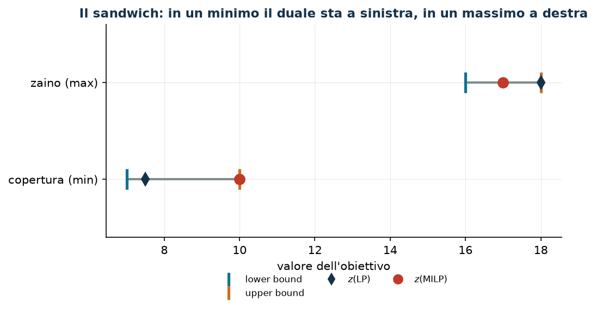

# Rilassamenti, dualità e bound

**Classe:** LP · MILP · **Script:** `python/cap04_bound.py`

[](https://colab.research.google.com/github/fabiofurini/modellazione-mip/blob/main/notebooks/cap04_bound.ipynb)

Questo capitolo insegna a produrre, **a mano**, un numero che sta certamente da
una parte dell'ottimo intero. Serve a tre cose: capire quanto vale un modello,
quanto vale un'euristica, e come leggere i numeri che un solver riporta quando
non ha finito.

## Che cos'è un rilassamento

Un **rilassamento** di $\min\{c'x : x \in X\}$ è un problema
$\min\{c'x : x \in \hat X\}$ con $X \subseteq \hat X$: il minimo su un insieme
più grande non può essere più alto. In un massimo la disuguaglianza si rovescia.

| Nome | Che cosa si toglie | Nota |
|---|---|---|
| $z(\mathit{LP})$, puro | $x \in \{0,1\}$ diventa $x \ge 0$ | è quello di cui si scrive il duale a mano: ha meno vincoli, quindi un duale con meno variabili |
| $z(\mathit{LP}^+)$, con i bound conservati | $x \in \{0,1\}$ diventa $0 \le x \le 1$ | è `relax()` di Gurobi e il rilassamento della radice |
| $z(\mathit{LP}^{++})$, rafforzato | come sopra, più disuguaglianze valide | vedi sotto |

In un minimo
$z(\mathit{LP}) \le z(\mathit{LP}^+) \le z(\mathit{LP}^{++}) \le z(\mathit{MILP})$.

!!! note "I due rilassamenti coincidono più spesso di quanto sembri"
    Se il modello contiene un vincolo di assegnamento $\sum_m x_{jm} = 1$ con
    $x \ge 0$, allora $x_{jm} \le 1$ è già implicato e i due rilassamenti sono
    **uguali**. Nella tabella dei bound del [capitolo 7](scheduling.md) succede
    nei problemi 1, 4, 6 e 7.

## La tabella di conversione primale/duale

Primale di **minimo**, vincoli indicizzati da $i$, variabili da $j$:

| Nel primale (min) | Nel duale (max) |
|---|---|
| vincolo $i$ di verso $\ge$ | variabile $u_i \ge 0$ |
| vincolo $i$ di verso $\le$ | variabile $u_i \le 0$ |
| vincolo $i$ di uguaglianza | variabile $u_i$ libera |
| variabile $x_j \ge 0$ | vincolo $j$ di verso $\le c_j$ |
| variabile $x_j$ libera | vincolo $j$ di uguaglianza $= c_j$ |

L'obiettivo duale è $\max \sum_i b_i u_i$. Se il primale è di **massimo**, tutti
i versi si rovesciano e il duale è di minimo.

Il vincolo duale $j$ dice: «il valore che attribuisco alle risorse consumate
dall'attività $j$ non può superare il suo costo». Con questa lettura ogni
ricetta per costruire una soluzione duale ha un significato economico.

## Dualità debole, dualità forte

- **Dualità debole**: $b'\bar u \le c'\bar x$ per ogni coppia di soluzioni
  ammissibili. *Sempre*, senza ipotesi. È questa che serve: dà un lower bound da
  **qualunque** soluzione duale ammissibile, anche costruita a mano.
- **Dualità forte**: se l'LP ha ottimo finito, $\max b'u = \min c'x$. Serve come
  **controllo**: l'ottimo del duale scritto a mano deve coincidere con
  $z(\mathit{LP})$. Gli script del corso lo verificano con un `assert`.

E poi: siccome $X_{\mathit{MILP}} \subseteq X_{\mathit{LP}}$,

$$b'\bar u ~\le~ z(\mathit{LP}) ~\le~ z(\mathit{MILP}).$$

!!! danger "Non esiste «il duale del MILP»"
    Il duale che si scrive è quello del **rilassamento**. Il MILP non ha un
    duale lineare, e la dualità forte fra MILP e un qualsiasi programma lineare
    in generale non vale: il salto $z(\mathit{MILP}) - z(\mathit{LP})$ è
    precisamente ciò che manca.

## Tre ricette per costruire a mano una soluzione duale

1. **Azzerare e saturare.** Si pongono a zero tutte le variabili duali tranne
   una famiglia, e si portano quelle al valore più grande ammissibile. Nel
   problema [7.1](scheduling-1.md): $\bar\pi = 0$ e
   $\bar\mu_j = \min_m c_{jm}$, cioè «ogni lavoro costa almeno il suo costo
   minimo».
2. **Euristica costruttiva sui vincoli.** Si scorrono i vincoli primali uno alla volta, si alza
   la variabile duale corrispondente fino a saturare il primo vincolo duale che
   si oppone, e si aggiornano i residui.
3. **Il rapporto migliore.** Con un solo vincolo di capacità in un massimo,
   $\bar v = \max_j p_j / w_j$ è ammissibile e dà il bound $C \bar v$.

Qualunque ricetta si usi, la soluzione va **verificata ammissibile** per il
duale — è l'unica cosa che rende valido il bound — e il suo valore confrontato
con $z(\mathit{LP})$.

## Un problema di minimo, per esteso

!!! abstract "Copertura di zone a costo minimo"
    Un comune ha $4$ distretti; attivare la squadra del distretto $j$ costa
    $c_j$. Ci sono $6$ zone sensibili, ognuna al confine fra due distretti: la
    zona $i$ è coperta se almeno una delle due squadre confinanti è attiva. Si
    vogliono coprire tutte le zone a costo minimo.

Dati $c = (4, 3, 5, 3)$; le sei zone sono le sei coppie di distretti, nell'ordine
$\{1,2\}$, $\{2,3\}$, $\{1,3\}$, $\{1,4\}$, $\{2,4\}$, $\{3,4\}$.

$$
\begin{aligned}
\min ~~ \sum_{j=1}^{4} c_j\, x_j & &\\
\text{soggetto a}\quad \sum_{j \in S_i} x_j &\ge 1, & \forall i \in \{1, \dots, 6\},\\
x_j &\in \{0,1\}, & \forall j \in \{1, \dots, 4\}.
\end{aligned}
$$

**Il duale del rilassamento senza i bound**, con $u_i \ge 0$ per ogni vincolo di
copertura:

$$
\begin{aligned}
\max ~~ \sum_{i=1}^{6} u_i & &\\
\text{soggetto a}\quad \sum_{i \,:\, j \in S_i} u_i &\le c_j, & \forall j,\\
u_i &\ge 0, & \forall i.
\end{aligned}
$$

Per l'istanza, ogni squadra copre tre zone:
$u_1 + u_3 + u_4 \le 4$, $u_1 + u_2 + u_5 \le 3$, $u_2 + u_3 + u_6 \le 5$,
$u_4 + u_5 + u_6 \le 3$.

**Una soluzione duale a mano (ricetta 2).**

- **Zona 1** ($\{1,2\}$): residui $(4,3,5,3)$, il minimo fra le squadre 1 e 2 è
  $3$. $\bar u_1 = 3$; residui $(1,0,5,3)$.
- **Zona 2** ($\{2,3\}$): il residuo della squadra 2 è $0$, quindi
  $\bar u_2 = 0$.
- **Zona 3** ($\{1,3\}$): minimo fra $1$ e $5$, cioè $1$. $\bar u_3 = 1$;
  residui $(0,0,4,3)$.
- **Zone 4 e 5**: le squadre 1 e 2 hanno residuo nullo,
  $\bar u_4 = \bar u_5 = 0$.
- **Zona 6** ($\{3,4\}$): minimo fra $4$ e $3$, cioè $3$. $\bar u_6 = 3$.

$$\mathit{LB} = 3 + 0 + 1 + 0 + 0 + 3 = 7.$$

**Un upper bound primale.** La [euristica costruttiva di copertura](modellazione-5.md) prende
le squadre $1$, $2$, $4$, di costo $4+3+3 = 10$: soluzione ammissibile e
**intera**, quindi $\mathit{UB} = 10$.

| $UB$ (euristica costruttiva) | $LB$ (duale a mano) | $z(\mathit{LP})$ | $z(\mathit{MILP})$ | gap euristica |
|---:|---:|---:|---:|---:|
| 10 | 7 | $15/2$ | 10 | $0{,}0\%$ |

Il divario certificato fra i due bound costruiti a mano è $(10-7)/10 = 30\%$:
senza risolvere il MILP sapremmo solo che l'ottimo sta fra $7$ e $10$.
L'euristica era già ottima, ma non lo si può sapere dai bound.

## Un problema di massimo: i ruoli si scambiano

!!! abstract "Zaino"
    Quattro oggetti di valore $p = (10, 7, 6, 4)$ e peso $w = (5, 4, 3, 3)$;
    capacità $C = 9$.

Il duale del rilassamento senza i bound ha una sola variabile $v \ge 0$:
$\min\ C v$ con $w_j v \ge p_j$ per ogni $j$.

- **Euristica** (euristica costruttiva per rapporto): rapporti $2$, $7/4$, $2$, $4/3$; si
  prendono gli oggetti 1 e 3 (peso $8$), valore $16$. In un **massimo**
  l'euristica dà un **lower** bound: $\mathit{LB} = 16$.
- **Duale a mano** (ricetta 3): $\bar v = \max_j p_j/w_j = 2$, valore
  $C \bar v = 18$. In un **massimo** il duale dà un **upper** bound:
  $\mathit{UB} = 18$.

$$16 ~\le~ z(\mathit{MILP}) = 17 ~\le~ z(\mathit{LP}^+) = \tfrac{71}{4} ~\le~ z(\mathit{LP}) = 18.$$

Qui il duale a mano è **ottimo** per il rilassamento senza i bound, e il rilassamento con
i bound conservati è strettamente migliore ($71/4 < 18$): il vincolo
$x_j \le 1$ morde, perché senza di esso l'LP prende $9/5$ unità dell'oggetto 1.



!!! note "Il sandwich scritto una volta per tutte"
    $$\text{minimo:}\quad \textstyle\sum_i b_i \bar u_i \le z(\mathit{D}(\mathit{LP})) = z(\mathit{LP}) \le z(\mathit{LP}^+) \le z(\mathit{MILP}) \le \sum_j c_j \bar x_j$$
    $$\text{massimo:}\quad \textstyle\sum_j c_j \bar x_j \le z(\mathit{MILP}) \le z(\mathit{LP}^+) \le z(\mathit{LP}) = z(\mathit{D}(\mathit{LP})) \le \sum_i b_i \bar u_i$$

    Il *lato del rilassamento* è ottimistico e contiene tutti i bound duali; il
    *lato dell'euristica* è pessimistico e contiene tutte le soluzioni
    ammissibili. Il nome ($LB$ o $UB$) dipende dal verso
    dell'obiettivo, il ruolo no.

## Disuguaglianze valide e vincoli che preservano l'ottimalità

- Una **disuguaglianza valida** è soddisfatta da *tutte* le soluzioni
  ammissibili intere: aggiungerla non cambia $z(\mathit{MILP})$; se riduce
  $z(\mathit{LP}^+)$ si chiama **taglio**.
- Un **vincolo che preserva l'ottimalità** taglia alcune soluzioni ammissibili
  ma non tutte quelle ottime. Non è una disuguaglianza valida, e va dichiarato
  come tale (esempio: $z_j \le M_j y_j$ nel [problema 8.4](localizzazione-4.md)).

**Il taglio di copertura.** Un insieme $S$ è una *copertura* se
$\sum_{j \in S} w_j > C$; allora $\sum_{j \in S} x_j \le |S| - 1$ è valida. Sullo
zaino ($w = (5,4,3,3)$, $C = 9$) le coperture minimali sono le quattro terne. La
soluzione ottima del rilassamento è $\tilde x = (1,\ 1/4,\ 1,\ 0)$:

| Copertura $S$ | $\sum_{j \in S} \tilde x_j$ | $\|S\|-1$ | |
|---|---:|---:|---|
| $\{1,2,3\}$ | $9/4$ | 2 | **violato**: il taglio serve |
| $\{1,2,4\}$ | $5/4$ | 2 | soddisfatto |
| $\{1,3,4\}$ | $2$ | 2 | soddisfatto (all'uguaglianza) |
| $\{2,3,4\}$ | $5/4$ | 2 | soddisfatto |

Aggiungendo i quattro tagli, $z(\mathit{LP}^+)$ scende da $71/4 = 17{,}75$ a
$69/4 = 17{,}25$ e $z(\mathit{MILP})$ resta $17$.

## Formulazioni più forti

Due formulazioni $A$ e $B$ si confrontano in **due passi**: (1) stesso insieme
intero, cioè le due formulazioni devono ammettere esattamente gli stessi
punti a coordinate intere — senza questo non si sta confrontando nulla; (2) $B$ è *più forte* se $X_B \subseteq X_A$ come
poliedri. Il caso di riferimento è l'[attivazione](legami-01.md).

!!! warning "Più forte non significa più veloce"
    Una formulazione più forte ha meno nodi ma righe in più, e ogni nodo costa
    di più. Quello che si **dimostra** è la forza del rilassamento; la velocità
    si **misura**.

## Quello che dice il solver

!!! danger "`ObjBound` non è il rilassamento della radice"
    Sull'istanza di copertura, il rilassamento del modello *come lo abbiamo
    scritto* vale $15/2$ e l'ottimo intero $10$. Eppure Gurobi riporta
    `ObjBound = 10` e `NodeCount = 0`: ha chiuso il gap nella radice, con
    presolve, tagli propri ed euristiche, senza mai ramificare. Spegnendoli
    (`Presolve = Cuts = Heuristics = 0`) lo stesso modello dà lo stesso ottimo
    ma con $5$ nodi.

    Due conseguenze: «quanto è difficile un modello» non è una proprietà del
    solo modello; e il rilassamento di cui parliamo nei bound a mano è quello
    del modello scritto, e si ottiene con `relax()`.

## I duali dell'LP non sono i prezzi marginali del MILP

| $C$ | $z(\mathit{MILP})$ | $z(\mathit{LP}^+)$ | duale dell'LP | variazione vera |
|---:|---:|---:|---:|---:|
| 8 | 16 | 16 | $2$ | — |
| 9 | 17 | $71/4$ | $7/4$ | $+1$ |
| 10 | 17 | $39/2$ | $7/4$ | **0** |
| 11 | 20 | $85/4$ | $7/4$ | $+3$ |
| 12 | 23 | 23 | $7/4$ | $+3$ |

Il duale dell'LP è il rapporto $p_j/w_j$ dell'oggetto «critico». La variazione
vera dell'ottimo intero è a scatti: da $C = 9$ a $C = 10$ non cambia *affatto*,
mentre il duale promette $7/4$.

!!! note "Che cosa si può dire, allora"
    Del duale dell'LP resta vero l'unico uso che il corso ne fa: è un **bound**.
    Come indicazione gestionale («conviene comprare un'unità in più?») va
    verificata risolvendo di nuovo il MILP: la differenza
    $z(\mathit{MILP})(b_i + 1) - z(\mathit{MILP})(b_i)$ è l'unica risposta
    corretta, e non c'è una formula chiusa che la dia.

## Il protocollo dei bound del corso

Ogni esercizio della [Parte II](problemi.md) produce: (1) una soluzione
ammissibile **e intera** da un'euristica, verificata su vincoli, bound e
interezza; (2) il duale del rilassamento senza i bound, generale e per l'istanza; (3) una
soluzione duale ammissibile costruita a mano, con la ricetta dichiarata; (4) i
due rilassamenti dal solver; (5) l'ottimo e la tabella
$\mathit{UB} \cdot \mathit{LB} \cdot z(\mathit{LP}) \cdot z(\mathit{LP}^+) \cdot z(\mathit{MILP}) \cdot$ gap;
(6) le considerazioni aggiuntive.

Ogni numero della tabella esiste in un CSV prodotto dallo script del problema, e
un `assert` in `verifica_numeri.py` lo confronta con il valore citato nel testo.

## Codice

Lo script completo è
[`python/cap04_bound.py`](https://github.com/fabiofurini/modellazione-mip/blob/main/python/cap04_bound.py);
il notebook è
[`notebooks/cap04_bound.ipynb`](https://github.com/fabiofurini/modellazione-mip/blob/main/notebooks/cap04_bound.ipynb).

<!-- script-incorporato: inizio (rigenerato da python/incorpora_codice.py) -->

??? example "Mostra lo script completo — `python/cap04_bound.py` (253 righe)"

    ```python
    """Capitolo 4 -- Rilassamenti, dualita' e bound: gli esempi verificati.

    Un problema di minimo e uno di massimo, scritti con il loro duale; una soluzione
    duale costruita a mano e la verifica della dualita' debole; il confronto fra il
    rilassamento senza i bound e quello con i bound conservati; un taglio di copertura; il
    bound letto da Gurobi a fine risoluzione; e il controesempio che mostra perche'
    i duali dell'LP non sono i prezzi marginali del MILP.
    """
    import gurobipy as gp
    import pandas as pd
    from gurobipy import GRB

    from mip import (ammissibile, due_rilassamenti, frazione, nuovo_modello, registra_bound,
                     rilassamento, risolvi, stampa_soluzione, valuta, viola_interezza)
    from stile import (ARANCIO, BLU, CICLO, GRIGIO, ROSSO, TEAL, VERDE, intestazione,
                       plt, salva_dati, salva_figura)

    R = range

    # ---------- 1. UN MINIMO, IL SUO DUALE, UNA SOLUZIONE DUALE A MANO ----------
    intestazione("4.1  Copertura a costo minimo: primale, duale e bound costruito a mano")
    # min sum c_j x_j   s.t.  sum_{j in S_i} x_j >= 1 per ogni i,  x binaria
    c41 = [4, 3, 5, 3]                       # costo delle quattro squadre
    # sei zone, ciascuna al confine fra due distretti: la zona i e' coperta dalle due
    # squadre dei distretti che confina
    S41 = [[0, 1], [1, 2], [0, 2], [0, 3], [1, 3], [2, 3]]
    n41, m41 = len(c41), len(S41)


    def primale_41():
        m = nuovo_modello("copertura")
        x = m.addVars(n41, vtype=GRB.BINARY, name="x")
        m.setObjective(gp.quicksum(c41[j] * x[j] for j in R(n41)), GRB.MINIMIZE)
        m.addConstrs((gp.quicksum(x[j] for j in S41[i]) >= 1 for i in R(m41)), name="copri")
        return m, x


    def duale_41():
        """max sum u_i  s.t.  sum_{i : j in S_i} u_i <= c_j,  u >= 0."""
        d = nuovo_modello("duale_copertura")
        u = d.addVars(m41, name="u")
        d.setObjective(u.sum(), GRB.MAXIMIZE)
        d.addConstrs((gp.quicksum(u[i] for i in R(m41) if j in S41[i]) <= c41[j] for j in R(n41)),
                     name="rc")
        return d, u


    m41p, x41 = primale_41()
    z41 = risolvi(m41p)
    scelte41 = [j + 1 for j in R(n41) if x41[j].X > 0.5]
    print(f"  Ottimo intero: z(MILP) = {frazione(z41)}, squadre scelte {scelte41}")

    # soluzione duale costruita a mano: si assegna a ogni zona il minimo costo unitario
    # disponibile, rispettando i vincoli duali una colonna alla volta (euristica costruttiva duale)
    u_mano = {i: 0.0 for i in R(m41)}
    residuo = {j: c41[j] for j in R(n41)}
    for i in R(m41):
        incremento = min(residuo[j] for j in S41[i])
        u_mano[i] = incremento
        for j in S41[i]:
            residuo[j] -= incremento
    d41, u41 = duale_41()
    lb41, viol = valuta(d41, {f"u[{i}]": u_mano[i] for i in R(m41)})
    assert viol <= 1e-9, viol
    print("  Soluzione duale a mano (euristica costruttiva sulle zone): u = "
          + ", ".join(f"u_{i+1} = {frazione(u_mano[i])}" for i in R(m41))
          + f"   ->  lb = {frazione(lb41)}")
    zlp41, zlp41r, pi41 = due_rilassamenti(m41p, d41)
    print(f"  Dualita' debole verificata: {frazione(lb41)} <= {frazione(zlp41)} <= "
          f"{frazione(z41)}")
    assert lb41 <= zlp41 + 1e-9 <= z41 + 1e-9
    # upper bound primale: la soluzione euristica costruttiva di copertura (una zona scoperta alla volta)
    scoperte = set(R(m41))
    presi41 = []
    while scoperte:
        j = min(R(n41), key=lambda j: c41[j] / max(1, len({i for i in scoperte if j in S41[i]}))
                if any(j in S41[i] for i in scoperte) else float("inf"))
        presi41.append(j)
        scoperte -= {i for i in scoperte if j in S41[i]}
    ub41_primale = sum(c41[j] for j in presi41)
    assert ammissibile(m41p, {f"x[{j}]": 1 for j in presi41})
    print(f"  Euristica euristica costruttiva di copertura: squadre {sorted(j + 1 for j in presi41)}, "
          f"ub = {frazione(ub41_primale)}")
    riga41 = registra_bound("copertura a costo minimo", ub41_primale, lb41, zlp41, zlp41r, z41)
    salva_dati(pd.DataFrame([riga41]), "cap04_copertura")

    # ---------- 2. UN MASSIMO: I RUOLI SI SCAMBIANO ----------
    intestazione("4.2  Uno zaino di massimo: l'euristica da' il lower bound, il duale l'upper")
    p42 = [10, 7, 6, 4]                      # valori
    w42 = [5, 4, 3, 3]                       # pesi
    C42 = 9


    def primale_42():
        m = nuovo_modello("zaino")
        x = m.addVars(4, vtype=GRB.BINARY, name="x")
        m.setObjective(gp.quicksum(p42[j] * x[j] for j in R(4)), GRB.MAXIMIZE)
        m.addConstr(gp.quicksum(w42[j] * x[j] for j in R(4)) <= C42, name="capacita")
        return m, x


    def duale_42():
        """Duale del rilassamento senza i bound (x >= 0): min C v  s.t.  w_j v >= p_j, v >= 0."""
        d = nuovo_modello("duale_zaino")
        v = d.addVar(name="v")
        d.setObjective(C42 * v, GRB.MINIMIZE)
        d.addConstrs((w42[j] * v >= p42[j] for j in R(4)), name="rc")
        return d, v


    m42, x42 = primale_42()
    z42 = risolvi(m42)
    scelte42 = [j + 1 for j in R(4) if x42[j].X > 0.5]
    print(f"  Ottimo intero: z(MILP) = {frazione(z42)}, oggetti {scelte42}, "
          f"peso {sum(w42[j] for j in R(4) if x42[j].X > 0.5)} su {C42}")
    # euristica euristica costruttiva per rapporto valore/peso: da' un LOWER bound
    ordine = sorted(R(4), key=lambda j: -p42[j] / w42[j])
    carico, presi = 0, []
    for j in ordine:
        if carico + w42[j] <= C42:
            presi.append(j)
            carico += w42[j]
    lb42 = sum(p42[j] for j in presi)
    assert ammissibile(m42, {f"x[{j}]": 1 for j in presi})
    print(f"  Euristica costruttiva per rapporto p_j/w_j: prende {sorted(j + 1 for j in presi)}, "
          f"lb = {frazione(lb42)}")
    # duale a mano: v = max_j p_j / w_j  (il rapporto migliore) e' ammissibile
    v_mano = max(p42[j] / w42[j] for j in R(4))
    d42, v42 = duale_42()
    ub42, viol = valuta(d42, {"v": v_mano})
    assert viol <= 1e-9, viol
    print(f"  Soluzione duale a mano: v = max_j p_j/w_j = {frazione(v_mano)}  ->  "
          f"ub = C v = {frazione(ub42)}")
    zlp42, zlp42r, _ = due_rilassamenti(m42, d42)
    print(f"  Il sandwich del massimo: {frazione(lb42)} <= z(MILP) = {frazione(z42)} <= "
          f"z(LP) = {frazione(zlp42)} <= ub = {frazione(ub42)}")
    assert lb42 <= z42 <= zlp42 + 1e-9 <= ub42 + 1e-9
    riga42 = registra_bound("zaino di massimo", ub42, lb42, zlp42, zlp42r, z42, senso="max")
    salva_dati(pd.DataFrame([riga42]), "cap04_zaino")

    # ---------- 3. UN TAGLIO DI COPERTURA ----------
    intestazione("4.3  Una disuguaglianza valida: il taglio di copertura")
    # {1,2} e' una copertura: w_1 + w_2 = 9 > 8 = C, quindi x_1 + x_2 <= 1
    from itertools import combinations
    tutte = [s for k in R(2, 5) for s in combinations(R(4), k) if sum(w42[j] for j in s) > C42]
    coperture = [s for s in tutte                                   # solo le minimali
                 if all(sum(w42[j] for j in t) <= C42
                        for t in combinations(s, len(s) - 1))]
    print("  Coperture minimali trovate: "
          + "; ".join("{" + ", ".join(str(j + 1) for j in s) + "}" for s in coperture))
    m43, x43 = primale_42()
    zlp43_prima, sol43, _ = rilassamento(m43, rafforzato=True)
    print("  Soluzione ottima del rilassamento senza tagli: "
          + ", ".join(f"x_{j+1} = {frazione(sol43[f'x[{j}]'])}" for j in R(4)))
    for s in coperture:
        somma = sum(sol43[f"x[{j}]"] for j in s)
        stato = "VIOLATO" if somma > len(s) - 1 + 1e-9 else "soddisfatto"
        print(f"    taglio su {{{', '.join(str(j + 1) for j in s)}}}: "
              f"somma = {frazione(somma)} contro {len(s) - 1}  ->  {stato}")
    for s in coperture:
        m43.addConstr(gp.quicksum(x43[j] for j in s) <= len(s) - 1, name="cover" + "".join(map(str, s)))
    z43 = risolvi(m43)
    zlp43_dopo, _, _ = rilassamento(m43, rafforzato=True)
    print(f"  z(LP+) senza tagli = {frazione(zlp43_prima)}   con i tagli di copertura = "
          f"{frazione(zlp43_dopo)}   z(MILP) = {frazione(z43)}")
    assert z43 == z42, "i tagli non devono cambiare l'ottimo intero"
    assert zlp43_dopo <= zlp43_prima + 1e-9
    salva_dati(pd.DataFrame([{"modello": "zaino", "z_lp_senza_tagli": zlp43_prima,
                              "z_lp_con_tagli": zlp43_dopo, "z_milp": z43}]), "cap04_tagli")

    # ---------- 4. QUELLO CHE FA IL SOLVER: relax() E ObjBound ----------
    intestazione("4.4  Il primo rilassamento e il bound finale del solver")
    m44, x44 = primale_41()          # la copertura: qui il solver deve lavorare
    m44.Params.OutputFlag = 0
    m44.optimize()
    print(f"  Status = {m44.Status} (2 = OPTIMAL), SolCount = {m44.SolCount}")
    print(f"  ObjVal   = {frazione(m44.ObjVal)}   (la migliore soluzione intera trovata)")
    print(f"  ObjBound = {frazione(m44.ObjBound)} (il miglior bound dimostrato)")
    print(f"  MIPGap   = {m44.MIPGap:.4f}          NodeCount = {int(m44.NodeCount)}")
    zrad, _, _ = rilassamento(m44, rafforzato=True)
    print(f"  Rilassamento del modello scritto da noi, con relax(): {frazione(zrad)}")
    assert abs(m44.ObjBound - m44.ObjVal) <= 1e-6
    assert zrad <= m44.ObjVal + 1e-9         # minimo: il rilassamento sta sotto l'ottimo
    print(f"  Il rilassamento vale {frazione(zrad)}, l'ottimo intero {frazione(m44.ObjVal)}: il")
    print("  gap c'e', ma NodeCount = 0. Gurobi lo chiude *nella radice*, con presolve,")
    print("  tagli propri ed euristiche, senza mai ramificare.")
    # per vedere il solver al lavoro si spengono presolve, tagli ed euristiche
    m45, x45 = primale_41()
    m45.Params.Presolve = 0
    m45.Params.Cuts = 0
    m45.Params.Heuristics = 0
    m45.optimize()
    print(f"  Con Presolve = Cuts = Heuristics = 0: z = {frazione(m45.ObjVal)}, "
          f"NodeCount = {int(m45.NodeCount)}")
    print("  Stesso ottimo, ma ora i nodi si contano: 'quanto e' difficile' non e' una")
    print("  proprieta' del solo modello, dipende anche da cosa il solver mette in campo.")
    assert m45.ObjVal == m44.ObjVal
    salva_dati(pd.DataFrame([{"configurazione": "impostazioni predefinite", "z": m44.ObjVal,
                              "z_lp_scritto": zrad, "nodi": int(m44.NodeCount)},
                             {"configurazione": "senza presolve, tagli ed euristiche",
                              "z": m45.ObjVal, "z_lp_scritto": zrad,
                              "nodi": int(m45.NodeCount)}]), "cap04_solver")

    # ---------- 5. I DUALI DELL'LP NON SONO I PREZZI MARGINALI DEL MILP ----------
    intestazione("4.5  Perche' i duali dell'LP non sono i prezzi marginali del MILP")
    righe = []
    for C in (8, 9, 10, 11, 12):
        m = nuovo_modello("zaino_C")
        x = m.addVars(4, vtype=GRB.BINARY, name="x")
        m.setObjective(gp.quicksum(p42[j] * x[j] for j in R(4)), GRB.MAXIMIZE)
        con = m.addConstr(gp.quicksum(w42[j] * x[j] for j in R(4)) <= C, name="capacita")
        z = risolvi(m)
        zr, _, pi = rilassamento(m, rafforzato=True)
        righe.append({"capacita": C, "z_milp": z, "z_lp": zr, "duale_lp": pi["capacita"]})
    print("   C   z(MILP)   z(LP+)   duale dell'LP   variazione vera di z(MILP)")
    for k, r in enumerate(righe):
        delta = "" if k == 0 else frazione(r["z_milp"] - righe[k - 1]["z_milp"])
        print(f"  {r['capacita']:2d}    {frazione(r['z_milp']):>5}   {frazione(r['z_lp']):>6}   "
              f"{r['duale_lp']:>10.4f}      {delta:>6}")
    salva_dati(pd.DataFrame(righe), "cap04_prezzi")
    print("  Il duale dell'LP e' il rapporto p_j/w_j dell'oggetto 'critico': 2 quando la")
    print("  capacita' si esaurisce sull'oggetto 1, 7/4 quando avanza spazio per l'oggetto 2.")
    print("  Dice quanto vale una unita' di capacita' in piu' *nel continuo*. Sull'intero la")
    print("  variazione vera e' a scatti (1, 0, 3, 3) e non coincide mai con quel valore:")
    print("  passando da C = 9 a C = 10 l'ottimo intero non cambia affatto, mentre il duale")
    print("  continua a promettere 7/4. Il duale dell'LP non e' il prezzo marginale del")
    print("  MILP, e usarlo come tale e' un errore, non un'approssimazione.")

    # ---------- 6. FIGURA: IL SANDWICH DEI DUE PROBLEMI ----------
    fig, ax = plt.subplots(figsize=(7.2, 3.4))
    etichette = ["copertura (min)", "zaino (max)"]
    lb = [lb41, lb42]
    ub = [ub41_primale, ub42]
    zl = [zlp41, zlp42]
    zm = [z41, z42]
    for i in R(2):
        ax.plot([lb[i], ub[i]], [i, i], color=GRIGIO, lw=2, solid_capstyle="round")
        ax.plot(lb[i], i, "|", color=TEAL, ms=18, mew=2.5)
        ax.plot(ub[i], i, "|", color=ARANCIO, ms=18, mew=2.5)
        ax.plot(zl[i], i, "d", color=BLU, ms=8)
        ax.plot(zm[i], i, "o", color=ROSSO, ms=9)
    ax.plot([], [], "|", color=TEAL, ms=12, mew=2.5, label="lower bound")
    ax.plot([], [], "|", color=ARANCIO, ms=12, mew=2.5, label="upper bound")
    ax.plot([], [], "d", color=BLU, ms=7, label="$z(\\mathrm{LP})$")
    ax.plot([], [], "o", color=ROSSO, ms=8, label="$z(\\mathrm{MILP})$")
    ax.set_yticks(R(2))
    ax.set_yticklabels(etichette)
    ax.set_xlabel("valore dell'obiettivo")
    ax.set_title("Il sandwich: in un minimo il duale sta a sinistra, in un massimo a destra")
    ax.legend(fontsize=8, ncols=4, loc="lower center", bbox_to_anchor=(0.5, -0.42))
    ax.set_ylim(-0.6, 1.6)
    salva_figura(fig, "cap04_sandwich")
    print("Fine.")
    ```

<!-- script-incorporato: fine -->
