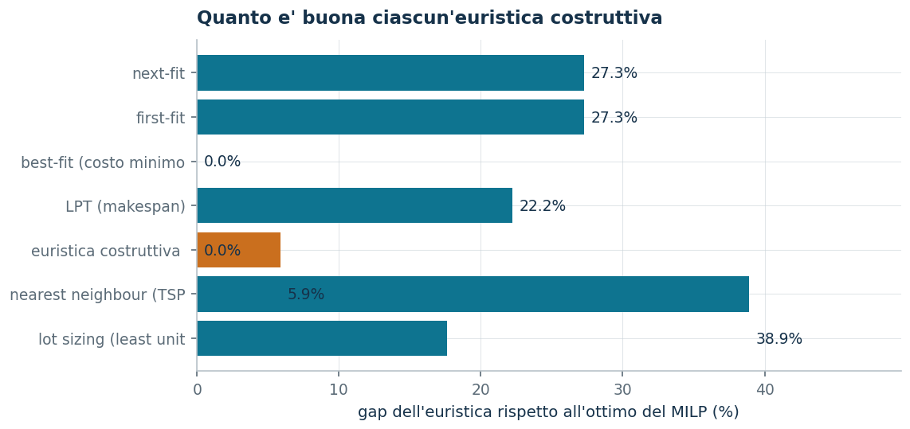

# 4. Euristiche costruttive

**Classe:** algoritmi · **Script:** `python/cap05_euristiche.py`, `python/euristiche.py`
{ .scheda }

[](https://colab.research.google.com/github/fabiofurini/modellazione-mip/blob/main/notebooks/cap05_euristiche.ipynb)

Un'euristica costruttiva costruisce **una** soluzione in fretta, aggiungendo un
elemento per volta e senza mai tornare indietro. Non dimostra niente sulla sua
qualità, e non garantisce nemmeno di arrivare a una soluzione ammissibile: può
bloccarsi a metà, con un elemento che non entra da nessuna parte. Quando finisce
con una soluzione ammissibile, quella soluzione è l'altra metà del sandwich del
[capitolo 2](modellazione-2.md): il lato pessimistico, quello garantito da una
soluzione che esiste davvero; quando fallisce, bound primale non ce n'è.

!!! note "Che cosa deve produrre un'euristica in questo corso"
    1. uno **pseudocodice** leggibile, con l'ordine di scansione, il criterio di
       scelta, la gestione dei pareggi e il caso di fallimento dichiarati;
    2. la **funzione Python** corrispondente, riga per riga;
    3. la **traccia** dell'esecuzione su un'istanza;
    4. la **verifica di ammissibilità**: vincoli, bound *e* interezza;
    5. il **bound** che ne segue, con il nome giusto.

    Il punto 4 non è una formalità: una soluzione che soddisfa i vincoli lineari
    ma ha una componente frazionaria è ammissibile per il *rilassamento*, non per
    il MILP, e il suo valore non è un bound primale.

!!! danger "Il verso del bound dipende dall'obiettivo, non dall'euristica"
    In un problema di **minimo** il valore di una soluzione ammissibile è un
    *upper* bound: $z(\mathit{MILP}) \le \mathit{UB}$. In un **massimo** è un
    *lower* bound: $\mathit{LB} \le z(\mathit{MILP})$. Chiamare $UB$ il
    risultato di un'euristica costruttiva su un massimo è l'errore di segno più comune del
    corso.

## Bin packing: le regole di inserimento

Il problema classico è il **bin packing**, il cui modello sta nel
[capitolo del solver](gurobipy-4.md): degli oggetti vanno messi in contenitori
tutti uguali, di capacità limitata, usandone il meno possibile. Qui non lo si
risolve: lo si *costruisce*, una scelta per volta.

```text
Costruisci(n, w, C, gamma):
  nessun contenitore aperto
  per j = 1..n:
      # next-fit:  solo il contenitore corrente, poi se ne apre uno nuovo
      # first-fit: il primo contenitore aperto in cui l'oggetto ci sta
      # best-fit:  fra i contenitori in cui ci sta, quello di gamma(j,b,res) minimo
      scegli b* secondo la regola
      se nessun contenitore aperto va bene: aprine uno nuovo
      metti j in b*;  res[b*] <- res[b*] - w[j]
  restituisci i contenitori usati
```

Tutte e tre scandiscono gli oggetti **nell'ordine dato**: cambiare l'ordine
cambia il risultato, e questo va detto quando si riporta un valore. I pareggi si
rompono sull'indice più piccolo, così l'esecuzione è riproducibile.

**L'istanza.** Sei oggetti di peso $w = (4, 4, 5, 3, 2, 3)$, contenitori di
capacità $C = 7$: gli stessi contenitori del
[modello del §3.4](gurobipy-4.md), con due oggetti in più. L'istanza di là serve
a scrivere il modello e sta piccola apposta — ma proprio per questo le tre
regole vi rispondono tutte e tre «tre contenitori», e non si distinguono.

| Euristica | come riempie | $UB$ | $z(\mathit{MILP})$ | gap dell'euristica |
|---|---|---:|---:|---:|
| next-fit | `[4] [4] [5] [3+2] [3]` | 5 | 3 | $66{,}7\%$ |
| first-fit | `[4+3] [4+2] [5] [3]` | 4 | 3 | $33{,}3\%$ |
| best-fit sul riempimento | `[4+3] [4+3] [5+2]` | 3 | 3 | $0{,}0\%$ |

**Il bound elementare chiude il discorso senza solver.** Il peso totale è
$4 + 4 + 5 + 3 + 2 + 3 = 21$ e un contenitore ne porta $7$: servono almeno
$\lceil 21/7 \rceil = 3$ contenitori. Il best-fit ne usa tre, riempiendoli tutti
e tre esatti, quindi $\mathit{LB} = \mathit{UB} = 3$ e l'ottimo è **dimostrato**
— è il sandwich del corso su un'istanza che si chiude a mano.

!!! tip "Dove le tre regole si separano"
    Il **next-fit** chiude un contenitore appena un oggetto non ci sta, e non
    torna mai indietro: l'ultimo oggetto, di peso $3$, entrerebbe esatto nel
    primo contenitore, che ha ancora $3$ di spazio, ma quel contenitore non lo
    guarda più. Cinque contenitori invece di tre.

    Fra **first-fit** e **best-fit** la differenza sta tutta sull'oggetto di
    peso $2$. Il first-fit lo mette nel *primo* che lo accoglie, il secondo
    contenitore, che resta con $1$ di spazio ormai inutile; il best-fit lo mette
    dove entra *esatto*, il terzo, che aveva $2$. Così il $3$ finale trova
    ancora posto nel secondo, e i contenitori restano tre.

## $P||C_{\max}$: la regola del meno carico

Il secondo classico è lo **scheduling su macchine identiche**, in notazione
standard $P||C_{\max}$, il cui modello sta anch'esso nel
[capitolo del solver](gurobipy-4.md): $n$ lavori di durata $t_j$ su $k$ macchine
uguali, minimizzando l'istante in cui finisce l'ultima. La regola naturale è il **list
scheduling** — il lavoro corrente va sulla macchina meno carica — e l'ordine in
cui si guardano i lavori decide il risultato. L'ordine migliore è per durata
decrescente, e la regola che ne esce si chiama **LPT**.

```text
LPT(n, k, t):
  L[m] <- 0 per ogni m                        # carichi correnti
  per j in ordine di t[j] DECRESCENTE:
      m* <- argmin_m L[m]                     # pareggi: l'indice piu' piccolo
      x[j][m*] <- 1;  L[m*] <- L[m*] + t[j]
  restituisci x, max_m L[m]
```

L'ordine decrescente è essenziale: mettere per ultimi i lavori lunghi li rende
impossibili da sistemare.

!!! example "Sette lavori su tre macchine"
    $t = (5, 5, 4, 4, 3, 3, 3)$, $k = 3$, totale $27$.

    - **Passi 1–3.** I lavori $5$, $5$, $4$ vanno sulle tre macchine vuote:
      $L = (5, 5, 4)$.
    - **Passo 4.** Lavoro $4$: il carico minimo è la macchina 3, che passa a
      $8$. $L = (5, 5, 8)$.
    - **Passi 5–6.** I due lavori da $3$ vanno sulle macchine 1 e 2:
      $L = (8, 8, 8)$.
    - **Passo 7.** L'ultimo lavoro da $3$ trova tutti i carichi pari a $8$; per
      la regola dei pareggi va sulla macchina 1, che arriva a $11$.

    Makespan dell'LPT: $\mathit{UB} = 11$, con carichi $(11, 8, 8)$.

    **Il bound elementare.** Il makespan è almeno
    $\max(\max_j t_j,\ \sum_j t_j / k) = \max(5, 9) = 9$. L'ottimo è proprio
    $z(\mathit{MILP}) = 9$ — si raggiunge con $\{5,4\}$, $\{5,4\}$,
    $\{3,3,3\}$ — e l'LPT sbaglia del $22{,}2\%$.

!!! tip "Due bound gratis, da confrontare"
    $\max_j t_j$ e $\sum_j t_j / k$ si calcolano senza risolvere niente, e il
    migliore dei due è già spesso vicino all'ottimo. Un bound «ovvio» che nessuno
    scrive è un bound sprecato: il duale del [capitolo 2](modellazione-2.md)
    serve quando quelli ovvi non bastano, non al loro posto.

## Set covering: la regola del completamento più economico

```text
EuristicaCopertura(c, S):
  scoperte <- {1..m};   y[j] <- 0 per ogni j
  finche' scoperte non e' vuoto:
      per ogni j non ancora scelto: nuove(j) <- |{i in scoperte : j in S_i}|
      se nuove(j) = 0 per ogni j: restituisci "nessuna soluzione trovata"
      j* <- argmin_{j : nuove(j) > 0} c[j] / nuove(j)
      y[j*] <- 1;   scoperte <- scoperte \ {i : j* in S_i}
  restituisci y
```

Il criterio è il **costo per zona nuova**, non il costo assoluto.

Sulle quattro squadre del [capitolo 2](modellazione-2.md), $c = (4,3,5,3)$:
passo 1 rapporti $4/3$, $1$, $5/3$, $1$ → elemento 2 (copre le zone 1, 2, 5);
passo 2 rapporti $2$, $5/2$, $3/2$ → elemento 4 (zone 4 e 6); passo 3 rapporti
$4$ e $5$ → elemento 1. Soluzione $\{1,2,4\}$, costo $\mathit{UB} = 10$, che qui
è l'ottimo.

## Zaino: la regola del rapporto migliore

Lo **zaino** è il modello con cui si apre il capitolo del solver: gli oggetti
hanno un valore oltre a un peso, e la risorsa è una sola. La regola costruttiva
guarda il rapporto fra i due, e quello che produce è una soluzione ammissibile,
quindi un bound primale.

```text
EuristicaZaino(p, w, C):
  residuo <- C;   y[j] <- 0 per ogni j
  per j in ordine di p[j]/w[j] DECRESCENTE:
      se w[j] <= residuo:  y[j] <- 1;  residuo <- residuo - w[j]
  restituisci y
```

Su $p = (10,7,6,4)$, $w = (5,4,3,3)$, $C = 9$: rapporti $2$, $7/4$, $2$, $4/3$;
si prendono gli oggetti 1 e 3 (peso $8$), valore $16$. Poiché il problema è di
**massimo**, $\mathit{LB} = 16 \le z(\mathit{MILP}) = 17$, gap $5{,}9\%$:
l'ottimo prende gli oggetti 1 e 2 riempiendo lo zaino esattamente. L'euristica costruttiva
sbaglia perché l'oggetto 3 lascia un residuo inutilizzabile.

## TSP: il vicino più vicino

Il quarto classico è il **commesso viaggiatore** (*travelling salesman problem*,
TSP), il terzo e ultimo modello scritto nel
[capitolo del solver](gurobipy-4.md): date $n$ città e le distanze $d_{ij}$ fra
ogni coppia, si cerca il giro più corto che le visiti tutte una volta sola e
torni al punto di partenza. È il
problema su cui la costruzione passo per passo si vede meglio, perché la
soluzione è una sequenza: l'ordine *è* la soluzione.

La regola costruttiva classica è il **vicino più vicino**: si parte da una
città, e ogni volta si va alla più vicina fra quelle non ancora visitate; quando
non ne restano, si torna alla partenza. È ammissibile per costruzione e veloce,
perché a ogni passo guarda solo le distanze dalla città corrente.

!!! example "Cinque città, cinque partenze"
    Le distanze, simmetriche:

    |  | 1 | 2 | 3 | 4 | 5 |
    |---|---:|---:|---:|---:|---:|
    | 1 | — | 5 | 2 | 2 | 9 |
    | 2 | 5 | — | 4 | 3 | 4 |
    | 3 | 2 | 4 | — | 4 | 7 |
    | 4 | 2 | 3 | 4 | — | 7 |
    | 5 | 9 | 4 | 7 | 7 | — |

    Partendo dalla città 1: la più vicina è la 3 (distanza 2); da lì la 2 (4); da
    lì la 4 (3); resta la 5 (7); e si torna alla 1, che costa 9. Il giro
    $1 \to 3 \to 2 \to 4 \to 5 \to 1$ è lungo 25.

    L'ultimo arco è quello che si paga: la regola sceglie bene finché ha scelta, e
    all'ultimo passo non ne ha più. Cambiando la città di partenza cambia il giro:

    | partenza | giro | lunghezza |
    |---|---|---:|
    | 1 | $1 \to 3 \to 2 \to 4 \to 5 \to 1$ | 25 |
    | 2 | $2 \to 4 \to 1 \to 3 \to 5 \to 2$ | 18 |
    | 3 | $3 \to 1 \to 4 \to 2 \to 5 \to 3$ | 18 |
    | 4 | $4 \to 1 \to 3 \to 2 \to 5 \to 4$ | 19 |
    | 5 | $5 \to 2 \to 4 \to 1 \to 3 \to 5$ | 18 |

    Con cinque città i giri distinti sono $(5-1)!/2 = 12$ e si possono enumerare
    tutti: l'ottimo è $1 \to 3 \to 5 \to 2 \to 4 \to 1$, lungo 18. Tre partenze
    su cinque lo trovano, una resta a 19 e quella da cui siamo partiti a 25, cioè
    il 38,9 % sopra l'ottimo.

    Due cose da portare via. L'euristica dà *una* soluzione ammissibile, quindi un
    bound superiore — qui $z(\mathit{MILP}) \le 25$ — e nient'altro; che 18 sia
    l'ottimo lo sappiamo per enumerazione. E far girare la stessa regola da tutte
    le partenze, tenendo il giro migliore, costa $n$ volte tanto e dà un bound
    migliore: è la forma più semplice di *multi-start*, e resta un bound da un
    lato solo.

## Lot sizing: copertura di periodi a costo unitario minimo

```text
LeastUnitCost(d, f, h):
  t <- 1
  finche' t <= T:
      salta i periodi con d[t] = 0
      per k = 1..T-t+1:
          Q_k <- somma di d[t..t+k-1]
          c_k <- (f + h * somma di (s-t)*d[s] per s = t..t+k-1) / Q_k
      k* <- argmin_k c_k                      # il costo medio per unita' piu' basso
      produci Q_{k*} nel periodo t;   t <- t + k*
```

!!! danger "Questa non è la procedura di Wagner–Whitin"
    Wagner–Whitin è un algoritmo **esatto** di programmazione dinamica per il
    modello di lot sizing *senza capacità*: risolve quel modello all'ottimo in
    tempo polinomiale. La procedura qui sopra è un'euristica, e il suo valore è
    solo un bound. Chiamarla «euristica costruttiva di Wagner–Whitin» confonde due cose diverse.

Su $d = (20, 10, 30, 40, 10)$, lancio $f = 50$, magazzino $h = 1$: dal periodo 1
conviene coprire 2 periodi (costo unitario $2$); dal periodo 3 altri 2 (costo
unitario $\approx 1{,}286$); dal periodo 5 solo quello (costo unitario $5$).
Costo $\mathit{UB} = 200$ contro $z(\mathit{MILP}) = 170$, gap $17{,}6\%$ — che
è anche il valore che darebbe Wagner–Whitin, essendo esatto su questo modello.

## Ricerca locale, e che cosa non dà

Una **ricerca locale** parte da una soluzione ammissibile e prova mosse
elementari, accettando quelle che migliorano; si ferma in un **ottimo locale**.

Sulla soluzione LPT ($L = (11, 8, 8)$, makespan $11$), la mossa «sposta un
lavoro su un'altra macchina» non migliora nulla: spostare uno dei due lavori da
$3$ dalla macchina 1 porta il suo carico a $8$ ma alza a $11$ quello della
macchina che lo riceve. La ricerca locale si ferma a $11$, mentre l'ottimo è
$9$: per arrivarci serve una mossa di **scambio** fra due macchine.

!!! warning "Un ottimo locale non è un bound migliore"
    La ricerca locale restituisce una soluzione ammissibile, quindi un bound dal
    lato pessimistico, e nient'altro. Il fatto che si sia fermata non significa
    che sia arrivata.

## Quando l'euristica costruttiva fallisce

!!! danger "«Nessuna soluzione trovata» non è «nessuna soluzione esiste»"
    Tre lavori di durata $(3, 3, 2)$ su due macchine con disponibilità
    $(5, 3)$. Il next-fit: il lavoro 1 va sulla macchina 1 (residuo $2$); il
    lavoro 2 non ci sta e passa alla macchina 2 (residuo $0$); il lavoro 3 non
    ci sta e non ci sono altre macchine: **fallimento**. Ma il problema è
    ammissibile: i lavori 2 e 3 stanno insieme sulla macchina 1 ($3 + 2 = 5$) e
    il lavoro 1 sulla macchina 2 ($3 \le 3$).

    Un'euristica costruttiva è *miope*: decide una cosa alla volta e non torna
    indietro. Il suo fallimento è un'informazione sull'euristica, non sul
    problema. Per dimostrare che un modello è inammissibile serve il solver
    (`Status = INFEASIBLE`) o una dimostrazione.

## Il quadro delle euristiche

| Euristica | Verso | valore | $z(\mathit{MILP})$ | gap dell'euristica |
|---|---|---:|---:|---:|
| next-fit (bin packing) | min ($UB$) | 5 | 3 | $66{,}7\%$ |
| first-fit (bin packing) | min ($UB$) | 4 | 3 | $33{,}3\%$ |
| best-fit sul riempimento (bin packing) | min ($UB$) | 3 | 3 | $0{,}0\%$ |
| LPT (makespan) | min ($UB$) | 11 | 9 | $22{,}2\%$ |
| euristica costruttiva di copertura | min ($UB$) | 10 | 10 | $0{,}0\%$ |
| euristica costruttiva per rapporto (zaino) | max ($LB$) | 16 | 17 | $5{,}9\%$ |
| nearest neighbour (TSP) | min ($UB$) | 25 | 18 | $38{,}9\%$ |
| least unit cost (lot sizing) | min ($UB$) | 200 | 170 | $17{,}6\%$ |



!!! tip "Che cosa si impara da questa tabella"
    Due euristiche trovano l'ottimo e sei no, e **prima** di risolvere il
    MILP non c'è modo di sapere quali. Un gap del $0\%$ e uno del $67\%$ si
    distinguono soltanto *dopo*. È per questo che il corso chiede sempre due
    bound: un'euristica da sola dice quanto costa una soluzione che si può
    realizzare, non quanto si sta perdendo.

## Codice

Le euristiche sono in
[`python/euristiche.py`](https://github.com/fabiofurini/modellazione-mip/blob/main/python/euristiche.py),
gli esempi in
[`python/cap05_euristiche.py`](https://github.com/fabiofurini/modellazione-mip/blob/main/python/cap05_euristiche.py);
il notebook è
[`notebooks/cap05_euristiche.ipynb`](https://github.com/fabiofurini/modellazione-mip/blob/main/notebooks/cap05_euristiche.ipynb).

<!-- script-incorporato: inizio (rigenerato da python/incorpora_codice.py) -->

??? example "Mostra lo script completo — `python/cap05_euristiche.py` (274 righe)"

    ```python
    """Capitolo 4 -- Euristiche costruttive sui problemi classici, con traccia e bound.

    Ogni euristica del corso su un'istanza minima: la traccia passo-passo (lo stesso
    testo che finisce nella dispensa), la verifica di ammissibilita' della soluzione
    prodotta --- vincoli, bound *e* interezza --- e il confronto con l'ottimo del
    MILP corrispondente. Chiude con un passo di ricerca locale e con il caso in cui
    l'euristica costruttiva fallisce senza che il problema sia inammissibile.
    """
    import gurobipy as gp
    import pandas as pd
    from gurobipy import GRB

    from euristiche import (vicino_piu_vicino, best_fit, first_fit, euristica_copertura, euristica_lotti, euristica_zaino,
                            lpt, matrice, next_fit)
    from mip import (ammissibile, frazione, nuovo_modello, rilassamento, risolvi,
                     stampa_soluzione, valuta, viola_interezza)
    from stile import (ARANCIO, BLU, CICLO, GRIGIO, ROSSO, TEAL, VERDE, intestazione,
                       plt, salva_dati, salva_figura)

    R = range
    CONFRONTO = []


    def confronta(nome, senso, valore_eur, zmilp, note=""):
        gap = abs(valore_eur - zmilp) / abs(zmilp) if abs(zmilp) > 1e-9 else 0.0
        ruolo = "ub" if senso == "min" else "lb"
        print(f"  {nome:34s} euristica = {frazione(valore_eur):>6} ({ruolo})   "
              f"z(MILP) = {frazione(zmilp):>6}   gap = {100 * gap:.1f}%  {note}")
        CONFRONTO.append({"euristica": nome, "senso": senso, "valore_euristica": valore_eur,
                          "ruolo": ruolo, "z_milp": zmilp, "gap": gap})


    # ---------- 1. BIN PACKING: NEXT-FIT, FIRST-FIT, BEST-FIT ----------
    intestazione("5.1  Le tre regole di inserimento sul bin packing")
    # Gli stessi contenitori del modello della sezione 3.4 (capacita' 7) con due
    # oggetti in piu'. L'istanza di la' serve a scrivere il modello e va tenuta
    # piccola; qui ne serve una appena piu' grande, perche' su quella le tre regole
    # rispondono tutte e tre "tre contenitori" e non si distinguono.
    w51, C51 = [4, 4, 5, 3, 2, 3], 7
    k51 = len(w51)                      # un contenitore per oggetto: il limite banale
    t51, a51 = matrice(w51, k51), [C51] * k51     # un oggetto pesa uguale in ogni contenitore


    def modello_bpp(w, c, k):
        n = len(w)
        m = nuovo_modello("bin_packing")
        x = m.addVars(n, k, vtype=GRB.BINARY, name="x")
        y = m.addVars(k, vtype=GRB.BINARY, name="y")
        m.setObjective(y.sum(), GRB.MINIMIZE)
        m.addConstrs((x.sum(j, "*") == 1 for j in R(n)), name="oggetto")
        m.addConstrs((gp.quicksum(w[j] * x[j, b] for j in R(n)) <= c * y[b] for b in R(k)),
                     name="capacita")
        return m, x, y


    def riempimenti(e, w):
        """I contenitori usati, con dentro i pesi: [4+3] [4+3] [5+2]."""
        dentro = {}
        for (j, b) in sorted(e.x):
            dentro.setdefault(b, []).append(w[j])
        return " ".join("[" + "+".join(str(v) for v in pesi) + "]" for _, pesi in sorted(dentro.items()))


    m51, x51, y51 = modello_bpp(w51, C51, k51)
    z51 = risolvi(m51)
    for nome, e in [("next-fit", next_fit(t51, a51)),
                    ("first-fit", first_fit(t51, a51, solo_aperte=True)),
                    ("best-fit (riempimento)",
                     best_fit(t51, a51, lambda j, b, ra: ra[b] - w51[j], "residuo", solo_aperte=True))]:
        usati = sorted({b for (_, b) in e.x})
        sol = {f"x[{j},{b}]": 1 for (j, b) in e.x} | {f"y[{b}]": 1 for b in usati}
        assert ammissibile(m51, sol), nome           # vincoli, bound E interezza
        confronta(f"5.1 {nome}", "min", len(usati), z51, riempimenti(e, w51))
    lb51 = -(-sum(w51) // C51)
    print(f"  Bound elementare: il peso totale e' {sum(w51)} e un contenitore ne porta {C51}, "
          f"quindi servono almeno ceil({sum(w51)}/{C51}) = {lb51} contenitori.")
    print(f"  Il best-fit arriva a {lb51}: il bound e il valore si toccano, e l'ottimo e' dimostrato")
    print("  senza il solver. Il next-fit ne usa due di piu', e nessun bound lo smentisce.")
    assert z51 == lb51

    # ---------- 2. LPT: BILANCIAMENTO SU MACCHINE IDENTICHE ----------
    intestazione("5.2  LPT: il makespan su macchine identiche")
    t52 = [5, 5, 4, 4, 3, 3, 3]
    k52 = 3
    e52 = lpt(t52, k52)
    e52.traccia.stampa()
    m52 = nuovo_modello("makespan")
    x52 = m52.addVars(len(t52), k52, vtype=GRB.BINARY, name="x")
    T52 = m52.addVar(name="T")
    m52.setObjective(T52, GRB.MINIMIZE)
    m52.addConstrs((x52.sum(j, "*") == 1 for j in R(len(t52))), name="assegna")
    m52.addConstrs((T52 >= gp.quicksum(t52[j] * x52[j, mm] for j in R(len(t52))) for mm in R(k52)),
                   name="max")
    z52 = risolvi(m52)
    sol52 = {f"x[{j},{mm}]": 1 for (j, mm) in e52.x} | {"T": e52.makespan}
    assert ammissibile(m52, sol52)
    confronta("5.2 LPT (makespan)", "min", e52.makespan, z52,
              f"carichi {[int(c) for c in e52.carichi]}, totale {sum(t52)}")
    print(f"  Bound elementare: il makespan e' almeno max(max_j t_j, somma/k) = "
          f"max({max(t52)}, {frazione(sum(t52) / k52)}) = {frazione(max(max(t52), sum(t52) / k52))}")

    # ---------- 3. GREEDY DI COPERTURA ----------
    intestazione("5.3  Euristica costruttiva di copertura")
    c53 = [4, 3, 5, 3]
    S53 = [[0, 1], [1, 2], [0, 2], [0, 3], [1, 3], [2, 3]]
    e53 = euristica_copertura(c53, S53)
    e53.traccia.stampa()
    m53 = nuovo_modello("copertura")
    x53 = m53.addVars(len(c53), vtype=GRB.BINARY, name="x")
    m53.setObjective(gp.quicksum(c53[j] * x53[j] for j in R(len(c53))), GRB.MINIMIZE)
    m53.addConstrs((gp.quicksum(x53[j] for j in S53[i]) >= 1 for i in R(len(S53))), name="copri")
    z53 = risolvi(m53)
    assert ammissibile(m53, {f"x[{j}]": e53.y[j] for j in R(len(c53))})
    confronta("5.3 euristica costruttiva di copertura", "min", e53.valore, z53,
              f"scelti {[j + 1 for j in R(len(c53)) if e53.y[j]]}")

    # ---------- 4. GREEDY PER LO ZAINO: UN LOWER BOUND ----------
    intestazione("5.4  Euristica costruttiva per lo zaino: in un massimo l'euristica da' un lower bound")
    p54, w54, C54 = [10, 7, 6, 4], [5, 4, 3, 3], 9
    e54 = euristica_zaino(p54, w54, C54)
    e54.traccia.stampa()
    m54 = nuovo_modello("zaino")
    x54 = m54.addVars(4, vtype=GRB.BINARY, name="x")
    m54.setObjective(gp.quicksum(p54[j] * x54[j] for j in R(4)), GRB.MAXIMIZE)
    m54.addConstr(gp.quicksum(w54[j] * x54[j] for j in R(4)) <= C54, name="capacita")
    z54 = risolvi(m54)
    assert ammissibile(m54, {f"x[{j}]": e54.y[j] for j in R(4)})
    confronta("5.4 euristica costruttiva per rapporto p/w", "max", e54.valore, z54,
              f"presi {[j + 1 for j in R(4) if e54.y[j]]}, residuo {e54.residuo:g}")

    # ---------- 5. NEAREST NEIGHBOUR PER IL TSP ----------
    intestazione("5.5  Nearest neighbour per il TSP: il tour dipende dal nodo di partenza")
    # cinque citta', distanze simmetriche, nessuna coordinata: solo la matrice
    # distanze simmetriche e metriche (rispettano la disuguaglianza triangolare)
    D55 = [[0, 5, 2, 2, 9],
           [5, 0, 4, 3, 4],
           [2, 4, 0, 4, 7],
           [2, 3, 4, 0, 7],
           [9, 4, 7, 7, 0]]
    n55 = len(D55)
    e55t = vicino_piu_vicino(D55, partenza=0)
    e55t.traccia.stampa()
    print(f"  Tour dal nodo 1: {' -> '.join(str(v + 1) for v in e55t.tour)}, lunghezza {e55t.valore:g}")
    tour_da = {}
    for s in R(n55):
        e = vicino_piu_vicino(D55, partenza=s)
        tour_da[s] = (e.tour, e.valore)
        if s:
            print(f"  Tour dal nodo {s + 1}: {' -> '.join(str(v + 1) for v in e.tour)}, "
                  f"lunghezza {e.valore:g}")
    # l'ottimo: si enumerano le (n-1)!/2 permutazioni, con cinque nodi sono dodici
    from itertools import permutations
    ottimo, tour_ottimo = None, None
    for perm in permutations(R(1, n55)):
        if perm[0] > perm[-1]:
            continue
        giro = (0,) + perm + (0,)
        lung = sum(D55[giro[i]][giro[i + 1]] for i in R(n55))
        if ottimo is None or lung < ottimo:
            ottimo, tour_ottimo = lung, giro
    print(f"  Ottimo per enumerazione: {' -> '.join(str(v + 1) for v in tour_ottimo)}, "
          f"lunghezza {ottimo:g}")
    salva_dati(pd.DataFrame({"partenza": [s + 1 for s in R(n55)],
                             "tour": [" - ".join(str(v + 1) for v in tour_da[s][0]) for s in R(n55)],
                             "lunghezza": [tour_da[s][1] for s in R(n55)]}),
               "cap05_tsp")
    confronta("5.5 nearest neighbour (TSP)", "min", e55t.valore, ottimo,
              f"tour {' - '.join(str(v + 1) for v in e55t.tour)}")

    # ---------- 6. GREEDY DI LOT SIZING ----------
    intestazione("5.6  Lot sizing: copertura di periodi a costo unitario minimo")
    d55 = [20, 10, 30, 40, 10]
    setup55, hold55 = 50, 1
    e55 = euristica_lotti(d55, setup55, hold55)
    e55.traccia.stampa()
    T55 = len(d55)
    m55 = nuovo_modello("lotti")
    q55 = m55.addVars(T55, name="q")
    I55 = m55.addVars(T55, name="I")
    y55 = m55.addVars(T55, vtype=GRB.BINARY, name="y")
    Mtot = sum(d55)
    m55.setObjective(gp.quicksum(setup55 * y55[t] + hold55 * I55[t] for t in R(T55)), GRB.MINIMIZE)
    for t in R(T55):
        m55.addConstr((I55[t - 1] if t else 0) + q55[t] - I55[t] == d55[t], name=f"bilancio{t}")
        m55.addConstr(q55[t] <= Mtot * y55[t], name=f"link{t}")
    z55 = risolvi(m55)
    sol55 = {}
    for t in R(T55):
        sol55[f"q[{t}]"] = e55.lanci.get(t, 0)
        sol55[f"y[{t}]"] = 1 if t in e55.lanci else 0
    scorta = 0
    for t in R(T55):
        scorta += sol55[f"q[{t}]"] - d55[t]
        sol55[f"I[{t}]"] = scorta
    assert ammissibile(m55, sol55)
    confronta("5.5 lot sizing (least unit cost)", "min", e55.valore, z55,
              f"lanci nei periodi {[t + 1 for t in sorted(e55.lanci)]}")
    print("  Wagner-Whitin risolve *all'ottimo* questo stesso modello con la programmazione")
    print(f"  dinamica: il suo valore e' {frazione(z55)}, non quello dell'euristica.")

    # ---------- 7. UN PASSO DI RICERCA LOCALE ----------
    intestazione("5.7  Un passo di ricerca locale sulla soluzione LPT")
    carichi = list(e52.carichi)
    assegn = {j: mm for (j, mm) in e52.x}
    migliorato = True
    passi = 0
    while migliorato:
        migliorato = False
        for j, mm in list(assegn.items()):
            for nuovo in R(k52):
                if nuovo == mm:
                    continue
                prova = list(carichi)
                prova[mm] -= t52[j]
                prova[nuovo] += t52[j]
                if max(prova) < max(carichi) - 1e-9:
                    print(f"  Spostare il lavoro {j + 1} dalla macchina {mm + 1} alla {nuovo + 1}: "
                          f"makespan {max(carichi):g} -> {max(prova):g}")
                    carichi, assegn[j], migliorato, passi = prova, nuovo, True, passi + 1
                    break
            if migliorato:
                break
    if passi == 0:
        print(f"  Nessuno spostamento singolo migliora il makespan {max(carichi):g}: la")
        print(f"  soluzione LPT e' un ottimo locale per questa mossa. L'ottimo globale e' "
              f"{frazione(z52)}.")
    print("  Un ottimo locale non e' un ottimo globale, e la ricerca locale non produce")
    print("  bound migliori di quelli della soluzione che restituisce.")

    # ---------- 7. QUANDO LA GREEDY FALLISCE ----------
    intestazione("5.8  Un fallimento dell'euristica costruttiva non dimostra l'inammissibilita'")
    t57 = matrice([3, 3, 2], 2)
    a57 = [5, 3]


    def modello_assegnamento(t, c, a):
        n, k = len(t), len(a)
        m = nuovo_modello("assegnamento")
        x = m.addVars(n, k, vtype=GRB.BINARY, name="x")
        m.setObjective(gp.quicksum(c[j][mm] * x[j, mm] for j in R(n) for mm in R(k)), GRB.MINIMIZE)
        m.addConstrs((x.sum(j, "*") == 1 for j in R(n)), name="assegna")
        m.addConstrs((gp.quicksum(t[j][mm] * x[j, mm] for j in R(n)) <= a[mm] for mm in R(k)),
                     name="disponibilita")
        return m, x


    e57 = next_fit(t57, a57)
    e57.traccia.stampa()
    print(f"  next-fit: ok = {e57.ok}")
    m57, x57 = modello_assegnamento(t57, [[1, 1], [1, 1], [1, 1]], a57)
    z57 = risolvi(m57)
    print(f"  Il MILP invece e' ammissibile, con ottimo {frazione(z57)}: soluzione "
          + ", ".join(f"x[{j+1}][{mm+1}]" for j in R(3) for mm in R(2) if x57[j, mm].X > 0.5))
    print("  L'euristica costruttiva fallisce perche' e' miope, non perche' il problema non abbia")
    print("  soluzione: 'nessuna soluzione trovata' non e' 'nessuna soluzione esiste'.")
    assert not e57.ok

    # ---------- 8. IL QUADRO DELLE EURISTICHE ----------
    intestazione("5.9  Il quadro")
    tab = pd.DataFrame(CONFRONTO)
    salva_dati(tab, "cap05_euristiche")
    fig, ax = plt.subplots(figsize=(7.6, 3.6))
    etichette = [r["euristica"].split(" ", 1)[1][:22] for r in CONFRONTO]
    gap = [100 * r["gap"] for r in CONFRONTO]
    colori = [TEAL if r["senso"] == "min" else ARANCIO for r in CONFRONTO]
    ax.barh(etichette, gap, color=colori)
    for i, g in enumerate(gap):
        ax.annotate(f"{g:.1f}%", (g, i), textcoords="offset points", xytext=(4, -3), fontsize=9)
    ax.set_xlabel("gap dell'euristica rispetto all'ottimo del MILP (%)")
    ax.set_title("Quanto e' buona ciascun'euristica costruttiva")
    ax.invert_yaxis()
    ax.set_xlim(0, max(gap) * 1.25 + 1)
    salva_figura(fig, "cap05_gap")
    print("Fine.")
    ```

??? example "Mostra lo script completo — `python/euristiche.py` (362 righe)"

    ```python
    """Euristiche costruttive del corso: trascrizione riga per riga dei pseudocodici.

    Le tre famiglie ispirate al bin packing — next-fit, first-fit, best-fit — per i
    problemi «lavori su macchine con disponibilità»: ogni funzione restituisce un
    `Esito` con la soluzione, le macchine usate e la traccia dell'esecuzione
    passo-passo (lo stesso testo che compare nella dispensa).

    Convenzioni: indici 0-based nel codice, 1-based nei messaggi; `t[j][m]` è il
    tempo del lavoro j sulla macchina m (per tempi indipendenti dalla macchina si
    passa la matrice con righe costanti), `a[m]` la disponibilità della macchina m.
    """
    from dataclasses import dataclass, field

    INF = float("inf")


    class Traccia(list):
        """Elenco dei passi dell'euristica, uno per lavoro."""

        def passo(self, testo: str) -> None:
            self.append(testo)

        def stampa(self) -> None:
            for i, r in enumerate(self, 1):
                print(f"  Passo {i}. {r}")


    @dataclass
    class Esito:
        x: dict                      # {(j, m): 1} lavoro j assegnato alla macchina m
        y: list                      # y[m] = 1 se la macchina m è usata
        traccia: Traccia = field(default_factory=Traccia)
        ok: bool = True              # False = "nessuna soluzione ammissibile trovata"
        saltati: list = field(default_factory=list)   # lavori non eseguiti (se ammesso)
        # campi usati dalle euristiche del capitolo 5 (lasciati a None quando non servono)
        carichi: list = None         # carico finale di ogni macchina (LPT)
        makespan: float = None       # massimo dei carichi (LPT)
        valore: float = None         # valore della soluzione costruita
        residuo: float = None        # capacita' residua (zaino)
        lanci: dict = None           # {periodo: quantita' prodotta} (lot sizing)
        tour: list = None            # sequenza dei nodi visitati (TSP)

        def assegnazione(self, j: int):
            """Macchina (0-based) a cui è assegnato il lavoro j, oppure None."""
            for (jj, m), v in self.x.items():
                if jj == j and v == 1:
                    return m
            return None


    def _ra_testo(ra) -> str:
        return ", ".join(f"ra[{m + 1}] = {r:g}" for m, r in enumerate(ra))


    def next_fit(t, a, salta: bool = False) -> Esito:
        """Next-fit: si carica una macchina alla volta.

        Il lavoro j va sulla macchina corrente se ci sta; altrimenti si passa alla
        macchina successiva (se il lavoro ci sta) oppure l'algoritmo fallisce — o,
        con `salta=True`, il lavoro viene saltato (problemi di selezione).
        """
        n, k = len(t), len(a)
        e = Esito(x={}, y=[0] * k)
        cm, ra = 0, a[0]
        for j in range(n):
            if t[j][cm] > ra:
                if cm < k - 1 and t[j][cm + 1] <= a[cm + 1]:
                    e.traccia.passo(
                        f"Lavoro {j + 1}: t[{j + 1}][{cm + 1}] = {t[j][cm]:g} > ra = {ra:g}, la macchina "
                        f"{cm + 1} non basta; si passa alla macchina {cm + 2} (ra = {a[cm + 1]:g}), "
                        f"dove t[{j + 1}][{cm + 2}] = {t[j][cm + 1]:g} ci sta: x[{j + 1}][{cm + 2}] = 1, "
                        f"ra = {a[cm + 1]:g} - {t[j][cm + 1]:g} = {a[cm + 1] - t[j][cm + 1]:g}.")
                    cm, ra = cm + 1, a[cm + 1]
                elif salta:
                    e.traccia.passo(
                        f"Lavoro {j + 1}: t[{j + 1}][{cm + 1}] = {t[j][cm]:g} > ra = {ra:g} e non c'è "
                        f"un'altra macchina su cui passare: il lavoro viene saltato.")
                    e.saltati.append(j)
                    continue
                else:
                    e.traccia.passo(
                        f"Lavoro {j + 1}: t[{j + 1}][{cm + 1}] = {t[j][cm]:g} > ra = {ra:g} e non c'è "
                        f"un'altra macchina su cui passare: nessuna soluzione ammissibile trovata.")
                    e.ok = False
                    return e
            else:
                e.traccia.passo(
                    f"Lavoro {j + 1}: macchina corrente {cm + 1}, ra = {ra:g}; t[{j + 1}][{cm + 1}] = "
                    f"{t[j][cm]:g} <= {ra:g}, quindi x[{j + 1}][{cm + 1}] = 1 e ra = {ra:g} - {t[j][cm]:g} "
                    f"= {ra - t[j][cm]:g}.")
            e.x[(j, cm)] = 1
            e.y[cm] = 1
            ra -= t[j][cm]
        return e


    def first_fit(t, a, salta: bool = False, solo_aperte: bool = False) -> Esito:
        """First-fit: il lavoro va sulla prima macchina con disponibilità residua sufficiente.

        Con `solo_aperte=True` si scandiscono prima le macchine già aperte (in ordine di
        indice) e, se nessuna basta, si apre la successiva.
        """
        n, k = len(t), len(a)
        e = Esito(x={}, y=[0] * k)
        ra = list(a)
        aperte = 0
        for j in range(n):
            sm = None
            limite = aperte if solo_aperte else k
            for m in range(limite):
                if t[j][m] <= ra[m]:
                    sm = m
                    break
            if sm is None and solo_aperte and aperte < k and t[j][aperte] <= a[aperte]:
                sm = aperte
                aperte += 1
                apre = f" (si apre la macchina {sm + 1})"
            else:
                apre = ""
            if sm is None:
                if salta:
                    e.traccia.passo(f"Lavoro {j + 1}: nessuna macchina ha disponibilità sufficiente "
                                    f"({_ra_testo(ra)}); il lavoro viene saltato.")
                    e.saltati.append(j)
                    continue
                e.traccia.passo(f"Lavoro {j + 1}: nessuna macchina ha disponibilità sufficiente "
                                f"({_ra_testo(ra)}): nessuna soluzione ammissibile trovata.")
                e.ok = False
                return e
            scartate = [f"t[{j + 1}][{m + 1}] = {t[j][m]:g} > ra[{m + 1}] = {ra[m]:g}"
                        for m in range(sm) if t[j][m] > ra[m]]
            motivo = ("; ".join(scartate) + "; " if scartate else "")
            e.traccia.passo(
                f"Lavoro {j + 1}: disponibilità residue {_ra_testo(ra)}. {motivo}la macchina {sm + 1} "
                f"è la prima con disponibilità sufficiente (t[{j + 1}][{sm + 1}] = {t[j][sm]:g} <= "
                f"{ra[sm]:g}){apre}: x[{j + 1}][{sm + 1}] = 1, ra[{sm + 1}] = {ra[sm]:g} - {t[j][sm]:g} "
                f"= {ra[sm] - t[j][sm]:g}.")
            e.x[(j, sm)] = 1
            e.y[sm] = 1
            ra[sm] -= t[j][sm]
            if not solo_aperte:
                aperte = max(aperte, sm + 1)
        return e


    def best_fit(t, a, criterio, nome_criterio: str, salta: bool = False,
                 solo_aperte: bool = False) -> Esito:
        """Best-fit: fra le macchine con disponibilità sufficiente si sceglie quella che
        minimizza `criterio(j, m, ra)`.

        Criteri usati nel corso: il costo c[j][m] (costo minimo), il tempo t[j][m]
        (tempo minimo), la disponibilità residua ra[m] (macchina più piena) e la
        disponibilità dopo l'assegnazione ra[m] - t[j][m] (incastro più stretto).
        """
        n, k = len(t), len(a)
        e = Esito(x={}, y=[0] * k)
        ra = list(a)
        aperte = 0
        for j in range(n):
            limite = aperte if solo_aperte else k
            candidate = [(criterio(j, m, ra), m) for m in range(limite) if t[j][m] <= ra[m]]
            apre = ""
            if candidate:
                val, sm = min(candidate)
                dettagli = "; ".join(f"macchina {m + 1}: {nome_criterio} = {v:g}" for v, m in
                                     sorted(candidate, key=lambda c: c[1]))
                motivo = f"macchine ammissibili — {dettagli}; il minimo è la macchina {sm + 1}"
            elif solo_aperte and aperte < k and t[j][aperte] <= a[aperte]:
                sm = aperte
                aperte += 1
                motivo = f"nessuna macchina aperta basta, si apre la macchina {sm + 1}"
            else:
                if salta:
                    e.traccia.passo(f"Lavoro {j + 1}: nessuna macchina ha disponibilità sufficiente "
                                    f"({_ra_testo(ra)}); il lavoro viene saltato.")
                    e.saltati.append(j)
                    continue
                e.traccia.passo(f"Lavoro {j + 1}: nessuna macchina ha disponibilità sufficiente "
                                f"({_ra_testo(ra)}): nessuna soluzione ammissibile trovata.")
                e.ok = False
                return e
            e.traccia.passo(
                f"Lavoro {j + 1}: disponibilità residue {_ra_testo(ra)}; {motivo}: "
                f"x[{j + 1}][{sm + 1}] = 1, ra[{sm + 1}] = {ra[sm]:g} - {t[j][sm]:g} = {ra[sm] - t[j][sm]:g}.")
            e.x[(j, sm)] = 1
            e.y[sm] = 1
            ra[sm] -= t[j][sm]
            if not solo_aperte:
                aperte = max(aperte, sm + 1)
        return e


    def matrice(vettore, k: int):
        """Tempi indipendenti dalla macchina: il vettore t_j diventa una matrice n x k."""
        return [[v] * k for v in vettore]


    # ============================================================
    # Estensioni del capitolo 5: le famiglie richieste dalle sei famiglie di problemi.
    # Tutte restituiscono un Esito (o una struttura analoga) con la traccia dei passi.
    # ============================================================

    def lpt(t, k: int) -> Esito:
        """LPT (longest processing time): bilanciamento su k macchine identiche.

        I lavori si ordinano per tempo decrescente e ciascuno va sulla macchina
        con carico corrente minimo. E' l'euristica classica per il makespan; qui
        la macchina non ha capacita', quindi non fallisce mai.
        """
        n = len(t)
        e = Esito(x={}, y=[0] * k)
        carico = [0.0] * k
        for j in sorted(range(n), key=lambda j: -t[j]):
            m = min(range(k), key=lambda m: (carico[m], m))
            e.traccia.passo(
                f"Lavoro {j + 1} (tempo {t[j]:g}, il piu' lungo fra quelli rimasti): carichi "
                + ", ".join(f"L[{i + 1}] = {carico[i]:g}" for i in range(k))
                + f"; il minimo e' la macchina {m + 1}, quindi x[{j + 1}][{m + 1}] = 1 e "
                  f"L[{m + 1}] = {carico[m]:g} + {t[j]:g} = {carico[m] + t[j]:g}.")
            e.x[(j, m)] = 1
            e.y[m] = 1
            carico[m] += t[j]
        e.carichi = carico
        e.makespan = max(carico)
        return e


    def euristica_copertura(costo, insiemi) -> Esito:
        """Euristica costruttiva di copertura: a ogni passo l'elemento col miglior costo per zona nuova.

        `costo[j]` e' il costo dell'elemento j, `insiemi[i]` la lista degli elementi
        che coprono la zona i. Restituisce l'insieme scelto e la traccia.
        """
        n, m = len(costo), len(insiemi)
        e = Esito(x={}, y=[0] * n)
        scoperte = set(range(m))
        passo = 0
        while scoperte:
            passo += 1
            candidati = []
            for j in range(n):
                nuove = {i for i in scoperte if j in insiemi[i]}
                if nuove and not e.y[j]:
                    candidati.append((costo[j] / len(nuove), j, len(nuove)))
            if not candidati:
                e.traccia.passo("Nessun elemento copre zone ancora scoperte: "
                                "nessuna soluzione ammissibile trovata.")
                e.ok = False
                return e
            rapporto, j, quante = min(candidati)
            dettagli = "; ".join(f"elemento {jj + 1}: {costo[jj]:g}/{q} = {r:g}"
                                 for r, jj, q in sorted(candidati, key=lambda c: c[1]))
            e.traccia.passo(
                f"Zone ancora scoperte {sorted(i + 1 for i in scoperte)}; rapporti "
                f"costo/zone nuove --- {dettagli}; il minimo e' l'elemento {j + 1}: "
                f"si sceglie, e copre {quante} zona nuova." if quante == 1 else
                f"Zone ancora scoperte {sorted(i + 1 for i in scoperte)}; rapporti "
                f"costo/zone nuove --- {dettagli}; il minimo e' l'elemento {j + 1}: "
                f"si sceglie, e copre {quante} zone nuove.")
            e.y[j] = 1
            e.x[(j, 0)] = 1
            scoperte -= {i for i in scoperte if j in insiemi[i]}
        e.valore = sum(costo[j] for j in range(n) if e.y[j])
        return e


    def euristica_zaino(p, w, C) -> Esito:
        """Euristica costruttiva per rapporto valore/peso: da' un LOWER bound in un problema di massimo."""
        n = len(p)
        e = Esito(x={}, y=[0] * n)
        residuo = C
        for j in sorted(range(n), key=lambda j: (-p[j] / w[j], j)):
            if w[j] <= residuo:
                e.traccia.passo(f"Oggetto {j + 1}: rapporto p/w = {p[j] / w[j]:g}, peso {w[j]:g} "
                                f"<= capacita' residua {residuo:g}: si prende, residuo "
                                f"{residuo:g} - {w[j]:g} = {residuo - w[j]:g}.")
                e.x[(j, 0)] = 1
                e.y[j] = 1
                residuo -= w[j]
            else:
                e.traccia.passo(f"Oggetto {j + 1}: peso {w[j]:g} > capacita' residua "
                                f"{residuo:g}: si scarta.")
        e.valore = sum(p[j] for j in range(n) if e.y[j])
        e.residuo = residuo
        return e


    def euristica_lotti(domanda, setup, magazzino) -> Esito:
        """Copertura di periodi a costo unitario minimo (least unit cost) per il lot sizing.

        A ogni lancio di produzione si copre il numero di periodi consecutivi che
        minimizza il costo medio per unita' prodotta; poi si riparte dal primo
        periodo scoperto. NON e' l'algoritmo di Wagner-Whitin: quello e' un metodo
        esatto di programmazione dinamica per il modello di lot sizing senza
        capacita', e su questi dati puo' dare un valore migliore. Questa e' una
        euristica, e il suo valore e' solo un bound.
        """
        T = len(domanda)
        e = Esito(x={}, y=[0] * T)
        lanci = {}
        t = 0
        while t < T:
            while t < T and domanda[t] == 0:
                t += 1
            if t >= T:
                break
            migliore, quanti = None, 1
            for k in range(1, T - t + 1):
                quantita = sum(domanda[t:t + k])
                if quantita == 0:
                    continue
                costo = setup + sum(magazzino * (s - t) * domanda[s] for s in range(t, t + k))
                unitario = costo / quantita
                if migliore is None or unitario < migliore - 1e-12:
                    migliore, quanti = unitario, k
            quantita = sum(domanda[t:t + quanti])
            e.traccia.passo(
                f"Periodo {t + 1}: si lancia una produzione che copre "
                f"{'il solo periodo ' + str(t + 1) if quanti == 1 else str(quanti) + ' periodi (' + str(t + 1) + '-' + str(t + quanti) + ')'}"
                f", quantita' {quantita:g}, costo unitario {migliore:.4g} "
                f"(il minimo fra le coperture possibili).")
            lanci[t] = quantita
            e.y[t] = 1
            t += quanti
        e.lanci = lanci
        e.valore = sum(setup for t in lanci) + sum(
            magazzino * max(0, sum(lanci[s] for s in lanci if s <= t) - sum(domanda[:t + 1]))
            for t in range(T))
        return e


    def vicino_piu_vicino(d, partenza: int = 0) -> Esito:
        """Nearest neighbour per il TSP: dal nodo corrente si va sempre al piu' vicino
        fra quelli non ancora visitati, e alla fine si torna alla partenza.

        `d` e' la matrice delle distanze, simmetrica, con zeri sulla diagonale.
        E' un'euristica costruttiva: costruisce una sola soluzione, un nodo per
        volta, senza mai tornare indietro. Il tour che produce dipende dal nodo di
        partenza.
        """
        n = len(d)
        e = Esito(x={}, y=[0] * n)
        visitati = [partenza]
        e.y[partenza] = 1
        costo = 0
        while len(visitati) < n:
            corrente = visitati[-1]
            candidati = [j for j in range(n) if j not in visitati]
            prossimo = min(candidati, key=lambda j: (d[corrente][j], j))
            altri = ", ".join(f"{j + 1}: {d[corrente][j]:g}" for j in sorted(candidati))
            e.traccia.passo(f"Dal nodo {corrente + 1} le distanze non visitate sono {altri}; "
                            f"la minima e' {d[corrente][prossimo]:g}, si va al nodo {prossimo + 1}.")
            costo += d[corrente][prossimo]
            visitati.append(prossimo)
            e.y[prossimo] = 1
        ritorno = d[visitati[-1]][partenza]
        e.traccia.passo(f"Visitati tutti i nodi: si torna dal {visitati[-1] + 1} al "
                        f"{partenza + 1}, che costa {ritorno:g}.")
        costo += ritorno
        e.tour = visitati + [partenza]
        e.valore = costo
        return e
    ```

<!-- script-incorporato: fine -->
