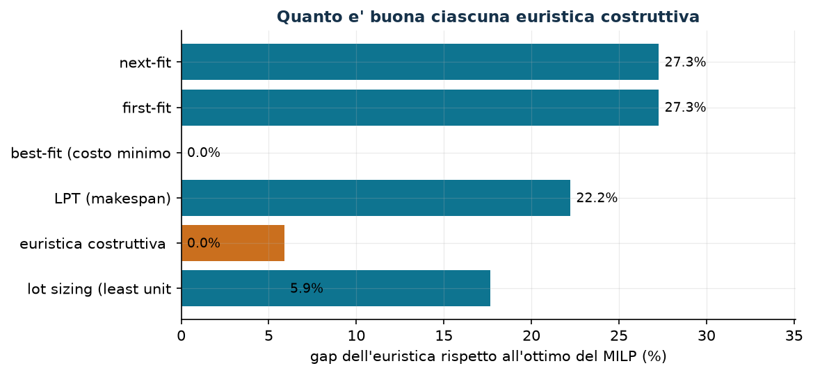

# Euristiche costruttive

**Classe:** algoritmi · **Script:** `python/cap05_euristiche.py`, `python/euristiche.py`

[](https://colab.research.google.com/github/fabiofurini/modellazione-mip/blob/main/notebooks/cap05_euristiche.ipynb)

Un'euristica costruttiva costruisce **una** soluzione in fretta, aggiungendo un
elemento per volta e senza mai tornare indietro. Non dimostra niente sulla sua
qualità, e non garantisce nemmeno di arrivare a una soluzione ammissibile: può
bloccarsi a metà, con un elemento che non entra da nessuna parte. Quando finisce
con una soluzione ammissibile, quella soluzione è l'altra metà del sandwich del
[capitolo 4](modellazione-4.md): il lato pessimistico, quello garantito da una
soluzione che esiste davvero; quando fallisce, bound primale non ce n'è.

!!! note "Che cosa deve produrre un'euristica in questo corso"
    1. uno **pseudocodice** leggibile, con l'ordine di scansione, il criterio di
       scelta, la gestione dei pareggi e il caso di fallimento dichiarati;
    2. la **funzione Python** corrispondente, riga per riga;
    3. la **traccia** dell'esecuzione su un'istanza;
    4. la **verifica di ammissibilità**: vincoli, bound *e* interezza;
    5. il **bound** che ne segue, con il nome giusto.

    Il punto 4 non è una formalità: una soluzione che soddisfa i vincoli lineari
    ma ha una componente frazionaria è ammissibile per il *rilassamento*, non per
    il MILP, e il suo valore non è un bound primale.

!!! danger "Il verso del bound dipende dall'obiettivo, non dall'euristica"
    In un problema di **minimo** il valore di una soluzione ammissibile è un
    *upper* bound: $z(\mathit{MILP}) \le \mathit{UB}$. In un **massimo** è un
    *lower* bound: $\mathit{LB} \le z(\mathit{MILP})$. Chiamare $UB$ il
    risultato di una euristica costruttiva su un massimo è l'errore di segno più comune del
    corso.

## Le tre euristiche di tipo bin packing

```text
Costruisci(n, k, t, a, gamma):
  x[j][m] <- 0 per ogni j, m;   ra[m] <- a[m] per ogni m
  per j = 1..n:
      # next-fit:  solo la macchina corrente, poi la successiva
      # first-fit: la prima m con t[j][m] <= ra[m]
      # best-fit:  fra le m ammissibili, quella di gamma(j,m,ra) minimo
      scegli m* secondo la regola
      se nessuna m e' ammissibile: restituisci "nessuna soluzione trovata"
      x[j][m*] <- 1;  ra[m*] <- ra[m*] - t[j][m*]
  restituisci x
```

Tutte e tre scandiscono i lavori **nell'ordine dato**: cambiare l'ordine cambia
il risultato, e questo va detto quando si riporta un valore. I pareggi si
rompono sull'indice più piccolo, così l'esecuzione è riproducibile.

Sull'istanza del [problema 7.1](scheduling-1.md) (un **minimo**):

| Euristica | $UB$ | $z(\mathit{MILP})$ | gap |
|---|---:|---:|---:|
| next-fit | 14 | 11 | $27{,}3\%$ |
| first-fit | 14 | 11 | $27{,}3\%$ |
| best-fit sul costo | 11 | 11 | $0{,}0\%$ |

Il best-fit sul costo trova l'ottimo; ma nessun bound lo certifica — ci vuole il
solver, o un bound duale che arrivi a $11$, e nel problema 7.1 il duale a mano
si ferma a $10$.

## LPT: bilanciare su macchine identiche

```text
LPT(n, k, t):
  L[m] <- 0 per ogni m                        # carichi correnti
  per j in ordine di t[j] DECRESCENTE:
      m* <- argmin_m L[m]                     # pareggi: l'indice piu' piccolo
      x[j][m*] <- 1;  L[m*] <- L[m*] + t[j]
  restituisci x, max_m L[m]
```

L'ordine decrescente è essenziale: mettere per ultimi i lavori lunghi li rende
impossibili da sistemare.

!!! example "Sette lavori su tre macchine"
    $t = (5, 5, 4, 4, 3, 3, 3)$, $k = 3$, totale $27$.

    - **Passi 1–3.** I lavori $5$, $5$, $4$ vanno sulle tre macchine vuote:
      $L = (5, 5, 4)$.
    - **Passo 4.** Lavoro $4$: il carico minimo è la macchina 3, che passa a
      $8$. $L = (5, 5, 8)$.
    - **Passi 5–6.** I due lavori da $3$ vanno sulle macchine 1 e 2:
      $L = (8, 8, 8)$.
    - **Passo 7.** L'ultimo lavoro da $3$ trova tutti i carichi pari a $8$; per
      la regola dei pareggi va sulla macchina 1, che arriva a $11$.

    Makespan dell'LPT: $\mathit{UB} = 11$, con carichi $(11, 8, 8)$.

    **Il bound elementare.** Il makespan è almeno
    $\max(\max_j t_j,\ \sum_j t_j / k) = \max(5, 9) = 9$. L'ottimo è proprio
    $z(\mathit{MILP}) = 9$ — si raggiunge con $\{5,4\}$, $\{5,4\}$,
    $\{3,3,3\}$ — e l'LPT sbaglia del $22{,}2\%$.

!!! tip "Due bound gratis, da confrontare"
    $\max_j t_j$ e $\sum_j t_j / k$ si calcolano senza risolvere niente, e il
    migliore dei due è già spesso vicino all'ottimo. Un bound «ovvio» che nessuno
    scrive è un bound sprecato: il duale del [capitolo 4](modellazione-4.md)
    serve quando quelli ovvi non bastano, non al loro posto.

## Euristica costruttiva di copertura

```text
Euristica costruttivaCopertura(c, S):
  scoperte <- {1..m};   y[j] <- 0 per ogni j
  finche' scoperte non e' vuoto:
      per ogni j non ancora scelto: nuove(j) <- |{i in scoperte : j in S_i}|
      se nuove(j) = 0 per ogni j: restituisci "nessuna soluzione trovata"
      j* <- argmin_{j : nuove(j) > 0} c[j] / nuove(j)
      y[j*] <- 1;   scoperte <- scoperte \ {i : j* in S_i}
  restituisci y
```

Il criterio è il **costo per zona nuova**, non il costo assoluto.

Sulle quattro squadre del [capitolo 4](modellazione-4.md), $c = (4,3,5,3)$:
passo 1 rapporti $4/3$, $1$, $5/3$, $1$ → elemento 2 (copre le zone 1, 2, 5);
passo 2 rapporti $2$, $5/2$, $3/2$ → elemento 4 (zone 4 e 6); passo 3 rapporti
$4$ e $5$ → elemento 1. Soluzione $\{1,2,4\}$, costo $\mathit{UB} = 10$, che qui
è l'ottimo.

## Euristica costruttiva per lo zaino: un lower bound

```text
Euristica costruttivaZaino(p, w, C):
  residuo <- C;   y[j] <- 0 per ogni j
  per j in ordine di p[j]/w[j] DECRESCENTE:
      se w[j] <= residuo:  y[j] <- 1;  residuo <- residuo - w[j]
  restituisci y
```

Su $p = (10,7,6,4)$, $w = (5,4,3,3)$, $C = 9$: rapporti $2$, $7/4$, $2$, $4/3$;
si prendono gli oggetti 1 e 3 (peso $8$), valore $16$. Poiché il problema è di
**massimo**, $\mathit{LB} = 16 \le z(\mathit{MILP}) = 17$, gap $5{,}9\%$:
l'ottimo prende gli oggetti 1 e 2 riempiendo lo zaino esattamente. La euristica costruttiva
sbaglia perché l'oggetto 3 lascia un residuo inutilizzabile.

## Lot sizing: copertura di periodi a costo unitario minimo

```text
LeastUnitCost(d, f, h):
  t <- 1
  finche' t <= T:
      salta i periodi con d[t] = 0
      per k = 1..T-t+1:
          Q_k <- somma di d[t..t+k-1]
          c_k <- (f + h * somma di (s-t)*d[s] per s = t..t+k-1) / Q_k
      k* <- argmin_k c_k                      # il costo medio per unita' piu' basso
      produci Q_{k*} nel periodo t;   t <- t + k*
```

!!! danger "Questa non è la procedura di Wagner–Whitin"
    Wagner–Whitin è un algoritmo **esatto** di programmazione dinamica per il
    modello di lot sizing *senza capacità*: risolve quel modello all'ottimo in
    tempo polinomiale. La procedura qui sopra è un'euristica, e il suo valore è
    solo un bound. Chiamarla «euristica costruttiva di Wagner–Whitin» confonde due cose diverse.

Su $d = (20, 10, 30, 40, 10)$, lancio $f = 50$, magazzino $h = 1$: dal periodo 1
conviene coprire 2 periodi (costo unitario $2$); dal periodo 3 altri 2 (costo
unitario $\approx 1{,}286$); dal periodo 5 solo quello (costo unitario $5$).
Costo $\mathit{UB} = 200$ contro $z(\mathit{MILP}) = 170$, gap $17{,}6\%$ — che
è anche il valore che darebbe Wagner–Whitin, essendo esatto su questo modello.

## Ricerca locale, e che cosa non dà

Una **ricerca locale** parte da una soluzione ammissibile e prova mosse
elementari, accettando quelle che migliorano; si ferma in un **ottimo locale**.

Sulla soluzione LPT ($L = (11, 8, 8)$, makespan $11$), la mossa «sposta un
lavoro su un'altra macchina» non migliora nulla: spostare uno dei due lavori da
$3$ dalla macchina 1 porta il suo carico a $8$ ma alza a $11$ quello della
macchina che lo riceve. La ricerca locale si ferma a $11$, mentre l'ottimo è
$9$: per arrivarci serve una mossa di **scambio** fra due macchine.

!!! warning "Un ottimo locale non è un bound migliore"
    La ricerca locale restituisce una soluzione ammissibile, quindi un bound dal
    lato pessimistico, e nient'altro. Il fatto che si sia fermata non significa
    che sia arrivata.

## Quando la euristica costruttiva fallisce

!!! danger "«Nessuna soluzione trovata» non è «nessuna soluzione esiste»"
    Tre lavori di durata $(3, 3, 2)$ su due macchine con disponibilità
    $(5, 3)$. Il next-fit: il lavoro 1 va sulla macchina 1 (residuo $2$); il
    lavoro 2 non ci sta e passa alla macchina 2 (residuo $0$); il lavoro 3 non
    ci sta e non ci sono altre macchine: **fallimento**. Ma il problema è
    ammissibile: i lavori 2 e 3 stanno insieme sulla macchina 1 ($3 + 2 = 5$) e
    il lavoro 1 sulla macchina 2 ($3 \le 3$).

    Un'euristica costruttiva è *miope*: decide una cosa alla volta e non torna
    indietro. Il suo fallimento è un'informazione sull'euristica, non sul
    problema. Per dimostrare che un modello è inammissibile serve il solver
    (`Status = INFEASIBLE`) o una dimostrazione.

## Il quadro delle euristiche

| Euristica | Verso | valore | $z(\mathit{MILP})$ | gap |
|---|---|---:|---:|---:|
| next-fit / first-fit (assegnamento) | min ($UB$) | 14 | 11 | $27{,}3\%$ |
| best-fit sul costo (assegnamento) | min ($UB$) | 11 | 11 | $0{,}0\%$ |
| LPT (makespan) | min ($UB$) | 11 | 9 | $22{,}2\%$ |
| euristica costruttiva di copertura | min ($UB$) | 10 | 10 | $0{,}0\%$ |
| euristica costruttiva per rapporto (zaino) | max ($LB$) | 16 | 17 | $5{,}9\%$ |
| least unit cost (lot sizing) | min ($UB$) | 200 | 170 | $17{,}6\%$ |



!!! tip "Che cosa si impara da questa tabella"
    Due euristiche trovano l'ottimo e quattro no, e **prima** di risolvere il
    MILP non c'è modo di sapere quali. Un gap del $0\%$ e uno del $27\%$ si
    distinguono soltanto *dopo*. È per questo che il corso chiede sempre due
    bound: un'euristica da sola dice quanto costa una soluzione che si può
    realizzare, non quanto si sta perdendo.

## Codice

Le euristiche sono in
[`python/euristiche.py`](https://github.com/fabiofurini/modellazione-mip/blob/main/python/euristiche.py),
gli esempi in
[`python/cap05_euristiche.py`](https://github.com/fabiofurini/modellazione-mip/blob/main/python/cap05_euristiche.py);
il notebook è
[`notebooks/cap05_euristiche.ipynb`](https://github.com/fabiofurini/modellazione-mip/blob/main/notebooks/cap05_euristiche.ipynb).

<!-- script-incorporato: inizio (rigenerato da python/incorpora_codice.py) -->

??? example "Mostra lo script completo — `python/cap05_euristiche.py` (204 righe)"

    ```python
    """Capitolo 5 -- Euristiche costruttive: le sei famiglie, con traccia e bound.

    Ogni euristica del corso su un'istanza minima: la traccia passo-passo (lo stesso
    testo che finisce nella dispensa), la verifica di ammissibilita' della soluzione
    prodotta --- vincoli, bound *e* interezza --- e il confronto con l'ottimo del
    MILP corrispondente. Chiude con un passo di ricerca locale e con il caso in cui
    la euristica costruttiva fallisce senza che il problema sia inammissibile.
    """
    import gurobipy as gp
    import pandas as pd
    from gurobipy import GRB

    from euristiche import (best_fit, first_fit, euristica_copertura, euristica_lotti, euristica_zaino,
                            lpt, matrice, next_fit)
    from mip import (ammissibile, frazione, nuovo_modello, rilassamento, risolvi,
                     stampa_soluzione, valuta, viola_interezza)
    from stile import (ARANCIO, BLU, CICLO, GRIGIO, ROSSO, TEAL, VERDE, intestazione,
                       plt, salva_dati, salva_figura)

    R = range
    CONFRONTO = []


    def confronta(nome, senso, valore_eur, zmilp, note=""):
        gap = abs(valore_eur - zmilp) / abs(zmilp) if abs(zmilp) > 1e-9 else 0.0
        ruolo = "ub" if senso == "min" else "lb"
        print(f"  {nome:34s} euristica = {frazione(valore_eur):>6} ({ruolo})   "
              f"z(MILP) = {frazione(zmilp):>6}   gap = {100 * gap:.1f}%  {note}")
        CONFRONTO.append({"euristica": nome, "senso": senso, "valore_euristica": valore_eur,
                          "ruolo": ruolo, "z_milp": zmilp, "gap": gap})


    # ---------- 1. BIN PACKING: NEXT-FIT, FIRST-FIT, BEST-FIT ----------
    intestazione("5.1  Le tre euristiche di tipo bin packing su lavori e macchine")
    t51 = [[2, 1, 3], [3, 4, 2], [4, 5, 3]]
    c51 = [[5, 10, 2], [5, 4, 6], [5, 4, 6]]
    a51 = [5, 6, 7]


    def modello_assegnamento(t, c, a):
        n, k = len(t), len(a)
        m = nuovo_modello("assegnamento")
        x = m.addVars(n, k, vtype=GRB.BINARY, name="x")
        m.setObjective(gp.quicksum(c[j][mm] * x[j, mm] for j in R(n) for mm in R(k)), GRB.MINIMIZE)
        m.addConstrs((x.sum(j, "*") == 1 for j in R(n)), name="assegna")
        m.addConstrs((gp.quicksum(t[j][mm] * x[j, mm] for j in R(n)) <= a[mm] for mm in R(k)),
                     name="disponibilita")
        return m, x


    m51, x51 = modello_assegnamento(t51, c51, a51)
    z51 = risolvi(m51)
    for nome, e in [("next-fit", next_fit(t51, a51)),
                    ("first-fit", first_fit(t51, a51)),
                    ("best-fit (costo minimo)", best_fit(t51, a51, lambda j, mm, ra: c51[j][mm], "costo"))]:
        valore = sum(c51[j][mm] for (j, mm) in e.x)
        sol = {f"x[{j},{mm}]": 1 for (j, mm) in e.x}
        assert ammissibile(m51, sol), nome           # vincoli, bound E interezza
        confronta(f"5.1 {nome}", "min", valore, z51)
    print("  Traccia del best-fit (il testo che compare nella dispensa):")
    best_fit(t51, a51, lambda j, mm, ra: c51[j][mm], "costo").traccia.stampa()

    # ---------- 2. LPT: BILANCIAMENTO SU MACCHINE IDENTICHE ----------
    intestazione("5.2  LPT: il makespan su macchine identiche")
    t52 = [5, 5, 4, 4, 3, 3, 3]
    k52 = 3
    e52 = lpt(t52, k52)
    e52.traccia.stampa()
    m52 = nuovo_modello("makespan")
    x52 = m52.addVars(len(t52), k52, vtype=GRB.BINARY, name="x")
    T52 = m52.addVar(name="T")
    m52.setObjective(T52, GRB.MINIMIZE)
    m52.addConstrs((x52.sum(j, "*") == 1 for j in R(len(t52))), name="assegna")
    m52.addConstrs((T52 >= gp.quicksum(t52[j] * x52[j, mm] for j in R(len(t52))) for mm in R(k52)),
                   name="max")
    z52 = risolvi(m52)
    sol52 = {f"x[{j},{mm}]": 1 for (j, mm) in e52.x} | {"T": e52.makespan}
    assert ammissibile(m52, sol52)
    confronta("5.2 LPT (makespan)", "min", e52.makespan, z52,
              f"carichi {[int(c) for c in e52.carichi]}, totale {sum(t52)}")
    print(f"  Bound elementare: il makespan e' almeno max(max_j t_j, somma/k) = "
          f"max({max(t52)}, {frazione(sum(t52) / k52)}) = {frazione(max(max(t52), sum(t52) / k52))}")

    # ---------- 3. GREEDY DI COPERTURA ----------
    intestazione("5.3  Euristica costruttiva di copertura")
    c53 = [4, 3, 5, 3]
    S53 = [[0, 1], [1, 2], [0, 2], [0, 3], [1, 3], [2, 3]]
    e53 = euristica_copertura(c53, S53)
    e53.traccia.stampa()
    m53 = nuovo_modello("copertura")
    x53 = m53.addVars(len(c53), vtype=GRB.BINARY, name="x")
    m53.setObjective(gp.quicksum(c53[j] * x53[j] for j in R(len(c53))), GRB.MINIMIZE)
    m53.addConstrs((gp.quicksum(x53[j] for j in S53[i]) >= 1 for i in R(len(S53))), name="copri")
    z53 = risolvi(m53)
    assert ammissibile(m53, {f"x[{j}]": e53.y[j] for j in R(len(c53))})
    confronta("5.3 euristica costruttiva di copertura", "min", e53.valore, z53,
              f"scelti {[j + 1 for j in R(len(c53)) if e53.y[j]]}")

    # ---------- 4. GREEDY PER LO ZAINO: UN LOWER BOUND ----------
    intestazione("5.4  Euristica costruttiva per lo zaino: in un massimo l'euristica da' un lower bound")
    p54, w54, C54 = [10, 7, 6, 4], [5, 4, 3, 3], 9
    e54 = euristica_zaino(p54, w54, C54)
    e54.traccia.stampa()
    m54 = nuovo_modello("zaino")
    x54 = m54.addVars(4, vtype=GRB.BINARY, name="x")
    m54.setObjective(gp.quicksum(p54[j] * x54[j] for j in R(4)), GRB.MAXIMIZE)
    m54.addConstr(gp.quicksum(w54[j] * x54[j] for j in R(4)) <= C54, name="capacita")
    z54 = risolvi(m54)
    assert ammissibile(m54, {f"x[{j}]": e54.y[j] for j in R(4)})
    confronta("5.4 euristica costruttiva per rapporto p/w", "max", e54.valore, z54,
              f"presi {[j + 1 for j in R(4) if e54.y[j]]}, residuo {e54.residuo:g}")

    # ---------- 5. GREEDY DI LOT SIZING ----------
    intestazione("5.5  Lot sizing: copertura di periodi a costo unitario minimo")
    d55 = [20, 10, 30, 40, 10]
    setup55, hold55 = 50, 1
    e55 = euristica_lotti(d55, setup55, hold55)
    e55.traccia.stampa()
    T55 = len(d55)
    m55 = nuovo_modello("lotti")
    q55 = m55.addVars(T55, name="q")
    I55 = m55.addVars(T55, name="I")
    y55 = m55.addVars(T55, vtype=GRB.BINARY, name="y")
    Mtot = sum(d55)
    m55.setObjective(gp.quicksum(setup55 * y55[t] + hold55 * I55[t] for t in R(T55)), GRB.MINIMIZE)
    for t in R(T55):
        m55.addConstr((I55[t - 1] if t else 0) + q55[t] - I55[t] == d55[t], name=f"bilancio{t}")
        m55.addConstr(q55[t] <= Mtot * y55[t], name=f"link{t}")
    z55 = risolvi(m55)
    sol55 = {}
    for t in R(T55):
        sol55[f"q[{t}]"] = e55.lanci.get(t, 0)
        sol55[f"y[{t}]"] = 1 if t in e55.lanci else 0
    scorta = 0
    for t in R(T55):
        scorta += sol55[f"q[{t}]"] - d55[t]
        sol55[f"I[{t}]"] = scorta
    assert ammissibile(m55, sol55)
    confronta("5.5 lot sizing (least unit cost)", "min", e55.valore, z55,
              f"lanci nei periodi {[t + 1 for t in sorted(e55.lanci)]}")
    print("  Wagner-Whitin risolve *all'ottimo* questo stesso modello con la programmazione")
    print(f"  dinamica: il suo valore e' {frazione(z55)}, non quello dell'euristica.")

    # ---------- 6. UN PASSO DI RICERCA LOCALE ----------
    intestazione("5.6  Un passo di ricerca locale sulla soluzione LPT")
    carichi = list(e52.carichi)
    assegn = {j: mm for (j, mm) in e52.x}
    migliorato = True
    passi = 0
    while migliorato:
        migliorato = False
        for j, mm in list(assegn.items()):
            for nuovo in R(k52):
                if nuovo == mm:
                    continue
                prova = list(carichi)
                prova[mm] -= t52[j]
                prova[nuovo] += t52[j]
                if max(prova) < max(carichi) - 1e-9:
                    print(f"  Spostare il lavoro {j + 1} dalla macchina {mm + 1} alla {nuovo + 1}: "
                          f"makespan {max(carichi):g} -> {max(prova):g}")
                    carichi, assegn[j], migliorato, passi = prova, nuovo, True, passi + 1
                    break
            if migliorato:
                break
    if passi == 0:
        print(f"  Nessuno spostamento singolo migliora il makespan {max(carichi):g}: la")
        print(f"  soluzione LPT e' un ottimo locale per questa mossa. L'ottimo globale e' "
              f"{frazione(z52)}.")
    print("  Un ottimo locale non e' un ottimo globale, e la ricerca locale non produce")
    print("  bound migliori di quelli della soluzione che restituisce.")

    # ---------- 7. QUANDO LA GREEDY FALLISCE ----------
    intestazione("5.7  Un fallimento della euristica costruttiva non dimostra l'inammissibilita'")
    t57 = matrice([3, 3, 2], 2)
    a57 = [5, 3]
    e57 = next_fit(t57, a57)
    e57.traccia.stampa()
    print(f"  next-fit: ok = {e57.ok}")
    m57, x57 = modello_assegnamento(t57, [[1, 1], [1, 1], [1, 1]], a57)
    z57 = risolvi(m57)
    print(f"  Il MILP invece e' ammissibile, con ottimo {frazione(z57)}: soluzione "
          + ", ".join(f"x[{j+1}][{mm+1}]" for j in R(3) for mm in R(2) if x57[j, mm].X > 0.5))
    print("  La euristica costruttiva fallisce perche' e' miope, non perche' il problema non abbia")
    print("  soluzione: 'nessuna soluzione trovata' non e' 'nessuna soluzione esiste'.")
    assert not e57.ok

    # ---------- 8. IL QUADRO DELLE EURISTICHE ----------
    intestazione("5.8  Il quadro")
    tab = pd.DataFrame(CONFRONTO)
    salva_dati(tab, "cap05_euristiche")
    fig, ax = plt.subplots(figsize=(7.6, 3.6))
    etichette = [r["euristica"].split(" ", 1)[1][:22] for r in CONFRONTO]
    gap = [100 * r["gap"] for r in CONFRONTO]
    colori = [TEAL if r["senso"] == "min" else ARANCIO for r in CONFRONTO]
    ax.barh(etichette, gap, color=colori)
    for i, g in enumerate(gap):
        ax.annotate(f"{g:.1f}%", (g, i), textcoords="offset points", xytext=(4, -3), fontsize=9)
    ax.set_xlabel("gap dell'euristica rispetto all'ottimo del MILP (%)")
    ax.set_title("Quanto e' buona ciascuna euristica costruttiva")
    ax.invert_yaxis()
    ax.set_xlim(0, max(gap) * 1.25 + 1)
    salva_figura(fig, "cap05_gap")
    print("Fine.")
    ```

<!-- script-incorporato: fine -->
