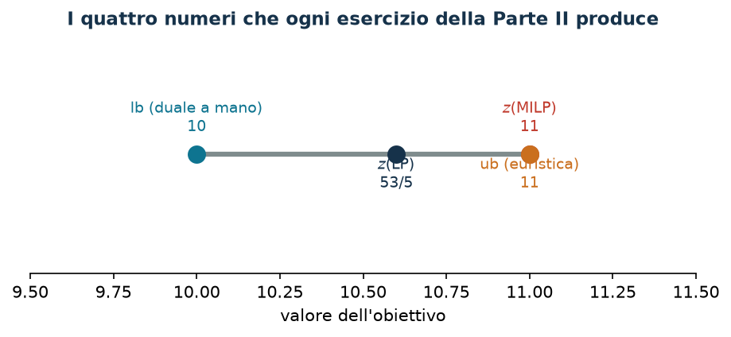

# Dal modello a Python/Gurobi

**Classe:** implementazione · **Script:** `python/cap06_gurobi.py`

[](https://colab.research.google.com/github/fabiofurini/modellazione-mip/blob/main/notebooks/cap06_gurobi.ipynb)

Il corso usa **un solo solver**, Gurobi da Python. Questa pagina mostra come si
scrive un modello — una famiglia di vincoli per blocco, con i nomi del modello
matematico — e soprattutto come si **leggono** i risultati, incluso il caso in
cui il solver non ha finito.

## Le quattro classi di variabili

| Che cosa | `vtype` | Dominio | Uso tipico |
|---|---|---|---|
| decisione sì/no | `GRB.BINARY` | $\{0,1\}$ | selezione, attivazione, assegnamento |
| conteggio | `GRB.INTEGER` | $\mathbb{Z}$ fra `lb` e `ub` | scatole, turni, operai |
| quantità misurabile | (default) | $[\mathit{LB}, \mathit{UB}] \subseteq \mathbb{R}$ | tempo, denaro, flusso |
| variabile libera | (default) con `lb=-GRB.INFINITY` | $\mathbb{R}$ | duali di uguaglianze |

!!! warning "I due default che si dimenticano"
    `GRB.BINARY` implica già `lb = 0` e `ub = 1`: non serve ripeterli. Una
    variabile continua ha `lb = 0` per default: una variabile che deve poter
    essere negativa — tipicamente un duale di uguaglianza, o una deviazione con
    segno — va dichiarata con `lb=-GRB.INFINITY`, altrimenti il modello è
    silenziosamente sbagliato.

## Il modello, una famiglia per blocco

```python
def modello(t, c, a):
    """Il problema 7.1: una addConstrs per famiglia, con il nome dell'etichetta."""
    m = gp.Model("assegnamento");  m.Params.OutputFlag = 0
    x = m.addVars(n, k, vtype=GRB.BINARY, name="x")           # dati -> variabili
    m.setObjective(gp.quicksum(c[j][h] * x[j, h] for j in range(n)
                               for h in range(k)), GRB.MINIMIZE)
    m.addConstrs((x.sum(j, "*") == 1 for j in range(n)), name="assegna")
    m.addConstrs((gp.quicksum(t[j][h] * x[j, h] for j in range(n)) <= a[h]
                  for h in range(k)), name="disponibilita")
    return m, x
```

Le tre regole di scrittura del corso: **una `addConstrs` per famiglia**,
nell'ordine del modello matematico, con il `name` uguale all'etichetta; **le
variabili si dichiarano tutte insieme** con `addVars` e gli indici del modello
(`x.sum(j, "*")` è la scrittura dell'indice muto); **i dati arrivano come
argomenti**, non come variabili globali, così la stessa funzione serve per
l'istanza base e per tutte le varianti.

Il modello ha $9$ variabili, $6$ vincoli e $18$ coefficienti non nulli. Per
controllare che sia quello scritto sulla carta, `m.write("modello.lp")`:

```text
Minimize
  5 x[0,0] + 10 x[0,1] + 2 x[0,2] + 5 x[1,0] + 4 x[1,1] + 6 x[1,2]
   + 5 x[2,0] + 4 x[2,1] + 6 x[2,2]
Subject To
 assegna[0]: x[0,0] + x[0,1] + x[0,2] = 1
 ...
```

È il modo più rapido per accorgersi di un coefficiente sbagliato: il tabulare
dell'istanza e questo output devono coincidere riga per riga.

## Leggere i risultati

L'ordine di lettura non si cambia: `Status`, poi `SolCount`, poi `ObjVal` e
`ObjBound`, poi `MIPGap`, `NodeCount`, `Runtime`.

| `Status` | valore | `SolCount` | Che cosa si può dire |
|---|---:|---:|---|
| `OPTIMAL` | 2 | $\ge 1$ | $z(\mathrm{MILP}) = $ `ObjVal`, dimostrato |
| `INFEASIBLE` | 3 | 0 | il modello non ha soluzioni ammissibili |
| `UNBOUNDED` | 5 | 0 | manca un vincolo, o un bound su una variabile |
| `TIME_LIMIT` | 9 | 0 | niente: né una soluzione né, in generale, un bound utile |
| `TIME_LIMIT` | 9 | $\ge 1$ | `ObjBound` $\le z(\mathrm{MILP}) \le$ `ObjVal` |
| `SOLUTION_LIMIT` | 10 | $\ge 1$ | come sopra |

!!! example "I quattro casi sull'istanza del problema 7.1"
    - **Risoluzione normale.** `Status = 2`, `SolCount = 2`,
      `ObjVal = ObjBound = 11`, `MIPGap = 0`, `NodeCount = 0`.
    - **Inammissibile.** Con disponibilità $(1,1,1)$: `Status = 3`,
      `SolCount = 0`.
    - **Fermato subito.** Con `TimeLimit = 0`: `Status = 9`, `SolCount = 0`,
      `ObjBound` $= -\infty$. Non c'è nulla da riportare.
    - **Fermato alla prima soluzione.** Con `SolutionLimit = 1`: `Status = 10`,
      `SolCount = 1`, `ObjVal = 12`, `ObjBound = 10`, `MIPGap = 0,1667`. Questo
      è il caso in cui si riporta un **intervallo**: l'ottimo sta fra $10$ e
      $12$. Dire «l'ottimo è $12$» sarebbe falso.

!!! danger "Che cosa *non* si riporta"
    Non si scrive «l'ottimo è `ObjVal`» se `Status` non è `OPTIMAL`. Non si
    scrive un gap se `SolCount` è $0$. Non si confronta il `Runtime` di due
    modelli risolti con impostazioni diverse. E non si legge `ObjBound` a fine
    risoluzione pensando di leggere il rilassamento della radice: per quello
    serve `relax()`.

## Le tolleranze

| Parametro | Default | Significato |
|---|---:|---|
| `IntFeasTol` | $10^{-5}$ | quanto una variabile intera può distare da un intero |
| `FeasibilityTol` | $10^{-6}$ | violazione ammessa su un vincolo lineare |
| `OptimalityTol` | $10^{-6}$ | tolleranza sui costi ridotti |
| `MIPGap` | $10^{-4}$ | gap relativo sotto il quale il solver si ferma |

!!! warning "«Intero» significa «intero entro una tolleranza»"
    Una binaria può tornare come $0{,}9999999997$. Nel testo si scrive $1$: i
    valori si arrotondano *quando si riportano*, e i confronti si fanno sempre
    con una tolleranza — nel corso $10^{-6}$, la costante `TOL` di
    `python/mip.py`. Scrivere `if x.X == 1` è un errore; si scrive
    `if x.X > 0.5`.

    Il default `MIPGap` $= 10^{-4}$ significa anche che il solver può fermarsi
    *prima* dell'ottimo esatto dichiarando `OPTIMAL`: su istanze con valori
    grandi vale la pena abbassarlo.

## Il rilassamento con `relax()`

```python
m.update()            # relax() copia il modello: le modifiche pendenti vanno applicate prima
r = m.relax()         # le binarie diventano 0 <= x <= 1, le intere x >= lb
r.Params.OutputFlag = 0
r.optimize()
zlp = r.ObjVal
duali = {c.ConstrName: c.Pi for c in r.getConstrs()}
```

Sull'istanza del problema 7.1, $z(\mathrm{LP}^+) = z(\mathrm{LP}) = 53/5$ — i
due rilassamenti coincidono perché i vincoli di assegnamento implicano già
$x_{jm} \le 1$ — e i duali non nulli sono $\tilde\mu = (2,\ 4{,}8,\ 5)$ e
$\tilde\pi_2 = -0{,}2$: la macchina 2 è la sola risorsa stretta.

## Il protocollo del corso, dall'inizio alla fine

$$\text{dati} \to \text{modello} \to \text{euristica e verifica} \to \text{LP e duale} \to \text{MIP} \to \text{tabella} \to \text{figure e notebook}$$

```python
m, x = modello(t, c, a)                                  # (1) dati, (2) modello

e = best_fit(t, a, lambda j, h, ra: c[j][h], "costo")    # (3) euristica
ub = sum(c[j][h] for (j, h) in e.x)
assert ammissibile(m, {f"x[{j},{h}]": 1 for (j, h) in e.x})   # vincoli, bound E interezza

d = duale(t, c, a)                                       # (4) duale scritto a mano
mano = {f"mu[{j}]": min(c[j]) for j in range(n)}
lb, viol = valuta(d, mano);  assert viol <= 1e-9
zlp, zlp_raff, pi = due_rilassamenti(m, d)               #     controlla la dualita' forte

z = risolvi(m)                                           # (5) il MIP
riga = registra_bound("7.1 assegnamento", ub, lb, zlp, zlp_raff, z)   # (6) la tabella
salva_dati(pd.DataFrame([riga]), "sched1_bound")         #     -> dati/sched1_bound.csv
```

Sull'istanza del problema 7.1 il protocollo produce $\mathit{LB} = 10$,
$z(\mathrm{LP}) = 53/5$, $z(\mathrm{MILP}) = 11$, $\mathit{UB} = 11$, e la riga
finisce in `dati/sched1_bound.csv`. Da lì la leggono la dispensa, la pagina del
sito e `verifica_numeri.py`: **un solo posto in cui il numero esiste**.



## Eseguire il codice

Dalla cartella `python/`:

```bash
python3 -m venv .venv && source .venv/bin/activate
pip install gurobipy pandas matplotlib
python3 fam07_1_assegnamento.py     # un capitolo
python3 esegui_tutti.py             # tutti, piu' i notebook
python3 verifica_numeri.py          # gli assert su ogni numero citato
```

Su Colab ogni capitolo ha un notebook che si apre dal badge in cima alla pagina:
la prima cella installa `gurobipy` e scarica i tre moduli comuni.

!!! tip "La licenza inclusa in `gurobipy` basta, e perché"
    La licenza *size-limited* del pacchetto pip permette modelli fino a **2000
    variabili e 2000 vincoli**. Le istanze di questo corso sono piccolissime — il
    modello più grande della Parte II ha poche decine di variabili — e ci stanno
    tutte con enorme margine. Per istanze più grandi si attiva gratuitamente la
    licenza accademica da [portal.gurobi.com](https://portal.gurobi.com). Se un
    modello supera il limite, Gurobi lo segnala con un errore esplicito
    all'atto di `optimize()`: non produce silenziosamente un risultato sbagliato.

## Codice

Lo script completo è
[`python/cap06_gurobi.py`](https://github.com/fabiofurini/modellazione-mip/blob/main/python/cap06_gurobi.py);
il notebook è
[`notebooks/cap06_gurobi.ipynb`](https://github.com/fabiofurini/modellazione-mip/blob/main/notebooks/cap06_gurobi.ipynb).

<!-- script-incorporato: inizio (rigenerato da python/incorpora_codice.py) -->

??? example "Mostra lo script completo — `python/cap06_gurobi.py` (197 righe)"

    ```python
    """Capitolo 6 -- Dal modello a Python/Gurobi: come si scrive e come si legge.

    Le quattro classi di variabili, una addConstrs per famiglia di vincoli, e
    soprattutto la lettura dei risultati: Status, SolCount, ObjVal, ObjBound,
    MIPGap, NodeCount, il limite di tempo, le tolleranze e relax(). Chiude con il
    protocollo completo del corso su un'istanza minima.
    """
    import gurobipy as gp
    import pandas as pd
    from gurobipy import GRB

    from euristiche import best_fit
    from mip import (ammissibile, due_rilassamenti, frazione, nuovo_modello, registra_bound,
                     rilassamento, risolvi, stampa_lp, stampa_soluzione, valuta, viola_interezza)
    from stile import (ARANCIO, BLU, CICLO, GRIGIO, ROSSO, TEAL, VERDE, intestazione,
                       plt, salva_dati, salva_figura)

    R = range

    # ---------- 1. LE QUATTRO CLASSI DI VARIABILI ----------
    intestazione("1. Le quattro classi di variabili e i loro domini")
    m = nuovo_modello("tipi_di_variabile")
    b = m.addVar(vtype=GRB.BINARY, name="binaria")
    i = m.addVar(vtype=GRB.INTEGER, lb=0, ub=10, name="intera")
    c = m.addVar(lb=0.0, ub=GRB.INFINITY, name="continua")
    l = m.addVar(lb=-GRB.INFINITY, ub=GRB.INFINITY, name="libera")
    m.update()
    for v in m.getVars():
        print(f"  {v.VarName:9s} VType = {v.VType}   lb = {v.LB:>6.1f}   ub = "
              f"{'+inf' if v.UB >= GRB.INFINITY else f'{v.UB:.1f}':>6s}")
    print("  GRB.BINARY implica gia' lb = 0 e ub = 1: non serve dichiararli.")
    print("  Una variabile continua ha lb = 0 per default: le variabili libere vanno")
    print("  dichiarate esplicitamente con lb = -GRB.INFINITY (i duali di un'uguaglianza).")

    # ---------- 2. UN MODELLO, UNA FAMIGLIA DI VINCOLI ALLA VOLTA ----------
    intestazione("2. Il modello si scrive una famiglia di vincoli per blocco")
    t = [[2, 1, 3], [3, 4, 2], [4, 5, 3]]
    co = [[5, 10, 2], [5, 4, 6], [5, 4, 6]]
    a = [5, 6, 7]
    n, k = 3, 3


    def modello(t, co, a):
        """Il problema 7.1: una addConstrs per famiglia, con il nome dell'etichetta."""
        mm = nuovo_modello("assegnamento")
        x = mm.addVars(n, k, vtype=GRB.BINARY, name="x")          # dati -> variabili
        mm.setObjective(gp.quicksum(co[j][h] * x[j, h] for j in R(n) for h in R(k)), GRB.MINIMIZE)
        mm.addConstrs((x.sum(j, "*") == 1 for j in R(n)), name="assegna")
        mm.addConstrs((gp.quicksum(t[j][h] * x[j, h] for j in R(n)) <= a[h] for h in R(k)),
                      name="disponibilita")
        return mm, x


    m2, x2 = modello(t, co, a)
    m2.update()
    print(f"  Variabili: {m2.NumVars}   vincoli: {m2.NumConstrs}   non zeri: {m2.NumNZs}")
    print("  Nomi dei vincoli (le stesse etichette del modello matematico):")
    print("   " + ", ".join(cc.ConstrName for cc in m2.getConstrs()))
    print("  Il modello dell'istanza in formato LP, per controllare i tabulari della dispensa:")
    import io
    import os
    import tempfile
    with tempfile.TemporaryDirectory() as d:
        percorso = os.path.join(d, "modello.lp")
        m2.write(percorso)
        testo_lp = open(percorso).read()
    for riga in [r for r in testo_lp.splitlines() if r.strip()][:8]:
        print("    " + riga)
    print("    ...")

    # ---------- 3. LEGGERE I RISULTATI: IL CASO NORMALE ----------
    intestazione("3. Leggere i risultati quando tutto va bene")
    m2.optimize()
    print(f"  Status   = {m2.Status}   (2 = OPTIMAL)")
    print(f"  SolCount = {m2.SolCount}   (quante soluzioni intere sono state trovate)")
    print(f"  ObjVal   = {frazione(m2.ObjVal)}   ObjBound = {frazione(m2.ObjBound)}   "
          f"MIPGap = {m2.MIPGap:.6f}")
    print(f"  NodeCount = {int(m2.NodeCount)}   Runtime = {m2.Runtime:.3f} s")
    print("  Soluzione ottima (solo le variabili non nulle):")
    stampa_soluzione(m2, solo_non_nulle=True)
    z_ott = m2.ObjVal

    # ---------- 4. LEGGERE I RISULTATI QUANDO NON VA BENE ----------
    intestazione("4. I tre casi in cui ObjVal non si puo' leggere")
    # (a) inammissibile
    m3, x3 = modello(t, co, [1, 1, 1])          # disponibilita' insufficienti
    m3.optimize()
    print(f"  (a) disponibilita' (1,1,1): Status = {m3.Status} (3 = INFEASIBLE), "
          f"SolCount = {m3.SolCount}")
    print("      ObjVal non esiste: leggerlo solleva un errore. Si legge Status, sempre prima.")
    assert m3.Status == GRB.INFEASIBLE
    # (b) limite di tempo con nessuna soluzione trovata
    m4, x4 = modello(t, co, a)
    m4.Params.TimeLimit = 0.0
    m4.optimize()
    print(f"  (b) TimeLimit = 0: Status = {m4.Status} (9 = TIME_LIMIT), SolCount = {m4.SolCount}")
    print(f"      ObjBound = {m4.ObjBound if m4.ObjBound > -GRB.INFINITY else '-inf'}: "
          f"nemmeno il bound e' stato calcolato.")
    # (c) limite di tempo con una soluzione trovata: il caso utile
    m5, x5 = modello(t, co, a)
    m5.Params.SolutionLimit = 1                 # si ferma alla prima soluzione intera
    m5.optimize()
    print(f"  (c) SolutionLimit = 1: Status = {m5.Status} (10 = SOLUTION_LIMIT), "
          f"SolCount = {m5.SolCount}")
    if m5.SolCount > 0:
        print(f"      ObjVal = {frazione(m5.ObjVal)}  ObjBound = {frazione(m5.ObjBound)}  "
              f"MIPGap = {m5.MIPGap:.4f}")
        print("      Questo e' l'unico caso in cui si riporta un intervallo: l'ottimo sta")
        print("      fra ObjBound e ObjVal, e il MIPGap ne misura l'ampiezza.")
    salva_dati(pd.DataFrame([
        {"caso": "ottimo", "status": m2.Status, "sol_count": m2.SolCount, "obj_val": m2.ObjVal,
         "obj_bound": m2.ObjBound, "mip_gap": m2.MIPGap},
        {"caso": "inammissibile", "status": m3.Status, "sol_count": m3.SolCount,
         "obj_val": None, "obj_bound": None, "mip_gap": None},
        {"caso": "limite di tempo, nessuna soluzione", "status": m4.Status,
         "sol_count": m4.SolCount, "obj_val": None, "obj_bound": None, "mip_gap": None},
        {"caso": "prima soluzione", "status": m5.Status, "sol_count": m5.SolCount,
         "obj_val": m5.ObjVal if m5.SolCount else None,
         "obj_bound": m5.ObjBound, "mip_gap": m5.MIPGap if m5.SolCount else None},
    ]), "cap06_stati")

    # ---------- 5. TOLLERANZE ----------
    intestazione("5. Le tolleranze: 'intero' vuol dire 'intero entro IntFeasTol'")
    m6, x6 = modello(t, co, a)
    print(f"  IntFeasTol  = {m6.Params.IntFeasTol:g}  (quanto una binaria puo' distare da 0 o 1)")
    print(f"  FeasibilityTol = {m6.Params.FeasibilityTol:g}  (violazione ammessa sui vincoli)")
    print(f"  OptimalityTol  = {m6.Params.OptimalityTol:g}  (tolleranza sui costi ridotti)")
    print(f"  MIPGap (obiettivo) = {m6.Params.MIPGap:g}  (si ferma quando il gap scende sotto)")
    m6.optimize()
    peggiore = max(min(abs(v.X - round(v.X)), 1) for v in m6.getVars())
    print(f"  Sulla soluzione restituita, la distanza massima da un intero e' {peggiore:.2e}")
    print("  Nel testo si scrive 1, non 0.9999999997: i valori si arrotondano quando si")
    print("  riportano, e i confronti si fanno con una tolleranza (nel corso, 1e-6).")

    # ---------- 6. IL RILASSAMENTO CON relax() ----------
    intestazione("6. relax(): il rilassamento del modello che abbiamo scritto")
    zlp_r, sol_r, pi_r = rilassamento(m6, rafforzato=True)
    zlp_p, _, _ = rilassamento(m6, rafforzato=False)
    print(f"  z(LP+) = {frazione(zlp_r)}   (relax(): le binarie diventano 0 <= x <= 1)")
    print(f"  z(LP)  = {frazione(zlp_p)}   (rilassamento senza i bound: si toglie anche x <= 1)")
    print("  Duali del rilassamento letti da Gurobi:")
    for nome, valore in pi_r.items():
        if abs(valore) > 1e-9:
            print(f"    {nome}: {valore:.4f}")
    print("  relax() copia il modello: le modifiche pendenti vanno applicate prima con")
    print("  m.update(), altrimenti si rilassa una versione vecchia.")

    # ---------- 7. IL PROTOCOLLO DEL CORSO, DALL'INIZIO ALLA FINE ----------
    intestazione("7. Il protocollo: dati -> modello -> euristica -> LP e duale -> MIP -> tabella")
    # (1) dati  ->  (2) modello
    m7, x7 = modello(t, co, a)
    # (3) euristica e sua verifica
    e = best_fit(t, a, lambda j, h, ra: co[j][h], "costo")
    ub = sum(co[j][h] for (j, h) in e.x)
    sol_eur = {f"x[{j},{h}]": 1 for (j, h) in e.x}
    assert ammissibile(m7, sol_eur), "la soluzione euristica deve essere ammissibile E intera"
    print(f"  (3) euristica best-fit: ub = {frazione(ub)}, ammissibilita' verificata "
          f"(vincoli, bound e interezza)")
    # (4) LP e duale scritto a mano
    d = nuovo_modello("duale")
    mu = d.addVars(n, lb=-GRB.INFINITY, name="mu")
    pi = d.addVars(k, lb=-GRB.INFINITY, ub=0.0, name="pi")
    d.setObjective(mu.sum() + gp.quicksum(a[h] * pi[h] for h in R(k)), GRB.MAXIMIZE)
    d.addConstrs((mu[j] + t[j][h] * pi[h] <= co[j][h] for j in R(n) for h in R(k)), name="rc")
    mano = {f"mu[{j}]": min(co[j]) for j in R(n)}
    lb, viol = valuta(d, mano)
    assert viol <= 1e-9
    print(f"  (4) soluzione duale a mano: lb = {frazione(lb)}, ammissibile per il duale")
    zlp, zlp_raff, _ = due_rilassamenti(m7, d)
    # (5) MIP
    z = risolvi(m7)
    # (6) tabella
    riga = registra_bound("7.1 assegnamento", ub, lb, zlp, zlp_raff, z)
    salva_dati(pd.DataFrame([riga]), "cap06_protocollo")
    assert lb <= zlp <= z <= ub + 1e-9
    print("  (7) la riga della tabella e' quella qui sopra, ed e' salvata in CSV: da li'")
    print("      la leggono la dispensa, il sito e verifica_numeri.py.")

    # ---------- 8. FIGURA: I QUATTRO NUMERI DEL PROTOCOLLO ----------
    fig, ax = plt.subplots(figsize=(7.2, 2.6))
    ax.plot([lb, ub], [0, 0], color=GRIGIO, lw=3, solid_capstyle="round")
    for valore, colore, testo, dy in [(lb, TEAL, "$\\mathrm{lb}$ (duale a mano)", 14),
                                      (zlp, BLU, "$z(\\mathrm{LP})$", -20),
                                      (z, ROSSO, "$z(\\mathrm{MILP})$", 14),
                                      (ub, ARANCIO, "$\\mathrm{ub}$ (euristica)", -20)]:
        ax.plot(valore, 0, "o", color=colore, ms=10)
        ax.annotate(f"{testo}\n{frazione(valore)}", (valore, 0), textcoords="offset points",
                    xytext=(0, dy), ha="center", fontsize=9, color=colore)
    ax.set_yticks([])
    ax.set_ylim(-0.8, 0.8)
    ax.set_xlim(lb - 0.5, ub + 0.5)
    ax.set_xlabel("valore dell'obiettivo")
    ax.set_title("I quattro numeri che ogni esercizio della Parte II produce")
    ax.spines["left"].set_visible(False)
    ax.grid(False)
    salva_figura(fig, "cap06_protocollo")
    print("Fine.")
    ```

<!-- script-incorporato: fine -->
