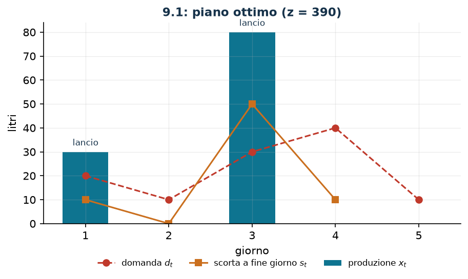

# Lotti con costo fisso di lancio

**Classe:** MILP · **Legami:** costo fisso (big-M letto dai dati) · **Script:** `python/fam09_1_lotti.py`

[](https://colab.research.google.com/github/fabiofurini/modellazione-mip/blob/main/notebooks/fam09_1_lotti.ipynb)

!!! abstract "Problema 9.1"
    Un'azienda deve pianificare la produzione di un unico prodotto su
    $n \in \mathbb{Z}_{\ge 1}$ periodi. Per ogni periodo $t$, $d_t$ è la domanda,
    $p_t$ il costo di produrre una unità e $q_t$ il costo fisso da sostenere se
    in quel periodo la produzione viene lanciata. Per ogni $t \le n-1$, $h_t$ è
    il costo di tenere una unità in magazzino a fine periodo. La scorta iniziale
    è $r_0$, quella finale richiesta è $r_n$. Si vuole soddisfare tutta la
    domanda al costo totale minimo.

**Il problema a parole.** *Decidiamo* quanto produrre in ogni periodo, e di
conseguenza quanto resta in magazzino. *L'obiettivo*: costo totale (produzione,
lanci e magazzino) minimo. *I vincoli*: la domanda di ogni periodo va
soddisfatta esattamente, e non si può produrre senza pagare il costo fisso. È il
problema di **lot sizing** con setup.

## Modello

**Variabili.** $x_t \ge 0$ unità prodotte, $s_t \ge 0$ scorta a fine periodo
($t \le n-1$), $y_t \in \{0,1\}$ lancio della produzione.

$$
\begin{aligned}
\min ~~ & \sum_{t=1}^{n} p_t\, x_t + \sum_{t=1}^{n} q_t\, y_t + \sum_{t=1}^{n-1} h_t\, s_t \\
\text{s.a.} \quad & x_1 - s_1 = d_1 - r_0, \\
& x_t + s_{t-1} - s_t = d_t, && t = 2, \dots, n-1, \\
& x_n + s_{n-1} = d_n + r_n, \\
& -x_t + M_t\, y_t \ge 0, && t = 1, \dots, n, \\
& x_t,\ s_t \ge 0, \qquad y_t \in \{0,1\}.
\end{aligned}
$$

**Il legame.** Il vincolo $x_t \le M_t\, y_t$ dice: se $y_t = 0$ allora
$x_t = 0$ (senza lancio non si produce); se $y_t = 1$ il vincolo non è
restrittivo. Il verso opposto — se $x_t = 0$ allora $y_t = 0$ — non è imposto da
alcun vincolo ma segue dall'**ottimalità**, perché porre $y_t = 0$ resta
ammissibile e fa risparmiare $q_t \ge 0$.

!!! warning "Il big-M si legge dai dati"
    Un $M_t$ valido deve essere almeno la massima quantità che conviene produrre
    nel periodo $t$. In una soluzione ottima non si produce mai più della domanda
    che resta da coprire:

    $$M_t = \sum_{\tau = t}^{n} d_\tau + r_n .$$

    Ogni valore più grande è ancora valido ma **indebolisce** il rilassamento LP;
    ogni valore più piccolo può tagliare soluzioni ottime. Sull'istanza
    $M = (110, 90, 80, 50, 10)$: il big-M dell'ultimo periodo vale $10$, non $110$.

## Il modello in gurobipy

```python
m = gp.Model("lotti")
x = m.addVars(n, name="x")
s = m.addVars(n - 1, name="s")
y = m.addVars(n, vtype=GRB.BINARY, name="y")
m.setObjective(gp.quicksum(p[t] * x[t] for t in range(n))
               + gp.quicksum(q[t] * y[t] for t in range(n))
               + gp.quicksum(h[t] * s[t] for t in range(n - 1)), GRB.MINIMIZE)
m.addConstr(x[0] - s[0] == d[0] - r0, name="bilancio[0]")
m.addConstrs((x[t] + s[t - 1] - s[t] == d[t] for t in range(1, n - 1)), name="bilancio")
m.addConstr(x[n - 1] + s[n - 2] == d[n - 1] + rn, name=f"bilancio[{n - 1}]")
m.addConstrs((-x[t] + M[t] * y[t] >= 0 for t in range(n)), name="lancio")
```

## L'istanza

$n = 5$ giorni, $r_0 = r_n = 0$, domanda totale $110$ unità.

| | $t=1$ | $t=2$ | $t=3$ | $t=4$ | $t=5$ |
|---|---:|---:|---:|---:|---:|
| $d_t$ | 20 | 10 | 30 | 40 | 10 |
| $p_t$ | 2 | 3 | 2 | 3 | 2 |
| $q_t$ | 50 | 50 | 50 | 50 | 50 |
| $M_t$ | 110 | 90 | 80 | 50 | 10 |
| $h_t$ | 1 | 1 | 1 | 1 | — |

## Euristiche costruttive: il bound primale

**(a) Lot-for-lot.** Si produce ogni giorno esattamente la domanda: nessuna
scorta, ma un lancio ogni giorno. Costo $270 + 250 = 520$.

**(b) Least unit cost.** Si parte dal primo periodo scoperto e si copre con un
solo lancio il numero di periodi che minimizza il costo medio per unità, poi si
ricomincia. Costo $O(n^2)$.

- periodo 1: copre fino al 2, quantità $30$, costo medio $2$;
- periodo 3: copre fino al 4, quantità $70$, costo medio $\approx 1{,}286$;
- periodo 5: copre solo sé stesso, quantità $10$, costo medio $5$.

Si lancia nei giorni $1, 3, 5$, per un costo di $420$. Tenendo la migliore delle
due, $z(\mathit{MILP}) \le \mathit{UB} = 420$.

## Rilassamento LP e duale: il bound duale

Con $\mu_t$ **libera** su ogni bilancio e $\pi_t \ge 0$ su ogni vincolo di
lancio:

$$
\begin{aligned}
\max ~~ & \sum_t b_t\, \mu_t \\
\text{s.a.} \quad & \mu_t - \pi_t \le p_t, \qquad M_t\, \pi_t \le q_t, \qquad
-\mu_t + \mu_{t+1} \le h_t .
\end{aligned}
$$

**Ricetta.** $\bar\pi_t = 0$: i lanci si regalano. Restano $\mu_t \le p_t$ e
$\mu_{t+1} \le \mu_t + h_t$, e il valore più grande ammissibile si costruisce in
avanti,

$$\bar\mu_1 = p_1, \qquad \bar\mu_t = \min(\bar\mu_{t-1} + h_{t-1},\ p_t).$$

La lettura è diretta: $\bar\mu_t$ è il costo unitario più basso per avere una
unità disponibile nel periodo $t$, o producendola allora, o producendola prima e
tenendola in magazzino. Sull'istanza $\bar\mu = (2, 3, 2, 3, 2)$ e

$$\mathit{LB} = 2{\cdot}20 + 3{\cdot}10 + 2{\cdot}30 + 3{\cdot}40 + 2{\cdot}10 = 270 .$$

È il costo di produzione se i lanci fossero gratuiti: valido, e volutamente
ottimista.

**Quello che dice il solver.** $z(\mathit{LP}) = z(\mathit{LP}^+) = 3890/11
\approx 353{,}6$: il rilassamento i lanci li paga in frazione
($\pi_t = q_t/M_t$ è ammissibile). L'ottimo intero lancia nei giorni 1 e 3.

| | $t=1$ | $t=2$ | $t=3$ | $t=4$ | $t=5$ |
|---|---:|---:|---:|---:|---:|
| lancio $y_t$ | 1 | 0 | 1 | 0 | 0 |
| produzione $x_t$ | 30 | 0 | 80 | 0 | 0 |
| scorta $s_t$ | 10 | 0 | 50 | 10 | — |

| $UB$ | $LB$ (duale) | $z(\mathit{LP})$ | $z(\mathit{LP}^+)$ | $z(\mathit{MILP})$ | gap |
|---:|---:|---:|---:|---:|---:|
| 420 | 270 | $3890/11$ | $3890/11$ | 390 | $7{,}7\%$ |



## Considerazioni aggiuntive

- Il problema si risolve in tempo $O(n^2)$ con la programmazione dinamica di
  **Wagner–Whitin**. La least unit cost *non* è quell'algoritmo: è una regola
  miope che guarda un lancio per volta, e infatti si ferma a $420$ contro $390$.
- La disuguaglianza valida $x_t \le M_t$ non aggiunge nulla: $M_t$ è già la
  massima produzione utile, e infatti $z(\mathit{LP}) = z(\mathit{LP}^+)$.
- Una formulazione alternativa con variabili $x_{t\tau}$ («prodotte in $t$,
  vendute in $\tau$») ha rilassamento **intero** ma $O(n^2)$ variabili: il tipico
  scambio fra dimensione del modello e qualità del rilassamento.

## Domande di modellazione aggiuntive

??? question "9.1.1 — Capacità giornaliera"
    L'impianto non può produrre più di $35$ unità al giorno. Come cambia il
    modello? Qual è il nuovo ottimo?

    !!! tip "Soluzione"
        La soluzione è nel documento delle soluzioni, riservato ai docenti.
??? question "9.1.2 — Lotto minimo"
    Se in un giorno si produce, si devono produrre almeno $25$ unità. Come cambia
    il modello? Qual è il nuovo ottimo?

    !!! tip "Soluzione"
        La soluzione è nel documento delle soluzioni, riservato ai docenti.
## Codice

Script completo —
[`python/fam09_1_lotti.py`](https://github.com/fabiofurini/modellazione-mip/blob/main/python/fam09_1_lotti.py)
(riproducibile con `python3 python/fam09_1_lotti.py` dalla cartella `python/`).
Notebook —
[`notebooks/fam09_1_lotti.ipynb`](https://github.com/fabiofurini/modellazione-mip/blob/main/notebooks/fam09_1_lotti.ipynb)
— che si apre in Colab dal badge in cima alla pagina.

<!-- script-incorporato: inizio (rigenerato da python/incorpora_codice.py) -->

??? example "Mostra lo script completo — `python/fam09_1_lotti.py` (154 righe)"

    ```python
    """Problema 9.1 -- Produzione e lotti con costo fisso di lancio.

    Bilancio delle scorte, attivazione della produzione con big-M e magazzino. Il
    legame e' quello del costo fisso (sezione 3.2) con il coefficiente ricavato dai
    dati: M_t e' la domanda residua, non un numero grande a caso.
    """
    import gurobipy as gp
    import pandas as pd
    from gurobipy import GRB

    from euristiche import euristica_lotti
    from mip import (ammissibile, due_rilassamenti, frazione, nuovo_modello, registra_bound,
                     risolvi, valuta)
    from stile import ARANCIO, BLU, ROSSO, TEAL, VERDE, intestazione, plt, salva_dati, salva_figura

    R = range

    # ---------- 1. MODELLO E ISTANZA ----------
    intestazione("9.1 Produzione e lotti: bilancio delle scorte, lancio con costo fisso")
    d1 = [20, 10, 30, 40, 10]          # domanda dei cinque giorni
    p1 = [2, 3, 2, 3, 2]               # costo unitario di produzione
    q1 = [50, 50, 50, 50, 50]          # costo fisso di lancio
    h1 = [1, 1, 1, 1]                  # costo di magazzino a fine giorno (t = 1..n-1)
    r0, rn = 0, 0                      # scorta iniziale e finale richiesta
    n1 = len(d1)
    # il piu' piccolo big-M valido: in un ottimo non si produce mai piu' della domanda residua
    M1 = [sum(d1[t:]) + rn for t in R(n1)]
    salva_dati(pd.DataFrame({"giorno": R(1, n1 + 1), "domanda": d1, "costo_unitario": p1,
                             "costo_lancio": q1, "M": M1}), "prod1_dati")


    def modello_1(d, p, q, h, r0, rn):
        n = len(d)
        M = [sum(d[t:]) + rn for t in R(n)]
        m = nuovo_modello("lotti")
        x = m.addVars(n, name="x")                       # quantita' prodotta
        s = m.addVars(n - 1, name="s")                   # scorta a fine giorno t
        y = m.addVars(n, vtype=GRB.BINARY, name="y")     # lancio della produzione
        m.setObjective(gp.quicksum(p[t] * x[t] for t in R(n))
                       + gp.quicksum(q[t] * y[t] for t in R(n))
                       + gp.quicksum(h[t] * s[t] for t in R(n - 1)), GRB.MINIMIZE)
        m.addConstr(x[0] - s[0] == d[0] - r0, name="bilancio[0]")
        m.addConstrs((x[t] + s[t - 1] - s[t] == d[t] for t in R(1, n - 1)), name="bilancio")
        m.addConstr(x[n - 1] + s[n - 2] == d[n - 1] + rn, name=f"bilancio[{n - 1}]")
        m.addConstrs((-x[t] + M[t] * y[t] >= 0 for t in R(n)), name="lancio")
        return m, x, s, y


    def duale_1(d, p, q, h, r0, rn):
        """max sum_t b_t mu_t;  mu_t - pi_t <= p_t;  M_t pi_t <= q_t;  -mu_t + mu_{t+1} <= h_t;
        mu libere, pi >= 0."""
        n = len(d)
        M = [sum(d[t:]) + rn for t in R(n)]
        b = [d[0] - r0] + d[1:n - 1] + [d[n - 1] + rn]
        dl = nuovo_modello("duale_lotti")
        mu = dl.addVars(n, lb=-GRB.INFINITY, name="mu")
        pi = dl.addVars(n, name="pi")
        dl.setObjective(gp.quicksum(b[t] * mu[t] for t in R(n)), GRB.MAXIMIZE)
        dl.addConstrs((mu[t] - pi[t] <= p[t] for t in R(n)), name="rc_x")
        dl.addConstrs((M[t] * pi[t] <= q[t] for t in R(n)), name="rc_y")
        dl.addConstrs((-mu[t] + mu[t + 1] <= h[t] for t in R(n - 1)), name="rc_s")
        return dl


    m1, x1, s1, y1 = modello_1(d1, p1, q1, h1, r0, rn)
    print(f"  Domanda totale {sum(d1)}; big-M per giorno (domanda residua): {M1}")

    # ---------- 2. EURISTICHE COSTRUTTIVE (UPPER BOUND) ----------
    # (a) lot-for-lot: si produce ogni giorno esattamente la domanda, niente scorte
    lot_per_lot = sum(p1[t] * d1[t] for t in R(n1)) + sum(q1)
    sol_llf = {f"x[{t}]": d1[t] for t in R(n1)} | {f"y[{t}]": 1 for t in R(n1)} \
        | {f"s[{t}]": 0 for t in R(n1 - 1)}
    assert ammissibile(m1, sol_llf)
    print(f"  (a) lot-for-lot: si lancia ogni giorno, costo "
          f"{sum(p1[t] * d1[t] for t in R(n1))} di produzione + {sum(q1)} di lanci = {lot_per_lot}")
    # (b) least unit cost: si copre il numero di giorni che minimizza il costo medio per unita'
    e = euristica_lotti(d1, q1[0], h1[0])
    e.traccia.stampa()
    sol_luc = {f"x[{t}]": e.lanci.get(t, 0) for t in R(n1)} \
        | {f"y[{t}]": 1 if t in e.lanci else 0 for t in R(n1)}
    scorta = 0
    for t in R(n1 - 1):
        scorta += sol_luc[f"x[{t}]"] - d1[t]
        sol_luc[f"s[{t}]"] = scorta
    assert ammissibile(m1, sol_luc)
    luc = sum(p1[t] * sol_luc[f"x[{t}]"] for t in R(n1)) + sum(q1[t] for t in e.lanci) \
        + sum(h1[t] * sol_luc[f"s[{t}]"] for t in R(n1 - 1))
    print(f"  (b) least unit cost: lanci nei giorni {[t + 1 for t in sorted(e.lanci)]}, costo {luc}")
    ub1 = min(lot_per_lot, luc)
    print(f"  La migliore delle due: ub = {frazione(ub1)}")

    # ---------- 3. RILASSAMENTO LP E DUALE (LOWER BOUND) ----------
    dl1 = duale_1(d1, p1, q1, h1, r0, rn)
    # ricetta: pi = 0 (i lanci si regalano) e mu_t = costo minimo per avere una unita' al giorno t
    mu = []
    for t in R(n1):
        mu.append(p1[t] if t == 0 else min(mu[t - 1] + h1[t - 1], p1[t]))
    mano = {f"mu[{t}]": mu[t] for t in R(n1)}
    lb1, viol = valuta(dl1, mano)
    assert viol <= 1e-9, viol
    print("  Duale a mano: pi = 0 (i lanci non si pagano) e mu_t = il costo unitario piu' basso")
    print("  per avere una unita' disponibile il giorno t, cioe' min(mu_{t-1} + h_{t-1}, p_t):")
    print("    mu = " + ", ".join(frazione(v) for v in mu))
    print(f"  ->  lb = {frazione(lb1)}: e' il costo di produzione se i lanci fossero gratis.")
    zlp1, zlp1r, pi1 = due_rilassamenti(m1, dl1)

    # ---------- 4. OTTIMO DEL MILP ----------
    z1 = risolvi(m1)
    lanci_ott = [t + 1 for t in R(n1) if y1[t].X > 0.5]
    print(f"  Soluzione ottima: lanci nei giorni {lanci_ott}; quantita' "
          + ", ".join(frazione(x1[t].X) for t in R(n1))
          + "; scorte " + ", ".join(frazione(s1[t].X) for t in R(n1 - 1)))
    riga = registra_bound("1 lotti con setup", ub1, lb1, zlp1, zlp1r, z1)
    salva_dati(pd.DataFrame([riga]), "prod1_bound")
    assert lb1 <= zlp1 <= z1 <= ub1 + 1e-9

    # ---------- 5. DOMANDE DI MODELLAZIONE AGGIUNTIVE ----------
    varianti = {}


    def variante(nome, m):
        z = risolvi(m)
        print(f"  {nome:70s} z = {frazione(z)}")
        return z


    # 1a: capacita' giornaliera di 35 litri
    m, x, s, y = modello_1(d1, p1, q1, h1, r0, rn)
    m.addConstrs((x[t] <= 35 for t in R(n1)), name="capacita")
    varianti["1a"] = variante("1a. Capacita' giornaliera di 35 litri (x_t <= 35)", m)
    # 1b: lotto minimo di 25 litri quando si produce (variabile semicontinua)
    m, x, s, y = modello_1(d1, p1, q1, h1, r0, rn)
    m.addConstrs((x[t] >= 25 * y[t] for t in R(n1)), name="lotto_minimo")
    varianti["1b"] = variante("1b. Lotto minimo di 25 litri se si produce (x_t >= 25 y_t)", m)
    salva_dati(pd.DataFrame({"variante": list(varianti), "z": list(varianti.values())}),
               "prod1_varianti")

    # ---------- 6. FIGURA ----------
    fig, ax = plt.subplots(figsize=(7.0, 3.4))
    giorni = list(R(1, n1 + 1))
    ax.bar(giorni, [x1[t].X for t in R(n1)], color=TEAL, label="produzione $x_t$", width=0.55)
    ax.plot(giorni, d1, "o--", color=ROSSO, label="domanda $d_t$")
    ax.plot(giorni[:-1], [s1[t].X for t in R(n1 - 1)], "s-", color=ARANCIO,
            label="scorta a fine giorno $s_t$")
    for t in lanci_ott:
        ax.annotate("lancio", (t, x1[t - 1].X), textcoords="offset points", xytext=(0, 6),
                    ha="center", fontsize=8, color=BLU)
    ax.set_xticks(giorni)
    ax.set_xlabel("giorno")
    ax.set_ylabel("litri")
    ax.set_title(f"9.1: piano ottimo (z = {frazione(z1)})")
    ax.legend(fontsize=8, ncols=3, loc="upper left")
    salva_figura(fig, "cap09_lotti_ottimo")
    print("Fine.")
    ```

<!-- script-incorporato: fine -->
