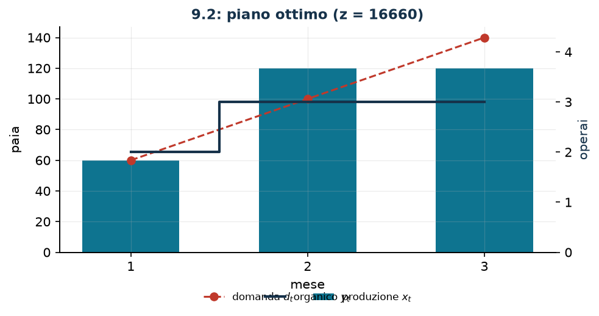

# Produzione e manodopera: due formulazioni equivalenti

**Classe:** MILP · **Legami:** conteggi interi, bilancio dell'organico · **Script:** `python/fam09_2_manodopera.py`

[](https://colab.research.google.com/github/fabiofurini/modellazione-mip/blob/main/notebooks/fam09_2_manodopera.ipynb)

!!! abstract "Problema 9.2"
    Un calzaturificio deve pianificare la produzione su $n \in \mathbb{Z}_{\ge 1}$
    mesi. Per ogni mese $t \in \{1, 2, \dots, n\}$, il valore
    $d_t \in \mathbb{Z}_{\ge 0}$ è la domanda in paia e $p_t \in \mathbb{Q}_{>0}$
    il costo delle materie prime per un paio. Per ogni mese
    $t \in \{1, 2, \dots, n-1\}$, il valore $h_t \in \mathbb{Q}_{\ge 0}$ è il costo
    di tenere un paio in magazzino a fine mese. All'inizio dell'orizzonte
    l'azienda ha $m_0 \in \mathbb{Z}_{\ge 0}$ operai; ogni operaio lavora
    $r \in \mathbb{Q}_{>0}$ ore al mese e costa $w \in \mathbb{Q}_{>0}$ euro al
    mese, e produrre un paio richiede $g \in \mathbb{Q}_{>0}$ ore di lavoro.
    All'inizio di ogni mese si possono assumere operai, al costo di
    $u \in \mathbb{Q}_{\ge 0}$ euro ciascuno; non si licenzia nessuno. L'azienda
    vuole decidere quanto produrre e quanti operai avere in ogni mese, al costo
    totale minimo.

**Il problema a parole.** *Decidiamo* quanto produrre, quanto tenere in
magazzino e quanti operai assumere. *L'obiettivo*: costo totale (materie prime,
magazzino, salari e assunzioni) minimo. *I vincoli*: la domanda va soddisfatta
esattamente; la produzione di un mese non può richiedere più ore di quelle che
gli operai in servizio riescono a fare.

## Due formulazioni

La stessa decisione si può scrivere in due modi, e vale la pena metterli uno
accanto all'altro: è il primo caso del corso in cui due modelli apparentemente
diversi descrivono lo stesso insieme di piani.

**Formulazione A: le assunzioni.** Le variabili di personale sono

$$
z_t = \text{operai assunti all'inizio del mese } t, \qquad \forall t \in \{1, \dots, n\},
$$

intere e non negative. Un operaio assunto al mese $t$ resta in servizio fino
alla fine dell'orizzonte, quindi costa $u$ una volta più $w$ per ciascuno dei
$n - t + 1$ mesi restanti. Il salario degli $m_0$ operai iniziali,
$m_0\, w\, n$, è un termine costante: si lascia fuori dal modello e si somma al
valore finale.

**Formulazione B: l'organico.** Le variabili di personale sono

$$
y_t = \text{operai in servizio nel mese } t, \qquad \forall t \in \{1, \dots, n\},
$$

intere e non negative, con $y_t \ge y_{t-1}$ perché non si licenzia. Il costo è
$w\, y_t$ ogni mese, più $u$ per ogni assunzione, cioè $u\,(y_n - m_0)$ in
totale, perché le assunzioni sono gli incrementi dell'organico e la somma
telescopica lascia solo gli estremi.

## Modello

**Variabili.** $x_t \in \mathbb{Z}_{\ge 0}$ paia prodotte nel mese $t$;
$s_t \in \mathbb{Z}_{\ge 0}$ scorta a fine mese $t$ (per $t \le n-1$);
$y_t \in \mathbb{Z}_{\ge 0}$ operai in servizio nel mese $t$;
$z_t \in \mathbb{Z}_{\ge 0}$ operai assunti all'inizio del mese $t$.

**Modello 9.2A — con le assunzioni.**

$$
\begin{aligned}
\min ~~ & \sum_{t=1}^{n} p_t\, x_t + \sum_{t=1}^{n-1} h_t\, s_t
       + \sum_{t=1}^{n} \bigl(u + w\,(n - t + 1)\bigr) z_t\\
\text{s.a.} \quad & x_1 - s_1 = d_1,\\
& x_t + s_{t-1} - s_t = d_t, && \forall t \in \{2, \dots, n-1\},\\
& x_n + s_{n-1} = d_n,\\
& -g\, x_t + r \sum_{j=1}^{t} z_j \ge -r\, m_0, && \forall t \in \{1, \dots, n\},\\
& x_t \in \mathbb{Z}_{\ge 0},\quad s_t \in \mathbb{Z}_{\ge 0},\quad z_t \in \mathbb{Z}_{\ge 0}.
\end{aligned}
$$

**Modello 9.2B — con l'organico.**

$$
\begin{aligned}
\min ~~ & \sum_{t=1}^{n} p_t\, x_t + \sum_{t=1}^{n-1} h_t\, s_t
       + \sum_{t=1}^{n} w\, y_t + u\,(y_n - m_0)\\
\text{s.a.} \quad & x_1 - s_1 = d_1,\\
& x_t + s_{t-1} - s_t = d_t, && \forall t \in \{2, \dots, n-1\},\\
& x_n + s_{n-1} = d_n,\\
& -g\, x_t + r\, y_t \ge 0, && \forall t \in \{1, \dots, n\},\\
& y_1 \ge m_0,\\
& -y_{t-1} + y_t \ge 0, && \forall t \in \{2, \dots, n\},\\
& x_t \in \mathbb{Z}_{\ge 0},\quad s_t \in \mathbb{Z}_{\ge 0},\quad y_t \in \mathbb{Z}_{\ge 0}.
\end{aligned}
$$

**Descrizione.** Le due formulazioni condividono i **bilanci delle scorte**, uno
per mese: quanto si produce più quanto si ha in magazzino copre esattamente la
domanda. I vincoli delle **ore**, uno per mese, dicono che la produzione del
mese non può richiedere più ore di quante ne facciano gli operai in servizio.
Nella formulazione $B$ ci sono in più il vincolo di **organico iniziale**, che
parte dagli $m_0$ operai già assunti, e i vincoli di **monotonia**, uno per mese
a partire dal secondo, che vietano i licenziamenti. Nella $A$ quegli stessi
fatti sono nascosti nel dominio delle $z_t$, che sono non negative.

!!! note "Le due formulazioni descrivono lo stesso problema"
    La corrispondenza è

    $$
    y_t = m_0 + \sum_{j=1}^{t} z_j, \qquad\text{cioè}\qquad
    z_t = y_t - y_{t-1} \quad (\text{con } y_0 = m_0).
    $$

    *Ammissibilità.* Con questa sostituzione il vincolo delle ore di $A$ diventa
    esattamente quello di $B$; le condizioni $z_t \ge 0$ diventano
    $y_t \ge y_{t-1}$, e $y_1 \ge m_0$. I bilanci non contengono variabili di
    personale e restano identici: la corrispondenza è una biiezione fra i piani
    ammissibili dei due modelli.

    *Costo.* Il costo del personale in $B$ vale

    $$
    \sum_{t=1}^{n} w\, y_t + u\,(y_n - m_0)
    = m_0\, w\, n + \sum_{t=1}^{n} \bigl(u + w\,(n - t + 1)\bigr) z_t ,
    $$

    perché $z_j$ compare in tutti i mesi da $j$ in poi, cioè $n - j + 1$ volte.
    Le due funzioni obiettivo differiscono per la sola costante $m_0\, w\, n$, e
    i due modelli hanno gli stessi ottimi.

!!! tip "Perché tenerle entrambe"
    La formulazione $A$ ha meno vincoli (niente monotonia) ma coefficienti di
    costo che dipendono dal periodo; la $B$ ha coefficienti uniformi e si
    estende meglio se si aggiungono i licenziamenti (basta una seconda famiglia
    $\ell_t \ge 0$ e il bilancio $y_t = y_{t-1} + z_t - \ell_t$). Sull'istanza
    anche i *rilassamenti* coincidono: $z(\mathit{LP}) = 15\,960$ per entrambe.
    Due formulazioni equivalenti sull'intero non lo sono sempre sul
    rilassamento; qui lo sono, e la verifica va fatta, non data per scontata.

## Il modello in gurobipy

```python
m = gp.Model("manodopera_B")
x = m.addVars(n, vtype=GRB.INTEGER, name="x")
s = m.addVars(n - 1, vtype=GRB.INTEGER, name="s")
y = m.addVars(n, vtype=GRB.INTEGER, name="y")
m.setObjective(gp.quicksum(p[t] * x[t] for t in range(n))
               + gp.quicksum(h[t] * s[t] for t in range(n - 1))
               + gp.quicksum(w * y[t] for t in range(n)) + u * (y[n - 1] - m0), GRB.MINIMIZE)
m.addConstr(x[0] - s[0] == d[0], name="bilancio[0]")
m.addConstrs((x[t] + s[t - 1] - s[t] == d[t] for t in range(1, n - 1)), name="bilancio")
m.addConstr(x[n - 1] + s[n - 2] == d[n - 1], name=f"bilancio[{n - 1}]")
m.addConstrs((-g * x[t] + r * y[t] >= 0 for t in range(n)), name="ore")
m.addConstr(y[0] >= m0, name="organico_iniziale")
m.addConstrs((-y[t - 1] + y[t] >= 0 for t in range(1, n)), name="mai_licenziamenti")
```

## L'istanza

$n = 3$ mesi, $m_0 = 2$ operai, $w = 1500$, $u = 100$, $r = 160$ ore,
$g = 4$ ore per paio, $h_t = 3$.

| | $t=1$ | $t=2$ | $t=3$ |
|---|---:|---:|---:|
| $d_t$ | 60 | 100 | 140 |
| $p_t$ | 15 | 15 | 15 |

Con due operai la capacità iniziale è $2 \cdot 160 / 4 = 80$ paia al mese:
basta per il primo mese, non per gli altri due.

## Euristica costruttiva: il bound primale

Produzione «just in time»: ogni mese si produce esattamente la domanda, e si
assume il numero minimo di operai che serve. È un'euristica costruttiva: si
costruisce una sola soluzione, un elemento per volta, senza mai tornare
indietro.

- mese 1: $\lceil 4 \cdot 60/160 \rceil = 2$ operai, nessuna assunzione;
- mese 2: $\lceil 4 \cdot 100/160 \rceil = 3$ operai, una assunzione;
- mese 3: $\lceil 4 \cdot 140/160 \rceil = 4$ operai, un'altra assunzione.

Il costo, incluso il termine costante $m_0\, w\, n = 9000$, è
$z(\mathit{MILP}) \le \mathit{UB} = 18\,200$.

## Rilassamento LP e duale: il bound duale

Sulla formulazione $A$, con $\mu_t$ **libera** su ciascun bilancio e
$\nu_t \ge 0$ su ciascun vincolo di ore:

$$
\begin{aligned}
\max ~~ & \sum_{t=1}^{n} d_t\, \mu_t - r\, m_0 \sum_{t=1}^{n} \nu_t\\
\text{s.a.} \quad & \mu_t - g\, \nu_t \le p_t, && \forall t \in \{1, \dots, n\},\\
& -\mu_t + \mu_{t+1} \le h_t, && \forall t \in \{1, \dots, n-1\},\\
& r \sum_{t=j}^{n} \nu_t \le u + w\,(n - j + 1), && \forall j \in \{1, \dots, n\},\\
& \mu_t \gtreqless 0, \quad \nu_t \ge 0.
\end{aligned}
$$

**Descrizione.** $\mu_t$ è il valore di un paio disponibile nel mese $t$ e
$\nu_t$ il prezzo di un'ora di lavoro. L'obiettivo valuta la domanda a quei
prezzi e sottrae $r\, m_0 \sum_t \nu_t$, cioè le ore che i due operai iniziali
offrono gratuitamente. Il primo gruppo di vincoli sono le colonne delle $x_t$:
produrre un paio vale $\mu_t$ e consuma $g$ ore al prezzo $\nu_t$, e il saldo
non supera il costo $p_t$ delle materie prime. Il secondo sono le colonne delle
$s_t$: tenere un paio in magazzino fa guadagnare $\mu_{t+1} - \mu_t$, che non
può superare $h_t$. Il terzo sono le colonne delle $z_j$: un operaio assunto al
mese $j$ mette a disposizione $r$ ore in ciascuno dei mesi da $j$ in poi, e il
loro valore non può superare quanto quell'assunzione costa.

**Ricetta.** $\bar\nu_t = 0$: le ore di lavoro non si valutano, i vincoli sulle
assunzioni sono soddisfatti perché il membro destro è positivo, e restano
$\mu_t \le p_t$ e $\mu_{t+1} \le \mu_t + h_t$. Il valore più grande ammissibile
si costruisce in avanti,

$$\bar\mu_1 = p_1, \qquad \bar\mu_t = \min(\bar\mu_{t-1} + h_{t-1},\ p_t).$$

Sull'istanza $\bar\mu = (15, 15, 15)$ e $\sum_t d_t\, \bar\mu_t = 15 \cdot 300 =
4500$, a cui va sommato il termine costante $9000$:

$$\mathit{LB} = 4500 + 9000 = 13\,500 .$$

È il costo delle sole materie prime più il salario degli operai già in servizio:
la manodopera aggiuntiva è regalata.

## Soluzione ottima

| | $t=1$ | $t=2$ | $t=3$ |
|---|---:|---:|---:|
| produzione $x_t$ | 60 | 120 | 120 |
| organico $y_t$ | 2 | 3 | 3 |
| assunzioni $z_t$ | 0 | 1 | 0 |
| scorta $s_t$ | 0 | 20 | — |

| $UB$ | $LB$ (duale) | $z(\mathit{LP})$ | $z(\mathit{LP}^+)$ | $z(\mathit{MILP})$ | gap |
|---:|---:|---:|---:|---:|---:|
| 18200 | 13500 | 15960 | 15960 | 16660 | $9{,}2\%$ |



Il piano ottimo assume **un** operaio invece di due e anticipa venti paia dal
terzo mese al secondo: pagare $3$ euro di magazzino per venti paia costa $60$
euro contro i $1600$ di un'assunzione al terzo mese.

## Considerazioni aggiuntive

- Il vincolo di monotonia è ciò che rende il problema non banale: se si potesse
  licenziare a costo zero, la formulazione $B$ si spezzerebbe in $n$ problemi
  indipendenti, uno per mese.
- Le variabili $x_t$ e $s_t$ sono dichiarate intere perché le paia di scarpe non
  si spezzano. Qui si potrebbero lasciare continue senza cambiare l'ottimo (i
  dati sono interi e la matrice dei bilanci è totalmente unimodulare), ma la
  dichiarazione corretta dal punto di vista del modello è quella intera.
- Il termine costante $m_0\, w\, n$ va ricordato in ogni confronto: dimenticarlo
  fa apparire la formulazione $A$ molto più economica della $B$.

## Domande di modellazione aggiuntive

??? question "9.2.1 — Assunzioni molto costose"
    Il costo di assunzione sale da $100$ a $3000$ euro (selezione e formazione).
    Come cambia il piano ottimo?

    !!! tip "Soluzione"
        La soluzione è nel documento delle soluzioni, riservato ai docenti.

??? question "9.2.2 — Straordinari"
    Ogni operaio può fare fino a $40$ ore di straordinario al mese, pagate $25$
    euro l'ora. Come cambia il modello? Conviene usarli?

    !!! tip "Soluzione"
        La soluzione è nel documento delle soluzioni, riservato ai docenti.

## Codice

Script completo —
[`python/fam09_2_manodopera.py`](https://github.com/fabiofurini/modellazione-mip/blob/main/python/fam09_2_manodopera.py)
(riproducibile con `python3 python/fam09_2_manodopera.py` dalla cartella
`python/`). Notebook —
[`notebooks/fam09_2_manodopera.ipynb`](https://github.com/fabiofurini/modellazione-mip/blob/main/notebooks/fam09_2_manodopera.ipynb)
— che si apre in Colab dal badge in cima alla pagina.

<!-- script-incorporato: inizio (rigenerato da python/incorpora_codice.py) -->

??? example "Mostra lo script completo — `python/fam09_2_manodopera.py` (211 righe)"

    ```python
    """Problema 9.2 -- Produzione e manodopera: due formulazioni equivalenti.

    La stessa decisione scritta due volte: con le *assunzioni* z_t (formulazione A)
    oppure con l'*organico* y_t (formulazione B). Si dimostra che hanno lo stesso
    insieme di piani ammissibili e lo stesso ottimo, e si confrontano i rilassamenti.
    E' il tema del capitolo 4: due formulazioni si confrontano solo dopo aver
    dimostrato che descrivono lo stesso insieme intero.
    """
    import gurobipy as gp
    import pandas as pd
    from gurobipy import GRB

    from mip import (ammissibile, due_rilassamenti, frazione, nuovo_modello, registra_bound,
                     rilassamento, risolvi, valuta)
    from stile import ARANCIO, BLU, ROSSO, TEAL, intestazione, plt, salva_dati, salva_figura

    R = range

    # ---------- 1. MODELLO E ISTANZA ----------
    intestazione("9.2 Produzione e manodopera: assunzioni (A) oppure organico (B)")
    d2 = [60, 100, 140]        # domanda dei tre mesi (paia)
    p2 = [15, 15, 15]          # costo di produzione per paio
    h2 = [3, 3]                # costo di magazzino a fine mese
    w2, r2, g2, u2, m2, r0 = 1500, 160, 4, 100, 2, 0
    n2 = len(d2)
    salva_dati(pd.DataFrame({"mese": R(1, n2 + 1), "domanda": d2, "costo_paio": p2}), "prod2_dati")
    print(f"  {m2} operai all'inizio, {r2} h al mese ciascuno, {g2} h per paio: la capacita'")
    print(f"  iniziale e' {m2 * r2 // g2} paia al mese. Salario {w2}, assunzione {u2}.")


    def modello_A(d, p, h, w, r, g, u, m0, r0):
        """Formulazione A: z_t = quanti operai si assumono all'inizio del mese t."""
        n = len(d)
        mm = nuovo_modello("manodopera_A")
        x = mm.addVars(n, vtype=GRB.INTEGER, name="x")
        s = mm.addVars(n - 1, vtype=GRB.INTEGER, name="s")
        z = mm.addVars(n, vtype=GRB.INTEGER, name="z")
        mm.setObjective(gp.quicksum(p[t] * x[t] for t in R(n))
                        + gp.quicksum(h[t] * s[t] for t in R(n - 1))
                        + gp.quicksum((u + w * (n - t)) * z[t] for t in R(n)), GRB.MINIMIZE)
        mm.addConstr(x[0] - s[0] == d[0] - r0, name="bilancio[0]")
        mm.addConstrs((x[t] + s[t - 1] - s[t] == d[t] for t in R(1, n - 1)), name="bilancio")
        mm.addConstr(x[n - 1] + s[n - 2] == d[n - 1], name=f"bilancio[{n - 1}]")
        mm.addConstrs((-g * x[t] + gp.quicksum(r * z[j] for j in R(t + 1)) >= -r * m0
                       for t in R(n)), name="ore")
        return mm, x, s, z


    def modello_B(d, p, h, w, r, g, u, m0, r0):
        """Formulazione B: y_t = quanti operai lavorano nel mese t (organico)."""
        n = len(d)
        mm = nuovo_modello("manodopera_B")
        x = mm.addVars(n, vtype=GRB.INTEGER, name="x")
        s = mm.addVars(n - 1, vtype=GRB.INTEGER, name="s")
        y = mm.addVars(n, vtype=GRB.INTEGER, name="y")
        # l'organico paga il salario ogni mese; le assunzioni sono gli incrementi y_t - y_{t-1}
        mm.setObjective(gp.quicksum(p[t] * x[t] for t in R(n))
                        + gp.quicksum(h[t] * s[t] for t in R(n - 1))
                        + gp.quicksum(w * y[t] for t in R(n))
                        + u * (y[n - 1] - m0), GRB.MINIMIZE)   # assunzioni totali = y_n - m0
        mm.addConstr(x[0] - s[0] == d[0] - r0, name="bilancio[0]")
        mm.addConstrs((x[t] + s[t - 1] - s[t] == d[t] for t in R(1, n - 1)), name="bilancio")
        mm.addConstr(x[n - 1] + s[n - 2] == d[n - 1], name=f"bilancio[{n - 1}]")
        mm.addConstrs((-g * x[t] + r * y[t] >= 0 for t in R(n)), name="ore")
        mm.addConstr(y[0] >= m0, name="organico_iniziale")
        mm.addConstrs((-y[t - 1] + y[t] >= 0 for t in R(1, n)), name="mai_licenziamenti")
        return mm, x, s, y


    def duale_A(d, p, h, w, r, g, u, m0, r0):
        """max sum_t b_t mu_t - r m0 sum_t nu_t;  mu_t - g nu_t <= p_t;
        -mu_t + mu_{t+1} <= h_t;  r sum_{t >= j} nu_t <= u + w (n - j);  mu libere, nu >= 0."""
        n = len(d)
        b = [d[0] - r0] + d[1:n - 1] + [d[n - 1]]
        dl = nuovo_modello("duale_manodopera")
        mu = dl.addVars(n, lb=-GRB.INFINITY, name="mu")
        nu = dl.addVars(n, name="nu")
        dl.setObjective(gp.quicksum(b[t] * mu[t] for t in R(n))
                        - r * m0 * gp.quicksum(nu[t] for t in R(n)), GRB.MAXIMIZE)
        dl.addConstrs((mu[t] - g * nu[t] <= p[t] for t in R(n)), name="rc_x")
        dl.addConstrs((-mu[t] + mu[t + 1] <= h[t] for t in R(n - 1)), name="rc_s")
        dl.addConstrs((r * gp.quicksum(nu[t] for t in R(j, n)) <= u + w * (n - j) for j in R(n)),
                      name="rc_z")
        return dl


    mA, xA, sA, zA = modello_A(d2, p2, h2, w2, r2, g2, u2, m2, r0)
    mB, xB, sB, yB = modello_B(d2, p2, h2, w2, r2, g2, u2, m2, r0)
    costante_A = m2 * w2 * n2          # il salario degli operai iniziali, fuori dal modello A
    zA_val = risolvi(mA) + costante_A
    zB_val = risolvi(mB)
    print(f"  Formulazione A (assunzioni): z = {frazione(zA_val)} "
          f"(di cui {costante_A} di salario degli operai iniziali, termine costante)")
    print(f"  Formulazione B (organico):   z = {frazione(zB_val)}")
    assert abs(zA_val - zB_val) < 1e-6, (zA_val, zB_val)
    print("  I due ottimi coincidono: le due formulazioni descrivono lo stesso problema.")
    print("  Piano A: produzione " + ", ".join(frazione(xA[t].X) for t in R(n2))
          + "; assunzioni " + ", ".join(frazione(zA[t].X) for t in R(n2)))
    print("  Piano B: produzione " + ", ".join(frazione(xB[t].X) for t in R(n2))
          + "; organico " + ", ".join(frazione(yB[t].X) for t in R(n2)))

    # ---------- 2. L'EQUIVALENZA, VERIFICATA ----------
    intestazione("9.2 L'equivalenza fra le due formulazioni, verificata")
    print("  La corrispondenza e' y_t = m0 + sum_{j <= t} z_j, cioe' z_t = y_t - y_{t-1}")
    print("  (con y_0 = m0). Sui piani ottimi:")
    yA = [m2 + sum(round(zA[j].X) for j in R(t + 1)) for t in R(n2)]
    print("    da A: organico implicito = " + ", ".join(str(v) for v in yA))
    print("    da B: organico           = " + ", ".join(str(round(yB[t].X)) for t in R(n2)))
    zB_implicite = [round(yB[0].X) - m2] + [round(yB[t].X) - round(yB[t - 1].X) for t in R(1, n2)]
    print("    da B: assunzioni implicite = " + ", ".join(str(v) for v in zB_implicite))
    assert sum(v * (u2 + w2 * (n2 - t)) for t, v in enumerate(zB_implicite)) + costante_A \
        == sum(round(zA[t].X) * (u2 + w2 * (n2 - t)) for t in R(n2)) + costante_A
    print("  Il costo del personale coincide: A paga ogni assunzione una volta per tutti i mesi")
    print("  che restano, B paga l'organico mese per mese. Stessa somma, contata in due modi.")

    # ---------- 3. EURISTICA COSTRUTTIVA (UPPER BOUND) ----------
    intestazione("9.2 Euristica, duale e bound")
    # euristica costruttiva: si produce la domanda del mese, e si assume solo quando le ore non bastano
    organico, assunzioni, prod = m2, [0] * n2, []
    for t in R(n2):
        prod.append(d2[t])
        servono = -(-g2 * d2[t] // r2)               # ceil
        if organico < servono:
            assunzioni[t] = servono - organico
            organico = servono
        print(f"  Mese {t + 1}: si producono {d2[t]} paia, servono "
              f"ceil({g2} * {d2[t]} / {r2}) = {servono} operai; organico {organico - assunzioni[t]}"
              f" -> se ne assumono {assunzioni[t]}")
    ub2 = sum(p2[t] * prod[t] for t in R(n2)) \
        + sum(assunzioni[t] * (u2 + w2 * (n2 - t)) for t in R(n2)) + costante_A
    sol_eur = {f"x[{t}]": prod[t] for t in R(n2)} | {f"z[{t}]": assunzioni[t] for t in R(n2)} \
        | {f"s[{t}]": 0 for t in R(n2 - 1)}
    assert ammissibile(mA, sol_eur)
    print(f"  Costo dell'euristica: ub = {frazione(ub2)}")

    # ---------- 4. DUALE E LOWER BOUND ----------
    dl2 = duale_A(d2, p2, h2, w2, r2, g2, u2, m2, r0)
    # ricetta: nu = 0 (le ore non si pagano) e mu_t = costo minimo per avere un paio al mese t
    mu = []
    for t in R(n2):
        mu.append(p2[t] if t == 0 else min(mu[t - 1] + h2[t - 1], p2[t]))
    mano = {f"mu[{t}]": mu[t] for t in R(n2)}
    lb2_var, viol = valuta(dl2, mano)
    assert viol <= 1e-9, viol
    lb2 = lb2_var + costante_A
    print("  Duale a mano: nu = 0 (le ore di lavoro non si pagano) e mu_t = min(mu_{t-1}+h, p_t)")
    print(f"    mu = " + ", ".join(frazione(v) for v in mu)
          + f"  ->  lb = {frazione(lb2_var)} + {costante_A} = {frazione(lb2)}")
    zlp2, zlp2r, _ = due_rilassamenti(mA, dl2)
    zlp2, zlp2r = zlp2 + costante_A, zlp2r + costante_A
    riga = registra_bound("2 manodopera", ub2, lb2, zlp2, zlp2r, zA_val)
    salva_dati(pd.DataFrame([riga]), "prod2_bound")
    assert lb2 <= zlp2 <= zA_val <= ub2 + 1e-9

    # ---------- 5. CONFRONTO DEI RILASSAMENTI DELLE DUE FORMULAZIONI ----------
    zlpA, _, _ = rilassamento(mA, rafforzato=True)
    zlpB, _, _ = rilassamento(mB, rafforzato=True)
    print(f"  Rilassamenti: A -> {frazione(zlpA + costante_A)}   B -> {frazione(zlpB)}   "
          f"z(MILP) = {frazione(zA_val)}")
    salva_dati(pd.DataFrame([{"formulazione": "A (assunzioni)", "z_lp": zlpA + costante_A,
                              "z_milp": zA_val},
                             {"formulazione": "B (organico)", "z_lp": zlpB, "z_milp": zB_val}]),
               "prod2_formulazioni")

    # ---------- 6. DOMANDE DI MODELLAZIONE AGGIUNTIVE ----------
    varianti = {}


    def variante(nome, m, costante=0.0):
        z = risolvi(m) + costante
        print(f"  {nome:70s} z = {frazione(z)}")
        return z


    # 2a: assumere costa molto di piu' (3000 invece di 100)
    m, x, s, y = modello_B(d2, p2, h2, w2, r2, g2, 3000, m2, r0)
    varianti["2a"] = variante("2a. L'assunzione costa 3000 euro invece di 100", m)
    print("     organico: " + ", ".join(str(round(y[t].X)) for t in R(n2))
          + ";  produzione: " + ", ".join(str(round(x[t].X)) for t in R(n2)))
    # 2b: straordinari, fino a 40 ore in piu' per operaio al mese, a 25 euro l'ora
    m, x, s, y = modello_B(d2, p2, h2, w2, r2, g2, u2, m2, r0)
    o = m.addVars(n2, name="o")
    m.update()
    for t in R(n2):
        m.chgCoeff(m.getConstrByName(f"ore[{t}]"), o[t], 1.0)   # le ore disponibili aumentano
    m.addConstrs((o[t] <= 40 * y[t] for t in R(n2)), name="max_straordinari")
    m.setObjective(m.getObjective() + gp.quicksum(25 * o[t] for t in R(n2)), GRB.MINIMIZE)
    varianti["2b"] = variante("2b. Straordinari: fino a 40 h per operaio, 25 euro l'ora", m)
    print("     straordinari usati: " + ", ".join(frazione(o[t].X) for t in R(n2))
          + "  (nessuno: anticipare la produzione e tenerla a magazzino costa meno)")
    salva_dati(pd.DataFrame({"variante": list(varianti), "z": list(varianti.values())}),
               "prod2_varianti")

    # ---------- 7. FIGURA ----------
    fig, ax = plt.subplots(figsize=(7.0, 3.2))
    mesi = list(R(1, n2 + 1))
    ax.bar(mesi, [xB[t].X for t in R(n2)], color=TEAL, width=0.55, label="produzione $x_t$")
    ax.plot(mesi, d2, "o--", color=ROSSO, label="domanda $d_t$")
    ax2 = ax.twinx()
    ax2.step(mesi, [yB[t].X for t in R(n2)], where="mid", color=BLU, lw=2, label="organico $y_t$")
    ax2.set_ylabel("operai", color=BLU)
    ax2.set_ylim(0, max(yB[t].X for t in R(n2)) + 1.5)
    ax2.grid(False)
    ax.set_xticks(mesi)
    ax.set_xlabel("mese")
    ax.set_ylabel("paia")
    ax.set_title(f"9.2: piano ottimo (z = {frazione(zB_val)})")
    ax.legend(fontsize=8, loc="upper left")
    ax2.legend(fontsize=8, loc="lower right")
    salva_figura(fig, "cap09_manodopera_ottimo")
    print("Fine.")
    ```

<!-- script-incorporato: fine -->
