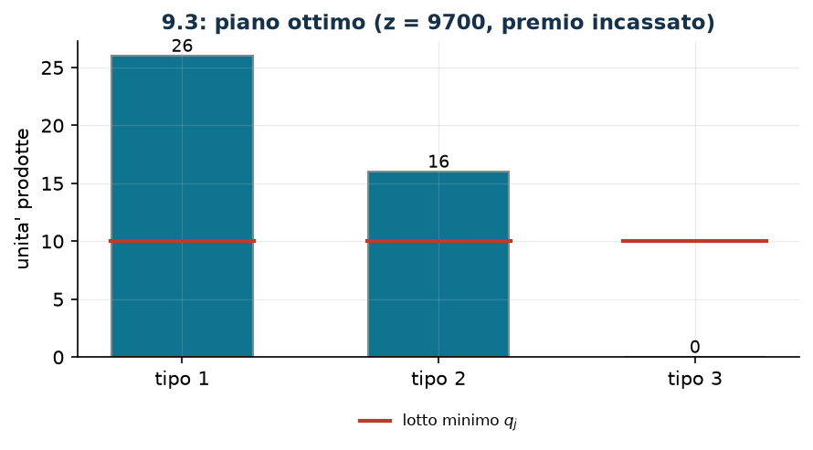

# Veicoli: lotto minimo e premio per la varietà

**Classe:** MILP · **Legami:** lotto minimo (semicontinua), contare i tipi, se e solo se · **Script:** `python/fam09_3_veicoli.py`

[](https://colab.research.google.com/github/fabiofurini/modellazione-mip/blob/main/notebooks/fam09_3_veicoli.ipynb)

!!! abstract "Problema 9.3"
    Un'azienda produce $s \in \mathbb{Z}_{\ge 1}$ tipi di veicolo usando
    $k \in \mathbb{Z}_{\ge 1}$ risorse. Per ogni risorsa $i \in \{1, \dots, k\}$
    e ogni tipo $j \in \{1, \dots, s\}$, il valore $a_{ij} \in \mathbb{Q}_{\ge 0}$
    è la quantità di risorsa $i$ necessaria per una unità del tipo $j$, e
    $b_i \in \mathbb{Q}_{>0}$ è la disponibilità della risorsa $i$. Per ogni tipo
    $j$, il valore $\bar p_j \in \mathbb{Q}_{>0}$ è il profitto di una unità e
    $\bar q_j \in \mathbb{Z}_{\ge 1}$ la quantità minima da produrre se si decide
    di produrre quel tipo. Se la produzione comprende almeno due tipi diversi,
    l'azienda incassa un premio $\bar r \in \mathbb{Q}_{>0}$ (un contributo per la
    diversificazione). L'azienda vuole massimizzare il profitto totale.

**Il problema a parole.** *Decidiamo* quante unità produrre di ciascun tipo.
*L'obiettivo*: profitto massimo, premio compreso. *I vincoli*: le risorse non si
superano; e di un tipo si producono zero unità oppure almeno $\bar q_j$.

## Modello

**Variabili.** $x_j \in \mathbb{Z}_{\ge 0}$ unità prodotte del tipo $j$;
$y_j \in \{0,1\}$ vale $1$ se il tipo $j$ viene prodotto;
$z \in \{0,1\}$ vale $1$ se si incassa il premio. Il dato
$M_j = \min_i \lfloor b_i / a_{ij} \rfloor$ è il massimo producibile del solo
tipo $j$.

$$
\begin{aligned}
\max ~~ & \sum_{j=1}^{s} \bar p_j\, x_j + \bar r\, z\\
\text{s.a.} \quad & \sum_{j=1}^{s} a_{ij}\, x_j \le b_i, && \forall i \in \{1, \dots, k\},\\
& x_j - \bar q_j\, y_j \ge 0, && \forall j \in \{1, \dots, s\},\\
& x_j - M_j\, y_j \le 0, && \forall j \in \{1, \dots, s\},\\
& -\sum_{j=1}^{s} y_j + 2\, z \le 0,\\
& x_j \in \mathbb{Z}_{\ge 0}, \quad y_j \in \{0,1\}, \quad z \in \{0,1\}.
\end{aligned}
$$

**Descrizione.** L'obiettivo somma i profitti dei veicoli prodotti e il premio
per la varietà. I vincoli di **risorsa**, uno per risorsa, sono le
disponibilità. I due vincoli di **lotto minimo** e di **attivazione**, uno per
tipo ciascuno, rendono $x_j$ semicontinua: o zero, o almeno $\bar q_j$ e al più
$M_j$. Il vincolo di **premio**, uno solo, dice che il premio si incassa solo se
i tipi attivi sono almeno due.

!!! note "Il legame fra le variabili: la semicontinuità"
    I due vincoli insieme dicono

    $$\bar q_j\, y_j \;\le\; x_j \;\le\; M_j\, y_j .$$

    Se $y_j = 0$ entrambi danno $x_j = 0$; se $y_j = 1$ si ottiene
    $\bar q_j \le x_j \le M_j$. Nessuno dei due basta da solo: senza
    l'attivazione un tipo potrebbe essere prodotto con $y_j = 0$; senza il lotto
    minimo la soglia sarebbe vuota.

    | $y_j$ | che cosa impongono i due vincoli | $x_j$ |
    |---|---|---|
    | $0$ | $0 \le x_j \le 0$ | $x_j = 0$ |
    | $1$ | $\bar q_j \le x_j \le M_j$ | lotto ammesso |

!!! note "Il premio si incassa solo con almeno due tipi"
    Il vincolo si legge $2 z \le \sum_{j=1}^{s} y_j$. Se $z = 1$ allora
    $\sum_j y_j \ge 2$: almeno due tipi sono attivati e, per la semicontinuità,
    effettivamente prodotti. Il verso opposto — se ci sono due tipi attivi
    allora $z = 1$ — non è imposto da alcun vincolo, ma segue
    dall'**ottimalità**: porre $z = 1$ resta ammissibile e aumenta l'obiettivo
    di $\bar r > 0$. Con $\bar r = 0$ l'argomento cade, e $z$ smette di essere
    un indicatore fedele (domanda 9.3.2).

## Il modello in gurobipy

```python
mm = gp.Model("veicoli")
x = mm.addVars(n, vtype=GRB.INTEGER, name="x")
y = mm.addVars(n, vtype=GRB.BINARY, name="y")
z = mm.addVar(vtype=GRB.BINARY, name="z")
mm.setObjective(gp.quicksum(p[j] * x[j] for j in range(n)) + r * z, GRB.MAXIMIZE)
mm.addConstrs((gp.quicksum(a[i][j] * x[j] for j in range(n)) <= b[i]
               for i in range(m)), name="risorsa")
mm.addConstrs((x[j] - q[j] * y[j] >= 0 for j in range(n)), name="lotto_minimo")
mm.addConstrs((x[j] - M[j] * y[j] <= 0 for j in range(n)), name="attiva")
mm.addConstr(-gp.quicksum(y[j] for j in range(n)) + 2 * z <= 0, name="premio")
```

## L'istanza

$s = 3$ tipi, $k = 2$ risorse (acciaio in tonnellate e ore di manodopera),
$\bar q_j = 10$ per ogni tipo, $\bar r = 500$.

| $a_{ij}$ | $j=1$ | $j=2$ | $j=3$ | | $b_i$ |
|---|---:|---:|---:|---|---:|
| $i=1$ (acciaio) | 2 | 3 | 5 | | 100 |
| $i=2$ (ore) | 30 | 25 | 40 | | 1200 |

| | $j=1$ | $j=2$ | $j=3$ |
|---|---:|---:|---:|
| $\bar p_j$ | 200 | 250 | 300 |
| $\bar q_j$ | 10 | 10 | 10 |
| $M_j$ | 40 | 33 | 20 |

I big-M sono calcolati dai dati:
$M_1 = \min(\lfloor 100/2 \rfloor, \lfloor 1200/30 \rfloor) = 40$, e
analogamente $M_2 = 33$, $M_3 = 20$.

## Euristica costruttiva: il bound primale

Il problema è di massimo, quindi l'euristica dà il bound **primale**, che sta
sotto l'ottimo. Si ordinano i tipi per profitto rapportato al consumo della
risorsa più stretta, si attivano i due migliori al lotto minimo (così il premio
è garantito) e poi si riempie con il più redditizio fra quelli attivati.

Sull'istanza si attivano i tipi $2$ e $1$ al lotto minimo, poi si riempie: la
produzione è $(11, 26, 0)$, l'acciaio si esaurisce e restano $220$ ore. Il
profitto è $8700$ più il premio di $500$:

$$z(\mathrm{MILP}) \ge \mathit{LB} = 9200 .$$

## Rilassamento LP e duale: il bound duale

Il primale è di massimo con vincoli $\le$ e $\ge$: seguendo la tabella di
conversione, si associano $\pi_i \ge 0$ alle risorse, $\ell_j \ge 0$ al lotto
minimo (scritto come $-\lambda_j$), $\beta_j \ge 0$ all'attivazione e
$\gamma \ge 0$ al premio.

$$
\begin{aligned}
\min ~~ & \sum_{i=1}^{k} b_i\, \pi_i\\
\text{s.a.} \quad & \sum_{i=1}^{k} a_{ij}\, \pi_i - \ell_j + \beta_j \ge \bar p_j, && \forall j \in \{1, \dots, s\},\\
& \bar q_j\, \ell_j - M_j\, \beta_j - \gamma \ge 0, && \forall j \in \{1, \dots, s\},\\
& 2\, \gamma \ge \bar r,\\
& \pi_i \ge 0, \quad \ell_j \ge 0, \quad \beta_j \ge 0, \quad \gamma \ge 0.
\end{aligned}
$$

**Descrizione.** $\pi_i$ è il prezzo di una unità della risorsa $i$; $\ell_j$ e
$\beta_j$ sono i prezzi dei due vincoli di semicontinuità del tipo $j$, e
$\gamma$ quello del premio. L'obiettivo valuta a quei prezzi tutte le risorse
disponibili. Il primo gruppo sono le colonne delle $x_j$: le risorse che una
unità del tipo $j$ consuma, corrette dai due vincoli di semicontinuità, devono
coprire il profitto $\bar p_j$. Il secondo sono le colonne delle $y_j$:
accendere il tipo $j$ obbliga a produrne almeno $\bar q_j$ e ne concede al più
$M_j$, e il saldo deve coprire il premio $\gamma$. L'ultimo è la colonna di $z$:
il premio si incassa solo con due tipi attivi, e infatti va coperto da
$2\gamma$.

**Ricetta, in tre passi.**

1. Il vincolo su $z$ obbliga $\gamma \ge \bar r/2$: si prende il minimo,
   $\bar\gamma = 250$.
2. Si pone $\bar\beta_j = 0$ e si ricava il più piccolo $\ell_j$ ammissibile,
   $\bar\ell_j = \bar\gamma / \bar q_j = 25$ per ogni $j$: ogni tipo attivato
   «porta con sé» la sua quota di premio.
3. Resta $\sum_i a_{ij}\, \pi_i \ge \bar p_j + \bar\ell_j$. Si valuta *una sola*
   risorsa, al prezzo che copre tutti i tipi, e si tiene quella che dà il bound
   più piccolo.

$$
\bar\pi_1 = \max\Bigl(\tfrac{225}{2}, \tfrac{275}{3}, \tfrac{325}{5}\Bigr) = \tfrac{225}{2},
\qquad b_1\, \bar\pi_1 = 11\,250 ,
$$

$$
\bar\pi_2 = \max\Bigl(\tfrac{225}{30}, \tfrac{275}{25}, \tfrac{325}{40}\Bigr) = 11,
\qquad b_2\, \bar\pi_2 = 13\,200 .
$$

Il bound migliore è quello dell'acciaio: $z(\mathrm{MILP}) \le \mathit{UB} = 11\,250$.

## Soluzione ottima

La produzione ottima è $(26, 16, 0)$: si attivano i tipi $1$ e $2$, si incassa
il premio, si consumano tutte e $100$ le tonnellate di acciaio e $1180$ ore
sulle $1200$ disponibili.

| $LB$ (euristica) | $z(\mathrm{MILP})$ | $z(\mathrm{LP}^+)$ | $z(\mathrm{LP})$ | $UB$ (duale) | gap |
|---:|---:|---:|---:|---:|---:|
| 9200 | 9700 | 9750 | $20625/2$ | 11250 | $5{,}2\%$ |



!!! tip "Qui il rilassamento con i bound batte il duale a mano"
    È l'unico problema del capitolo in cui $z(\mathrm{LP}^+) = 9750$ è
    *migliore* del bound duale costruito a mano ($11\,250$), e di pochissimo
    peggiore dell'ottimo ($9700$). La ragione è che il rilassamento senza i
    bound lascia $y_j$ e $z$ crescere sopra $1$, e con esse il premio:
    $z(\mathrm{LP}) = 20625/2 \approx 10\,312$. Aggiungere $y_j \le 1$ e
    $z \le 1$ toglie proprio quella libertà. Quando il modello contiene
    indicatori premiati, il rilassamento con i bound non è un dettaglio.

## Considerazioni aggiuntive

- Il big-M $M_j$ è il massimo producibile del *solo* tipo $j$, non del piano
  complessivo: è già molto più stretto di una costante arbitraria.
- Se per qualche tipo fosse $\bar q_j > M_j$, quel tipo sarebbe impossibile da
  produrre e si potrebbe eliminare dal modello con un controllo sui dati.
- Il premio è modellato con *una* binaria e *un* vincolo. Con una soglia diversa
  (almeno $f$ tipi) basta sostituire il coefficiente $2$ con $f$; con più premi
  a scaglioni servirebbero una variabile per scaglione e una catena di vincoli,
  come nelle [funzioni a tratti](legami-14.md).

## Domande di modellazione aggiuntive

??? question "9.3.1 — Premio più esigente"
    Il premio si incassa solo se si producono almeno *tre* tipi diversi. Come
    cambia il modello? Qual è il nuovo ottimo?

    !!! tip "Soluzione"
        La soluzione è nel documento delle soluzioni, riservato ai docenti.

??? question "9.3.2 — Premio nullo"
    Il contributo per la diversificazione viene abolito, cioè $\bar r = 0$. Che
    cosa succede alla variabile $z$?

    !!! tip "Soluzione"
        La soluzione è nel documento delle soluzioni, riservato ai docenti.

## Codice

Script completo —
[`python/fam09_3_veicoli.py`](https://github.com/fabiofurini/modellazione-mip/blob/main/python/fam09_3_veicoli.py)
(riproducibile con `python3 python/fam09_3_veicoli.py` dalla cartella
`python/`). Notebook —
[`notebooks/fam09_3_veicoli.ipynb`](https://github.com/fabiofurini/modellazione-mip/blob/main/notebooks/fam09_3_veicoli.ipynb)
— che si apre in Colab dal badge in cima alla pagina.

<!-- script-incorporato: inizio (rigenerato da python/incorpora_codice.py) -->

??? example "Mostra lo script completo — `python/fam09_3_veicoli.py` (189 righe)"

    ```python
    """Problema 9.3 -- Veicoli: lotto minimo e premio per la varieta'.

    Tre tecniche insieme: la variabile semicontinua del lotto minimo (3.3), il
    conteggio dei tipi attivi (3.11) e un premio «se e solo se» si producono almeno
    due tipi (3.10). Il premio si incassa solo se il conteggio arriva a due: il
    verso mancante segue dall'ottimalita' perche' il premio e' positivo.
    """
    import gurobipy as gp
    import pandas as pd
    from gurobipy import GRB

    from mip import (ammissibile, due_rilassamenti, frazione, nuovo_modello, registra_bound,
                     risolvi, valuta)
    from stile import ARANCIO, BLU, ROSSO, TEAL, VERDE, intestazione, plt, salva_dati, salva_figura

    R = range

    # ---------- 1. MODELLO E ISTANZA ----------
    intestazione("9.3 Veicoli: lotto minimo per tipo e premio se si producono almeno due tipi")
    a3 = [[2, 3, 5],        # acciaio (tonnellate) per unita' dei tre tipi
          [30, 25, 40]]     # ore di manodopera per unita'
    b3 = [100, 1200]        # acciaio e ore disponibili
    p3 = [200, 250, 300]    # profitto per unita'
    q3 = [10, 10, 10]       # quantita' minima se il tipo si produce
    r3 = 500                # premio se si producono almeno due tipi
    n3, m3 = 3, 2
    # il piu' piccolo big-M valido per tipo: quante unita' al massimo consentono le risorse
    M3 = [min(b3[i] // a3[i][j] for i in R(m3)) for j in R(n3)]
    salva_dati(pd.DataFrame({"tipo": R(1, n3 + 1), "acciaio": a3[0], "ore": a3[1],
                             "profitto": p3, "minimo": q3, "M": M3}), "veic3_dati")
    print(f"  Risorse: {b3[0]} t di acciaio, {b3[1]} ore. Big-M per tipo (dai soli dati): {M3}")


    def modello_3(a, b, p, q, r):
        n, m = len(p), len(b)
        M = [min(b[i] // a[i][j] for i in R(m)) for j in R(n)]
        mm = nuovo_modello("veicoli")
        x = mm.addVars(n, vtype=GRB.INTEGER, name="x")     # unita' prodotte
        y = mm.addVars(n, vtype=GRB.BINARY, name="y")      # tipo attivato
        z = mm.addVar(vtype=GRB.BINARY, name="z")          # premio per la varieta'
        mm.setObjective(gp.quicksum(p[j] * x[j] for j in R(n)) + r * z, GRB.MAXIMIZE)
        mm.addConstrs((gp.quicksum(a[i][j] * x[j] for j in R(n)) <= b[i] for i in R(m)),
                      name="risorsa")
        mm.addConstrs((x[j] - q[j] * y[j] >= 0 for j in R(n)), name="lotto_minimo")
        mm.addConstrs((x[j] - M[j] * y[j] <= 0 for j in R(n)), name="attiva")
        mm.addConstr(-gp.quicksum(y[j] for j in R(n)) + 2 * z <= 0, name="premio")
        return mm, x, y, z


    def duale_3(a, b, p, q, r):
        """min sum_i b_i pi_i;  sum_i a_ij pi_i - alpha_j + beta_j >= p_j;
        q_j alpha_j - M_j beta_j + gamma >= 0;  -2 gamma >= r;  pi, alpha, beta >= 0, gamma <= 0.
        (scritto con i segni della tabella di conversione per un primale di massimo)"""
        n, m = len(p), len(b)
        M = [min(b[i] // a[i][j] for i in R(m)) for j in R(n)]
        dl = nuovo_modello("duale_veicoli")
        pi = dl.addVars(m, name="pi")                                  # risorse (<= in un max)
        alpha = dl.addVars(n, lb=-GRB.INFINITY, ub=0.0, name="alpha")   # lotto minimo (>= in un max)
        beta = dl.addVars(n, name="beta")                              # attivazione (<=)
        gamma = dl.addVar(name="gamma")                                # premio (<=)
        dl.setObjective(gp.quicksum(b[i] * pi[i] for i in R(m)), GRB.MINIMIZE)
        dl.addConstrs((gp.quicksum(a[i][j] * pi[i] for i in R(m)) + alpha[j] + beta[j] >= p[j]
                       for j in R(n)), name="rc_x")
        dl.addConstrs((-q[j] * alpha[j] - M[j] * beta[j] - gamma >= 0 for j in R(n)), name="rc_y")
        dl.addConstr(2 * gamma >= r, name="rc_z")
        return dl


    m3m, x3, y3, z3 = modello_3(a3, b3, p3, q3, r3)

    # ---------- 2. EURISTICA COSTRUTTIVA (LOWER BOUND: E' UN MASSIMO) ----------
    # euristica costruttiva: si attivano due tipi (per incassare il premio) partendo dai profitti per
    # unita' di risorsa piu' scarsa, poi si riempie con il tipo migliore
    def euristica(a, b, p, q, r):
        n, m = len(p), len(b)
        # rapporto profitto / consumo della risorsa piu' stretta
        ordine = sorted(R(n), key=lambda j: -p[j] / max(a[i][j] / b[i] for i in R(m)))
        x = [0] * n
        res = list(b)
        attivi = []
        for j in ordine:                       # prima il lotto minimo dei due tipi migliori
            if len(attivi) < 2 and all(res[i] >= a[i][j] * q[j] for i in R(m)):
                x[j] = q[j]
                for i in R(m):
                    res[i] -= a[i][j] * q[j]
                attivi.append(j)
        for j in ordine:                       # poi si riempie con il tipo piu' redditizio
            if x[j] == 0:
                continue
            extra = min(res[i] // a[i][j] for i in R(m))
            x[j] += extra
            for i in R(m):
                res[i] -= a[i][j] * extra
        return x, attivi, res


    x_eur, attivi, res = euristica(a3, b3, p3, q3, r3)
    lb3 = sum(p3[j] * x_eur[j] for j in R(n3)) + (r3 if len(attivi) >= 2 else 0)
    sol_eur = {f"x[{j}]": x_eur[j] for j in R(n3)} \
        | {f"y[{j}]": 1 if x_eur[j] > 0 else 0 for j in R(n3)} | {"z": 1 if len(attivi) >= 2 else 0}
    assert ammissibile(m3m, sol_eur)
    print(f"  Euristica: si attivano i tipi {[j + 1 for j in attivi]} al lotto minimo, poi si")
    print(f"  riempie col piu' redditizio; produzione {x_eur}, risorse residue {res}")
    print(f"  lb = {sum(p3[j] * x_eur[j] for j in R(n3))} + {r3} di premio = {frazione(lb3)}")

    # ---------- 3. RILASSAMENTO LP E DUALE (UPPER BOUND) ----------
    dl3 = duale_3(a3, b3, p3, q3, r3)
    # ricetta: gamma = r/2 (il minimo ammesso dal vincolo 2 gamma >= r), beta = 0, e
    # lambda_j = gamma / q_j (ogni tipo attivato "porta" la sua quota di premio); poi si
    # valuta una sola risorsa al prezzo che copre tutti i tipi, e si sceglie la migliore
    gamma = r3 / 2
    lam = [gamma / q3[j] for j in R(n3)]
    bound = {}
    for i in R(m3):
        prezzo = max((p3[j] + lam[j]) / a3[i][j] for j in R(n3))
        bound[i] = b3[i] * prezzo
    critica = min(bound, key=bound.get)
    prezzo = max((p3[j] + lam[j]) / a3[critica][j] for j in R(n3))
    mano = {"gamma": gamma} | {f"pi[{i}]": 0.0 for i in R(m3)} \
        | {f"alpha[{j}]": -lam[j] for j in R(n3)} | {f"beta[{j}]": 0.0 for j in R(n3)}
    mano[f"pi[{critica}]"] = prezzo
    ub3, viol = valuta(dl3, mano)
    assert viol <= 1e-9, (viol, mano)
    print(f"  Duale a mano: gamma = r/2 = {frazione(gamma)} (il minimo che soddisfa 2 gamma >= r),")
    print(f"  beta = 0 e lambda_j = gamma / q_j = " + ", ".join(frazione(v) for v in lam)
          + ": ogni tipo")
    print("  attivato porta la sua quota di premio. Poi si valuta una sola risorsa al prezzo")
    print("  che copre tutti i tipi, max_j (p_j + lambda_j) / a_ij, e si tiene la piu' stretta:")
    for i in R(m3):
        print(f"    risorsa {i + 1}: prezzo {frazione(max((p3[j] + lam[j]) / a3[i][j] for j in R(n3)))}"
              f"  ->  b_i * prezzo = {frazione(bound[i])}")
    print(f"  Il minimo e' la risorsa {critica + 1}:  ub = {frazione(ub3)}")
    zlp3, zlp3r, _ = due_rilassamenti(m3m, dl3)

    # ---------- 4. OTTIMO DEL MILP ----------
    z3v = risolvi(m3m)
    print("  Soluzione ottima: produzione " + ", ".join(str(round(x3[j].X)) for j in R(n3))
          + f"; tipi attivi {[j + 1 for j in R(n3) if y3[j].X > 0.5]}; premio incassato: "
          + ("si" if z3.X > 0.5 else "no"))
    print("  Risorse usate: " + ", ".join(
        f"{frazione(sum(a3[i][j] * round(x3[j].X) for j in R(n3)))} su {b3[i]}" for i in R(m3)))
    riga = registra_bound("3 veicoli", ub3, lb3, zlp3, zlp3r, z3v, senso="max")
    salva_dati(pd.DataFrame([riga]), "veic3_bound")
    assert lb3 <= z3v <= zlp3 + 1e-6 <= ub3 + 1e-6

    # ---------- 5. DOMANDE DI MODELLAZIONE AGGIUNTIVE ----------
    varianti = {}


    def variante(nome, m):
        z = risolvi(m)
        print(f"  {nome:70s} z = {frazione(z)}")
        return z


    # 3a: il premio richiede almeno tre tipi diversi
    m, x, y, z = modello_3(a3, b3, p3, q3, r3)
    m.update()
    m.remove([c for c in m.getConstrs() if c.ConstrName == "premio"])
    m.addConstr(-gp.quicksum(y[j] for j in R(n3)) + 3 * z <= 0, name="premio3")
    varianti["3a"] = variante("3a. Il premio si incassa solo con almeno tre tipi diversi", m)
    # 3b: il premio e' nullo -- che cosa succede al legame "se e solo se"?
    m, x, y, z = modello_3(a3, b3, p3, q3, 0)
    zz = risolvi(m)
    print(f"  {'3b. Il premio vale 0: z non e piu un indicatore fedele':70s} z = {frazione(zz)}")
    print(f"      tipi attivi {[j + 1 for j in R(n3) if y[j].X > 0.5]}, ma z = {round(z.X)}: con")
    print("      premio nullo l'ottimo non ha alcun motivo di alzare z, e il vincolo da solo")
    print("      non lo impone. Per farne un indicatore fedele serve anche il verso opposto.")
    varianti["3b"] = zz
    salva_dati(pd.DataFrame({"variante": list(varianti), "z": list(varianti.values())}),
               "veic3_varianti")

    # ---------- 6. FIGURA ----------
    fig, ax = plt.subplots(figsize=(6.8, 3.0))
    tipi = list(R(1, n3 + 1))
    colori = [TEAL if y3[j].X > 0.5 else "#F4F6F7" for j in R(n3)]
    ax.bar(tipi, [x3[j].X for j in R(n3)], color=colori, edgecolor="#7F8C8D", width=0.55)
    for j in R(n3):
        ax.plot([j + 0.72, j + 1.28], [q3[j], q3[j]], color=ROSSO, lw=2)
    ax.plot([], [], color=ROSSO, lw=2, label="lotto minimo $q_j$")
    for j in R(n3):
        ax.annotate(str(round(x3[j].X)), (j + 1, x3[j].X), ha="center", va="bottom", fontsize=9)
    ax.set_xticks(tipi)
    ax.set_xticklabels([f"tipo {j}" for j in tipi])
    ax.set_ylabel("unita' prodotte")
    ax.set_title(f"9.3: piano ottimo (z = {frazione(z3v)}, premio incassato)")
    ax.legend(fontsize=8)
    salva_figura(fig, "cap09_veicoli_ottimo")
    print("Fine.")
    ```

<!-- script-incorporato: fine -->
