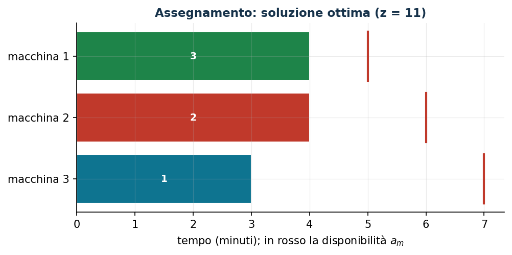

# Assegnamento a costo minimo con disponibilità

**Classe:** BIP · **Legami:** nessuno (una sola famiglia di variabili) · **Script:** `python/fam07_scheduling.py`

[](https://colab.research.google.com/github/fabiofurini/modellazione-mip/blob/main/notebooks/fam07_scheduling.ipynb)

!!! abstract "Problema 7.1"
    Un'azienda deve eseguire $n \in \mathbb{Z}_{\ge 1}$ lavori su $k \in \mathbb{Z}_{\ge 1}$
    macchine. Per ogni lavoro $j \in \{1, 2, \dots, n\}$ e ogni macchina
    $m \in \{1, 2, \dots, k\}$, il valore $t_{jm} \in \mathbb{Q}_{>0}$ è il tempo di
    lavorazione in minuti e il valore $c_{jm} \in \mathbb{Q}_{>0}$ è il costo in euro di
    eseguire il lavoro $j$ sulla macchina $m$. Per ogni macchina
    $m \in \{1, 2, \dots, k\}$, il valore $a_m \in \mathbb{Q}_{>0}$ è il tempo di
    lavorazione disponibile in minuti. Ogni macchina esegue un lavoro alla volta.
    L'azienda vuole assegnare tutti i lavori alle macchine a costo minimo.

**Il problema a parole.** *Decidiamo* su quale macchina eseguire ciascun lavoro.
*L'obiettivo*: costo totale minimo. *I vincoli*: ogni lavoro va eseguito da
esattamente una macchina; il tempo complessivo dei lavori assegnati a una macchina
non supera la sua disponibilità. È il problema di **assegnamento generalizzato**:
un assegnamento con un vincolo di zaino per macchina.

## Modello

**Dati (input del modello).**

| Simbolo | Tipo | Significato |
|---|---|---|
| $n$ | $\in \mathbb{Z}_{\ge 1}$ | numero di lavori, $j \in \{1, 2, \dots, n\}$ |
| $k$ | $\in \mathbb{Z}_{\ge 1}$ | numero di macchine, $m \in \{1, 2, \dots, k\}$ |
| $t_{jm}$ | $\in \mathbb{Q}_{>0}$ | tempo di lavorazione del lavoro $j$ sulla macchina $m$ |
| $c_{jm}$ | $\in \mathbb{Q}_{>0}$ | costo di eseguire il lavoro $j$ sulla macchina $m$ |
| $a_m$ | $\in \mathbb{Q}_{>0}$ | disponibilità della macchina $m$ |

**Variabili decisionali.** Introduciamo le seguenti $n\,k$ variabili binarie:

$$
x_{jm} = \begin{cases} 1 & \text{se il lavoro } j \text{ è eseguito dalla macchina } m,\\ 0 & \text{altrimenti,}\end{cases}
\qquad \forall j \in \{1, 2, \dots, n\},\ \forall m \in \{1, 2, \dots, k\}.
$$

Usando queste variabili, un modello BIP per il problema è il seguente:

$$
\begin{aligned}
\min ~~ \sum_{j=1}^{n} \sum_{m=1}^{k} c_{jm}\, x_{jm} & & \\
\text{soggetto a} \quad \sum_{m=1}^{k} x_{jm} &= 1, & \forall j \in \{1, 2, \dots, n\}, \\
\sum_{j=1}^{n} t_{jm}\, x_{jm} &\le a_m, & \forall m \in \{1, 2, \dots, k\}, \\
x_{jm} &\in \{0, 1\}, & \forall j \in \{1, 2, \dots, n\},\ \forall m \in \{1, 2, \dots, k\}.
\end{aligned}
$$

Descrizione della funzione obiettivo e dei vincoli:

- la funzione obiettivo lineare minimizza il costo totale di lavorazione, somma
  dei costi degli assegnamenti scelti;
- i vincoli di **assegnamento** assicurano che ogni lavoro sia assegnato a
  esattamente una macchina, così che tutti i lavori vengano eseguiti ($n$ vincoli
  lineari);
- i vincoli di **disponibilità** garantiscono che il tempo complessivo dei
  lavori assegnati a ciascuna macchina non superi la sua disponibilità ($k$
  vincoli lineari);
- i vincoli di dominio definiscono le variabili del modello.

Il modello ha una sola famiglia di variabili: non ci sono legami da dimostrare.
I vincoli di disponibilità sono del tipo «capacità/risorsa»: due quantità della
stessa natura (minuti richiesti e minuti disponibili) a confronto, nessuna
implicazione logica. Il modello si risolve all'ottimo, ad esempio, con il
branch-and-bound.

## Il modello in gurobipy

Ogni famiglia di vincoli è una `addConstrs` con il nome della sua etichetta.

```python
m = gp.Model("assegnamento");  m.Params.OutputFlag = 0
x = m.addVars(n, k, vtype=GRB.BINARY, name="x")
m.setObjective(gp.quicksum(c[j][mm] * x[j, mm] for j in range(n)
                           for mm in range(k)), GRB.MINIMIZE)
m.addConstrs((x.sum(j, "*") == 1 for j in range(n)), name="assegna")
m.addConstrs((gp.quicksum(t[j][mm] * x[j, mm] for j in range(n)) <= a[mm]
              for mm in range(k)), name="disponibilita")
m.optimize()
```

## L'istanza

$n = 3$ lavori, $k = 3$ macchine:

| $t_{jm}$ | $m=1$ | $m=2$ | $m=3$ |
|---|---:|---:|---:|
| $j=1$ | 2 | 1 | 3 |
| $j=2$ | 3 | 4 | 2 |
| $j=3$ | 4 | 5 | 3 |

| $c_{jm}$ | $m=1$ | $m=2$ | $m=3$ |
|---|---:|---:|---:|
| $j=1$ | 5 | 10 | 2 |
| $j=2$ | 5 | 4 | 6 |
| $j=3$ | 5 | 4 | 6 |

| | $m=1$ | $m=2$ | $m=3$ |
|---|---:|---:|---:|
| $a_m$ | 5 | 6 | 7 |

Il modello per l'istanza:

$$
\begin{array}{r r@{\;}r@{\;}r@{\;}r@{\;}r@{\;}r@{\;}r@{\;}r@{\;}r c r}
\min & 5x_{11} & +10x_{12} & +2x_{13} & +5x_{21} & +4x_{22} & +6x_{23} & +5x_{31} & +4x_{32} & +6x_{33} & & \\
\text{soggetto a} & x_{11} & +x_{12} & +x_{13} & & & & & & & = & 1,\\
 & & & & x_{21} & +x_{22} & +x_{23} & & & & = & 1,\\
 & & & & & & & x_{31} & +x_{32} & +x_{33} & = & 1,\\
 & 2x_{11} & & & +3x_{21} & & & +4x_{31} & & & \le & 5,\\
 & & x_{12} & & & +4x_{22} & & & +5x_{32} & & \le & 6,\\
 & & & 3x_{13} & & & +2x_{23} & & & +3x_{33} & \le & 7,\\
 & x_{11}, & x_{12}, & x_{13}, & x_{21}, & x_{22}, & x_{23}, & x_{31}, & x_{32}, & x_{33} & \in & \{0,1\}.
\end{array}
$$

## Euristica costruttiva: upper bound

Tre euristiche ispirate al bin packing. **Next-fit**: si carica una macchina
alla volta e si passa alla successiva quando un lavoro non ci sta più.
**First-fit**: ogni lavoro va sulla prima macchina con disponibilità residua
sufficiente. **Best-fit**: fra le macchine con disponibilità sufficiente si
sceglie quella di costo minimo.

```text
BestFit(n, k, t, c, a):
  x[j][m] <- 0 per ogni j, m;   ra[m] <- a[m] per ogni m      # disponibilità residue
  per j = 1..n:
      sm <- 0;  mc <- +inf                                     # macchina scelta, costo minimo
      per m = 1..k:
          se t[j][m] <= ra[m] e c[j][m] < mc:  sm <- m;  mc <- c[j][m]
      se sm = 0:  restituisci "nessuna soluzione trovata"
      x[j][sm] <- 1;  ra[sm] <- ra[sm] - t[j][sm]
  restituisci x
```

Esecuzione sull'istanza (output dello script):

- **Passo 1.** Lavoro 1: $ra = (5, 6, 7)$; tutte le macchine bastano; costi
  $5, 10, 2$: il minimo è la macchina 3, quindi $x[1][3] = 1$ e $ra[3] = 7 - 3 = 4$.
- **Passo 2.** Lavoro 2: $ra = (5, 6, 4)$; costi $5, 4, 6$: il minimo è la
  macchina 2, quindi $x[2][2] = 1$ e $ra[2] = 6 - 4 = 2$.
- **Passo 3.** Lavoro 3: $ra = (5, 2, 4)$; la macchina 2 non basta ($5 > 2$);
  fra le altre, costi $5$ e $6$: il minimo è la macchina 1, quindi $x[3][1] = 1$
  e $ra[1] = 5 - 4 = 1$.

Soluzione $\bar x_{13} = \bar x_{22} = \bar x_{31} = 1$, valore $2 + 4 + 5 = 11$:
$\mathrm{ub} = 11$, cioè $z(\mathrm{MILP}) \le 11$. Next-fit e first-fit trovano
entrambe $x_{11} = x_{21} = x_{32} = 1$, di valore $14$.

## Rilassamento LP e duale: lower bound

Il rilassamento LP sostituisce $x_{jm} \in \{0,1\}$ con $x_{jm} \ge 0$ (il
vincolo $x_{jm} \le 1$ è implicato dai vincoli di assegnamento). Con una
variabile duale libera $\mu_j$ per ogni vincolo di assegnamento e una non
positiva $\pi_m$ per ogni vincolo di disponibilità (verso $\le$ in un minimo),
il duale è:

$$
\begin{aligned}
\max ~~ \sum_{j=1}^{n} \mu_j + \sum_{m=1}^{k} a_m\, \pi_m & & \\
\text{soggetto a} \quad \mu_j + t_{jm}\, \pi_m &\le c_{jm}, & \forall j \in \{1, 2, \dots, n\},\ \forall m \in \{1, 2, \dots, k\}, \\
\mu_j &\gtreqless 0, & \forall j \in \{1, 2, \dots, n\}, \\
\pi_m &\le 0, & \forall m \in \{1, 2, \dots, k\}.
\end{aligned}
$$

**Una soluzione duale a mano.** Con $\bar\pi_m = 0$, i vincoli diventano
$\mu_j \le c_{jm}$ per ogni $m$: il valore più grande ammissibile è

$$
\bar\mu_1 = \min\{5, 10, 2\} = 2,\qquad \bar\mu_2 = \min\{5, 4, 6\} = 4,\qquad \bar\mu_3 = \min\{5, 4, 6\} = 4,
$$

con valore $10$. Per la dualità debole

$$
10 ~\le~ z(\mathrm{LP}) ~\le~ z(\mathrm{MILP}) ~\le~ 11.
$$

La ricetta ha un significato: «ogni lavoro costa almeno il suo costo minimo» è
un lower bound che chiunque scriverebbe; il duale lo formalizza e dice come
migliorarlo, con $\pi_m < 0$ dove la disponibilità è stretta.

**Quello che dice il solver.** $z(\mathrm{LP}) = 53/5 = 10{,}6$ (uguale
all'ottimo del duale: dualità forte), con duali $\tilde\mu = (2,\ 4{,}8,\ 5)$ e
$\tilde\pi = (0,\ -0{,}2,\ 0)$: la macchina 2 è la risorsa stretta. L'ottimo
intero è $z(\mathrm{MILP}) = 11$ con $\tilde x_{13} = \tilde x_{22} = \tilde x_{31} = 1$:
il best-fit aveva trovato l'ottimo, ma solo il solver lo certifica — il bound
duale si fermava a $10$ (e poiché i costi sono interi, $\lceil 53/5 \rceil = 11$
chiude il gap).

| $\mathrm{ub}$ (best-fit) | $\mathrm{lb}$ (duale a mano) | $z(\mathrm{LP})$ | $z(\mathrm{MILP})$ | gap euristica |
|---:|---:|---:|---:|---:|
| 11 | 10 | $53/5$ | 11 | $0{,}0\%$ |



## Considerazioni aggiuntive

- $x_{jm} \le 1$ ($n\,k$ disuguaglianze) sono valide ma implicate dai vincoli
  di assegnamento: non rafforzano il rilassamento (infatti
  $z(\mathrm{LP}) = z(\mathrm{LP}^+)$).
- Se un lavoro $j$ non sta su una macchina $m$ ($t_{jm} > a_m$), $x_{jm}$ si
  può fissare a zero prima di risolvere: il modello è più piccolo e il
  rilassamento non peggiora.

## Domande di modellazione aggiuntive

??? question "7.1.1 — I lavori 1 e 3 sulla stessa macchina"
    I lavori 1 e 3 usano lo stesso utensile e devono essere eseguiti dalla stessa
    macchina. Come cambia il modello? Qual è il nuovo ottimo per l'istanza?

    ??? success "Soluzione"
        Per ogni macchina $m$, $x_{1m} = 1$ se e solo se $x_{3m} = 1$:

        $$x_{1m} = x_{3m}, \qquad \forall m \in \{1, 2, \dots, k\}$$

        ($k$ vincoli lineari). Entrambi i versi sono imposti dal vincolo; i
        vincoli di assegnamento garantiscono che la macchina comune sia una
        sola. Nuovo ottimo $12$: la coppia sta sulla macchina 3
        ($3 + 3 \le 7$, costo $2 + 6$) e il lavoro 2 sulla macchina 2 ($4$).

??? question "7.1.2 — Costo fisso per macchina usata"
    Ogni macchina che esegue almeno un lavoro costa in più $g_m = 3$ euro di
    accensione. Modellare il costo fisso e trovare il nuovo ottimo. Quale legame
    entra in gioco?

    ??? success "Soluzione"
        Serve la famiglia delle **attivazioni** $y_m \in \{0,1\}$, l'obiettivo
        diventa $\sum_j \sum_m c_{jm} x_{jm} + \sum_m g_m y_m$ e il legame «se un
        lavoro è assegnato a $m$ allora $m$ è usata» si impone con

        $$x_{jm} \le y_m, \qquad \forall j,\ \forall m$$

        ($n\,k$ vincoli). Il verso opposto — una macchina senza lavori non viene
        accesa — segue dall'obiettivo in ogni ottimo perché $g_m > 0$. È il
        legame di attivazione, studiato per intero nel [problema 7.2](scheduling-2.md).
        Nuovo ottimo $18$, con due sole macchine: i lavori 1 e 3 sulla macchina
        3 e il lavoro 2 sulla macchina 2, più $2 \cdot 3$ di accensione; la
        soluzione a tre macchine costerebbe $11 + 9 = 20$.

## Codice

Lo script completo della famiglia — dati, sette modelli, euristiche, duali,
soluzioni e figure — è
[`python/fam07_scheduling.py`](https://github.com/fabiofurini/modellazione-mip/blob/main/python/fam07_scheduling.py)
(riproducibile con `python3 python/fam07_scheduling.py` dalla cartella `python/`).
Lo stesso codice è disponibile come notebook —
[`notebooks/fam07_scheduling.ipynb`](https://github.com/fabiofurini/modellazione-mip/blob/main/notebooks/fam07_scheduling.ipynb)
— che si apre in Colab dal badge in cima alla pagina.
