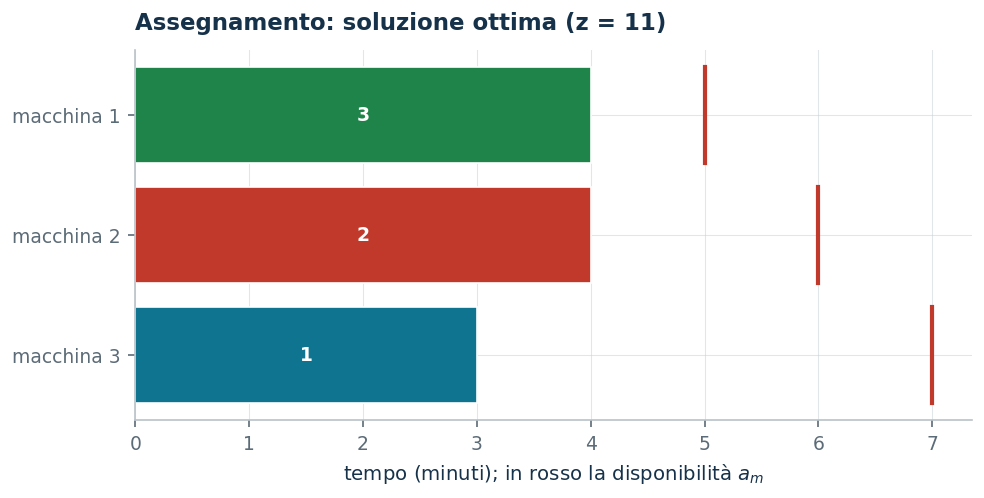

# Assegnamento a costo minimo con disponibilità

[:material-file-pdf-box: Dispensa (PDF)](pdf/dispensa-3-simbolici.pdf) · [:material-presentation: Slide (PDF)](pdf/slide-09-scheduling-1.pdf)

**Classe:** BIP · **Legami:** nessuno (una sola famiglia di variabili) · **Script:** `python/fam07_1_assegnamento.py`<br>
**Difficoltà:** ★☆☆☆☆ · **Tempo:** 20–30 min
{ .scheda }

[](https://colab.research.google.com/github/fabiofurini/modellazione-mip/blob/main/notebooks/fam07_1_assegnamento.ipynb)

!!! abstract "Problema 7.1"
    Un'azienda deve eseguire $n \in \mathbb{Z}_{\ge 1}$ lavori su $k \in \mathbb{Z}_{\ge 1}$
    macchine. Per ogni lavoro $j \in \{1, 2, \dots, n\}$ e ogni macchina
    $m \in \{1, 2, \dots, k\}$, il valore $t_{jm} \in \mathbb{Q}_{>0}$ è il tempo di
    lavorazione in minuti e il valore $c_{jm} \in \mathbb{Q}_{>0}$ è il costo in euro di
    eseguire il lavoro $j$ sulla macchina $m$. Per ogni macchina
    $m \in \{1, 2, \dots, k\}$, il valore $a_m \in \mathbb{Q}_{>0}$ è il tempo di
    lavorazione disponibile in minuti. Ogni macchina esegue un lavoro alla volta.
    L'azienda vuole assegnare tutti i lavori alle macchine a costo minimo.

**Il problema a parole.** *Decidiamo* su quale macchina eseguire ciascun lavoro.
*L'obiettivo*: costo totale minimo. *I vincoli*: ogni lavoro va eseguito da
esattamente una macchina; il tempo complessivo dei lavori assegnati a una macchina
non supera la sua disponibilità. È il problema di **assegnamento generalizzato**:
un assegnamento con un vincolo di zaino per macchina.

## Modello

**Dati (input del modello).**

| Simbolo | Tipo | Significato |
|---|---|---|
| $n$ | $\in \mathbb{Z}_{\ge 1}$ | numero di lavori, $j \in \{1, 2, \dots, n\}$ |
| $k$ | $\in \mathbb{Z}_{\ge 1}$ | numero di macchine, $m \in \{1, 2, \dots, k\}$ |
| $t_{jm}$ | $\in \mathbb{Q}_{>0}$ | tempo di lavorazione del lavoro $j$ sulla macchina $m$ |
| $c_{jm}$ | $\in \mathbb{Q}_{>0}$ | costo di eseguire il lavoro $j$ sulla macchina $m$ |
| $a_m$ | $\in \mathbb{Q}_{>0}$ | disponibilità della macchina $m$ |

**Variabili decisionali.** Introduciamo le seguenti $n\,k$ variabili binarie:

$$
x_{jm} = \begin{cases} 1 & \text{se il lavoro } j \text{ è eseguito dalla macchina } m,\\ 0 & \text{altrimenti,}\end{cases}
\qquad \forall j \in \{1, 2, \dots, n\},\ \forall m \in \{1, 2, \dots, k\}.
$$

Usando queste variabili, un modello BIP per il problema è il seguente:

<!-- modello: 7.1 -->

$$
\begin{aligned}
\min ~~ \sum_{j=1}^{n} \sum_{m=1}^{k} c_{jm}\, x_{jm} & & \\
\text{soggetto a} \quad \sum_{m=1}^{k} x_{jm} &= 1, & \forall j \in \{1, 2, \dots, n\}, \\
\sum_{j=1}^{n} t_{jm}\, x_{jm} &\le a_m, & \forall m \in \{1, 2, \dots, k\}, \\
x_{jm} &\in \{0, 1\}, & \forall j \in \{1, 2, \dots, n\},\ \forall m \in \{1, 2, \dots, k\}.
\end{aligned}
$$

<!-- modello: fine -->

Descrizione della funzione obiettivo e dei vincoli:

- la funzione obiettivo lineare minimizza il costo totale di lavorazione, somma
  dei costi degli assegnamenti scelti;
- i vincoli di **assegnamento** assicurano che ogni lavoro sia assegnato a
  esattamente una macchina, così che tutti i lavori vengano eseguiti ($n$ vincoli
  lineari);
- i vincoli di **disponibilità** garantiscono che il tempo complessivo dei
  lavori assegnati a ciascuna macchina non superi la sua disponibilità ($k$
  vincoli lineari);
- i vincoli di dominio definiscono le variabili del modello.

Il modello ha una sola famiglia di variabili: non ci sono legami da dimostrare.
I vincoli di disponibilità sono del tipo «capacità/risorsa»: due quantità della
stessa natura (minuti richiesti e minuti disponibili) a confronto, nessuna
implicazione logica. Il modello si risolve all'ottimo, ad esempio, con il
branch-and-bound.

## Il modello in gurobipy

Ogni famiglia di vincoli è una `addConstrs` con il nome della sua etichetta.

```python
m = gp.Model("assegnamento");  m.Params.OutputFlag = 0
x = m.addVars(n, k, vtype=GRB.BINARY, name="x")
m.setObjective(gp.quicksum(c[j][mm] * x[j, mm] for j in range(n)
                           for mm in range(k)), GRB.MINIMIZE)
m.addConstrs((x.sum(j, "*") == 1 for j in range(n)), name="assegna")
m.addConstrs((gp.quicksum(t[j][mm] * x[j, mm] for j in range(n)) <= a[mm]
              for mm in range(k)), name="disponibilita")
m.optimize()
```

## L'istanza

$n = 3$ lavori, $k = 3$ macchine:

| $t_{jm}$ | $m=1$ | $m=2$ | $m=3$ |
|---|---:|---:|---:|
| $j=1$ | 2 | 1 | 3 |
| $j=2$ | 3 | 4 | 2 |
| $j=3$ | 4 | 5 | 3 |

| $c_{jm}$ | $m=1$ | $m=2$ | $m=3$ |
|---|---:|---:|---:|
| $j=1$ | 5 | 10 | 2 |
| $j=2$ | 5 | 4 | 6 |
| $j=3$ | 5 | 4 | 6 |

| | $m=1$ | $m=2$ | $m=3$ |
|---|---:|---:|---:|
| $a_m$ | 5 | 6 | 7 |

Il modello scritto sui dati dell'istanza:

<!-- modello-esteso: fam07_1_primale -->

<div class="modello-esteso largo" markdown>

$$
\begin{array}{rrrrrrrrrr c l}
\min & 5x_{11} & +10x_{12} & +2x_{13} & +5x_{21} & +4x_{22} & +6x_{23} & +5x_{31} & +4x_{32} & +6x_{33} &  & \\
\text{soggetto a} & x_{11} & +x_{12} & +x_{13} &  &  &  &  &  &  & = & 1\\
 &  &  &  & x_{21} & +x_{22} & +x_{23} &  &  &  & = & 1\\
 &  &  &  &  &  &  & x_{31} & +x_{32} & +x_{33} & = & 1\\
 & 2x_{11} &  &  & +3x_{21} &  &  & +4x_{31} &  &  & \le & 5\\
 &  & x_{12} &  &  & +4x_{22} &  &  & +5x_{32} &  & \le & 6\\
 &  &  & 3x_{13} &  &  & +2x_{23} &  &  & +3x_{33} & \le & 7\\
 & x_{11}, & x_{12}, & x_{13}, & x_{21}, & x_{22}, & x_{23}, & x_{31}, & x_{32}, & x_{33} & \in & \{0, 1\}
\end{array}
$$

</div>

<!-- modello-esteso: fine -->

## Euristica costruttiva: il bound primale

Tre euristiche ispirate al bin packing. **Next-fit**: si carica una macchina
alla volta e si passa alla successiva quando un lavoro non ci sta più.
**First-fit**: ogni lavoro va sulla prima macchina con disponibilità residua
sufficiente. **Best-fit**: fra le macchine con disponibilità sufficiente si
sceglie quella di costo minimo.

```text
BestFit(n, k, t, c, a):
  x[j][m] <- 0 per ogni j, m;   ra[m] <- a[m] per ogni m      # disponibilità residue
  per j = 1..n:
      sm <- 0;  mc <- +inf                                     # macchina scelta, costo minimo
      per m = 1..k:
          se t[j][m] <= ra[m] e c[j][m] < mc:  sm <- m;  mc <- c[j][m]
      se sm = 0:  restituisci "nessuna soluzione trovata"
      x[j][sm] <- 1;  ra[sm] <- ra[sm] - t[j][sm]
  restituisci x
```

Esecuzione sull'istanza (output dello script):

- **Passo 1.** Lavoro 1: $ra = (5, 6, 7)$; tutte le macchine bastano; costi
  $5, 10, 2$: il minimo è la macchina 3, quindi $x[1][3] = 1$ e $ra[3] = 7 - 3 = 4$.
- **Passo 2.** Lavoro 2: $ra = (5, 6, 4)$; costi $5, 4, 6$: il minimo è la
  macchina 2, quindi $x[2][2] = 1$ e $ra[2] = 6 - 4 = 2$.
- **Passo 3.** Lavoro 3: $ra = (5, 2, 4)$; la macchina 2 non basta ($5 > 2$);
  fra le altre, costi $5$ e $6$: il minimo è la macchina 1, quindi $x[3][1] = 1$
  e $ra[1] = 5 - 4 = 1$.

Soluzione $\bar x_{13} = \bar x_{22} = \bar x_{31} = 1$, valore $2 + 4 + 5 = 11$:
$\mathit{UB} = 11$, cioè $z(\mathit{MILP}) \le 11$. Next-fit e first-fit trovano
entrambe $x_{11} = x_{21} = x_{32} = 1$, di valore $14$.

## Rilassamento LP e duale: il bound duale

Il rilassamento LP sostituisce $x_{jm} \in \{0,1\}$ con $x_{jm} \ge 0$ (il
vincolo $x_{jm} \le 1$ è implicato dai vincoli di assegnamento). Con una
variabile duale libera $\mu_j$ per ogni vincolo di assegnamento e una non
positiva $\pi_m$ per ogni vincolo di disponibilità (verso $\le$ in un minimo),
il duale è:

<!-- modello: 7.1-duale -->

$$
\begin{aligned}
\max ~~ \sum_{j=1}^{n} \mu_j + \sum_{m=1}^{k} a_m\, \pi_m & & \\
\text{soggetto a} \quad \mu_j + t_{jm}\, \pi_m &\le c_{jm}, & \forall j \in \{1, 2, \dots, n\},\ \forall m \in \{1, 2, \dots, k\}, \\
\mu_j &\gtreqless 0, & \forall j \in \{1, 2, \dots, n\}, \\
\pi_m &\le 0, & \forall m \in \{1, 2, \dots, k\}.
\end{aligned}
$$

<!-- modello: fine -->

Lo stesso duale, scritto sui dati dell'istanza:

<!-- modello-esteso: fam07_1_duale -->

<div class="modello-esteso" markdown>

$$
\begin{array}{rrrrrrr c l}
\max & \mu_1 & +\mu_2 & +\mu_3 & +5\pi_1 & +6\pi_2 & +7\pi_3 &  & \\
\text{soggetto a} & \mu_1 &  &  & +2\pi_1 &  &  & \le & 5\\
 & \mu_1 &  &  &  & +\pi_2 &  & \le & 10\\
 & \mu_1 &  &  &  &  & +3\pi_3 & \le & 2\\
 &  & \mu_2 &  & +3\pi_1 &  &  & \le & 5\\
 &  & \mu_2 &  &  & +4\pi_2 &  & \le & 4\\
 &  & \mu_2 &  &  &  & +2\pi_3 & \le & 6\\
 &  &  & \mu_3 & +4\pi_1 &  &  & \le & 5\\
 &  &  & \mu_3 &  & +5\pi_2 &  & \le & 4\\
 &  &  & \mu_3 &  &  & +3\pi_3 & \le & 6\\
 & \mu_1, & \mu_2, & \mu_3 &  &  &  & \gtreqless & 0\\
 &  &  &  & \pi_1, & \pi_2, & \pi_3 & \le & 0
\end{array}
$$

</div>

<!-- modello-esteso: fine -->

**Una soluzione duale a mano.** Con $\bar\pi_m = 0$, i vincoli diventano
$\mu_j \le c_{jm}$ per ogni $m$: il valore più grande ammissibile è

$$
\bar\mu_1 = \min\{5, 10, 2\} = 2,\qquad \bar\mu_2 = \min\{5, 4, 6\} = 4,\qquad \bar\mu_3 = \min\{5, 4, 6\} = 4,
$$

con valore $10$. Per la dualità debole

$$
10 ~\le~ z(\mathit{LP}) ~\le~ z(\mathit{MILP}) ~\le~ 11.
$$

La ricetta ha un significato: «ogni lavoro costa almeno il suo costo minimo» è
un lower bound che chiunque scriverebbe; il duale lo formalizza e dice come
migliorarlo, con $\pi_m < 0$ dove la disponibilità è stretta.

**Quello che dice il solver.** $z(\mathit{LP}) = 53/5 = 10{,}6$ (uguale
all'ottimo del duale: dualità forte), con duali $\tilde\mu = (2,\ 4{,}8,\ 5)$ e
$\tilde\pi = (0,\ -0{,}2,\ 0)$: la macchina 2 è la risorsa stretta. L'ottimo
intero è $z(\mathit{MILP}) = 11$ con $\tilde x_{13} = \tilde x_{22} = \tilde x_{31} = 1$:
il best-fit aveva trovato l'ottimo, ma solo il solver lo certifica — il bound
duale si fermava a $10$ (e poiché i costi sono interi, $\lceil 53/5 \rceil = 11$
chiude il gap).

| $UB$ (best-fit) | $LB$ (duale a mano) | $z(\mathit{LP})$ | $z(\mathit{MILP})$ | gap euristica |
|---:|---:|---:|---:|---:|
| 11 | 10 | $53/5$ | 11 | $0{,}0\%$ |



## Considerazioni aggiuntive

- $x_{jm} \le 1$ ($n\,k$ disuguaglianze) sono valide ma implicate dai vincoli
  di assegnamento: non rafforzano il rilassamento (infatti
  $z(\mathit{LP}) = z(\mathit{LP}^+)$).
- Se un lavoro $j$ non sta su una macchina $m$ ($t_{jm} > a_m$), $x_{jm}$ si
  può fissare a zero prima di risolvere: il modello è più piccolo e il
  rilassamento non peggiora.

## Domande di modellazione aggiuntive

??? question "7.1.1 — Costo fisso per macchina usata"
    Ogni macchina che esegue almeno un lavoro costa in più $g_m = 3$ euro di
    accensione. Modellare il costo fisso e trovare il nuovo ottimo. Quale legame
    entra in gioco?

## Una variante svolta: i lavori 1 e 3 sulla stessa macchina

I lavori 1 e 3 usano lo stesso utensile e devono essere eseguiti dalla stessa
macchina. È un legame fra due variabili della stessa famiglia: per ogni macchina
$m$, $x_{1m} = 1$ se e solo se $x_{3m} = 1$, cioè

$$
x_{1m} = x_{3m}, \qquad \forall m \in \{1, 2, \dots, k\}
$$

($k$ vincoli lineari). Entrambi i versi sono imposti dal vincolo: se
$x_{1m} = 1$ allora $x_{3m} = 1$ e viceversa; i vincoli di assegnamento
garantiscono poi che la macchina comune sia una sola.

Il legame cambia anche il duale: aggiunge una variabile libera $\sigma_m$ per
ogni macchina, e con essa i due lavori si possono valutare *insieme*: i
vincoli delle loro colonne danno
$\mu_1 + \mu_3 \le \min_m (c_{1m} + c_{3m})$, che è più di quanto si ottenga
valutandoli separatamente.

Sull'istanza la coppia deve stare dove $t_{1m} + t_{3m} \le a_m$: sulla macchina
1 no ($2 + 4 > 5$), sulla 2 sì ($1 + 5 \le 6$, costo $10 + 4$), sulla 3 sì
($3 + 3 \le 7$, costo $2 + 6$); con il lavoro 2 sulla macchina 2 (costo $4$) la
scelta migliore è la macchina 3 per la coppia, e il nuovo ottimo è
$2 + 6 + 4 = 12$. I due bound si toccano e il problema si chiude senza il
solver.

<!-- tabella-variante: fam07_1a_bound -->

|  | valore | che cos'è |
|---|---:|---|
| $\mathit{UB}$ | $12$ | soluzione euristica |
| $\mathit{LB}$ | $12$ | certificato duale costruito a mano |
| $z(\mathit{LP})$ | $12$ | rilassamento senza i bound |
| $z(\mathit{LP}^+)$ | $12$ | rilassamento con i bound |
| $z(\mathit{MILP})$ | $12$ | ottimo del MILP |

<!-- tabella-variante: fine -->

## Codice

Lo script completo del problema — dati, modello, euristiche, duale,
soluzione, varianti e figure — è
[`python/fam07_1_assegnamento.py`](https://github.com/fabiofurini/modellazione-mip/blob/main/python/fam07_1_assegnamento.py)
(riproducibile con `python3 python/fam07_1_assegnamento.py` dalla cartella `python/`).
Lo stesso codice è disponibile come notebook —
[`notebooks/fam07_1_assegnamento.ipynb`](https://github.com/fabiofurini/modellazione-mip/blob/main/notebooks/fam07_1_assegnamento.ipynb)
— che si apre in Colab dal badge in cima alla pagina.

<!-- script-incorporato: inizio (rigenerato da python/incorpora_codice.py) -->

??? example "Mostra lo script completo — `python/fam07_1_assegnamento.py` (227 righe)"

    ```python
    """Problema 7.1 -- Assegnamento a costo minimo con disponibilita' (GAP).

    Un modello BIP con una sola famiglia di variabili: nessun legame da
    dimostrare, solo un vincolo di assegnamento e uno di capacita' per macchina.
    Euristiche next/first/best-fit per l'upper bound, duale del rilassamento LP
    con soluzione costruita a mano per il lower bound.
    """
    import gurobipy as gp
    import numpy as np
    import pandas as pd
    from gurobipy import GRB

    from euristiche import best_fit, first_fit, matrice, next_fit
    from mip import (ammissibile, dualita_forte, due_rilassamenti, frazione,
                     nuovo_modello, registra_bound, rilassamenti, risolvi,
                     stampa_soluzione, valuta)
    from stile import CICLO, ROSSO, intestazione, plt, salva_dati, salva_figura
    from esteso import salva_modello

    R = range

    # ---------- 1. MODELLO E ISTANZA ----------
    intestazione("1. Assegnamento a costo minimo: n lavori, k macchine, disponibilità a_m")
    t1 = [[2, 1, 3], [3, 4, 2], [4, 5, 3]]
    c1 = [[5, 10, 2], [5, 4, 6], [5, 4, 6]]
    a1 = [5, 6, 7]
    n, k = 3, 3
    salva_dati(pd.DataFrame([{"lavoro": j + 1, "macchina": m + 1, "t": t1[j][m], "c": c1[j][m]}
                             for j in R(n) for m in R(k)]), "fam07_1_lavori")
    salva_dati(pd.DataFrame({"macchina": R(1, k + 1), "a": a1}), "fam07_1_macchine")


    def modello_1(t, c, a):
        n, k = len(t), len(a)
        m = nuovo_modello("assegnamento")
        x = m.addVars(n, k, vtype=GRB.BINARY, name="x")
        m.setObjective(gp.quicksum(c[j][mm] * x[j, mm] for j in R(n) for mm in R(k)), GRB.MINIMIZE)
        m.addConstrs((x.sum(j, "*") == 1 for j in R(n)), name="assegna")
        m.addConstrs((gp.quicksum(t[j][mm] * x[j, mm] for j in R(n)) <= a[mm] for mm in R(k)),
                     name="disponibilita")
        return m, x


    def duale_1(t, c, a):
        """Duale del rilassamento LP: max sum mu_j + sum a_m pi_m, mu_j + t_jm pi_m <= c_jm, pi <= 0."""
        n, k = len(t), len(a)
        d = nuovo_modello("duale_assegnamento")
        mu = d.addVars(n, lb=-GRB.INFINITY, name="mu")
        pi = d.addVars(k, lb=-GRB.INFINITY, ub=0.0, name="pi")
        d.setObjective(mu.sum() + gp.quicksum(a[mm] * pi[mm] for mm in R(k)), GRB.MAXIMIZE)
        d.addConstrs((mu[j] + t[j][mm] * pi[mm] <= c[j][mm] for j in R(n) for mm in R(k)), name="rc")
        return d


    def valore_1(e, c):
        return sum(c[j][mm] for (j, mm) in e.x)


    m1, x1 = modello_1(t1, c1, a1)
    salva_modello(m1, "fam07_1_primale")

    # ---------- 2. IL RILASSAMENTO LP ----------
    zlp1, zlp1r, pi_lp = rilassamenti(m1)
    print("Duali del rilassamento letti da Gurobi:", {kk: round(v, 4) for kk, v in pi_lp.items()})

    # ---------- 3. IL DUALE DEL RILASSAMENTO (LOWER BOUND) ----------
    d1 = duale_1(t1, c1, a1)
    salva_modello(d1, "fam07_1_duale")
    mano = {f"mu[{j}]": min(c1[j]) for j in R(n)}
    lb1, viol = valuta(d1, mano)
    assert viol <= 1e-9, viol
    print(f"Soluzione duale a mano: pi = 0, mu_j = min_m c_jm = "
          + ", ".join(frazione(mano[f"mu[{j}]"]) for j in R(n)) + f"  ->  lb = {frazione(lb1)}")
    dualita_forte(d1, zlp1)

    # ---------- 4. EURISTICA COSTRUTTIVA (UPPER BOUND) ----------
    print("Euristiche costruttive:")
    e_next = next_fit(t1, a1)
    e_first = first_fit(t1, a1)
    e_best = best_fit(t1, a1, lambda j, mm, ra: c1[j][mm], "costo")
    for nome, e in [("next-fit", e_next), ("first-fit", e_first), ("best-fit (costo minimo)", e_best)]:
        print(f"  {nome:26s} ub = {valore_1(e, c1)}   assegnazione "
              + ", ".join(f"x[{j + 1}][{mm + 1}]" for (j, mm) in sorted(e.x)))
    print("Esecuzione passo-passo del best-fit:")
    e_best.traccia.stampa()
    ub1 = valore_1(e_best, c1)
    sol_eur = {f"x[{j},{mm}]": 1 for (j, mm) in e_best.x}
    assert ammissibile(m1, sol_eur)

    # ---------- 5. SOLUZIONE OTTIMA DEL MILP ----------
    z1 = risolvi(m1)
    print("Soluzione ottima del MILP:")
    stampa_soluzione(m1, solo_non_nulle=True)
    riga = registra_bound("1 assegnamento", ub1, lb1, zlp1, zlp1r, z1)
    salva_dati(pd.DataFrame([riga]), "fam07_1_bound")
    ott1 = {(j, mm) for j in R(n) for mm in R(k) if x1[j, mm].X > 0.5}

    # ---------- 6. DOMANDE DI MODELLAZIONE AGGIUNTIVE ----------


    varianti = {}


    def variante(nome, m):
        z = risolvi(m)
        print(f"  {nome:70s} z = {frazione(z)}")
        return z

    # 1a: i lavori 1 e 3 devono stare sulla stessa macchina
    m, x = modello_1(t1, c1, a1)
    m.addConstrs((x[0, mm] == x[2, mm] for mm in R(3)), name="insieme")
    varianti["1a"] = variante("1a. Lavori 1 e 3 sulla stessa macchina (x_1m = x_3m)", m)
    # 1b: costo fisso g_m per macchina usata (attivazione)
    g1 = [3, 3, 3]
    m, x = modello_1(t1, c1, a1)
    y = m.addVars(3, vtype=GRB.BINARY, name="y")
    m.addConstrs((x[j, mm] <= y[mm] for j in R(3) for mm in R(3)), name="attiva")
    m.update()
    m.setObjective(m.getObjective() + gp.quicksum(g1[mm] * y[mm] for mm in R(3)), GRB.MINIMIZE)
    varianti["1b"] = variante("1b. Costo fisso g_m = 3 per macchina usata (x_jm <= y_m)", m)
    salva_dati(pd.DataFrame({"variante": list(varianti), "z": list(varianti.values())}), "fam07_1_varianti")

    # ---------- 7. IL SANDWICH SULLA VARIANTE 1a ----------
    # Una variante non si limita a cambiare l'ottimo: cambia anche i due bound, e il
    # bound duale si costruisce con la stessa ricetta del problema base, arricchita
    # dalla famiglia duale nuova.
    intestazione("1a. Il sandwich sulla variante: lavori 1 e 3 sulla stessa macchina")


    def modello_1a(t, c, a):
        """Il modello 7.1 con il vincolo x_1m = x_3m per ogni macchina."""
        mm_, xx = modello_1(t, c, a)
        mm_.addConstrs((xx[0, mz] - xx[2, mz] == 0 for mz in R(len(a))), name="insieme")
        return mm_, xx


    def duale_1a(t, c, a):
        """Il duale del rilassamento: al duale di 7.1 si aggiunge una variabile
        libera sigma_m per ciascuna uguaglianza x_1m - x_3m = 0. Le colonne dei
        lavori 1 e 3 la vedono con segno opposto."""
        nn, kk = len(t), len(a)
        d = nuovo_modello("duale_assegnamento_1a")
        mu = d.addVars(nn, lb=-GRB.INFINITY, name="mu")
        pi = d.addVars(kk, lb=-GRB.INFINITY, ub=0.0, name="pi")
        sg = d.addVars(kk, lb=-GRB.INFINITY, name="sigma")
        d.setObjective(mu.sum() + gp.quicksum(a[mz] * pi[mz] for mz in R(kk)), GRB.MAXIMIZE)
        for mz in R(kk):
            d.addConstr(mu[0] + t[0][mz] * pi[mz] + sg[mz] <= c[0][mz], name=f"rc0{mz}")
            d.addConstr(mu[1] + t[1][mz] * pi[mz] <= c[1][mz], name=f"rc1{mz}")
            d.addConstr(mu[2] + t[2][mz] * pi[mz] - sg[mz] <= c[2][mz], name=f"rc2{mz}")
        return d


    m1a, x1a = modello_1a(t1, c1, a1)
    salva_modello(m1a, "fam07_1a_primale")

    # -- euristica ammissibile: si sceglie la macchina della coppia, poi il resto --
    print("Euristica costruttiva: si prova la coppia (1, 3) su ogni macchina che la")
    print("regge, poi il lavoro 2 va alla macchina piu' economica fra quelle capienti.")
    migliore = None
    for mz in R(k):
        if t1[0][mz] + t1[2][mz] > a1[mz]:
            print(f"  coppia sulla macchina {mz + 1}: servono "
                  f"{t1[0][mz] + t1[2][mz]} minuti su {a1[mz]} -> non ci sta")
            continue
        residuo = [a1[q] - (t1[0][mz] + t1[2][mz] if q == mz else 0) for q in R(k)]
        capienti = [q for q in R(k) if t1[1][q] <= residuo[q]]
        if not capienti:
            print(f"  coppia sulla macchina {mz + 1}: il lavoro 2 non sta da nessuna parte")
            continue
        scelta = min(capienti, key=lambda q: c1[1][q])
        valore = c1[0][mz] + c1[2][mz] + c1[1][scelta]
        print(f"  coppia sulla macchina {mz + 1} (costo {c1[0][mz] + c1[2][mz]}), "
              f"lavoro 2 sulla macchina {scelta + 1} (costo {c1[1][scelta]})  ->  {valore}")
        if migliore is None or valore < migliore[0]:
            migliore = (valore, mz, scelta)
    ub1a, mz_coppia, mz_due = migliore
    sol_1a = {f"x[0,{mz_coppia}]": 1, f"x[2,{mz_coppia}]": 1, f"x[1,{mz_due}]": 1}
    assert ammissibile(m1a, sol_1a), "la soluzione euristica della variante deve essere ammissibile"
    print(f"  ub = {frazione(ub1a)}")

    # -- certificato duale: la coppia permette di valutare insieme i lavori 1 e 3 --
    d1a = duale_1a(t1, c1, a1)
    salva_modello(d1a, "fam07_1a_duale")
    coppia = min(c1[0][mz] + c1[2][mz] for mz in R(k))
    mano_1a = {"mu[0]": min(c1[0]), "mu[1]": min(c1[1]), "mu[2]": coppia - min(c1[0])}
    mano_1a.update({f"sigma[{mz}]": c1[0][mz] - min(c1[0]) for mz in R(k)})
    lb1a, viol_1a = valuta(d1a, mano_1a)
    assert viol_1a <= 1e-9, viol_1a
    print("Soluzione duale a mano: pi = 0; i vincoli delle colonne 1 e 3 danno")
    print(f"  mu_1 + mu_3 <= min_m (c_1m + c_3m) = {frazione(coppia)}, cioe' i due lavori")
    print("  si valutano insieme perche' vanno insieme. Si pone mu_1 = min_m c_1m,")
    print("  mu_3 = la differenza, sigma_m = c_1m - mu_1, e mu_2 = min_m c_2m.")
    print(f"  ->  lb = {frazione(lb1a)}   (la ricetta del problema base darebbe "
          f"{frazione(sum(min(c1[j]) for j in R(n)))}: la coppia vale di piu')")
    zlp1a, zlp1ar, _ = due_rilassamenti(m1a, d1a)
    z1a = risolvi(m1a)
    riga_1a = registra_bound("1a lavori 1 e 3 insieme", ub1a, lb1a, zlp1a, zlp1ar, z1a)
    salva_dati(pd.DataFrame([riga_1a]), "fam07_1a_bound")
    assert lb1a <= zlp1a <= z1a <= ub1a + 1e-9

    # ---------- 8. FIGURE ----------


    def barre_macchine(assegn, t, a, titolo, nome):
        """Ogni macchina: barra dei tempi dei lavori assegnati e disponibilità."""
        k = len(a)
        fig, ax = plt.subplots(figsize=(7.2, 3.2))
        for mm in R(k):
            inizio = 0
            for (j, m2) in sorted(assegn):
                if m2 == mm:
                    ax.barh(mm, t[j][mm], left=inizio, color=CICLO[j % len(CICLO)], edgecolor="white")
                    ax.text(inizio + t[j][mm] / 2, mm, f"{j + 1}", ha="center", va="center", color="white",
                            fontsize=9, fontweight="bold")
                    inizio += t[j][mm]
            ax.plot([a[mm], a[mm]], [mm - 0.4, mm + 0.4], color=ROSSO, lw=2)
        ax.set_yticks(R(k))
        ax.set_yticklabels([f"macchina {mm + 1}" for mm in R(k)])
        ax.set_xlabel("tempo (minuti); in rosso la disponibilità $a_m$")
        ax.set_title(titolo)
        ax.invert_yaxis()
        salva_figura(fig, nome)

    barre_macchine(e_best.x, t1, a1, "Assegnamento: soluzione del best-fit (ub = 11)", "cap07_gap_euristica")
    barre_macchine(ott1, t1, a1, f"Assegnamento: soluzione ottima (z = {frazione(z1)})", "cap07_gap_ottimo")
    print("Fine.")
    ```

<!-- script-incorporato: fine -->
