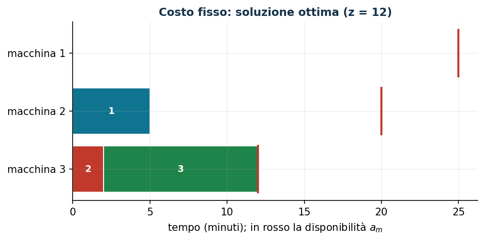

# Macchine con costo fisso di utilizzo

**Classe:** BIP · **Legami:** attivazione (aggregata) · **Script:** `python/fam07_2_costofisso.py`

[](https://colab.research.google.com/github/fabiofurini/modellazione-mip/blob/main/notebooks/fam07_2_costofisso.ipynb)

!!! abstract "Problema 7.2"
    Un'azienda deve eseguire $n \in \mathbb{Z}_{\ge 1}$ lavori e dispone di
    $k \in \mathbb{Z}_{\ge 1}$ macchine. Per ogni lavoro $j \in \{1, 2, \dots, n\}$ e
    ogni macchina $m \in \{1, 2, \dots, k\}$, il valore $t_{jm} \in \mathbb{Q}_{>0}$ è il
    tempo di lavorazione in minuti. Per ogni macchina $m$, il valore
    $a_m \in \mathbb{Q}_{>0}$ è la disponibilità in minuti e il valore
    $c_m \in \mathbb{Q}_{>0}$ è il costo in euro se la macchina viene usata. Ogni
    macchina esegue un lavoro alla volta. L'azienda vuole assegnare tutti i lavori
    minimizzando il costo delle macchine usate.

**Il problema a parole.** *Decidiamo* quali macchine accendere e su quale
macchina eseguire ciascun lavoro. *L'obiettivo*: costo delle macchine accese.
*I vincoli*: ogni lavoro su esattamente una macchina; una macchina spenta non
esegue lavori; una macchina accesa non supera la sua disponibilità. Rispetto al
[problema 7.1](scheduling-1.md) il costo non sta più sugli assegnamenti ma sulle
macchine: servono variabili di **attivazione**.

## Modello

**Dati (input del modello).**

| Simbolo | Tipo | Significato |
|---|---|---|
| $n$ | $\in \mathbb{Z}_{\ge 1}$ | numero di lavori, $j \in \{1, 2, \dots, n\}$ |
| $k$ | $\in \mathbb{Z}_{\ge 1}$ | numero di macchine, $m \in \{1, 2, \dots, k\}$ |
| $t_{jm}$ | $\in \mathbb{Q}_{>0}$ | tempo di lavorazione del lavoro $j$ sulla macchina $m$ |
| $a_m$ | $\in \mathbb{Q}_{>0}$ | disponibilità della macchina $m$ |
| $c_m$ | $\in \mathbb{Q}_{>0}$ | costo fisso se la macchina $m$ è usata |

**Variabili decisionali.** Introduciamo le seguenti $n\,k + k$ variabili binarie:

$$
\begin{cases}
x_{jm} = 1 \text{ se il lavoro } j \text{ è eseguito dalla macchina } m,\ 0 \text{ altrimenti},\\
y_m = 1 \text{ se la macchina } m \text{ è usata},\ 0 \text{ altrimenti},
\end{cases}
\qquad \forall j \in \{1, 2, \dots, n\},\ \forall m \in \{1, 2, \dots, k\}.
$$

$$
\begin{aligned}
\min ~~ \sum_{m=1}^{k} c_m\, y_m & & \\
\text{soggetto a} \quad \sum_{m=1}^{k} x_{jm} &= 1, & \forall j \in \{1, 2, \dots, n\}, \\
-\sum_{j=1}^{n} t_{jm}\, x_{jm} + a_m\, y_m &\ge 0, & \forall m \in \{1, 2, \dots, k\}, \\
x_{jm} &\in \{0, 1\}, & \forall j \in \{1, 2, \dots, n\},\ \forall m \in \{1, 2, \dots, k\}, \\
y_m &\in \{0, 1\}, & \forall m \in \{1, 2, \dots, k\}.
\end{aligned}
$$

Descrizione della funzione obiettivo e dei vincoli:

- la funzione obiettivo lineare minimizza il costo totale delle macchine usate;
- i vincoli di **assegnamento** assicurano che ogni lavoro sia assegnato a
  esattamente una macchina ($n$ vincoli lineari);
- i vincoli di **link** collegano le variabili di assegnamento con le variabili
  di utilizzo e impongono le restrizioni di capacità: se almeno un lavoro è
  assegnato a una macchina allora la macchina è usata, a una macchina non usata
  non è assegnato alcun lavoro e, se la macchina è usata, il tempo complessivo
  dei lavori non supera la disponibilità ($k$ vincoli lineari);
- i vincoli di dominio definiscono le variabili del modello.

!!! note "Legame fra le variabili"
    **Imposta dal vincolo.** Per ogni macchina $m$, se il tempo complessivo dei
    lavori assegnati è positivo, la macchina deve essere usata:

    $$\sum_{j=1}^{n} t_{jm} x_{jm} > 0 ~\Longrightarrow~ y_m = 1,
    \qquad\text{contronominale:}\qquad y_m = 0 ~\Longrightarrow~ \sum_{j=1}^{n} t_{jm} x_{jm} = 0.$$

    Il vincolo di link dà $\sum_j t_{jm} x_{jm} \le a_m y_m$: se il membro
    sinistro è positivo allora $a_m y_m > 0$, quindi $y_m > 0$ e, essendo binaria,
    $y_m = 1$. Viceversa, se $y_m = 0$ allora $\sum_j t_{jm} x_{jm} \le 0$ e, con
    $t_{jm} > 0$ e $x_{jm} \ge 0$, tutte le $x_{jm}$ sono nulle.

    **Imposta dall'ottimo.** Viceversa, se il tempo complessivo è nullo la
    macchina non è usata: $\sum_j t_{jm} x_{jm} = 0 \Longrightarrow y_m = 0$
    (contronominale: $y_m = 1 \Longrightarrow$ almeno un lavoro assegnato). *Non*
    è imposta dai vincoli ($y_m = 1$ senza lavori è ammissibile), ma segue
    dall'obiettivo in ogni ottimo: poiché $c_m > 0$, se $y_m = 1$ senza lavori,
    porre $y_m = 0$ mantiene i vincoli ($0 \ge 0$) e riduce il costo di $c_m$.

## Il modello in gurobipy

```python
m = gp.Model("costo_fisso");  m.Params.OutputFlag = 0
x = m.addVars(n, k, vtype=GRB.BINARY, name="x")
y = m.addVars(k, vtype=GRB.BINARY, name="y")
m.setObjective(gp.quicksum(c[mm] * y[mm] for mm in range(k)), GRB.MINIMIZE)
m.addConstrs((x.sum(j, "*") == 1 for j in range(n)), name="assegna")
m.addConstrs((-gp.quicksum(t[j][mm] * x[j, mm] for j in range(n))
              + a[mm] * y[mm] >= 0 for mm in range(k)), name="link")
m.optimize()
```

## L'istanza

$n = 3$ lavori, $k = 3$ macchine:

| $t_{jm}$ | $m=1$ | $m=2$ | $m=3$ |
|---|---:|---:|---:|
| $j=1$ | 6 | 5 | 3 |
| $j=2$ | 5 | 10 | 2 |
| $j=3$ | 20 | 13 | 10 |

| | $m=1$ | $m=2$ | $m=3$ |
|---|---:|---:|---:|
| $c_m$ | 8 | 7 | 5 |
| $a_m$ | 25 | 20 | 12 |

Il modello per l'istanza: obiettivo $\min\ 8y_1 + 7y_2 + 5y_3$; tre vincoli di
assegnamento; i tre vincoli di link
$-6x_{11} - 5x_{21} - 20x_{31} + 25y_1 \ge 0$,
$-5x_{12} - 10x_{22} - 13x_{32} + 20y_2 \ge 0$,
$-3x_{13} - 2x_{23} - 10x_{33} + 12y_3 \ge 0$.

## Euristica costruttiva: upper bound

Il criterio del best-fit diventa il **tempo minimo** (non ci sono costi di
assegnamento: conviene consumare poca disponibilità).

- **Passo 1.** Lavoro 1: $ra = (25, 20, 12)$; tempi $6, 5, 3$: minimo sulla
  macchina 3, $x[1][3] = 1$, $ra[3] = 9$.
- **Passo 2.** Lavoro 2: tempi $5, 10, 2$: minimo sulla macchina 3,
  $x[2][3] = 1$, $ra[3] = 7$.
- **Passo 3.** Lavoro 3: la macchina 3 non basta ($10 > 7$); fra $20$ e $13$ il
  minimo è la macchina 2, $x[3][2] = 1$, $ra[2] = 7$.

Macchine usate 2 e 3: $\bar y = (0, 1, 1)$, valore $12$, quindi
$z(\mathrm{MILP}) \le 12$. Next-fit, first-fit e le varianti «prima le
macchine già aperte» usano le macchine 1 e 2 (valore $15$).

## Rilassamento LP e duale: lower bound

Con $\mu_j$ libere (assegnamento) e $\pi_m \ge 0$ (link, verso $\ge$ in un
minimo):

$$
\begin{aligned}
\max ~~ \sum_{j=1}^{n} \mu_j & & \\
\text{soggetto a} \quad \mu_j - t_{jm}\, \pi_m &\le 0, & \forall j,\ \forall m, \\
a_m\, \pi_m &\le c_m, & \forall m \in \{1, 2, \dots, k\}, \\
\mu_j \gtreqless 0,\quad \pi_m &\ge 0. &
\end{aligned}
$$

**Una soluzione duale a mano.** $\bar\pi_m = c_m / a_m$ (il costo per minuto di
ogni macchina): $\tfrac{8}{25}, \tfrac{7}{20}, \tfrac{5}{12}$; poi
$\bar\mu_j = \min_m t_{jm}\bar\pi_m$:
$\bar\mu_1 = \min\{\tfrac{48}{25}, \tfrac{7}{4}, \tfrac{5}{4}\} = \tfrac{5}{4}$,
$\bar\mu_2 = \min\{\tfrac{8}{5}, \tfrac{7}{2}, \tfrac{5}{6}\} = \tfrac{5}{6}$,
$\bar\mu_3 = \min\{\tfrac{32}{5}, \tfrac{91}{20}, \tfrac{25}{6}\} = \tfrac{25}{6}$.
Valore $\tfrac{25}{4}$:

$$\tfrac{25}{4} ~\le~ z(\mathrm{MILP}) ~\le~ 12.$$

Un bound debole: il costo fisso si paga per intero appena la macchina si usa,
ma il rilassamento lo spalma sui minuti.

**Quello che dice il solver.** $z(\mathrm{LP}) = 25/4$: la soluzione a mano è
ottima per il duale. Con $y_m \le 1$ e $x_{jm} \le 1$ il rilassamento rafforzato
vale $z(\mathrm{LP}^+) = 1273/200 = 6{,}365$; con i link disaggregati
$x_{jm} \le y_m$ sale a $440/67 = 6{,}567$. Ottimo intero $12$: macchine 2 e 3
accese, $\tilde x_{12} = \tilde x_{23} = \tilde x_{33} = 1$.

| $\mathrm{ub}$ | $\mathrm{lb}$ (duale a mano) | $z(\mathrm{LP})$ | $z(\mathrm{LP}^+)$ | $z(\mathrm{MILP})$ | gap euristica |
|---:|---:|---:|---:|---:|---:|
| 12 | $25/4$ | $25/4$ | $1273/200$ | 12 | $0{,}0\%$ |



## Considerazioni aggiuntive

- $y_m \le 1$ e $x_{jm} \le 1$ sono valide; le prime rafforzano il rilassamento
  ($6{,}25 \to 6{,}365$).
- «Se almeno un lavoro è assegnato a $m$ allora $m$ è usata» è
  $(x_{1m} \,\mathtt{OR}\, \dots \,\mathtt{OR}\, x_{nm}) \Rightarrow y_m$; De Morgan
  e distributività danno la CNF $(\mathtt{NOT}\,x_{1m} \,\mathtt{OR}\, y_m) \,\mathtt{AND}\, \dots$,
  cioè i vincoli **disaggregati** $x_{jm} \le y_m$: implicati dal modello, ma non
  dal rilassamento — aggiunti, portano $z(\mathrm{LP}^+)$ a $440/67$. Stesso
  insieme intero, rilassamento più stretto.
- Il verso opposto, $\sum_j x_{jm} \ge y_m$, non è valido ma si può aggiungere
  senza perdere l'ottimo.

## Domande di modellazione aggiuntive

??? question "7.2.1 — Utilizzo minimo di una macchina accesa"
    Ogni macchina usata deve lavorare almeno $\ell = 8$ minuti. Modellare e
    trovare il nuovo ottimo.

    ??? success "Soluzione"
        Il legame di attivazione letto nel verso opposto:

        $$\sum_{j=1}^{n} t_{jm}\, x_{jm} \ge \ell\, y_m, \qquad \forall m$$

        ($k$ vincoli). Se $y_m = 0$ il vincolo è sempre vero. Insieme al link
        si ottiene $\ell y_m \le \sum_j t_{jm} x_{jm} \le a_m y_m$: il carico è
        zero oppure sta in $[\ell, a_m]$, una **variabile semicontinua**.
        Sull'istanza l'ottimo resta $12$ (le macchine usate lavorano $13$ e
        $10$ minuti).

??? question "7.2.2 — Legame fra due attivazioni"
    Se si usa la macchina 1 si deve usare anche la 3. Scrivere il vincolo e
    discutere che cosa impone e che cosa non impone.

    ??? success "Soluzione"
        $y_1 \Rightarrow y_3$, cioè $\mathtt{NOT}\,y_1 \,\mathtt{OR}\, y_3$, già in CNF:

        $$y_1 \le y_3.$$

        Impone $y_1 = 1 \Rightarrow y_3 = 1$ e $y_3 = 0 \Rightarrow y_1 = 0$;
        non impone il viceversa ($y_3 = 1$, $y_1 = 0$ è ammissibile). L'ottimo
        resta $12$: la soluzione ottima non usa la macchina 1.

## Codice

Script completo: [`python/fam07_2_costofisso.py`](https://github.com/fabiofurini/modellazione-mip/blob/main/python/fam07_2_costofisso.py);
notebook: [`notebooks/fam07_2_costofisso.ipynb`](https://github.com/fabiofurini/modellazione-mip/blob/main/notebooks/fam07_2_costofisso.ipynb).
