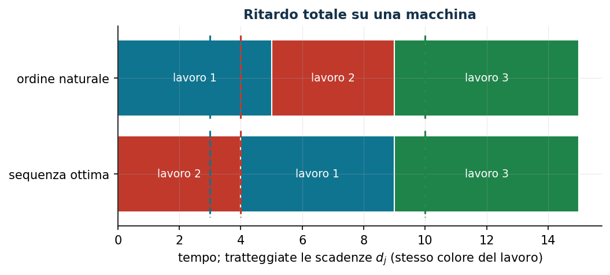

# Ritardo totale su una macchina: sequenziamento con big-M

**Classe:** MILP · **Legami:** big-M e disgiunzioni, variabile di massimo · **Script:** `python/fam07_scheduling.py`

[](https://colab.research.google.com/github/fabiofurini/modellazione-mip/blob/main/notebooks/fam07_scheduling.ipynb)

!!! abstract "Problema 7.7"
    Un'azienda deve eseguire $n$ lavori su una sola macchina. Per ogni lavoro
    $j$, $t_j$ è il tempo di lavorazione e $d_j$ la scadenza. Il ritardo è
    $\tau_j = \max\{0, \kappa_j - d_j\}$, dove $\kappa_j$ è l'istante di
    completamento. La macchina esegue un lavoro alla volta. Minimizzare il
    ritardo totale.

**Il problema a parole.** *Decidiamo* l'ordine dei lavori. *L'obiettivo*:
somma dei ritardi. *I vincoli*: per ogni coppia, uno precede l'altro; chi viene
dopo finisce almeno $t$ minuti dopo il completamento di chi viene prima. Una
**disgiunzione** («o $j$ prima di $i$ o $i$ prima di $j$»): si linearizza con
una binaria e un big-M.

## Modello

**Variabili.** $n(n-1)$ binarie di precedenza $s_{ji}$ ($j$ precede $i$) e
$2n$ continue: completamenti $\kappa_j$ e ritardi $\tau_j$; $M = \sum_j t_j$.

$$
\begin{aligned}
\min ~~ \sum_{j=1}^{n} \tau_j & & \\
\text{soggetto a} \quad s_{ji} + s_{ij} &= 1, & \forall j < i, \\
-M\, s_{ji} - \kappa_j + \kappa_i &\ge t_i - M, & \forall j \ne i, \\
-\kappa_j + \tau_j &\ge -d_j, & \forall j, \\
\kappa_j &\ge t_j, & \forall j, \\
s_{ji} \in \{0, 1\},\quad \kappa_j \ge 0,\quad \tau_j &\ge 0. &
\end{aligned}
$$

- l'obiettivo minimizza il ritardo totale;
- i vincoli di **ordine**: o $j$ precede $i$ o viceversa ($n(n-1)/2$);
- i vincoli di **precedenza** con il big-M: se $j$ precede $i$, $i$ finisce
  almeno $t_i$ dopo $\kappa_j$ ($n(n-1)$); $M = \sum_j t_j$ basta perché
  esiste una sequenza ottima senza tempi morti;
- i vincoli di **ritardo**, con $\tau_j \ge 0$, definiscono il ritardo ($n$);
- i vincoli di **inizio**: $\kappa_j \ge t_j$ ($n$);
- i vincoli di dominio.

!!! note "Legame fra le variabili"
    **Precedenza (big-M).** $s_{ji} = 1 \Rightarrow \kappa_i \ge \kappa_j + t_i$,
    contronominale $\kappa_i < \kappa_j + t_i \Rightarrow s_{ji} = 0$. Il
    vincolo $\kappa_i \ge \kappa_j + t_i - M(1 - s_{ji})$: con $s_{ji} = 1$
    impone la precedenza; con $s_{ji} = 0$ diventa
    $\kappa_i \ge \kappa_j + t_i - M$, sempre vero perché il membro destro è
    $\le t_i \le \kappa_i$ quando i completamenti stanno entro $M$. Il big-M
    «spegne» il vincolo.

    **Ritardo (massimo).** $\tau_j \ge \max\{0, \kappa_j - d_j\}$ è imposto
    direttamente dai due vincoli (nessuna implicazione: il legame *è* la
    disuguaglianza). L'implicazione di ottimalità
    $\kappa_j \le d_j \Rightarrow \tau_j = 0$ segue dall'obiettivo: abbassare
    $\tau_j$ a $0$ resta ammissibile e riduce l'obiettivo. Sintesi: in ogni
    ottimo $\tau_j = \max\{0, \kappa_j - d_j\}$.

## Il modello in gurobipy

```python
M = sum(t)
m = gp.Model("ritardo");  m.Params.OutputFlag = 0
s = m.addVars([(j, i) for j in range(n) for i in range(n) if j != i],
              vtype=GRB.BINARY, name="s")
kappa = m.addVars(n, name="kappa");  tau = m.addVars(n, name="tau")
m.setObjective(tau.sum(), GRB.MINIMIZE)
m.addConstrs((s[j, i] + s[i, j] == 1 for j in range(n) for i in range(j + 1, n)),
             name="ordine")
m.addConstrs((-M * s[j, i] - kappa[j] + kappa[i] >= t[i] - M
              for j in range(n) for i in range(n) if j != i), name="precedenza")
m.addConstrs((-kappa[j] + tau[j] >= -d[j] for j in range(n)), name="ritardo")
m.addConstrs((kappa[j] >= t[j] for j in range(n)), name="inizio")
m.optimize()
```

## L'istanza

$n = 3$, $M = 15$.

| | $j=1$ | $j=2$ | $j=3$ |
|---|---:|---:|---:|
| $t_j$ | 5 | 4 | 6 |
| $d_j$ | 3 | 4 | 10 |

## Euristica costruttiva: upper bound

Ordine dato $1 \to 2 \to 3$:

- **Passo 1.** $\kappa_1 = 5$, $\tau_1 = \max\{0, 5 - 3\} = 2$.
- **Passo 2.** $\kappa_2 = 9$, $\tau_2 = 5$.
- **Passo 3.** $\kappa_3 = 15$, $\tau_3 = 5$.

Valore $12$: $z(\mathrm{MILP}) \le 12$.

## Rilassamento LP e duale: lower bound

Con $\alpha_{ji}$ libere (ordine), $\beta_{ji} \ge 0$ (precedenza),
$\gamma_j \ge 0$ (ritardo), $\delta_j \ge 0$ (inizio):

$$
\begin{aligned}
\max ~~ \sum_{j<i} \alpha_{ji} + \sum_{j \ne i} (t_i - M)\, \beta_{ji} - \sum_j d_j\, \gamma_j + \sum_j t_j\, \delta_j & & \\
\text{soggetto a} \quad \alpha_{ji} - M\, \beta_{ji} \le 0,\quad \alpha_{ji} - M\, \beta_{ij} &\le 0, & \forall j < i, \\
-\sum_{i \ne j} \beta_{ji} + \sum_{i \ne j} \beta_{ij} - \gamma_j + \delta_j &\le 0, & \forall j, \\
\gamma_j &\le 1, & \forall j.
\end{aligned}
$$

**Una soluzione duale a mano.** I $\beta$ hanno coefficiente negativo: a zero,
e allora $\alpha = 0$; restano $\delta_j \le \gamma_j \le 1$ e ogni lavoro
contribuisce al più $t_j - d_j$, positivo solo se in ritardo anche eseguito per
primo: solo il lavoro 1. $\bar\gamma_1 = \bar\delta_1 = 1$, valore $-3 + 5 = 2$:
$2 \le z(\mathrm{MILP}) \le 12$.

**Quello che dice il solver.** $z(\mathrm{LP}) = 2$: il rilassamento di un
modello big-M è debolissimo ($s_{ji} = 1/2$ rilascia le precedenze). Ottimo
intero $11$, sequenza $2 \to 1 \to 3$: $\tilde\kappa = (9, 4, 15)$,
$\tilde\tau = (6, 0, 5)$.

| $\mathrm{ub}$ | $\mathrm{lb}$ (duale a mano) | $z(\mathrm{LP})$ | $z(\mathrm{MILP})$ | gap euristica |
|---:|---:|---:|---:|---:|
| 12 | 2 | 2 | 11 | $9{,}1\%$ |



## Considerazioni aggiuntive

- **Transitività**: $s_{ji} \,\mathtt{AND}\, s_{ik} \Rightarrow s_{jk}$, cioè
  $s_{ji} + s_{ik} - s_{jk} \le 1$: disuguaglianze valide (un ciclo di
  precedenze è impossibile) che tagliano le soluzioni a $1/2$ del rilassamento.
- $M = \sum_j t_j$ è il più piccolo valore che funziona in generale; $M$ più
  grandi lasciano lo stesso insieme intero e un rilassamento più debole.

## Domande di modellazione aggiuntive

??? question "7.7.1 — Date di rilascio"
    Il lavoro 2 non può iniziare prima dell'istante $\rho_2 = 2$.

    ??? success "Soluzione"
        $\kappa_j \ge \rho_j + t_j$ per ogni $j$; il big-M va aggiornato a
        $\max_j \rho_j + \sum_j t_j$ perché la macchina può restare ferma.
        Ottimo $12$: l'ordine $1 \to 2 \to 3$ torna ottimo.

??? question "7.7.2 — Minimizzare il ritardo massimo"
    Minimizzare il ritardo del lavoro più in ritardo.

    ??? success "Soluzione"
        $T \ge \tau_j$ per ogni $j$ e $\min\ T$ (min-max). Le $\tau_j$ escono
        dall'obiettivo: «$\tau_j = \max\{0, \kappa_j - d_j\}$ in ogni ottimo»
        cade, resta vero che esiste un ottimo con le $\tau_j$ al minimo. Ritardo
        massimo ottimo $5$.

## Codice

Script completo: [`python/fam07_scheduling.py`](https://github.com/fabiofurini/modellazione-mip/blob/main/python/fam07_scheduling.py);
notebook: [`notebooks/fam07_scheduling.ipynb`](https://github.com/fabiofurini/modellazione-mip/blob/main/notebooks/fam07_scheduling.ipynb).
