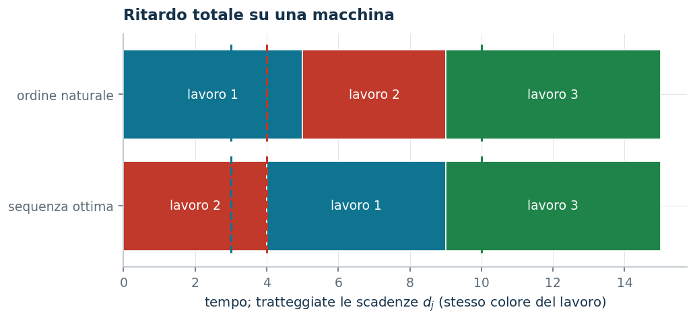

# Ritardo totale su una macchina: sequenziamento con big-M

**Classe:** MILP · **Legami:** big-M e disgiunzioni, variabile di massimo · **Script:** `python/fam07_7_ritardo.py`

[](https://colab.research.google.com/github/fabiofurini/modellazione-mip/blob/main/notebooks/fam07_7_ritardo.ipynb)

!!! abstract "Problema 7.7"
    Un'azienda deve eseguire $n$ lavori su una sola macchina. Per ogni lavoro
    $j$, $t_j$ è il tempo di lavorazione e $d_j$ la scadenza. Il ritardo è
    $\tau_j = \max\{0, \kappa_j - d_j\}$, dove $\kappa_j$ è l'istante di
    completamento. La macchina esegue un lavoro alla volta. Minimizzare il
    ritardo totale.

**Il problema a parole.** *Decidiamo* l'ordine dei lavori. *L'obiettivo*:
somma dei ritardi. *I vincoli*: per ogni coppia, uno precede l'altro; chi viene
dopo finisce almeno $t$ minuti dopo il completamento di chi viene prima. Una
**disgiunzione** («o $j$ prima di $i$ o $i$ prima di $j$»): si linearizza con
una binaria e un big-M.

## Modello

**Variabili.** $n(n-1)$ binarie di precedenza $s_{ji}$ ($j$ precede $i$) e
$2n$ continue: completamenti $\kappa_j$ e ritardi $\tau_j$; $M = \sum_j t_j$.

$$
\begin{aligned}
\min ~~ \sum_{j=1}^{n} \tau_j & & \\
\text{soggetto a} \quad s_{ji} + s_{ij} &= 1, & \forall j < i, \\
-M\, s_{ji} - \kappa_j + \kappa_i &\ge t_i - M, & \forall j \ne i, \\
-\kappa_j + \tau_j &\ge -d_j, & \forall j, \\
\kappa_j &\ge t_j, & \forall j, \\
s_{ji} \in \{0, 1\},\quad \kappa_j \ge 0,\quad \tau_j &\ge 0. &
\end{aligned}
$$

- l'obiettivo minimizza il ritardo totale;
- i vincoli di **ordine**: o $j$ precede $i$ o viceversa ($n(n-1)/2$);
- i vincoli di **precedenza** con il big-M: se $j$ precede $i$, $i$ finisce
  almeno $t_i$ dopo $\kappa_j$ ($n(n-1)$); $M = \sum_j t_j$ basta perché
  esiste una sequenza ottima senza tempi morti;
- i vincoli di **ritardo**, con $\tau_j \ge 0$, definiscono il ritardo ($n$);
- i vincoli di **inizio**: $\kappa_j \ge t_j$ ($n$);
- i vincoli di dominio.

!!! note "Legame fra le variabili"
    **Precedenza (big-M).** $s_{ji} = 1 \Rightarrow \kappa_i \ge \kappa_j + t_i$,
    contronominale $\kappa_i < \kappa_j + t_i \Rightarrow s_{ji} = 0$. Il
    vincolo $\kappa_i \ge \kappa_j + t_i - M(1 - s_{ji})$: con $s_{ji} = 1$
    impone la precedenza; con $s_{ji} = 0$ diventa
    $\kappa_i \ge \kappa_j + t_i - M$, sempre vero perché il membro destro è
    $\le t_i \le \kappa_i$ quando i completamenti stanno entro $M$. Il big-M
    «spegne» il vincolo.

    **Ritardo (massimo).** $\tau_j \ge \max\{0, \kappa_j - d_j\}$ è imposto
    direttamente dai due vincoli (nessuna implicazione: il legame *è* la
    disuguaglianza). L'implicazione di ottimalità
    $\kappa_j \le d_j \Rightarrow \tau_j = 0$ segue dall'obiettivo: abbassare
    $\tau_j$ a $0$ resta ammissibile e riduce l'obiettivo. Sintesi: in ogni
    ottimo $\tau_j = \max\{0, \kappa_j - d_j\}$.

## Il modello in gurobipy

```python
M = sum(t)
m = gp.Model("ritardo");  m.Params.OutputFlag = 0
s = m.addVars([(j, i) for j in range(n) for i in range(n) if j != i],
              vtype=GRB.BINARY, name="s")
kappa = m.addVars(n, name="kappa");  tau = m.addVars(n, name="tau")
m.setObjective(tau.sum(), GRB.MINIMIZE)
m.addConstrs((s[j, i] + s[i, j] == 1 for j in range(n) for i in range(j + 1, n)),
             name="ordine")
m.addConstrs((-M * s[j, i] - kappa[j] + kappa[i] >= t[i] - M
              for j in range(n) for i in range(n) if j != i), name="precedenza")
m.addConstrs((-kappa[j] + tau[j] >= -d[j] for j in range(n)), name="ritardo")
m.addConstrs((kappa[j] >= t[j] for j in range(n)), name="inizio")
m.optimize()
```

## L'istanza

$n = 3$, $M = 15$.

| | $j=1$ | $j=2$ | $j=3$ |
|---|---:|---:|---:|
| $t_j$ | 5 | 4 | 6 |
| $d_j$ | 3 | 4 | 10 |

## Euristica costruttiva: il bound primale

Ordine dato $1 \to 2 \to 3$:

- **Passo 1.** $\kappa_1 = 5$, $\tau_1 = \max\{0, 5 - 3\} = 2$.
- **Passo 2.** $\kappa_2 = 9$, $\tau_2 = 5$.
- **Passo 3.** $\kappa_3 = 15$, $\tau_3 = 5$.

Valore $12$: $z(\mathit{MILP}) \le 12$.

## Rilassamento LP e duale: il bound duale

Con $\alpha_{ji}$ libere (ordine), $\beta_{ji} \ge 0$ (precedenza),
$\gamma_j \ge 0$ (ritardo), $\delta_j \ge 0$ (inizio):

$$
\begin{aligned}
\max ~~ \sum_{j<i} \alpha_{ji} + \sum_{j \ne i} (t_i - M)\, \beta_{ji} - \sum_j d_j\, \gamma_j + \sum_j t_j\, \delta_j & & \\
\text{soggetto a} \quad \alpha_{ji} - M\, \beta_{ji} \le 0,\quad \alpha_{ji} - M\, \beta_{ij} &\le 0, & \forall j < i, \\
-\sum_{i \ne j} \beta_{ji} + \sum_{i \ne j} \beta_{ij} - \gamma_j + \delta_j &\le 0, & \forall j, \\
\gamma_j &\le 1, & \forall j.
\end{aligned}
$$

**Una soluzione duale a mano.** I $\beta$ hanno coefficiente negativo: a zero,
e allora $\alpha = 0$; restano $\delta_j \le \gamma_j \le 1$ e ogni lavoro
contribuisce al più $t_j - d_j$, positivo solo se in ritardo anche eseguito per
primo: solo il lavoro 1. $\bar\gamma_1 = \bar\delta_1 = 1$, valore $-3 + 5 = 2$:
$2 \le z(\mathit{MILP}) \le 12$.

**Quello che dice il solver.** $z(\mathit{LP}) = 2$: il rilassamento di un
modello big-M è debolissimo ($s_{ji} = 1/2$ rilascia le precedenze). Ottimo
intero $11$, sequenza $2 \to 1 \to 3$: $\tilde\kappa = (9, 4, 15)$,
$\tilde\tau = (6, 0, 5)$.

| $UB$ | $LB$ (duale a mano) | $z(\mathit{LP})$ | $z(\mathit{MILP})$ | gap euristica |
|---:|---:|---:|---:|---:|
| 12 | 2 | 2 | 11 | $9{,}1\%$ |



## Considerazioni aggiuntive

- **Transitività**: $s_{ji} \,\mathtt{AND}\, s_{ik} \Rightarrow s_{jk}$, cioè
  $s_{ji} + s_{ik} - s_{jk} \le 1$: disuguaglianze valide (un ciclo di
  precedenze è impossibile) che tagliano le soluzioni a $1/2$ del rilassamento.
- $M = \sum_j t_j$ è il più piccolo valore che funziona in generale; $M$ più
  grandi lasciano lo stesso insieme intero e un rilassamento più debole.

## Domande di modellazione aggiuntive

??? question "7.7.1 — Date di rilascio"
    Il lavoro 2 non può iniziare prima dell'istante $\rho_2 = 2$.

    !!! tip "Soluzione"
        Le soluzioni delle domande aggiuntive sono riservate ai docenti. Qui
        sotto, però, una variante di questo problema è svolta per intero:
        modello, euristica ammissibile, certificato duale e tabella dei bound.
??? question "7.7.2 — Minimizzare il ritardo massimo"
    Minimizzare il ritardo del lavoro più in ritardo.

    !!! tip "Soluzione"
        Le soluzioni delle domande aggiuntive sono riservate ai docenti. Qui
        sotto, però, una variante di questo problema è svolta per intero:
        modello, euristica ammissibile, certificato duale e tabella dei bound.
## Il sandwich sulla variante 7a

Le date di rilascio aggiungono $\varepsilon_j \ge 0$ con termine noto
$\rho_j + t_j$. Posto $\gamma_j = 1$, la colonna di $\kappa_j$ impone
$\delta_j + \varepsilon_j \le 1$: conviene mettere tutto il peso su
$\varepsilon_j$, cioè il rilascio sostituisce il tempo di lavorazione.

<!-- tabella-variante: fam07_7a_bound -->

|  | valore | che cos'è |
|---|---:|---|
| $\mathit{UB}$ | $12$ | soluzione euristica |
| $\mathit{LB}$ | $2$ | certificato duale costruito a mano |
| $z(\mathit{LP})$ | $4$ | rilassamento senza i bound |
| $z(\mathit{LP}^+)$ | $4$ | rilassamento con i bound |
| $z(\mathit{MILP})$ | $12$ | ottimo del MILP |

<!-- tabella-variante: fine -->

## Codice

Script completo: [`python/fam07_7_ritardo.py`](https://github.com/fabiofurini/modellazione-mip/blob/main/python/fam07_7_ritardo.py);
notebook: [`notebooks/fam07_7_ritardo.ipynb`](https://github.com/fabiofurini/modellazione-mip/blob/main/notebooks/fam07_7_ritardo.ipynb).

<!-- script-incorporato: inizio (rigenerato da python/incorpora_codice.py) -->

??? example "Mostra lo script completo — `python/fam07_7_ritardo.py` (231 righe)"

    ```python
    """Problema 7.7 -- Ritardo totale su una macchina: sequenziamento con big-M.

    La disgiunzione "o j prima di i o i prima di j" linearizzata con una binaria
    e il big-M piu' piccolo giustificabile dai dati (M = somma dei tempi).
    """
    import gurobipy as gp
    import numpy as np
    import pandas as pd
    from gurobipy import GRB

    from euristiche import best_fit, first_fit, matrice, next_fit
    from mip import (ammissibile, due_rilassamenti, frazione, nuovo_modello,
                     registra_bound, risolvi, stampa_soluzione, valuta)
    from stile import CICLO, ROSSO, intestazione, plt, salva_dati, salva_figura
    from esteso import salva_modello

    R = range

    # ---------- 1. MODELLO E ISTANZA ----------
    t7 = [5, 4, 6]
    d7 = [3, 4, 10]
    salva_dati(pd.DataFrame({"lavoro": R(1, 4), "t": t7, "d": d7}), "fam07_7_lavori")


    def modello_7(t, d):
        n = len(t)
        M = sum(t)
        m = nuovo_modello("ritardo")
        s = m.addVars([(j, i) for j in R(n) for i in R(n) if j != i], vtype=GRB.BINARY, name="s")
        kappa = m.addVars(n, name="kappa")
        tau = m.addVars(n, name="tau")
        m.setObjective(tau.sum(), GRB.MINIMIZE)
        m.addConstrs((s[j, i] + s[i, j] == 1 for j in R(n) for i in R(j + 1, n)), name="ordine")
        m.addConstrs((-M * s[j, i] - kappa[j] + kappa[i] >= t[i] - M for j in R(n) for i in R(n) if j != i),
                     name="precedenza")
        m.addConstrs((-kappa[j] + tau[j] >= -d[j] for j in R(n)), name="ritardo")
        m.addConstrs((kappa[j] >= t[j] for j in R(n)), name="inizio")
        return m, s, kappa, tau, M


    def duale_7(t, d):
        """Duale con alpha (libere), beta, gamma, delta >= 0 — si veda la dispensa."""
        n = len(t)
        M = sum(t)
        D = nuovo_modello("duale_ritardo")
        alpha = D.addVars([(j, i) for j in R(n) for i in R(j + 1, n)], lb=-GRB.INFINITY, name="alpha")
        beta = D.addVars([(j, i) for j in R(n) for i in R(n) if j != i], name="beta")
        gamma = D.addVars(n, name="gamma")
        delta = D.addVars(n, name="delta")
        D.setObjective(alpha.sum() + gp.quicksum((t[i] - M) * beta[j, i] for (j, i) in beta)
                       - gp.quicksum(d[j] * gamma[j] for j in R(n)) + gp.quicksum(t[j] * delta[j] for j in R(n)),
                       GRB.MAXIMIZE)
        D.addConstrs((alpha[j, i] - M * beta[j, i] <= 0 for (j, i) in alpha), name="rc_s_ji")
        D.addConstrs((alpha[j, i] - M * beta[i, j] <= 0 for (j, i) in alpha), name="rc_s_ij")
        D.addConstrs((-gp.quicksum(beta[j, i] for i in R(n) if i != j) + gp.quicksum(beta[i, j] for i in R(n) if i != j)
                      - gamma[j] + delta[j] <= 0 for j in R(n)), name="rc_kappa")
        D.addConstrs((gamma[j] <= 1 for j in R(n)), name="rc_tau")
        return D


    def euristica_7(t, d, ordine=None):
        """Sequenza nell'ordine dato (naturale se assente): completamenti e ritardi."""
        n = len(t)
        ordine = list(R(n)) if ordine is None else ordine
        kappa, tau, fine, passi = [0] * n, [0] * n, 0, []
        for j in ordine:
            fine += t[j]
            kappa[j] = fine
            tau[j] = max(0, fine - d[j])
            passi.append(f"Lavoro {j + 1}: kappa = {fine}, tau = max(0, {fine} - {d[j]}) = {tau[j]}.")
        return kappa, tau, passi


    m7, s7, k7, tau7, M7 = modello_7(t7, d7)
    salva_modello(m7, "fam07_7_primale")

    # ---------- 2. EURISTICA COSTRUTTIVA (UPPER BOUND) ----------
    print(f"Big-M = somma dei tempi = {M7}")
    kappa_e, tau_e, passi = euristica_7(t7, d7)
    print("Euristica: ordine naturale 1 -> 2 -> 3")
    for i, s in enumerate(passi, 1):
        print(f"  Passo {i}. {s}")
    ub7 = sum(tau_e)
    print(f"  ub = {ub7}")

    # ---------- 3. RILASSAMENTO LP E DUALE (LOWER BOUND) ----------
    D7 = duale_7(t7, d7)
    salva_modello(D7, "fam07_7_duale")
    lb7, viol = valuta(D7, {"gamma[0]": 1, "delta[0]": 1})
    assert viol <= 1e-9
    print(f"Soluzione duale a mano: gamma_1 = 1, delta_1 = 1, il resto 0  ->  lb = {frazione(lb7)}")
    zlp7, zlp7r, _ = due_rilassamenti(m7, D7)

    # ---------- 4. SOLUZIONE OTTIMA DEL MILP ----------
    z7 = risolvi(m7)
    print("Soluzione ottima del MILP:")
    stampa_soluzione(m7, solo_non_nulle=True)
    riga = registra_bound("7 ritardo", ub7, lb7, zlp7, zlp7r, z7)
    salva_dati(pd.DataFrame([riga]), "fam07_7_bound")
    ordine_ott = sorted(R(3), key=lambda j: k7[j].X)
    print("Sequenza ottima:", " -> ".join(str(j + 1) for j in ordine_ott))
    riga = registra_bound("7 ritardo", ub7, lb7, zlp7, zlp7r, z7)
    salva_dati(pd.DataFrame([riga]), "fam07_7_bound")

    # ---------- 5. DOMANDE DI MODELLAZIONE AGGIUNTIVE ----------


    varianti = {}


    def variante(nome, m):
        z = risolvi(m)
        print(f"  {nome:70s} z = {frazione(z)}")
        return z

    # 7a: date di rilascio
    rho7 = [0, 2, 0]
    m, s, kappa, tau, M = modello_7(t7, d7)
    m.addConstrs((kappa[j] >= rho7[j] + t7[j] for j in R(3)), name="rilascio")
    varianti["7a"] = variante("7a. Il lavoro 2 disponibile dal tempo 2 (kappa_j >= rho_j + t_j)", m)
    # 7b: minimizzare il ritardo massimo
    m, s, kappa, tau, M = modello_7(t7, d7)
    T = m.addVar(name="T")
    m.addConstrs((T >= tau[j] for j in R(3)), name="ritardo_max")
    m.setObjective(T, GRB.MINIMIZE)
    varianti["7b"] = variante("7b. Minimizzare il ritardo massimo (min-max: T >= tau_j)", m)
    salva_dati(pd.DataFrame({"variante": list(varianti), "z": list(varianti.values())}), "fam07_7_varianti")

    # ---------- 5bis. IL SANDWICH SULLA VARIANTE 7a ----------
    intestazione("7a. Il sandwich sulla variante: date di rilascio")


    def modello_7a(t, d, rho):
        mm_, ss, kk, tt, MM = modello_7(t, d)
        mm_.addConstrs((kk[j] >= rho[j] + t[j] for j in R(len(t))), name="rilascio")
        return mm_, ss, kk, tt, MM


    def duale_7a(t, d, rho):
        """Al duale di 7.7 si aggiunge eps_j >= 0 per ogni vincolo di rilascio
        kappa_j >= rho_j + t_j: entra nell'obiettivo con il suo termine noto e
        nella colonna di kappa_j accanto a delta_j."""
        nn = len(t)
        MM = sum(t)
        D = nuovo_modello("duale_ritardo_7a")
        alpha = D.addVars([(j, i) for j in R(nn) for i in R(j + 1, nn)], lb=-GRB.INFINITY, name="alpha")
        beta = D.addVars([(j, i) for j in R(nn) for i in R(nn) if j != i], name="beta")
        gamma = D.addVars(nn, name="gamma")
        delta = D.addVars(nn, name="delta")
        eps = D.addVars(nn, name="eps")
        D.setObjective(alpha.sum() + gp.quicksum((t[i] - MM) * beta[j, i] for (j, i) in beta)
                       - gp.quicksum(d[j] * gamma[j] for j in R(nn))
                       + gp.quicksum(t[j] * delta[j] for j in R(nn))
                       + gp.quicksum((rho[j] + t[j]) * eps[j] for j in R(nn)), GRB.MAXIMIZE)
        D.addConstrs((alpha[j, i] - MM * beta[j, i] <= 0 for (j, i) in alpha), name="rc_s_ji")
        D.addConstrs((alpha[j, i] - MM * beta[i, j] <= 0 for (j, i) in alpha), name="rc_s_ij")
        D.addConstrs((-gp.quicksum(beta[j, i] for i in R(nn) if i != j)
                      + gp.quicksum(beta[i, j] for i in R(nn) if i != j)
                      - gamma[j] + delta[j] + eps[j] <= 0 for j in R(nn)), name="rc_kappa")
        D.addConstrs((gamma[j] <= 1 for j in R(nn)), name="rc_tau")
        return D


    m7a, s7a, k7a, tau7a, M7a = modello_7a(t7, d7, rho7)
    salva_modello(m7a, "fam07_7a_primale")

    # -- euristica ammissibile: la stessa regola, con le date di rilascio --
    print("Euristica costruttiva: i lavori in ordine di scadenza (EDD), ciascuno avviato appena")
    print("la macchina e' libera e il lavoro e' stato rilasciato.")
    istante = 0
    ritardi = {}
    for j in sorted(R(3), key=lambda j: d7[j]):
        inizio = max(istante, rho7[j])
        fine = inizio + t7[j]
        ritardi[j] = max(0, fine - d7[j])
        print(f"  lavoro {j + 1}: rilasciato a {rho7[j]}, parte a {inizio}, finisce a {fine}, "
              f"scadenza {d7[j]}  ->  ritardo {ritardi[j]}")
        istante = fine
    ub7a = sum(ritardi.values())
    ordine = sorted(R(3), key=lambda j: d7[j])
    fine_cum, kappa_e7a = 0, {}
    for j in ordine:
        fine_cum = max(fine_cum, rho7[j]) + t7[j]
        kappa_e7a[j] = fine_cum
    sol_7a = ({f"kappa[{j}]": kappa_e7a[j] for j in R(3)}
              | {f"tau[{j}]": ritardi[j] for j in R(3)}
              | {f"s[{j},{i}]": (1 if ordine.index(j) < ordine.index(i) else 0)
                 for j in R(3) for i in R(3) if j != i})
    assert ammissibile(m7a, sol_7a), "la soluzione euristica della variante deve essere ammissibile"
    print(f"  ub = {frazione(ub7a)}")

    # -- certificato duale: il rilascio sostituisce il tempo di lavorazione --
    D7a = duale_7a(t7, d7, rho7)
    salva_modello(D7a, "fam07_7a_duale")
    # un lavoro per volta: gamma_j = 1 e tutto il peso su eps_j, che vale rho_j + t_j
    # invece di t_j; si tiene il lavoro che da' il valore piu' alto
    candidato = max(R(3), key=lambda j: rho7[j] + t7[j] - d7[j])
    mano_7a = {f"gamma[{candidato}]": 1, f"eps[{candidato}]": 1}
    lb7a, viol_7a = valuta(D7a, mano_7a)
    assert viol_7a <= 1e-9, viol_7a
    print("Soluzione duale a mano: si valuta un lavoro solo. Posto gamma_j = 1, il vincolo")
    print("  della colonna di kappa_j da' delta_j + eps_j <= 1, e conviene mettere tutto il")
    print("  peso su eps_j, che nell'obiettivo vale rho_j + t_j invece di t_j. Si sceglie il")
    print(f"  lavoro con rho_j + t_j - d_j piu' grande: il {candidato + 1}, che da'")
    print(f"  {rho7[candidato]} + {t7[candidato]} - {d7[candidato]} = {frazione(lb7a)}.")
    zlp7a, zlp7ar, _ = due_rilassamenti(m7a, D7a)
    z7a = risolvi(m7a)
    riga_7a = registra_bound("7a date di rilascio", ub7a, lb7a, zlp7a, zlp7ar, z7a)
    salva_dati(pd.DataFrame([riga_7a]), "fam07_7a_bound")
    assert lb7a <= zlp7a <= z7a <= ub7a + 1e-9


    # ---------- 6. FIGURE ----------
    # ritardo: Gantt della sequenza naturale e di quella ottima
    fig, ax = plt.subplots(figsize=(7.2, 3.0))
    for riga, (etichetta, ordine) in enumerate([("ordine naturale (ub = 12)", list(R(3))),
                                                 (f"sequenza ottima (z = {frazione(z7)})", ordine_ott)]):
        fine = 0
        for j in ordine:
            ax.barh(riga, t7[j], left=fine, color=CICLO[j], edgecolor="white")
            ax.text(fine + t7[j] / 2, riga, f"lavoro {j + 1}", ha="center", va="center", color="white", fontsize=9)
            fine += t7[j]
            ax.plot([d7[j], d7[j]], [riga - 0.45, riga + 0.45], color=CICLO[j], lw=1.5, ls="--")
    ax.set_yticks([0, 1])
    ax.set_yticklabels(["ordine naturale", "sequenza ottima"])
    ax.set_xlabel("tempo; tratteggiate le scadenze $d_j$ (stesso colore del lavoro)")
    ax.set_title("Ritardo totale su una macchina")
    ax.invert_yaxis()
    salva_figura(fig, "cap07_ritardo_gantt")

    print("Fine.")
    ```

<!-- script-incorporato: fine -->
