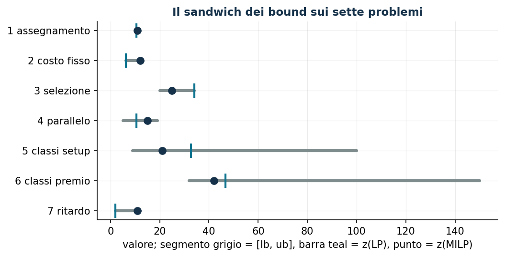

# Assegnamento e scheduling

**Classe:** BIP / MILP · **Script:** `python/fam07_scheduling.py`

Sette problemi con lo stesso scheletro: dei **lavori** vanno assegnati a delle
**macchine** con disponibilità limitata. Cambia, di problema in problema, che
cosa si paga e che cosa si decide: il costo dell'assegnamento, il costo fisso di
ogni macchina accesa, il ricavo dei lavori che si scelgono di eseguire, il tempo
di lavorazione quando i lavori vanno in parallelo, il setup di una classe di
lavori, un premio che si incassa *se e solo se* una classe è completa, il
ritardo rispetto alle scadenze quando i lavori si susseguono su una sola macchina.

!!! note "I legami fra variabili che si rivedono qui"
    **Attivazione** (7.2, 7.3, 7.5): la binaria «macchina usata» o «classe
    attivata» che comanda le assegnazioni, con il vincolo aggregato
    $\sum_j t_{jm} x_{jm} \le a_m y_m$ o disaggregato $x_j \le y_c$.
    **Variabile di massimo** (7.4): $y_m \ge t_{jm} x_{jm}$ per ogni lavoro,
    che all'ottimo vale esattamente il massimo. **Se e solo se** (7.6): un
    verso lo impone il vincolo, l'altro l'obiettivo. **Big-M e disgiunzioni**
    (7.7): «o $j$ prima di $i$ o $i$ prima di $j$», con $M$ pari alla somma dei
    tempi.

## Notazione della famiglia

| Simbolo | Tipo | Significato |
|---|---|---|
| $n$ | $\in \mathbb{Z}_{\ge 1}$ | numero di lavori, $j \in \{1, 2, \dots, n\}$ |
| $k$ | $\in \mathbb{Z}_{\ge 1}$ | numero di macchine, $m \in \{1, 2, \dots, k\}$ |
| $t_{jm}$ | $\in \mathbb{Q}_{>0}$ | tempo di lavorazione (minuti) del lavoro $j$ sulla macchina $m$; $t_j$ se non dipende dalla macchina |
| $c_{jm}$ | $\in \mathbb{Q}_{>0}$ | costo (euro) di eseguire il lavoro $j$ sulla macchina $m$ |
| $c_m$ | $\in \mathbb{Q}_{>0}$ | costo fisso (euro) se la macchina $m$ viene usata |
| $a_m$ | $\in \mathbb{Q}_{>0}$ | disponibilità (minuti) della macchina $m$; $a$ se la macchina è una sola |
| $p_m$ | $\in \mathbb{Z}_{\ge 1}$ | numero massimo di lavori che la macchina $m$ può eseguire |
| $r_j$ | $\in \mathbb{Q}_{>0}$ | ricavo (euro) se il lavoro $j$ viene eseguito |
| $d_j$ | $\in \mathbb{Q}_{>0}$ | scadenza (minuti) del lavoro $j$ |
| $q$ | $\in \mathbb{Z}_{\ge 2}$ | numero di classi di lavori, $c \in \{1, 2, \dots, q\}$ |
| $\mathscr{J}_c$ | $\subseteq \{1, 2, \dots, n\}$ | lavori della classe $c$; le classi partizionano i lavori |
| $f_c,\ s_c$ | $\in \mathbb{Q}_{\ge 0}$ | costo (euro) e tempo (minuti) di setup della classe $c$ |
| $v_c$ | $\in \mathbb{Q}_{>0}$ | premio (euro) se tutti i lavori della classe $c$ sono eseguiti |
| $u$ | $\in \mathbb{Q}_{>0}$ | riduzione (minuti) della disponibilità se si eseguono lavori di almeno due classi |

## I sette problemi

-   **7.1 Assegnamento a costo minimo**

    ---

    Ogni lavoro su una macchina, disponibilità rispettata, costo minimo: il
    problema di assegnamento generalizzato. Una sola famiglia di variabili.

    [:octicons-arrow-right-24: BIP](scheduling-1.md)

-   **7.2 Macchine con costo fisso**

    ---

    Si paga la macchina accesa, non l'assegnamento: nascono le variabili di
    attivazione e il primo legame da dimostrare.

    [:octicons-arrow-right-24: BIP · attivazione](scheduling-2.md)

-   **7.3 Selezione di lavori**

    ---

    I lavori hanno un ricavo e non sono obbligatori: un problema di massimo, in
    cui euristica e duale si scambiano i ruoli.

    [:octicons-arrow-right-24: BIP · attivazione](scheduling-3.md)

-   **7.4 Lavori in parallelo**

    ---

    Il tempo di una macchina è il massimo dei tempi dei suoi lavori: la
    variabile «massimo» e la sua caratterizzazione in tre passi.

    [:octicons-arrow-right-24: MILP · massimo](scheduling-4.md)

-   **7.5 Classi con setup**

    ---

    Uno zaino con costi e tempi fissi per gruppo: l'attivazione disaggregata,
    dedotta dalla CNF di un'implicazione booleana.

    [:octicons-arrow-right-24: BIP · attivazione, CNF](scheduling-5.md)

-   **7.6 Classi con premio**

    ---

    Un premio se la classe è completa, una penalità se si mescolano classi: due
    «se e solo se», ognuno imposto per metà dai vincoli e per metà dall'ottimo.

    [:octicons-arrow-right-24: BIP · se e solo se](scheduling-6.md)

-   **7.7 Ritardo totale**

    ---

    Una sola macchina, una sequenza: precedenze binarie, completamenti, ritardi
    e il big-M che «spegne» un vincolo.

    [:octicons-arrow-right-24: MILP · big-M](scheduling-7.md)

## Il quadro dei bound

| Problema | euristica | duale a mano | $z(\mathrm{LP})$ | $z(\mathrm{LP}^+)$ | $z(\mathrm{MILP})$ |
|---|---:|---:|---:|---:|---:|
| 7.1 assegnamento a costo minimo | 11 | 10 | $53/5$ | $53/5$ | 11 |
| 7.2 macchine con costo fisso | 12 | $25/4$ | $25/4$ | $1273/200$ | 12 |
| 7.3 selezione di lavori (max) | 20 | 34 | 34 | $680/21$ | 25 |
| 7.4 lavori in parallelo | 19 | 5 | $520/49$ | $520/49$ | 15 |
| 7.5 classi con setup (max) | 9 | 100 | $425/13$ | $329/13$ | 21 |
| 7.6 classi con premio (max) | 32 | 150 | $5280/113$ | $5280/113$ | 42 |
| 7.7 ritardo totale | 12 | 2 | 2 | 2 | 11 |

$z(\mathrm{LP})$ è il rilassamento «puro», in cui $x \in \{0,1\}$ diventa
$x \ge 0$: è quello di cui negli esercizi si scrive il duale, e il suo ottimo
coincide con l'ottimo del duale (dualità forte). $z(\mathrm{LP}^+)$ è il
rilassamento rafforzato con $x \le 1$, quello che il solver risolve alla radice.
Nei problemi 7.2 e 7.3 la soluzione duale costruita a mano è *ottima* per il
rilassamento puro; nei problemi 7.1 e 7.2 l'euristica trova l'ottimo, ma lo si
sa solo dopo aver risolto il MILP.

